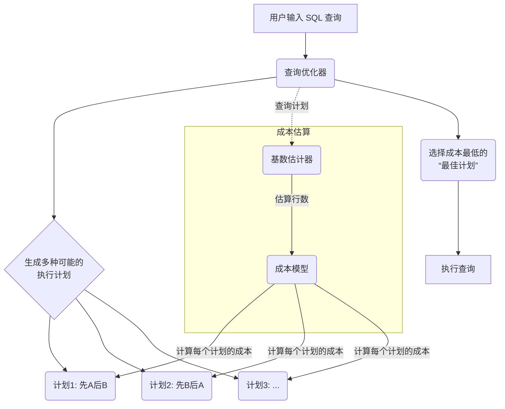
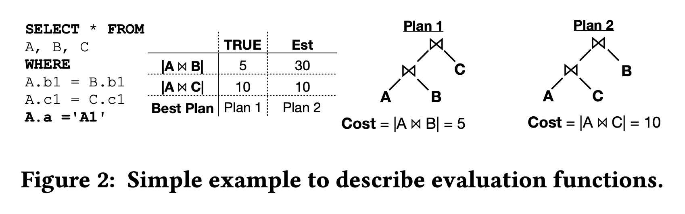
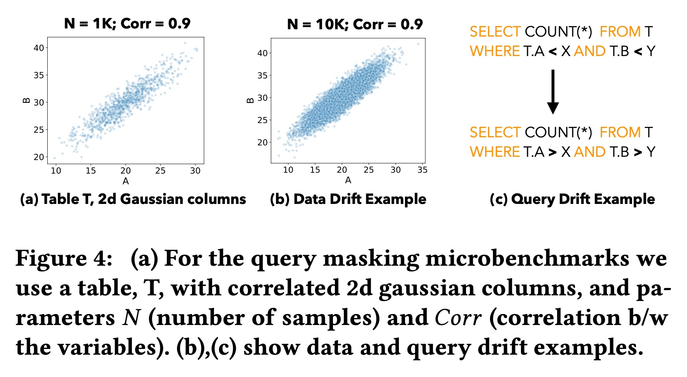
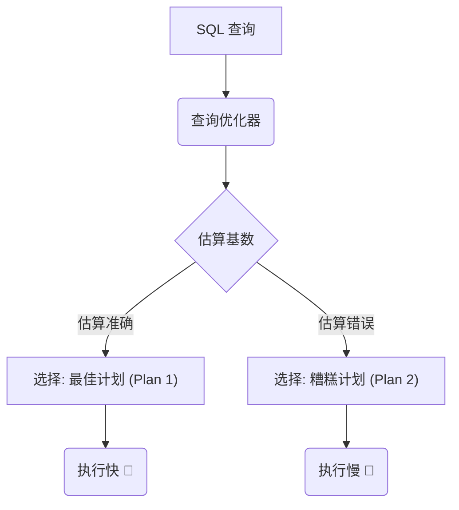
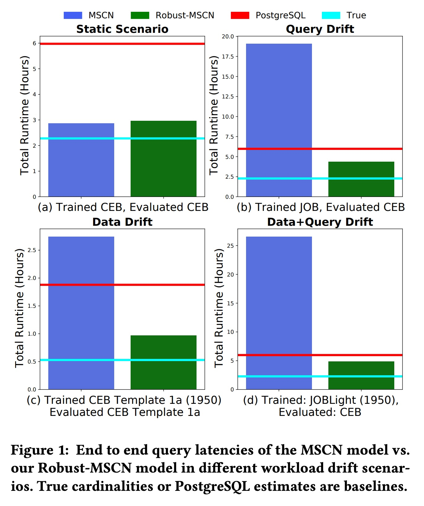
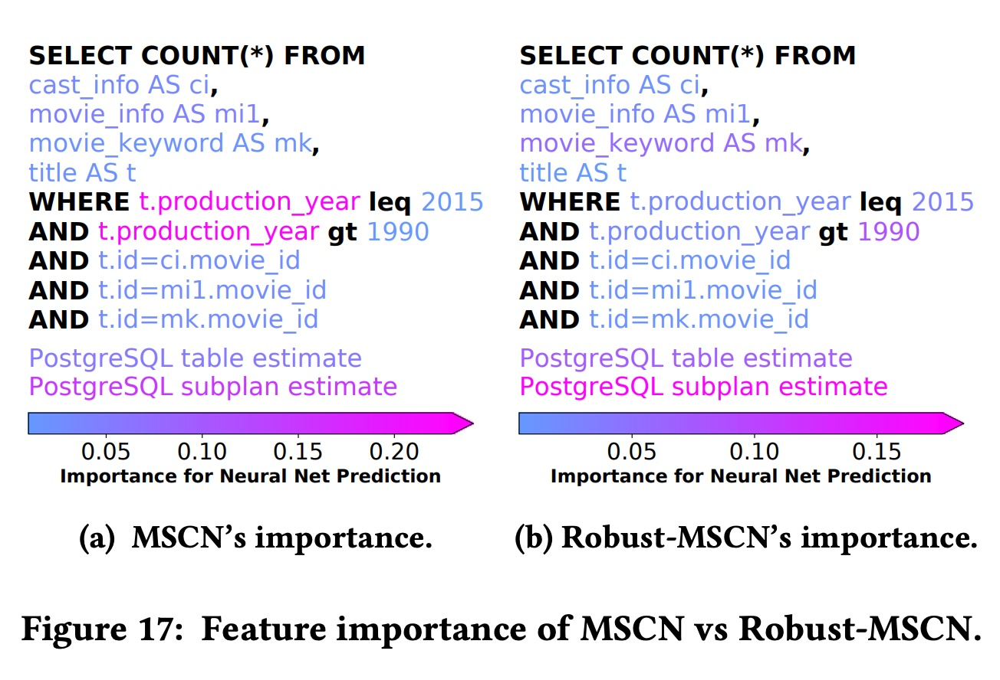
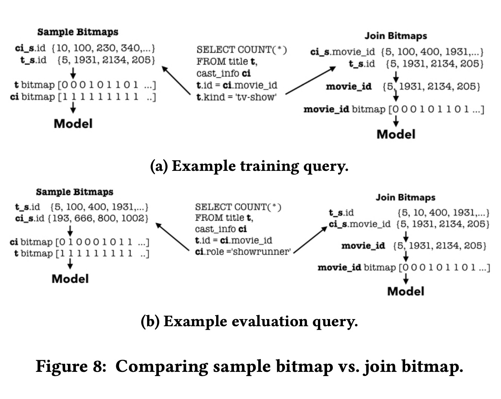
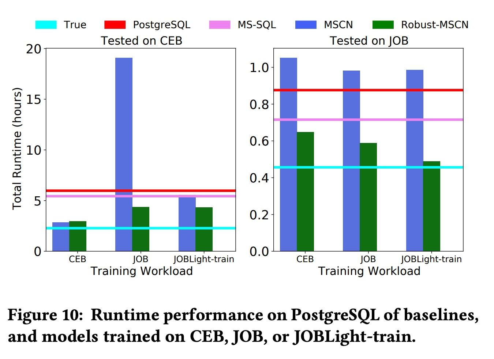

## AI论文解读 | Robust Query Driven Cardinality Estimation under Changing Workloads
        
### 作者        
digoal        
        
### 日期        
2025-10-21        
        
### 标签        
PostgreSQL , PolarDB , DuckDB , AI , 论文解读        
        
----        
        
## 背景  
      
https://www.vldb.org/pvldb/vol16/p1520-negi.pdf        
  
提示:          
```          
读懂《Robust Query Driven Cardinality Estimation under Changing Workloads》这篇论文需要提前掌握哪些基础知识, 请使用中文通熟易懂的讲解这些基础知识, 可以引用论文中的图、表或使用Markdown支持的图形(text,mermaid等)增加解释性. 
  
使用中文通熟易懂的解读《Robust Query Driven Cardinality Estimation under Changing Workloads》这篇论文, 其中的关键内容请着重讲解, 可以引用论文中的图、表或使用Markdown支持的图形(text,mermaid等)增加解释性. 
  
提取《Robust Query Driven Cardinality Estimation under Changing Workloads》这篇论文中的重要术语, 使用中文对这些术语进行通熟易懂的讲解, 可以引用论文中的图、表或使用Markdown支持的图形(text,mermaid等)增加解释性. 
```     
  
## 1 前置知识 
  
要读懂《Robust Query Driven Cardinality Estimation under Changing Workloads》（在变化的工作负载下进行鲁棒的查询驱动基数估计）这篇论文，你需要先了解一些数据库和机器学习的基础概念。这篇论文的核心是解决一个问题：**如何让数据库更准确地“猜出”一个查询（Query）会返回多少行数据（即“基数”），即便查询的模式或数据本身发生了变化。**

以下是你需要掌握的基础知识点，我会用通俗的语言并结合论文中的图示来解释。

-----

### 知识点 1: 什么是查询优化器 (Query Optimizer)？

在数据库（比如 PostgreSQL）中，当你输入一句 SQL 查询时，数据库并不会马上开始执行。它会先启动一个叫做“查询优化器”的组件。

  * **同一句SQL，多种执行方法**：完成一个查询可以有很多种方法，称为“执行计划”（Query Plan）。例如，当连接（JOIN）两张表 A 和 B 时，可以先扫描 A 再扫描 B，也可以反过来；或者可以使用不同的连接算法（如 Hash Join, Nested Loop Join）。
  * **成本估算 (Cost Model)**：优化器的任务是从所有可能的执行计划中，挑选一个它认为 **最快（成本最低）** 的计划。
  * **这个过程就像**：你用地图导航，输入起点和终点（SQL查询），导航系统（优化器）会计算出多条路线（执行计划），比如“走高速”或“走国道”，然后根据路况和距离（成本估算）推荐一条“最快”的路线（最佳计划）给你。

这个过程可以用一个流程图来表示：



### 知识点 2: 什么是基数估计 (Cardinality Estimation)？

这是这篇论文要解决的核心问题。

**基数（Cardinality）** 就是指一个查询或查询的某个中间步骤会返回的数据行数 。

**基数估计（Cardinality Estimation）** 就是查询优化器在**执行前**对这个行数进行的“猜测”。

这个“猜测”至关重要，因为它是“成本估算”的基础。如果猜错了，优化器就可能选错执行计划。

  * **论文中的例子 (Figure 2)** ：    
      * 假设要连接 A、B、C 三张表。
      * **Plan 1 (最佳计划)**：先连接 A 和 B，真实（TRUE）成本是 5 。
      * **Plan 2 (次优计划)**：先连接 A 和 C，真实成本是 10 。
      * 数据库的估计器（'Est'）错误地估计 Plan 1 的成本是 30 ，远高于 Plan 2 的成本 10 。
      * **结果**：优化器**错误地选择**了 Plan 2 ，导致查询变慢。

这就是为什么基数估计如此重要：**估算不准，满盘皆输**。

传统数据库（如PostgreSQL）的估计器为了快，做了很多简化的假设（比如假设列与列之间没有关联），这导致它们经常出错。

### 知识点 3: 什么是“查询驱动” (Query Driven) 的机器学习方法？

为了更准确地“猜测”，研究人员开始使用机器学习（ML）。ML模型可以学习数据中复杂的关联，估算得更准 。ML方法主要分两种：

1.  **数据驱动 (Data Driven)**：

      * **方法**：学习整个数据库的联合概率分布 。
      * **比喻**：像一个人口普查员，试图了解数据库里每个数据的详细情况和它们之间的所有关系。
      * **缺点**：模型非常大，训练和推理（猜测）都很慢 。

2.  **查询驱动 (Query Driven)**：（*本文的焦点*）

      * **方法**：它不关心数据长什么样，而是从**历史查询日志**中学习 。它学习的是一个“从查询到基数”的映射关系 。
      * **比喻**：像一个经验丰富的客服，通过学习“过去客户问过的问题（历史查询）”和“对应的答案（真实基数）”，来快速回答新问题。
      * **优点**：模型轻量、训练快、推理快 。

### 知识点 4: 什么是“工作负载漂移” (Workload Drift)？

这是“查询驱动”方法的最大痛点，也是本文要解决的**核心挑战** 。

**工作负载漂移** 指的是现在的查询或数据，和训练模型时用的历史日志**不再一样了** 。这会导致模型性能急剧下降 。

这篇论文关注两种漂移：

1.  **数据漂移 (Data Drift)**：

      * **含义**：数据被更新了（比如插入了新数据）。
      * **论文中的例子 (Figure 4b)** ：模型是用只有 1000 行数据（N=1K）的表训练的，但现在这张表增长到了 10000 行（N=10K）。    
      * **问题**：模型在训练时没见过这么大的数据量，它的“经验”过时了，估算会错得离谱 。

2.  **查询漂移 (Query Drift)**：

      * **含义**：查询的模式变了。比如，开始查询新的列、新的表，或者使用了新的过滤条件 。
      * **论文中的例子 (Figure 4c)** ：模型训练时，只见过 `WHERE T.A < X`（小于）这样的查询 。    
      * **问题**：当一个新查询使用 `WHERE T.A > X`（大于）时，模型就“懵了” 。它在训练数据里没见过这个模式，不知道怎么猜 。

**为什么会失败？** 论文指出，模型在训练时“偷懒”了。它发现仅靠“查询语句”本身（比如看到 `T.A < X`）就足以在*训练数据上*猜对答案，于是它学会了**过度依赖这些查询特征**，而**忽略了**数据库本身提供的、会实时更新的统计信息（DBMS statistics）。一旦查询特征变了（发生漂移），模型就彻底失效了。

-----

### 总结：你需要具备的知识

要理解这篇论文，你需要先明白：

1.  **查询优化**：数据库会估算成本来选择最佳执行计划。
2.  **基数估计**：估算行数是成本估算的核心，估不准会导致计划选错（如 Figure 2 所示）。    
3.  **ML方法**：用ML估算更准，其中“查询驱动”方法轻快但脆弱。
4.  **工作负载漂移**：“查询驱动”方法的最大敌人，包括**数据漂移**（数据变了）和**查询漂移**（查询模式变了）（如 Figure 4 所示）。    

这篇论文的贡献，就是提出了新的训练技巧（如“查询掩码”）和新的特征（如“连接位图”），来迫使模型在训练时不过度依赖查询特征，而是学会利用更鲁棒的数据库统计信息 ，从而在面对“工作负载漂移”时依然能做出准确的估计。
  
## 2 解读论文 
  
这是一篇关于数据库查询优化的重要论文。简单来说，它的核心贡献是解决了一个长期困扰机器学习（ML）数据库模型的“老大难”问题：**如何让模型在数据或查询模式发生变化（即“工作负载漂移”）时，依然能做出准确的估算，而不会“翻车”得比传统方法还惨。**

这篇论文的全称是《在变化的工作负载下进行鲁棒的查询驱动基数估计》。

-----

### 1\. 问题背景：为什么数据库需要“猜”？

在数据库（如 PostgreSQL）中，当你执行一句 SQL 查询时，数据库的“大脑”——**查询优化器** (Query Optimizer) ——会先启动 。它的工作不是马上执行，而是先找出成百上千种可能的执行方式（比如先 join A 表和 B 表，还是先 join B 表和 C 表），然后估算每种方式的“成本”（大概要花多少时间）。

这个“估算成本”过程中，最关键的一步就是**基数估计** (Cardinality Estimation) 。“基数”就是指一个查询（或中间步骤）会返回多少行数据。

这个“猜”的数字（基数）至关重要。如果猜错了，优化器就可能选出一个极其糟糕的执行计划，导致查询时间从几秒钟变成几小时 。

**论文中的 Figure 2** 就展示了这一点：    

  * **真实情况 (TRUE)**：最佳计划 Plan 1 成本为 5。
  * **估计器 (Est) 瞎猜**：它错误地估计 Plan 1 成本为 30，远高于 Plan 2 的成本 10。
  * **灾难性后果**：优化器**错误地选择**了 Plan 2，导致执行成本（10）是最佳计划（5）的**两倍** 。




### 2\. 现有方法的困境：“查询驱动”模型的“阿喀琉斯之踵”

为了“猜”得更准，研究人员引入了机器学习。ML 模型分为两大流派：

1.  **数据驱动 (Data Driven)**：学习整个数据库的概率分布 。
      * **优点**：非常准。
      * **缺点**：模型巨大，训练和推理（估算）都极慢 。
2.  **查询驱动 (Query Driven)**：从“历史查询日志”中学习 。
      * **优点**：模型轻量、训练快、估算快，非常灵活 。
      * **缺点（致命的）** ：它们极其**脆弱**。一旦现实世界的查询或数据发生变化（即 **工作负载漂移 (Workload Drift)**），它们的表现会急剧下降，甚至变得不可预测 。

这篇论文**聚焦于解决“查询驱动”模型的这个致命缺点**。

**什么是工作负载漂移？**

  * **查询漂移 (Query Drift)**：查询模式变了。比如训练时都是查 A、B 表，现在突然开始查 C、D 表了；或者训练时都是 `WHERE year < 2000`，现在都查 `WHERE year > 2010` 。
  * **数据漂移 (Data Drift)**：数据更新了。比如训练时用的是 1950 年的数据，现在数据库里装满了 2020 年的数据 。

**Figure 1** 完美地展示了这个问题：    

  * **MSCN** (蓝色)：代表旧的“查询驱动”模型。
  * **Robust-MSCN** (绿色)：代表本文提出的新模型。
  * **PostgreSQL** (红色线)：传统数据库的估计器（我们的底线）。
  * **True** (青色线)：理论最佳性能。

  * **(a) 静态场景**：没有漂移。MSCN（蓝色）和 Robust-MSCN（绿色）都很好。
  * **(b) 查询漂移**：MSCN（蓝色） **彻底崩溃**，总运行时间（Total Runtime）飙升到 20 小时，比 PostgreSQL（红色线）的 6 小时**慢了 3 倍多**！
  * **(c) 数据漂移** 和 **(d) 数据+查询漂移**：MSCN 同样崩溃了 。
  * **本文的模型 (Robust-MSCN)**：在所有漂移场景下，始终保持稳健，并且**始终优于 PostgreSQL** 。

### 3\. 核心思想与解决方案

这篇论文的作者发现，MSCN 之所以会崩溃，是因为它在训练时“偷懒”了。它发现仅仅依靠“查询特征”（比如 SQL 文本里出现了哪些表名或列名）就足以在*训练集*上取得好成绩 。因此，它**过度依赖这些查询特征**，而**忽略了**数据库本身提供的、会实时更新的统计信息（DBMS statistics）。

一旦发生漂移（比如查询了新的列），查询特征就“失灵”了，模型自然就崩溃了 。

**本文的核心思想**：我们不应该训练一个“独立的估算器”，而应该训练一个“**DBMS 估算器的修正器**” 。我们要强迫模型去学习“PostgreSQL 在哪些地方容易犯错”以及“如何修正这些错误”，而不是让模型从头开始猜。

为此，他们提出了两大关键技术：

#### 关键技术一：查询掩码 (Query Masking)

这是本文最核心的创新点。

  * **做法**：在训练模型时，**随机地“遮住” (mask) 一部分查询特征**（比如随机丢掉 20% 的表名或列名信息）。
  * **目的**：这就像是“自断手脚”，**强迫**模型不能再依赖那些可能“过时”的查询特征 。
  * **效果**：模型被逼无奈，只能去学习如何更好地利用那些“永远不会被遮住”的、更可靠的特征——即**数据库自己提供的（会实时更新的）统计信息（Data Features）** 。

**打个比方**：

  * **旧模型 (MSCN)**：像个只会背题库的学生。考试（训练集）时，他发现只要记住“题目中有A”，答案就选C。结果联考（漂移）时，题目换成了“B”，他就懵了。
  * **新模型 (Robust-MSCN)**：我们在他背题库时，随机把题目涂黑（Masking）。他没法背题，只能被迫去学习真正的“解题公式”（即 DBMS 统计信息）。这样无论题目怎么变，他都能用公式解题。

**Figure 17** 的特征重要性分析完美证明了这一点：    

  * **(a) MSCN**：它认为 `t.production_year`（一个查询特征）非常重要 。如果数据更新了，这个特征就过时了。
  * **(b) Robust-MSCN**：它学会了**最依赖 `PostgreSQL Estimate`（DBMS 统计信息）** 。这个特征是会随数据更新而更新的，因此模型变得非常鲁棒。

#### 关键技术二：连接位图 (Join Bitmaps)

查询驱动模型通常会使用“采样”（Sampling）来感知数据。传统方法（Sample Bitmaps）是对每张表**独立**采样，这导致它无法捕获**跨表连接（JOIN）时的相关性** 。

  * **做法**：本文提出了“连接位图” (Join Bitmaps) 。它不再独立采样，而是利用数据库的“主键-外键”关系，在 JOIN 键上进行**相关采样** (Correlated Sampling) 。
  * **效果**：如 **Figure 8** 所示，当一个过滤器（`t.kind`）应用在表 `t` 上时，Join Bitmaps (右侧) 能通过 JOIN 键 `movie_id`，将这个过滤效果正确地“传递”到 `cast_info` 表的采样上。而 Sample Bitmaps (左侧) 则完全丢失了这种跨表关联 。这使得模型对 JOIN 的估算更准。    

#### 适应数据更新

当数据发生更新时（Data Drift），本文的模型可以：

1.  **喂入最新的 DBMS 统计信息** 。
2.  **更新采样的 Join Bitmaps** 。
    模型在训练时已经学会了如何“修正”这些信息，所以即使数据变了，它学到的“修正模式”（比如“PostgreSQL 总是低估A和B的相关性”）大概率依然有效 。

### 4\. 惊艳的实验结果

除了 Figure 1 展示的鲁棒性外，还有一个非常惊人的结果：    

**用“简单训练集”打败“复杂测试集”** 。

  * **训练集 (JOBLight-train)**：一个非常简单的工作负载，只包含 4 万个最多 3 张表连接的查询 。
  * **测试集 (JOB)**：一个极其复杂的工作负载，包含多达 16 张表的连接 。

如 **Figure 10 (右图)** 所示：    

  * MSCN（蓝色）在 JOB 上的表现比 PostgreSQL（红色线）更差。
  * 而 **Robust-MSCN（绿色）** ，**即使只用简单的 JOBLight-train 训练**，它在复杂 JOB 上的表现**依然超越了 PostgreSQL** 。

**为什么能做到？** 因为模型从简单的查询中学会了“修正 DBMS 错误”的**通用规则**（比如修正相关列的估算）。当它在复杂的查询中遇到类似的模式时，这个规则依然适用 。

### 总结

这篇论文的真正贡献，不是提出了一个全新的模型，而是提出了一个**鲁棒的训练框架**（以 Query Masking 为核心）。它向我们证明了，查询驱动模型“脆弱”的命运是可以改变的。通过“强迫”模型去学习如何“修正”而不是“替代”传统的 DBMS 估计器，我们可以两全其美：既获得了 ML 模型的准确性，又保留了传统估计器的鲁棒性，使其在真实多变（漂移）的数据库环境中真正变得实用、可靠 。
  
## 3 术语 
  
以下是《Robust Query Driven Cardinality Estimation under Changing Workloads》这篇论文中的一些关键术语及其通俗易懂的中文讲解。

-----

### 1\. 基数估计 (Cardinality Estimation)

  * **讲解：** “基数” (Cardinality) 指的是数据库执行一个查询（或查询的某个中间步骤）时，预计会返回的数据**行数** 。
  * **通俗解释：** 这就像在超市结账前，收银员“猜测”你购物车里有多少件商品。
  * **为什么重要：** 数据库的“查询优化器”  需要这个“猜测”来选择最快的执行计划。如果猜错了（比如把 100 行猜成 100 万行），优化器就可能选错路，导致查询速度从几秒钟变成几小时 。
  * **论文图示 (Figure 2) ：** 这个图展示了估算错误（'Est'）如何导致优化器选错了计划（选择了 Plan 2 而不是最佳的 Plan 1），最终导致了更高的成本 。    

### 2\. 查询驱动 (Query Driven) vs. 数据驱动 (Data Driven)

这是两种使用机器学习（ML）来进行基数估计的主流方法 。

  * **数据驱动 (Data Driven)：**

      * **讲解：** 这种方法试图学习数据库中**所有数据的联合概率分布** 。
      * **通俗解释：** 像一个人口普查员，试图了解数据库里每个数据的详细情况和它们之间的所有关联关系。
      * **缺点：** 模型通常非常大，而且训练和推理（估算）速度很慢 。

  * **查询驱动 (Query Driven)：**（*本文的焦点*）

      * **讲解：** 这种方法不直接学习数据，而是从**历史查询日志**中学习 。它学习的是一个“从查询语句到其对应基数”的映射关系。
      * **通俗解释：** 像一个经验丰富的客服，通过学习“过去客户问过的问题（历史查询）”和“对应的答案（真实基数）”，来快速回答新问题。
      * **优点：** 模型轻量、训练快、推理快 。
      * **缺点：** 极其依赖训练数据，一旦遇到没见过的查询模式或数据变化，就容易“翻车” 。

### 3\. 工作负载漂移 (Workload Drift)

  * **讲解：** 这是查询驱动模型最大的痛点 。它指的是当前的查询或数据，与训练模型时用的历史日志**不再一样了** 。

  * **通俗解释：** 还是那个客服（查询驱动模型），他只学了如何处理“退货”问题。突然有一天，客户开始大量询问“安装”问题（查询漂移），或者“退货”政策本身更新了（数据漂移），这个客服就懵了。

  * **论文中的分类：**       

    ```mermaid
    graph TD
        A(工作负载漂移 <br> Workload Drift ) --> B(查询漂移 <br> Query Drift );
        A --> C(数据漂移 <br> Data Drift );
        B --> B1(查询了新的表或列 );
        B --> B2("查询了新的过滤条件 <br> (例如 Fig.4c 中从 '<' 变为 '>') ");
        C --> C1(数据被更新 );
        C --> C2("插入了新数据 <br> (例如 Fig.4b 中 N 从 1K 变为 10K) ");
    ```

  * **论文图示 (Figure 1) ：** 这个图直观地展示了“漂移”的危害。在(b)、(c)、(d)三个漂移场景中，传统模型 MSCN (蓝色柱) 的性能急剧下降，变得比 PostgreSQL（红色线）还要糟糕得多 。    

### 4\. 查询特征 (Query Features) vs. 数据特征 (Data Features)

为了让 ML 模型能“读懂” SQL 查询，需要把查询转化成它能理解的“特征”（即数字）。

  * **查询特征 (Query Features)：**

      * **讲解：** 从 SQL 查询语句**文本本身**提取的信息 。
      * **例子：** 查询涉及了哪些表、哪些列、哪些 JOIN 条件 。
      * **缺点：** 在“查询漂移”时非常脆弱。如果模型训练时没见过某个列，那这个特征就是 0，模型无法从中获取任何有用信息 。

  * **数据特征 (Data Features)：**

      * **讲解：** 来自数据库内部的、**反映当前数据状态**的特征 。
      * **关键例子：** 论文中特指**传统 DBMS 估计器（如 PostgreSQL）自己的估算结果** 。
      * **优点：** 这种特征是“鲁棒”的。即使查询了新列，DBMS 依然能利用它的统计信息（如直方图）给出一个估算 。这个估算会随数据更新而更新 。

### 5\. 查询掩码 (Query Masking)

  * **讲解：** 这是本文提出的**核心训练技巧**，用于提升模型鲁棒性 。
  * **做法：** 在训练模型时，**故意随机地“遮住” (masking) 或“丢弃” (zero out) 一部分查询特征** 。
  * **通俗解释：** 这就像是在训练一个学生时，故意把练习题的某些已知条件涂黑。
  * **目的与效果：** 这种做法**强迫 (forces)** 模型不能过度依赖那些脆弱的“查询特征”（被涂黑的条件），而是必须学会**更多地依赖**那些永远可靠的“数据特征”（即 DBMS 的估算结果）。
  * **论文图示 (Figure 17) ：** 这个图显示了特征的重要性。普通 MSCN (a) 依赖查询特征（如 `t.production_year`），而本文的 Robust-MSCN (b) 学会了 **最依赖 `PostgreSQL Estimate`（数据特征）** ，这证明了 Masking 的有效性。    

### 6\. 连接位图 (Join Bitmaps)

  * **讲解：** 这是本文提出的另一种新技术，用于改进“采样特征”，以更好地捕捉 JOIN 操作中的相关性 。
  * **背景 (Sample Bitmaps)：** 传统方法（采样位图）是为**每张表独立采样** 。这导致它无法感知**跨表 JOIN 时的相关性** 。
  * **连接位图 (Join Bitmaps) 做法：** 它不再独立采样，而是利用数据库的“主键-外键”关系，在 JOIN 键上进行**相关采样** (Correlated Sampling) 。
  * **通俗解释：**
      * *传统方法：* 为了解 A 公司和 B 公司的员工情况，随机抽了 A 公司的 10 个人和 B 公司的 10 个人。他们之间可能根本没关系。
      * *连接位图：* 先随机抽了 A 公司的 10 个项目，然后**顺藤摸瓜**，去找 B 公司参与了**这 10 个项目**的员工。这样采样到的两组人就有了真实的连接关系。
  * **论文图示 (Figure 8) ：** 该图对比了两种方法。当过滤器 `t.kind = 'tv-show'` 应用在 `title` 表时 (a)，Join Bitmaps (右侧) 能通过 `movie_id` 键将这个过滤效果正确地“传递”到 `cast_info` 表的采样上，而 Sample Bitmaps (左侧) 则不行。   

### 7\. Q-Error

  * **讲解：** 一种衡量基数估计**错误程度**的常用指标 。
  * **公式：** $Q-Error = \max(\frac{y}{\hat{y}}, \frac{\hat{y}}{y})$ 。
      * $y$ 是真实基数（真实行数）。
      * $\hat{y}$ 是估计基数（猜测行数）。
  * **通俗解释：** 这个值表示“你猜的数”和“真实的数”之间差了多少倍（取那个较差的倍数）。
  * **举例 (来自 Figure 2)：** 估计器（'Est'）对 A join B 猜了 30 ，真实是 5 。    
      * Q-Error = $\max(30/5, 5/30) = \max(6, 0.16) = 6$ 。
  * **目标：** Q-Error 越接近 1，代表估算越准确。
  
## 参考        
         
https://www.vldb.org/pvldb/vol16/p1520-negi.pdf  
  
https://rmarcus.info/blog/        
        
<b> 以上内容基于DeepSeek、Qwen、Gemini及诸多AI生成, 轻微人工调整, 感谢杭州深度求索人工智能、阿里云、Google等公司. </b>        
        
<b> AI 生成的内容请自行辨别正确性, 当然也多了些许踩坑的乐趣, 毕竟冒险是每个男人的天性.  </b>        
  
    
#### [期望 PostgreSQL|开源PolarDB 增加什么功能?](https://github.com/digoal/blog/issues/76 "269ac3d1c492e938c0191101c7238216")
  
  
#### [PolarDB 开源数据库](https://openpolardb.com/home "57258f76c37864c6e6d23383d05714ea")
  
  
#### [PolarDB 学习图谱](https://www.aliyun.com/database/openpolardb/activity "8642f60e04ed0c814bf9cb9677976bd4")
  
  
#### [PostgreSQL 解决方案集合](../201706/20170601_02.md "40cff096e9ed7122c512b35d8561d9c8")
  
  
#### [德哥 / digoal's Github - 公益是一辈子的事.](https://github.com/digoal/blog/blob/master/README.md "22709685feb7cab07d30f30387f0a9ae")
  
  
#### [About 德哥](https://github.com/digoal/blog/blob/master/me/readme.md "a37735981e7704886ffd590565582dd0")
  
  

  
