## AI论文解读 | AdaChain: A Learned Adaptive Blockchain
        
### 作者        
digoal        
        
### 日期        
2025-10-21        
        
### 标签        
PostgreSQL , PolarDB , DuckDB , AI , 论文解读        
        
----        
        
## 背景  
      
https://arxiv.org/pdf/2211.01580        
  
提示:          
```          
读懂《AdaChain: A Learned Adaptive Blockchain》这篇论文需要提前掌握哪些基础知识, 请使用中文通熟易懂的讲解这些基础知识, 可以引用论文中的图、表或使用Markdown支持的图形(text,mermaid等)增加解释性. 
  
使用中文通熟易懂的解读《AdaChain: A Learned Adaptive Blockchain》这篇论文, 其中的关键内容请着重讲解, 可以引用论文中的图、表或使用Markdown支持的图形(text,mermaid等)增加解释性. 
  
提取《AdaChain: A Learned Adaptive Blockchain》这篇论文中的重要术语, 使用中文对这些术语进行通熟易懂的讲解, 可以引用论文中的图、表或使用Markdown支持的图形(text,mermaid等)增加解释性. 
```     
  
## 1 前置知识 
  
要读懂《AdaChain: A Learned Adaptive Blockchain》这篇论文，你需要对几个关键领域有一个基本的了解。这篇论文的核心思想是：**创建一个能“学习”的区块链，使其可以根据当前工作任务（负载）的特点，自动切换到最适合的内部运行“架构”，以达到最快的处理速度** 。

想象一下你有一辆可以变形的汽车。在市区拥堵时，它变成一辆摩托车；在高速公路上，它变成一辆跑车；在乡间小路，它变成一辆越野车。AdaChain 就好比是这辆变形汽车的“自动驾驶大脑”，它会自己判断路况（工作负载），并指挥汽车变形（切换架构）。

要理解它是如何做到这一点的，你需要掌握以下几个基础知识点：

### 基础知识一：区块链，特别是“许可链” (Permissioned Blockchain)

你可能听说过比特币或以太坊，它们是“公有链”（Permissionless），任何人都可以加入。而这篇论文关注的是 **“许可链” (Permissioned Blockchain)** 。

  * **是什么？** 许可链是“私有的”或“联盟的”，只允许获得许可的成员（比如一个联盟内的几家银行或公司）加入 。
  * **为什么重要？** 因为成员是已知的，许可链不需要像比特币那样“挖矿”（工作量证明 PoW），而是使用更高效的“共识协议”（比如论文中提到的 Raft  或 PBFT ）。这使得它们速度更快，但也带来了新的性能挑战 。
  * **相关概念：BaaS (Blockchain-as-a-Service)** 。这就是论文的背景，指云服务商（如亚马逊、IBM）提供的区块链托管服务 。在 BaaS 环境中，各种不同的应用（智能合约）会同时运行，导致工作负载千变万化 。

### 基础知识二：区块链的“架构”与“工作负载”

这是理解本论文“为什么”要做的关键。

**1. 什么是“工作负载” (Workload)？**
简单说，就是区块链当前正在处理什么样的任务。论文根据几个特征来描述工作负载 ，如 **Table 2** 所示 ：  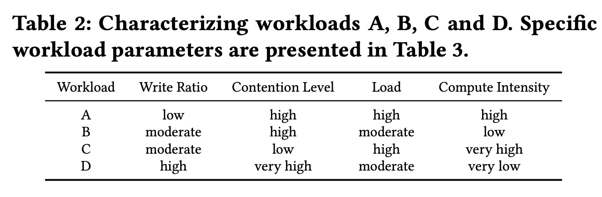  

  * **Write Ratio (写占比)**：任务主要是读取数据还是写入新数据？
  * **Contention Level (冲突等级)**：是不是有很多任务在同时“抢”同一个数据（比如修改同一个账户余额）？
  * **Compute Intensity (计算密集度)**：任务是简单的转账，还是需要复杂计算（比如机器学习）？

**2. 什么是“架构” (Architecture)？**
指区块链处理交易的“流水线” 。论文重点比较了基于不同步骤顺序的架构，主要涉及三个步骤：

  * **O (Order)**：对交易进行排序。
  * **X (Execute)**：执行交易（计算）。
  * **V (Validate)**：验证交易是否有效（比如是否冲突）。

不同的组合就形成了不同的架构，例如：

  * **OX (Order-Execute)**：先排序，再依次执行 。就像在银行排队，一个一个办理业务。好处是简单，不会出错（没有冲突），但如果某个任务很慢（计算密集），所有人都要等 。
  * **XOV (Execute-Order-Validate)**：先（并行）执行，再排序，最后验证 。就像大家先同时“尝试”办理业务，然后排序，最后银行检查谁的办理有效（比如账户余额足够）。在任务冲突少的时候非常快 ，但在冲突多（Contention High）的时候，大量“尝试”会失败，性能很差 。
  * **OXII (Order-Parallel Execute)**：先排序，然后分析依赖关系，最后“并行”执行那些互不相干的交易 。这在计算密集型任务上表现很好 。

**核心问题：** 没有任何一种架构是“万金油” 。
请看论文中的 **Figure 1** ，它清晰地展示了这一点：   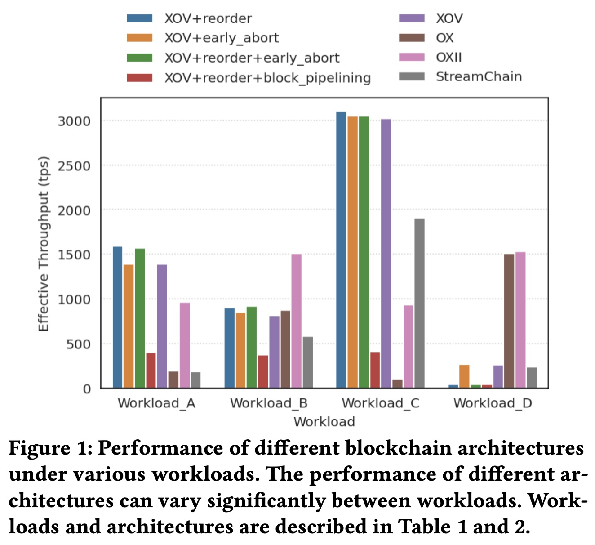  

  * 在 **Workload A**（高计算密集）下，`XOV+reorder` 架构吞吐量最高 。
  * 在 **Workload D**（高冲突、高写入）下，`OXII` 架构表现最好 。
  * 而 `XOV+reorder` 在 Workload D 下的性能几乎为零 。

**AdaChain 的目标**：动态地在这些架构（OX, XOV, OXII 等）之间切换，以便在任何工作负载下都能获得最佳性能 。

### 基础知识三：强化学习 (Reinforcement Learning)

这是 AdaChain 实现“自动驾驶大脑”的核心技术。

  * **是什么？** 强化学习（RL）是一种机器学习方法，系统（Agent）通过“试错”来学习 。它在一个环境中不断尝试“动作”（Action），并根据动作结果获得“奖励”（Reward），目标是学会一套策略以最大化长期总奖励。
  * **论文中的应用：**
      * **环境 (Environment)**：BaaS 平台和动态变化的工作负载。
      * **动作 (Action)**：选择一个区块链架构（比如 OX、XOV）及相关参数（比如区块大小）。
      * **奖励 (Reward)** ： **“有效吞吐量” (Effective Throughput)** ，即每秒成功提交的交易数量 。
  * **具体模型：上下文多臂老虎机 (Contextual Multi-Armed Bandit, CMAB)** 。
      * **通俗理解：** 想象你面前有一排老虎机（多臂老虎机），每个老虎机代表一种“区块链架构”（一个 "Arm"）。
      * **"Contextual"（上下文）** 指的是，你做选择时会先观察一下“上下文”，也就是当前的“工作负载特征”（写占比、冲突等级等）。
      * **目标：** 你需要不断在“探索”（尝试新架构）和“利用”（选择已知最好的架构）之间平衡 ，以尽快学会： **在当前这个上下文（Workload）下，拉动哪一台老虎机（Architecture），才能获得最高的奖励（Throughput）** 。
      * **算法：** 论文中使用了 **Thompson Sampling (汤普森采样)** ，这是一种高效解决 CMAB 问题的算法。

### 基础知识四：分布式系统与共识 (Consensus)

这是 AdaChain 实现“变形”的基础，即它如何安全地在所有节点上执行架构切换。

  * **问题：** 区块链是一个分布式系统，由多个服务器（Peers）组成 。当“大脑”（学习代理）决定要从架构 A 切换到架构 B 时，必须确保*所有*诚实的服务器都在*同一时刻*、*以同一种方式*完成切换。如果一些节点切了，另一些没切，或者切换时间不一致，整个系统的数据就会错乱 。
  * **挑战：** 系统中可能有节点宕机，或者存在恶意节点（拜占庭节点）。
  * **AdaChain 的解决方案：**
    1.  **切换协议 (Switching Protocol)**：AdaChain 设计了一套受 **PBFT (拜占庭容错)** 协议启发的共识机制 。
    2.  **Normal Path (正常路径)**：如 **Algorithm 1** 所示 ，所有节点会通过多轮投票（CHECKPOINT, PROPOSE, ACCEPT, COMMIT） 来就“下一个架构是什么”以及“在哪个区块高度开始切换”达成一致 。 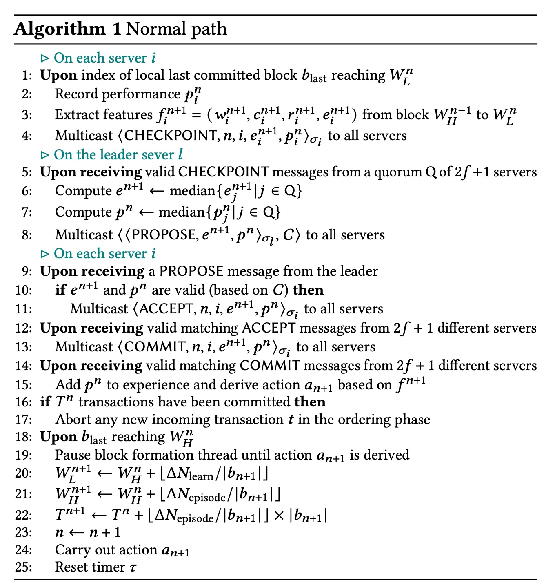  
    3.  **Slow Path (慢路径)**：如 **Algorithm 2** 所示 ，这是一个“保险丝”。如果当前的架构太糟糕，导致系统“卡住”了（例如，长时间无法提交新区块），系统会触发一个**超时机制 (timeout)** ，强制所有节点进入切换流程，换到一个新架构，避免系统“假死” 。 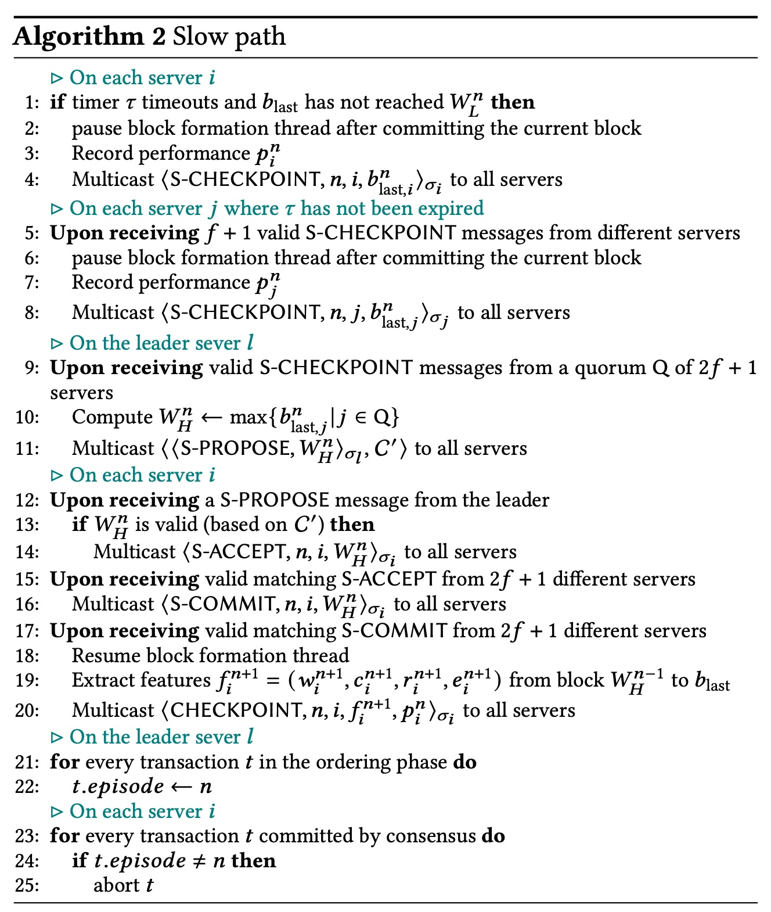  

### 总结：你需要的基础知识

为了帮助你理解 AdaChain，你可以使用下面这个流程图来串联这些知识：

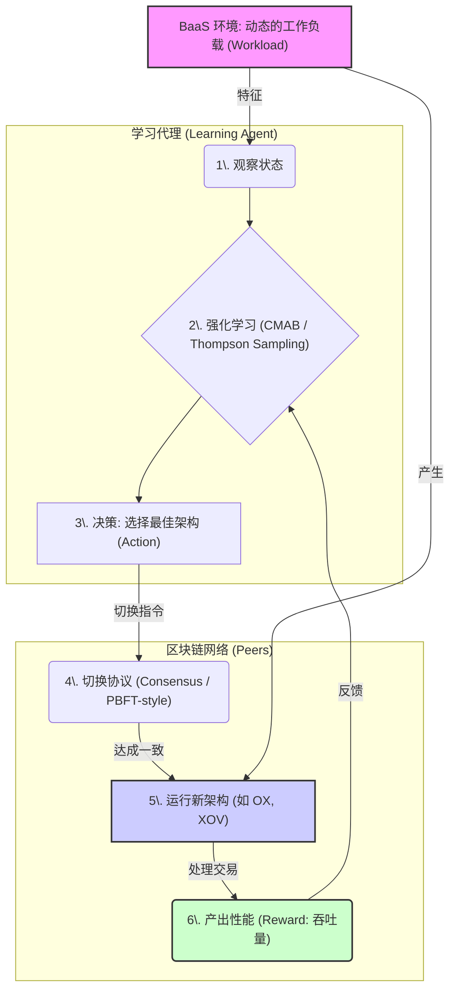

综上所述，要读懂这篇论文，你需要：

1.  了解 **BaaS 和许可链** 的基本概念。
2.  理解 **区块链架构 (OX, XOV 等)** 的区别，以及为什么 **工作负载（冲突、计算密集度等）** 会严重影响它们的性能（这是论文要解决的核心问题）。
3.  掌握 **强化学习** 的基本思想，特别是 **CMAB（上下文多臂老虎机）** 是如何通过“上下文-动作-奖励”的循环来学习的 。
4.  具备 **分布式共识** 的基础知识，明白为什么在多个节点间“同步做一件事”（比如切换架构）是困难的，以及为什么需要 PBFT 这样的机制来防范恶意节点 。
  
## 2 解读论文 
  
这是一篇关于 **《AdaChain：一个会学习的自适应区块链》** 的论文解读 。

简单来说，这篇论文解决了一个核心问题：**区块链的性能没有“万金油”设置**。某种架构（比如 Hyperledger Fabric）在处理A类任务时很快，但在处理B类任务时可能奇慢无比。AdaChain 就像一个“变形金刚”，它是一个能**实时学习**并 **自动“变形”** （切换架构）的区块链框架，确保系统总能以最高效的形态去应对当前的工作任务（即“工作负载”）。

### 1\. 核心问题：没有“万金油”的区块链架构

在区块链即服务 (BaaS) 平台上，运行着各种各样的应用，它们的工作负载（Workload）特性千差万别 。比如：

  * 有些任务是“计算密集型”（需要大量CPU计算）。
  * 有些任务是“高冲突型”（大量用户在抢着修改同一个数据）。
  * 有些任务是“高写入型”（不停地存新数据）。

为了应对这些情况，学术界和工业界设计了许多不同的区块链架构（如 OX, XOV, OXII）。这篇论文通过实验（见下图 Figure 1）证明了：**没有任何一种架构能在所有负载下都表现最好** 。

  

**图解：Figure 1 的直观解读** 

  * **Workload A（高计算）** ：`XOV+reorder` 架构（蓝色柱子）性能最好 。
  * **Workload D（高冲突）** ：`OXII` 架构（灰色柱子）性能最好 。
  * **灾难性对比**：在 Workload D 下，Workload A 的“冠军” (`XOV+reorder`) 性能几乎为零 。

**这就导致了一个窘境：** 一旦选定了一种架构（比如 Fabric），如果工作负载发生变化（比如从 A 切换到 D），系统性能就可能崩溃。而手动切换既困难又昂贵 。

### 2\. AdaChain 的解决方案：学习 + 切换

AdaChain 提出了一个框架，它能自动完成这一切。它的解决方案包含两个关键创新 ：

1.  **一个“学习大脑”** ：使用 **强化学习（RL）** 技术，实时分析当前的工作负载，预测哪种架构能带来最高的“有效吞吐量”（即每秒成功提交的交易数）。
2.  **一套“安全变形”机制**：设计了一套安全的**切换协议**，允许区块链系统在不宕机、不影响数据正确性（强可串行化）的前提下，在运行中从一个架构切换到另一个架构 。

#### 整体工作流程 (见 Figure 2)

AdaChain 的工作是周期性（按“episode”，即“回合”）进行的 。

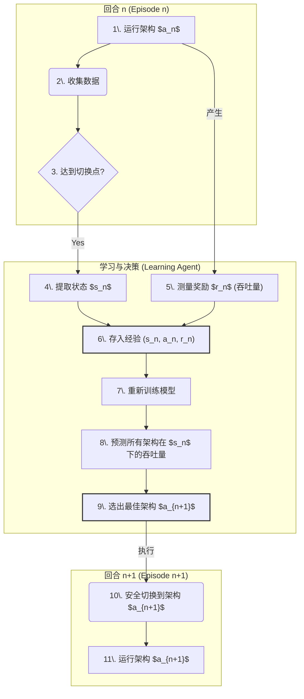

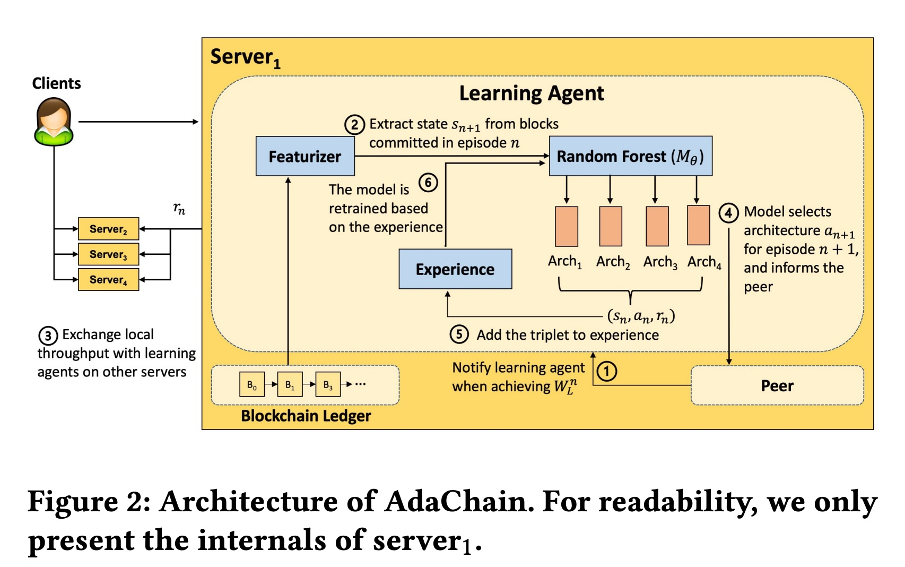  

*这个流程图是对论文 Figure 2 和 Section 3 中描述的步骤 的简化解读。*

### 3\. 关键内容一：“学习大脑” (强化学习)

AdaChain 将“选架构”问题建模为 **“上下文多臂老虎机”（Contextual Multi-Armed Bandit, CMAB）** 问题 。

  * **通俗理解：**
      * **“多臂老虎机” (Arms)**：指代每一种可选的区块链架构（比如 OX, XOV, OXII 等）。
      * **“上下文” (Context)**：指代当前的工作负载特征，也就是“状态” ( State, $s_n$ ) 。
      * **“奖励” ( Reward, $r_n$ )**：指代选定架构后，系统跑出来的“有效吞吐量” 。

**AdaChain 是如何定义“上下文”、“动作”和“奖励”的？**

1.  **状态 ( State $s_n$ ) - 即“上下文”** 
    AdaChain 的“学习大脑”会从区块链账本中提取4个关键特征来描述当前的工作负载 ：

      * **Write Ratio (写入比例)**：有多少交易是写入操作的 。
      * **Hot Key Ratio (热点比例)**：有多少交易在访问最“热”的那个数据（冲突程度）。
      * **Transaction Arrival Rate (交易到达率)**：系统有多忙 。
      * **Execution Delay (执行延迟)**：交易计算需要花多长时间（计算密集度）。

2.  **动作 ( Action $a_n$ ) - 即“拉哪台老虎机”** 
    AdaChain 不只是简单地选择“OX”或“XOV”。它将架构“特征化”为3个维度，组合起来形成动作空间 ：

      * **Block Size (区块大小)**：一个区块里装多少交易 。
      * **Early Execution (早期执行)**：是否采用 XOV 模式（先执行再排序）。
      * **Dependency Graph (依赖图)**：是否要构建依赖图（用于并行执行，如 OXII）。

3.  **奖励 ( Reward $r_n$ ) - 即“回报”** 
    非常直接：**有效吞吐量**（每秒成功提交的交易数）。

AdaChain 使用 **Random Forest (随机森林)**  作为预测模型，并结合 **Thompson Sampling (汤普森采样)** 算法  来平衡“探索”（尝试新架构）和“利用”（选择已知最优架构）。

### 4\. 关键内容二：“安全变形” (切换协议)

这是 AdaChain 能否实用的关键。当“大脑”决定从架构 A 切换到 B 时，必须保证所有节点（服务器）都**一致地、安全地**完成切换。

AdaChain 设计了一套受 PBFT（拜占庭容错）启发的多阶段共识协议 ，确保所有诚实的节点对于“何时切换”以及“切换到什么”达成一致 。这套协议分为“正常路径”和“慢路径”。

  * **Normal Path (正常路径) (Algorithm 1)** 
    这是常规流程。当系统运行到某个检查点（ $W_L^n$ ）时 ，所有节点会通过 `CHECKPOINT`, `PROPOSE`, `ACCEPT`, `COMMIT` 等多轮“投票”消息 ，就全局的“ 奖励 $p^n$ ”和“ 状态 $f^{n+1}$ ”达成共识 。一旦共识达成，所有节点都会在同一个区块高度（ $W_H^n$ ）精确地切换到学习到的新架构 $a_{n+1}$ 。    

  * **Slow Path (慢路径) (Algorithm 2)** 
    这是一个“保险丝”机制。如果“大脑”不小心选了一个极差的架构（比如高冲突下选了 XOV+reorder），导致系统被“卡住”，长时间无法出块 。
    此时，一个**超时机制 (timeout)** 会被触发 。节点会进入“慢路径”协议，强制停止当前的 episode，并安全地协商切换到一个新架构，从而让系统“解冻”并恢复运行 。    

### 5\. 实验结果：AdaChain 真的有效吗？

论文的评估部分回答了这个问题。

1.  **能否找到最优架构？（Figure 3）**
    **能。** 在静态（不变）的工作负载下，AdaChain（蓝色曲线）刚开始会“探索”各种架构（性能有抖动），但它能很快（约40个回合内） **收敛到** 并保持在接近“理论最优架构”的性能水平上 。  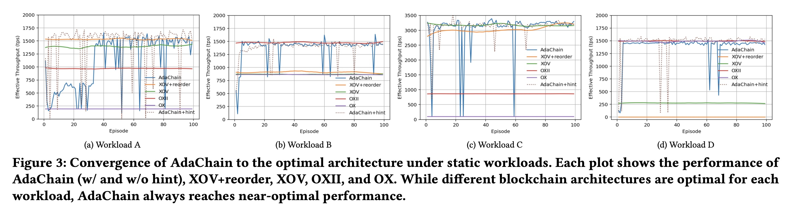  

2.  **面对动态变化，效果如何？（Figure 4）**
    **效果显著。** 这是最关键的实验。实验模拟了工作负载每15分钟变化一次（A -\> B -\> C -\> D -\> A）。  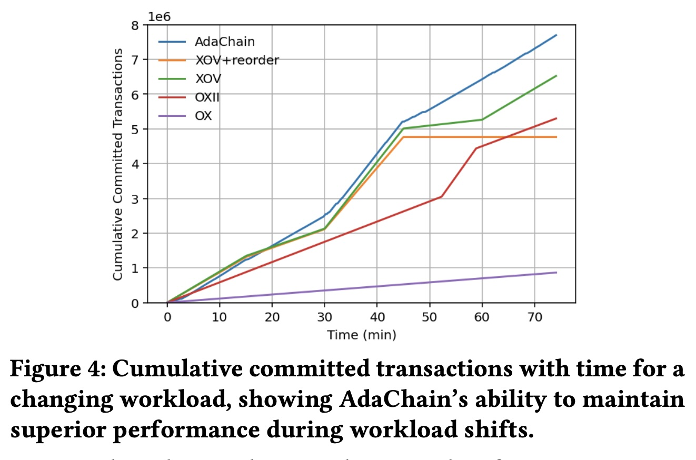  

      * **AdaChain (黑色曲线)**：每次负载变化时，它都能快速适应，始终保持高吞吐量 。
      * **固定架构（其他曲线）** ：表现“时好时坏”。比如 `XOV`（红色）在 C 时很好，但在 A 和 D 时很差。
      * **结论**：在75分钟内，AdaChain 处理的**总交易量**比“次优”的固定架构高出 **17%** 。

3.  **换个硬件环境呢？（Figure 6）**  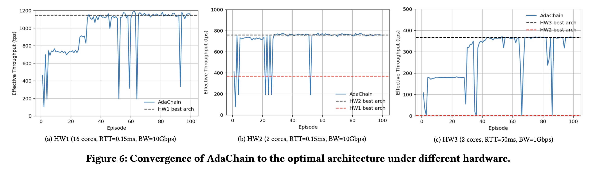  
    **同样能适应。** 论文展示了在不同CPU核数、不同网络延迟的硬件上，AdaChain 都能自动学习并收敛到该硬件下的最优架构 。这免去了人工调优的麻烦。

4.  **“学习”的代价大吗？（Table 5）**  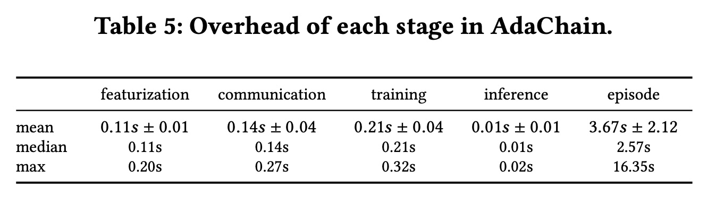  
    **不大。** 整个学习（特征提取、通信、训练、预测）的平均开销只有 0.47 秒 。而且这个过程是和区块链处理交易**并行**的 ，因此它几乎不会影响系统的实际吞吐量。
  
## 3 术语 
  
以下是《AdaChain: A Learned Adaptive Blockchain》论文中的关键术语及其通俗解读。

### 1\. 核心概念与目标

#### 1.1 AdaChain

**中文含义：** AdaChain（论文提出的框架名称） 
**通俗讲解：**
这是论文作者提出的一个“会学习的自适应区块链”框架 。你可以把它想象成一个拥有“超级大脑”的“变形金刚”式区块链。它能实时感知当前的任务压力（即“工作负载”），并通过强化学习这个“大脑” ，自动“变形”（切换内部架构），始终选择最高效的形态去处理任务，以达到最大的“有效吞吐量” 。

#### 1.2 Permissioned Blockchain (许可链)

**中文含义：** 许可链（或许可区块链）
**通俗讲解：**
与比特币这种谁都可以加入的“公有链”不同，许可链是“私有的”或“联盟的” 。只有获得许可的、已知的参与方（比如一个联盟内的几家银行）才能加入 。AdaChain 解决的就是这类区块链在企业应用中的性能问题。

#### 1.3 BaaS (Blockchain-as-a-Service)

**中文含义：** 区块链即服务
**通俗讲解：**
指由云服务商（如亚马逊、IBM、阿里）提供的区块链托管服务 。在 BaaS 环境下，成百上千个不同的应用（智能合约）会同时运行在平台上，导致系统面临的工作负载（任务类型）千变万化 。

#### 1.4 Effective Throughput (有效吞吐量)

**中文含义：** 有效吞吐量
**通俗讲解：**
这是 AdaChain 优化的核心性能指标 。它指的**不是**系统“尝试”处理了多少交易，而是**每秒钟“真正成功提交并上链”的交易数量** 。在某些架构下（如 XOV），系统可能执行了 3000 笔交易，但因为冲突最后只有 1000 笔成功，那么有效吞吐量就是 1000 tps。

-----

### 2\. 问题与挑战

#### 2.1 Workload (工作负载)

**中文含义：** 工作负载（或 负载）
**通俗讲解：**
指当前区块链系统正在处理的任务的“特性”或“类型” 。论文通过 **Table 2**  展示了不同负载的特征，关键特征包括：    

  * **Write Ratio (写入比例)**：有多少任务是修改数据（写），有多少是查询数据（读） 。
  * **Contention Level (冲突等级)**：有多少任务在“同时抢着修改同一个数据”（比如都在抢着改同一个账户的余额） 。
  * **Compute Intensity (计算密集度)**：任务是简单的转账，还是需要大量 CPU 计算的复杂操作 。

#### 2.2 Blockchain Architecture (区块链架构)

**中文含义：** 区块链架构
**通俗讲解：**
指区块链内部处理交易的“流水线”或“步骤顺序” 。论文的核心论点是：**没有一种架构能通吃所有负载** 。

**Figure 1** 清晰地展示了这一点：   

  * **Workload A（高计算）** ：`XOV+reorder` 架构性能最好 。
  * **Workload D（高冲突）** ：`OXII` 架构性能最好 。
  * **性能反差**：`XOV+reorder` 在 Workload D 下的性能几乎为零 。

论文中提到的几种关键架构：

  * **OX (Order-Execute)**：先排序，再串行执行。就像银行排队，一个一个办业务。好处是简单、不会出错（无冲突），但在计算密集的任务上很慢 。
  * **XOV (Execute-Order-Validate)**：先（并行）执行，再排序，最后验证。就像大家先“盲目”尝试执行，再排队，最后银行检查谁的执行有效。在冲突少、计算多的任务上很快 ，但在冲突高的任务上，大量执行会失败，性能很差 。
  * **OXII (Order-Parallel Execute)**：先排序，再分析依赖关系，最后并行执行。是 OX 的改良版，在计算密集任务上表现不错 。

-----

### 3\. 核心技术：学习

#### 3.1 Reinforcement Learning (RL - 强化学习)

**中文含义：** 强化学习
**通俗讲解：**
一种机器学习技术，系统通过“试错”来学习 。AdaChain 的“大脑”就是强化学习 。它不断地尝试不同的“架构”（Action），观察这个架构在当前“负载”（State）下能获得多少“吞吐量”（Reward），并以此来优化自己的决策，最终目标是学会如何最大化长期奖励（总吞吐量） 。

#### 3.2 Contextual Multi-armed Bandit (CMAB)

**中文含义：** 上下文多臂老虎机
**通俗讲解：**
这是 AdaChain 使用的具体强化学习模型 。

我们可以用一个流程图来理解它：

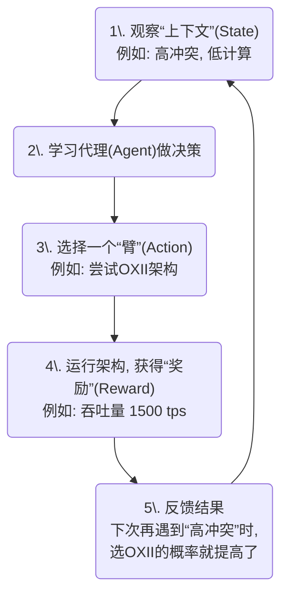

  * **Context (上下文)**：指当前的工作负载特征（即“状态”） 。
  * **Arms (臂)**：指每一种可选的区块链架构（即“动作”） 。
  * **Bandit (老虎机)**：指整个决策系统，它的目标是学会在特定“上下文”下，拉动哪个“臂”（选择哪个架构）能获得的“奖励”（吞吐量）最高 。

#### 3.3 State, Action, Reward (状态, 动作, 奖励)

**中文含义：** 状态, 动作, 奖励
**通俗讲解：**
这是 RL 框架的三要素，在 AdaChain 中具体指：

  * **State ( 状态 $s_n$ )**: “当前是什么情况？” 。AdaChain 通过4个特征来描述状态：写入比例、热点key比例（冲突）、交易到达率、执行延迟（计算） 。
  * **Action ( 动作 $a_n$ )**: “我该做什么？” 。AdaChain 的动作是选择一个具体的架构配置，由3个特征组合而成：区块大小、是否早期执行（XOV模式）、是否构建依赖图（OXII模式） 。
  * **Reward ( 奖励 $r_n$ )**: “我做得好不好？” 。奖励被定义为该动作（架构）下跑出来的“有效吞吐量” 。

#### 3.4 Episode (回合)

**中文含义：** 回合
**通俗讲解：**
AdaChain 的一个工作周期 。系统不是每时每刻都在换架构，而是以“回合”为单位。比如，一个回合被定义为“处理 10000 笔交易” 。在这个回合中，架构保持不变 。这个回合结束后，学习代理会根据这个回合的表现（奖励），决定下一个回合（下 10000 笔交易）要用什么新架构 。

#### 3.5 Thompson Sampling (汤普森采样)

**中文含义：** 汤普森采样
**通俗讲解：**
AdaChain 用来解决 CMAB 问题的具体算法 。它的核心作用是巧妙地平衡“探索” (Exploration) 和“利用” (Exploitation) 。

  * **利用**：选择当前已知的、表现最好的架构。
  * **探索**：尝试一些没怎么用过、或者表现不确定的架构，万一它更好呢？
    汤普森采样通过一种概率采样的方式 ，使得 AdaChain 既能稳定地使用好架构，又能不断发掘更优的新选择。

-----

### 4\. 核心技术：切换

#### 4.1 Architecture Switching (架构切换)

**中文含义：** 架构切换
**通俗讲解：**
指 AdaChain 在运行时，从一种架构（如 OX）“变形”到另一种架构（如 XOV）的核心机制 。这个过程必须在所有节点上（分布式地）安全、正确地完成 。

#### 4.2 Normal Path / Slow Path (正常路径 / 慢路径)

**中文含义：** 正常路径 / 慢路径
**通俗讲解：**
这是 AdaChain 设计的“安全变形”协议的两个部分，确保切换过程万无一失 。

  * **Normal Path (正常路径)**：常规流程 。所有节点通过多轮投票（类似 PBFT 共识），就“下一个架构是什么”以及“在哪个区块高度开始切换”达成一致 。
  * **Slow Path (慢路径)**：异常流程，相当于一个“保险丝” 。如果学习代理不小心选了一个极差的架构，导致系统“卡住”了（例如，长时间无法出块），这个慢路径就会被**超时**触发 。它会强制所有节点停止当前回合，并协商切换到一个新架构，防止系统“假死” 。
  
## 参考        
         
https://arxiv.org/pdf/2211.01580  
  
https://rmarcus.info/blog/        
        
<b> 以上内容基于DeepSeek、Qwen、Gemini及诸多AI生成, 轻微人工调整, 感谢杭州深度求索人工智能、阿里云、Google等公司. </b>        
        
<b> AI 生成的内容请自行辨别正确性, 当然也多了些许踩坑的乐趣, 毕竟冒险是每个男人的天性.  </b>        
  
    
#### [期望 PostgreSQL|开源PolarDB 增加什么功能?](https://github.com/digoal/blog/issues/76 "269ac3d1c492e938c0191101c7238216")
  
  
#### [PolarDB 开源数据库](https://openpolardb.com/home "57258f76c37864c6e6d23383d05714ea")
  
  
#### [PolarDB 学习图谱](https://www.aliyun.com/database/openpolardb/activity "8642f60e04ed0c814bf9cb9677976bd4")
  
  
#### [PostgreSQL 解决方案集合](../201706/20170601_02.md "40cff096e9ed7122c512b35d8561d9c8")
  
  
#### [德哥 / digoal's Github - 公益是一辈子的事.](https://github.com/digoal/blog/blob/master/README.md "22709685feb7cab07d30f30387f0a9ae")
  
  
#### [About 德哥](https://github.com/digoal/blog/blob/master/me/readme.md "a37735981e7704886ffd590565582dd0")
  
  

  
