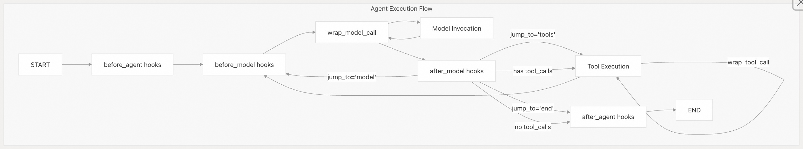

## LangChain 源码学习: 4.3 V1 中间件代理系统（Middleware Agent System）                                     
                                                                              
### 作者                                                                      
digoal                                                                      
                                                                              
### 日期                                                                        
2025-10-21                                                                            
                                                                       
### 标签                                                                            
AI Agent , Powered by LLM , LangChain , 源码学习                                                                       
                                                                             
----                                                                         
                                                                         
## 背景                                   
本文描述了 `langchain_v1` 中基于中间件的代理架构(middleware-based agent architecture)，这是一种用于构建可组合、可控代理的新一代系统。中间件模式允许将横切关注点（如人工审批(human-in-the-loop approval)、模型降级(model fallback)、提示缓存(prompt caching)和任务规划(planning)）作为可复用插件，围绕核心代理循环(core agent loop)进行添加。  
  
关于经典代理模式（如 ReAct、函数调用）的信息，请参阅 `langchain-classic` 包的文档。  
  
## 架构概览  
  
V1 中间件系统将代理构建为状态图（state graph），中间件可以在代理循环(core agent loop)的六个不同阶段拦截执行。与传统代理中这些关注点被硬编码不同，中间件实现了关注点分离，并支持独立行为的组合。  
  
### 核心模式  
  
  
  
**中间件执行模型**：代理创建一个 LangGraph 的 `StateGraph`，每个中间件可以：  
  
- 在四个钩子点执行（顺序执行、修改状态，并通过 `jump_to` 控制流程）：  
  - `before_agent`  
  - `before_model`  
  - `after_model`  
  - `after_agent`  
- 在两个包装点拦截执行（通过处理回调，支持重试、降级或短路(short-circuit)逻辑）：  
  - `wrap_model_call`  
  - `wrap_tool_call`  
  
**来源**：  
- [`libs/langchain_v1/langchain/agents/factory.py`](https://github.com/langchain-ai/langchain/blob/e3fc7d8a/libs/langchain_v1/langchain/agents/factory.py#L512-L1038)    
- [`libs/langchain_v1/langchain/agents/middleware/types.py`](https://github.com/langchain-ai/langchain/blob/e3fc7d8a/libs/langchain_v1/langchain/agents/middleware/types.py#L150-L453)  
  
### 关键设计原则  
  
1、组合优于配置：中间件实例以列表形式组成，而不是通过参数进行配置  
  
2、从右到左的包装器组合：列表中的第一个中间件成为 `wrap_model_call` / `wrap_tool_call` 的最外层  
  
3、顺序执行钩子：钩子中间件（`before_model`，`after_model`）按列表顺序执行  
  
4、类型安全状态扩展：中间件可以使用 `TypedDict` 继承来扩展自定义字段 `AgentState`   
  
**来源**：  
- [`libs/langchain_v1/langchain/agents/factory.py`](https://github.com/langchain-ai/langchain/blob/e3fc7d8a/libs/langchain_v1/langchain/agents/factory.py#L72-L266)  
  
## 核心组件  
  
### 类层次结构  
  
  
  
**来源**：    
- [`libs/langchain_v1/langchain/agents/middleware/types.py`](https://github.com/langchain-ai/langchain/blob/e3fc7d8a/libs/langchain_v1/langchain/agents/middleware/types.py#L126-L453)  
- [`libs/langchain_v1/langchain/agents/middleware/types.py`](https://github.com/langchain-ai/langchain/blob/e3fc7d8a/libs/langchain_v1/langchain/agents/middleware/types.py#L65-L93)  
  
### AgentMiddleware 基类  
  
`AgentMiddleware` 类定义了六个拦截点：  
  
| 钩子方法 | 执行时机 | 用途 | 是否支持跳转(jump) | 返回类型 |  
|----------|----------|------|---------------|----------|  
| `before_agent` | 代理开始前执行一次 | 初始化状态 | 是 | `dict[str, Any] \| None` |  
| `before_model` | 每次模型调用前 | 预处理状态、修改上下文 | 是 | `dict[str, Any] \| None` |  
| `wrap_model_call` | 包裹模型调用 | 重试、降级、缓存、修改请求/响应 | 否 | `ModelCallResult` |  
| `after_model` | 每次模型调用后 | 后处理响应、决定路由 | 是 | `dict[str, Any] \| None` |  
| `wrap_tool_call` | 包裹每次工具执行 | 重试、验证、修改工具调用 | 否 | `ToolMessage \| Command` |  
| `after_agent` | 代理结束后执行一次 | 清理、最终状态更新 | 否 | `dict[str, Any] \| None` |  
  
**同步/异步支持**：每个钩子都有同步和异步版本（例如 `before_model` 和 `abefore_model`）。如果只实现其中一个版本，而以错误的模式（同步/异步）调用代理，会抛出清晰的错误。  
  
**来源**：  
- [`libs/langchain_v1/langchain/agents/middleware/types.py`](https://github.com/langchain-ai/langchain/blob/e3fc7d8a/libs/langchain_v1/langchain/agents/middleware/types.py#L150-L453)  
  
### 状态管理  
  
**AgentState 模式(Schema)** ：  
```  
class AgentState(TypedDict, Generic[ResponseT]):  
    messages: Required[Annotated[list[AnyMessage], add_messages]]  
    jump_to: NotRequired[Annotated[JumpTo | None, EphemeralValue, PrivateStateAttr]]  
    structured_response: NotRequired[Annotated[ResponseT, OmitFromInput]]  
    thread_model_call_count: NotRequired[Annotated[int, PrivateStateAttr]]  
    run_model_call_count: NotRequired[Annotated[int, UntrackedValue, PrivateStateAttr]]  
```  
  
**模式(Schema)注解**：  
- `OmitFromInput`：字段从输入模式中排除，但包含在输出中  
- `OmitFromOutput`：字段从输出模式中排除，但包含在输入中  
- `PrivateStateAttr`：字段在输入和输出模式中均被排除  
- `EphemeralValue`：字段在每个节点执行后被清除  
- `UntrackedValue`：字段不保存在检查点中  
  
**状态扩展模式**：中间件可通过自定义字段扩展状态。    
```  
class PlanningState(AgentState):  
    todos: NotRequired[list[Todo]]  # Middleware-specific field  
```  
  
`create_agent` 工厂函数使用 `_resolve_schema` 合并所有中间件的状态模式，并尊重上述注解。  
  
**来源**：    
- [`libs/langchain_v1/langchain/agents/middleware/types.py`](https://github.com/langchain-ai/langchain/blob/e3fc7d8a/libs/langchain_v1/langchain/agents/middleware/types.py#L126-L144)  
- [`libs/langchain_v1/langchain/agents/middleware/types.py`](https://github.com/langchain-ai/langchain/blob/e3fc7d8a/libs/langchain_v1/langchain/agents/middleware/types.py#L106-L123)  
- [`libs/langchain_v1/langchain/agents/factory.py`](https://github.com/langchain-ai/langchain/blob/e3fc7d8a/libs/langchain_v1/langchain/agents/factory.py#L269-L311)  
  
## 使用 create_agent 创建代理  
  
### 工厂函数签名(Signature)  
  
```  
def create_agent(  
    model: str | BaseChatModel,  
    tools: Sequence[BaseTool | Callable | dict[str, Any]] | None = None,  
    *,  
    system_prompt: str | None = None,  
    middleware: Sequence[AgentMiddleware[AgentState[ResponseT], ContextT]] = (),  
    response_format: ResponseFormat[ResponseT] | type[ResponseT] | None = None,  
    context_schema: type[ContextT] | None = None,  
    checkpointer: Checkpointer | None = None,  
    store: BaseStore | None = None,  
    interrupt_before: list[str] | None = None,  
    interrupt_after: list[str] | None = None,  
    debug: bool = False,  
    name: str | None = None,  
    cache: BaseCache | None = None,  
) -> CompiledStateGraph  
```  
  
**来源**：  
- [`libs/langchain_v1/langchain/agents/factory.py`](https://github.com/langchain-ai/langchain/blob/e3fc7d8a/libs/langchain_v1/langchain/agents/factory.py#L512-L574)  
  
### 代理图构建(Agent Graph Construction)  
  
  
  
**节点创建逻辑**：  
  
- 1、 `before_agent_node`：依次运行所有 `before_agent` 钩子  
- 2、 `before_model_node`：运行所有 `before_model` 钩子，检查是否提前 `jump_to`  
- 3、 `agent_node`：使用链式 `wrap_model_call` 处理器执行模型  
- 4、 `after_model_node`：运行所有 `after_model` 钩子，处理 `jump_to` 路由  
- 5、 `tools_node`：使用链式 `wrap_tool_call` 处理器的 `_ToolNode`  
- 6、 `after_agent_node`：运行所有 `after_agent` 钩子  
  
**来源**：  
- [`libs/langchain_v1/langchain/agents/factory.py`](https://github.com/langchain-ai/langchain/blob/e3fc7d8a/libs/langchain_v1/langchain/agents/factory.py#L576-L1038)  
  
### 中间件组合  
  
**钩子中间件组合**：钩子按列表顺序依次执行    
```  
# middleware=[M1(), M2(), M3()]  
# before_model execution order: M1.before_model → M2.before_model → M3.before_model  
```  
  
**包装器中间件组合**：包装器采用右到左嵌套（第一个是最外层）    
```  
# middleware=[Auth(), Cache(), Retry()]  
# Execution flow: Auth → Cache → Retry → base_handler  
# Response flow: base_handler → Retry → Cache → Auth  
```  
  
`_chain_model_call_handlers` 函数通过嵌套闭包实现此组合逻辑。  
  
**来源**：    
- [`libs/langchain_v1/langchain/agents/factory.py`](https://github.com/langchain-ai/langchain/blob/e3fc7d8a/libs/langchain_v1/langchain/agents/factory.py#L72-L266)  
- [`libs/langchain_v1/langchain/agents/factory.py`](https://github.com/langchain-ai/langchain/blob/e3fc7d8a/libs/langchain_v1/langchain/agents/factory.py#L402-L509)  
  
## 中间件钩子详解  
  
### before_agent 钩子  
  
**用途**：在代理执行开始前初始化状态，每次调用只运行一次。    
  
**签名**：`def before_agent(self, state: StateT, runtime: Runtime[ContextT]) -> dict[str, Any] | None`    
  
**使用模式**：  
```  
class InitializationMiddleware(AgentMiddleware):  
    def before_agent(self, state: AgentState, runtime: Runtime) -> dict[str, Any]:  
        return {"custom_field": "initialized"}  
```  
  
**跳转能力**：可返回 `{"jump_to": "end"}` 以短路整个代理流程。  
  
**来源**：  
- [`libs/langchain_v1/langchain/agents/middleware/types.py`](https://github.com/langchain-ai/langchain/blob/e3fc7d8a/libs/langchain_v1/langchain/agents/middleware/types.py#L171-L177)  
  
### before_model 钩子  
  
**用途**：在每次模型调用前预处理状态（若使用工具，可能多次执行）。   
  
**签名**：`def before_model(self, state: StateT, runtime: Runtime[ContextT]) -> dict[str, Any] | None`  
  
**跳转目标**：可设置 `jump_to` 为 `"end"`、`"tools"` 或 `"model"`（需通过 `@hook_config` 声明）。    
  
**示例 - 条件路由**：  
```  
class EarlyExitMiddleware(AgentMiddleware):  
    @hook_config(can_jump_to=["end"])  
    def before_model(self, state: AgentState, runtime: Runtime) -> dict[str, Any] | None:  
        if len(state["messages"]) > 100:  
            return {"jump_to": "end"}  # Stop agent early  
        return None  
```  
  
**来源**：    
- [`libs/langchain_v1/langchain/agents/middleware/types.py`](https://github.com/langchain-ai/langchain/blob/e3fc7d8a/libs/langchain_v1/langchain/agents/middleware/types.py#L179-L185)  
- [`libs/langchain_v1/langchain/agents/middleware/types.py`](https://github.com/langchain-ai/langchain/blob/e3fc7d8a/libs/langchain_v1/langchain/agents/middleware/types.py#L507-L552)  
  
### wrap_model_call 钩子  
  
**用途**：拦截(Intercept)模型执行，用于重试、降级、缓存或修改请求/响应。    
  
**签名**：  
```  
def wrap_model_call(  
    self,  
    request: ModelRequest,  
    handler: Callable[[ModelRequest], ModelResponse],  
) -> ModelCallResult  # ModelResponse | AIMessage  
```  
  
**关键特性**：  
- 可以多次调用处理程序来执行重试逻辑  
- 可以修改 `request.model`、`request.tools`、`request.system_prompt` 等。  
- 可以不调用处理程序(calling handler)来进行短路  
- 可以返回 `ModelResponse` 或简化 `AIMessage` 类型  
  
**示例 - 模型降级**：  
```  
class ModelFallbackMiddleware(AgentMiddleware):  
    def __init__(self, fallback_model: str):  
        self.fallback = init_chat_model(fallback_model)  
      
    def wrap_model_call(self, request: ModelRequest, handler: Callable) -> ModelResponse:  
        try:  
            return handler(request)  
        except Exception:  
            request.model = self.fallback  
            return handler(request)  # Retry with fallback model  
```  
  
**来源**：    
- [`libs/langchain_v1/langchain/agents/middleware/types.py`](https://github.com/langchain-ai/langchain/blob/e3fc7d8a/libs/langchain_v1/langchain/agents/middleware/types.py#L195-L276)  
- [`libs/langchain_v1/langchain/agents/middleware/model_fallback.py`](https://github.com/langchain-ai/langchain/blob/e3fc7d8a/libs/langchain_v1/langchain/agents/middleware/model_fallback.py#L69-L104)  
  
### after_model 钩子  
  
**用途**：后处理模型响应，决定下一步路由（工具/结束/再次调用模型）。    
  
**签名**：`def after_model(self, state: StateT, runtime: Runtime[ContextT]) -> dict[str, Any] | None`  
  
**跳转目标**：可设置 `jump_to` 为 `"end"`、`"tools"` 或 `"model"`。    
  
**示例 - 人工介入审批**：  
```  
class HumanInTheLoopMiddleware(AgentMiddleware):  
    def after_model(self, state: AgentState, runtime: Runtime) -> dict[str, Any] | None:  
        last_msg = state["messages"][-1]  
        if isinstance(last_msg, AIMessage) and last_msg.tool_calls:  
            # Interrupt for approval, modify tool calls  
            approved_msg = self._get_approval(last_msg)  
            return {"messages": [approved_msg]}  
        return None  
```  
  
**来源**：    
- [`libs/langchain_v1/langchain/agents/middleware/types.py`](https://github.com/langchain-ai/langchain/blob/e3fc7d8a/libs/langchain_v1/langchain/agents/middleware/types.py#L187-L193)  
- [`libs/langchain_v1/langchain/agents/middleware/human_in_the_loop.py`](https://github.com/langchain-ai/langchain/blob/e3fc7d8a/libs/langchain_v1/langchain/agents/middleware/human_in_the_loop.py#L272-L347)  
  
### wrap_tool_call 钩子  
  
**用途**：拦截单个工具执行，用于验证、重试或日志记录。    
  
**签名**：  
```  
def wrap_tool_call(  
    self,  
    request: ToolCallRequest,  
    handler: Callable[[ToolCallRequest], ToolMessage | Command],  
) -> ToolMessage | Command  
```  
  
**关键特性**：  
- 每次工具调用时执行（而不是每次工具节点执行）  
- 可以多次调用处理程序进行重试  
- 执行前可以修改 `request.tool_call["args"]`  
- 可以返回 `Command` 以进行高级流量控制  
  
**示例 - 错误重试**：  
```  
class ToolRetryMiddleware(AgentMiddleware):  
    def wrap_tool_call(self, request: ToolCallRequest, handler: Callable) -> ToolMessage | Command:  
        for attempt in range(3):  
            try:  
                result = handler(request)  
                if isinstance(result, ToolMessage) and result.status != "error":  
                    return result  
            except Exception:  
                if attempt == 2:  
                    raise  
        return result  
```  
  
**来源**：    
- [`libs/langchain_v1/langchain/agents/middleware/types.py`](https://github.com/langchain-ai/langchain/blob/e3fc7d8a/libs/langchain_v1/langchain/agents/middleware/types.py#L331-L393)  
- [`libs/langchain_v1/langchain/tools/tool_node.py`](https://github.com/langchain-ai/langchain/blob/e3fc7d8a/libs/langchain_v1/langchain/tools/tool_node.py#L107-L196)  
  
### after_agent 钩子  
  
**用途**：代理执行完成后进行清理或最终状态更新。    
  
**签名**：`def after_agent(self, state: StateT, runtime: Runtime[ContextT]) -> dict[str, Any] | None`  
  
**无跳转支持**：这是 END 前的最后一个钩子，因此不支持 `jump_to`。  
  
**来源**：  
- [`libs/langchain_v1/langchain/agents/middleware/types.py`](https://github.com/langchain-ai/langchain/blob/e3fc7d8a/libs/langchain_v1/langchain/agents/middleware/types.py#L323-L329)  
  
## 基于装饰器的中间件(Decorator-Based Middleware)  
  
对于简单场景，中间件可通过装饰器(decorators)创建，无需继承 `AgentMiddleware`。  
  
### 装饰器函数  
  
  
  
Decorator Signatures:   
  
| 装饰器 | 函数签名 | 选项 |  
|--------|--------|------|  
| `@before_model` | `(state, runtime) → dict \| None` | `state_schema`, `tools`, `can_jump_to`, `name` |  
| `@after_model` | `(state, runtime) → dict \| None` | `state_schema`, `tools`, `can_jump_to`, `name` |  
| `@before_agent` | `(state, runtime) → dict \| None` | `state_schema`, `tools`, `can_jump_to`, `name` |  
| `@after_agent` | `(state, runtime) → dict \| None` | `state_schema`, `tools`, `name` |  
| `@wrap_model_call` | `(request, handler) → ModelCallResult` | `state_schema`, `tools`, `name` |  
| `@wrap_tool_call` | `(request, handler) → ToolMessage \| Command` | `state_schema`, `tools`, `name` |  
| `@dynamic_prompt` | `(request) → str` | `state_schema`, `name` |  
  
**使用示例**：  
```  
@before_model(can_jump_to=["end"])  
def early_exit(state: AgentState, runtime: Runtime) -> dict[str, Any] | None:  
    if should_exit(state):  
        return {"jump_to": "end"}  
    return None  
  
@wrap_model_call  
def add_logging(request: ModelRequest, handler: Callable) -> ModelResponse:  
    print(f"Calling model with {len(request.messages)} messages")  
    response = handler(request)  
    print(f"Model returned {len(response.result)} messages")  
    return response  
  
agent = create_agent(model, middleware=[early_exit, add_logging])  
```  
  
**来源**：    
- [`libs/langchain_v1/langchain/agents/middleware/types.py`](https://github.com/langchain-ai/langchain/blob/e3fc7d8a/libs/langchain_v1/langchain/agents/middleware/types.py#L555-L1513)  
- [`libs/langchain_v1/tests/unit_tests/agents/test_middleware_decorators.py`](https://github.com/langchain-ai/langchain/blob/e3fc7d8a/libs/langchain_v1/tests/unit_tests/agents/test_middleware_decorators.py#L40-L147)  
  
## 具体中间件实现  
  
### HumanInTheLoopMiddleware（人工介入中间件）  
  
**用途**：在工具调用前暂停执行，等待人工审批。    
  
**架构**：  
  
  
  
**配置**：  
```  
middleware = HumanInTheLoopMiddleware(  
    interrupt_on={  
        "send_email": {"allowed_decisions": ["approve", "reject"]},  
        "delete_file": {"allowed_decisions": ["approve", "edit", "reject"]},  
    },  
    description_prefix="Tool execution requires approval"  
)  
```  
  
**决策类型**：  
- `approve`：原样执行工具  
- `edit`：修改工具参数（返回含 `edited_action` 的 `EditDecision`）  
- `reject`：跳过工具调用，添加错误 `ToolMessage`  
  
**实现**：使用 LangGraph 的 `interrupt()` 暂停执行，直到用户提供决策。    
  
**来源**：    
- [`libs/langchain_v1/langchain/agents/middleware/human_in_the_loop.py`](https://github.com/langchain-ai/langchain/blob/e3fc7d8a/libs/langchain_v1/langchain/agents/middleware/human_in_the_loop.py#L157-L347)  
- [`libs/langchain_v1/tests/unit_tests/agents/test_middleware_agent.py`](https://github.com/langchain-ai/langchain/blob/e3fc7d8a/libs/langchain_v1/tests/unit_tests/agents/test_middleware_agent.py#L463-L875)  
  
### PlanningMiddleware（规划中间件）  
  
**用途**：通过 `write_todos` 工具管理任务列表，更新 `PlanningState.todos`。    
  
**状态扩展**：  
```  
class PlanningState(AgentState):  
    todos: NotRequired[list[Todo]]  # Each todo: {content, status: pending|in_progress|completed}  
```  
  
**系统提示注入**：当存在任务时，通过 `dynamic_prompt` 添加待办事项说明。    
  
**工具注册**：通过 `middleware.tools` 属性提供 `write_todos` 工具。  
  
**示例**：  
```  
planning = PlanningMiddleware()  
agent = create_agent(  
    model="openai:gpt-4o",  
    middleware=[planning],  
)  
  
result = agent.invoke({"messages": [HumanMessage("Deploy the website")]})  
# Agent creates todos: ["Build assets", "Upload to server", "Test deployment"]  
# Updates status as it progresses  
```  
  
**来源**：    
- [`libs/langchain_v1/langchain/agents/middleware/planning.py`](https://github.com/langchain-ai/langchain/blob/e3fc7d8a/libs/langchain_v1/langchain/agents/middleware/planning.py#L36-L172)  
- [`libs/langchain_v1/tests/unit_tests/agents/test_middleware_agent.py`](https://github.com/langchain-ai/langchain/blob/e3fc7d8a/libs/langchain_v1/tests/unit_tests/agents/test_middleware_agent.py#L1187-L1310)  
  
### ModelFallbackMiddleware（模型降级中间件）  
  
**用途**：在模型调用出错时自动切换到备用模型。    
  
**模式**：使用 `wrap_model_call` 捕获异常，并用备用模型重试。    
  
**配置**：  
```  
fallback = ModelFallbackMiddleware(  
    "openai:gpt-4o-mini",  # First fallback  
    "anthropic:claude-3-5-sonnet-20241022",  # Second fallback  
)  
  
agent = create_agent(  
    model="openai:gpt-4o",  # Primary  
    middleware=[fallback],  
)  
# If primary fails: tries gpt-4o-mini, then claude  
```  
  
**实现**：修改 `request.model` 后再次调用处理器。  
  
**来源**：  
- [`libs/langchain_v1/langchain/agents/middleware/model_fallback.py`](https://github.com/langchain-ai/langchain/blob/e3fc7d8a/libs/langchain_v1/langchain/agents/middleware/model_fallback.py#L21-L104)  
  
### AnthropicPromptCachingMiddleware（Anthropic 提示缓存中间件）  
  
**用途**：通过添加 `cache_control` 块启用 Anthropic 提示缓存。    
  
**配置**：  
```  
caching = AnthropicPromptCachingMiddleware(  
    type="ephemeral",  
    ttl="5m",  
    min_messages_to_cache=3,  
    unsupported_model_behavior="warn"  
)  
```  
  
**实现**：在 `wrap_model_call` 中设置 `request.model_settings["cache_control"]`。    
  
**模型验证**：检查模型是否为 `ChatAnthropic` 实例，并根据 `unsupported_model_behavior` 处理不支持的情况。  
  
**来源**：  
- [`libs/langchain_v1/langchain/agents/middleware/prompt_caching.py`](https://github.com/langchain-ai/langchain/blob/e3fc7d8a/libs/langchain_v1/langchain/agents/middleware/prompt_caching.py#L15-L89)  
  
### ContextEditingMiddleware（上下文编辑中间件）  
  
**用途**：清除旧的工具结果以控制 token 使用量。    
  
**策略 - ClearToolUsesEdit**：将旧 `ToolMessage.content` 替换为占位符。    
```  
edit = ClearToolUsesEdit(  
    trigger=100_000,  # Token threshold  
    keep=3,  # Keep last 3 tool results  
    clear_tool_inputs=False,  # Don't clear tool_calls in AIMessage  
    exclude_tools=["important_tool"],  
    placeholder="[cleared]"  
)  
  
middleware = ContextEditingMiddleware(edit)  
```  
  
**实现**：使用 `wrap_model_call` 通过用占位符替换旧的 `ToolMessage.content` 来实现 `request.messages` 变异。  
  
**来源**：    
- [`libs/langchain_v1/langchain/agents/middleware/context_editing.py`](https://github.com/langchain-ai/langchain/blob/e3fc7d8a/libs/langchain_v1/langchain/agents/middleware/context_editing.py#L54-L172)  
- [`libs/langchain_v1/tests/unit_tests/agents/test_context_editing_middleware.py`](https://github.com/langchain-ai/langchain/blob/e3fc7d8a/libs/langchain_v1/tests/unit_tests/agents/test_context_editing_middleware.py#L1-L247)  
  
### LLMToolSelectorMiddleware（LLM 工具选择中间件）  
  
**用途**：使用 LLM 筛选出最相关的工具。    
  
**架构**：  
  
  
  
**配置**：  
```  
selector = LLMToolSelectorMiddleware(  
    model="openai:gpt-4o-mini",  # Smaller model for selection  
    max_tools=3,  
    always_include=["important_tool"]  
)  
```  
  
**选择策略**：为每个工具名创建 `Literal[tool1] | Literal[tool2] | ...` 的联合类型 `ToolSelectionResponse` ，通过结构化输出获取排序(ranker)列表。  
  
**来源**：    
- [`libs/langchain_v1/langchain/agents/middleware/tool_selection.py`](https://github.com/langchain-ai/langchain/blob/e3fc7d8a/libs/langchain_v1/langchain/agents/middleware/tool_selection.py#L87-L273)  
- [`libs/langchain_v1/tests/unit_tests/agents/middleware/test_llm_tool_selection.py`](https://github.com/langchain-ai/langchain/blob/e3fc7d8a/libs/langchain_v1/tests/unit_tests/agents/middleware/test_llm_tool_selection.py#L1-L422)  
  
## 工具集成与 ToolNode  
  
### 工具集合  
  
`create_agent` 工厂从两个来源收集工具：  
- `tools` 参数：显式提供的工具列表  
- `middleware[i].tools`：中间件提供的工具  
  
**工具处理**：  
```  
# Collect all tools  
all_tools = list(tools or [])  
for m in middleware:  
    all_tools.extend(m.tools)  
  
# Convert to BaseTool instances  
tools_dict = {tool.name: tool for tool in _ensure_tools(all_tools)}  
```  
  
**来源**：  
- [`libs/langchain_v1/langchain/agents/factory.py`](https://github.com/langchain-ai/langchain/blob/e3fc7d8a/libs/langchain_v1/langchain/agents/factory.py#L588-L616)  
  
### \_ToolNode 执行  
  
**节点构建**：  
```  
# Create tool node with chained wrap_tool_call handlers  
tool_node = _ToolNode(  
    list(tools_dict.values()),  
    handle_tool_errors=True,  
    wrap_tool_call=tool_call_wrapper,  # Composed from middleware  
)  
```  
  
**并行工具执行**：当请求多个工具时, `_ToolNode` 使用 `Send` API 并行分发多个工具调用。    
  
**工具调用包装器组合**：  
```  
# middleware=[M1(), M2(), M3()] with wrap_tool_call  
# Execution: M1.wrap_tool_call → M2.wrap_tool_call → M3.wrap_tool_call → base handler  
```  
  
**来源**：    
- [`libs/langchain_v1/langchain/tools/tool_node.py`](https://github.com/langchain-ai/langchain/blob/e3fc7d8a/libs/langchain_v1/langchain/tools/tool_node.py#L329-L694)   
- [`libs/langchain_v1/langchain/agents/factory.py`（第 729-765 行）  
  
### ToolCallRequest 结构  
  
  
**用途**：为 `wrap_tool_call` 处理器提供完整上下文，支持状态感知的工具拦截(state-aware tool interception)。  
  
**来源**：  
- [`libs/langchain_v1/langchain/tools/tool_node.py`](https://github.com/langchain-ai/langchain/blob/e3fc7d8a/libs/langchain_v1/langchain/agents/factory.py#L729-L765)  
  
## 控制流与路由  
  
### 跳转目标  
  
`jump_to` 状态字段控制节点间路由：  
  
| 值 | 目标节点 | 允许来源 |  
|----|--------|--------|  
| `"model"` | 返回 `before_model_node` | `before_model`, `after_model` |  
| `"tools"` | 跳转到 `tools_node` | `after_model` |  
| `"end"` | 跳转到 `after_agent_node` 然后结束 | `before_agent`, `before_model`, `after_model` |  
| `None` | 默认路由（基于 tool_calls） | — |  
  
**条件边逻辑**：  
```  
def route_after_model(state: AgentState) -> str:  
    if jump_to := state.get("jump_to"):  
        return jump_to  
      
    last_msg = state["messages"][-1]  
    if isinstance(last_msg, AIMessage) and last_msg.tool_calls:  
        return "tools"  
      
    return "end"  
```  
  
**来源**：  
- [`libs/langchain_v1/langchain/agents/factory.py`](https://github.com/langchain-ai/langchain/blob/e3fc7d8a/libs/langchain_v1/langchain/agents/factory.py#L959-L1015)  
  
### 声明跳转能力  
  
中间件必须通过 `@hook_config` 声明其支持的跳转目标。    
```  
class ConditionalMiddleware(AgentMiddleware):  
    @hook_config(can_jump_to=["end", "model"])  
    def before_model(self, state: AgentState, runtime: Runtime) -> dict[str, Any] | None:  
        if condition:  
            return {"jump_to": "end"}  
        return None  
```  
  
**图构建**：`create_agent` 会检查 `__can_jump_to__` 元数据，以添加相应的条件边。  
  
**来源**：    
- [`libs/langchain_v1/langchain/agents/middleware/types.py`](https://github.com/langchain-ai/langchain/blob/e3fc7d8a/libs/langchain_v1/langchain/agents/middleware/types.py#L507-L552)  
- [`libs/langchain_v1/langchain/agents/factory.py`](https://github.com/langchain-ai/langchain/blob/e3fc7d8a/libs/langchain_v1/langchain/agents/factory.py#L314-L346)  
  
### 图结构  
   
  
**来源**：    
`libs/langchain_v1/langchain/agents/factory.py`（第 959-1015 行）    
`libs/langchain_v1/tests/unit_tests/agents/test_middleware_agent.py`（第 68-249 行）  
  
## 结构化输出集成  
  
代理可通过 `response_format` 参数请求结构化响应，并与中间件集成。  
  
### ResponseFormat 类型  
  
| 策略 | 实现方式 | 模型绑定 |  
|------|--------|--------|  
| `ProviderStrategy` | 使用模型原生结构化输出 | `model.with_structured_output()` |  
| `ToolStrategy` | 通过工具调用实现结构化输出 | 绑定工具并验证 |  
| `AutoStrategy` | 自动根据模型能力选择 | 检测提供商支持情况 |  
  
**例子**：    
```  
class WeatherResponse(BaseModel):  
    temperature: float  
    condition: str  
  
agent = create_agent(  
    model="openai:gpt-4o",  
    response_format=WeatherResponse,  # Auto-detects ProviderStrategy  
)  
  
result = agent.invoke({"messages": [HumanMessage("What's the weather?")]})  
weather: WeatherResponse = result["structured_response"]  
```  
  
**中间件访问**：`ModelRequest.response_format` 使中间件可访问结构化输出配置。  
  
**来源**：    
- [`libs/langchain_v1/langchain/agents/structured_output.py`](https://github.com/langchain-ai/langchain/blob/e3fc7d8a/libs/langchain_v1/langchain/agents/structured_output.py#L1-L469)  
- [`libs/langchain_v1/tests/unit_tests/agents/test_response_format.py`](https://github.com/langchain-ai/langchain/blob/e3fc7d8a/libs/langchain_v1/tests/unit_tests/agents/test_response_format.py#L112-L570)  
  
## 状态模式解析  
  
### 模式合并算法  
  
当多个中间件扩展 `AgentState` 时，`create_agent` 会合并它们的模式：  
```  
def _resolve_schema(schemas: set[type], schema_name: str, omit_flag: str | None = None) -> type:  
    all_annotations = {}  
      
    for schema in schemas:  
        hints = get_type_hints(schema, include_extras=True)  
          
        for field_name, field_type in hints.items():  
            # Check OmitFromSchema annotations  
            should_omit = False  
            if omit_flag:  
                metadata = _extract_metadata(field_type)  
                for meta in metadata:  
                    if isinstance(meta, OmitFromSchema) and getattr(meta, omit_flag):  
                        should_omit = True  
              
            if not should_omit:  
                all_annotations[field_name] = field_type  
      
    return TypedDict(schema_name, all_annotations)  
```  
  
**三种模式(schema)变体**：  
- 输入模式（不含 `OmitFromInput` 字段）  
- 输出模式（不含 `OmitFromOutput` 字段）  
- 内部完整模式（用于 `graph state` 含所有字段）  
  
**来源**：  
- [`libs/langchain_v1/langchain/agents/factory.py`](https://github.com/langchain-ai/langchain/blob/e3fc7d8a/libs/langchain_v1/langchain/agents/factory.py#L269-L311)  
  
### 示例 - 多个中间件模式合并  
```  
class PlanningState(AgentState):  
    todos: NotRequired[list[Todo]]  
  
class MetricsState(AgentState):  
    api_calls: NotRequired[Annotated[int, PrivateStateAttr]]  
  
planning = PlanningMiddleware()  # state_schema = PlanningState  
metrics = MetricsMiddleware()    # state_schema = MetricsState  
  
agent = create_agent(  
    model="openai:gpt-4o",  
    middleware=[planning, metrics],  
)  
  
# Merged state includes: messages, jump_to, structured_response, todos, api_calls  
# Input schema excludes: jump_to, structured_response, api_calls (private)  
# Output schema excludes: jump_to (ephemeral), api_calls (private)  
```  
  
**来源**：  
- [`libs/langchain_v1/langchain/agents/factory.py`](https://github.com/langchain-ai/langchain/blob/e3fc7d8a/libs/langchain_v1/langchain/agents/factory.py#L618-L647)  
  
## 错误处理与验证  
  
### 中间件验证  
  
- **未知工具名**：若 `wrap_model_call` 修改 `request.tools` 引入未知工具，代理将抛出错误。   
  `raise ValueError(f"Middleware returned unknown tool names: {unknown_names}")`  
- **同步/异步不匹配**：若中间件仅实现同步版本但以异步方式调用，会报错。  
  ```  
  raise NotImplementedError(  
      "Asynchronous implementation of awrap_model_call is not available. "  
      "You are likely encountering this error because you defined only the sync version "  
      "(wrap_model_call) and invoked your agent in an asynchronous context "  
      "(e.g., using `astream()` or `ainvoke()`). "  
      "To resolve this, either: ..."  
  )  
  ```  
  
**来源**：    
- [`libs/langchain_v1/langchain/agents/factory.py`](https://github.com/langchain-ai/langchain/blob/e3fc7d8a/libs/langchain_v1/langchain/agents/factory.py#L849-L864)  
- [`libs/langchain_v1/langchain/agents/middleware/types.py`](https://github.com/langchain-ai/langchain/blob/e3fc7d8a/libs/langchain_v1/langchain/agents/middleware/types.py#L266-L321 )  
  
### 结构化输出错误处理  
  
**ToolStrategy 错误处理**：  
```  
response_format = ToolStrategy(  
    schema=MySchema,  
    handle_errors=True,  # or str template or callable or Exception type(s)  
)  
```  
  
若解析失败且配置了 `handle_errors`，会生成错误 `ToolMessage`。  
  
  
错误恢复流程：  
- 模型调用输出工具时使用无效参数  
- 验证抛出 `StructuredOutputValidationError`  
- 如果已配置 `handle_errors`，生成错误 `ToolMessage`  
- 模型重试并进行错误反馈  
  
  
**来源**：    
- [`libs/langchain_v1/langchain/agents/factory.py`](https://github.com/langchain-ai/langchain/blob/e3fc7d8a/libs/langchain_v1/langchain/agents/factory.py#L372-L399)  
- [`libs/langchain_v1/langchain/agents/structured_output.py`](https://github.com/langchain-ai/langchain/blob/e3fc7d8a/libs/langchain_v1/langchain/agents/structured_output.py#L280-L386)  
  
## 测试与示例  
  
### 单元测试模式  
  
**测试中间件执行顺序**：  
```  
def test_middleware_execution_order():  
    calls = []  
      
    @before_model  
    def first(state, runtime):  
        calls.append("first")  
      
    @before_model  
    def second(state, runtime):  
        calls.append("second")  
      
    agent = create_agent(model, middleware=[first, second])  
    agent.invoke({"messages": [HumanMessage("test")]})  
      
    assert calls == ["first", "second"]  
```  
  
**来源**：    
- [`libs/langchain_v1/tests/unit_tests/agents/test_middleware_agent.py`](https://github.com/langchain-ai/langchain/blob/e3fc7d8a/libs/langchain_v1/tests/unit_tests/agents/test_middleware_agent.py#L252-L350)  
  
**测试跳转控制**：  
```  
def test_jump_to_end():  
    @before_model(can_jump_to=["end"])  
    def early_exit(state, runtime):  
        return {"jump_to": "end"}  
      
    agent = create_agent(model, middleware=[early_exit])  
    result = agent.invoke({"messages": [HumanMessage("test")]})  
      
    # Only input message, no model call  
    assert len(result["messages"]) == 1  
```  
  
**来源**：    
- [`libs/langchain_v1/tests/unit_tests/agents/test_middleware_agent.py`](https://github.com/langchain-ai/langchain/blob/e3fc7d8a/libs/langchain_v1/tests/unit_tests/agents/test_middleware_agent.py#L353-L412)  
  
### 图可视化  
  
**Mermaid 图生成**：代理支持 `.get_graph().draw_mermaid()` 以可视化编译后的图结构（含所有中间件节点）。  
  
**来源**：  
- [`libs/langchain_v1/tests/unit_tests/agents/test_middleware_agent.py`](https://github.com/langchain-ai/langchain/blob/e3fc7d8a/libs/langchain_v1/tests/unit_tests/agents/test_middleware_agent.py#L68-L249)  
                    
#### [期望 PostgreSQL|开源PolarDB 增加什么功能?](https://github.com/digoal/blog/issues/76 "269ac3d1c492e938c0191101c7238216")
  
  
#### [PolarDB 开源数据库](https://openpolardb.com/home "57258f76c37864c6e6d23383d05714ea")
  
  
#### [PolarDB 学习图谱](https://www.aliyun.com/database/openpolardb/activity "8642f60e04ed0c814bf9cb9677976bd4")
  
  
#### [PostgreSQL 解决方案集合](../201706/20170601_02.md "40cff096e9ed7122c512b35d8561d9c8")
  
  
#### [德哥 / digoal's Github - 公益是一辈子的事.](https://github.com/digoal/blog/blob/master/README.md "22709685feb7cab07d30f30387f0a9ae")
  
  
#### [About 德哥](https://github.com/digoal/blog/blob/master/me/readme.md "a37735981e7704886ffd590565582dd0")
  
  

  
