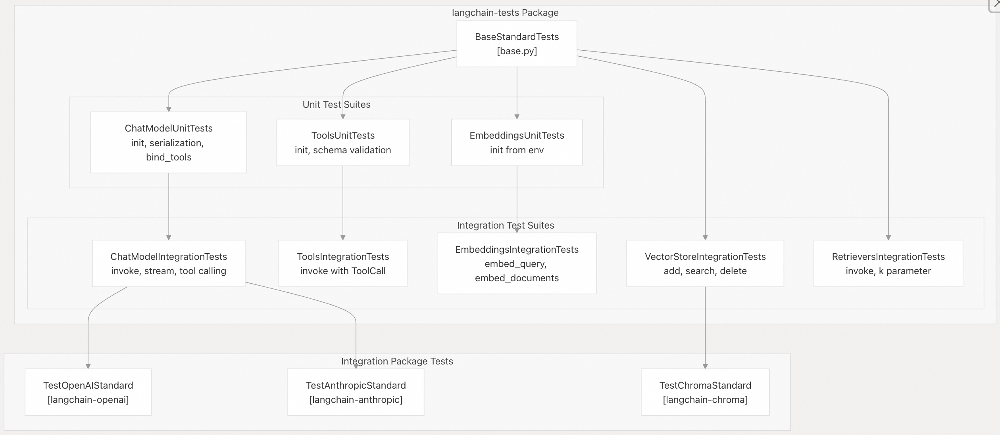
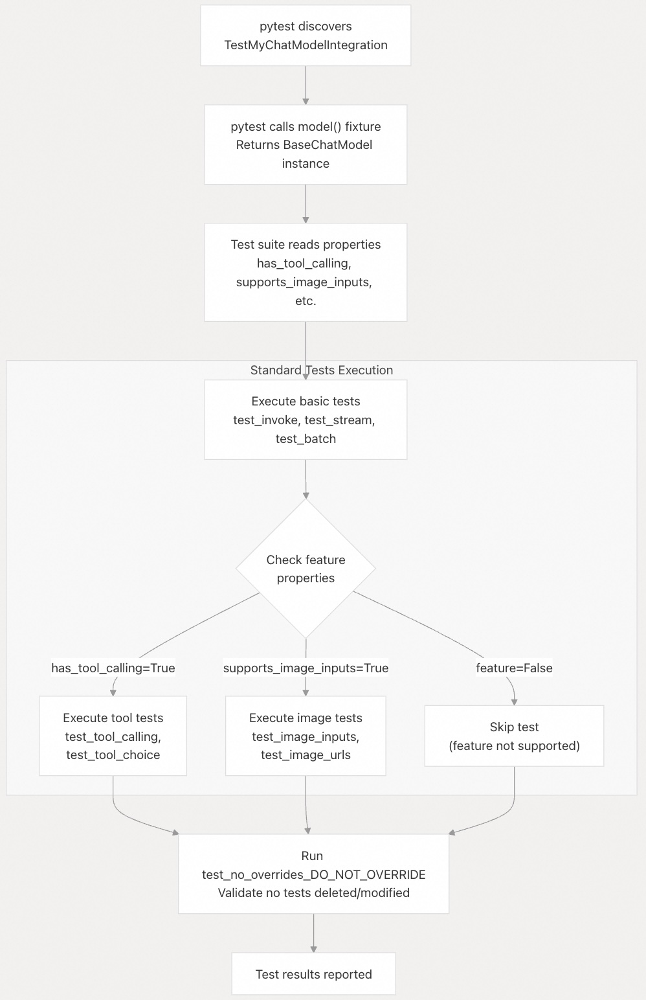
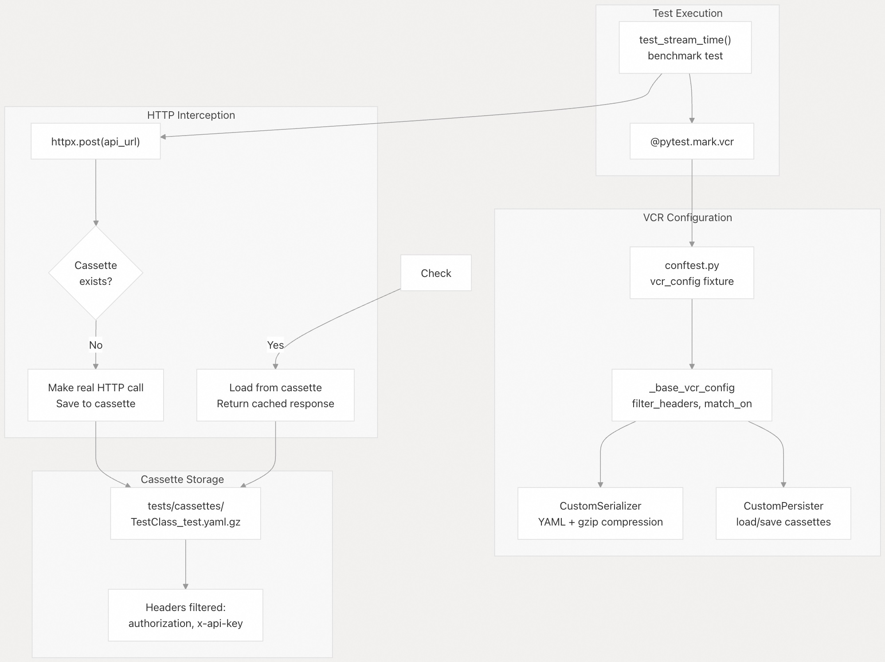
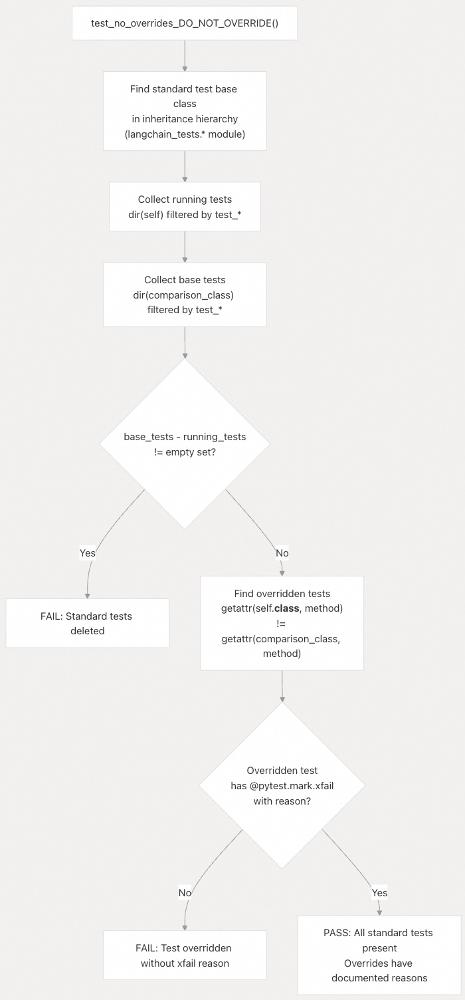

## LangChain 源码学习: 5.1 标准测试框架（Standard Testing Framework）                                     
                                                                                
### 作者                                                                        
digoal                                                                        
                                                                                
### 日期                                                                          
2025-10-21                                                                              
                                                                         
### 标签                                                                              
AI Agent , Powered by LLM , LangChain , 源码学习                                                                         
                                                                               
----                                                                           
                                                                           
## 背景                                     
**标准测试框架**（`langchain-tests`）是一个可复用的测试套件包，为 LangChain 各类组件提供标准化的集成测试和单元测试。各集成包通过继承这些测试类，确保所有 LangChain 提供商（如 OpenAI、Anthropic、向量数据库、工具等）的行为保持一致。  
  
## 目的与范围  
  
`langchain-tests` 包主要承担三项核心功能：  
- 1、标准化：确保所有集成包（20 多个聊天模型提供商、向量存储、工具等）正确实现相同的核心接口  
- 2、可重用性：通过提供集成包继承的测试实现来避免重复  
- 3、提供 `test_no_overrides_DO_NOT_OVERRIDE` 机制，防止标准测试被意外覆盖或删除。  
  
集成开发者需从 `langchain-tests` 中继承测试套件，配置支持的功能属性，并运行完整测试套件以验证其实现是否符合规范。  
  
**来源**：  
- [`libs/standard-tests/pyproject.toml`](https://github.com/langchain-ai/langchain/blob/e3fc7d8a/libs/standard-tests/pyproject.toml#L1-L120)  
- [`libs/standard-tests/langchain_tests/__init__.py`](https://github.com/langchain-ai/langchain/blob/e3fc7d8a/libs/standard-tests/langchain_tests/__init__.py#L1-L6)  
  
## 架构概览  
  
### 测试类继承结构  
  
  
**测试继承模式**：集成包继承特定组件的测试套件（例如 `ChatModelIntegrationTests`），而这些套件又继承自 `BaseStandardTests`。每个测试套件都包含数十个预定义的测试用例，用于验证组件行为是否符合预期。  
  
**来源**：    
- [`libs/standard-tests/langchain_tests/base.py`](https://github.com/langchain-ai/langchain/blob/e3fc7d8a/libs/standard-tests/langchain_tests/base.py#L1-L63)  
- [`libs/standard-tests/langchain_tests/integration_tests/__init__.py`](https://github.com/langchain-ai/langchain/blob/e3fc7d8a/libs/standard-tests/langchain_tests/integration_tests/__init__.py#L1-L41)   
- [`libs/standard-tests/langchain_tests/unit_tests/chat_models.py`](https://github.com/langchain-ai/langchain/blob/e3fc7d8a/libs/standard-tests/langchain_tests/unit_tests/chat_models.py#L60-L259)  
  
## 核心组件  
  
### BaseStandardTests  
  
`BaseStandardTests` 类是所有标准测试套件的基础，包含一个关键的保护机制。  
  
**关键方法**：`test_no_overrides_DO_NOT_OVERRIDE()`  
  
该测试确保集成包无法意外删除或覆盖标准测试。其工作原理如下：  
- 在继承层次结构中查找标准测试基类  
- 比较实现和基类之间的方法  
- 使用 `@pytest.mark.xfail(reason="...")` 标记明确记录失败原因。  
- 若测试方法被覆盖但未使用 `xfail` 标记，则测试失败。  
  
```  
# From BaseStandardTests  
def test_no_overrides_DO_NOT_OVERRIDE(self) -> None:  
    running_tests = {method for method in dir(self) if method.startswith("test_")}  
    base_tests = {method for method in dir(comparison_class) if method.startswith("test_")}  
    deleted_tests = base_tests - running_tests  
    assert not deleted_tests, f"Standard tests deleted: {deleted_tests}"  
```  
  
**来源**：  
- [`libs/standard-tests/langchain_tests/base.py`](https://github.com/langchain-ai/langchain/blob/e3fc7d8a/libs/standard-tests/langchain_tests/base.py#L4-L63)  
  
### ChatModelIntegrationTests  
  
这是最全面的测试套件，用于验证聊天模型的实现。  
  
**配置属性**：  
  
| 属性 | 类型 | 用途 | 默认值 |  
|------|------|------|--------|  
| `chat_model_class` | `type[BaseChatModel]` | 要测试的聊天模型类 | 必填（抽象） |  
| `chat_model_params` | `dict` | 初始化参数 | `{}` |  
| `has_tool_calling` | `bool` | 是否支持 `bind_tools()` | 自动检测（通过方法重写） |  
| `has_tool_choice` | `bool` | 是否支持强制调用特定工具 | 自动检测（通过函数签名） |  
| `has_structured_output` | `bool` | 是否支持 `with_structured_output()` | 自动检测 |  
| `supports_image_inputs` | `bool` | 是否接受图像内容块 | `False` |  
| `supports_pdf_inputs` | `bool` | 是否接受 PDF 内容块 | `False` |  
| `returns_usage_metadata` | `bool` | 是否返回 token 使用量元数据 | `True` |  
| `enable_vcr_tests` | `bool` | 是否启用 VCR 缓存的基准测试 | `False` |  
  
**核心测试方法**：  
  
- `test_invoke()`：验证 `model.invoke("Hello")` 返回 `AIMessage`  
- `test_stream()`：验证流式输出生成 `AIMessageChunk` 对象  
- `test_batch()`：验证批量处理多个提示  
- `test_tool_calling()`：验证工具调用的生成与解析（若 `has_tool_calling=True`）  
- `test_usage_metadata()`：验证 token 使用量追踪（若 `returns_usage_metadata=True`）  
  
**来源**：    
- [`libs/standard-tests/langchain_tests/integration_tests/chat_models.py`](https://github.com/langchain-ai/langchain/blob/e3fc7d8a/libs/standard-tests/langchain_tests/integration_tests/chat_models.py#L143-L1687)  
- [`libs/standard-tests/langchain_tests/unit_tests/chat_models.py`](https://github.com/langchain-ai/langchain/blob/e3fc7d8a/libs/standard-tests/langchain_tests/unit_tests/chat_models.py#L60-L259)  
  
### VectorStoreIntegrationTests  
  
用于向量数据库实现的测试套件，验证 CRUD 操作与搜索功能。  
  
**Fixture 要求**：  
```  
@pytest.fixture  
def vectorstore(self) -> VectorStore:  
    """Return EMPTY vector store using self.get_embeddings()"""  
```  
  
**关键测试**：  
  
- `test_add_documents()`：验证文档添加（带自动生成 ID）  
- `test_similarity_search()`：验证无阈值的相似性检索  
- `test_delete()`：验证按 ID 删除  
- `test_add_documents_by_id_with_mutation()`：验证按 ID 覆盖更新（upsert）  
- `test_get_by_ids()`：验证按 ID 顺序检索（若 `has_get_by_ids=True`）  
  
**来源**：  
- [`libs/standard-tests/langchain_tests/integration_tests/vectorstores.py`](https://github.com/langchain-ai/langchain/blob/e3fc7d8a/libs/standard-tests/langchain_tests/integration_tests/vectorstores.py#L21-L799)  
  
### ToolsTests 层级结构  
  
为工具实现提供独立的单元测试和集成测试套件。  
  
**ToolsUnitTests**：  
  
- `test_init()`：验证工具初始化  
- `test_has_name()`：确保工具具有 `name` 属性  
- `test_has_input_schema()`：验证定义了 `args_schema`  
- `test_input_schema_matches_invoke_params()`：验证示例参数与 schema 一致  
  
**ToolsIntegrationTests**：  
  
- `test_invoke_matches_output_schema()`：验证使用 `ToolCall` 调用时返回有效的 `ToolMessage` 内容  
- `test_invoke_no_tool_call()`：验证工具能处理 kwargs 形式的调用  
  
**来源**：    
- [`libs/standard-tests/langchain_tests/unit_tests/tools.py`](https://github.com/langchain-ai/langchain/blob/e3fc7d8a/libs/standard-tests/langchain_tests/unit_tests/tools.py#L16-L124)  
- [`libs/standard-tests/langchain_tests/integration_tests/tools.py`](https://github.com/langchain-ai/langchain/blob/e3fc7d8a/libs/standard-tests/langchain_tests/integration_tests/tools.py#L9-L93)  
  
## 使用模式：实现标准测试  
  
### 步骤 1：继承测试套件  
```  
# Example: Testing a custom chat model  
from langchain_tests.integration_tests import ChatModelIntegrationTests  
from my_package import MyChatModel  
  
class TestMyChatModelIntegration(ChatModelIntegrationTests):  
    @property  
    def chat_model_class(self) -> type[MyChatModel]:  
        return MyChatModel  
      
    @property  
    def chat_model_params(self) -> dict:  
        return {"model": "my-model-001", "temperature": 0}  
```  
  
### 步骤 2：配置功能支持  
```  
class TestMyChatModelIntegration(ChatModelIntegrationTests):  
    # ... class and params properties ...  
      
    @property  
    def supports_image_inputs(self) -> bool:  
        return True  # Enable image input tests  
      
    @property  
    def has_tool_calling(self) -> bool:  
        return True  # Enable tool calling tests  
```  
  
### 步骤 3：处理不支持的测试  
  
对于无法支持的功能，使用 `@pytest.mark.xfail` 标记：  
```  
@pytest.mark.xfail(reason="MyChatModel doesn't support stop sequences")  
def test_stop_sequence(self, model: BaseChatModel) -> None:  
    super().test_stop_sequence(model)  
```  
  
**来源**：    
- [`libs/standard-tests/langchain_tests/integration_tests/chat_models.py`](https://github.com/langchain-ai/langchain/blob/e3fc7d8a/libs/standard-tests/langchain_tests/integration_tests/chat_models.py#L143-L193)  
- [`libs/partners/openai/tests/integration_tests/chat_models/test_responses_standard.py`](https://github.com/langchain-ai/langchain/blob/e3fc7d8a/libs/partners/openai/tests/integration_tests/chat_models/test_responses_standard.py#L18-L127)  
  
## 测试执行流程  
  
  
**基于属性的测试执行**：测试会查询布尔属性以决定是否运行特定功能测试。例如，仅当 `has_tool_calling=True` 时才运行 `test_tool_calling()`。  
  
**来源**：    
- [`libs/standard-tests/langchain_tests/integration_tests/chat_models.py`](https://github.com/langchain-ai/langchain/blob/e3fc7d8a/libs/standard-tests/langchain_tests/integration_tests/chat_models.py#L694-L1687)  
- [`libs/standard-tests/langchain_tests/unit_tests/chat_models.py`](https://github.com/langchain-ai/langchain/blob/e3fc7d8a/libs/standard-tests/langchain_tests/unit_tests/chat_models.py#L86-L96)  
  
## VCR 测试系统  
  
VCR（Video Cassette Recorder）系统通过将 HTTP 交互录制到“磁带”（cassette）文件中，实现确定性、快速的集成测试。  
  
### VCR 架构  
  
  
  
**VCR 工作流程**：  
- 1、使用 `@pytest.mark.vcr` 拦截 HTTP 调用  
- 2、首次运行：发出真正的 HTTP 请求，将响应保存到压缩的 YAML “磁带”（cassette）文件中  
- 3、后续运行：重播来自“磁带”（cassette）文件的响应（无网络访问）  
- 4、将“磁带”（cassette）文件提交至仓库(repository)以实现确定性 CI/CD  
  
**来源**：  
- [`libs/standard-tests/langchain_tests/conftest.py`](https://github.com/langchain-ai/langchain/blob/e3fc7d8a/libs/standard-tests/langchain_tests/conftest.py#L1-L120)  
  
### VCR 配置  
  
集成包必须配置 VCR 以排除敏感请求头：  
```  
# tests/conftest.py  
import pytest  
from langchain_tests.conftest import _base_vcr_config  
  
@pytest.fixture(scope="session")  
def vcr_config(_base_vcr_config: dict) -> dict:  
    config = _base_vcr_config.copy()  
    config.setdefault("filter_headers", []).extend([  
        ("user-agent", "PLACEHOLDER"),  
    ])  
    return config  
```  
  
**默认过滤的请求头**：  
- `authorization`  
- `x-api-key`  
- `api-key`  
  
**磁带压缩**：使用 `CustomSerializer` 和 `CustomPersister` 对磁带进行 gzip 压缩，减小仓库(repository)体积，同时可通过 `gunzip` 解压保持可读性。  
  
**来源**：    
- [`libs/standard-tests/langchain_tests/conftest.py`](https://github.com/langchain-ai/langchain/blob/e3fc7d8a/libs/standard-tests/langchain_tests/conftest.py#L17-L120)  
- [`libs/standard-tests/langchain_tests/integration_tests/chat_models.py`](https://github.com/langchain-ai/langchain/blob/e3fc7d8a/libs/standard-tests/langchain_tests/integration_tests/chat_models.py#L533-L686)  
  
## 测试保护机制  
  
### 覆盖检测算法  
  
  
**保护规则**：  
- 1、禁止删除：基类中的所有测试都必须存在于子类中  
- 2、无静默覆盖(No Silent Override)：若覆盖标准测试方法，必须使用 `@pytest.mark.xfail(reason="...")`  
- 3、`reason` 参数为必填项，使用 kwarg 来记录失败原因  
  
**来源**：  
- [`libs/standard-tests/langchain_tests/base.py`](https://github.com/langchain-ai/langchain/blob/e3fc7d8a/libs/standard-tests/langchain_tests/base.py#L7-L62)  
  
## 组件专用测试套件  
  
### EmbeddingsIntegrationTests  
  
用于嵌入模型实现的测试。  
  
**关键测试**：  
- `test_embed_query()`：验证单字符串嵌入返回 `list[float]`  
- `test_embed_documents()`：验证批量嵌入返回 `list[list[float]]`  
- `test_aembed_query()`：验证异步查询嵌入  
- `test_aembed_documents()`：验证异步批量嵌入  
  
**一致性要求**：所有嵌入向量必须具有相同的维度（长度）。  
  
**来源**：  
- [`libs/standard-tests/langchain_tests/integration_tests/embeddings.py`](https://github.com/langchain-ai/langchain/blob/e3fc7d8a/libs/standard-tests/langchain_tests/integration_tests/embeddings.py#L8-L120)  
  
### RetrieversIntegrationTests  
  
用于检索器（Retriever）实现的测试。  
  
**配置属性**：  
  
| 属性 | 用途 | 默认值 |  
|------|------|--------|  
| `retriever_constructor` | 要测试的检索器类 | 必填 |  
| `retriever_query_example` | 示例查询字符串 | 必填 |  
| `num_results_arg_name` | 控制返回结果数量的参数名 | `"k"` |  
  
**关键测试**：  
- `test_k_constructor_param()`：验证检索器构造函数接受结果数量参数  
- `test_invoke_with_k_kwarg()`：验证 `invoke()` 中可覆盖结果数量  
- `test_invoke_returns_documents()`：验证检索器返回 `list[文档]`  
  
**来源**：  
- [`libs/standard-tests/langchain_tests/integration_tests/retrievers.py`](https://github.com/langchain-ai/langchain/blob/e3fc7d8a/libs/standard-tests/langchain_tests/integration_tests/retrievers.py#L12-L182)  
  
### BaseStore 测试套件  
  
用于键值存储（Key-Value Store）实现的测试（支持同步与异步）。  
  
**BaseStoreSyncTests**：  
- `test_set_and_get_values()`：验证 `mset()` 和 `mget()`  
- `test_delete_values()`：验证 `mdelete()`  
- `test_set_values_is_idempotent()`：验证重复设置不会产生重复  
- `test_yield_keys()`：验证带可选前缀的键迭代  
  
**BaseStoreAsyncTests**：异步版本，使用 `amset()`、`amget()`、`amdelete()`、`ayield_keys()`  
  
**来源**：  
- [`libs/standard-tests/langchain_tests/integration_tests/base_store.py`](https://github.com/langchain-ai/langchain/blob/e3fc7d8a/libs/standard-tests/langchain_tests/integration_tests/base_store.py#L18-L315)  
  
## 标准聊天模型代码覆盖测试  
  
`ChatModelIntegrationTests` 套件在多个维度提供全面覆盖：  
  
### 基础调用测试  
  
| 测试方法 | 验证内容 |  
|----------|----------|  
| `test_invoke()` | `model.invoke("Hello")` 返回 `AIMessage` |  
| `test_ainvoke()` | 异步调用正常工作 |  
| `test_stream()` | 流式输出生成 `AIMessageChunk` 对象 |  
| `test_astream()` | 异步流式输出正常工作 |  
| `test_batch()` | 批量处理多个提示 |  
| `test_abatch()` | 异步批量处理 |  
  
### 对话测试  
  
| 测试方法 | 验证内容 |  
|----------|----------|  
| `test_conversation()` | 多轮对话处理能力 |  
| `test_double_messages_conversation()` | 支持连续相同角色的消息（如两个 `SystemMessage`） |  
  
### 工具调用测试（若 `has_tool_calling=True`）  
  
| 测试方法 | 验证内容 |  
|----------|----------|  
| `test_tool_calling()` | 模型生成符合 schema 的工具调用 |  
| `test_tool_choice()` | 模型遵守 `tool_choice="any"` 或 `tool_choice="tool_name"` |  
| `test_parallel_tool_calling()` | 模型可在单次响应中调用多个工具 |  
| `test_tool_message_histories()` | 模型能处理包含 `ToolMessage` 的对话历史 |  
  
### 多模态测试  
  
| 属性 | 启用的测试方法 |  
|------|----------------|  
| `supports_image_inputs=True` | `test_image_inputs()`、`test_image_urls()` |  
| `supports_pdf_inputs=True` | `test_pdf_inputs()` |  
| `supports_audio_inputs=True` | `test_audio_inputs()` |  
| `supports_image_tool_message=True` | `test_image_tool_message()` |  
  
### 结构化输出测试（若 `has_structured_output=True`）  
  
| 测试方法 | 验证内容 |  
|----------|----------|  
| `test_structured_output()` | `with_structured_output()` 返回 Pydantic 模型实例 |  
| `test_structured_output_pydantic_2_v1_namespace()` | 若安装 Pydantic v2，则验证 v1 兼容性 |  
| `test_structured_output_optional_param()` | 正确处理可选字段 |  
  
**来源**：  
- [`libs/standard-tests/langchain_tests/integration_tests/chat_models.py`](https://github.com/langchain-ai/langchain/blob/e3fc7d8a/libs/standard-tests/langchain_tests/integration_tests/chat_models.py#L694-L1687)  
  
## Fixture 系统  
  
标准测试依赖 pytest 的 fixture 进行测试设置与配置。  
  
### 聊天模型 Fixture  
```  
@pytest.fixture  
def model(self, request: Any) -> BaseChatModel:  
    """Model fixture with parametrization support."""  
    extra_init_params = getattr(request, "param", None) or {}  
    return self.chat_model_class(  
        **{  
            **self.standard_chat_model_params,  
            **self.chat_model_params,  
            **extra_init_params,  
        },  
    )  
```  
  
**参数化支持**：支持使用 `@pytest.mark.parametrize("model", [...], indirect=True)` 测试不同配置。  
  
**来源**：  
- [`libs/standard-tests/langchain_tests/unit_tests/chat_models.py`](https://github.com/langchain-ai/langchain/blob/e3fc7d8a/libs/standard-tests/langchain_tests/unit_tests/chat_models.py#L86-L96)  
  
### 向量数据库 Fixture  
```  
@pytest.fixture  
def vectorstore(self) -> VectorStore:  
    """Return EMPTY vector store for each test."""  
    store = MyVectorStore(embedding=self.get_embeddings())  
    try:  
        yield store  
    finally:  
        store.delete_collection()  # Cleanup  
```  
  
**清理模式**：使用 `try/finally` 确保每次测试前向量库为空。  
  
**来源**：    
- [`libs/standard-tests/langchain_tests/integration_tests/vectorstores.py`](https://github.com/langchain-ai/langchain/blob/e3fc7d8a/libs/standard-tests/langchain_tests/integration_tests/vectorstores.py#L21-L99)  
- [`libs/standard-tests/tests/unit_tests/test_in_memory_vectorstore.py`](https://github.com/langchain-ai/langchain/blob/e3fc7d8a/libs/standard-tests/tests/unit_tests/test_in_memory_vectorstore.py#L12-L16)  
  
## 包配置  
  
### pyproject.toml 结构  
```  
[project]  
name = "langchain-tests"  
version = "1.0.0a2"  
dependencies = [  
    "langchain-core>=1.0.0a7,<2.0.0",  
    "pytest>=7.0.0,<9.0.0",  
    "pytest-asyncio>=0.20.0,<2.0.0",  
    "httpx>=0.28.1,<1.0.0",  
    "syrupy>=4.0.0,<5.0.0",  
    "pytest-socket>=0.7.0,<1.0.0",  
    "pytest-benchmark",  
    "pytest-codspeed",  
    "pytest-recording",  
    "vcrpy>=7.0.0,<8.0.0",  
    "numpy>=1.26.2; python_version<'3.13'",  
    "numpy>=2.1.0; python_version>='3.13'",  
]  
```  
  
**关键依赖**：  
- `pytest-asyncio`：异步测试支持    
- `pytest-socket`：防止意外网络访问    
- `pytest-benchmark`：性能基准测试    
- `vcrpy`：HTTP 请求录制    
- `syrupy`：快照测试  
  
**来源**：  
- [`libs/standard-tests/pyproject.toml`](https://github.com/langchain-ai/langchain/blob/e3fc7d8a/libs/standard-tests/pyproject.toml#L1-L120)  
  
### Pytest 配置  
```  
[tool.pytest.ini_options]  
addopts = "--strict-markers --strict-config --durations=5 -vv"  
markers = [  
    "requires: mark tests as requiring a specific library",  
    "scheduled: mark tests to run in scheduled testing",  
    "compile: mark placeholder test used to compile integration tests without running them",  
]  
asyncio_mode = "auto"  
asyncio_default_fixture_loop_scope = "function"  
```  
  
**严格模式**：启用 `--strict-markers` 和 `--strict-config`，确保测试标记拼写错误立即失败。  
  
**来源**：  
- [`libs/standard-tests/pyproject.toml`](https://github.com/langchain-ai/langchain/blob/e3fc7d8a/libs/standard-tests/pyproject.toml#L111-L119)  
  
## 示例实现  
  
### 完整的聊天模型测试实现  
```  
# tests/integration_tests/test_chat_models.py  
from typing import Type  
from langchain_core.language_models import BaseChatModel  
from langchain_tests.integration_tests import ChatModelIntegrationTests  
from my_package import MyChatModel  
  
class TestMyChatModelIntegration(ChatModelIntegrationTests):  
    @property  
    def chat_model_class(self) -> Type[MyChatModel]:  
        return MyChatModel  
      
    @property  
    def chat_model_params(self) -> dict:  
        return {"model": "my-model-001", "temperature": 0}  
      
    @property  
    def supports_image_inputs(self) -> bool:  
        return True  
      
    @property  
    def has_tool_calling(self) -> bool:  
        return True  
      
    @property  
    def enable_vcr_tests(self) -> bool:  
        return True  
```  
  
该实现继承约 50 个测试方法，验证以下内容：  
- 基本调用（同步/异步）  
- 流式传输（同步/异步）  
- 批处理  
- 工具调用  
- 图像输入  
- token 用量元数据  
- VCR缓存 基准测试  
  
**来源**：    
- [`libs/partners/openai/tests/integration_tests/chat_models/test_responses_standard.py`](https://github.com/langchain-ai/langchain/blob/e3fc7d8a/libs/partners/openai/tests/integration_tests/chat_models/test_responses_standard.py#L18-L127)  
- [`libs/standard-tests/tests/unit_tests/test_custom_chat_model.py`](https://github.com/langchain-ai/langchain/blob/e3fc7d8a/libs/standard-tests/tests/unit_tests/test_custom_chat_model.py#L14-L41)  
  
### 完整的向量数据库测试实现  
```  
# tests/integration_tests/test_vectorstore.py  
import pytest  
from langchain_core.vectorstores import VectorStore  
from langchain_tests.integration_tests import VectorStoreIntegrationTests  
from my_package import MyVectorStore  
  
class TestMyVectorStore(VectorStoreIntegrationTests):  
    @pytest.fixture  
    def vectorstore(self) -> VectorStore:  
        store = MyVectorStore(embedding=self.get_embeddings())  
        try:  
            yield store  
        finally:  
            store.delete_collection()  
```  
  
该实现继承约 20 个测试方法，验证以下内容：  
- 添加 带有/不带 ID 的文档  
- 相似性搜索  
- 删除  
- 幂等 upsert  
- `get_by_ids()`（如果支持）  
  
**来源**：  
- [`libs/standard-tests/tests/unit_tests/test_in_memory_vectorstore.py`](https://github.com/langchain-ai/langchain/blob/e3fc7d8a/libs/standard-tests/tests/unit_tests/test_in_memory_vectorstore.py#L12-L41)  
              
#### [期望 PostgreSQL|开源PolarDB 增加什么功能?](https://github.com/digoal/blog/issues/76 "269ac3d1c492e938c0191101c7238216")
  
  
#### [PolarDB 开源数据库](https://openpolardb.com/home "57258f76c37864c6e6d23383d05714ea")
  
  
#### [PolarDB 学习图谱](https://www.aliyun.com/database/openpolardb/activity "8642f60e04ed0c814bf9cb9677976bd4")
  
  
#### [PostgreSQL 解决方案集合](../201706/20170601_02.md "40cff096e9ed7122c512b35d8561d9c8")
  
  
#### [德哥 / digoal's Github - 公益是一辈子的事.](https://github.com/digoal/blog/blob/master/README.md "22709685feb7cab07d30f30387f0a9ae")
  
  
#### [About 德哥](https://github.com/digoal/blog/blob/master/me/readme.md "a37735981e7704886ffd590565582dd0")
  
  

  
