## LangChain 源码学习: 5.2 依赖管理与测试策略(Dependency Management and Testing Strategy)  
  
### 作者  
digoal  
  
### 日期  
2025-10-21  
  
### 标签  
AI Agent , Powered by LLM , LangChain , 源码学习  
  
----  
  
## 背景  
本文介绍 LangChain 严格的依赖管理理念和全面的测试策略，以确保单体仓库（monorepo）中各包的模块化、跨版本范围的兼容性，以及构建的可重现性。  
  
## 依赖理念与强制执行  
  
LangChain 遵循“开箱即用但可替换”（batteries included but swappable）的理念：核心包仅保留最少的必需依赖，同时通过依赖组（dependency groups）提供丰富的可选集成。这种方式使包保持轻量，用户只需安装所需部分。  
  
### 必需依赖 vs 可选依赖  
  
核心依赖结构将运行时必需依赖与按功能组织的可选依赖组明确分开：  
  
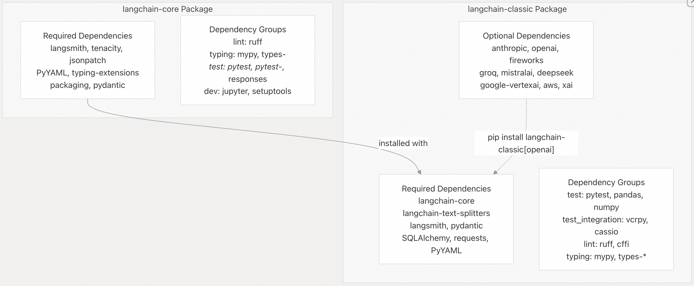  
  
**来源：**  
- [`libs/core/pyproject.toml`](https://github.com/langchain-ai/langchain/blob/e3fc7d8a/libs/core/pyproject.toml#L9-L16)  
- [`libs/langchain/pyproject.toml`](https://github.com/langchain-ai/langchain/blob/e3fc7d8a/libs/langchain/pyproject.toml#L9-L18)  
- [`libs/langchain/pyproject.toml`](https://github.com/langchain-ai/langchain/blob/e3fc7d8a/libs/langchain/pyproject.toml#L24-L42)  
  
### 通过单元测试(Unit Tests)强制依赖规范  
  
仓库使用单元测试防止意外引入新的必需依赖。如果必需依赖集合在未经显式批准的情况下发生变化，测试套件将失败：  
  
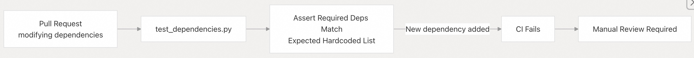  
  
[`libs/langchain/tests/unit_tests/test_dependencies.py`](https://github.com/langchain-ai/langchain/blob/e3fc7d8a/libs/langchain/tests/unit_tests/test_dependencies.py) 文件包含两个关键测试：  
- `test_required_dependencies()`（第 23–44 行）：验证 `dependencies` 列表中仅包含已批准的包  
- `test_test_group_dependencies()`（第 47–86 行）：确保测试基础设施依赖（如 pytest）不会与集成测试依赖（如 boto3、postgres 等）混用  
  
**来源：**   
- [`libs/langchain/tests/unit_tests/test_dependencies.py`](https://github.com/langchain-ai/langchain/blob/e3fc7d8a/libs/langchain/tests/unit_tests/test_dependencies.py#L1-L87)  
  
## 锁文件(Lock Files)与可重现构建  
  
LangChain 使用 `uv` 作为包管理器，并通过 `uv.lock` 锁文件确保开发、CI 和发布环境中的构建可重现。  
  
### 锁文件结构  
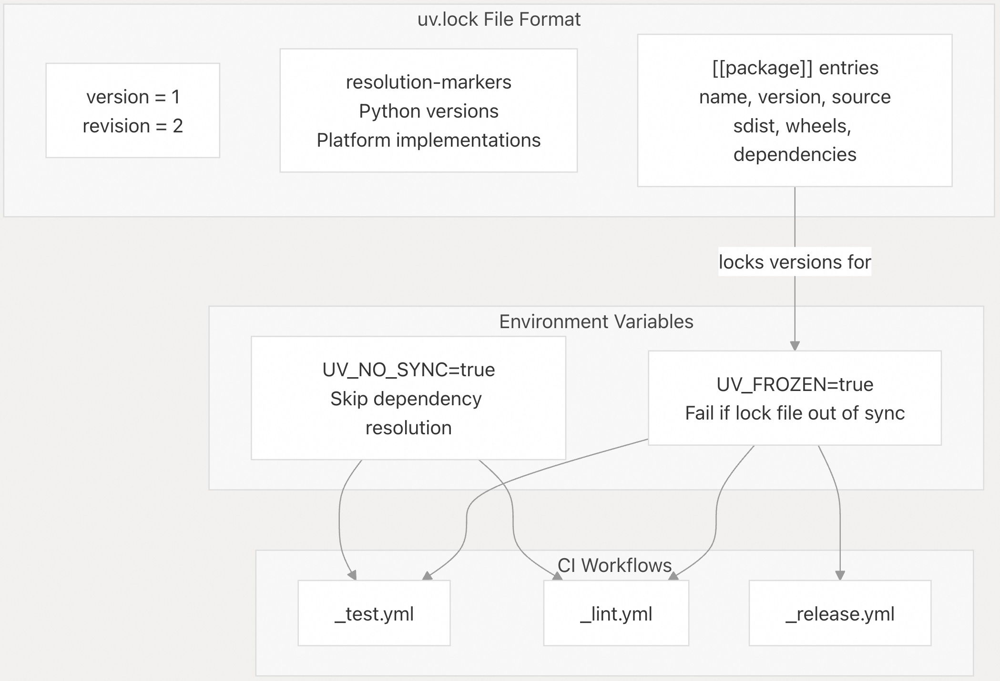  
  
锁文件包含 **resolution-markers**，用于指定每个 Python 版本和平台组合下解析的依赖项（见 [`libs/core/uv.lock` 第 4–13 行](https://github.com/langchain-ai/langchain/blob/e3fc7d8a/libs/core/uv.lock#L4-L13)）。每个包条目都包含精确版本号、文件哈希（sha256）和文件大小，涵盖源码分发包（sdist）和 wheel 包。  
  
CI 中通过环境变量强制使用锁文件：  
- `UV_FROZEN=true`：确保锁文件与 `pyproject.toml` 同步，若不同步则失败  
- `UV_NO_SYNC=true`：禁止自动解析依赖，仅使用锁定版本  
  
**来源：**  
- [`libs/core/uv.lock`（第 1–14 行）](https://github.com/langchain-ai/langchain/blob/e3fc7d8a/libs/core/uv.lock#L1-L14)  
- [`.github/workflows/check_diffs.yml`（第 38–39 行）](https://github.com/langchain-ai/langchain/blob/e3fc7d8a/.github/workflows/check_diffs.yml#L38-L39)  
- [`.github/workflows/_test.yml`（第 22–23 行）](https://github.com/langchain-ai/langchain/blob/e3fc7d8a/.github/workflows/_test.yml#L22-L23)  
  
## 最低版本测试策略  
  
LangChain 同时针对锁文件中的最新依赖版本和依赖约束中指定的最低支持版本进行测试，以确保包在整个支持版本范围内都能正常工作，而不仅限于最新版本。  
  
### 版本计算算法  
  
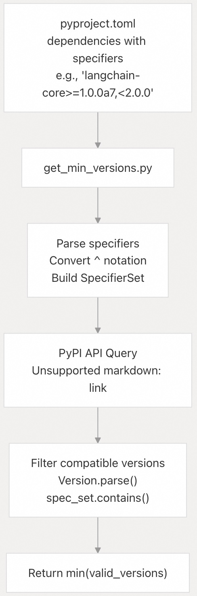  
  
`get_min_versions.py` 脚本实现了以下算法：  
- **约束标准化**（第 67–77 行）：将 Poetry 的脱字符号（`^x.y.z`）转换为标准版本说明符  
  - `^0.0.z` → `0.0.z`（精确匹配）  
  - `^0.y.z` → `>=0.y.z,<0.y+1`  
  - `^x.y.z` → `>=x.y.z,<x+1`  
- **PyPI 版本获取**（第 37–53 行）：查询 PyPI JSON API 获取所有已发布版本  
- **版本过滤**（第 82–89 行）：使用 `packaging.specifiers.SpecifierSet` 验证每个版本是否符合约束  
- **最低版本选择**（第 91 行）：返回 `min(valid_versions)` 作为最低兼容版本  
  
**来源：**   
- [`.github/scripts/get_min_versions.py`（第 1–200 行）](https://github.com/langchain-ai/langchain/blob/e3fc7d8a/.github/scripts/get_min_versions.py#L1-L200)  
  
### 测试工作流集成  
  
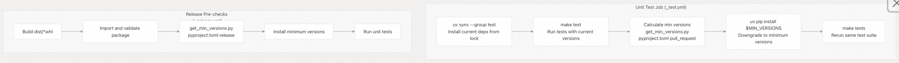  
  
拉取请求（PR）与正式发布（release）的测试流程不同：  
  
- **拉取请求测试**（[`.github/workflows/_test.yml` 第 56–73 行](https://github.com/langchain-ai/langchain/blob/e3fc7d8a/.github/workflows/_test.yml#L56-L73)）：  
  - 使用 `versions_for="pull_request"` 计算最低版本  
  - 跳过某些包（`langchain-core`、`langchain-text-splitters`）以允许跨包同时进行更改  
  - 使用 `MIN_VERSIONS` 环境变量  
- **正式发布测试**（[`.github/workflows/_release.yml` 第 317–336 行](https://github.com/langchain-ai/langchain/blob/e3fc7d8a/.github/workflows/_release.yml#L317-L336)）：  
  - 使用 `versions_for="release"` 计算最低版本  
  - 测试所有依赖项，包括跨包依赖项  
  - 如果最低版本测试失败，则阻止发布  
  
`MIN_VERSION_LIBS` 常量（[`.github/scripts/get_min_versions.py` 第 20–26 行](https://github.com/langchain-ai/langchain/blob/e3fc7d8a/.github/scripts/get_min_versions.py#L20-L26)）指定了哪些包需进行最低版本测试：  
- `langchain-core`  
- `langchain`  
- `langchain-text-splitters`  
- `numpy`  
- `SQLAlchemy`  
  
**来源：**  
- [`.github/workflows/_test.yml`（第 55–73 行）](https://github.com/langchain-ai/langchain/blob/e3fc7d8a/.github/workflows/_test.yml#L55-L73)  
- [`.github/workflows/_release.yml`（第 317–336 行）](https://github.com/langchain-ai/langchain/blob/e3fc7d8a/.github/workflows/_release.yml#L317-L336)  
- [`.github/scripts/get_min_versions.py`（第 20–34 行）](https://github.com/langchain-ai/langchain/blob/e3fc7d8a/.github/scripts/get_min_versions.py#L20-L34)  
  
## Pydantic 兼容性测试  
  
LangChain 在多个 Pydantic v2 的小版本（当前为 2.7 至 2.14）上进行兼容性测试，以确保代码库在整个支持的 Pydantic 版本范围内正常工作。  
  
### 版本范围确定方式  
  
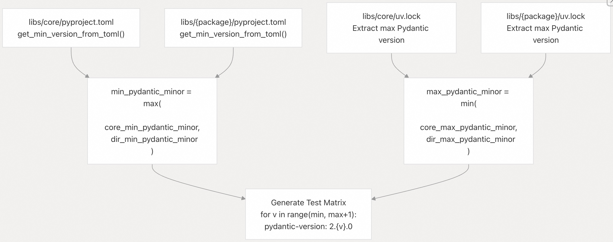  
  
`_get_pydantic_test_configs()` 函数（[`.github/scripts/check_diff.py` 第 154–206 行](https://github.com/langchain-ai/langchain/blob/e3fc7d8a/.github/scripts/check_diff.py#L154-L206)）实现如下逻辑：  
- 1、从锁文件中提取最高版本: 从 `uv.lock` 获取已安装的 Pydantic 版本  
- 2、根据约束计算最低版本: 通过 `get_min_version_from_toml()` 确定下限  
- 3、计算交集: 考虑 core 和 package 版本范围的重叠  
- 4、为每个小版本生成 `pydantic-version: "2.{v}.0"` 配置  
  
### 测试工作流  
  
`_test_pydantic.yml` 工作流（[`.github/workflows/_test_pydantic.yml`](https://github.com/langchain-ai/langchain/blob/e3fc7d8a/.github/workflows/_test_pydantic.yml)）执行：  
- 矩阵中的每个任务使用 `~=` 兼容发布操作符安装特定的 Pydantic 小版本（第 54 行），允许补丁版本更新，但不允许小版本更新  
  
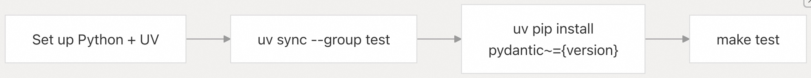  
  
**来源：**  
- [`.github/scripts/check_diff.py`（第 154–206 行）](https://github.com/langchain-ai/langchain/blob/e3fc7d8a/.github/scripts/check_diff.py#L154-L206)  
- [`.github/workflows/_test_pydantic.yml`（第 1–72 行）](https://github.com/langchain-ai/langchain/blob/e3fc7d8a/.github/workflows/_test_pydantic.yml#L1-L72)  
  
## 包隔离与模块化  
  
依赖管理系统通过严格隔离各包，维护“可替换”的设计理念。  
  
### 依赖组组织方式  
  
每个包在 `pyproject.toml` 中定义了五个主要依赖组：  
  
| 组名 | 用途 | 示例 | 安装命令 |  
|------|------|------|--------|  
| test | 单元测试基础设施 | pytest, pytest-asyncio, pytest-mock, freezegun, syrupy | `uv sync --group test` |  
| test_integration | 集成测试依赖 | vcrpy, python-dotenv, cassio | `uv sync --group test_integration` |  
| lint | 代码质量工具 | ruff, cffi | `uv sync --group lint` |  
| typing | 类型检查工具 | mypy, types-pyyaml, types-requests | `uv sync --group typing` |  
| dev | 开发辅助工具 | jupyter, setuptools, grandalf | `uv sync --group dev` |  
  
**来源：**  
- [`libs/core/pyproject.toml`（第 31–62 行）](https://github.com/langchain-ai/langchain/blob/e3fc7d8a/libs/core/pyproject.toml#L31-L62)  
- [`libs/langchain/pyproject.toml`（第 51–116 行）](https://github.com/langchain-ai/langchain/blob/e3fc7d8a/libs/langchain/pyproject.toml#L51-L116)  
  
### 合作伙伴包的独立性  
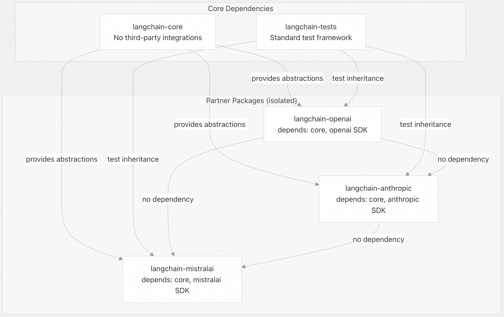  
  
合作伙伴包彼此完全独立：  
- `langchain-core` 提供基础抽象  
- 用户可单独安装如 `langchain-openai` 和 `langchain-anthropic`  
  ```  
  pip install langchain-openai langchain-anthropic  
  ```  
  
**来源：**   
- [`libs/README.md`（第 1–33 行）](https://github.com/langchain-ai/langchain/blob/e3fc7d8a/libs/README.md#L1-L33)  
  
## CI/CD 测试策略  
  
CI 系统采用**差异测试**（differential testing）策略，仅测试受代码变更影响的包，以优化构建时间。  
  
### 变更检测与测试矩阵生成  
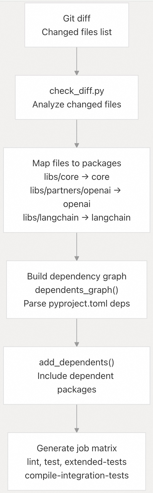  
  
`check_diff.py` 脚本（[`.github/scripts/check_diff.py`](https://github.com/langchain-ai/langchain/blob/e3fc7d8a/.github/scripts/check_diff.py)）实现以下逻辑：  
  
1、**文件映射**（第 250–320 行）：将变更文件映射到包目录  
- `libs/core/*` → 对所有 `LANGCHAIN_DIRS` 执行扩展测试  
- `libs/partners/{name}/*` → 仅测试该合作伙伴包  
- `libs/standard-tests/*` → 测试 openai、anthropic、mistralai、fireworks、groq  
- `.github/workflows/*` → 对所有核心包执行扩展测试（安全措施）  
  
2、**依赖图构建**（第 62–112 行）：构建 `包名 → {依赖该包的包}` 映射  
- 基于 `pyproject.toml` 的依赖  
- 使用 `extended_testing_deps.txt` 补充测试依赖  
- 从依赖图中排除 `IGNORED_PARTNERS`（如 huggingface、prompty）  
  
3、**矩阵生成**（第 209–230 行）：为 GitHub Actions 生成 JSON 配置，包含 `working-directory` 和 `python-version`  
  
**来源：**   
- [`.github/scripts/check_diff.py`（第 1–347 行）](https://github.com/langchain-ai/langchain/blob/e3fc7d8a/.github/scripts/check_diff.py#L1-L347)  
  
### 多阶段测试执行  
  
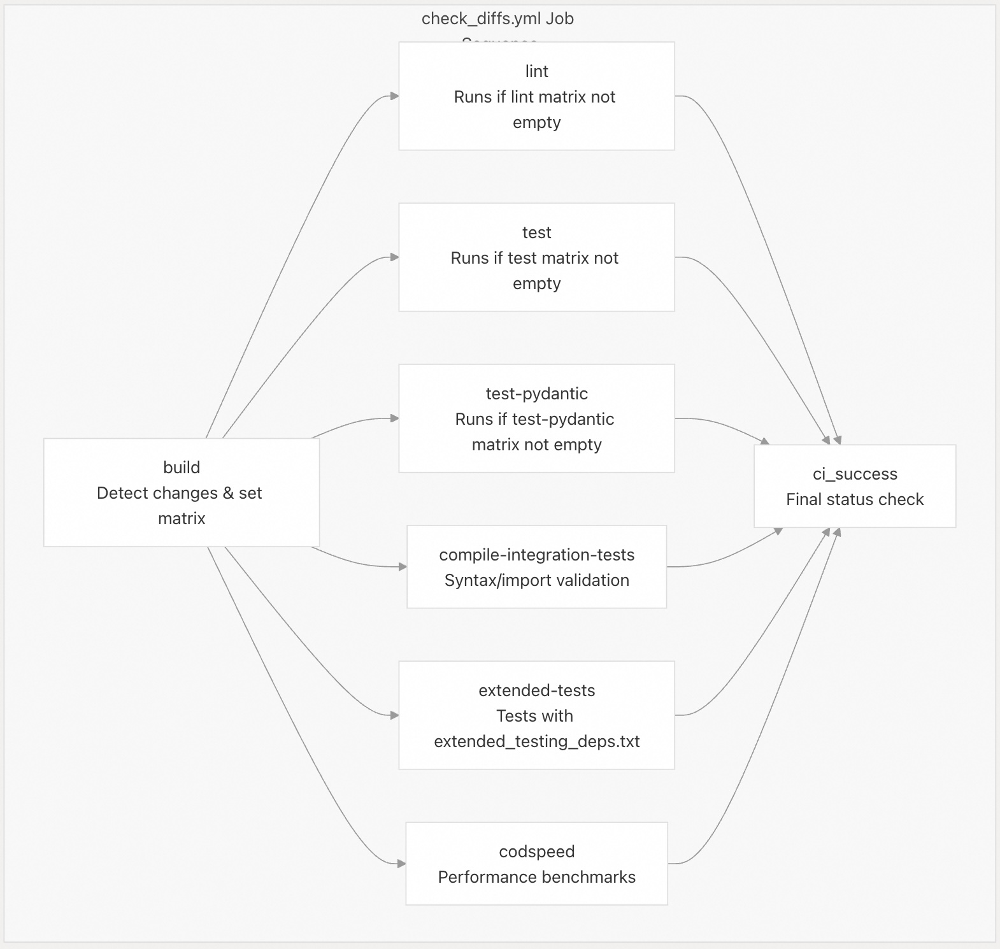  
  
每种任务类型有特定目的：  
- lint [`.github/workflows/_lint.yml`](https://github.com/langchain-ai/langchain/blob/e3fc7d8a/.github/workflows/_lint.yml) - 运行 `ruff` 和 `mypy` 并测试包和代码  
- test [`.github/workflows/_test.yml`](https://github.com/langchain-ai/langchain/blob/e3fc7d8a/.github/workflows/_test.yml) - 使用当前依赖进行单元测试，然后使用最低版本重新测试  
- test-pydantic [`.github/workflows/_test_pydantic.yml`](https://github.com/langchain-ai/langchain/blob/e3fc7d8a/.github/workflows/_test_pydantic.yml) - 跨 Pydantic 次要版本（2.7-2.14）进行测试  
- compile-integration-tests [`.github/workflows/_compile_integration_test.yml`](https://github.com/langchain-ai/langchain/blob/e3fc7d8a/.github/workflows/_compile_integration_test.yml) - 验证集成测试编译而无需运行它们  
- extended-tests [`.github/workflows/check_diffs.yml`](https://github.com/langchain-ai/langchain/blob/e3fc7d8a/.github/workflows/check_diffs.yml#L129-L173) - 运行需要依赖项(`extended_testing_deps.txt`)的测试   
- codspeed [`.github/workflows/check_diffs.yml`](https://github.com/langchain-ai/langchain/blob/e3fc7d8a/.github/workflows/check_diffs.yml#L175-L234) - 使用 CodSpeed 进行性能基准测试  
  
`ci_success` 任务（[第 237–262 行](https://github.com/langchain-ai/langchain/blob/e3fc7d8a/lines%20237-262)）汇总所有结果，若任一任务失败则阻止合并。  
  
**来源：**  
- [`.github/workflows/check_diffs.yml`（第 41–262 行）](https://github.com/langchain-ai/langchain/blob/e3fc7d8a/.github/workflows/check_diffs.yml#L41-L262)  
- [`.github/workflows/_test.yml`（第 1–86 行）](https://github.com/langchain-ai/langchain/blob/e3fc7d8a/.github/workflows/_test.yml#L1-L86)  
- [`.github/workflows/_lint.yml`（第 1–76 行）](https://github.com/langchain-ai/langchain/blob/e3fc7d8a/.github/workflows/_lint.yml#L1-L76)  
  
## 发布前验证  
  
发布流水线采用纵深防御（defense-in-depth）策略，在发布到 PyPI 前进行多重验证。  
  
### 发布流水线架构  
  
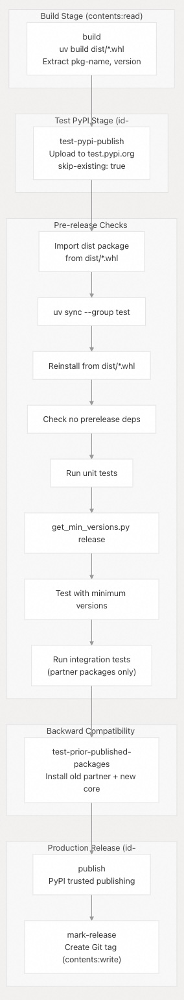  
  
关键安全与验证措施包括：  
  
1、**权限隔离**（[`.github/workflows/_release.yml` 第 39–206 行](https://github.com/langchain-ai/langchain/blob/e3fc7d8a/.github/workflows/_release.yml#L39-L206)）  
- build stage : 仅授予 `contents:read`（无凭据访问权限）  
- Publish stage : 使用 `id-token:write` 实现 OIDC 可信发布  
- No long-lived tokens stored in repository  
  
2、**Test PyPI 验证**（[第 216–228 行](https://github.com/langchain-ai/langchain/blob/e3fc7d8a/lines%20216-228)）  
- 先发布到 `test.pypi.org`   
- `skip-existing: true` 允许重试  
- 产品化前先进行冒烟测试  
  
3、**无缓存导入验证**（[第 242–253 行、266–290 行](https://github.com/langchain-ai/langchain/blob/e3fc7d8a/lines%20242-253,%20266-290)）  
- 明确避免依赖缓存以捕获缺失的依赖项  
- 从构建的 wheel 文件安装  
- 测试包的实际导入  
  
4、**预发布依赖检查**（[第 306–311 行](https://github.com/langchain-ai/langchain/blob/e3fc7d8a/lines%20306-311)）  
- `check_prerelease_dependencies.py`, 若发现任何依赖允许预发布版本，则阻止发布  
- 确保稳定版本不依赖于不稳定的软件包  
  
5、**向后兼容性测试**（仅限 core，[第 385–470 行](https://github.com/langchain-ai/langchain/blob/e3fc7d8a/lines%20385-470)）  
- 获取最新发布的合作伙伴包(partner packages)  
- 针对新的核心版本进行测试  
- 确保核心变更不会破坏现有的集成  
  
**来源：**   
- [`.github/workflows/_release.yml`（第 1–555 行）](https://github.com/langchain-ai/langchain/blob/e3fc7d8a/.github/workflows/_release.yml#L1-L555)  
    
#### [期望 PostgreSQL|开源PolarDB 增加什么功能?](https://github.com/digoal/blog/issues/76 "269ac3d1c492e938c0191101c7238216")
  
  
#### [PolarDB 开源数据库](https://openpolardb.com/home "57258f76c37864c6e6d23383d05714ea")
  
  
#### [PolarDB 学习图谱](https://www.aliyun.com/database/openpolardb/activity "8642f60e04ed0c814bf9cb9677976bd4")
  
  
#### [PostgreSQL 解决方案集合](../201706/20170601_02.md "40cff096e9ed7122c512b35d8561d9c8")
  
  
#### [德哥 / digoal's Github - 公益是一辈子的事.](https://github.com/digoal/blog/blob/master/README.md "22709685feb7cab07d30f30387f0a9ae")
  
  
#### [About 德哥](https://github.com/digoal/blog/blob/master/me/readme.md "a37735981e7704886ffd590565582dd0")
  
  

  
