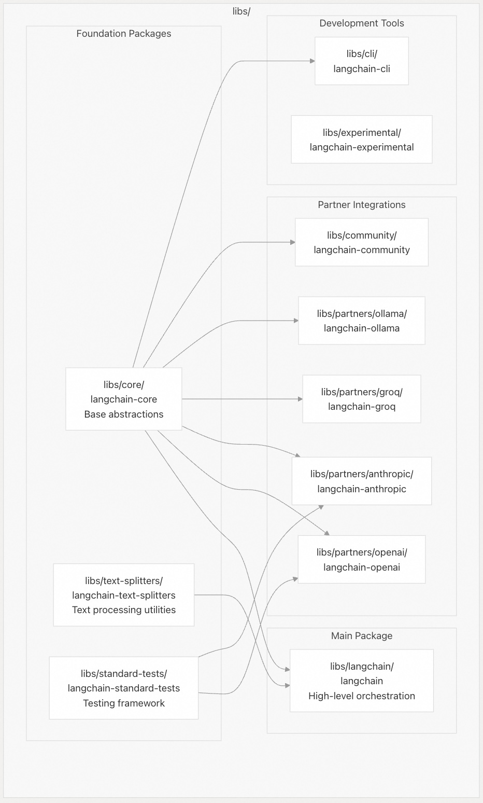
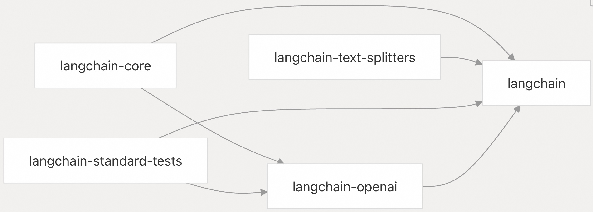
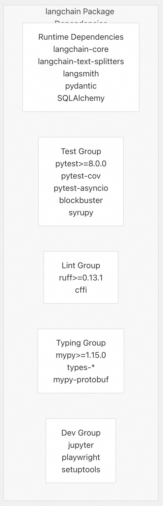
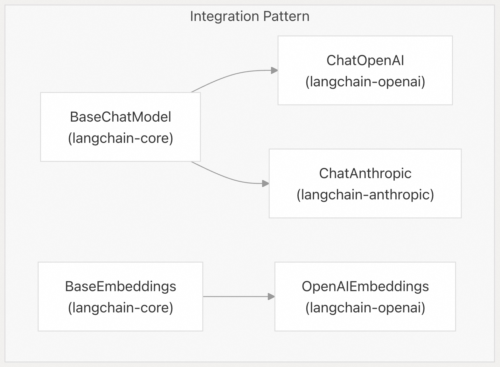

## LangChain 源码学习: 6.1 包结构与构建系统(Package Structure and Build System)  
    
### 作者    
digoal    
    
### 日期    
2025-10-21    
    
### 标签    
AI Agent , Powered by LLM , LangChain , 源码学习    
    
----    
    
## 背景    
本文介绍 LangChain 单体仓库（monorepo）的包结构、构建系统配置和依赖管理。重点说明了各包如何组织、构建和发布，并详细描述了使用 `uv` 和 `pdm-backend` 的技术实现方式。  
  
## 单体仓库包架构(Monorepo Package Architecture)  
LangChain 采用单体仓库结构，包含多个相互依赖的包，每个包在生态系统中承担特定角色。这些包统一组织在 `libs/` 目录下，并采用标准化的构建配置。  
  
### 核心包层级结构    
  
  
**来源：**   
- [`libs/langchain/pyproject.toml` 第115–119行](https://github.com/langchain-ai/langchain/blob/e3fc7d8a/libs/langchain/pyproject.toml#L115-L119)  
- [`libs/core/pyproject.toml` 第61–63行](https://github.com/langchain-ai/langchain/blob/e3fc7d8a/libs/core/pyproject.toml#L61-L63)  
  
### 包依赖关系图    
  
  
**来源：**   
- [`libs/langchain/pyproject.toml`](https://github.com/langchain-ai/langchain/blob/e3fc7d8a/libs/langchain/pyproject.toml#L9-L18)  
- [`libs/langchain/pyproject.toml`](https://github.com/langchain-ai/langchain/blob/e3fc7d8a/libs/langchain/pyproject.toml#L115-L119)  
  
## 构建系统配置  
  
### PDM 后端集成    
所有包均使用 `pdm-backend` 作为构建系统，并采用标准化的配置模式：  
```  
[build-system]  
requires = ["pdm-backend"]  
build-backend = "pdm.backend"  
```  
  
**来源：**   
- [`libs/langchain/pyproject.toml` 第1–3行](https://github.com/langchain-ai/langchain/blob/e3fc7d8a/libs/langchain/pyproject.toml#L1-L3)  
- [`libs/core/pyproject.toml` 第1–3行](https://github.com/langchain-ai/langchain/blob/e3fc7d8a/libs/core/pyproject.toml#L1-L3)  
  
### 包元数据结构    
每个包在 `pyproject.toml` 中遵循一致的元数据结构：  
  
| 字段 | 用途 | 示例 |  
|------|------|------|  
| `name` | 包标识符 | `"langchain-core"` |  
| `version` | 语义化版本号 | `"0.3.76"` |  
| `description` | 包的简要描述 | `"通过可组合性构建基于大语言模型（LLM）的应用程序"` |  
| `requires-python` | Python 版本约束 | `">=3.9.0,<4.0.0"` |  
| `dependencies` | 运行时依赖项 | 核心抽象与工具 |  
| `project.urls` | 仓库与文档链接 | GitHub 源码地址和发布说明 |  
  
**来源：**   
- [`libs/core/pyproject.toml` 第5–26行](https://github.com/langchain-ai/langchain/blob/e3fc7d8a/libs/core/pyproject.toml#L5-L26)  
- [`libs/langchain/pyproject.toml` 第5–46行](https://github.com/langchain-ai/langchain/blob/e3fc7d8a/libs/langchain/pyproject.toml#L5-L46)  
  
### 依赖分组配置    
包通过 `dependency-groups` 节将依赖项按功能分组：    
  
  
  
**来源：**   
- [`libs/langchain/pyproject.toml` 第48–112行](https://github.com/langchain-ai/langchain/blob/e3fc7d8a/libs/langchain/pyproject.toml#L48-L112)  
- [`libs/core/pyproject.toml` 第28–58行](https://github.com/langchain-ai/langchain/blob/e3fc7d8a/libs/core/pyproject.toml#L28-L58)  
  
## 基于 UV 的依赖管理(UV-Based Dependency Management)  
  
### 本地包解析    
构建系统使用 `uv` 进行依赖管理，并通过本地路径解析单体仓库内的包：    
```  
[tool.uv.sources]  
langchain-core = { path = "../core", editable = true }  
langchain-tests = { path = "../standard-tests", editable = true }  
langchain-text-splitters = { path = "../text-splitters", editable = true }  
langchain-openai = { path = "../partners/openai", editable = true }  
```  
  
**来源：**   
- [`libs/langchain/pyproject.toml` 第115–119行](https://github.com/langchain-ai/langchain/blob/e3fc7d8a/libs/langchain/pyproject.toml#L115-L119)  
- [`libs/core/pyproject.toml` 第61–63行](https://github.com/langchain-ai/langchain/blob/e3fc7d8a/libs/core/pyproject.toml#L61-L63)  
  
### 锁文件管理    
每个包维护自己的 `uv.lock` 文件，并包含针对不同 Python 版本和平台的解析标记（resolution markers）：  
  
```toml  
resolution-markers = [  
    "python_full_version >= '3.13' and platform_python_implementation == 'PyPy'",  
    "python_full_version >= '3.13' and platform_python_implementation != 'PyPy'",  
    "python_full_version >= '3.12.4' and python_full_version < '3.13'",  
    ...  
]  
```  
  
**来源：**   
- [`libs/core/uv.lock` 第3–13行](https://github.com/langchain-ai/langchain/blob/e3fc7d8a/libs/core/uv.lock#L3-L13)  
- [`libs/langchain/uv.lock` 第3–17行](https://github.com/langchain-ai/langchain/blob/e3fc7d8a/libs/langchain/uv.lock#L3-L17)  
  
### 版本锁定策略    
代码库采用混合的版本锁定策略：  
  
| 依赖类型 | 锁定策略 | 示例 |  
|----------|----------|------|  
| 核心依赖 | 使用带主版本上限的范围 | `"langchain-core>=0.3.72,<1.0.0"` |  
| 开发工具 | 指定次要版本范围 | `"pytest>=8.0.0,<9.0.0"` |  
| 类型存根（Type stubs） | 指定版本范围 | `"types-pyyaml>=6.0.12.2,<7.0.0.0"` |  
| 平台特定依赖 | 条件性依赖 | `"async-timeout>=4.0.0,<5.0.0; python_version < \"3.11\""` |  
  
**来源：**   
- [`libs/langchain/pyproject.toml` 第9–18行](https://github.com/langchain-ai/langchain/blob/e3fc7d8a/libs/langchain/pyproject.toml#L9-L18)  
- [`libs/langchain/pyproject.toml` 第49–76行](https://github.com/langchain-ai/langchain/blob/e3fc7d8a/libs/langchain/pyproject.toml#L49-L76)  
  
## 可选依赖与集成包  
  
### 合作伙伴集成管理    
主 `langchain` 包通过可选依赖提供对合作伙伴集成的支持：    
```  
[project.optional-dependencies]  
anthropic = ["langchain-anthropic"]  
openai = ["langchain-openai"]  
azure-ai = ["langchain-azure-ai"]  
cohere = ["langchain-cohere"]  
google-vertexai = ["langchain-google-vertexai"]  
ollama = ["langchain-ollama"]  
groq = ["langchain-groq"]  
```  
  
**来源：**   
- [`libs/langchain/pyproject.toml` 第24–41行](https://github.com/langchain-ai/langchain/blob/e3fc7d8a/libs/langchain/pyproject.toml#L24-L41)  
  
### 集成包架构    
  
  
**来源：**   
- [`libs/langchain/pyproject.toml` 第24–41行](https://github.com/langchain-ai/langchain/blob/e3fc7d8a/libs/langchain/pyproject.toml#L24-L41)  
  
## 工具配置与代码检查  
  
### Ruff 配置    
构建系统包含标准化的代码检查与格式化配置：    
```  
[tool.ruff]  
target-version = "py39"  
  
[tool.ruff.lint]  
select = [ "ALL",]  
ignore = [  
    "C90",     # McCabe complexity  
    "COM812",  # Messes with the formatter  
    "FIX002",  # Line contains TODO  
    "PLR09",   # Too many something  
]  
```  
  
**来源：**   
- [`libs/langchain/pyproject.toml` 第121–164行](https://github.com/langchain-ai/langchain/blob/e3fc7d8a/libs/langchain/pyproject.toml#L121-L164)  
- [`libs/core/pyproject.toml` 第76–104行](https://github.com/langchain-ai/langchain/blob/e3fc7d8a/libs/core/pyproject.toml#L76-L104)  
  
### MyPy 类型检查    
各包采用统一的类型检查配置：    
```  
[tool.mypy]  
plugins = ["pydantic.mypy"]  
strict = true  
enable_error_code = "deprecated"  
```  
  
**来源：**   
- [`libs/langchain/pyproject.toml` 第125–139行](https://github.com/langchain-ai/langchain/blob/e3fc7d8a/libs/langchain/pyproject.toml#L125-L139)  
- [`libs/core/pyproject.toml` 第66–73行](https://github.com/langchain-ai/langchain/blob/e3fc7d8a/libs/core/pyproject.toml#L66-L73)  
  
## 版本管理系统  
  
### 核心版本定义    
包的版本集中定义在版本文件中：    
```  
# libs/core/langchain_core/version.py  
VERSION = "0.3.76"  
```  
**来源：**   
- [`libs/core/langchain_core/version.py` 第3行](https://github.com/langchain-ai/langchain/blob/e3fc7d8a/libs/core/langchain_core/version.py#L3-L3)  
  
### 跨包版本约束    
内部包之间的依赖使用语义化版本范围，以确保兼容性：   
```  
dependencies = [  
    "langchain-core>=0.3.72,<1.0.0",  
    "langchain-text-splitters>=0.3.9,<1.0.0",  
]  
```  
  
**来源：**   
- [`libs/langchain/pyproject.toml` 第10–11行](https://github.com/langchain-ai/langchain/blob/e3fc7d8a/libs/langchain/pyproject.toml#L10-L11)  
  
## 开发工作流集成  
  
### 测试依赖验证    
构建系统包含对测试依赖的自动验证，以防止依赖膨胀：   
```  
def test_required_dependencies(uv_conf: Mapping[str, Any]) -> None:  
    dependencies = uv_conf["project"]["dependencies"]  
    required_dependencies = {Requirement(dep).name for dep in dependencies}  
      
    assert sorted(required_dependencies) == sorted([  
        "PyYAML", "SQLAlchemy", "async-timeout",  
        "langchain-core", "langchain-text-splitters",  
        "langsmith", "pydantic", "requests",  
    ])  
```  
  
**来源：**   
- [`libs/langchain/tests/unit_tests/test_dependencies.py` 第23–44行](https://github.com/langchain-ai/langchain/blob/e3fc7d8a/libs/langchain/tests/unit_tests/test_dependencies.py#L23-L44)  
  
### 可编辑安装支持    
所有内部包通过 `uv.sources` 配置支持可编辑安装（editable installation），从而在单体仓库中实现无缝开发：    
```  
langchain-core = { path = "../core", editable = true }  
```  
  
**来源：**   
- [`libs/langchain/pyproject.toml` 第116行](https://github.com/langchain-ai/langchain/blob/e3fc7d8a/libs/langchain/pyproject.toml#L116-L116)  
  
该架构在保持清晰的关注点分离和依赖边界的同时，支持 LangChain 生态系统的快速开发。  
    
#### [期望 PostgreSQL|开源PolarDB 增加什么功能?](https://github.com/digoal/blog/issues/76 "269ac3d1c492e938c0191101c7238216")
  
  
#### [PolarDB 开源数据库](https://openpolardb.com/home "57258f76c37864c6e6d23383d05714ea")
  
  
#### [PolarDB 学习图谱](https://www.aliyun.com/database/openpolardb/activity "8642f60e04ed0c814bf9cb9677976bd4")
  
  
#### [PostgreSQL 解决方案集合](../201706/20170601_02.md "40cff096e9ed7122c512b35d8561d9c8")
  
  
#### [德哥 / digoal's Github - 公益是一辈子的事.](https://github.com/digoal/blog/blob/master/README.md "22709685feb7cab07d30f30387f0a9ae")
  
  
#### [About 德哥](https://github.com/digoal/blog/blob/master/me/readme.md "a37735981e7704886ffd590565582dd0")
  
  

  
