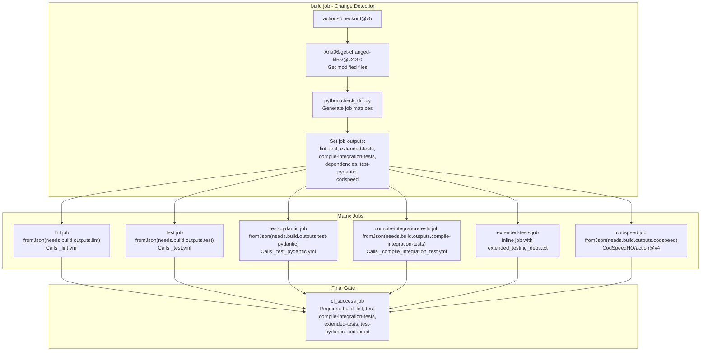
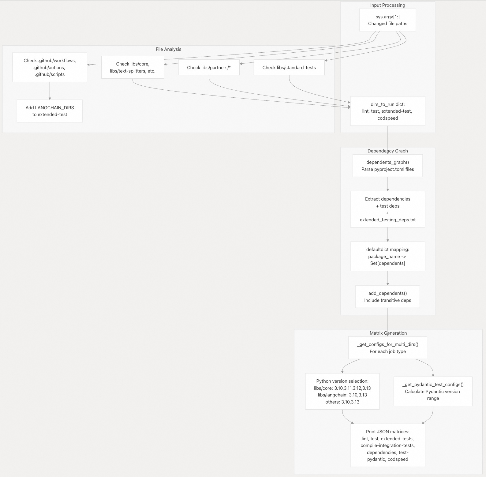
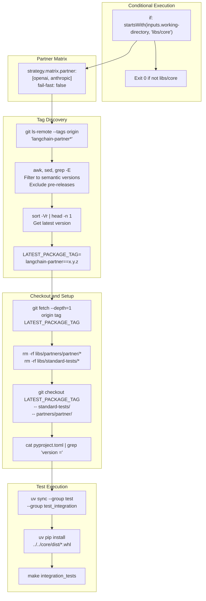
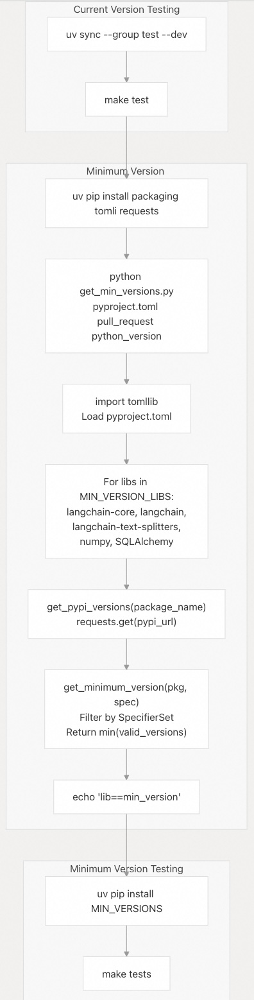
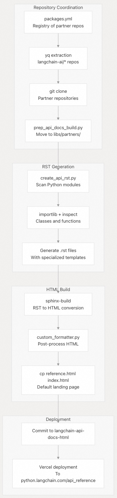
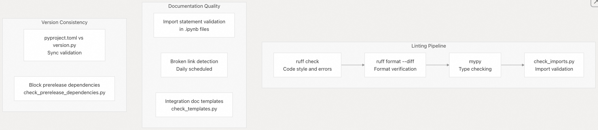

## LangChain 源码学习: 6.2 CI/CD 与发布流程  
      
### 作者      
digoal      
      
### 日期      
2025-10-21      
      
### 标签      
AI Agent , Powered by LLM , LangChain , 源码学习      
      
----      
      
## 背景      
CI 和 CD 的全称分别是：  
- **CI**：**Continuous Integration**（持续集成）    
- **CD**：**Continuous Delivery**（持续交付）或 **Continuous Deployment**（持续部署）  
  
具体含义如下：  
- **持续集成（CI）**：开发人员频繁地（通常每天多次）将代码变更合并到主干分支，每次提交都会自动触发构建和测试，以尽早发现集成错误。  
- **持续交付（Continuous Delivery）**：在持续集成的基础上，确保代码始终处于可发布状态，可以随时手动部署到生产环境。  
- **持续部署（Continuous Deployment）**：比持续交付更进一步，所有通过测试的变更会**自动部署到生产环境**，无需人工干预。  
  
在实际使用中，CD 可能指代其中任一概念，具体取决于团队的发布流程。  
  
本文介绍用于维护代码质量并将 LangChain 软件包发布到 PyPI 的自动化测试、构建和发布基础设施。CI/CD 系统管理一个包含 50 多个软件包的单体仓库（monorepo），支持动态测试矩阵，并采用多阶段发布流水线，包含向后兼容性验证。  
  
## CI 流水线架构  
  
LangChain 的 CI/CD 系统基于 GitHub Actions 构建，采用多工作流架构，并通过智能变更检测优化在大型单体仓库中的构建时间。  
  
### 主 CI 工作流  
  
主 CI 流水线由 `check_diffs.yml`（工作流名称：“CI”）编排，根据文件变更实现动态测试策略。该工作流采用多任务架构：`build` 任务分析变更，后续任务消费生成的测试矩阵。  
  
**工作流：** `check_diffs.yml`    
  

  
**源文件位置：**   
- [`.github/workflows/check_diffs.yml` 第 44-70 行](https://github.com/langchain-ai/langchain/blob/e3fc7d8a/.github/workflows/check_diffs.yml#L44-L70)  
- [`.github/workflows/check_diffs.yml` 第 72-262 行](https://github.com/langchain-ai/langchain/blob/e3fc7d8a/.github/workflows/check_diffs.yml#L72-L262)  
  
### 并发控制与优化  
  
CI 系统实现了多项优化，以高效管理资源使用：  
  
| 功能 | 实现方式 | 目的 |  
|------|----------|------|  
| 并发控制 | `cancel-in-progress: true` | 当向同一 PR 或分支推送新提交时，取消旧的工作流运行 |  
| 动态矩阵 | 文件变更分析 | 仅测试被修改文件所属的软件包 |  
| 依赖缓存 | 使用 `uv` 并设置缓存键 | 加速依赖安装 |  
| 并行执行 | `fail-fast: false` | 某个软件包测试失败时，继续测试其他软件包 |  
  
并发控制通过在新提交推送时取消先前的工作流运行，避免资源浪费。  
  
**源文件位置：**   
- [`.github/workflows/check_diffs.yml` 第 31-33 行](https://github.com/langchain-ai/langchain/blob/e3fc7d8a/.github/workflows/check_diffs.yml#L31-L33)  
  
### 使用依赖图生成测试矩阵  
  
`check_diff.py` 脚本分析变更的文件并生成动态测试矩阵。它通过解析所有 `pyproject.toml` 文件和 `extended_testing_deps.txt` 构建依赖图，确保当依赖项变更时，其依赖者也会被测试。  
  
**脚本：** `check_diff.py`    
  
  
  
**关键函数：**  
  
- `dependents_graph()`：通过解析所有 `pyproject.toml` 和 `extended_testing_deps.txt` 构建依赖映射    
- `add_dependents()`：当某个软件包被修改时，包含其传递依赖项    
- `_get_configs_for_multi_dirs()`：为每种任务类型生成测试矩阵配置    
- `_get_pydantic_test_configs()`：从 `uv.lock` 中提取 Pydantic 的最小/最大版本，计算版本范围    
  
**源文件位置：**   
- [`.github/scripts/check_diff.py` 第 62-112 行](https://github.com/langchain-ai/langchain/blob/e3fc7d8a/.github/scripts/check_diff.py#L62-L112)  
- [`.github/scripts/check_diff.py` 115-126 行](https://github.com/langchain-ai/langchain/blob/e3fc7d8a/.github/scripts/check_diff.py#L115-L126)  
- [`.github/scripts/check_diff.py` 128-230 行](https://github.com/langchain-ai/langchain/blob/e3fc7d8a/.github/scripts/check_diff.py#L128-L230)  
- [`.github/scripts/check_diff.py` 233-346 行](https://github.com/langchain-ai/langchain/blob/e3fc7d8a/.github/scripts/check_diff.py#L233-L346)  
  
## 发布流程  
  
发布流水线采用多阶段流程，在将软件包发布到 PyPI 前进行全面验证。  
  
### 发布工作流阶段  
  
`_release.yml` 工作流（名称：“Package Release”）编排一个多阶段发布流程，并在构建阶段与发布阶段之间实施严格的权限隔离。  
  
**工作流：** `_release.yml`    

```mermaid  
graph TB  
    subgraph "Stage 1: Build (permissions: contents: read)"  
        Build["build job<br/>Environment: 'Scheduled testing'"]  
        RunBuild["uv build in working-directory"]  
        CheckVersion["Check version step<br/>import tomllib<br/>Read pyproject.toml<br/>Extract pkg-name, version"]  
        UploadDist["actions/upload-artifact@v4<br/>name: dist<br/>path: working-directory/dist/"]  
    end  
      
    subgraph "Stage 2: Release Notes (permissions: contents: read)"  
        CloneRepo["actions/checkout@v5<br/>sparse-checkout: working-directory<br/>fetch-depth: 0"]  
        CheckTags["Check tags step<br/>Find PREV_TAG via git tag<br/>--sort=-creatordate"]  
        GenNotes["git log --format='%s'<br/>PREV_TAG..HEAD<br/>Generate release body"]  
    end  
      
    subgraph "Stage 3: Test PyPI (permissions: id-token: write)"  
        DownloadDist1["actions/download-artifact@v5<br/>name: dist"]  
        PublishTest["pypa/gh-action-pypi-publish@release/v1<br/>repository-url: test.pypi.org<br/>skip-existing: true"]  
    end  
      
    subgraph "Stage 4: Pre-Release Checks (permissions: contents: read)"  
        DownloadDist2["Download dist artifact"]  
        ImportTest["uv venv<br/>uv pip install dist/*.whl<br/>python -c 'import IMPORT_NAME'"]  
        CheckPrerelease["check_prerelease_dependencies.py<br/>Block prerelease deps"]  
        UnitTests["make tests"]  
        MinVersions["get_min_versions.py<br/>Find minimum published versions"]  
        TestMinVersions["uv pip install MIN_VERSIONS<br/>make tests"]  
        IntegrationTests["make integration_tests<br/>(if libs/partners/)"]  
    end  
      
    subgraph "Stage 5: Backwards Compat (permissions: contents: read)"  
        CheckCore["if startsWith('libs/core')"]  
        MatrixPartners["matrix: [openai, anthropic]"]  
        FetchTag["git ls-remote --tags<br/>Find latest partner tag"]  
        CheckoutPartner["git checkout LATEST_PACKAGE_TAG<br/>-- partners/partner/<br/>-- standard-tests/"]  
        InstallNewCore["uv pip install ../../core/dist/*.whl"]  
        TestCompat["make integration_tests"]  
    end  
      
    subgraph "Stage 6: Publish (permissions: id-token: write)"  
        DownloadDist3["Download dist artifact"]  
        TrustedPublish["pypa/gh-action-pypi-publish@release/v1<br/>OIDC trusted publishing"]  
    end  
      
    subgraph "Stage 7: Mark Release (permissions: contents: write)"  
        DownloadDist4["Download dist artifact"]  
        CreateTag["ncipollo/release-action@v1<br/>tag: pkg-name==version<br/>artifacts: dist/*<br/>body: release-body"]  
    end  
      
    Build --> RunBuild  
    RunBuild --> CheckVersion  
    CheckVersion --> UploadDist  
      
    UploadDist --> CloneRepo  
    CloneRepo --> CheckTags  
    CheckTags --> GenNotes  
      
    UploadDist --> DownloadDist1  
    GenNotes --> DownloadDist1  
    DownloadDist1 --> PublishTest  
      
    PublishTest --> DownloadDist2  
    DownloadDist2 --> ImportTest  
    ImportTest --> CheckPrerelease  
    CheckPrerelease --> UnitTests  
    UnitTests --> MinVersions  
    MinVersions --> TestMinVersions  
    TestMinVersions --> IntegrationTests  
      
    IntegrationTests --> CheckCore  
    CheckCore --> MatrixPartners  
    MatrixPartners --> FetchTag  
    FetchTag --> CheckoutPartner  
    CheckoutPartner --> InstallNewCore  
    InstallNewCore --> TestCompat  
      
    TestCompat --> DownloadDist3  
    DownloadDist3 --> TrustedPublish  
      
    TrustedPublish --> DownloadDist4  
    DownloadDist4 --> CreateTag  
```  
  

  
**源文件位置：**   
- [`.github/workflows/_release.yml` 第 43-98 行](https://github.com/langchain-ai/langchain/blob/e3fc7d8a/.github/workflows/_release.yml#L43-L98)  
- [`.github/workflows/_release.yml` 第 99-193 行](https://github.com/langchain-ai/langchain/blob/e3fc7d8a/.github/workflows/_release.yml#L99-L193)  
- [`.github/workflows/_release.yml` 第 195-228 行](https://github.com/langchain-ai/langchain/blob/e3fc7d8a/.github/workflows/_release.yml#L195-L228)  
- [`.github/workflows/_release.yml` 第 230-381 行](https://github.com/langchain-ai/langchain/blob/e3fc7d8a/.github/workflows/_release.yml#L230-L381)  
- [`.github/workflows/_release.yml` 第 383-470 行](https://github.com/langchain-ai/langchain/blob/e3fc7d8a/.github/workflows/_release.yml#L383-L470)  
- [`.github/workflows/_release.yml` 第 471-512 行](https://github.com/langchain-ai/langchain/blob/e3fc7d8a/.github/workflows/_release.yml#L471-L512)  
- [`.github/workflows/_release.yml` 第 514-554 行](https://github.com/langchain-ai/langchain/blob/e3fc7d8a/.github/workflows/_release.yml#L514-L554)  
  
### 安全与信任模型  
  
发布流程采用纵深防御（defense-in-depth）安全策略，在各阶段之间实施严格的权限隔离，防止被攻陷的依赖项访问凭证。  
  
**安全架构**  
  
| 安全层级 | 实现方式 | 代码引用 |  
|----------|----------|----------|  
| 权限隔离 | 构建任务：仅 `contents: read` 发布任务：`id-token: write` 标记发布任务：`contents: write` | [`.github/workflows/_release.yml`](https://github.com/langchain-ai/langchain/blob/e3fc7d8a/.github/workflows/_release.yml#L49-L50) 第 49-50、206、486、526 行 |  
| 可信发布 | 基于 OIDC 的 PyPI 身份验证，不使用长期有效的 API 令牌 | 第 201-205、480-485 行 |  
| 构件隔离 | 构建产物单独上传，由发布任务下载 | 第 79-83、211-214 行 |  
| 测试部署 | 使用 `repository-url: https://test.pypi.org/legacy/` 启用 `skip-existing: true` | 第 222-226 行 |  
| 导入验证 | 安装并导入构建出的 wheel 包，确保发布前无导入错误 | 第 266-290 行 |  
| 分支保护 | 仅允许 `master` 分支发布（或通过 `dangerous-nonmaster-release` 输入强制） | 第 46 行 |  
| 依赖验证 | 运行 `check_prerelease_dependencies.py`，禁止在正式发布中使用预发布依赖 | 第 306-311 行 |  
  
**分离理由（来自工作流注释）：**    
> “我们希望将构建阶段与发布阶段分开，以避免权限共享。否则，恶意的 `build` 步骤（例如通过被攻陷的依赖项）可能会获取我们的 GitHub 或 PyPI 凭据。”  
  
该做法遵循 PyPI 的可信发布最佳实践：“强烈建议将构建任务与发布任务分离。”  
  
**源文件位置：**   
- [`.github/workflows/_release.yml` 第 64-74、201-205 行](https://github.com/langchain-ai/langchain/blob/e3fc7d8a/.github/workflows/_release.yml#L64-L74)  
  
### 向后兼容性测试  
  
对于 `langchain-core` 的发布，`test-prior-published-packages-against-new-core` 任务会使用最新发布的合作方软件包测试新版本的 core，以确保没有破坏性变更。  
  
**任务：** `test-prior-published-packages-against-new-core`    
  

  
**实现细节：**  
- 跳过条件：如果不发布 `libs/core` 则提前退出   
- 使用正则表达式发现标签(Tag discovery regex)：使用 `grep -E '[0-9]+\.[0-9]+\.[0-9]+([a-zA-Z]+[0-9]+)?$'` - 匹配语义化版本（含预发布后缀）    
- Sparse checkout：从对应标签检出 `standard-tests/` 和 `partners/{partner}/` 目录  
- 核心替换：使用 `dist/` 构件进行测试  
- API 凭证：使用各种提供商的 30 多个密钥（`ANTHROPIC_API_KEY`、`OPENAI_API_KEY` 等）  
  
**源文件位置：**   
- [`.github/workflows/_release.yml` 第 383-470、418-424、437-469 行](https://github.com/langchain-ai/langchain/blob/e3fc7d8a/.github/workflows/_release.yml#L383-L470)  
  
## 测试策略  
  
CI 系统在多个维度上实施全面的测试策略：  
  
### 测试类型与范围  
  
| 测试类型 | 触发条件 | 覆盖范围 | 实现方式 |  
|----------|----------|----------|----------|  
| 单元测试 | 每次 PR/推送 | 所有变更涉及的软件包 | `_test.yml` 中调用 `make test` |  
| 集成测试 | 每日定时 | 主要合作方软件包 | `scheduled_test.yml`，使用真实 API |  
| 编译测试 | 每次 PR/推送 | 集成测试语法检查 | `_compile_integration_test.yml` |  
| 文档测试 | 每次 PR/推送 | 导入验证 | `_test_doc_imports.yml` |  
| 兼容性测试 | 每次 PR/推送 | Pydantic v1/v2 | `_test_pydantic.yml` |  
| 扩展测试 | 每次 PR/推送 | 额外依赖项 | 内联于 `check_diffs.yml` |  
| 基准测试 | 每次 PR/推送 | 性能回归检测 | 集成 CodSpeed |  
  
### 依赖版本测试  
  
测试系统验证软件包在当前版本和最低支持版本的依赖下均能正常工作，确保在整个版本范围内兼容。  
  
**最低版本测试流程**  
  
  
  
**关键实现细节：**  
  
- MIN_VERSION_LIBS 关键包列表：`["langchain-core", "langchain", "langchain-text-splitters", "numpy", "SQLAlchemy"]`    
- SKIP_IF_PULL_REQUEST 某些包（如 `langchain-core`）仅在发布时检查最低版本，因为它们常同步变更    
- Version resolution 通过 `https://pypi.org/pypi/{package_name}/json` 查询满足约束的最低已发布版本    
- Caret syntax handling 版本范围转换规则：`^0.y.z` → `>=0.y.z,<0.y+1`；`^x.y.z` → `>=x.y.z,<x+1`    
  
**源文件位置：**   
- [`.github/workflows/_test.yml` 第 46-73 行](https://github.com/langchain-ai/langchain/blob/e3fc7d8a/.github/workflows/_test.yml#L46-L73)  
- [`.github/scripts/get_min_versions.py` 第 20-34、37-92、111-152 行](https://github.com/langchain-ai/langchain/blob/e3fc7d8a/.github/scripts/get_min_versions.py#L20-L34)  
  
### 定时集成测试  
  
每日运行针对真实 API 的集成测试，以捕获外部服务的破坏性变更：  
  
| 测试配置 | 详情 |  
|----------|------|  
| 调度时间 | 每日 13:00 UTC（美国东部时间上午 9 点 / 太平洋时间上午 6 点） |  
| 默认测试库 | `["libs/partners/openai", "libs/partners/anthropic", "libs/partners/fireworks", "libs/partners/groq", "libs/partners/mistralai", "libs/partners/xai"]` |  
| Python 版本 | 3.9、3.11 |  
| API 凭据 | 30+ 个不同提供商的密钥 |  
| 外部仓库 | 包含 `langchain-google` 和 `langchain-aws` |  
  
**源文件位置：**   
- [`.github/workflows/scheduled_test.yml` 第 26-29、140-167 行](https://github.com/langchain-ai/langchain/blob/e3fc7d8a/.github/workflows/scheduled_test.yml#L26-L29)  
  
## 文档流水线  
  
文档系统包含用户文档和 API 参考文档的自动生成与部署。  
  
### API 文档构建流程  
  
  
  
**源文件位置：**   
- [`.github/workflows/api_doc_build.yml` 第 37-143 行](https://github.com/langchain-ai/langchain/blob/e3fc7d8a/.github/workflows/api_doc_build.yml#L37-L143)  
- [`docs/api_reference/create_api_rst.py` 第 1-761 行](https://github.com/langchain-ai/langchain/blob/e3fc7d8a/docs/api_reference/create_api_rst.py#L1-L761)  
- [`.github/scripts/prep_api_docs_build.py` 第 1-121 行](https://github.com/langchain-ai/langchain/blob/e3fc7d8a/.github/scripts/prep_api_docs_build.py#L1-L121)  
  
### 本地开发支持  
  
仓库提供了 Makefile 目标，用于本地 API 文档开发：  
  
| Make 目标 | 用途 | 实现方式 |  
|-----------|------|----------|  
| `api_docs_build` | 完整文档构建 | 安装 CLI、生成 RST、构建 HTML、打开浏览器 |  
| `api_docs_quick_preview` | 单个软件包预览 | 例如：`API_PKG=openai make api_docs_quick_preview` |  
| `api_docs_clean` | 清理构建产物 | 删除生成的文件和缓存 |  
  
**源文件位置：  
- [** `Makefile` 第 41-79 行](https://github.com/langchain-ai/langchain/blob/e3fc7d8a/Makefile#L41-L79)  
  
## 质量门禁与自动化  
  
### 代码质量强制执行  
  
CI 系统通过多项自动化检查强制执行代码质量：  
  
  
  
**源文件位置：**   
- [`.github/workflows/_lint.yml` 第 50-75 行](https://github.com/langchain-ai/langchain/blob/e3fc7d8a/.github/workflows/_lint.yml#L50-L75)  
- [`.github/workflows/check_core_versions.yml` 第 24-51 行](https://github.com/langchain-ai/langchain/blob/e3fc7d8a/.github/workflows/check_core_versions.yml#L24-L51)  
- [`.github/scripts/check_prerelease_dependencies.py`](https://github.com/langchain-ai/langchain/blob/e3fc7d8a/.github/scripts/check_prerelease_dependencies.py)  
  
### 软件包管理与依赖  
  
系统使用 `uv` 实现快速、可复现的依赖管理，并使用冻结的 lockfile：  
  
| 配置 | 用途 |  
|------|------|  
| `UV_FROZEN=true` | 确保使用锁定版本进行可复现构建 |  
| `UV_NO_SYNC=true` | 在测试中跳过不必要的依赖解析 |  
| 缓存键 | 包含工作目录和 Python 版本以实现隔离 |  
| 依赖分组 | 分离测试、lint、类型检查和集成测试依赖 |  
  
**源文件位置：**   
- [`pyproject.toml` 第 14-54 行](https://github.com/langchain-ai/langchain/blob/e3fc7d8a/pyproject.toml#L14-L54)  
- [`.github/workflows/check_diffs.yml` 第 38-40 行](https://github.com/langchain-ai/langchain/blob/e3fc7d8a/.github/workflows/check_diffs.yml#L38-L40)  
  
### 自动化维护  
  
多个工作流处理日常维护任务：  
  
| 工作流 | 调度时间 | 用途 |  
|--------|----------|------|  
| `api_doc_build.yml` | 每日 13:00 UTC | 更新 API 参考文档 |  
| `scheduled_test.yml` | 每日 13:00 UTC | 验证与真实 API 的集成 |  
| `check-broken-links.yml` | 每日 13:00 UTC | 检测文档中的失效链接 |  
| `run_notebooks.yml` | 每日 13:00 UTC | 验证文档中的 Notebook |  
  
**源文件位置：**   
- [`.github/workflows/api_doc_build.yml` 第 16 行](https://github.com/langchain-ai/langchain/blob/e3fc7d8a/.github/workflows/api_doc_build.yml#L16-L16)  
- [`scheduled_test.yml` 第 20 行](https://github.com/langchain-ai/langchain/blob/e3fc7d8a/.github/workflows/scheduled_test.yml#L20-L20)  
- [`check-broken-links.yml` 第 8 行](https://github.com/langchain-ai/langchain/blob/e3fc7d8a/.github/workflows/check-broken-links.yml#L8-L8)  
- [`run_notebooks.yml` 第 17 行](https://github.com/langchain-ai/langchain/blob/e3fc7d8a/.github/workflows/run_notebooks.yml#L17-L17)  
  
            
#### [期望 PostgreSQL|开源PolarDB 增加什么功能?](https://github.com/digoal/blog/issues/76 "269ac3d1c492e938c0191101c7238216")
  
  
#### [PolarDB 开源数据库](https://openpolardb.com/home "57258f76c37864c6e6d23383d05714ea")
  
  
#### [PolarDB 学习图谱](https://www.aliyun.com/database/openpolardb/activity "8642f60e04ed0c814bf9cb9677976bd4")
  
  
#### [PostgreSQL 解决方案集合](../201706/20170601_02.md "40cff096e9ed7122c512b35d8561d9c8")
  
  
#### [德哥 / digoal's Github - 公益是一辈子的事.](https://github.com/digoal/blog/blob/master/README.md "22709685feb7cab07d30f30387f0a9ae")
  
  
#### [About 德哥](https://github.com/digoal/blog/blob/master/me/readme.md "a37735981e7704886ffd590565582dd0")
  
  

  
