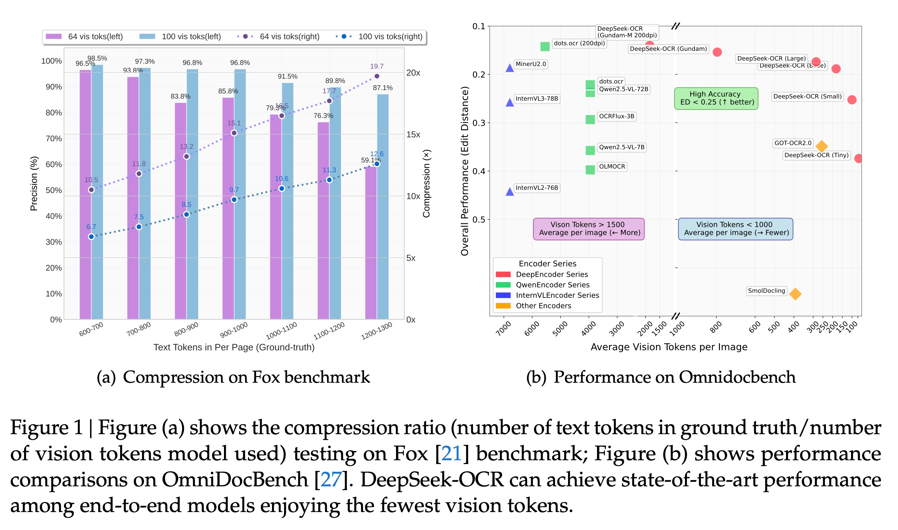
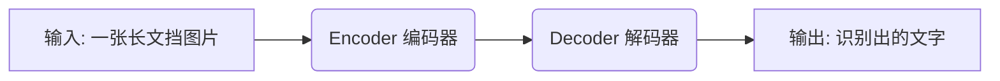
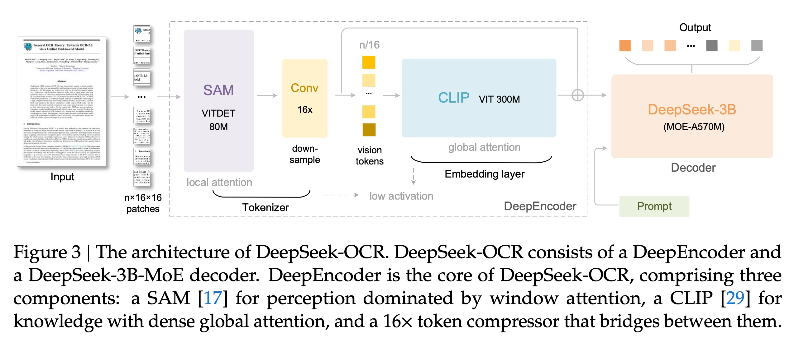
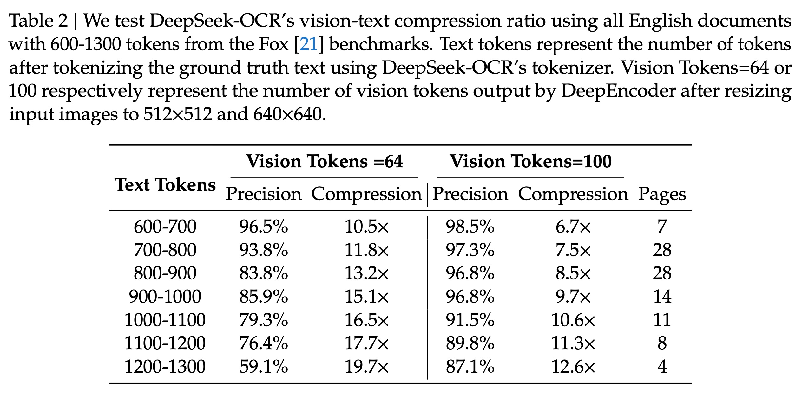
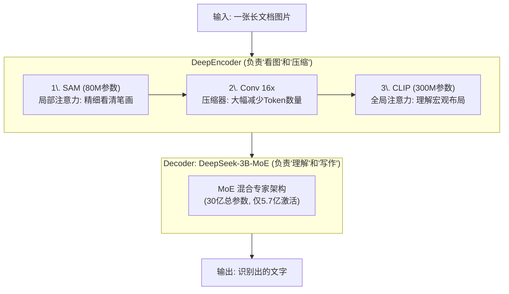
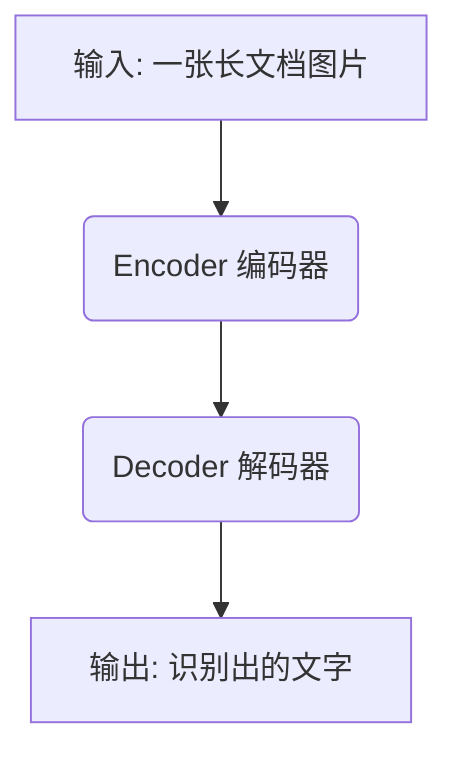
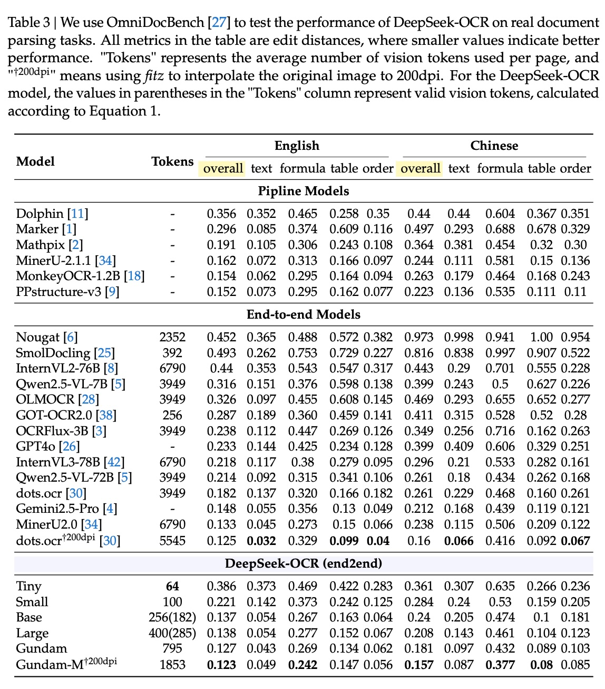
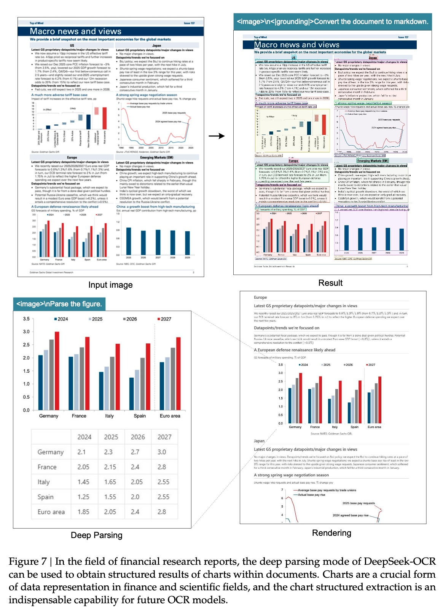
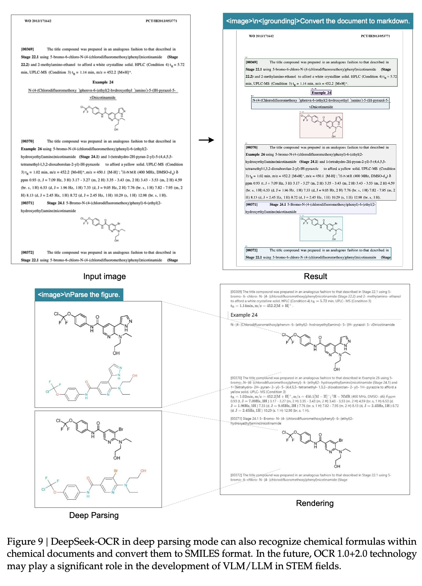
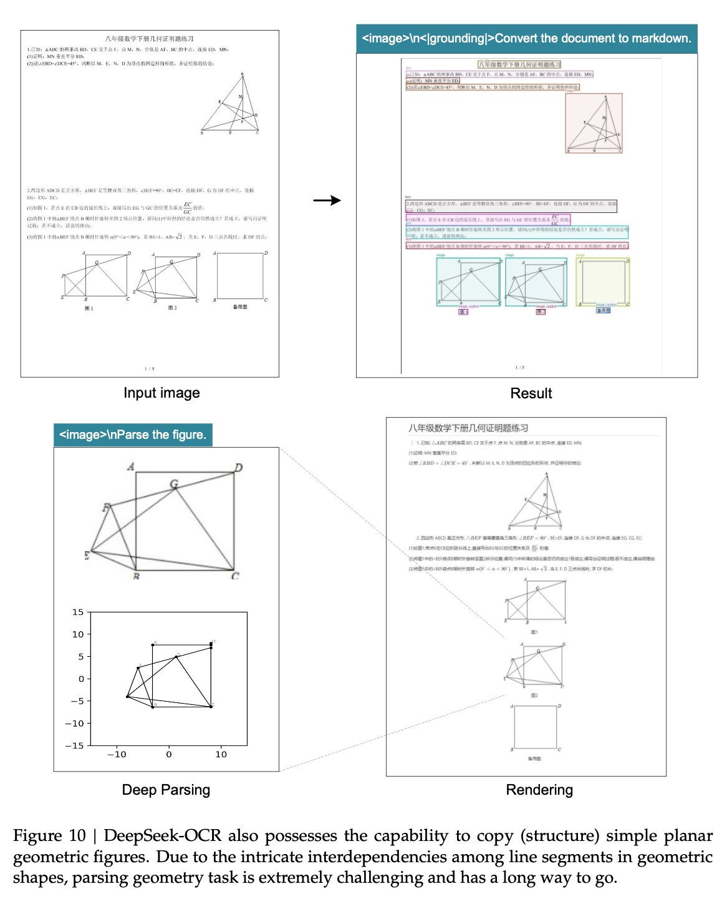

## AI论文解读 | DeepSeek-OCR: Contexts Optical Compression
        
### 作者        
digoal        
        
### 日期        
2025-10-22        
        
### 标签        
PostgreSQL , PolarDB , DuckDB , AI , 论文解读        
        
----        
        
## 背景  
      
https://github.com/deepseek-ai/DeepSeek-OCR/blob/main/DeepSeek_OCR_paper.pdf        
  
提示:          
```          
读懂《DeepSeek-OCR: Contexts Optical Compression》这篇论文需要提前掌握哪些基础知识, 请使用中文通熟易懂的讲解这些基础知识, 可以引用论文中的图、表或使用Markdown支持的图形(text,mermaid等)增加解释性. 
  
使用中文通熟易懂的解读《DeepSeek-OCR: Contexts Optical Compression》这篇论文, 其中的关键内容请着重讲解, 可以引用论文中的图、表或使用Markdown支持的图形(text,mermaid等)增加解释性. 
  
提取《DeepSeek-OCR: Contexts Optical Compression》这篇论文中的重要术语, 使用中文对这些术语进行通熟易懂的讲解, 可以引用论文中的图、表或使用Markdown支持的图形(text,mermaid等)增加解释性. 
```     
  
## 1 前置知识 
  
好的，这是一篇非常有意思的论文，它探讨了一个很新颖的想法：**能不能把长篇的文字内容“拍成照片”（转换成视觉信息），以此来“压缩”它，从而让AI大模型（LLM）更高效地处理？** 

要读懂这篇论文，你需要了解以下几个核心的基础知识。我会用最通俗的语言为你讲解：

### 1\. 基础概念：AI大模型 (LLM) 与“上下文”

  * **LLM (Large Language Model)：** 这就是我们常说的“大模型”，比如ChatGPT或DeepSeek模型本身。你可以把它想象成一个超级聪明、阅读量极大的“大脑”。
  * **上下文 (Context)：** 你喂给这个“大脑”的文字信息。比如你问一个问题，或者让它总结一篇文章，你输入的这些文字就是“上下文”。
  * **核心痛点：** 现在的LLM有一个大问题，它一次能“记住”的上下文长度是有限的。更重要的是，上下文越长，它的计算量（和耗时）会呈“平方级”增长 。
      * *通俗比喻：* 假设处理100个字要1秒；处理200个字可能就要4秒；处理300个字就要9秒... ... 当你给它一篇几万字的超长文档时，它就会变得非常慢，甚至“爆内存”。

这篇论文的出发点，就是为了解决这个“长上下文”的效率问题 。

### 2\. 核心思路：“光学压缩” (Optical Compression)

这就是论文的“神来之笔” 。

  * **传统方式：** 1000个汉字，就是1000多个“文本Token”（后面会讲Token）。
  * **论文新思路：** 如果我把这1000个汉字印在一张纸上，然后“拍张照”，这张照片在AI眼里可能只需要100个“视觉Token”就能表示 。
  * **“光学压缩”：** 这就实现了一个“压缩”。AI不需要逐字阅读1000个文本单位，只需要“看”100个图像单位就行了。这个过程，论文称之为“上下文的光学压缩” (Contexts Optical Compression) 。
  * **测试场：** 用什么任务来测试这个想法呢？**OCR (Optical Character Recognition)**，也就是“光学字符识别” 。AI看了这张“照片”（压缩后的视觉信息），能不能再完美地把1000个字给“解压”（识别）出来？如果能，就证明这个压缩是可行的。

### 3\. 关键单位：“Token” (文本 vs 视觉)

这是理解论文数据（如图1）的钥匙。    

  * **Token (令牌)：** 是AI处理信息的基本单位。
  * **文本Token (Text Tokens)：**
      * 对于英文，"DeepSeek" 可能会被拆成 "Deep" 和 "Seek" 两个Token。
      * 对于中文，"深度探索" 可能会被拆成 "深度" 和 "探索" 两个Token。
      * 论文中图1(a)的横轴“Text Tokens in Per Page”，指的就是一页纸上*真正*有多少个文本Token 。
  * **视觉Token (Vision Tokens)：**
      * AI“看”图片不是像素点，而是先把图片切成一块块的“马赛克”（patches）。
      * **每一块“马赛克”就是一个视觉Token**。
      * 图片切得越碎（分辨率越高），视觉Token就越多，AI看得越仔细，但计算量也越大。切得越粗（分辨率越低），视觉Token就越少，计算量小，但可能看不清。
      * 论文中图1(a)的柱子（64 vis toks / 100 vis toks），指的就是模型只用64个或100个视觉Token来“看”这张图 。

**理解图1(a) ：** 这张图展示了“压缩率”和“精度”的权衡。

  * **看最右边的柱子 (1200-1300 Text Tokens)：**
      * **紫色柱 (64 vision tokens):** 精度掉到了约59.1% 。
      * **蓝色柱 (100 vision tokens):** 精度保持在约87.1% 。
      * **虚线 (Compression):** 此时的“压缩率”高达12x到20x 。
  * **结论：** 当压缩率太高（比如用64个Token去看1300个字），AI就“看不清”了，精度下降。但即使在10倍压缩率下，模型依然能达到97%的精度 。

### 4\. 核心技术：VLM 架构 (Encoder-Decoder)

要实现“看图说话”（看图识别文字），模型需要一个特定的架构，即**VLM (Vision-Language Model, 视觉语言模型)** 。它主要分两部分：



#### A. 编码器 (Encoder)：DeepEncoder 

  * **作用：** 负责“看图”，把图片转换成AI能理解的“视觉Token” 。

  * **论文的创新 (DeepEncoder)：** 作者设计了一个特别的编码器 ，它非常高效。你可以从论文的**图3**  中看到它的结构：    

    1.  **SAM (局部注意力) ：** 先用一个叫SAM的模型，它擅长“精细地看”图像的局部细节（比如每个字长啥样），这部分用的是“窗口注意力”(Window Attention) 。
    2.  **Conv 16x (压缩器) ：** 然后，通过一个16倍的卷积层，把前面“精看”得到的大量Token*压缩*一下，Token数量变少 。
    3.  **CLIP (全局注意力) ：** 最后，把压缩后的少量Token喂给CLIP模型，它擅长“宏观地理解”整张图的排版和“知识”（比如这段话是标题），这部分用的是“全局注意力”(Global Attention) 。

  * **好处：** 这种“先精看再压缩，最后宏观理解”的流程，使得DeepEncoder既能处理高分辨率的清晰大图，又不会消耗太多内存和算力，产出的“视觉Token”数量很少 。

#### B. 解码器 (Decoder)：DeepSeek-3B-MoE 

  * **作用：** 负责“写作”，把编码器传来的“视觉Token”翻译（解压）成最终的文字 。
  * **论文的选择 (MoE)：** 作者用了 **MoE (Mixture of Experts, 混合专家模型)** 架构 。
      * *通俗比喻：* 传统模型是“一个全能博士”在干所有活。MoE是“一个管理团队”，手下有64个不同领域的“专家”（比如专家A擅长认公式，专家B擅长认表格，专家C擅长认法语...）。
      * 当任务来了（比如识别一篇化学论文），模型会*只激活*最相关的几个专家（比如激活6个）来干活 。
      * **好处：** 整个模型参数量很大（3B，即30亿），知识渊博；但实际干活时只激活一小部分（570M，即5.7亿）。这使得它既强大又高效（省钱省算力）。

### 5\. 如何衡量表现 (看懂图1b)

论文的**图1(b)**  展示了DeepSeek-OCR在“军备竞赛”中的位置。    

  * **横轴 (Average Vision Tokens per Image)：** 识别一张图，模型需要用多少“视觉Token”。**越往左越好**（越高效）。
  * **纵轴 (Overall Performance, Edit Distance)：** 识别的错误率（编辑距离）。**越往上越好**（错误越少）。

**看图：**

1.  你会发现很多其他模型（比如MinerU2.0, InternVL）都挤在右边，它们需要几千个视觉Token（6000+）才能工作 。
2.  而DeepSeek-OCR系列（红色和绿色的点）都在**左上角** 。
3.  **结论：** DeepSeek-OCR用*极少*的视觉Token（比如不到800个），就达到了*业界顶尖*（SOTA）的低错误率 。

### 总结

要读懂这篇论文，你需要带上这几个“知识滤镜”：

1.  **痛点：** LLM处理长文本很慢 。
2.  **脑洞：** 把文字“拍成照片”喂给AI（光学压缩）。
3.  **货币：** 衡量效率的单位是“Token”，目标是用最少的“视觉Token”还原最多的“文本Token” 。
4.  **架构：** 使用了高效的“VLM”架构：
      * **Encoder (DeepEncoder)：** 混合使用“局部精看”和“全局理解”，输出的Token少而精 。
      * **Decoder (MoE)：** “专家团队”模式，在保持强大的同时实现高效解码 。
5.  **成果：** 论文证明了这个方法可行，在10倍压缩率下仍有高精度 ，并且在公开基准上实现了“算力最低、效果最好”的表现 。
  
## 2 解读论文 
  
这篇论文《DeepSeek-OCR: Contexts Optical Compression》提出一个非常新颖且重要的观点：**我们可以把长篇的文字内容“拍成照片”（即光学2D映射），以此作为一种高效的“压缩”手段，来解决大语言模型（LLM）处理长文本时的效率难题** 。

通俗来说，现在的大模型（如LLM）在阅读长篇大论时会非常“累”（计算量呈平方级增长）。这篇论文的作者们脑洞大开：一篇1000个字的文章，如果用文字Token（AI理解文字的单位）来读，可能需要1000多个Token；但如果把这篇文章截图，AI用“看图”的方式来读，可能只需要100个“视觉Token”就够了 。

这篇论文就是为了验证这个“光学压缩”的想法是否可行，而 **OCR（光学字符识别，即从图片中认字）**  **就是实现这个想法的最佳“试验场”** 。

以下是这篇论文的几个关键内容解读：

### 关键内容一：“光学压缩”真的可行吗？压缩率和精度如何？

这是论文要回答的第一个核心问题。答案是：**非常可行**。

论文使用了一个名为Fox的基准测试集 ，结果展示在**图1(a)** 和 **表2** 中。    

**图1(a) 解读：**     

  * **横轴 (Text Tokens per Page):** 代表一页纸上“真正”有多少文本内容（文本Token数量） 。
  * **柱状图 (Precision, %):** 代表OCR识别的准确率，越高越好 。
  * **折线图 (Compression, x):** 代表“压缩倍数”，即 `文本Token数 / 视觉Token数`，越高代表压缩越狠 。

**核心发现：**

1.  **10倍压缩，近乎无损：** 当使用100个视觉Token（蓝色柱）时，即使原文长达1000个文本Token（此时压缩率接近10倍），模型依然能达到 **97%** 的识别准确率 。这证明了在10倍压缩率下，信息几乎可以“无损”地被还原。
2.  **20倍压缩，仍有价值：** 当我们把压缩推到极限，比如用64个视觉Token（紫色柱）去读1200-1300个文本Token时，压缩率达到了 **近20倍**，此时精度会下降，但依然能保持在 **60%** 左右 。

这个结果非常惊人，它证明了“光学压缩”是完全可行的，可以用极少的视觉Token来承载远超其数量的文本信息。

### 关键内容二：DeepSeek-OCR的“独门秘籍”：高效的架构设计 (图3)

为了实现这种“低Token、高精度”的壮举，研究者设计了名为**DeepSeek-OCR**的模型，它由两部分构成：一个创新的编码器（DeepEncoder）和一个高效的解码器（DeepSeek3B-MoE） 。

其工作流程可以用下图（论文图3的简化版）来表示：    



#### 1\. 核心创新：DeepEncoder (编码器)

当前主流的视觉编码器要么无法处理高分辨率大图，要么处理时会产生海量的视觉Token，导致“显存爆炸” 。

DeepEncoder的设计非常巧妙 ，它像一个 **“先精读、再总结、后理解”** 的专家：

  * **第一步 (SAM)：** 先用一个轻量级的SAM模型 ，它使用“窗口注意力”（局部注意力）来“精读”高分辨率图片，看清每一个文字的笔画细节。这部分激活低，很高效 。
  * **第二步 (Conv 16x)：** 在进入最昂贵的全局注意力前，用一个16倍的卷积压缩器  做“总结”。比如，把上一步得到的4096个Token压缩成256个 。
  * **第三步 (CLIP)：** 最后，把这压缩后的**少量** (256个) Token喂给强大的CLIP模型 ，用“全局注意力”来“理解”整张图的排版和宏观信息 。

这个设计确保了模型既能处理高分辨率输入（看得清），又能保持极低的计算激活和极少的视觉Token（算得快）。

#### 2\. 高效解码：DeepSeek-3B-MoE (解码器)

解码器（负责把视觉Token翻译回文字）使用的是 **MoE（混合专家模型）** 架构 。

  * 你可以把它想象成一个拥有64个不同专科医生的“专家团队” 。
  * 当一个任务（比如识别一篇化学论文）来了，模型只会激活（call）最相关的几个专家（比如6个）来工作 。
  * 这使得模型虽然总参数量高达30亿（知识渊博），但实际推理时只激活了5.7亿的参数（效率极高） 。

### 关键内容三：实战表现：用最少的Token，打出最好的效果 (图1b)

这个模型不仅在理论上可行，在实际的OCR“跑分”中也表现优异。**图1(b)** 就是它在OmniDocBench基准上的“战绩图”。    

**图1(b) 解读：**

  * **横轴 (Average Vision Tokens):** 消耗的视觉Token，**越左越好**（代表越高效、越省资源） 。
  * **纵轴 (Overall Performance):** 错误率（编辑距离），**越上越好**（代表错误越少、精度越高） 。

**核心发现（看左上角 ）：**

  * DeepSeek-OCR系列（红色和绿色的点） **牢牢占据了“左上角”的王者位置** 。
  * **对比1 (超越GOT-OCR)：** DeepSeek-OCR (Small) **仅用100个Token**，就超越了使用256个Token的GOT-OCR2.0 。
  * **对比2 (超越MinerU)：** DeepSeek-OCR (Gundam) **使用不到800个Token**，性能优于需要近7000个Token的MinerU2.0 。

这有力地证明了DeepSeek-OCR是“端到端模型中，使用最少视觉Token达到SOTA（顶尖）性能的模型” 。

### 总结：这篇论文的重大意义

这篇论文的意义远不止是做了一个更强的OCR模型。OCR只是一个“引子” ，它真正打开了一扇新的大门：

**为LLM的“无限长上下文”提供了新思路。**

想象一下未来的AI助手：

1.  你和它当前的对话，用高精度的“文本Token”处理。
2.  10分钟前的对话，可以被“拍成照片”，压缩成10倍小的“视觉Token”存起来 。
3.  1小时前的对话，可以被“拍成照片”后再缩小，压缩成20倍小的“模糊视觉Token”存起来 。

这就像人类的记忆机制：近期的记忆清晰，久远的记忆模糊 。通过这种“光学压缩”和“渐进遗忘” ，AI或许能用极低的成本，实现“理论上无限长”的上下文记忆。
  
## 3 术语 
  
好的，这篇论文《DeepSeek-OCR: Contexts Optical Compression》提出了一个非常前沿的概念，要理解它的精髓，你需要掌握以下几个关键术语。

我会用最通俗的语言，结合论文中的图表来为你讲解：

### 1\. Contexts Optical Compression (上下文光学压缩)

这是整篇论文的**核心思想** 。

  * **通俗讲解：**
    现在的大语言模型（LLM）处理长篇文字（即“上下文”）时，计算量非常大且慢 。作者提出了一个“降维打击”的思路：**与其让AI一个字一个字地“读”万字长文，不如把这万字长文“拍成一张照片”，然后让AI去“看”这张图** 。
  * **为什么叫“光学压缩”？**
    因为一张图片（视觉信息）能以非常高的密度承载信息 。比如，一篇1000个单词的文章（约1000+个文本Token），在截图中可能只需要100个“视觉Token”就能表示清楚。这个从“文本”到“图像”的转换过程，就是一种高效的“压缩” 。
  * **OCR的作用：**
    OCR（文字识别）是验证这个想法的完美“试验场”。AI“看图”（压缩后的信息）后，能不能完美地把文字再“解压”（识别）出来？。

### 2\. Vision Tokens (视觉Token) vs. Text Tokens (文本Token)

理解这个概念是看懂论文中所有图表（尤其是图1a）的钥匙。    

  * **Token (令牌/标记)：** 是AI处理信息的基本单位。
  * **Text Tokens (文本Token)：**
    AI处理“文字”的单位 。比如“深度探索”可能会被拆分为“深度”和“探索”2个Text Token。
  * **Vision Tokens (视觉Token)：**
    AI处理“图像”的单位 。AI看图不是看像素点，而是先把图片切成一块块的“马赛克”（Patches），**每一块“马赛克”就是一个Vision Token**。

**论文的核心目标：** 用**最少**的Vision Tokens，去还原**最多**的Text Tokens 。

-----

### 3\. Compression Ratio (压缩率)

这个指标直接衡量了“光学压缩”的效率有多高 。

  * **通俗讲解：** 压缩率就是“被压缩的文本量”除以“压缩后的视觉量”。
  * **计算公式：** `压缩率 = (原始文本Token数量) / (模型使用的Vision Token数量)` 。
  * **论文中的数据 (图1a 和 表2)：**        
      * **10倍压缩 (10x)：** 当压缩率在10倍以内时（比如用100个视觉Token去看1000个文本Token），模型的OCR精度能高达 **97%** 。这说明10倍压缩几乎是“无损”的。
      * **20倍压缩 (20x)：** 即使在近20倍的极限压缩下（比如用64个视觉Token去看1300个文本Token），模型仍能保持 **60%** 左右的精度 。

### 4\. Encoder-Decoder (编码器-解码器) 架构

这是DeepSeek-OCR模型的主体结构 ，它分为“看图”和“写字”两部分。



  * **Encoder (编码器)：** 负责“看图” 。它的任务是把输入的图片“压缩”成AI能理解的、少量的“视觉Token”。在本文中，它特指作者设计的 **DeepEncoder** 。
  * **Decoder (解码器)：** 负责“写字” 。它接收编码器传来的“视觉Token”，然后把这些视觉信息“解压”并“翻译”成最终的文本 。在本文中，它使用的是 **DeepSeek3B-MoE** 。

-----

### 5\. DeepEncoder (深度编码器)

这是论文的**核心技术创新**，一个专门为“光学压缩”设计的、极其高效的编码器 。

  * **设计目标：** 它必须能处理高分辨率的大图（看得清），同时保持低激活（省显存），并输出极少的Vision Tokens（压缩狠） 。
  * **关键结构 (见论文图3)：** DeepEncoder像一个三级火箭，串联了三个部件 ：    
    1.  **SAM (局部注意力)：** 先用一个轻量级的SAM模型 ，它使用“窗口注意力”（Window Attention）来**精细地看**图像的局部细节（比如文字笔画） 。
    2.  **Conv 16x (压缩器)：** 然后，通过一个16倍的卷积层 ，把上一步产生的大量Token**瞬间压缩**16倍 ，Token数量大大减少。
    3.  **CLIP (全局注意力)：** 最后，把这些“压缩”后的少量Token喂给一个CLIP模型 ，它使用“全局注意力”（Global Attention）来**宏观地理解**整张图的排版和上下文 。

这种“先精看、再压缩、后理解”的流程 ，完美平衡了精度和效率。

### 6\. Window Attention (窗口注意力) vs. Global Attention (全局注意力)

这是DeepEncoder中使用的两种不同“看”图的方式 。

  * **Window Attention (窗口注意力)：** 像人戴着“眼罩”看东西，一次只看一个很小的“窗口”区域 。
      * **优点：** 计算量小，非常省显存，适合处理高分辨率大图的底层细节 。
      * **缺点：** 缺乏全局视野，不知道“窗口”外发生了什么。
      * **用途：** 用在DeepEncoder的第一阶段（SAM部分） 。
  * **Global Attention (全局注意力)：** 像人站在高处“俯瞰”全景，一次性看全图所有的Token 。
      * **优点：** 理解能力强，能掌握全局排版和上下文 。
      * **缺点：** 计算量极大（论文称为 "dense" ），Token一多显存就爆炸。
  * **DeepEncoder的妙招：** 先用“窗口注意力”处理海量Token，然后用压缩器把Token数量压到很低（比如4096个压到256个 ），*最后*才用“全局注意力”去处理这少量的Token 。

-----

### 7\. MoE (Mixture of Experts, 混合专家模型)

这是解码器（Decoder）所采用的架构 。

  * **通俗讲解：**
    传统的AI模型是“一个全能博士”干所有活。
    MoE模型则是“一个管理团队”带着一大群（比如64个）“专科医生”（即Experts） 。
  * **工作原理：**
    当一个任务来了（比如识别一篇化学论文），模型会“按需激活”一小部分最相关的专家（比如激活6个）来协同工作 。
  * **好处：**
    模型的总参数量可以非常大（比如30亿参数），代表它“知识渊博”；但实际干活时激活的参数量很小（比如5.7亿参数） 。这使得模型在推理时 **“既强大又高效”** 。

-----

### 8\. Edit Distance (编辑距离)

这是衡量OCR模型性能的**核心指标**，在**图1(b)和表3**中被广泛使用 。        

  * **通俗讲解：** 指的是模型输出的“错别字”有多少。
  * **定义：** 模型输出的A句，需要经过多少次“增、删、改”操作，才能变成标准答案B句。
  * **关键：** 这个**数值越低（越小），代表错误越少，模型性能越好** 。
  * **看懂图1(b)：** 在图1(b)中，所有模型都希望往**左上角**移动，即：
      * **往左 (X轴)：** 消耗的Vision Tokens更少（更高效） 。
      * **往上 (Y轴)：** 编辑距离更低（更准确） 。

### 9\. OCR 1.0 vs. OCR 2.0 (数据类型)

这是论文中对训练数据的一种分类，代表了OCR任务的不同难度。

  * **OCR 1.0:** 指的是“传统的OCR”任务 。
      * **举例：** 识别文档（PDF）里的段落文字 、识别街景照片里的招牌文字（场景文字） 。
  * **OCR 2.0:** 指的是“更复杂的解析”任务 。
      * **举例：** 识别并解析图表（Charts） 、化学分子式（Chemical formulas） 、平面几何图形（Plane geometry） 。

-----

### 10\. Deep Parsing (深度解析)

这是DeepSeek-OCR展示的一项高级能力 。

  * **通俗讲解：** 模型不仅能识别文档中的大段文字（OCR 1.0），还能“深入”到文档内部，去识别和解析那些“插图”（OCR 2.0的内容） 。
  * **举例 (见论文图7-10)：**
      * 在**图7**中，模型能识别金融报告里的“柱状图”，并把图表内容提取为HTML表格 。    
      * 在**图9**中，模型能识别化学文档里的“分子结构图”，并转译为SMILES（化学式字符串） 。   
      * 在**图10**中，模型能解析“几何图形”的结构 。   
  
## 参考        
         
https://github.com/deepseek-ai/DeepSeek-OCR/blob/main/DeepSeek_OCR_paper.pdf    
        
<b> 以上内容基于DeepSeek、Qwen、Gemini及诸多AI生成, 轻微人工调整, 感谢杭州深度求索人工智能、阿里云、Google等公司. </b>        
        
<b> AI 生成的内容请自行辨别正确性, 当然也多了些许踩坑的乐趣, 毕竟冒险是每个男人的天性.  </b>        
  
    
#### [期望 PostgreSQL|开源PolarDB 增加什么功能?](https://github.com/digoal/blog/issues/76 "269ac3d1c492e938c0191101c7238216")
  
  
#### [PolarDB 开源数据库](https://openpolardb.com/home "57258f76c37864c6e6d23383d05714ea")
  
  
#### [PolarDB 学习图谱](https://www.aliyun.com/database/openpolardb/activity "8642f60e04ed0c814bf9cb9677976bd4")
  
  
#### [PostgreSQL 解决方案集合](../201706/20170601_02.md "40cff096e9ed7122c512b35d8561d9c8")
  
  
#### [德哥 / digoal's Github - 公益是一辈子的事.](https://github.com/digoal/blog/blob/master/README.md "22709685feb7cab07d30f30387f0a9ae")
  
  
#### [About 德哥](https://github.com/digoal/blog/blob/master/me/readme.md "a37735981e7704886ffd590565582dd0")
  
  

  
