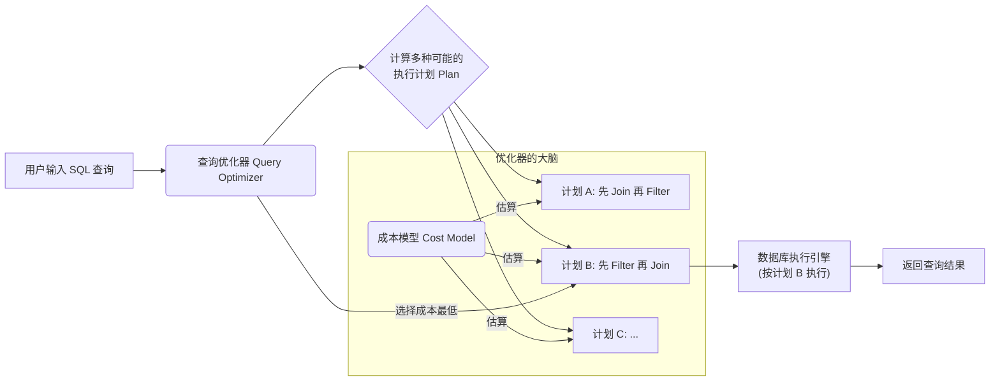
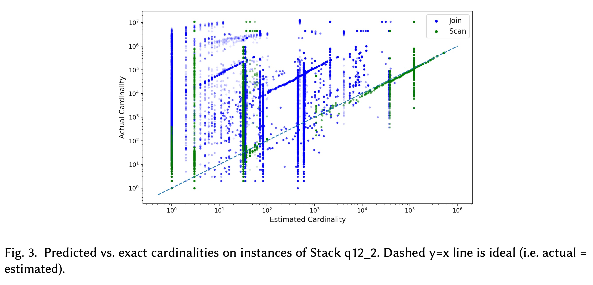
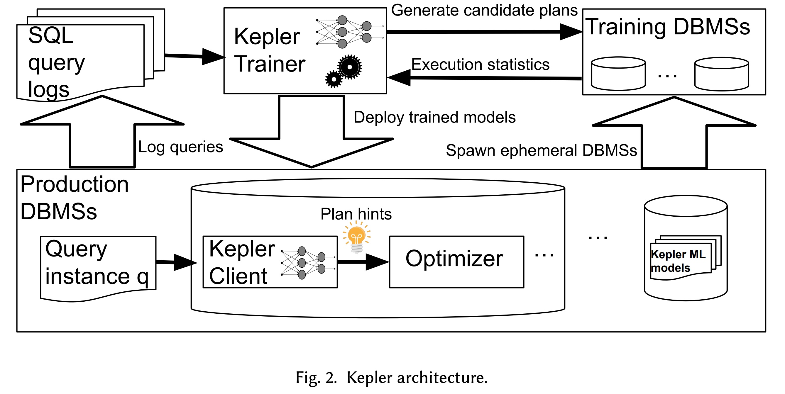
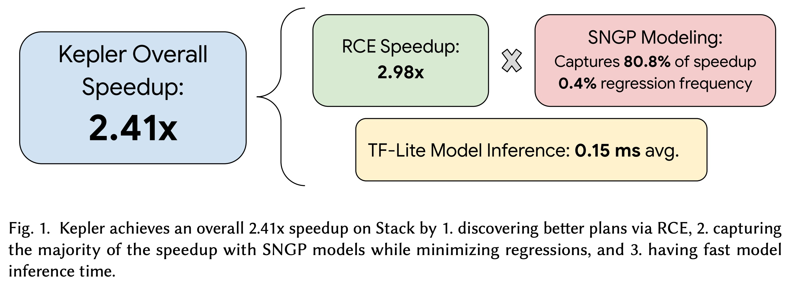
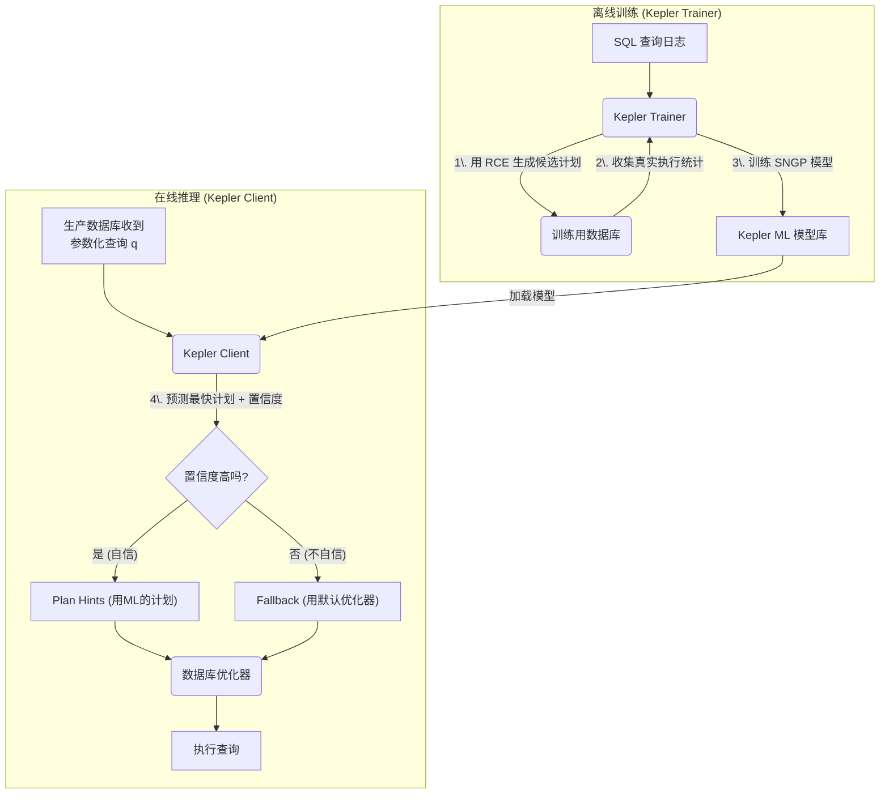
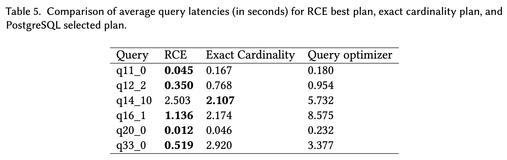
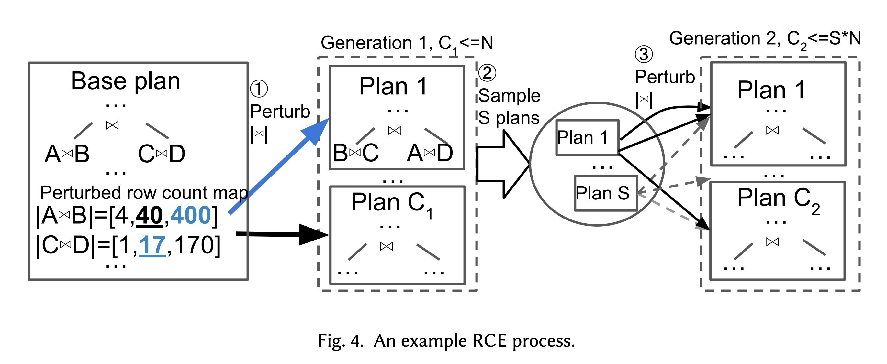
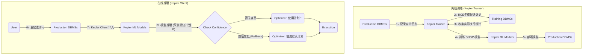

## AI论文解读 | Kepler: Robust Learning for Faster Parametric Query Optimization
        
### 作者        
digoal        
        
### 日期        
2025-10-22        
        
### 标签        
PostgreSQL , PolarDB , DuckDB , AI , 论文解读        
        
----        
        
## 背景  
      
https://arxiv.org/pdf/2306.06798        
  
提示:          
```          
读懂《Kepler: Robust Learning for Faster Parametric Query Optimization》这篇论文需要提前掌握哪些基础知识, 请使用中文通熟易懂的讲解这些基础知识, 可以引用论文中的图、表或使用Markdown支持的图形(text,mermaid等)增加解释性. 
  
使用中文通熟易懂的解读《Kepler: Robust Learning for Faster Parametric Query Optimization》这篇论文, 其中的关键内容请着重讲解, 可以引用论文中的图、表或使用Markdown支持的图形(text,mermaid等)增加解释性. 
  
提取《Kepler: Robust Learning for Faster Parametric Query Optimization》这篇论文中的重要术语, 使用中文对这些术语进行通熟易懂的讲解, 可以引用论文中的图、表或使用Markdown支持的图形(text,mermaid等)增加解释性. 
```     
  
## 1 前置知识 
  
要读懂《Kepler: Robust Learning for Faster Parametric Query Optimization》这篇论文，你需要对数据库系统和机器学习有一些基本了解。这篇论文的核心思想是： **利用机器学习（ML）来“教”数据库更聪明地执行一种特定类型的查询（参数化查询），让查询跑得更快，同时保证“不翻车”（即鲁棒性）** 。

下面我将用通俗易懂的语言，为你讲解需要提前掌握的基础知识点，并结合论文中的图表来帮助你理解。

-----

### 基础知识一：数据库的“查询优化” (Query Optimization)

想象一下，你用导航软件（比如谷歌地图）从A点到B点。你输入了起点和终点，导航软件会计算出几条路线（比如走高速、走国道、绕小路），然后根据它对路况的“估算”（比如哪里堵车、哪里红绿灯多），为你推荐一条“最快”的路线。

在数据库中，这个过程非常相似：

1.  **SQL 查询 (SQL Query)**：这就是你输入的“起点和终点”，比如 `SELECT * FROM Orders JOIN Customers ON Orders.cid = Customers.id WHERE Orders.date > '2023-01-01'`。
2.  **查询优化器 (Query Optimizer)**：这就是“导航软件”。它的大脑 。
3.  **执行计划 (Execution Plan)**：这就是导航软件计算出的“具体路线”。比如，是先从 `Orders` 表里筛选日期，再去找 `Customers`（这是一种计划）；还是先把两张表整个连起来，最后再筛选日期（这是另一种计划）。不同的执行计划，执行效率可能相差成百上千倍。
4.  **目标**：优化器的目标就是从成千上万种可能的执行计划中，选出一个它认为 **成本最低（预期执行时间最短）** 的方案 。

你可以用下面这个流程图来理解：



-----

### 基础知识二：为什么优化器会“翻车”？—— 核心问题：基数估算 (Cardinality Estimation)

为什么导航会“翻车”？因为它对路况的“估算”错了（比如它以为某条路不堵，结果堵死了）。

数据库优化器“翻车”的原理一样。它的“导航地图”（即**成本模型, Cost Model** ）依赖一个非常关键的数据，叫做 **基数（Cardinality）** 。

  * **什么是基数？**

      * 简单说，就是**一个操作会返回多少行数据**。
      * 比如，`SELECT * FROM Orders WHERE date > '2023-01-01'` 会返回多少行？100行？还是1000万行？
      * 这个数字会*极大*影响优化器的决策。如果只有100行，怎么操作都快；如果是1000万行，优化器就必须选择一条非常谨慎的“路线”（执行计划）。

  * **为什么估算会错？**

      * 优化器通常依赖统计数据（比如柱状图）来“猜”基数，而且它常常假设不同条件之间是“相互独立”的 。
      * 比如估算 `WHERE city = '北京' AND job = '工程师'` 的人数，它会假设“在北京”和“是工程师”是两个独立事件，然后把各自的概率乘起来。但现实中，这两个条件可能高度相关，导致估算严重失准。

  * **论文中的证据：图 3 (Figure 3)**

      * 这篇论文的 **Figure 3**  非常直观地展示了这个问题。      
      * 这张图的 **X轴是“估算的基数”** （优化器猜的）， **Y轴是“实际的基数”** （真实跑出来的）。
      * 如果优化器猜得准，所有的点都应该落在 **虚线（y=x）** 上 。
      * 但你所看到的：这些点“天马行空”，偏离虚线非常远。特别是很多点挤在X轴的 `10^0` (即 1) 或 `10^1` (即 10) 附近，但Y轴（实际值）却非常高 。
      * **结论**：传统优化器的基数估算“非常不靠谱” ，这就是Kepler要解决的根本问题。

-----

### 基础知识三：什么是“参数化查询” (Parametric Query)？

这是本篇论文聚焦的特定场景。

  * **定义**：指SQL结构完全相同，只是查询条件的值（参数）在变化的查询 。
  * **举例**：
      * `SELECT * FROM users WHERE id = ?;`
      * `SELECT * FROM products WHERE category = ? AND price < ?;`

这种查询在实际应用中非常普遍（比如你每次打开APP，系统都会执行 `SELECT * FROM messages WHERE user_id = 你的ID`）。

  * **挑战**：
      * 当参数变化时，“最佳”执行计划可能也会跟着变。
      * 例如，`WHERE id = 1` (只返回1行) 和 `WHERE id > 1000` (可能返回100万行)，这两个查询的最佳“路线”（执行计划）很可能完全不同。
      * 传统优化器要么每次都重新计算（耗时），要么“偷懒”用同一个计划（可能在某些参数下很慢）。
      * **PQO (Parametric Query Optimization)** 的目标就是为这类查询找到在不同参数下的最佳计划 。

-----

### 基础知识四：机器学习基础 (Machine Learning Basics)

Kepler的核心是用ML来解决PQO问题 。你需要了解以下几个ML概念：

1.  **监督学习 (Supervised Learning) 与 分类问题 (Classification)**

      * Kepler把问题转化成了一个分类问题 。
      * **输入 (Features)**：查询的参数值（比如 `category = '电子产品'`，`price < 100`）。
      * **输出 (Label)**：哪个执行计划最快（比如 “计划A”, “计划B”, “计划C”...）。
      * **训练**：Kepler会先运行*大量*不同参数的查询，并用*真实执行*的数据来收集“答案” 。

2.  **鲁棒性 (Robustness) 与 回归 (Regression)**

      * 这是论文标题的关键词。在数据库领域，“回归”是一个贬义词，意思是 **“比原来更慢”** 。
      * 如果ML模型选了一个比优化器默认计划*还差*的计划，就是一次“回归”。在生产环境中，这是不可接受的 。
      * **鲁棒性**：指ML模型能*避免*产生“回归” 。

3.  **模型不确定性 (Model Uncertainty) 与 SNGP**

      * Kepler如何保证鲁棒性？它靠的是“不确定性”评估 。
      * ML模型在做预测时，除了给出一个答案（比如“计划B最快”），Kepler还要求它给出一个 **“自信程度”** 。
      * **Kepler的策略**：如果模型“非常自信”（比如 95% 的把握），就用模型选的计划；如果模型“不自信”（比如只有 40% 的把握），它就会 **“回退” (Fallback)** ，去使用数据库优化器原来的默认计划 。这样就大大避免了“回归”风险。
      * **SNGP (Spectral-normalized Neural Gaussian Processes)**：你不需要懂它的数学原理，只需要知道它是一种特殊的神经网络模型，它在做预测时能*顺便*高效地估算出自己的“自信程度”（即不确定性）。

-----

### 基础知识五：论文的核心创新：RCE 算法

你可能会问：如果最好的执行计划连优化器自己都“想不到”，ML模型又怎么去学习呢？

Kepler的第一个核心步骤，**RCE (Row Count Evolution)**，就是用来解决这个问题的：**它负责“创造性地”生成一系列高质量的候选执行计划，供ML模型去学习和挑选** 。

  * **RCE (行计数演化)**：
      * RCE的出发点是：优化器之所以蠢，是因为它的“基数估算”错了（见基础知识二）。
      * **RCE的“神操作”** ：它不相信优化器的估算。它采用一种“演化算法” ，对优化器的基数估算值进行 **“随机扰动” (perturbing)** 。
      * **通俗比喻**：RCE对优化器说：“你不是估算这条路有100行数据吗？ 我偏不信。我**骗**你这条路有 1,000,000 行，你再帮我导航一次（生成计划）。” 
      * “我再骗你这条路只有 1 行，你再导航一次。”
      * 通过这种方式（论文中称为“在子计划基数空间中扰动” ），RCE能“诱骗”优化器生成很多它在正常情况下*永远不会考虑*的、但可能（在某些参数下）非常快的“新路线”（新计划）。

### 总结：读懂 Kepler 需要的知识地图

为了帮你串联起来，Kepler的完整故事线是这样的（对应 **Figure 2**  的架构）：    

1.  **离线训练 (Kepler Trainer)** 

      * **第1步：生成候选计划** 。
          * *需要懂的知识*：**RCE 算法** 。
          * *Kepler的做法*：对一个查询，通过“扰动”基数 ，“骗”优化器生成一大堆（比如几百个）不同的候选执行计划 。
      * **第2步：收集训练数据** 。
          * *需要懂的知识*：**基数估算问题 (Figure 3)** 。    
          * *Kepler的做法*：Kepler不相信“估算”，它把这几百个计划，在*真实数据库*上挨个跑一遍，测量*实际*执行时间 。
      * **第3步：训练模型**。
          * *需要懂的知识*：**ML分类问题**  和 **SNGP（不确定性）** 。
          * *Kepler的做法*：训练一个SNGP模型，输入是查询参数 ，输出是“哪个计划最快”以及“我对此有多自信” 。

2.  **在线预测 (Kepler Client)** 

      * *需要懂的知识*：**参数化查询 (PQO)**  和 **鲁棒性（回退）** 。
      * *Kepler的做法*：当一个新查询来了 ，Kepler Client用训练好的SNGP模型快速预测 。
      * 如果模型很自信 ，就告诉优化器：“别算了，用我这个计划（Plan Hints）” 。
      * 如果模型不自信 ，就“回退”，让优化器自己决定 。

掌握了以上这些背景知识，你就能很好地理解Kepler为什么这么设计，以及它是如何实现“更快”和“更鲁棒”的查询优化的。
  
## 2 解读论文 
  
这是一篇关于数据库查询优化的重要论文，它提出了一个名为 **Kepler** 的系统 。

用一句话总结 Kepler：**Kepler 是一个基于机器学习的“外挂”系统，它能“教”数据库（如 PostgreSQL）如何更聪明地执行“参数化查询”，实现比数据库自带优化器快2-3倍的查询速度，同时还能保证极高的稳定性，几乎不会让查询变得更慢 。**

下面我们来通俗地拆解这篇论文的关键内容。

-----

### 1\. 核心问题：为什么数据库查询会“翻车”？

在解读 Kepler 之前，我们必须先了解它要解决的问题。

  * **查询优化器 (Query Optimizer)**：你可以把它想象成数据库的“导航系统”。当你输入一条 SQL 查询（比如“从北京开车到上海”），优化器会计算出N条可能的“执行计划”（比如“路线A：走京沪高速”、“路线B：先走国道再上高速”...）。
  * **成本模型 (Cost Model)**：优化器依赖“成本模型”来估算每条路线的“耗时” 。
  * **“翻车”的原因**：这个“导航系统”的地图（成本模型）常常是错的，尤其是在 **“基数估算”** （Cardinality Estimation）上错得离谱 。

**什么是“基数估算”？**
就是“猜”一个操作会返回多少行数据。比如，优化器在估算 `WHERE city = '北京' AND job = '工程师'` 时，可能会严重低估（比如猜100人，实际有100万人）。

**论文中的证据 (Figure 3):**    
这张图一针见血地指出了问题 。

  * **X轴 (横轴)**: 优化器“估算”的基数 (行数) 。
  * **Y轴 (纵轴)**: “实际”的基数 (行数) 。
  * **理想情况**: 所有点都应该在 $y=x$ 的虚线上。
  * **实际情况**: 数据点“天马行空”。尤其是左侧，大量点被估算为1或10，但实际行数高达10万甚至1亿。

**结论**：依赖这种“瞎猜”的导航系统，选出的“最佳路线”（执行计划）自然也经常是“最差路线”，导致查询性能低下 。

-----

### 2\. Kepler 的核心思想：两步走

Kepler 的目标是彻底绕开这个不靠谱的“导航系统” 。它把问题拆成了两步：

1.  **“创造”计划**：我们不信任优化器给的几条烂路线。我们得有办法“创造”出一些它自己都想不到的“神仙路线”。
2.  **“挑选”计划**：有了足够多的好路线后，我们用机器学习 (ML) 训练一个模型，让它根据查询的“参数” ，*智能*地挑出最快的那条。

-----

### 3\. 关键内容一：RCE 算法 (如何“创造”好计划？)

这是 Kepler 的第一个核心创新：**行计数演化 (Row Count Evolution, RCE)** 。

RCE 的想法非常““"反直觉”"”：**我们利用优化器的““"弱点”"”（即它对基数估算很敏感）来““"欺骗”"”它。**

  * **RCE 的操作**：RCE 会“随机扰动” (perturbing) 优化器内部的基数估算值 。
  * **通俗比喻**：
      * 优化器说：“我估算 `A join B` 会返回 **40** 行。” 
      * RCE 说：“不，你错了。我**骗**你，它会返回 **400** 行，你按这个前提重新给我规划一条路线 (Plan 1)。” 
      * RCE 又说：“我再**骗**你一次，它会返回 **4** 行，你再规划一条 (Plan 2)。”
  * **“演化” (Evolution)**：RCE 会像生物进化一样，把新生成的计划作为“父代”，再次进行扰动，产生“子代” 。

通过这种““"连蒙带骗”"”的方式，RCE 能““"诱使”"”优化器生成大量它在正常情况下*永远不会考虑*的、但实际上可能快得多的新计划 。

**效果**：在 Figure 1 中，RCE 发现的这套计划，其“理论最快速度”达到了 **2.98x** 。    

-----

### 4\. 关键内容二：ML 模型 (如何“挑选”好计划？)

现在我们有了一大堆 RCE 找到的候选计划。但对于一个特定的查询（比如 `WHERE id = 123`），到底用哪一个呢？

Kepler 使用 ML 模型来做这个““"多选一”"”的决策。

  * **训练数据**：Kepler 不相信“成本模型” 。它采用最““"笨”"”但最““"诚实”"”的办法： 把所有候选计划在真实的数据库上跑一遍，测量它们 *真实的执行时间 (latency)* 。
  * **模型输入**：查询的“参数值”（比如 `id = 123`，模型输入就是 `123`）。
  * **模型输出**：预测哪个计划最快。
  * **模型选择 (SNGP)**：Kepler 使用了一种特殊的神经网络 **SNGP** (Spectral-normalized Neural Gaussian Processes) 。

-----

### 5\. 关键内容三：“鲁棒性” (Robust) (如何保证“不翻车”？)

这是 Kepler 名字里“Robust”的由来，也是它能用于生产环境的关键。

**什么叫“回归”(Regression)？**
在数据库领域，“回归”是个贬义词，指 ML 模型选了一个*比优化器默认计划更差*的计划，导致查询变慢 。这是绝对不能接受的。

**Kepler 的““"安全网”"”** ：
SNGP 模型最牛的地方在于，它在预测时，不仅会给出一个“答案”，还会给出一个 **““"自信程度”"”（不确定性）** 。

Kepler 的策略是 ：

1.  ML 模型预测一个计划，并给出自信度。
2.  **如果自信度 \> 90% (可调)**："我非常确定这个计划最快！" -\> **使用 ML 的计划**。
3.  **如果自信度 \< 90%**： "我有点拿不准..." -\> **“回退” (Fallback)**，**使用数据库优化器原来的默认计划** 。

**效果 (Figure 1)**：    
这条“安全网”效果惊人。

  * **捕获 80.8% 的速度**：ML 模型成功捕获了 RCE 带来的 2.98x 提速中的绝大部分 。
  * **0.4% 的回归率**：在所有查询中，只有 0.4% 的情况 ML 模型选错了（导致变慢10%以上），几乎做到了“零翻车” 。

-----

### 6\. 整体架构 (Figure 2)

下图（基于论文 Figure 2 ）清晰地展示了 Kepler 的工作流程：    



这个架构实现了“离线重、在线轻”：

  * **离线 (Trainer)**：RCE 生成计划、真实执行、训练模型，这些都是耗时操作，但不影响线上服务 。
  * **在线 (Client)**：当查询真的来了，Client 只需要做一次极快的模型推理（平均 0.15 毫秒 ），然后决定是“接管”还是“回退” 。

-----

### 7\. 惊人的发现：RCE 计划 vs. “完美”优化器

论文还有一个非常有意思的对比（Table 5）：    
 
  * **RCE 计划**：Kepler 找到的计划。
  * **精确基数计划 (EC Plan)**：我们假设有一个“神”，告诉了优化器*完美、精确*的基数，让它在“完美信息”下选一个计划。
  * **默认优化器计划**：PostgreSQL 自己选的计划。

**结果**：在测试的6个查询中，**有5个查询，Kepler (RCE) 找到的计划 *居然比* 那个拥有“完美信息”的优化器选的计划还要快！** 

**这意味着**：数据库优化器的““"病根”"”不仅在于““"基数估算”"”（地图过时），**还在于它的““"成本模型”"”本身（导航算法）也是错的！**  而 Kepler 通过 RCE 这种““"盲人摸象”"”式的探索，反而找到了““"捷径”"”。

### 总结

Kepler 通过 **RCE 算法**（“欺骗”优化器来创造新计划）和 **SNGP 模型**（基于真实数据和不确定性来安全地挑选计划），构建了一个鲁棒的端到端学习系统。它证明了即使不修改数据库内核，也能通过 ML “外挂”大幅超越传统优化器，并且保证了生产环境所需的高稳定性。
  
## 3 术语 
  
根据这篇论文《Kepler: Robust Learning for Faster Parametric Query Optimization》，以下是一些核心术语的通俗中文讲解：

### 1\. 参数化查询优化 (Parametric Query Optimization, PQO)

  * **讲解：** 这指的是对“参数化查询”进行优化 。参数化查询就像一个SQL“模板”，其基本结构不变，只是查询时传入的“参数值”不同 。
  * **示例：** 比如一个查询 `SELECT * FROM users WHERE age > ? AND city = ?;`。每次执行时，`?` 处传入的年龄（如 `20`）和城市（如 `'New York'`）都可能不同。
  * **挑战：** 这种查询会一遍又一遍地执行 。传统的查询优化器依赖成本模型，但这些模型常常不准确 ，导致它们可能会为*不同*的参数选择*相同*的、但性能很差的执行计划。
  * **Kepler的目标：** Kepler不仅是减少重复优化的时间，更是要找到比传统优化器*执行得更快*的查询计划 。

### 2\. Kepler (开普勒系统)

  * **讲解：** 这是论文提出的一个端到端的、基于机器学习的参数化查询优化系统 。
  * **核心思想：** Kepler不相信传统优化器的成本模型 。它分为两步：
    1.  **生成：** 使用一种名为 `RCE` 的新算法，“诱骗”传统优化器生成大量*不同*的、可能更好的候选计划 。
    2.  **预测：** 通过*实际执行*这些计划来收集数据 ，然后训练一个机器学习模型（SNGP）。这个模型能根据传入的查询参数，从候选计划中预测出“最快”的那个计划 。
  * **关键特性：** 它非常“鲁棒”（Robust），即它能通过特定的ML技术（SNGP）和回退机制，在提供加速的同时，极力避免“性能回退” 。

下图（论文图1）展示了Kepler的整体性能：它实现了2.41倍的总体加速 ，这得益于其RCE算法找到了2.98倍的潜在加速空间 ，并且其ML模型捕获了其中80.8%的加速，同时回退率极低 。    

### 3\. 基数估算 (Cardinality Estimation)

  * **讲解：** “基数”（Cardinality）指的是数据库在执行查询的某个步骤时（例如一次连接或一次扫描），预计会返回的数据行数 。
  * **问题：** 传统优化器*严重依赖*对基数的“估算”来决定使用哪个执行计划 。然而，如下方（论文图3）所示，估算的基数（X轴）和实际的基数（Y轴）常常相差十万八千里（理想情况是所有点都在虚线上）。    
  * **Kepler的利用：** Kepler的 `RCE` 算法正是利用了这一点。它认为基数估算不准是导致优化器犯错的根源 。

### 4\. 行数演进 (Row Count Evolution, RCE)

  * **讲解：** 这是Kepler系统的核心创新之一，是一种新颖的“候选计划生成算法” 。
  * **工作原理：** RCE不直接生成计划，而是通过“扰动”（Perturbing）优化器的基数估算来工作 。
  * **通俗比喻：** 想象一下你用地图导航（优化器）。
    1.  导航说默认路线（默认计划）最快。
    2.  RCE会反问导航：“如果A路口堵车（基数增大）会怎样？”、“如果B路口特别通畅（基数减小）又会怎样？”
    3.  通过提供这些“虚假”的基数信息 ，RCE“诱骗”导航（优化器）计算出了许多条*不同*的备选路线（候选计划）。
  * **结果：** RCE通过这种“演进”的方式（如下图4所示，从一个基础计划演进出多代计划），高效地探索了可能的计划空间，从而找出比优化器默认计划快得多的计划 。    

### 5\. 性能回退 (Regression)

  * **讲解：** 这是指一个“优化后”的查询计划，其执行速度*反而比*优化器原来的默认计划还要慢 。
  * **重要性：** 在生产环境中，性能回退是“不可接受的” 。哪怕系统在99%的情况下都变快了，但只要有1%的情况出现严重变慢（回退），这个系统就很难被采用。
  * **Kepler的对策：** Kepler的设计目标之一就是“鲁棒性” ，它使用 `SNGP` 模型和 `Fallback` 机制来严格控制回退的频率（如图1所示，回退频率仅0.4%）。    

### 6\. SNGP (谱归一化神经高斯过程)

  * **讲解：** 全称是 Spectral-normalized Neural Gaussian Processes。这是Kepler用来预测最佳计划的机器学习模型 。
  * **最大特点：** 它不仅能做出预测，还能为自己的预测提供一个“置信度”（Uncertainty）分数 。
  * **作用：** Kepler利用这个置信度分数来决定是否“回退”。
      * **高置信度：** SNGP模型说：“我非常确定（例如95%的信心）Plan A是最好的。” Kepler 就会使用Plan A。
      * **低置信度：** SNGP模型说：“我不太确定哪个最好（例如只有50%的信心）。” Kepler 就会触发“回退机制”。

### 7\. 回退机制 (Fallback Mechanism)

  * **讲解：** 这是Kepler确保“鲁棒性”的安全网 。
  * **工作流程：** 当Kepler的ML模型（SNGP）对预测结果的置信度*低于*某个设定的阈值时，Kepler会*放弃*使用自己预测的计划 。
  * **回退到哪里？** 它会“回退”到使用数据库系统*内置*的、传统的查询优化器所选择的计划 。
  * **好处：** 这确保了Kepler在“没把握”的情况下，性能*不会比*原来的系统更差，从而极大降低了性能回退的风险 。

### 8\. Kepler 架构 (Kepler Architecture)

  * **讲解：** 论文的图2展示了Kepler的系统架构 ，它分为“训练器”（离线）和“客户端”（在线）两部分。    

我们可以用一个流程图来概括这个架构：


  
## 参考        
         
https://arxiv.org/pdf/2306.06798  
  
https://rmarcus.info/blog/    
        
<b> 以上内容基于DeepSeek、Qwen、Gemini及诸多AI生成, 轻微人工调整, 感谢杭州深度求索人工智能、阿里云、Google等公司. </b>        
        
<b> AI 生成的内容请自行辨别正确性, 当然也多了些许踩坑的乐趣, 毕竟冒险是每个男人的天性.  </b>        
  
    
#### [期望 PostgreSQL|开源PolarDB 增加什么功能?](https://github.com/digoal/blog/issues/76 "269ac3d1c492e938c0191101c7238216")
  
  
#### [PolarDB 开源数据库](https://openpolardb.com/home "57258f76c37864c6e6d23383d05714ea")
  
  
#### [PolarDB 学习图谱](https://www.aliyun.com/database/openpolardb/activity "8642f60e04ed0c814bf9cb9677976bd4")
  
  
#### [PostgreSQL 解决方案集合](../201706/20170601_02.md "40cff096e9ed7122c512b35d8561d9c8")
  
  
#### [德哥 / digoal's Github - 公益是一辈子的事.](https://github.com/digoal/blog/blob/master/README.md "22709685feb7cab07d30f30387f0a9ae")
  
  
#### [About 德哥](https://github.com/digoal/blog/blob/master/me/readme.md "a37735981e7704886ffd590565582dd0")
  
  

  
