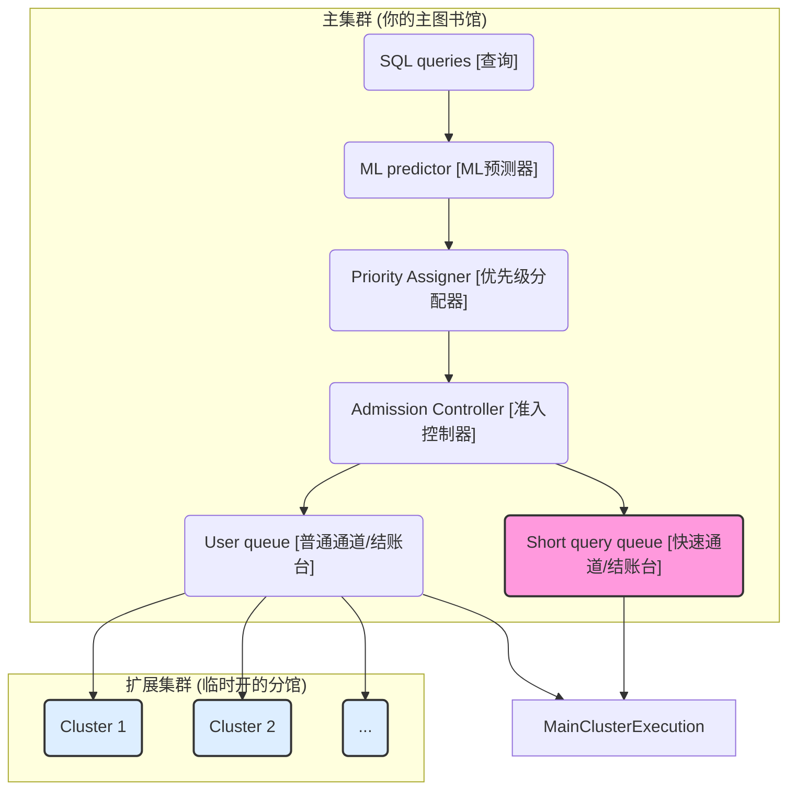
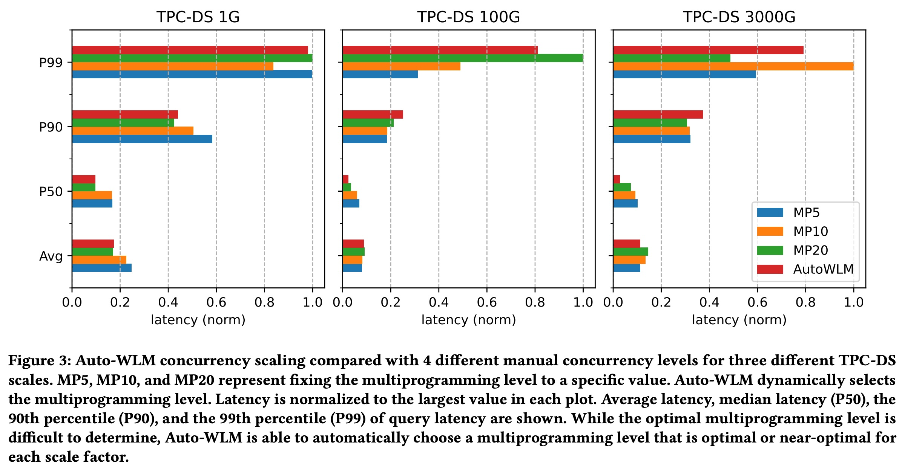
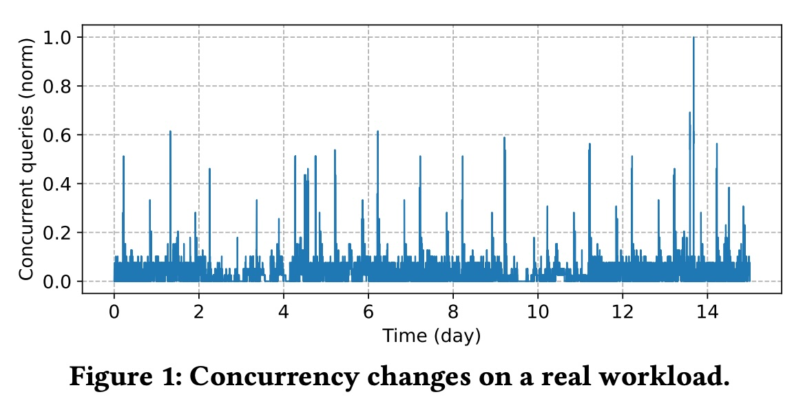
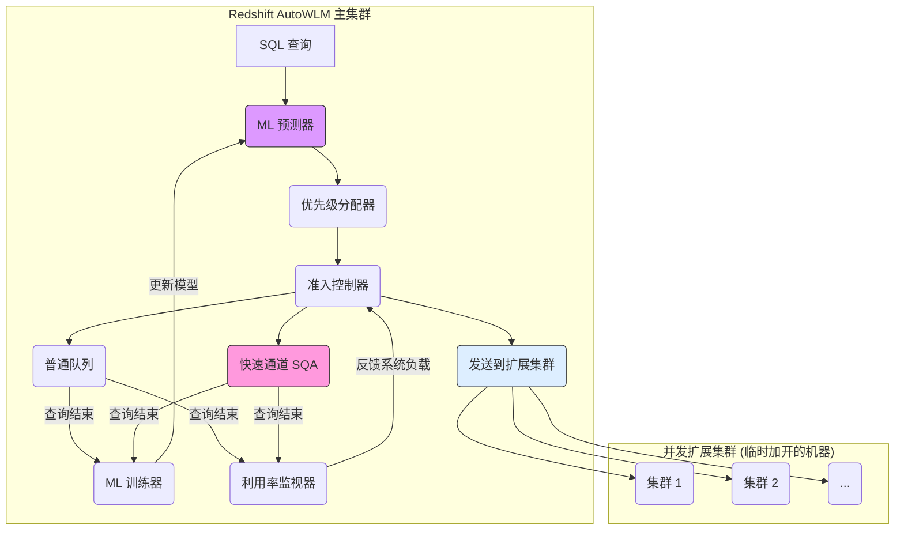
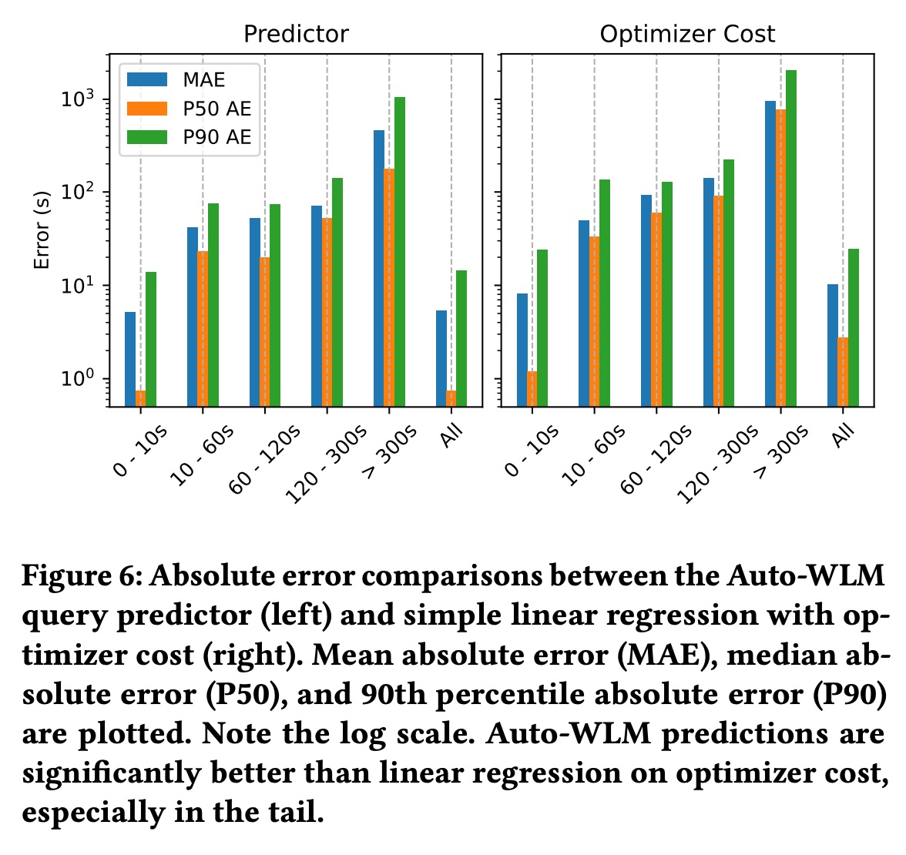
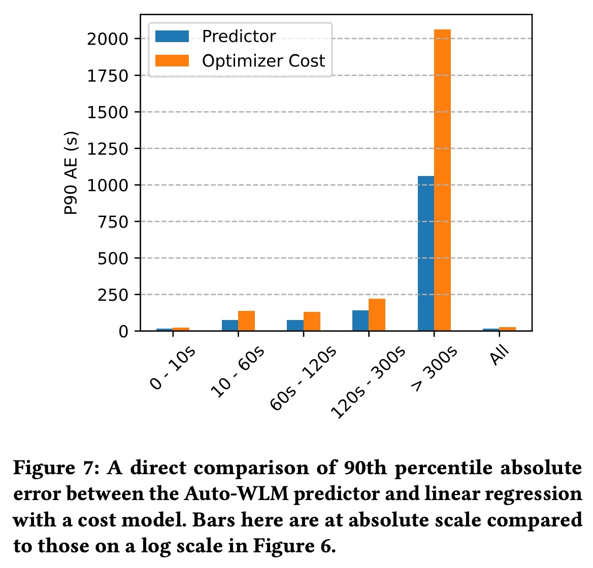
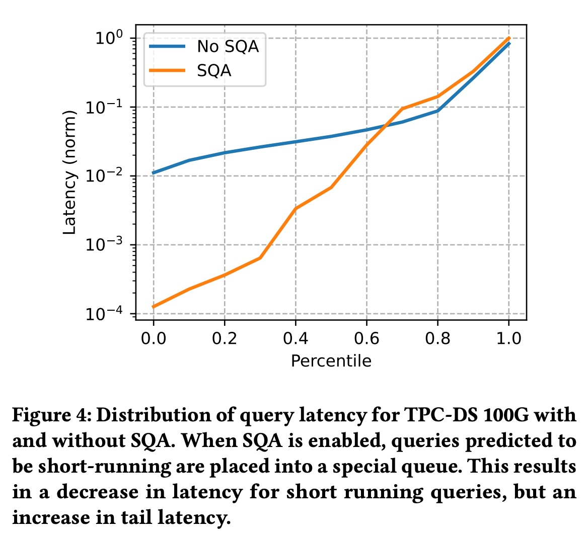
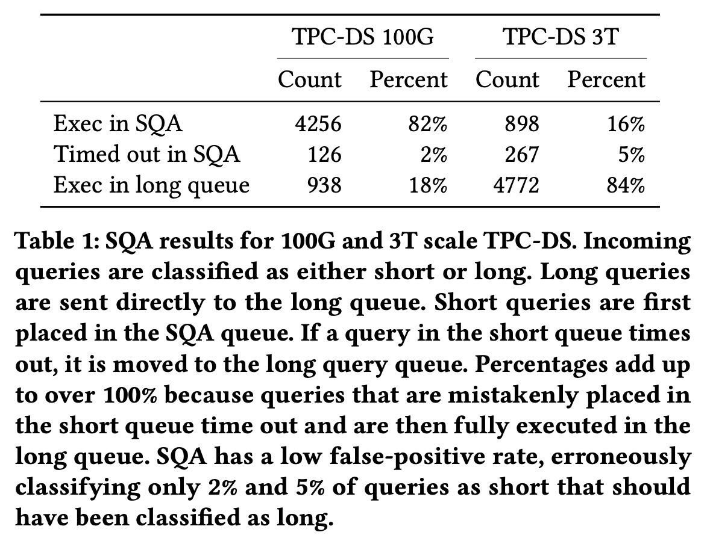
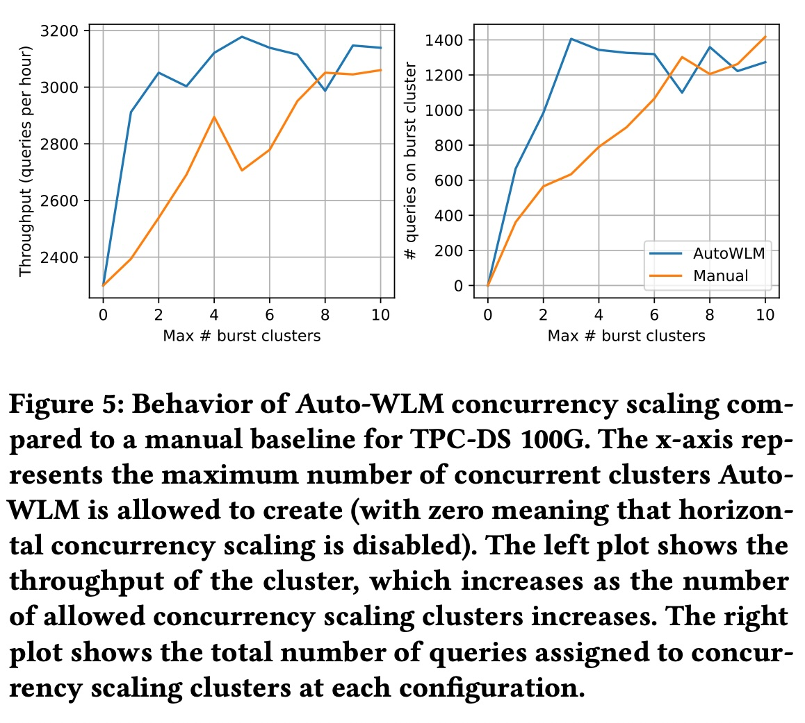
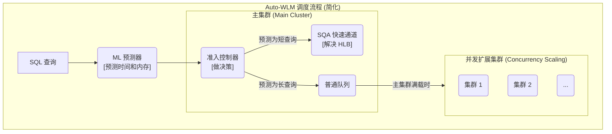

## AI论文解读 | Auto-WLM: Machine Learning Enhanced Workload Management
        
### 作者        
digoal        
        
### 日期        
2025-10-22        
        
### 标签        
PostgreSQL , PolarDB , DuckDB , AI , 论文解读        
        
----        
        
## 背景  
      
https://dl.acm.org/doi/pdf/10.1145/3555041.3589677        
  
提示:          
```          
读懂《Auto-WLM: Machine Learning Enhanced Workload Management》这篇论文需要提前掌握哪些基础知识, 请使用中文通熟易懂的讲解这些基础知识, 可以引用论文中的图、表或使用Markdown支持的图形(text,mermaid等)增加解释性. 
  
使用中文通熟易懂的解读《Auto-WLM: Machine Learning Enhanced Workload Management》这篇论文, 其中的关键内容请着重讲解, 可以引用论文中的图、表或使用Markdown支持的图形(text,mermaid等)增加解释性. 
  
提取《Auto-WLM: Machine Learning Enhanced Workload Management》这篇论文中的重要术语, 使用中文对这些术语进行通熟易懂的讲解, 可以引用论文中的图、表或使用Markdown支持的图形(text,mermaid等)增加解释性. 
```     
  
## 1 前置知识 
  
要完全理解这篇关于 Auto-WLM 的论文，你需要一些跨领域的知识，主要涉及数据库系统、云计算和基础的机器学习。这篇论文的**核心**是讲亚马逊（Amazon）如何使用机器学习（ML）技术，让他们的云数据仓库（Redshift） 变得更“智能”，能自动管理各种查询任务，而不需要数据库管理员（DBA）进行繁琐的手动调优 。

我将为你拆解阅读这篇论文所需的几个关键基础知识，并尽量用通俗的语言来解释：

### 1\. 数据库与数据仓库基础

**这是什么？**
想象一个超大型的数字图书馆，这个图书馆就是**数据仓库（Data Warehouse）** 。你（用户）的任务是向图书管理员（数据库系统）提出各种复杂问题，比如“过去5年，所有A类书籍和B类书籍的借阅量对比”。

  * **查询 (Query):** 你提出的问题就是“查询”。
  * **工作负载 (Workload):** 图书馆一天内收到的所有问题的集合 。这些问题（查询）有难有易：
      * 有的很简单：“《XX》书在哪？” (对应论文里的**短查询 (Short Queries)**) 
      * 有的很复杂：“统计图书馆所有书的平均字数。” (对应论文里的**长查询 (Long Queries)**) 
  * **查询计划 (Query Plan):** 管理员拿到一个复杂问题后，不会马上就跑去找书。他会先制定一个计划，比如“先去A区查索引，再去B区拿书，最后到C区汇总。” 这个“计划”就是查询计划 。Auto-WLM 的一个关键就是**通过分析这个计划来预测任务的难度** 。

### 2\. 核心问题：工作负载管理 (WLM)

**这是什么？**
WLM (Workload Management) 就是图书馆的管理策略 。当图书馆人满为患时，管理员必须做几个决定：

1.  **准入控制 (Admission Control):** 图书馆（集群）容量有限。是让新来的人（新查询）马上进来，还是让他先在门口排队？
2.  **调度 (Scheduling):** 如果很多人都在排队，下一个该处理谁的？是先处理那个只问一个简单问题的，还是那个要统计所有书籍的？
3.  **资源分配 (Resource Allocation):** 每个人（查询）需要多少桌面空间（**内存 (Memory)**）和多少个管理员的帮助（**CPU**）？

**传统 WLM 的痛点：**
管理员需要靠经验定下“死规矩”，比如“图书馆最多同时接待10个人” 。但如果这10个人都是简单问题，图书馆其实很空闲（资源浪费）；如果这10个人都是超级复杂的问题，图书馆就彻底卡死了（性能下降）。

**论文中的关键术语：Head-of-Line Blocking (HLB) 队头阻塞** 
这是一个你必须理解的概念。想象一下，你在超市排队结账，你只买了一瓶水，但排在你前面的人有三辆购物车。虽然你结账只需要10秒钟，但你可能要等半小时。

在数据库里也一样，一个简单的“短查询”  可能会被一个需要运行3小时的“长查询”  堵在后面，导致用户体验极差。

### 3\. 云计算与“弹性” (Elasticity)

**这是什么？**
这篇论文的背景是**云数据仓库** ，它和传统本地机房的数据库有一个根本不同：**弹性 (Elasticity)**。

  * **传统方式 (On-premise):** 你的图书馆（数据库）大小是固定的 。如果来了很多人（负载高峰），大家就只能在外面淋雨排队 。
  * **云方式 (Cloud):** 你的图书馆是“魔法”的。当管理员（Auto-WLM）发现门口排队的人太多时，他可以**立刻在旁边复制出几个一模一样的“分馆”** 。等高峰期过了，再把这些“分馆”收起来，这样你就只为你真正使用的资源付费 。

这篇论文里的 **"Concurrency Scaling Clusters" (并发扩展集群)**  就是指这些临时开出来的“分馆”。Auto-WLM 的核心职责之一就是决定**什么时候开“分馆”、开几个** 。

你可以参考论文的**图 2 (Figure 2)** ，它清晰地展示了这个架构：    



  * Auto-WLM 会决定是把你的查询送到“快速通道”(SQA) ，还是“普通通道”(User queue) ，还是送到“临时分馆”(Concurrency Scaling Clusters) 。

### 4\. 机器学习 (ML) 基础

**这是什么？**
Auto-WLM 之所以“智能”，因为它用 ML 来做决策，而不是靠“死规矩”。它就像一个经验丰富的图书管理员，能“预测”未来。

  * **预测模型 (Prediction Model):** 系统的核心是一个**ML 预测器** 。你把你的问题（查询计划） 给它看，它就能告诉你：“你这个问题，  **估计要花 10 分钟（执行时间），需要 2GB 内存（资源需求）** 。” 
  * **训练 (Training):** 它如何学会预测的？它会观察数据库里**过去**所有执行过的查询 。它知道“长得像 A 的查询，上次花了5分钟；长得像 B 的查询，上次花了2小时”。通过不断学习这些历史数据，它的预测越来越准。
  * **特征 (Features):** 它如何判断两个查询“长得像”？它会提取查询计划的特征，比如“这个计划里有多少个‘Join’操作”、“要扫描多少数据”等等 。
  * **本地训练 (Local Training):** 论文强调，这个 ML 模型是在**每个客户自己的集群上单独训练的** 。这意味着模型能适应你家图书馆的“特殊馆藏”和“读者习惯”，而不是用一个“全球图书馆通用模型” 。

### 5\. 性能指标与排队论 (Queuing Theory)

**这是什么？**
你需要知道如何衡量“快”与“不快”，以及管理排队的基本数学原理。

  * **性能指标 (Metrics):**

      * **延迟 (Latency):** 你从提问到拿到答案，总共花了多久。**越低越好** 。
      * **吞吐量 (Throughput):** 图书馆（系统） **每小时** 能处理多少个问题。**越高越好** 。

  * **百分位 (Percentiles) (P50, P90, P99):**

      * 这是评估性能的关键。只看“平均延迟”没意义（就像平均工资）。
      * **P50 (中位数):** 50% 的查询延迟都低于这个值。代表了“典型”情况 。
      * **P99 (99百分位):** 99% 的查询延迟都低于这个值。代表了“最差”情况 。优化 P99 延迟对于系统稳定性非常重要。
      * 你看论文的**图 3 (Figure 3)** ，它就是在比较不同设置下的 P50, P90, P99 延迟。    

  * **利特尔法则 (Little's Law):**

      * 这是排队论的一个基础公式，论文明确提到了它 。
      * 公式： $L = \lambda W$ (或者论文中的 $C = T \times E$ )
      * **通俗解释：**
          * $C$ = 在图书馆里的人数 (并发数)
          * $T$ = 每分钟进来的人数 (吞吐量)
          * $E$ = 平均每个人待的时间 (执行时间)
      * **Auto-WLM 如何使用它？**  Auto-WLM 会用这个公式来做“假设分析”：如果我再多放一个人（查询）进来（ $C+1$ ），会导致每个人（ $E$ ）都慢一点，那么总的吞吐量（ $T$ ）是会上升还是下降？ 它通过这个计算来动态调整“最佳并发数” 。

### 总结：你需要的基础知识

1.  **数据库：** 知道什么是数据仓库、查询、查询计划、工作负载。
2.  **WLM：** 理解为什么需要管理（并发、调度），以及“队头阻塞”(HLB) 是什么。
3.  **云计算：** 明白什么是“弹性”和“水平扩展”（即论文中的 Concurrency Scaling）。
4.  **机器学习：** 知道什么是“预测模型”和“训练”（知道模型能根据历史数据预测查询时间和内存就足够了）。
5.  **性能/排队：** 知道“延迟”和“吞吐量”的区别，以及 P99 代表“最差情况”，并对“利特尔法则”有个基本概念（系统里的人数 = 到达速率 × 平均停留时间）。

具备了这些知识，你就能看懂 Auto-WLM 是如何巧妙地融合这些技术，打造一个能自我调节、自我优化的智能数据库管理系统了。
  
## 2 解读论文 
  
这是一篇来自亚马逊（Amazon）的非常“接地气”的论文，它详细介绍了他们在 Amazon Redshift（一种云数据仓库服务）中实际部署并大规模使用的一个名为 **Auto-WLM** 的智能系统 。

简单来说，这篇论文的核心是讲：**亚马逊如何使用机器学习（ML）技术，来自动当好一个“数据库管理员（DBA）”，让 Redshift 数据库自己学会“排队”和“调度”，从而在面对复杂多变的用户请求时，既跑得快，又省资源。**

这套系统已经在生产环境中使用，每天做出数百万个决策来优化成千上万个 Redshift 集群 。

-----

### 1\. 为什么需要 Auto-WLM？（要解决的问题）

想象一下你是一个大型图书馆的管理员，图书馆里（数据库集群）的座位（资源，如内存和CPU）是有限的。读者们（用户查询）会不断进来提出各种需求：

  * **简单需求：** “帮我查一本书在哪。”（**短查询**，Dashboard、报表）
  * **复杂需求：** “帮我统计过去十年所有书的借阅模式。”（**长查询**，ETL、复杂分析）

传统的手动WLM（Workload Management）就像是管理员制定的一套“死规矩” ，比如“图书馆最多同时接待10个人”。这会带来很多问题：

1.  **资源浪费/拥堵：** 如果来的10个人都是简单需求，图书馆其实很空闲（资源浪费）。如果来的10个人都是复杂需求，图书馆就彻底卡死，外面的人也进不来（性能下降）。
2.  **队头阻塞 (Head-of-Line Blocking)：** 这是个核心痛点。你只是想查一本书（短查询），却不幸排在了一个要统计十年数据的人（长查询）后面，结果你等了3个小时才轮到你 。这对用户体验是致命的。
3.  **负载波动（云环境特性）：** 云数据库的负载是动态变化的 。比如早上9点分析师上班，会突然涌入大量查询，到了晚上又全是ETL任务 。你很难用一套“死规矩”来适应所有情况 。论文中的 **图1 (Figure 1)** 就展示了一个真实集群的并发查询数在15天内的巨大波动 。    

 

**Auto-WLM 的目标：** 自动解决以上所有问题，让系统“智能”地决定该**同时运行多少查询**、**先运行谁**、**以及什么时候该“加开”临时座位（弹性伸缩）** 。

-----

### 2\. Auto-WLM 的核心架构（如何工作的？）

Auto-WLM 的工作流程就像一个高度智能的“迎宾和调度系统”。我们可以用论文中的 **图 2 (Figure 2)** 来简化理解这个流程 ：    



当一个查询（Query）进来时，它会经历以下步骤：

1.  **ML 预测器 (ML Predictor)：** 这是系统的“预言家” 。它会分析这个查询的执行计划，然后**预测出它需要多少内存和多长时间才能运行完** 。
2.  **优先级分配器 (Priority Assigner)：** 根据预测结果，给查询“贴标签” 。比如“这个查询很简单，是高优先级（Short Job First）” 。
3.  **准入控制器 (Admission Controller)：** 这是系统的“大脑”和“交通警察” 。它拿着预测结果和优先级，再看看当前系统（主集群和扩展集群）的繁忙程度，然后做出决定：
      * **决策 A：** “这是个简单查询，请走 **快速通道 (SQA)**。” 
      * **决策 B：** “这是个普通查询，主集群还有空位，请去 **普通队列 (User queue)** 排队等待执行。” 
      * **决策 C：** “主集群忙不过来了，把它（或队列中的其他查询）送到 **并发扩展集群（Concurrency Scaling Clusters）** 去执行。” 
4.  **后台模块：**
      * **ML 训练器 (ML Trainer)：** 等查询实际运行结束后，它会收集“真实”的运行时间和内存使用情况 。然后用这些新数据 **反过来重新训练那个“预言家”（ML 预测器）** ，让它下次猜得更准 。
      * **利用率监视器 (Utilization Monitor)：** 实时监控集群的 CPU、内存是否太忙或太闲，然后告诉“交通警察”（准入控制器）：“现在很闲，多放点查询进来！”或者“快爆了，别再放查询了！” 。

-----

### 3\. 三大关键技术（亮点讲解）

Auto-WLM 的“智能”主要体现在三个地方：

#### 关键技术 1：ML 预测器（智能的“预言家”）

这是 Auto-WLM 智能决策的基石。

  * **它用什么模型？** 论文提到他们用的是 **XGBoost** 模型 。
  * **为什么不用优化器估算？** 很多人会问，数据库的“查询优化器”自己不是会估算成本吗？论文解释道，优化器的成本是“无单位”的，而且主要用于比较计划A和计划B哪个好，它不能准确预测“到底需要2GB内存还是10GB内存” 。
  * **它准吗？** 论文的 **图 6 (Figure 6)** 和 **图 7 (Figure 7)** 显示，Auto-WLM 的预测器（左侧）在各个时间段（0-10s, 10-60s...）的 90% 绝对误差（P90 AE）都显著低于仅使用优化器成本（右侧）的预测 。     
  * **它是本地训练的：** 这一点非常重要。Auto-WLM 不是用一个“通用模型”去预测所有人的查询，而是在**每个客户自己的集群上，用他们自己的历史数据单独训练一个模型** 。这使得模型能“记住”你这个集群的特定数据和查询模式 。

#### 关键技术 2：SQA（解决“队头阻塞”的 VIP 通道）

Short Query Acceleration (SQA) 是 Auto-WLM 的明星功能，专门解决“短查询等长查询”的痛点 。

  * **原理：** 系统在主集群上预留一小块专用资源（内存和CPU）。当“ML预测器”认为一个查询是“短查询”时，就把它扔进这个 VIP 通道 。
  * **效果：** 效果立竿见影。论文的 **图 4 (Figure 4)** 展示了 SQA 开启（橙色线）和关闭（蓝色线）的延迟对比。    
      * **解读图 4：** 启用 SQA 后，延迟最低的 60% 的查询（横坐标 0.0 到 0.6）的延迟（纵坐标） **被压低了几个数量级（快了几十上百倍）** 。代价是 P90 以上的长查询会慢一点点 ，但这对于提升整体用户体验是非常值得的。
  * **万一预测错了怎么办？** 如果一个查询被错误地放进 SQA（它其实是个长查询），系统会有一个“超时机制”。当它运行时间过长，系统会**自动“掐断”它，然后把它扔回普通队列去重新执行** 。
  * **SQA 的准确率：** **表 1 (Table 1)** 显示，在 100G 的 TPC-DS 测试中，82% 的查询被送入 SQA 并且成功执行，只有 2% 的查询被“误判”而超时 。这证明 ML 预测器非常准。    

 

#### 关键技术 3：弹性与动态并发（智能的“调度员”）

Auto-WLM 不仅要决定“谁先进”，还要决定“总共能进多少人”。

  * **动态并发（MPL）：** 在单个集群上（无论是主集群还是扩展集群），Auto-WLM 会动态调整并发数（Multiprogramming Level）。
  * **它如何决定？** 它使用了一个基于**排队论 (Queuing Theory) 中著名的“利特尔法则 (Little's Law)”** 的算法 。
      * **通俗解释：** 它会做“假设分析” 。“如果我再多放一个查询进来，考虑到它可能会让其他查询都慢一点 ，那么总的吞吐量（每秒完成的查询数）是会增加还是减少？” 。如果计算结果是增加，它就多放一个查询进来。
      * **效果：** **图 3 (Figure 3)** 显示，Auto-WLM（红色条）能自动找到一个接近“最优”的并发级别，其性能（Avg, P50, P90, P99延迟）与手动调优到最佳状态（MP10或MP20）的性能相当，甚至更好 。    
  * **弹性伸缩（加开集群）：** 当主集群的“普通队列”开始积压，查询等待时间超过一定阈值（比如几秒钟）时 ，Auto-WLM 就会 **自动启动一个或多个“并发扩展集群”** （就是那些临时工机器）来分担压力 。
      * **效果：** **图 5 (Figure 5)** 显示，随着允许的“扩展集群”数量增加（横坐标），Auto-WLM（蓝色线）的吞吐量（左图）始终高于或等于手动固定配置（橙色线）。这说明它能更高效地利用这些弹性资源来提升吞吐量 。    

-----

### 4\. 论文的启示（“Lessons Learned”）

这篇论文最有价值的部分之一是第 6 节，作者分享了他们在实践中“踩过的坑”和学到的教训 ：

1.  **本地模型 \> 全局模型：** 他们惊讶地发现，在**每个集群上单独训练的“本地模型”，性能远超一个用所有客户数据训练的“全局模型”** 。因为本地模型能学会该客户特定的数据倾斜和查询习惯 。
2.  **简单模型（XGBoost）足够好：** 论文坦言，在 Redshift 中，高达 75% 的查询是重复的 。像 XGBoost 这样的树模型非常擅长“记住”这些重复查询 ，而且训练和预测速度极快 。
3.  **预测速度 \> 预测精度（有时）：** 对于那些本身只运行1秒的查询，你不能花200毫秒去做 ML 预测 。**模型的“推理延迟” (Inference time) 和开销，与它的准确率同样重要** 。
4.  **基准测试（TPC）不代表真实世界：** TPC-DS 这样的标准测试集，与客户真实的花样百出的混合负载（ETL、报表、探索性查询混在一起）相差甚远 。

### 总结

Auto-WLM 是一个将机器学习深度嵌入数据库核心调度路径的成功范例 。它通过一个**本地训练的 ML 预测器**来预知查询的资源需求，然后利用 **SQA** 保证短查询的快速响应，同时通过**动态并发**和**弹性伸缩**来最大化集群吞吐量和资源利用率。
  
## 3 术语 
  
理解这篇论文《Auto-WLM: Machine Learning Enhanced Workload Management》需要掌握几个关键的数据库和机器学习术语。Auto-WLM 是亚马逊 Redshift 云数据仓库中实际部署的一套智能管理系统 。

以下是论文中最重要的几个术语及其通俗易懂的中文讲解：

### 1\. Workload Management (WLM) - 工作负载管理

  * **通俗讲解：**
    WLM 就像是数据仓库的“交通总调度”。当一大堆查询（“工作负载”）同时涌入数据库时，WLM 负责决定：

    1.  **准入 (Admission)：** 哪些查询（车辆）可以立即上路（执行），哪些需要先在入口排队 。
    2.  **调度 (Scheduling)：** 排队的查询中，下一个该轮到谁 。
    3.  **资源分配 (Resource Control)：** 每个正在运行的查询能使用多少 CPU 和内存（分配几条车道） 。

  * **论文中的意义：**
    传统 WLM 需要数据库管理员 (DBA) 手动设置大量复杂规则（比如“最多同时跑10个查询”） 。而 Auto-WLM 的目标是**自动**完成这些调优工作 ，让系统自己适应工作负载的变化 。

### 2\. Head-of-Line Blocking (HLB) - 队头阻塞

  * **通俗讲解：**
    这是 WLM 中一个核心的痛点问题 。想象一下你在超市排队结账，你只买了一瓶水，但排在你前面的是一个买了三辆购物车东西的人。虽然你结账只需要10秒，但你可能要等他半小时。

    ```text
    (你, 短查询) <-- (等待) <-- [数据库资源] <-- (别人, 超长查询)  <-- 发生队头阻塞
    ```

    在数据库中，这就是指一个**短查询**（如刷新仪表盘）被迫排在一个**长查询**（如跑一个复杂的分析报表）后面，导致短查询的响应时间变得极长 。

  * **论文中的意义：**
    Auto-WLM 的一个关键目标就是缓解 HLB 问题 ，确保短查询能尽快得到响应。

### 3\. Query Performance Model (ML Predictor) - 查询性能模型 (ML 预测器)

  * **通俗讲解：**
    这是 Auto-WLM 系统的“预言家” 。在你提交一个查询（Query）但还未执行时，这个 ML 模型会先“看”一下你的查询计划，然后**预测**出它大概需要：

      * **多少执行时间 (Latency)** 
      * **多少内存 (Memory)** 

  * **论文中的意义：**
    这个预测是 Auto-WLM 做出所有智能决策的基础 。系统会根据这个预测结果来决定是让查询插队、排队，还是分配更多资源 。这个模型是在每个客户自己的集群上，用客户自己的历史数据**本地训练**的 ，因此是“实例优化”的 。

### 4\. Short Query Acceleration (SQA) - 短查询加速

  * **通俗讲解：**
    这是 Auto-WLM 专门为解决“队头阻塞”问题而设计的“VIP快速通道” 。
    系统会预留一小块专用资源 。当“ML预测器”判断一个查询是“短查询”后（例如，预测它运行时间短、占内存少） ，准入控制器 (Admission Controller) 就会把它导向这个 SQA 快速通道，让它插队先执行 。

  * **论文中的意义：**
    SQA 是该系统的一个核心功能。如论文**图 4** 所示，开启 SQA 后，中短查询（图中前 60% 的查询）的延迟得到了**指数级**的改善（快了几十甚至上百倍） 。如果一个查询被“误判”为短查询，但在 SQA 中运行超时，它会被自动取消，并被当作长查询重新排队 。    

### 5\. Concurrency Scaling Clusters - 并发扩展集群

  * **通俗讲解：**
    这体现了云数据库的“弹性”(Elasticity) 。

      * **主集群 (Main Cluster)：** 就像你常去的那个图书馆，座位（资源）有限 。
      * **并发扩展集群：** 当图书馆（主集群）满座且门口排起了长队时（查询开始积压） ，Auto-WLM 会 **自动在旁边临时“变”出几个一模一样的“分馆”** （即启动新的临时集群） ，把排队的读者（查询）分流过去。

  * **论文中的意义：**
    这是 Auto-WLM 应对“工作负载峰值”（如周一早上的报表高峰）的手段 。如论文的**图 2** 架构所示，Auto-WLM 不仅管理主集群，还负责决定何时启动这些“扩展集群”，以及将哪些查询发送过去 。当“分馆”空闲后，它们会被自动释放以节省成本 。   




### 6\. Multiprogramming Level (MPL) - 多道程序级别 (并发度)

  * **通俗讲解：**
    这指的是系统 **“同时”** 在处理的查询数量 。这个值非常关键，但很难手动设好：

      * **并发度太低：** 就像一个大图书馆只允许3个人同时看书。资源（座位）被大量浪费，效率（吞吐量）很低 。
      * **并发度太高：** 就像一个图书馆塞进了500个人。大家互相抢座位、抢管理员（抢CPU和内存），导致每个人看书都变得极慢，系统濒临崩溃 。

  * **论文中的意义：**
    Auto-WLM 不使用固定的并发数，而是使用一种**自适应算法**来动态调整这个值 。它基于排队论（特别是利特尔法则）  进行“假设分析”：如果我再多放一个查询进来，总的吞吐量是会提高还是下降？ 论文中的**图 3** 显示，Auto-WLM（红色条）能自动找到一个接近甚至优于“手动最佳配置”的并发度 。    

### 7\. Preemption - 抢占

  * **通俗讲解：**
    这是一种处理高优先级任务的“强制插队”机制 。
    假设图书馆的座位已经满了，都在处理一些普通的查询（低优先级） 。这时，图书馆的“馆长”（高优先级查询）来了，他需要立刻用电脑。
    “抢占”机制会强行把一个正在使用电脑的普通读者（低优先级查询） **“踢下线”** （取消并重新排队） ，把资源释放给“馆长”使用 。

  * **论文中的意义：**
    这确保了高优先级的查询（即使用户手动指定的“Critical”查询）不会因为资源被低优先级查询占满而饿死 。论文还讨论了如何避免被“踢下线”的查询永远无法完成（例如使用“冷却期”和“浪费时间有界”等保护机制） 。
  
## 参考        
         
https://dl.acm.org/doi/pdf/10.1145/3555041.3589677  
  
https://rmarcus.info/blog/        
        
<b> 以上内容基于DeepSeek、Qwen、Gemini及诸多AI生成, 轻微人工调整, 感谢杭州深度求索人工智能、阿里云、Google等公司. </b>        
        
<b> AI 生成的内容请自行辨别正确性, 当然也多了些许踩坑的乐趣, 毕竟冒险是每个男人的天性.  </b>        
  
    
#### [期望 PostgreSQL|开源PolarDB 增加什么功能?](https://github.com/digoal/blog/issues/76 "269ac3d1c492e938c0191101c7238216")
  
  
#### [PolarDB 开源数据库](https://openpolardb.com/home "57258f76c37864c6e6d23383d05714ea")
  
  
#### [PolarDB 学习图谱](https://www.aliyun.com/database/openpolardb/activity "8642f60e04ed0c814bf9cb9677976bd4")
  
  
#### [PostgreSQL 解决方案集合](../201706/20170601_02.md "40cff096e9ed7122c512b35d8561d9c8")
  
  
#### [德哥 / digoal's Github - 公益是一辈子的事.](https://github.com/digoal/blog/blob/master/README.md "22709685feb7cab07d30f30387f0a9ae")
  
  
#### [About 德哥](https://github.com/digoal/blog/blob/master/me/readme.md "a37735981e7704886ffd590565582dd0")
  
  

  
