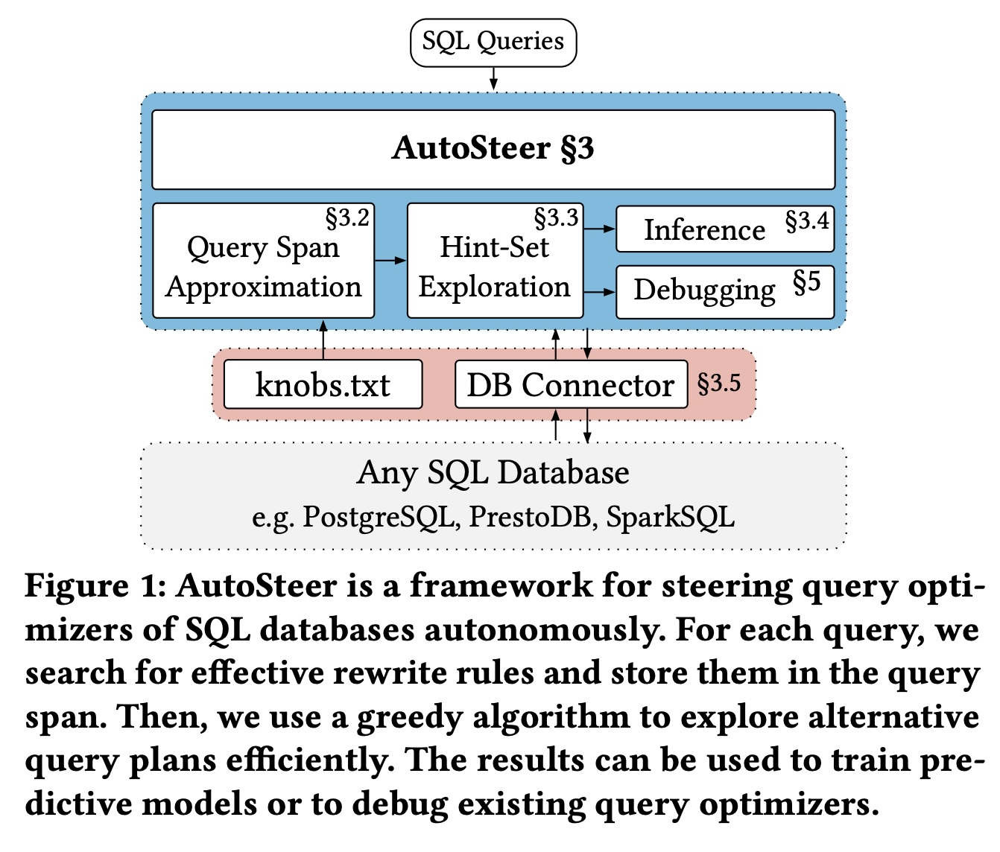
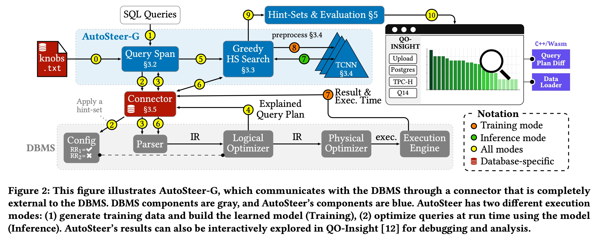
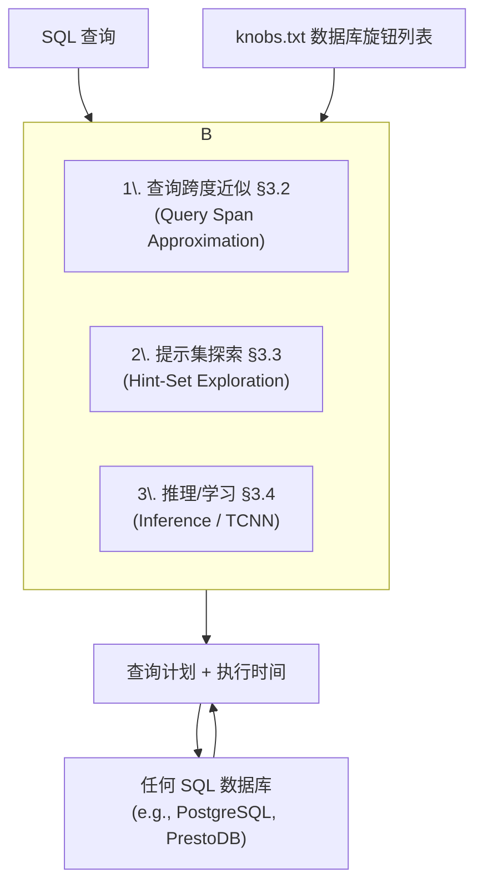
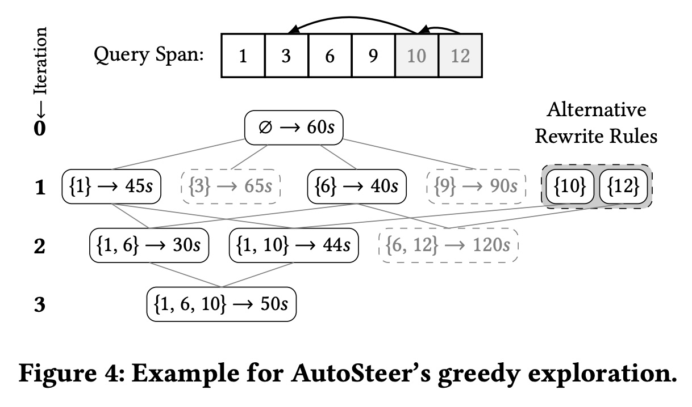
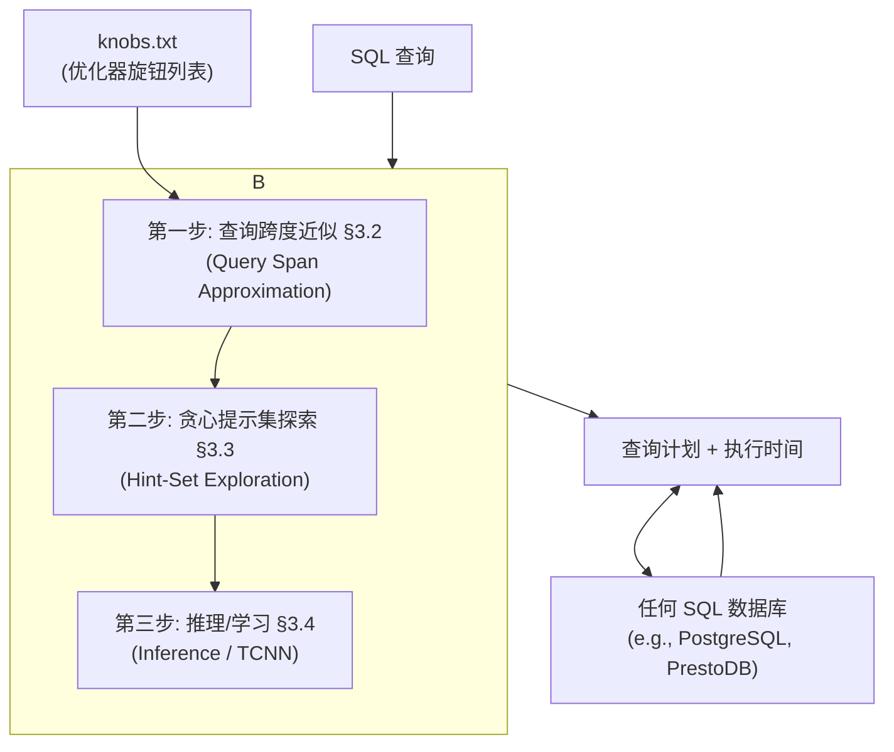
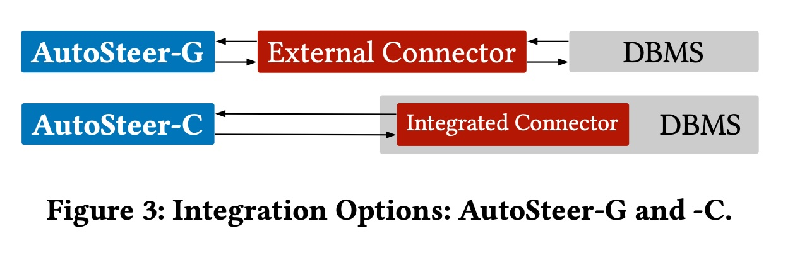
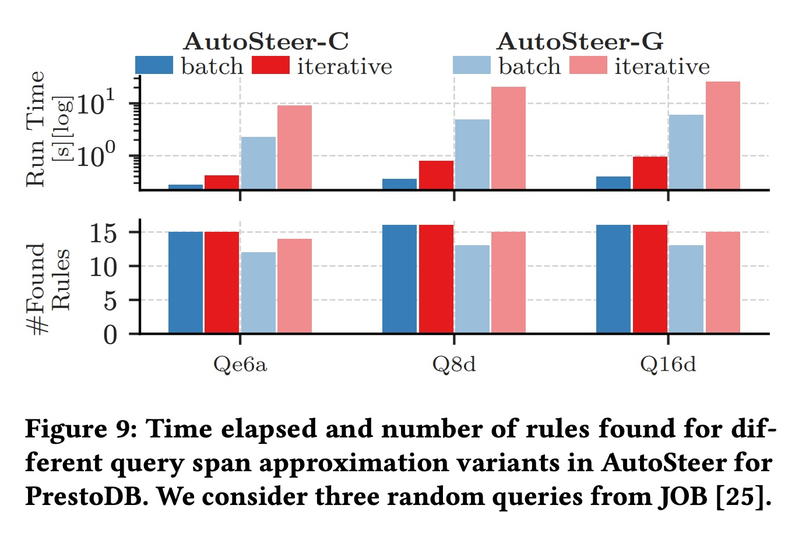
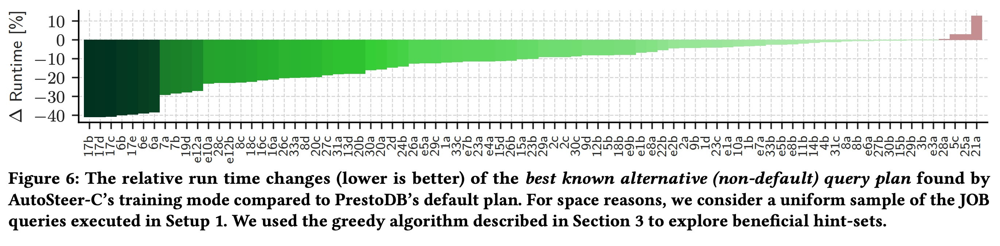
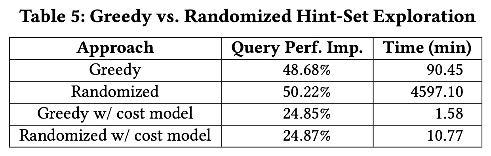
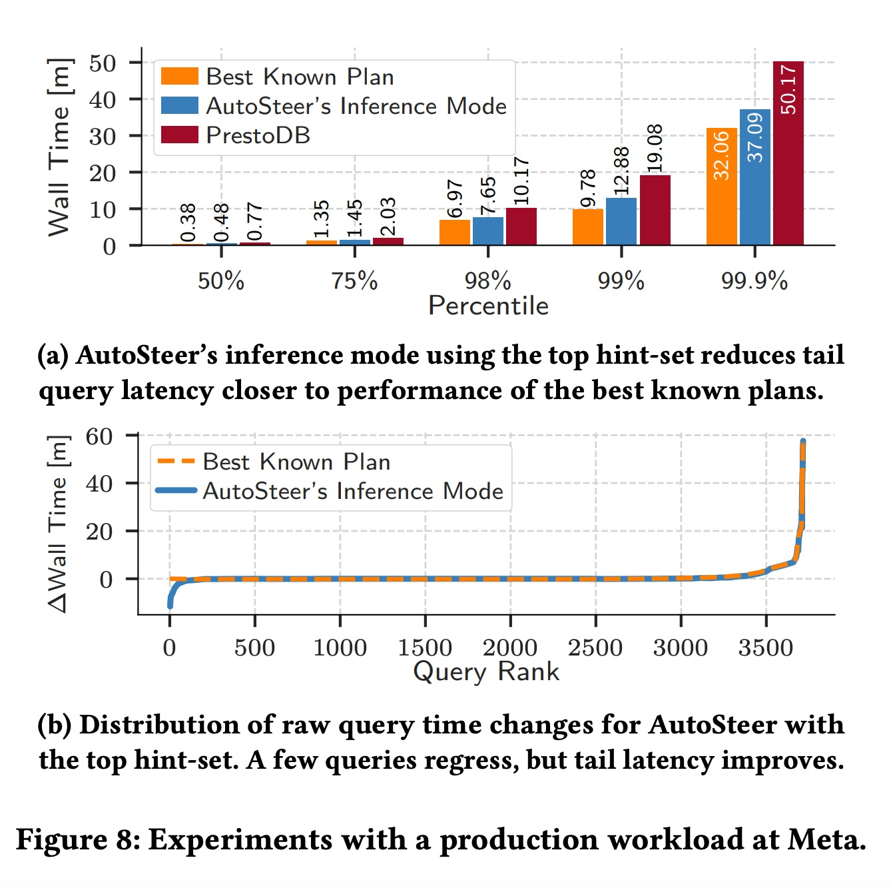

## AI论文解读 | AutoSteer: Learned Query Optimization for Any SQL Database
        
### 作者        
digoal        
        
### 日期        
2025-10-22        
        
### 标签        
PostgreSQL , PolarDB , DuckDB , AI , 论文解读        
        
----        
        
## 背景  
      
https://www.vldb.org/pvldb/vol16/p3515-anneser.pdf        
  
提示:          
```          
读懂《AutoSteer: Learned Query Optimization for Any SQL Database》这篇论文需要提前掌握哪些基础知识, 请使用中文通熟易懂的讲解这些基础知识, 可以引用论文中的图、表或使用Markdown支持的图形(text,mermaid等)增加解释性. 
  
使用中文通熟易懂的解读《AutoSteer: Learned Query Optimization for Any SQL Database》这篇论文, 其中的关键内容请着重讲解, 可以引用论文中的图、表或使用Markdown支持的图形(text,mermaid等)增加解释性. 
  
提取《AutoSteer: Learned Query Optimization for Any SQL Database》这篇论文中的重要术语, 使用中文对这些术语进行通熟易懂的讲解, 可以引用论文中的图、表或使用Markdown支持的图形(text,mermaid等)增加解释性. 
```     
  
## 1 前置知识 
  
要读懂《AutoSteer: Learned Query Optimization for Any SQL Database》这篇论文 ，你需要对数据库系统和机器学习有一些基础了解。这篇论文的核心是利用机器学习（Learned）来自动“驾驶”（Steer）任何SQL数据库的查询优化器（Query Optimization）。

通俗来说，当你向数据库发送一条SQL查询（比如“搜索所有价格低于100元的商品”），数据库并不会马上开始搜索。它会先启动一个叫做“**查询优化器**”的内部程序。这个程序会想出*许多*不同的执行“配方”（比如“先筛选价格，再关联商品信息” V.S. “先关联商品信息，再筛选价格”）。它会估算哪个“配方”最快，然后选择那个“配方”去执行。

**问题在于**：这个优化器有时候会“估算失误”，选了一个很慢的“配方”。

AutoSteer  就是一个“外挂”系统，它用机器学习来帮助数据库的优化器做出更好的选择，避免选到那个很慢的“配方”。

要理解这篇论文，你需要掌握以下几个核心基础知识：

### 1\. 数据库基础：SQL 和“查询执行计划” (QEP)

  * **SQL (结构化查询语言)**：这是你用来向数据库提问的语言。
  * **查询执行计划 (Query Execution Plan, QEP)**：这是数据库优化器最终选定的“执行配方”。它是一个详细的步骤树，告诉数据库引擎具体该如何一步步获取数据（比如，是先用索引，还是全表扫描？两个表是用哈希连接，还是嵌套循环连接？）。
  * **优化器的“旋钮” (Knobs) 和“提示” (Hints)**：大多数数据库都提供一些配置开关（就像收音机上的“旋钮”） ，允许数据库管理员（DBA）手动干预优化器。比如，DBA可以强制它“不要使用哈希连接”。这些开关的组合，在论文中被称为**Hint-Set (提示集)** 。

**简单比喻：**

  * **SQL查询**：你的需求（“我要从北京去上海”）。
  * **查询优化器**：一个导航App（比如谷歌地图）。
  * **查询执行计划 (QEP)**：App规划出的一条具体路线（“坐飞机”、“坐高铁”或“开车走G2高速”）。
  * **Hint-Set (提示集)**：你对App的手动设置（“不要走高速”、“避免收费站”）。

### 2\. 传统查询优化的问题

你需要明白为什么需要 AutoSteer。因为传统的优化器（导航App）并不完美。

  * **它依赖“估算”** ：优化器依赖**代价模型 (Cost Model)**  和**基数估计 (Cardinality Estimation)**  来猜测每条路线的“成本”（比如要花多长时间）。
  * **估算会出错**：如果数据分布很奇怪，或者统计信息过时了，它的估算就会错得离谱。
  * **结果**：导航App（优化器）可能自信地推荐了一条“最快路线”（坏的QEP），结果你开过去发现堵死了（查询巨慢）。

### 3\. “前辈”：Bao (Bandit Optimizer)

AutoSteer 是建立在之前一个叫做 Bao 的工作上的 。你必须先理解 Bao 是做什么的。

  * **Bao 的目标**：同样是“驾驶”优化器 。

  * **Bao 的方法**：

    1.  **专家出手**：首先，需要一个数据库专家*手动*挑选出几十个（比如48个）他认为有用的“提示集” (Hint-Sets) 。
    2.  **暴力尝试**：当一个新查询来了，Bao 会让数据库把这48个提示集*全都试一遍*，生成48个不同的查询计划 (QEP) 。
    3.  **ML 预测**：Bao 使用一个机器学习模型（TCNN，一种树状神经网络）来*预测*这48个计划中，哪一个会跑得最快 。
    4.  **执行并学习**：Bao 选择它认为最快的那个去执行，执行完后得到*真实*的时间，再用这个真实结果来*反向训练*（更新）它的ML模型，让它下次预测得更准 。

  * **Bao 的局限 (AutoSteer 要解决的问题)**：

      * 那48个提示集是*专家手动*选的，非常费劲，而且换个数据库（比如从 PostgreSQL 换到 MySQL），专家又要重新选 。
      * 这48个提示集是*静态的*，对所有查询都用这一套，不够灵活 。

### 4\. AutoSteer 的核心：自动化“提示集”发现

理解了Bao的局限，你就理解了 AutoSteer 的核心贡献：**它把Bao中“专家手动选提示集”这一步给自动化了** 。

AutoSteer 不需要专家，它的工作流程（可以参考论文中的图1或图2 ）是这样的：      



你需要重点理解 AutoSteer 实现自动化的两个关键技术：

**1. 查询跨度近似 (Query Span Approximation)**

  * **思路**：Bao 对所有查询都用固定的48个提示集。AutoSteer 认为，对*当前这一个*查询，可能总共只有5个“旋钮”会真正影响它。
  * **做法**：它会先快速试一下，找出对*这个查询*真正有效的“旋钮”子集，这个子集就叫 "Query Span" 。
  * **好处**：探索范围从“所有旋钮”缩小到“当前查询相关的几个旋钮”，大大减少了工作量 。

**2. 动态贪心探索 (Greedy Hint-Set Exploration)**

  * **思路**：即使只剩5个相关旋钮，所有组合也有 $2^5=32$ 种。如果相关旋钮有20个（ $2^{20}$ 超过100万 ），还是太多了 。AutoSteer 不会傻傻地全试。
  * **做法**：它使用一种“贪心算法” 。这在论文的 **Listing 1**  和 **Figure 4**  中有详细展示。    
  * **比喻 (看 Figure 4 )**：
    1.  **基线 (Iteration 0)**：先跑一遍默认路线（ 空提示集 $\emptyset$ ），耗时 60s 。
    2.  **试单个旋钮 (Iteration 1)**：只关掉旋钮 {1}，耗时 45s（有提升！保留）。只关掉 {3}，65s（更糟了，丢弃）。只关掉 {6}，40s（有提升！保留）... 。
    3.  **试“好+好”组合 (Iteration 2)**：只尝试那些在上一步被证明是“好的”旋钮的组合。比如，试试 {1, 6}，发现耗时 30s（哇！新纪录）。
  * **好处**：通过这种“好的”+“好的”=“可能更好”的贪心策略，AutoSteer 能非常高效地找到那个最好的提示集（比如 {1, 6}），而不需要尝试所有可能的组合。

-----

### 总结：你需要的基础知识

为了读懂这篇论文，你需要一个知识阶梯：

1.  **（基础）数据库**：知道 SQL 是什么，以及“查询执行计划”(QEP) 是什么。
2.  **（进阶）查询优化**：知道优化器是干什么的，它依赖“代价模型”和“重写规则”(RR)，并且知道它会犯错。知道“Hint”(提示)是DBA用来纠错的手动工具。
3.  **（核心）Bao**：知道 Bao 是一个“学习型”优化器，它用ML模型（TCNN）从*专家给定的静态Hint-Set*中挑选最佳QEP。
4.  **（本文）AutoSteer**：理解 AutoSteer 的目标是*取代* Bao 中的专家，通过 **Query Span**（缩小范围）和 **Greedy Search**（高效探索）来*自动*为*每条查询*动态发现最佳的 Hint-Set。
  
## 2 解读论文 
  
这是一篇关于“学习型查询优化”的重磅论文。它的核心贡献是开发了一个名为 **AutoSteer** 的框架 ，它可以像一个“自动驾驶仪”一样， **自动地** “驾驶”或“引导” **任何** SQL 数据库的查询优化器 ，让它为你的 SQL 查询选择一个更快的执行方案。

简单来说，AutoSteer 解决了一个核心痛点：数据库的“查询优化器”（决定 SQL 如何执行的大脑）有时会犯错，选出很慢的执行方案。以前的“学习型”解决方案（如 Bao）需要数据库专家花大力气*手动*配置一套“提示” ，这非常困难且无法移植。

而 AutoSteer **把这个最难的、需要专家介入的步骤给自动化了** 。

-----

### 1\. 核心思想：从“专家手动挡”到“AI自动挡”

要理解 AutoSteer，你必须先了解它的“前辈” **Bao** (Bandit Optimizer) 。

  * **问题背景**：当你执行一条 SQL 时，数据库的“优化器”会生成很多个“执行计划”（Query Execution Plans, QEPs），然后“估算”一个成本最低（最快）的去执行。但这个估算经常出错 。
  * **Bao (手动挡)**：Bao 的做法是，让一个数据库专家*手动定义* 48 个“提示集”（Hint-Sets）。这些提示集就像是给优化器的“强制指令”（比如“禁用哈希连接”、“强制使用索引”）。Bao 会让数据库把这 48 个计划都生成出来，然后用一个 AI 模型（TCNN）来*预测*哪个计划最快，最后执行那个最好的 。
  * **Bao 的痛点**：那 48 个提示集是*静态的*、*专家手工挑选的* 。给 PostgreSQL 选一套，换到 PrestoDB 就得重选一套 。这太费力了，阻碍了它的广泛应用 。

**AutoSteer (自动挡) 的革命性贡献**：
AutoSteer *不再需要*专家来定义那 48 个提示集 。它会**自动地、动态地为每一条查询**发现有潜力的提示集 。

它只需要你提供一个简单的 `knobs.txt` 文件（列出这个数据库有哪些优化“旋钮”可以调），它就能全自动工作。

-----

### 2\. AutoSteer 的工作原理：自动“驾驶”三部曲

AutoSteer 的架构如下图所示，其核心是三个自动化的步骤（对应图中的 §3.2, §3.3, §3.4）：



[来源: 参照 图 1]

  

#### 第一步：缩小范围 (Query Span Approximation, §3.2)

一个数据库可能有几百个优化“旋钮”（比如 PrestoDB 有 170 个 ）。如果全都尝试，组合是天文数字 ( $2^{170}$ ) 。

AutoSteer 的第一步是快速判断：**对于*当前*这条 SQL 查询，到底哪几个旋钮才会真正影响它的执行计划？**

它通过快速开关这些旋钮并比较 `EXPLAIN` 计划是否变化，来找到这个真正相关的“旋钮”子集，这个子集被称为“**查询跨度**”(Query Span) 。比如，170 个旋钮里可能只有 20 个是相关的 。

**效果**：搜索空间从 $2^{170}$ 剧降到 $2^{20}$ 。

#### 第二步：高效探索 (Greedy Hint-Set Exploration, §3.3)

$2^{20}$ （约100万）还是太多了。AutoSteer 的第二个法宝是使用**贪心算法**（Greedy Algorithm）来高效地探索这个空间 。

这个算法的依据是论文的一个关键发现：**(1) 大多数有益的提示集都很小（只关掉少数几个旋钮），(2) 性能好的“大提示集”通常是由性能好的“小提示集”组合而成的 。**

**图 4** 完美地展示了这个过程：     

[来源: 参照 图 4]

1.  **Iteration 0 (基线)**：先不加任何提示（ 空集 $\emptyset$ ），执行默认计划，耗时 60s 。
2.  **Iteration 1 (尝试单个)**：依次尝试关闭“查询跨度”中的每个旋钮。
      * `{1}` (关闭旋钮1): 耗时 45s ( 比 60s 好！**保留** $\checkmark$ ) 。
      * `{3}`: 耗时 65s ( 比 60s 差！**丢弃** $\times$ ) 。
      * `{6}`: 耗时 40s ( 比 60s 好！**保留** $\checkmark$ ) 。
      * ...
3.  **Iteration 2 (组合“好的”)**：只把上一步中被证明是“好的”提示集（{1}, {6}）进行两两组合 。
      * `{1, 6}`: 耗时 30s ( 哇！新纪录！**保留** $\checkmark$ ) 。
4.  **Iteration 3 (继续组合)**：继续拿 {1, 6} 和其他“好的”单点（如 {10}）组合。
      * `{1, 6, 10}`: 耗时 50s (不如 30s，停止) 。

通过这种方式，AutoSteer 只用了 8 次探索（ $\emptyset$ , {1}, {3}, {6}, {9}, {10}, {12}, {1, 6}, {1, 10}, {6, 12}, {1, 6, 10} ... 中剪枝后的一部分）就找到了 30s 的最优解，而无需遍历所有组合 。

#### 第三步：学习与推理 (Inference, §3.4)

AutoSteer 在“训练模式”下，会像上面那样去*执行*很多计划，收集真实的执行时间 。然后，它使用这些数据训练一个和 Bao 一样的 AI 模型（TCNN，树卷积神经网络）。

在“推理模式”（即线上运行时），它就**不再需要真的去执行**所有探索到的计划了 。它会用贪心法生成一批*候选*计划，然后用训练好的 TCNN 模型去*预测*它们的执行时间，最后挑一个预测最快的去执行 。

-----

### 3\. 关键设计：两种“即插即用”模式 (G vs. C)

AutoSteer 提供了两种集成模式（见 图 3），这体现了它极强的实用性：     

#### 1. AutoSteer-G (通用版) 

  * **如何工作**：通过一个完全*外部*的连接器，使用标准的 SQL 命令（如 `SET SESSION ...` 和 `EXPLAIN ...`）来开关旋钮和获取计划 。
  * **代码示例 (Listing 2)**：实现一个新数据库的支持非常简单 。
    ```python
    # 以 PostgreSQL 为例 
    def set_knob(knob: str, enable: bool):
        self.conn.exec(f"SET {knob} TO \
                       {'ON' if enable else 'OFF'}") 

    # 以 PrestoDB 为例 
    def set_knob(knob: str, enable: bool):
        self.conn.exec(f"SET SESSION {knob} = {enable}") 
    ```
  * **优点**：实现极其简单，论文作者实现了 5 个数据库，每个都只用了不到 70 行代码 。
  * **缺点**：性能开销大。为了找到“查询跨度”，它需要为每个旋钮都执行一次 `EXPLAIN` 。

#### 2. AutoSteer-C (定制版) 

  * **如何工作**：*侵入式*修改数据库优化器的源代码 ，在优化器内部直接追踪哪些规则被激活了 。
  * **代码示例 (Listing 3)**：
    ```java
    // 伪代码: 修改 PrestoDB 的优化器 
    class RewriteRule:
        def apply(node, query_span):
            if self.condition(node):
                query_span.add(self.rule_id) // 直接记录
                rewrite(node) 
    ```
  * **优点**：效率极高。在一次优化中就能获得所有“查询跨度”信息 。
  * **缺点**：实现非常复杂。作者为 PrestoDB 修改了 1757 行代码 。

**性能对比 (图 9)**：
下图展示了在 PrestoDB 上，AutoSteer-C（蓝色/红色）在“查询跨度”探索阶段（图9上部）比 AutoSteer-G（浅蓝/浅红）快了近一个数量级 。同时，AutoSteer-C 也能找到 G 模式无法发现的、更底层的优化规则（图9下部）。

  

[来源: 参照 图 9]

-----

### 4\. 惊艳的实验效果

AutoSteer 几乎在所有测试中都取得了胜利：

1.  **完胜 PrestoDB (图 6)**：在 JOB 基准测试中，AutoSteer-C 找到的计划（绿色条）几乎总是优于 PrestoDB 的默认计划（0% 基线），最高提升了 40% 。    
2.  **超越“专家”Bao (PostgreSQL)**：AutoSteer-G（自动挡）的表现与“专家手动调优”的 Bao 相当，甚至还略微（0.4%）超越了它 。这证明了“自动挡”已经赶上甚至超过了“专家手动挡”。
3.  **贪心搜索效率 (表 5)**：AutoSteer 的“贪心搜索”效率远超“随机搜索”。    
      * **贪心 (Greedy)**：用 **90 分钟** 达到了 **48.68%** 的性能提升 。
      * **随机 (Randomized)**：花了 **4597 分钟**（76小时）才达到 **50.22%** 的提升 。
        AutoSteer 用 2% 的时间达到了几乎相同的效果 。
4.  **Meta 真实生产环境 (图 8)**：在 Meta 的 PB 级数据和数百个节点的 PrestoDB 集群上，AutoSteer 仅凭一个自动发现的提示（禁用 `HashGenOptimizer` ），就将 **P99.9（即最慢的 0.1%）查询延迟从 50.17 分钟降低到了 37.00 分钟** ，P99 延迟降低了约 20% 。    

### 总结与启示

《AutoSteer》最大的贡献在于它**攻克了学习型优化器（Bao）中最“不自动化”的环节——专家手工设计提示集**。

它通过“查询跨度近似”（缩小范围）和“贪心探索”（高效搜索）两大技术，实现了一个真正意义上的“即插即用”的学习型优化框架，可以被应用到*任何* SQL 数据库上。

此外，AutoSteer 不仅能提升查询速度，它还是一个强大的**调试工具** 。例如，在 Meta 的实验中，它自动发现了 `HashGenOptimizer` 这条规则在很多情况下是有害的 ，这个发现反过来帮助人类专家改进了 PrestoDB 的优化器本身 。
  
## 3 术语 
  
好的，这篇论文确实引入了一些非常关键的术语。理解它们是读懂这篇论文的核心。

我会为您提取这篇论文中的重要术语，并用最通俗易懂的中文进行讲解。

-----

### 1\. 查询优化 (Query Optimization)

  * **通俗讲解**：
    当你向数据库发送一条 SQL 查询（比如 `SELECT * FROM ...`），数据库并不会马上开始执行。它内部有一个“大脑”，叫做**查询优化器**。这个“大脑”会想出*许多*种不同的执行“配方”（比如“先过滤再排序” V.S. “先排序再过滤”），然后估算哪一种配方最省时省力。这个“思考并选择最佳配方”的过程，就叫查询优化。
  * **论文中的意义**：
    这篇论文的目标就是改进这个“大脑”。因为这个“大脑”有时候会“估算失误”，选出一个很慢的配方。AutoSteer 就像一个外挂的“自动驾驶仪”，来帮助这个“大脑”做出更好的选择 。

### 2\. 查询执行计划 (Query Execution Plan, QEP)

  * **通俗讲解**：
    “查询优化器”这个“大脑”在思考后，最终选定的那个“最佳配方”，就是**查询执行计划 (QEP)**。它就像一个详细的导航路线图，告诉数据库引擎具体该如何一步步去获取数据（比如：第一步用索引A，第二步做哈希连接，第三步排序...）。
  * **论文中的意义**：
    AutoSteer 的全部工作，就是帮助数据库找到一个比它自己默认找到的 QEP *执行起来更快*的 QEP 。

### 3\. “旋钮” (Knobs) 和 “提示集” (Hint-Set)

  * **通俗讲解**：

      * **旋钮 (Knobs)**：数据库的优化器有很多内部的“开关”或“设置”，开发者可以通过它们来强制干预优化器的行为。比如一个旋钮叫 `enable_hash_join` (允许哈希连接)。
      * **提示集 (Hint-Set)**：就是这些“旋钮”的一个具体组合配置。比如，一个提示集可能是：`{关闭哈希连接, 开启嵌套循环连接}`。

  * **论文中的意义**：
    AutoSteer 的核心就是通过自动尝试不同的**提示集**（即开关不同的旋钮组合），来“诱导”优化器产生不同的 QEP，并从中找到最好的一个 。

### 4\. Bao (Bandit Optimizer)

  * **通俗讲解**：
    Bao 是 AutoSteer 的“前辈”。Bao 也是一个学习型优化器，但它有一个重大缺陷：它需要一个数据库专家*提前手动*定义一个*静态的*“提示集”列表（比如专家精心挑选了48个组合）。Bao 的工作就是从这固定的48个组合里为查询挑选一个最好的。
  * **论文中的意义**：
    AutoSteer 要解决的核心问题就是Bao的这个缺陷。AutoSteer 的目标是**不再需要专家手动定义**，而是实现全自动的提示集发现 。

### 5\. 查询跨度 (Query Span)

  * **通俗讲解**：
    这是一个关键术语。一个数据库可能有几百个“旋钮”，但对于*当前*这一条SQL查询，可能只有5个旋钮的开关会*真正影响*它生成的QEP。这5个“真正相关的旋钮”的集合，就被称为这条查询的**查询跨度** 。
  * **论文中的意义**：
    这是 AutoSteer 自动化的第一步。它首先通过“**查询跨度近似**”(Query Span Approximation) 技术 ，快速把搜索范围从几百个旋钮缩小到真正相关的几个（比如20个），极大地降低了探索的复杂度 。

### 6\. 贪心提示集探索 (Greedy Hint-Set Exploration)

  * **通俗讲解**：
    这是 AutoSteer 自动化的第二步，也是它的核心算法。在找到“查询跨度”（比如20个相关旋钮）后，它如何从中找到最佳组合呢？它采用了一种“贪心”策略，这个策略在论文的 **图4 (Figure 4)** 中有完美展示：  

    ```text
    迭代 0:  (基线)   -> 默认方案, 耗时 60s
               |
    迭代 1:  (尝试单个)
               |---- {关闭旋钮1} -> 45s (比60s好! 保留)
               |---- {关闭旋钮3} -> 65s (比60s差! 丢弃)
               |---- {关闭旋钮6} -> 40s (比60s好! 保留)
               ...
               |
    迭代 2:  (组合"好的")
               |---- {关闭1, 关闭6} -> 30s (新纪录! 保留)
               |---- {关闭1, 关闭10} -> 44s (比30s差! 但仍保留)
               ...
               |
    迭代 3:  (继续组合"好的")
               |---- {关闭1, 关闭6, 关闭10} -> 50s (变差了...)
    ```
    
      

    [来源: 参照 图4]

  * **论文中的意义**：
    这种贪心策略基于一个关键假设：**好的“大组合”通常是由好的“小组合”构成的** 。通过这种方式，它能非常高效地找到那个耗时30s的最优组合，而不需要尝试所有 $2^{20}$ 种可能性 。

### 7\. TCNN (树卷积神经网络)

  * **通俗讲解**：
    TCNN 是 AutoSteer 训练的那个“AI大脑”。它的作用不是*生成*计划，而是*预测*计划的执行时间 。
  * **论文中的意义**：
      * **训练时**：AutoSteer 通过“贪心探索”找到很多QEP，并*真实执行*它们，得到“QEP”和“真实耗时”的数据对。
      * **训练后**：用这些数据喂给 TCNN，TCNN 就学会了“看一个QEP长什么样，就能猜出它跑起来要多久”。
      * **运行时 (Inference Mode)**：AutoSteer 再次使用贪心算法生成一批*候选*QEP，但这次它**不再需要真的去执行**，而是让 TCNN *预测*一下哪个最快，然后直接挑那个预测最快的去执行 。

### 8\. AutoSteer-G vs. AutoSteer-C

  * **通俗讲解**：
    这是 AutoSteer 的两种“安装模式”，体现了它的“Any SQL Database”(任何SQL数据库)的能力 。

  * **AutoSteer-G (Generic, 通用版)**

      * **是什么**：一个*外部*连接器，像一个独立的程序。它通过发送标准的SQL命令（比如 `SET ...` 来开关旋钮，`EXPLAIN ...` 来获取QEP）来与数据库通信 。
      * **优点**：即插即用，实现非常简单（如 **Listing 2** 所示，给一个新数据库写支持可能就几十行代码）。
      * **缺点**：效率低。为了找“查询跨度”，它可能要发几百条 `EXPLAIN` 命令 。

  * **AutoSteer-C (Custom, 定制版)**

      * **是什么**：*侵入式*修改数据库优化器的源代码，在数据库*内部*集成 AutoSteer 的逻辑 。
      * **优点**：效率极高。在一次优化中就能知道所有相关的“旋钮”（如 **图9** 所示，它比 G 版快一个数量级）。    
      * **缺点**：实现非常复杂（作者为 PrestoDB 修改了1757行代码）。

  * **论文中的意义**：
    这两种模式提供了灵活的权衡。研究人员或企业可以先用 **AutoSteer-G** 快速验证 AutoSteer 在他们的数据库上有没有效果，如果效果显著，再投入精力去实现高性能的 **AutoSteer-C** 用于生产环境 。
  
## 参考        
         
https://www.vldb.org/pvldb/vol16/p3515-anneser.pdf  
  
https://rmarcus.info/blog/        
        
<b> 以上内容基于DeepSeek、Qwen、Gemini及诸多AI生成, 轻微人工调整, 感谢杭州深度求索人工智能、阿里云、Google等公司. </b>        
        
<b> AI 生成的内容请自行辨别正确性, 当然也多了些许踩坑的乐趣, 毕竟冒险是每个男人的天性.  </b>        
  
    
#### [期望 PostgreSQL|开源PolarDB 增加什么功能?](https://github.com/digoal/blog/issues/76 "269ac3d1c492e938c0191101c7238216")
  
  
#### [PolarDB 开源数据库](https://openpolardb.com/home "57258f76c37864c6e6d23383d05714ea")
  
  
#### [PolarDB 学习图谱](https://www.aliyun.com/database/openpolardb/activity "8642f60e04ed0c814bf9cb9677976bd4")
  
  
#### [PostgreSQL 解决方案集合](../201706/20170601_02.md "40cff096e9ed7122c512b35d8561d9c8")
  
  
#### [德哥 / digoal's Github - 公益是一辈子的事.](https://github.com/digoal/blog/blob/master/README.md "22709685feb7cab07d30f30387f0a9ae")
  
  
#### [About 德哥](https://github.com/digoal/blog/blob/master/me/readme.md "a37735981e7704886ffd590565582dd0")
  
  

  
