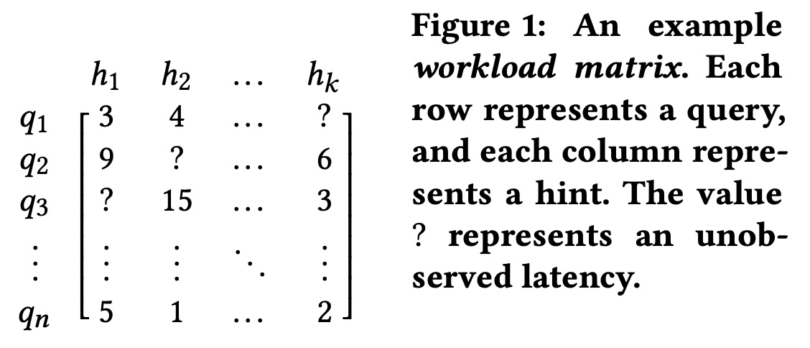
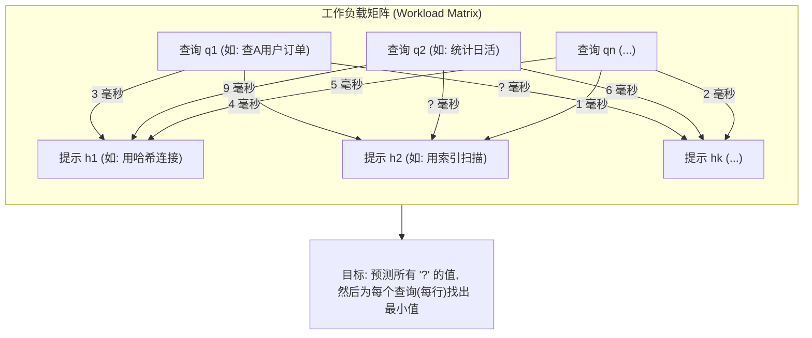
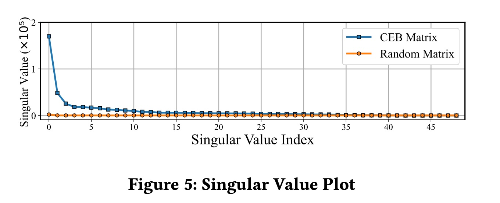
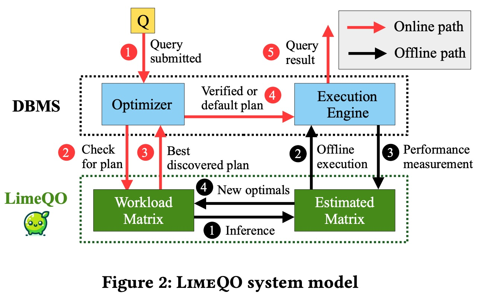
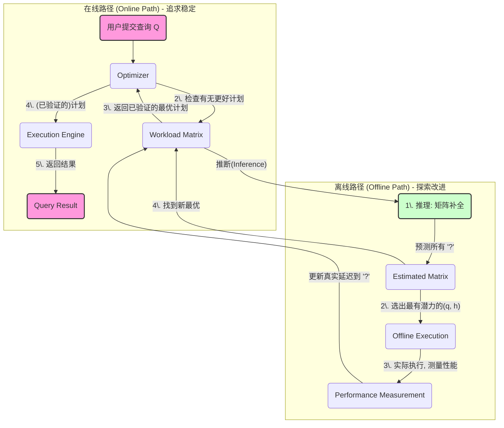
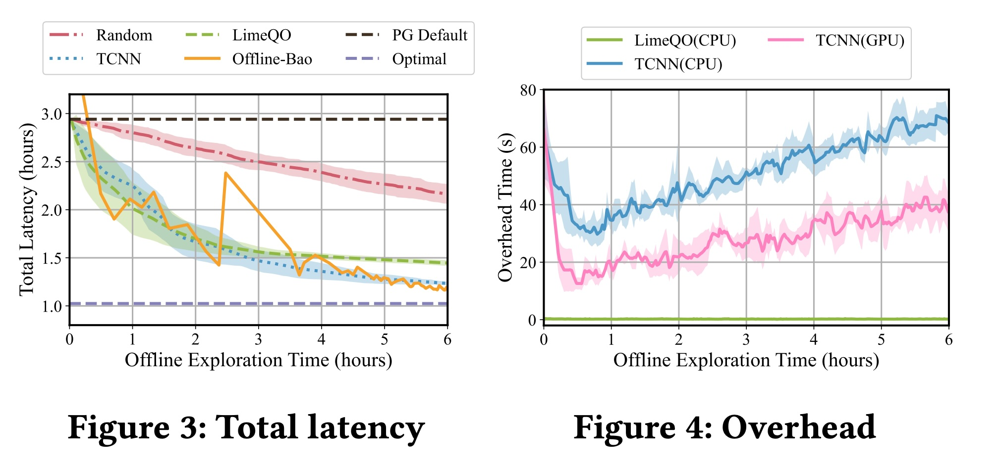

## AI论文解读 | Low Rank Approximation for Learned Query Optimization
        
### 作者        
digoal        
        
### 日期        
2025-10-22        
        
### 标签        
PostgreSQL , PolarDB , DuckDB , AI , 论文解读        
        
----        
        
## 背景  
      
https://dl.acm.org/doi/pdf/10.1145/3663742.3663974        
  
提示:          
```          
读懂《Low Rank Approximation for Learned Query Optimization》这篇论文需要提前掌握哪些基础知识, 请使用中文通熟易懂的讲解这些基础知识, 可以引用论文中的图、表或使用Markdown支持的图形(text,mermaid等)增加解释性. 
  
使用中文通熟易懂的解读《Low Rank Approximation for Learned Query Optimization》这篇论文, 其中的关键内容请着重讲解, 可以引用论文中的图、表或使用Markdown支持的图形(text,mermaid等)增加解释性. 
  
提取《Low Rank Approximation for Learned Query Optimization》这篇论文中的重要术语, 使用中文对这些术语进行通熟易懂的讲解, 可以引用论文中的图、表或使用Markdown支持的图形(text,mermaid等)增加解释性. 
```     
  
## 1 前置知识 
  
要读懂《Low Rank Approximation for Learned Query Optimization》（使用低秩近似进行学习型查询优化）这篇论文，你需要提前掌握以下几个领域的基础知识。

这篇论文的核心思想是：为了加快数据库查询速度，我们可以把“哪个查询（Query）”配上“哪个执行技巧（Hint）”会“花多少时间（Latency）”这个问题，建模成一个大表格（矩阵）。这个表格有很多空白（未观测的延迟），而论文提出的LIMEQO方法  则利用“低秩近似”这种数学工具，来高效地“猜”出（预测）这些空白处的值 ，从而找到最快的执行方案。

以下是你需要掌握的基础知识点，我会用论文中的图示来辅助说明：

### 1\. 基础知识一：数据库查询优化 (Query Optimization)

这是你首先需要了解的“问题领域”。

  * **是什么？**
    数据库管理系统（DBMS）的核心功能之一。当你向数据库发送一个查询请求（比如“查询过去一个月所有A用户的订单总额”），数据库内部的“查询优化器”（Optimizer）会负责制定一个“执行计划”（Query Plan）。
  * **为什么需要？**
    同一个查询请求，可以有成百上千种执行方法。比如，是先过滤A用户再连接订单表，还是先连接订单表再过滤A用户？是使用哈希连接（Hash Join）还是嵌套循环连接（Nested Loop Join）？
  * **类比：**
    查询优化器就像一个“导航软件”。你输入“从家到公司”，它会计算出“坐地铁”、“开车”或“骑车”等不同路线（执行计划），并*估算*一个最快的时间。
  * **痛点：**
    传统的优化器依赖*估算*，但估算常常不准，导致它选的“最快路线”实际上很慢 。这篇论文的目标就是通过*实际运行*和*机器学习预测*，来找到*真正*最快的路线（执行计划）。

### 2\. 基础知识二：论文的核心模型：“工作负载矩阵” (Workload Matrix)

这是理解本论文如何建模问题的关键，请参考论文中的**Figure 1** 。    

  * **它是什么？**
    一个表格（矩阵），用来记录“哪个查询”在“哪个提示”下运行的“真实延迟” 。

      * **行 (Rows)**: 代表一个具体的查询（ $q_1, q_2, \dots, q_n$ ）。
      * **列 (Columns)**: 代表一种“提示”或“参数配置”（ $h_1, h_2, \dots, h_k$ ），这会引导优化器产生不同的执行计划 。
      * **单元格的值**: 代表查询 $q_i$ 使用提示 $h_j$ 时的**实际运行时间**（延迟）。

  * **图1解读：**     

      * $q_1$ 配 $h_1$ 跑了 3 毫秒 。
      * $q_1$ 配 $h_2$ 跑了 4 毫秒 。
      * `?` (问号) 代表“未观测的延迟” 。我们不知道 $q_2$ 配 $h_2$ 会跑多久 。

  * **核心问题：**
    我们不可能把所有组合（ $n \times k$ 种 ）都跑一遍，那太花时间了 。这个矩阵绝大部分都是 `?`。

  * **论文的目标：**
    预测（或称为“补全”）所有 `?` 处的值，然后为每一行（每一个查询）找到那个值最小的列（最快的提示）。

为了让你更容易理解这个矩阵，我们可以用一个Mermaid图来简化展示：



### 3\. 基础知识三：核心数学技术：“低秩近似”与“矩阵补全”

这是论文的“解决方案”。为什么我们可以预测 `?` 的值？因为论文假设这个矩阵是“低秩”的 。

  * **类比：Netflix 电影推荐**

      * 想象一个“用户-电影”评分矩阵：行是用户，列是电影，值是评分。这个矩阵也是充满“？”（用户没看过的电影）。
      * 推荐系统的任务就是“矩阵补全”——预测你（用户）会给那些你没看过的电影（？）打几分。
      * 它为什么能预测？因为它假设存在“隐藏因子”（Hidden Factors）。比如，“科幻迷”这个因子。你和我都喜欢《星际穿越》和《银翼杀手》，系统就推断我俩都是“科幻迷”。如果我给《沙丘》打了5星，系统就会预测你（即使没看过）也会给《沙丘》打高分。

  * **什么是“低秩” (Low Rank)？**

      * “秩” (Rank) 可以通俗理解为驱动这个矩阵的“隐藏因子”的数量。
      * 在电影例子中，可能只需要10个“隐藏因子”（如“科幻迷”、“喜剧爱好者”、“诺兰粉”等）就能大致描述所有用户的喜好。即使有100万用户和1万部电影，这个矩阵的“秩”可能也只有10。这就是“低秩”。
      * **对应到论文：** 论文假设查询的行为也不是完全随机的 。可能也存在隐藏因子，比如“这个查询IO密集型”、“那个提示对大表连接友好”。因为存在这些共性 ，所以整个工作负载矩阵 $W$ 也是“低秩”的 。

  * **如何验证“低秩”假设？**
    看论文的 **Figure 5** 。     

      * 这是“奇异值”(Singular Value) 分解图。你可以把奇异值理解为每个“隐藏因子”的重要性。
      * “CEB Matrix”（真实数据）的奇异值（蓝线） 下降得非常快：前几个值很大，后面的值很快趋近于零 。这说明，只需要少数几个“隐藏因子”就能代表整个矩阵。
      * 而“Random Matrix”（随机数据）的奇异值（红线） 就很平缓 。
      * Figure 5 证明了真实世界的工作负载矩阵*确实*是低秩的 ，因此使用矩阵补全技术是可行的。

  * **什么是“矩阵补全” (Matrix Completion)？**
    就是利用“低秩”这个特性，把一个大的、充满问号的矩阵 $W$ ( $n \times k$ )，分解成两个小的、完整的矩阵 $A$ ( $n \times r$ ) 和 $B$ ( $k \times r$ ) 。

      * $r$ 是我们设定的“秩”（比如10）。
      * $A$ 描述了每个“查询”和“隐藏因子”的关系。
      * $B$ 描述了每个“提示”和“隐藏因子”的关系。
      * 我们通过已知的单元格（那些不是 `?` 的值）来反推出 $A$ 和 $B$ 。
      * 一旦有了 $A$ 和 $B$ ， $A \times B^T$ 就能估算出（ $\hat{W}$ ） 整个矩阵，`?` 就被填满了 。

### 4\. 基础知识四：系统设计：“在线” vs “离线” (Online vs. Offline)

这是论文的“工程实现”，即LIMEQO系统如何工作的，请参考 **Figure 2** 。    

系统被分成了两条路径，以确保在学习新计划的同时，不影响用户的正常使用 。

  * **在线路径 (Online Path) (红色箭头 )：追求稳定和速度**

    1.  用户提交一个查询 $Q$ (步骤 1) 。
    2.  优化器问LIMEQO：“这个查询，你有没有存着一个*已知的、被验证过*的好计划？” (步骤 2) 。
    3.  LIMEQO从“工作负载矩阵”  中查找，返回“目前已知的最快计划”（或者默认计划）。
    4.  执行引擎执行这个*安全*的计划 (步骤 4) 。
    5.  返回查询结果 (步骤 5) 。

    

      * **关键点：** 这条路径只使用*已被验证*的计划，绝不使用“猜”的计划，以此保证“零回归”（no regressions）——即查询速度绝不会变慢。

  * **离线路径 (Offline Path) (黑色箭头 )：追求探索和改进**
    这部分工作在数据库空闲时（比如半夜）在后台进行 。

    1.  **推断 (Inference)**: LIMEQO使用“矩阵补全”技术，填满“估计矩阵” (Estimated Matrix) 。
    2.  **选择**: 系统查看这个估计矩阵，找到一个“它*认为*会很快，但*尚未被证实*”的（查询, 提示）组合（比如一个预测值很低的 `?`）。
    3.  **执行 (Offline execution)**: 系统在后台*悄悄地*试运行这个新计划 (步骤 2) 。
    4.  **测量 (Performance measurement)**: 记录下它*真正*花了多少时间 (步骤 3) 。
    5.  **更新**: 把这个“`?`”替换成刚测到的*真实值*，更新到“工作负载矩阵” (步骤 4) 。

    

      * **关键点：** 下次“在线路径”再遇到这个查询时，就能使用这个新发现的、更快的计划了。

### 总结

要读懂这篇论文，你需要：

1.  **懂数据库**：知道什么是“查询优化器”和“执行计划”。
2.  **懂模型**：理解 Figure 1 的“工作负载矩阵”是问题的核心。    
3.  **懂数学**：理解“低秩”和“矩阵补全”（类比电影推荐），并知道 Figure 5 是用来证明这个数学假设的。    
4.  **懂系统**：理解 Figure 2 的“在线/离线”设计，明白系统是如何在不影响用户的前提下进行自我优化的。    

（*此外，论文还对比了TCNN（树卷积神经网络），这是一种深度学习方法。你只需要知道TCNN是另一种更复杂、更昂贵的“猜”`?`的方法 ，用来反衬LIMEQO（线性方法）的简单和高效  即可。*）
  
## 2 解读论文 
  
这是一篇关于数据库查询优化的论文，它提出了一个名为 **LIMEQO** 的新方法。

用一句话总结这篇论文：**LIMEQO 巧妙地将“数据库查询优化”问题，转换成了一个类似“Netflix 电影推荐”的数学问题（矩阵补全），从而实现了一种开销极低、速度极快、并且“零回归”（绝不会变慢）的智能优化器** 。

下面我们来通俗地拆解这篇论文的关键内容。

### 1\. 核心问题：数据库查询为何需要“学习”？

  * **传统优化器 (Optimizer)**：就像一个GPS导航。你输入“查询A”，它会估算几条“执行路径”（比如先A后B，还是先B后A），然后选一条*估算时间*最短的路 。
  * **痛点**：这个“估算”经常不准，导致选的路（执行计划）可能非常慢。
  * **现有“学习型”方案**：用深度学习（如神经网络）来“预测”哪条路最快 。
  * **新痛点**：
    1.  **开销巨大**：训练和使用神经网络非常消耗计算资源（100-1000倍） 。
    2.  **可能“回归” (Regression)**：AI有时会犯错，选出一条比原来*更慢*的路 。
    3.  **系统复杂**：需要深入了解数据库内部的各种特征 。

### 2\. 关键内容一：LIMEQO 的核心模型——“工作负载矩阵”

LIMEQO 的第一个天才之处在于它对问题的建模。它主要针对“重复性工作负载”（Repetitive Workloads），比如公司里每天都在刷新的数据看板 。

它建立了一个大表格，即**工作负载矩阵 (Workload Matrix)**，如 **Figure 1** 所示 ：    

  * **行 (Rows)**：代表一个具体的查询 ( $q_1, q_2, \dots$ ) 。
  * **列 (Columns)**：代表一个“提示” ( Hint, $h_1, h_2, \dots$ )。你可以把“提示”理解为一种强制优化器使用的小技巧（比如“强制使用哈希连接”） 。
  * **单元格的值**：代表查询 $q_i$ 使用提示 $h_j$ 时的**真实运行时间**（延迟） 。
  * **`?` (问号)**：代表“未观测”——我们还没试过这种组合，不知道要花多久 。

**LIMEQO 的目标**：就是预测（补全）所有 `?` 的值，然后为每一行（每一个查询）找到那个值最小的列（最快的提示） 。

```text
       h1     h2    ...    hk
    +------+------+-----+------+
q1  |  3   |  4   | ... |  ?   |
    +------+------+-----+------+
q2  |  9   |  ?   | ... |  6   |  <-- 目标: 预测 '?' 的值,
    +------+------+-----+------+     并为 q2 找到最快的 h
q3  |  ?   |  15  | ... |  3   |
    +------+------+-----+------+
... | ...  | ...  | ... | ...  |
    +------+------+-----+------+
qn  |  5   |  1   | ... |  2   |
    +------+------+-----+------+
 (Figure 1 简化示意图)
```

### 3\. 关键内容二：为什么能预测？——“低秩” (Low Rank) 假设

这个矩阵这么大，`?` 这么多，为什么能预测？

这里就是 LIMEQO 的第二个天才之处：**它假设这个矩阵是“低秩”的** 。

  * **通俗解释“低秩”** ：
      * 想象一个“用户-电影”评分矩阵（这就是著名的 Netflix 推荐问题 ）。
      * 矩阵的“秩”可以理解为驱动所有人喜好的“隐藏因子”数量。比如“科幻”、“爱情”、“喜剧”等。
      * 虽然有100万用户和1万部电影，但“隐藏因子”可能只有20个。这就是“低秩”。
      * 如果 A 和 B 都喜欢《星际穿越》和《流浪地球》（都是“科幻”因子），系统就可以预测 A 也会喜欢 B 喜欢的另一部科幻片。
  * **应用到论文**：
      * “查询”就像“用户”，“提示”就像“电影”。
      * LIMEQO 假设查询的行为也不是完全随机的 。可能也存在“隐藏因子”（比如“这个查询IO密集型”、“那个提示对大表连接友好”）。
      * 因为存在这些共性，这个矩阵就是“低秩”的 。
  * **论文的证据 (Figure 5)**：    
      * 论文通过“奇异值分解”来验证这个假设 。
      * **Figure 5** 显示，真实工作负载 (CEB Matrix, 蓝线) 的奇异值（可以理解为“隐藏因子”的重要性）下降得*非常快*，说明只有少数几个因子是真正重要的 。而随机矩阵 (红线) 就很平缓 。
      * **这证明了“低秩”假设成立！** 

既然是“低秩”的，我们就可以使用一种成熟的线性代数技术——**矩阵补全 (Matrix Completion, MC)** 来预测 `?` 的值 。这比深度学习简单且快得多。

### 4\. 关键内容三：LIMEQO 系统如何工作？(Figure 2)

LIMEQO 的系统设计非常聪明，它分成了两条路径来保证“零回归” 。

我们可以用一个流程图来简化 **Figure 2**：    



  * **在线路径 (Online Path, 红色箭头)** ：

    1.  用户提交查询 。
    2.  系统去“工作负载矩阵”里查表，*只找*那些已经被**实际运行过、验证过**的计划 。
    3.  返回那个“已验证的”最快计划（或默认计划）去执行 。
    4.  **关键点**：绝不使用“预测”的计划。这保证了查询速度*绝不会*比默认的慢，即“零回归” (zero regressions) 。

  * **离线路径 (Offline Path, 黑色箭头)** ：

    1.  当数据库空闲时（比如半夜），LIMEQO 开始工作。
    2.  **推断 (Inference)**：使用“矩阵补全”技术，根据已知值，填满一个“估计矩阵” (Estimated Matrix) 。
    3.  **选择**：查看这个“估计矩阵”，找到那些“预测值很高、最有希望提升性能”的 `?` 组合 。
    4.  **执行与测量**：在后台*悄悄地*试运行这些“最有希望”的计划，并测量*真实*的延迟 。
    5.  **更新**：把这个*真实值*填回“工作负载矩阵”，覆盖掉原来的 `?` 。

这个设计就像： **“在线”时用“熟练工”保证生产，“离线”时用“AI预测”指导“新员工”在后台培训，培训合格（被验证）后，再转为“熟练工”** 。

### 5\. 关键内容四：实验结果（它真的有效吗？）

论文通过实验回答了几个关键问题：

  * **1. 性能对比 (Figure 3)**：    

      * LIMEQO (绿色) 的性能几乎和昂贵的 TCNN (深度学习, 蓝色) 一样好，尤其是在探索初期 。
      * 它们都远远甩开了 RANDOM (随机探索, 红色) 。
      * 经过6小时的离线探索，LIMEQO 能将总延迟降低到1.5小时，实现了约2倍的加速 。

  * **2. 开销对比 (Figure 4)**：  

      * **这是 LIMEQO 的“杀手锏”** 。
      * LIMEQO (粉色) 的开销（即每次离线路径中“推断”所需的时间）非常低且稳定（约200毫秒） 。
      * TCNN (蓝/青色) 的开销非常高（在CPU上需要 30-80 秒，GPU上也要 10-70 秒），而且随着数据增多，开销还会上升 。
      * 结论：LIMEQO 的计算资源效率比深度学习高 **100 到 1000 倍** 。

### 总结与未来

**LIMEQO 的贡献** ：

1.  **高效**：用简单的线性方法（矩阵补全），达到了接近昂贵深度学习（TCNN）的性能 。
2.  **低开销**：计算开销极低（100-1000倍的优势） 。
3.  **安全**：通过“在线/离线”架构，保证了“零回归” 。
4.  **简单**：它不需要知道查询计划的树形结构或成本估算等复杂特征，只需要“查询、提示、延迟”三元组 。

**局限与未来 (Section 6)**：
这篇论文的 LIMEQO 还是一个初步版本，它最大的弱点是无法处理“新查询”（Novel Queries） 。因为一个新查询在矩阵里是全新的一行，没有任何已知值，矩阵补全无法工作 。未来需要研究如何将新查询与已知的相似查询匹配起来 。
  
## 3 术语 
  
以下是《Low Rank Approximation for Learned Query Optimization》这篇论文中的重要术语及其通俗讲解：

### 1\. 学习型查询优化 (Learned Query Optimization)

  * **通俗讲解**：
    传统的数据库优化器（Optimizer）就像一个老道的GPS导航，它依赖内置的“估算模型”（比如估算路况和红绿灯）来选择一条它*认为*最快的执行路径（Query Plan）。但这种估算常常不准 。

    “学习型查询优化”就是用机器学习（AI）来替代或辅助这个老导航 。它通过学习历史数据，希望能更准确地*预测*哪条路径（哪个执行计划）*真正*跑起来最快 。

### 2\. 工作负载矩阵 (Workload Matrix)

  * **通俗讲解**：
    这是本文提出的核心模型，详见 **Figure 1** 。你可以把它想象成一个巨大的Excel表格：    

      * **行 (Rows)**：代表一个具体的查询（比如 $q_1$ : "查询A用户的订单"）。
      * **列 (Columns)**：代表一种“提示”（Hint，比如 $h_1$ : "强制使用哈希连接"）。
      * **单元格的值**：代表这个查询（行）在采用这个提示（列）时，*实际*花费的时间（延迟）。
      * **`?` (问号)**：代表“未观测” 。我们还没试过这种组合，不知道要花多久。

    

    ```mermaid
    graph TD
        subgraph "工作负载矩阵 (Workload Matrix) "
            direction TB
            Q1["查询 q1"]
            Q2["查询 q2"]
            Qn["查询 qn"]

            H1["提示 h1 (如: 用哈希连接)"]
            H2["提示 h2 (如: 用索引扫描)"]
            Hk["提示 hk (...)"]

            Q1 -- "3 毫秒" --> H1
            Q1 -- "4 毫秒" --> H2
            Q1 -- "? 毫秒" --> Hk

            Q2 -- "9 毫秒" --> H1
            Q2 -- "? 毫秒" --> H2
            Q2 -- "6 毫秒" --> Hk

            Qn -- "5 毫秒" --> H1
            Qn -- "1 毫秒" --> H2
            Qn -- "2 毫秒" --> Hk
        end
        Goal["<br/>目标: 预测所有 '?' 的值, <br/> 然后为每个查询(每行)找出最小值"]
        subgraph "Figure 1 示意图"
            direction TB
            M[ ]
        end
        M -...-> Goal
    ```

### 3\. 提示 (Hints)

  * **通俗讲解**：
    “提示”是给优化器下达的“强制指令” 。比如，论文中使用的提示包括强制“启用或禁用哈希连接”、“启用或禁用索引扫描”等 。每一种提示组合都可能让数据库产生一个*不同*的执行计划 。

### 4\. 延迟 (Latency)

  * **通俗讲解**：
    就是指一个查询执行完毕所需的时间 。这是衡量查询性能最直接的指标。在“工作负载矩阵”中，单元格的值就是延迟 。

### 5\. 性能回归 (Regressions)

  * **通俗讲解**：
    这是学习型优化器的一个主要痛点 。它指的是：“我的查询昨天跑得还挺快，为什么今天用了AI优化器，反而变得巨慢无比？”。这种不可预测的性能变差，就叫“性能回归”。LIMEQO 的设计目标之一就是实现“零回归”（zero regressions）。

### 6\. 低秩近似 (Low Rank Approximation)

  * **通俗讲解**：
    这是本文的核心数学工具。
      * **“秩” (Rank)**：可以通俗理解为驱动这个“工作负载矩阵”的“隐藏因子”数量。
      * **“低秩” (Low Rank)**：论文假设这个矩阵是“低秩”的 。意思是，虽然有成千上万的查询和提示，但决定它们性能的“隐藏因子”可能并不多（比如：“这个查询IO密集型”、“那个提示对大表连接友好”）。
      * **证据**：**Figure 5** 通过“奇异值分解”证明了这一点，真实数据（蓝线）的奇异值（代表因子的重要性）下降得非常快，说明只有少数几个因子是重要的 。    
      * **“近似” (Approximation)**：因为矩阵是低秩的，我们就可以用两个非常小的矩阵 $A$ 和 $B$ 相乘（ $A \times B^T$ ），来“近似”复原出（ $\hat{W}$ ）那个原始的、充满 `?` 的大矩阵 。

### 7\. 矩阵补全 (Matrix Completion)

  * **通俗讲解**：
    这是一种基于“低秩”假设，用来“填空”的技术 。
      * **类比**：它就像 Netflix 电影推荐系统。Netflix 也不知道你对所有电影的评分（矩阵里全是 `?`），但它可以根据你（和其他人）已有的评分，利用“协同过滤”（其背后也是矩阵补全），来预测你*可能*会给那些你没看过的电影打几分。
      * **应用**：LIMEQO 就用这个技术，根据已知的延迟（已观测的单元格），来预测（补全）所有 `?` 单元格的延迟值 。

### 8\. 在线路径 (Online Path) vs. 离线路径 (Offline Path)

  * **通俗讲解**：
    这是 LIMEQO 系统的两大工作流，如 **Figure 2** 所示 。这个设计是为了实现“零回归” 。    

      * **在线路径 (Online Path)**（红色箭头）：
          * **做什么**：处理用户*实时*提交的查询 。
          * **原则**：追求绝对稳定。当查询 $Q$ 进来时，它只会在“工作负载矩阵”中查找*已经被验证过*的最快计划 。它*绝不*使用“预测”的计划。
          * **结果**：保证用户的查询速度绝不会变慢（零回归）。
      * **离线路径 (Offline Path)**（黑色箭头）：
          * **做什么**：在数据库空闲时（比如半夜），在后台“悄悄”探索新计划 。
          * **步骤**：
            1.  **推断(Inference)**：使用“矩阵补全”预测（填满）一个“估计矩阵” $\hat{W}$ 。
            2.  **选择**：从 $\hat{W}$ 中找到“预测会很快，但还没试过”的 `?` 组合。
            3.  **执行(Offline execution)**：在后台试运行这个新计划 。
            4.  **测量(Performance measurement)**：记录它*真正*的延迟 。
            5.  **更新**：把这个*真实值*写回“工作负载矩阵”，覆盖掉 `?` 。

    

    ```mermaid
    graph TD
        subgraph "Figure 2: LIMEQO 系统模型 "
            subgraph Online["在线路径 (Online) "]
                style Online fill:#fee,stroke:#f00,stroke-width:2px
                Q(Q: 查询提交) -- "1" --> Opt(Optimizer)
                Opt -- "2\. 检查更优计划" --> WM(Workload Matrix)
                WM -- "3\. 返回已验证的最优计划" --> Opt
                Opt -- "4\. 验证/默认计划" --> EXE(Execution Engine)
                EXE -- "5\. 查询结果" --> QR(Query Result)
            end
            
            subgraph Offline["离线路径 (Offline) "]
                style Offline fill:#eef,stroke:#000,stroke-width:2px
                WM -- "1\. 推断 (Inference)" --> EM(Estimated Matrix)
                EM -- "4\. 新的最优解" --> WM
                EM -- "2\. 选择新计划" --> EXE
                EXE -- "2\. 离线执行" --> EXE
                EXE -- "3\. 性能测量" --> PM(Performance Measurement)
                PM -- "4\. 更新矩阵" --> WM
            end
        end
    ```

### 9\. 重复性工作负载 (Repetitive Workloads)

  * **通俗讲解**：
    指那些会*一遍又一遍*被执行的查询 。比如用于生成实时仪表盘（Dashboard）或报表的查询 。LIMEQO 主要针对这种场景，因为花时间去“离线探索”这些重复查询的最优计划是非常值得的 。研究发现，在一些生产系统中，这类查询占比非常高 。

### 10\. 直推式 (Transductive) vs. 归纳式 (Inductive)

  * **通俗讲解**：
    这是机器学习的两种不同模式 。
      * **归纳式 (Inductive)**：像 TCNN（深度学习）那样，先学习一个*通用模型*（比如学会了如何看懂“查询计划树”）。学成之后，这个模型可以去预测*任何*查询，包括那些它在训练中*从未见过*的“新查询”（Novel Queries）。
      * **直推式 (Transductive)**：LIMEQO 使用的矩阵补全就是这种 。它*不需要*学习一个通用模型。它在“训练”（填表）时，就已经知道了所有要预测的查询（矩阵的行）和所有提示（矩阵的列），它唯一不知道的只是 `?` 处的值（标签）。它的弱点是，如果来了一个“新查询”（矩阵里全新的一行），它就没法预测了 。
  
## 参考        
         
https://dl.acm.org/doi/pdf/10.1145/3663742.3663974  
  
https://rmarcus.info/blog/        
        
<b> 以上内容基于DeepSeek、Qwen、Gemini及诸多AI生成, 轻微人工调整, 感谢杭州深度求索人工智能、阿里云、Google等公司. </b>        
        
<b> AI 生成的内容请自行辨别正确性, 当然也多了些许踩坑的乐趣, 毕竟冒险是每个男人的天性.  </b>        
  
    
#### [期望 PostgreSQL|开源PolarDB 增加什么功能?](https://github.com/digoal/blog/issues/76 "269ac3d1c492e938c0191101c7238216")
  
  
#### [PolarDB 开源数据库](https://openpolardb.com/home "57258f76c37864c6e6d23383d05714ea")
  
  
#### [PolarDB 学习图谱](https://www.aliyun.com/database/openpolardb/activity "8642f60e04ed0c814bf9cb9677976bd4")
  
  
#### [PostgreSQL 解决方案集合](../201706/20170601_02.md "40cff096e9ed7122c512b35d8561d9c8")
  
  
#### [德哥 / digoal's Github - 公益是一辈子的事.](https://github.com/digoal/blog/blob/master/README.md "22709685feb7cab07d30f30387f0a9ae")
  
  
#### [About 德哥](https://github.com/digoal/blog/blob/master/me/readme.md "a37735981e7704886ffd590565582dd0")
  
  

  
