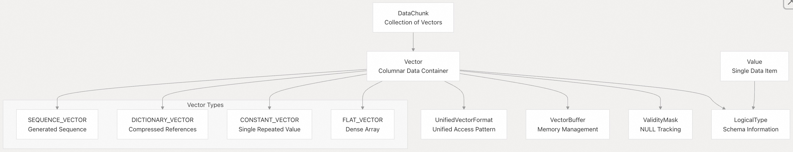
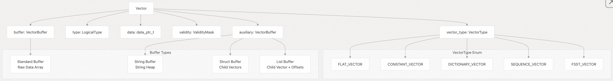
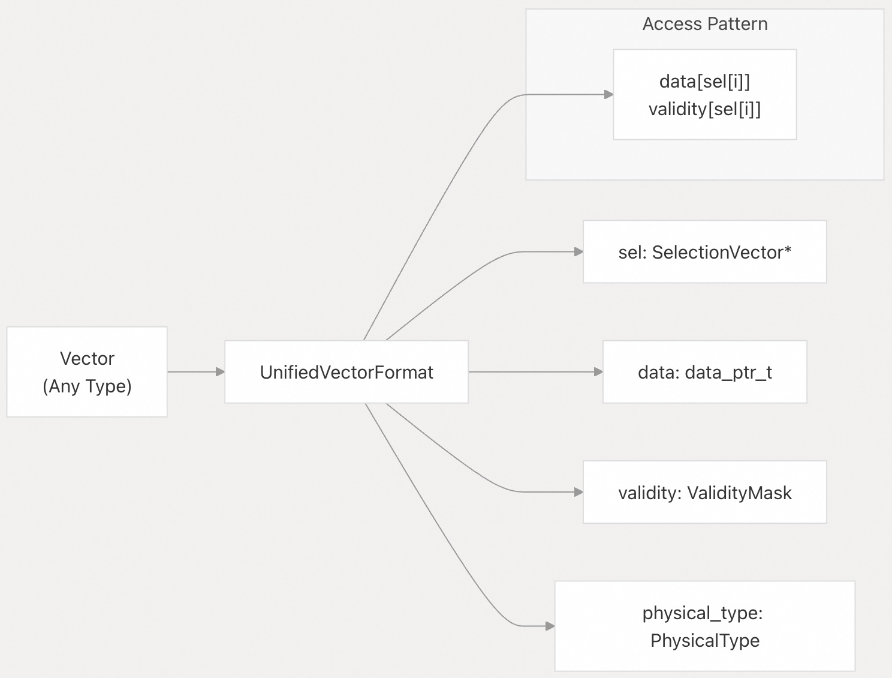
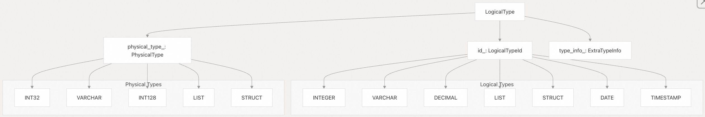
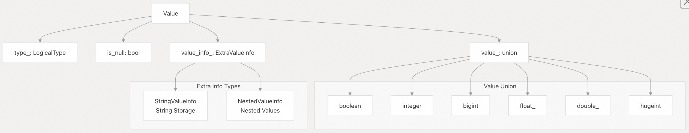
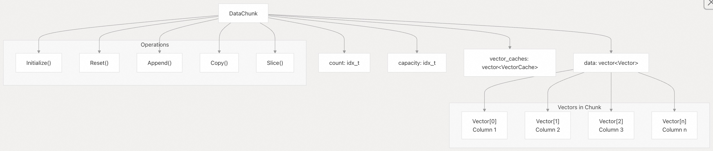
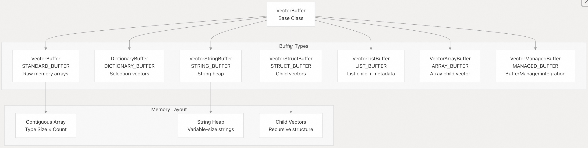
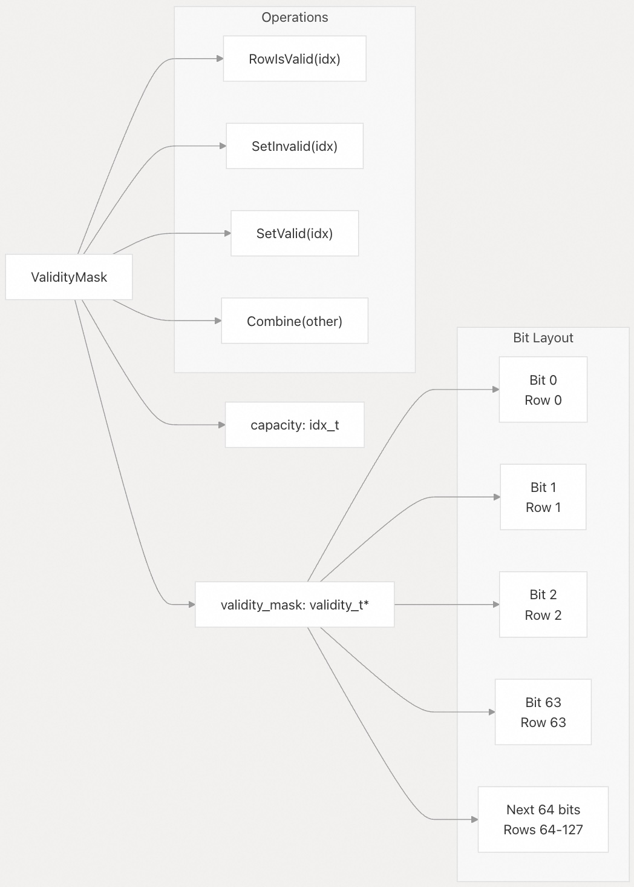

## DuckDB 源码学习: 1 概述  
  
### 作者  
digoal  
  
### 日期  
2025-10-22  
  
### 标签  
DuckDB , 源码学习  
  
----  
  
## 背景   
本文介绍 DuckDB 核心系统的架构概览及其相互作用。内容涵盖基础数据结构、扩展机制、类型系统以及构成 DuckDB 分析型数据库引擎基础的数据处理流水线。    
  
内容聚焦于主要子系统的高层组织结构，包括向量化数据处理、可扩展架构和类型系统。  
  
## 高层架构    
DuckDB 的架构围绕若干关键子系统组织而成，这些子系统协同工作，提供一个高性能的分析型数据库引擎：    
  
    
  
**源文件**：    
- [`src/common/types/vector.cpp`（第1–100行）](https://github.com/duckdb/duckdb/blob/05a2403c/src/common/types/vector.cpp#L1-L100)  
- [`src/include/duckdb/main/extension_entries.hpp`（第1–50行）](https://github.com/duckdb/duckdb/blob/05a2403c/src/include/duckdb/main/extension_entries.hpp#L1-L50)  
- [`src/main/extension/extension_helper.cpp`（第1–100行）](https://github.com/duckdb/duckdb/blob/05a2403c/src/main/extension/extension_helper.cpp#L1-L100)  
  
## 核心数据结构    
DuckDB 处理引擎的基础由四个主要数据结构组成，它们共同支持高效的列式处理：  
- 1、`Vector` - 代表同一类型数据列的核心结构  
- 2、`DataChunkVector` - 表示具有一致基数(记录条数)的一批 `Vector` 对象的容器, (每个 `Vector` 代表一列, 多个 `Vector` 组合成 row .)  
- 3、`ValidityMask` - bit vector, 使用 bitsets 有效跟踪 NULL 值  
- 4、`SelectionVector` - 切片向量的索引向量，改变其长度和条目的顺序 `header_base.hpp.template:422-427`  
  
这些结构在 DuckDB 的向量化执行模型中协同工作，其中操作一次性处理数据块（通常为 STANDARD_VECTOR_SIZE = 1024 个值），而不是逐行处理。    
- **Vector** 保存实际的列数据，具有特定的 **LogicalType**（逻辑类型）和内部 **VectorType**（向量类型）；    
- **DataChunk** 将多个 Vector 组合在一起，用于表示一批行(row)数据；    
- **ValidityMask** 高效地记录哪些值为 NULL；    
- **SelectionVector** 则支持高效的过滤和重排序操作，而无需复制数据。  
  
### 向量系统（Vector System）    
`Vector` 类是 DuckDB 中列式数据处理的基本单元。它表示具有特定 `LogicalType`（逻辑类型）的一列值，并支持多种内部表示形式。    
  
类似瓦片: [《PostgreSQL 向量化执行插件(瓦片式实现-vops) 10x提速OLAP》](../201702/20170225_01.md)    
  
    
  
**源文件**：    
- [`src/common/types/vector.cpp`（第60–100行）](https://github.com/duckdb/duckdb/blob/05a2403c/src/common/types/vector.cpp#L60-L100)  
- [`src/include/duckdb/common/types/vector.hpp`（第124–200行）](https://github.com/duckdb/duckdb/blob/05a2403c/src/include/duckdb/common/types/vector.hpp#L124-L200)  
  
### 数据块处理（DataChunk Processing）    
`DataChunk` 表示一组向量，构成用于处理的一批行数据。它是查询执行流水线中数据流动的主要单位。    
  
类似一批行(row)对应的多个列(column)的瓦片组成的block: [《PostgreSQL 向量化执行插件(瓦片式实现-vops) 10x提速OLAP》](../201702/20170225_01.md)    
  
    
  
**源文件**：    
- [`src/common/types/data_chunk.cpp`（第22–100行）](https://github.com/duckdb/duckdb/blob/05a2403c/src/common/types/data_chunk.cpp#L22-L100)  
- [`src/include/duckdb/common/types/data_chunk.hpp`（第25–80行）](https://github.com/duckdb/duckdb/blob/05a2403c/src/include/duckdb/common/types/data_chunk.hpp#L25-L80)  
  
## 扩展系统架构    
DuckDB 的可扩展性建立在一个全面的扩展系统之上，支持静态链接和动态加载两种扩展方式：  
  
### 扩展管理    
  
    
  
**源文件**：    
- [`src/main/extension/extension_helper.cpp`（第102–150行）](https://github.com/duckdb/duckdb/blob/05a2403c/src/main/extension/extension_helper.cpp#L102-L150)  
- [`src/main/extension/extension_install.cpp`（第145–200行）](https://github.com/duckdb/duckdb/blob/05a2403c/src/main/extension/extension_install.cpp#L145-L200)  
- [`src/main/extension/extension_load.cpp`（第25–100行）](https://github.com/duckdb/duckdb/blob/05a2403c/src/main/extension/extension_load.cpp#L25-L100)  
  
### 内置扩展    
DuckDB 包含多个核心扩展，提供关键功能：  
  
| 扩展名称 | 用途 | 链接状态宏 |  
|----------|------|------------|  
| `core_functions` | 核心函数库 | `DUCKDB_EXTENSION_CORE_FUNCTIONS_LINKED` |  
| `parquet` | Parquet 文件支持 | `DUCKDB_EXTENSION_PARQUET_LINKED` |  
| `icu` | 时区/排序规则支持 | `DUCKDB_EXTENSION_ICU_LINKED` |  
| `json` | JSON 操作支持 | `DUCKDB_EXTENSION_JSON_LINKED` |  
| `httpfs` | HTTP 文件系统支持 | `DUCKDB_EXTENSION_HTTPFS_LINKED` |  
  
**源文件**：  
- [`src/main/extension/extension_helper.cpp`（第102–128行）](https://github.com/duckdb/duckdb/blob/05a2403c/src/main/extension/extension_helper.cpp#L102-L128)  
  
## 类型系统与类型转换    
DuckDB 的类型系统围绕 `LogicalType` 类构建，该类提供丰富的类型信息，并支持复杂的嵌套类型：  
- 1. **STRUCT** - 结构体类型,包含命名字段的复合类型    
- 2. **LIST** - 列表类型,包含相同类型元素的可变长度数组    
- 3. **MAP** - 映射类型,键值对的集合    
- 4. **UNION** - 联合类型,可以存储多种类型之一的值    
- 5. **ARRAY** - 数组类型,固定长度的同类型元素集合    
  
这些嵌套类型在 C API 中都有对应的创建函数, 并且在 `LogicalTypeId` 枚举中被归类为 `COMPOSITE` 类型。   
  
`LogicalType` 类提供了 `IsNested()` 方法来检测类型是否为嵌套类型, 该方法检查物理类型是否为 `STRUCT`、`LIST` 或 `ARRAY`。    
  
每种嵌套类型都有专门的辅助类来访问其子类型信息, 例如 `StructType`、`ListType`、`MapType`、`UnionType` 和 `ArrayType`。 这些类型可以递归嵌套, 创建复杂的数据结构。  
  
### 类型层级    
    
  
**源文件**：    
- [`src/common/types.cpp`（第57–165行）](https://github.com/duckdb/duckdb/blob/05a2403c/src/common/types.cpp#L57-L165)  
- [`src/common/operator/cast_operators.cpp`（第35–50行）](https://github.com/duckdb/duckdb/blob/05a2403c/src/common/operator/cast_operators.cpp#L35-L50)  
- [`src/common/vector_operations/vector_cast.cpp`（第9–25行）](https://github.com/duckdb/duckdb/blob/05a2403c/src/common/vector_operations/vector_cast.cpp#L9-L25)  
  
### 值系统（Value System）    
`Value` 类表示单个标量值，支持 DuckDB 中的所有类型。    
  
    
  
**源文件**：    
- [`src/common/types/value.cpp`（第125–200行）](https://github.com/duckdb/duckdb/blob/05a2403c/src/common/types/value.cpp#L125-L200)  
- [`src/include/duckdb/common/types/value.hpp`（第32–100行）](https://github.com/duckdb/duckdb/blob/05a2403c/src/include/duckdb/common/types/value.hpp#L32-L100)  
  
## 数据处理流水线    
DuckDB 通过一个向量化流水线处理数据，数据以批处理形式在各个操作符之间流动.  
  
### 查询执行流程    
  
    
  
**源文件**：    
- [`src/common/types/data_chunk.cpp`（第142–180行）](https://github.com/duckdb/duckdb/blob/05a2403c/src/common/types/data_chunk.cpp#L142-L180)  
- [`src/common/vector_operations/vector_copy.cpp`（第15–50行）](https://github.com/duckdb/duckdb/blob/05a2403c/src/common/vector_operations/vector_copy.cpp#L15-L50)  
  
## 配置与构建系统    
DuckDB 的构建系统通过 CMake 配置，支持树内（in-tree）和树外（out-of-tree）扩展(extension).  
  
### 树内扩展 (In-tree Extensions)  
  
树内扩展是位于 DuckDB 主代码仓库中的扩展。这些扩展被认为是 DuckDB 的基础功能, 或者与 DuckDB 核心代码紧密耦合, 以至于 DuckDB 的变更可能经常破坏它们。  
  
**主要特点:**  
- 代码位于 `extension/` 目录下  
- 可以静态链接到 DuckDB 可执行文件中  
- 由 DuckDB 团队直接维护  
- 配置文件位于 `.github/config/in_tree_extensions.cmake`    
  
**示例扩展:**  
核心的树内扩展包括 `parquet`、`icu`、`json`、`httpfs` 等。  
  
### 树外扩展 (Out-of-tree Extensions, OOTEs)  
  
树外扩展位于 DuckDB 主仓库之外的独立代码仓库中。  
  
**两种类型:**  
  
1\. **DuckDB 管理的 OOTEs**: 通过 DuckDB 的 CI 系统分发, 使用 DuckDB 的签名密钥签名, 由 DuckDB 团队维护。例如 `sqlite_scanner` 和 `postgres_scanner`。配置在 `.github/config/out_of_tree_extensions.cmake` 。  
  
2\. **外部 OOTEs**: 不依赖 DuckDB CI, 在自己的仓库中运行 CI/CD。维护者负责测试、分发和保持扩展更新。  
  
**主要优势:**  
- 保持 DuckDB 核心代码库更小、更简洁    
- 便于处理许可证问题    
- 独立的开发和发布周期   
  
### 构建配置  
  
两种扩展类型在底层使用相同的构建方式, 都通过 DuckDB 的根 `CMakeLists.txt` 文件构建。  
  
**加载方式:**  
  
树外扩展可以通过多种方式加载:  
- 从 GitHub 仓库直接安装    
- 从自定义路径加载    
- 自动从 `extension_external` 目录加载    
  
**安装模式:**  
  
系统通过 `ExtensionInstallMode` 枚举跟踪扩展的安装方式:  
- `REPOSITORY`: 从仓库 URL 安装    
- `CUSTOM_PATH`: 从自定义路径安装    
- `STATICALLY_LINKED`: 静态链接(通常用于树内扩展)   
  
DuckDB 的扩展系统设计灵活,允许扩展既可以静态链接到二进制文件中, 也可以动态加载。构建系统通过 CMake 配置文件统一管理, 支持通过 `DONT_LINK` 参数控制是否静态链接 。树外扩展还支持自动应用补丁以处理兼容性问题。  
  
### 扩展构建配置 (Extension Build Configuration)  
  
    
  
**源文件**：    
- [`.github/config/out_of_tree_extensions.cmake`（第1–34行）](https://github.com/duckdb/duckdb/blob/05a2403c/.github/config/out_of_tree_extensions.cmake#L1-L34)  
- [`src/main/extension/CMakeLists.txt`（第1–50行）](https://github.com/duckdb/duckdb/blob/05a2403c/src/main/extension/CMakeLists.txt#L1-L50)  
- [`scripts/generate_extensions_function.py`（第1–100行）](https://github.com/duckdb/duckdb/blob/05a2403c/scripts/generate_extensions_function.py#L1-L100)  
  
该构建系统会自动生成扩展注册代码，并管理扩展之间的依赖关系，从而在保持模块化架构的同时，尽可能通过静态链接维持高性能。  
       
#### [期望 PostgreSQL|开源PolarDB 增加什么功能?](https://github.com/digoal/blog/issues/76 "269ac3d1c492e938c0191101c7238216")
  
  
#### [PolarDB 开源数据库](https://openpolardb.com/home "57258f76c37864c6e6d23383d05714ea")
  
  
#### [PolarDB 学习图谱](https://www.aliyun.com/database/openpolardb/activity "8642f60e04ed0c814bf9cb9677976bd4")
  
  
#### [PostgreSQL 解决方案集合](../201706/20170601_02.md "40cff096e9ed7122c512b35d8561d9c8")
  
  
#### [德哥 / digoal's Github - 公益是一辈子的事.](https://github.com/digoal/blog/blob/master/README.md "22709685feb7cab07d30f30387f0a9ae")
  
  
#### [About 德哥](https://github.com/digoal/blog/blob/master/me/readme.md "a37735981e7704886ffd590565582dd0")
  
  

  
