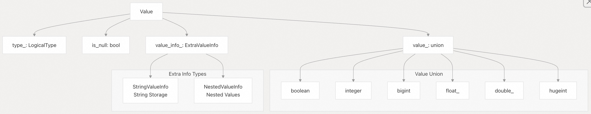
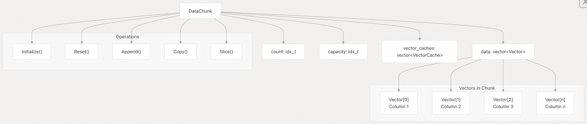
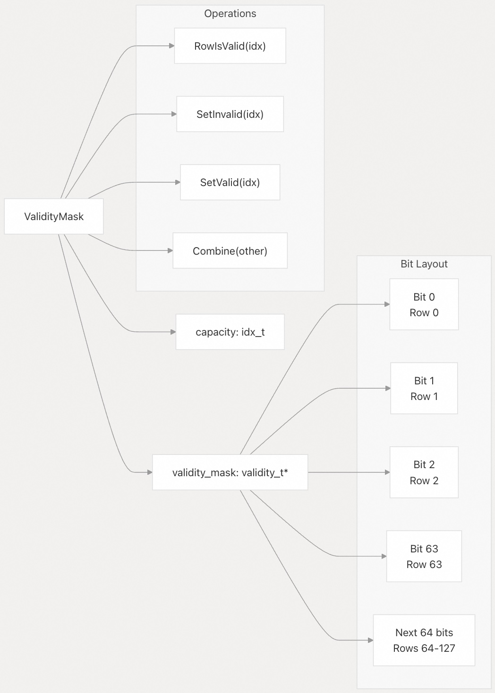

## DuckDB 源码学习: 2 核心数据结构   
    
### 作者    
digoal    
    
### 日期    
2025-10-22    
    
### 标签    
DuckDB , 源码学习    
    
----    
    
## 背景   
本文涵盖 DuckDB 中支持高效列式数据处理的基础数据结构。这些结构构成了查询执行引擎的基础，为查询处理过程中数据的表示、操作和存储提供了核心抽象。  
  
## 架构概览    
DuckDB 的数据处理基于列式架构，数据在系统中以称为 `DataChunk` 的批次形式流动，每个 `DataChunk` 包含多个 `Vector`，每个 `Vector` 表示一列数据。  
  
### 核心数据结构关系    
  
  
来源：    
- [`src/include/duckdb/common/types/vector.hpp`](https://github.com/duckdb/duckdb/blob/05a2403c/src/include/duckdb/common/types/vector.hpp#L124-L312)  
- [`src/include/duckdb/common/types/data_chunk.hpp`](https://github.com/duckdb/duckdb/blob/05a2403c/src/include/duckdb/common/types/data_chunk.hpp#L43-L59)    
- [`src/include/duckdb/common/types/value.hpp`](https://github.com/duckdb/duckdb/blob/05a2403c/src/include/duckdb/common/types/value.hpp#L32-L84)  
  
## 向量（Vector）系统    
`Vector` 类是 DuckDB 中用于列式处理的主要数据结构。它表示具有特定类型的一列数据，并为不同使用场景提供多种存储布局。  
  
### Vector 实现架构    
  
  
来源：    
- [`src/include/duckdb/common/types/vector.hpp`](https://github.com/duckdb/duckdb/blob/05a2403c/src/include/duckdb/common/types/vector.hpp#L294-L312)    
- [`src/common/types/vector.cpp`](https://github.com/duckdb/duckdb/blob/05a2403c/src/common/types/vector.cpp#L60-L101)  
  
### Vector 类型与存储布局    
DuckDB 使用不同的向量类型来优化存储和访问模式：  
  
| Vector 类型 | 描述 | 使用场景 | 内存布局 |  
|-------------|------|----------|----------|  
| `FLAT_VECTOR` | 值的密集数组 | 默认存储、随机访问 | 连续内存数组 |  
| `CONSTANT_VECTOR` | 单个值重复多次 | 常量表达式、字面量 | 单个值 + 计数 |  
| `DICTIONARY_VECTOR` | 选择向量 + 子向量 | 压缩重复值 | 选择索引 + 子向量 |  
| `SEQUENCE_VECTOR` | 生成的等差数列 | 行号、范围 | 起始值 + 步长 |  
| `FSST_VECTOR` | 字符串压缩 | 压缩字符串存储 | FSST 符号表 + 压缩字符串 |  
  
来源：    
- [`src/include/duckdb/common/enums/vector_type.hpp`](https://github.com/duckdb/duckdb/blob/05a2403c/src/include/duckdb/common/enums/vector_type.hpp)    
- [`src/common/types/vector.cpp`](https://github.com/duckdb/duckdb/blob/05a2403c/src/common/types/vector.cpp#L950-L1051)  
  
### 统一向量格式(UnifiedVectorFormat)    
`UnifiedVectorFormat` 为高效访问不同类型的向量提供了统一接口。    
  
  
  
来源：    
- [`src/include/duckdb/common/types/vector.hpp`](https://github.com/duckdb/duckdb/blob/05a2403c/src/include/duckdb/common/types/vector.hpp#L29-L74)    
- [`src/common/types/vector.cpp`](https://github.com/duckdb/duckdb/blob/05a2403c/src/common/types/vector.cpp#L32-L58)  
  
## 类型系统    
DuckDB 的类型系统提供两级类型抽象：`LogicalType` 用于模式层(schema-level)类型，`PhysicalType` 用于存储表示。  
  
### 类型层次结构    
  
  
来源：    
- [`src/include/duckdb/common/types.hpp`](https://github.com/duckdb/duckdb/blob/05a2403c/src/include/duckdb/common/types.hpp#L250-L458)    
- [`src/common/types.cpp`](https://github.com/duckdb/duckdb/blob/05a2403c/src/common/types.cpp#L57-L165)  
  
### 类型大小与对齐    
```cpp  
// 物理类型的字节大小  
idx_t GetTypeIdSize(PhysicalType type) {  
    switch (type) {  
    case PhysicalType::BOOL: return sizeof(bool);  
    case PhysicalType::INT8: return sizeof(int8_t);  
    case PhysicalType::INT16: return sizeof(int16_t);  
    case PhysicalType::INT32: return sizeof(int32_t);  
    case PhysicalType::INT64: return sizeof(int64_t);  
    case PhysicalType::VARCHAR: return sizeof(string_t);  
    // ...  
    }  
}  
```  
  
来源：    
- [`src/common/types.cpp`](https://github.com/duckdb/duckdb/blob/05a2403c/src/common/types.cpp#L307-L349)  
  
## 值（Value）系统    
`Value` 类表示可以存储在向量中或用于表达式的单个数据项。  
  
### Value 架构    
  
  
来源：    
- [`src/include/duckdb/common/types/value.hpp`](https://github.com/duckdb/duckdb/blob/05a2403c/src/include/duckdb/common/types/value.hpp#L32-L84)    
- [`src/common/types/value.cpp`](https://github.com/duckdb/duckdb/blob/05a2403c/src/common/types/value.cpp#L37-L121)  
  
### Value 的构造与类型安全    
`Value` 类提供类型安全的构造函数和静态工厂方法：  
  
| 构造函数/方法 | 类型 | 用途 |  
|---------------|------|------|  
| `Value::BOOLEAN(bool)` | `BOOLEAN` | 布尔值 |  
| `Value::INTEGER(int32_t)` | `INTEGER` | 32 位整数 |  
| `Value::VARCHAR(string)` | `VARCHAR` | 字符串值 |  
| `Value::DECIMAL(val, width, scale)` | `DECIMAL` | 十进制数值 |  
| `Value::LIST(child_type, values)` | `LIST` | 列表结构 |  
| `Value::STRUCT(type, values)` | `STRUCT` | 结构体值 |  
  
来源：    
- [`src/common/types/value.cpp`](https://github.com/duckdb/duckdb/blob/05a2403c/src/common/types/value.cpp#L436-L795)  
  
## 数据块（DataChunk）    
`DataChunk` 表示一组向量，构成表的一个水平切片，支持高效的批处理。  
  
在 DuckDB 中, 一个 `DataChunk` 中的多个 `Vector` 代表**不同的列**, 而不是同一列的数据。   
  
`DataChunk` 是 DuckDB 执行引擎使用的中间表示, 它有效地表示关系的一个子集。它持有一组长度相同的向量。   
  
具体来说:   
- `DataChunk` 包含一个 `vector<Vector> data` 成员变量, 存储所有列的向量  
- 每个 `Vector` 对应表中的一列数据   
- `ColumnCount()` 方法返回 `data.size()`, 即向量的数量, 也就是列数    
  
每个 `Vector` 内部存储的是该列的多行数据(通常最多 `STANDARD_VECTOR_SIZE` 行, 默认为 2048)。所以 `DataChunk` 的结构是列式存储: 横向是不同的列(多个 `Vector`), 纵向是同一列的多行数据(单个 `Vector` 内部)。   
  
### DataChunk 结构    
  
  
来源：    
- [`src/include/duckdb/common/types/data_chunk.hpp`](https://github.com/duckdb/duckdb/blob/05a2403c/src/include/duckdb/common/types/data_chunk.hpp#L43-L118)    
- [`src/common/types/data_chunk.cpp`](https://github.com/duckdb/duckdb/blob/05a2403c/src/common/types/data_chunk.cpp#L22-L26)  
  
### DataChunk 操作    
操作 DataChunk 的关键方法：  
  
| 操作 | 用途 | 实现位置 |  
|------|------|----------|  
| `Initialize()` | 按类型分配向量 | [`src/common/types/data_chunk.cpp`](https://github.com/duckdb/duckdb/blob/05a2403c/src/common/types/data_chunk.cpp#L40-L74) |  
| `Reset()` | 清空数据，复用内存 | [`src/common/types/data_chunk.cpp`](https://github.com/duckdb/duckdb/blob/05a2403c/src/common/types/data_chunk.cpp#L85-L97) |  
| `Copy()` | 深拷贝到另一个 chunk | [`src/common/types/data_chunk.cpp`](https://github.com/duckdb/duckdb/blob/05a2403c/src/common/types/data_chunk.cpp#L142-L163) |  
| `Append()` | 从另一个 chunk 添加行 | [`src/common/types/data_chunk.cpp`](https://github.com/duckdb/duckdb/blob/05a2403c/src/common/types/data_chunk.cpp#L204-L232) |  
| `Slice()` | 通过选择创建视图 | [`src/common/types/data_chunk.cpp`](https://github.com/duckdb/duckdb/blob/05a2403c/src/common/types/data_chunk.cpp#L304-L334) |  
  
来源：    
- [`src/common/types/data_chunk.cpp`](https://github.com/duckdb/duckdb/blob/05a2403c/src/common/types/data_chunk.cpp#L40-L334)  
  
## 内存管理    
DuckDB 通过 `VectorBuffer` 层次结构实现复杂的缓冲区管理系统。  
  
### VectorBuffer 类型    
  
  
来源：    
- [`src/include/duckdb/common/types/vector_buffer.hpp`](https://github.com/duckdb/duckdb/blob/05a2403c/src/include/duckdb/common/types/vector_buffer.hpp#L23-L34)    
- [`src/common/types/vector_buffer.cpp`](https://github.com/duckdb/duckdb/blob/05a2403c/src/common/types/vector_buffer.cpp#L10-L156)  
  
## NULL 值处理    
DuckDB 使用 `ValidityMask` 通过位运算高效追踪 NULL 值。  
  
### ValidityMask 实现    
  
  
来源：    
- [`src/include/duckdb/common/types/validity_mask.hpp`](https://github.com/duckdb/duckdb/blob/05a2403c/src/include/duckdb/common/types/validity_mask.hpp#L59-L142)    
- [`src/common/types/validity_mask.cpp`](https://github.com/duckdb/duckdb/blob/05a2403c/src/common/types/validity_mask.cpp#L9-L264)  
  
### Validity 操作  
```cpp  
// 检查某行是否有效（非 NULL）  
inline bool RowIsValid(idx_t row_idx) const {  
    return validity_mask[entry_idx] & (validity_t(1) << bit_idx);  
}  
// 将某行设为无效（NULL）  
inline void SetInvalid(idx_t row_idx) {  
    validity_mask[entry_idx] &= ~(validity_t(1) << bit_idx);  
}  
```  
  
来源：    
- [`src/include/duckdb/common/types/validity_mask.hpp`](https://github.com/duckdb/duckdb/blob/05a2403c/src/include/duckdb/common/types/validity_mask.hpp#L182-L210)  
  
## 类型转换    
DuckDB 通过 `TryCast` 操作和 `CastFunctionSet` 提供全面的类型转换系统。  
  
### 转换架构    
  
  
来源：    
- [`src/include/duckdb/common/operator/cast_operators.hpp`](https://github.com/duckdb/duckdb/blob/05a2403c/src/include/duckdb/common/operator/cast_operators.hpp#L31-L80)    
- [`src/common/operator/cast_operators.cpp`](https://github.com/duckdb/duckdb/blob/05a2403c/src/common/operator/cast_operators.cpp#L35-L52)    
- [`src/common/vector_operations/vector_cast.cpp`](https://github.com/duckdb/duckdb/blob/05a2403c/src/common/vector_operations/vector_cast.cpp#L9-L25)  
  
这些核心数据结构协同工作，为 DuckDB 提供高效的列式处理能力：`Vector` 存储带有类型信息的列式数据，`DataChunk` 对向量进行批处理，`Value` 表示单个数据项，而配套结构则负责内存管理、NULL 值处理和类型转换。  
  
    
#### [期望 PostgreSQL|开源PolarDB 增加什么功能?](https://github.com/digoal/blog/issues/76 "269ac3d1c492e938c0191101c7238216")
  
  
#### [PolarDB 开源数据库](https://openpolardb.com/home "57258f76c37864c6e6d23383d05714ea")
  
  
#### [PolarDB 学习图谱](https://www.aliyun.com/database/openpolardb/activity "8642f60e04ed0c814bf9cb9677976bd4")
  
  
#### [PostgreSQL 解决方案集合](../201706/20170601_02.md "40cff096e9ed7122c512b35d8561d9c8")
  
  
#### [德哥 / digoal's Github - 公益是一辈子的事.](https://github.com/digoal/blog/blob/master/README.md "22709685feb7cab07d30f30387f0a9ae")
  
  
#### [About 德哥](https://github.com/digoal/blog/blob/master/me/readme.md "a37735981e7704886ffd590565582dd0")
  
  

  
