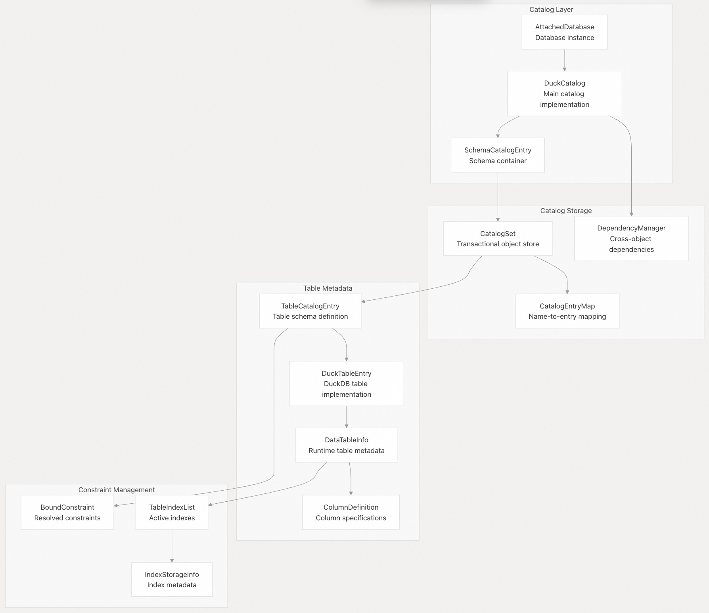

## DuckDB 源码学习: 3 存储引擎     
      
### 作者      
digoal      
      
### 日期      
2025-10-22      
      
### 标签      
DuckDB , 源码学习      
      
----      
      
## 背景     
存储引擎是 DuckDB 的核心数据管理子系统，负责物理数据存储、表操作、事务隔离以及元数据管理。它采用列式存储模型，支持 MVCC（多版本并发控制）事务，并通过向量化操作提供高性能的数据访问。  
  
## 架构概览  
  
DuckDB 的存储引擎围绕多个关键组件构建，这些组件协同工作，以实现高效的列式数据存储与检索。  
  
### 存储引擎组件  
  
  
来源文件：    
- [`src/storage/data_table.cpp`（第 49–71 行）](https://github.com/duckdb/duckdb/blob/05a2403c/src/storage/data_table.cpp#L49-L71)    
- [`src/storage/table/row_group_collection.cpp`（第 58–70 行）](https://github.com/duckdb/duckdb/blob/05a2403c/src/storage/table/row_group_collection.cpp#L58-L70)    
- [`src/storage/local_storage.cpp`（第 18–61 行）](https://github.com/duckdb/duckdb/blob/05a2403c/src/storage/local_storage.cpp#L18-L61)    
- [`src/catalog/catalog.cpp`（第 47–51 行）](https://github.com/duckdb/duckdb/blob/05a2403c/src/catalog/catalog.cpp#L47-L51)  
  
## 表存储组织结构  
  
存储引擎采用一种分层的列式结构来组织数据，专为高效执行分析型查询而设计。  
  
### 数据存储层级结构  
  
  
  
来源文件：    
- [`src/storage/table/row_group_collection.cpp`（第 127–133 行）](https://github.com/duckdb/duckdb/blob/05a2403c/src/storage/table/row_group_collection.cpp#L127-L133)    
- [`src/storage/table/row_group.cpp`（第 28–32 行）](https://github.com/duckdb/duckdb/blob/05a2403c/src/storage/table/row_group.cpp#L28-L32)    
- [`src/storage/table/column_data.cpp`（第 24–31 行）](https://github.com/duckdb/duckdb/blob/05a2403c/src/storage/table/column_data.cpp#L24-L31)    
- [`src/storage/table/standard_column_data.cpp`（第 14–18 行）](https://github.com/duckdb/duckdb/blob/05a2403c/src/storage/table/standard_column_data.cpp#L14-L18)  
  
### 行组（Row Group）管理  
  
行组是基本的存储单元，通常每个包含约 122,000 行数据。它们为并行处理和高效的列裁剪（column pruning）提供了粒度支持。  
  
| 组件 | 用途 | 关键方法 |  
|------|------|----------|  
| `RowGroupCollection` | 管理多个行组 | `InitializeScan()`, `Append()`, `NextParallelScan()` |  
| `RowGroup` | 存储约 122K 行的数据单元 | `Scan()`, `Fetch()`, `InitializeScan()` |  
| `RowGroupSegmentTree` | 以树形结构组织行组 | `GetSegment()`, `AppendSegment()` |  
  
来源文件：    
- [`src/storage/table/row_group_collection.cpp`（第 156–166 行）](https://github.com/duckdb/duckdb/blob/05a2403c/src/storage/table/row_group_collection.cpp#L156-L166)    
- [`src/storage/table/row_group.cpp`（第 135–137 行）](https://github.com/duckdb/duckdb/blob/05a2403c/src/storage/table/row_group.cpp#L135-L137)    
- [`src/storage/table/row_group_collection.cpp`（第 26–53 行）](https://github.com/duckdb/duckdb/blob/05a2403c/src/storage/table/row_group_collection.cpp#L26-L53)  
  
## 事务管理  
  
DuckDB 通过持久化存储与事务本地(transaction-local)存储相结合的方式实现 MVCC。  
  
### 事务存储架构  
  
  
  
来源文件：    
- [`src/storage/local_storage.cpp`（第 376–378 行）](https://github.com/duckdb/duckdb/blob/05a2403c/src/storage/local_storage.cpp#L376-L378)    
- [`src/storage/local_storage.cpp`（第 18–61 行）](https://github.com/duckdb/duckdb/blob/05a2403c/src/storage/local_storage.cpp#L18-L61)    
- [`src/storage/table/update_segment.cpp`（第 26–41 行）](https://github.com/duckdb/duckdb/blob/05a2403c/src/storage/table/update_segment.cpp#L26-L41)    
- [`src/storage/table/row_group.cpp`（第 704–753 行）](https://github.com/duckdb/duckdb/blob/05a2403c/src/storage/table/row_group.cpp#L704-L753)  
  
### 事务操作  
  
存储引擎支持四种主要的事务操作：  
  
| 操作 | 实现方式 | 对本地存储的影响 |  
|------|----------|------------------|  
| INSERT（插入） | `LocalAppend()` → `LocalTableStorage` | 在事务中创建新的行组 |  
| UPDATE（更新） | `Update()` → `UpdateSegment` | 为每列维护更新向量 |  
| DELETE（删除） | `Delete()` → `RowVersionManager` | 使用事务 ID 标记行已删除 |  
| SELECT（查询） | 带事务可见性的 `Scan()` | 根据事务时间戳进行过滤 |  
  
来源文件：    
- [`src/storage/data_table.cpp`（第 873–901 行）](https://github.com/duckdb/duckdb/blob/05a2403c/src/storage/data_table.cpp#L873-L901)    
- [`src/storage/local_storage.cpp`（第 544–557 行）](https://github.com/duckdb/duckdb/blob/05a2403c/src/storage/local_storage.cpp#L544-L557)    
- [`src/storage/local_storage.cpp`（第 559–567 行）](https://github.com/duckdb/duckdb/blob/05a2403c/src/storage/local_storage.cpp#L559-L567)    
- [`src/storage/table/row_group.cpp`（第 671–702 行）](https://github.com/duckdb/duckdb/blob/05a2403c/src/storage/table/row_group.cpp#L671-L702)  
  
## 目录(Catalog)与元数据管理  
  
目录(Catalog)系统使用事务化方法管理模式(Schema)信息、表定义及依赖关系。  
  
### 目录系统架构  
  
  
  
来源文件：    
- [`src/catalog/catalog.cpp`（第 47–51 行）](https://github.com/duckdb/duckdb/blob/05a2403c/src/catalog/catalog.cpp#L47-L51)    
- [`src/catalog/catalog_set.cpp`（第 85–90 行）](https://github.com/duckdb/duckdb/blob/05a2403c/src/catalog/catalog_set.cpp#L85-L90)    
- [`src/catalog/catalog_entry/schema_catalog_entry.cpp`（第 13–17 行）](https://github.com/duckdb/duckdb/blob/05a2403c/src/catalog/catalog_entry/schema_catalog_entry.cpp#L13-L17)    
- [`src/storage/table/data_table_info.hpp`（第 36–39 行）](https://github.com/duckdb/duckdb/blob/05a2403c/src/storage/table/data_table_info.hpp#L36-L39)  
  
### 目录(Catalog)事务  
  
目录(Catalog)操作是事务性的，并通过目录专用机制支持 MVCC：  
  
  
  
来源文件：    
- [`src/catalog/catalog_set.cpp`（第 195–210 行）](https://github.com/duckdb/duckdb/blob/05a2403c/src/catalog/catalog_set.cpp#L195-L210)    
- [`src/catalog/catalog_set.cpp`（第 306–375 行）](https://github.com/duckdb/duckdb/blob/05a2403c/src/catalog/catalog_set.cpp#L306-L375)    
- [`src/catalog/dependency_manager.cpp`（第 174–196 行）](https://github.com/duckdb/duckdb/blob/05a2403c/src/catalog/dependency_manager.cpp#L174-L196)    
- [`src/catalog/catalog_set.cpp`（第 377–391 行）](https://github.com/duckdb/duckdb/blob/05a2403c/src/catalog/catalog_set.cpp#L377-L391)  
  
## 索引管理  
  
DuckDB 使用自适应基数树（Adaptive Radix Trees, ART）作为其主要索引结构，并与事务系统集成。  
  
### 索引架构  
  
  
来源文件：    
- [`src/storage/table/data_table_info.hpp`（第 41–43 行）](https://github.com/duckdb/duckdb/blob/05a2403c/src/storage/table/data_table_info.hpp#L41-L43)    
- [`src/execution/index/art/art.hpp`](https://github.com/duckdb/duckdb/blob/05a2403c/src/execution/index/art/art.hpp)    
- [`src/storage/data_table.cpp`（第 688–766 行）](https://github.com/duckdb/duckdb/blob/05a2403c/src/storage/data_table.cpp#L688-L766)    
- [`src/execution/operator/persistent/physical_insert.cpp`（第 127–144 行）](https://github.com/duckdb/duckdb/blob/05a2403c/src/execution/operator/persistent/physical_insert.cpp#L127-L144)  
  
## 存储操作  
  
存储引擎提供完整的 CRUD（增删改查）操作，同时确保事务安全性和性能优化。  
  
### 插入操作流程  
  
  
  
来源文件：    
- [`src/storage/data_table.cpp`（第 848–858 行）](https://github.com/duckdb/duckdb/blob/05a2403c/src/storage/data_table.cpp#L848-L858)    
- [`src/storage/data_table.cpp`（第 873–894 行）](https://github.com/duckdb/duckdb/blob/05a2403c/src/storage/data_table.cpp#L873-L894)    
- [`src/storage/data_table.cpp`（第 904–906 行）](https://github.com/duckdb/duckdb/blob/05a2403c/src/storage/data_table.cpp#L904-L906)    
- [`src/storage/local_storage.cpp`（第 569–596 行）](https://github.com/duckdb/duckdb/blob/05a2403c/src/storage/local_storage.cpp#L569-L596)  
  
### 扫描操作流程  
  
  
  
来源文件：    
- [`src/storage/data_table.cpp`（第 243–250 行）](https://github.com/duckdb/duckdb/blob/05a2403c/src/storage/data_table.cpp#L243-L250)    
- [`src/storage/data_table.cpp`（第 303–313 行）](https://github.com/duckdb/duckdb/blob/05a2403c/src/storage/data_table.cpp#L303-L313)    
- [`src/storage/table/row_group.cpp`（第 508–669 行）](https://github.com/duckdb/duckdb/blob/05a2403c/src/storage/table/row_group.cpp#L508-L669)    
- [`src/storage/table/column_data.cpp`（第 192–234 行）](https://github.com/duckdb/duckdb/blob/05a2403c/src/storage/table/column_data.cpp#L192-L234)  
  
存储引擎的模块化设计确保了高效的数据访问模式，同时通过其事务管理系统保障 ACID 特性。从底层的列式存储到高层的目录(Catalog)管理，每个组件都无缝协同工作。  
      
#### [期望 PostgreSQL|开源PolarDB 增加什么功能?](https://github.com/digoal/blog/issues/76 "269ac3d1c492e938c0191101c7238216")
  
  
#### [PolarDB 开源数据库](https://openpolardb.com/home "57258f76c37864c6e6d23383d05714ea")
  
  
#### [PolarDB 学习图谱](https://www.aliyun.com/database/openpolardb/activity "8642f60e04ed0c814bf9cb9677976bd4")
  
  
#### [PostgreSQL 解决方案集合](../201706/20170601_02.md "40cff096e9ed7122c512b35d8561d9c8")
  
  
#### [德哥 / digoal's Github - 公益是一辈子的事.](https://github.com/digoal/blog/blob/master/README.md "22709685feb7cab07d30f30387f0a9ae")
  
  
#### [About 德哥](https://github.com/digoal/blog/blob/master/me/readme.md "a37735981e7704886ffd590565582dd0")
  
  

  
