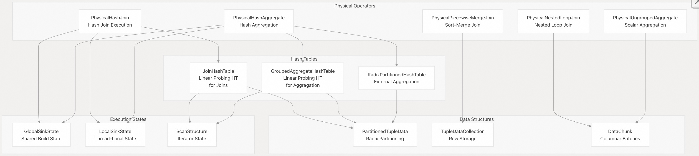
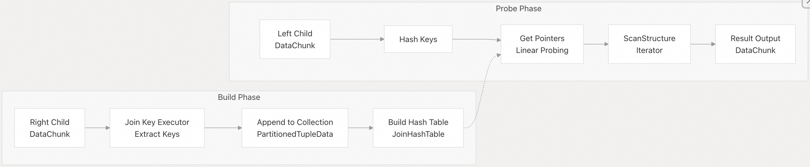
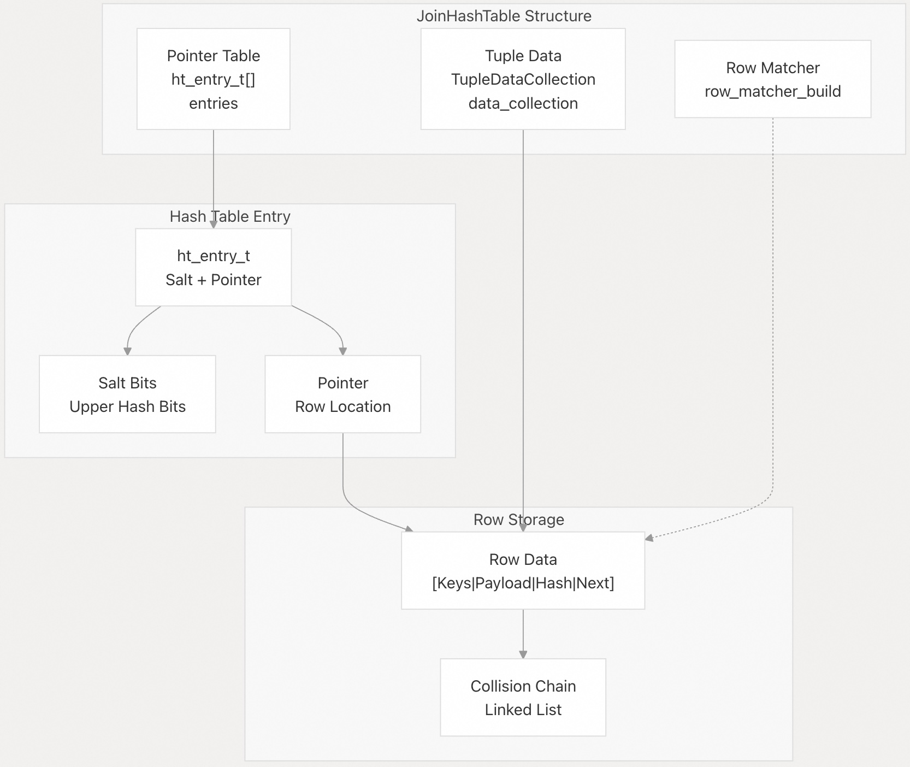
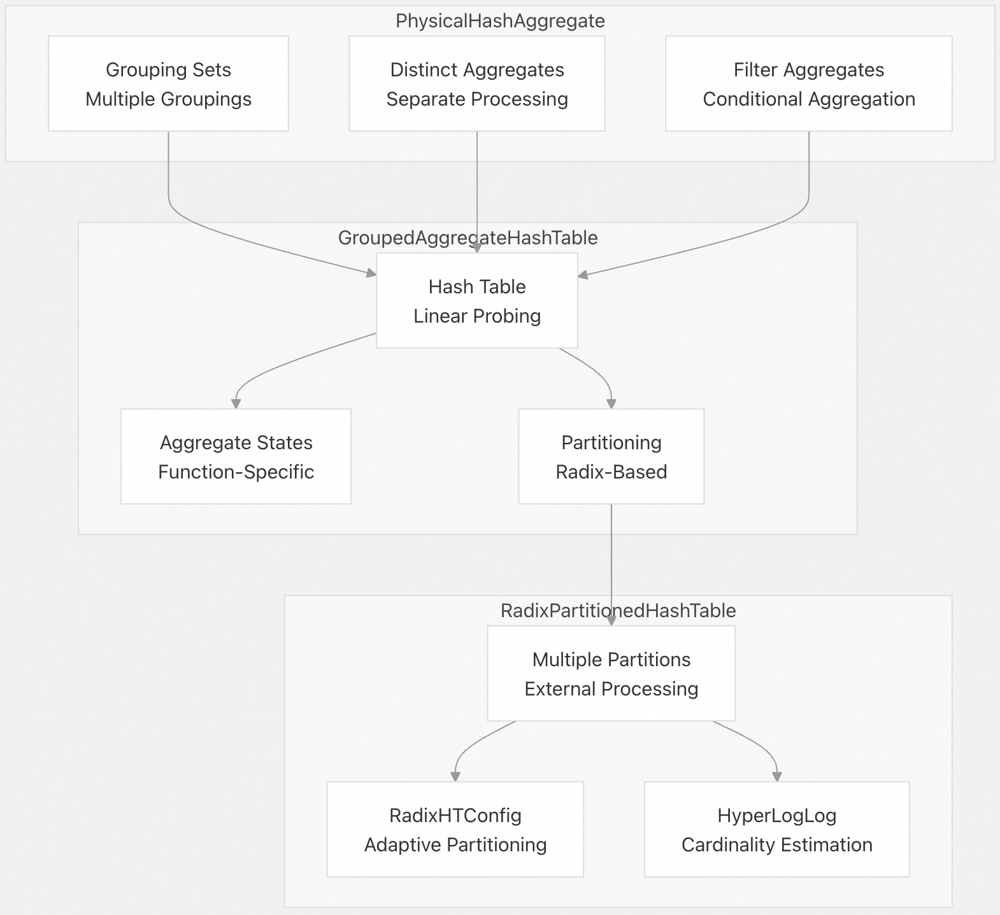
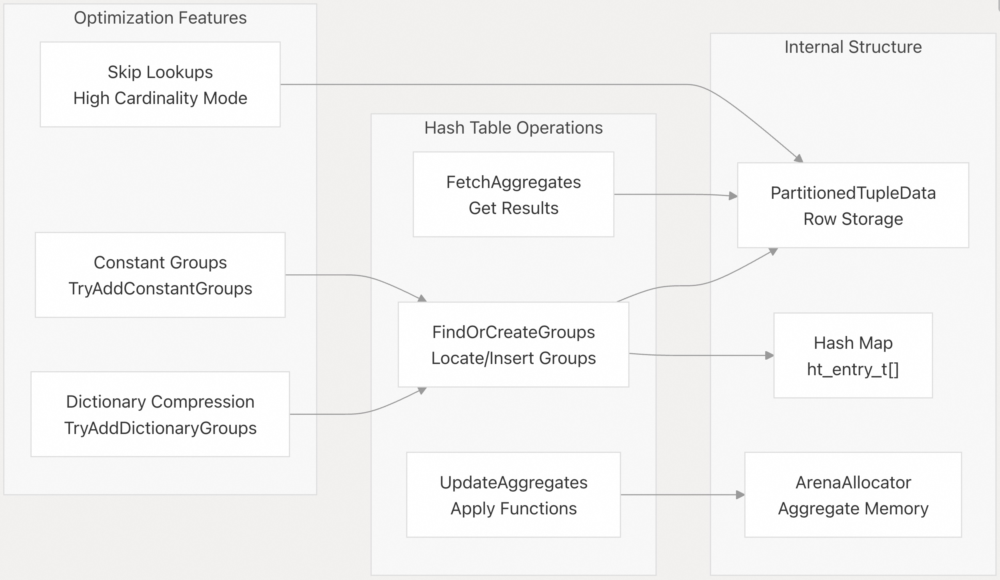
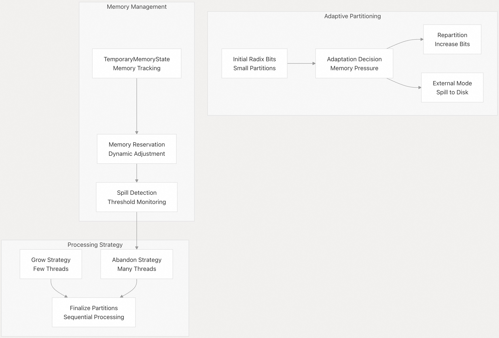
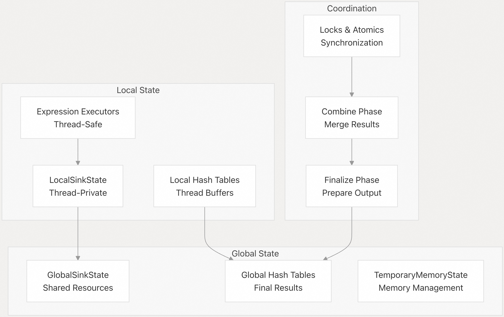

## DuckDB 源码学习: 4 查询执行（Query Execution）   
        
### 作者        
digoal        
        
### 日期        
2025-10-22        
        
### 标签        
DuckDB , 源码学习        
        
----        
        
## 背景       
本文介绍 DuckDB 的查询执行引擎，重点讲解用于高效处理查询的物理算子、哈希表和执行策略，涵盖连接（join）处理、聚合（aggregation）以及支持向量化和并行执行的底层数据结构。    
  
## 执行架构    
DuckDB 的查询执行引擎围绕**物理算子**构建，这些算子以**流水线方式**处理数据。执行模型将**构建/准备阶段**（sink）与**结果生成阶段**（source）分离，从而实现高效的并行处理。  
  
  
  
该执行引擎采用 **sink-source 模式**：算子首先累积数据（sink 阶段），然后生成结果（source 阶段）。这种设计支持流水线执行，并实现高效的内存管理。  
  
**源文件参考**：    
- [`src/execution/operator/join/physical_hash_join.cpp`（第 1–110 行）](https://github.com/duckdb/duckdb/blob/05a2403c/src/execution/operator/join/physical_hash_join.cpp#L1-L110)    
- [`src/execution/operator/aggregate/physical_hash_aggregate.cpp`（第 1–50 行）](https://github.com/duckdb/duckdb/blob/05a2403c/src/execution/operator/aggregate/physical_hash_aggregate.cpp#L1-L50)    
- [`src/execution/join_hashtable.cpp`（第 35–118 行）](https://github.com/duckdb/duckdb/blob/05a2403c/src/execution/join_hashtable.cpp#L35-L118)  
  
## 连接执行（Join Execution）    
DuckDB 实现了多种连接算法，其中**哈希连接**（Hash Join）是等值连接（equi-joins）的主要方法，其他连接类型则使用专门的算法。  
  
### 哈希连接处理    
  
  
`PhysicalHashJoin` 算子采用两阶段执行模型：  
  
1、**Sink 阶段**：基于右子节点构建哈希表    
- 使用 `ExpressionExecutor` 计算连接键    
- 在外部连接（external joins）中，将数据存储在 `PartitionedTupleData` 中    
- 构建采用线性探测（linear probing）的 `JoinHashTable`  
  
2、**Source 阶段**：使用左子节点数据进行探测（probe）    
- 对探测键进行哈希并执行线性探测    
- 通过 `ScanStructure` 遍历所有匹配的元组    
- 处理不同类型的连接（INNER、OUTER、SEMI、ANTI、MARK）  
  
**源文件参考**：    
- [`src/execution/operator/join/physical_hash_join.cpp`（第 324–346 行）](https://github.com/duckdb/duckdb/blob/05a2403c/src/execution/operator/join/physical_hash_join.cpp#L324-L346)    
- [`src/execution/join_hashtable.cpp`（第 376–449 行）](https://github.com/duckdb/duckdb/blob/05a2403c/src/execution/join_hashtable.cpp#L376-L449)  
- [`src/execution/join_hashtable.cpp`（第 812–831 行）](https://github.com/duckdb/duckdb/blob/05a2403c/src/execution/join_hashtable.cpp#L812-L831)  
  
### 连接哈希表实现    
`JoinHashTable` 使用**基于盐值**（salt-based）的线性探测来解决哈希冲突，以实现高性能：  
  
  
  
哈希表实现的关键特性包括：  
- **基于盐值的探测**（Salt-based probing）：利用哈希值的高位比特，在线性探测过程中减少冲突    
- **行链式存储**（Row chaining）：通过元组数据中的链表结构解决哈希冲突    
- **向量化匹配**（Vectorized matching）：使用 `RowMatcher` 实现高效的键比较    
- **外部连接支持**（External join support）：当内存受限时，将数据溢出（spill）到 `PartitionedTupleData` 中  
  
**源文件参考**：    
- [`src/execution/join_hashtable.cpp`（第 142–161 行）](https://github.com/duckdb/duckdb/blob/05a2403c/src/execution/join_hashtable.cpp#L142-L161)  
- [`src/execution/join_hashtable.cpp`（第 329–345 行）](https://github.com/duckdb/duckdb/blob/05a2403c/src/execution/join_hashtable.cpp#L329-L345)    
- [`src/include/duckdb/execution/join_hashtable.hpp`（第 58–97 行）](https://github.com/duckdb/duckdb/blob/05a2403c/src/include/duckdb/execution/join_hashtable.hpp#L58-L97)  
  
### 支持的连接类型    
不同连接类型通过 `ScanStructure` 中的专用扫描逻辑处理：  
  
| 连接类型 | 实现方式 | 关键方法 |  
|----------|----------|----------|  
| INNER（内连接） | 标准哈希探测并构建结果 | `NextInnerJoin` |  
| LEFT/OUTER（左/外连接） | 标记未匹配的元组，输出 NULL | `NextLeftJoin` |  
| SEMI（半连接） | 返回有匹配的左表元组 | `NextSemiJoin` |  
| ANTI（反连接） | 返回无匹配的左表元组 | `NextAntiJoin` |  
| MARK（标记连接） | 添加布尔列表示是否匹配 | `NextMarkJoin` |  
| SINGLE（单匹配连接） | 确保每个探测元组最多匹配一次 | `NextSingleJoin` |  
  
**源文件参考**：    
- [`src/execution/join_hashtable.cpp`（第 841–874 行）](https://github.com/duckdb/duckdb/blob/05a2403c/src/execution/join_hashtable.cpp#L841-L874)    
- [`src/include/duckdb/execution/join_hashtable.hpp`（第 106–119 行）](https://github.com/duckdb/duckdb/blob/05a2403c/src/include/duckdb/execution/join_hashtable.hpp#L106-L119)  
  
## 聚合执行（Aggregation Execution）    
DuckDB 使用带**基数分区**（radix partitioning）的哈希表实现复杂的聚合操作，支持对外部大数据集进行处理。  
  
### 哈希聚合架构    
  
  
聚合系统支持：  
- **多分组集**（Multiple grouping sets）：用于 CUBE/ROLLUP 操作    
- **去重聚合**（Distinct aggregates）：使用独立的哈希表处理    
- **条件聚合**（Filtered aggregates）：通过条件求值实现    
- **外部聚合**（External aggregation）：通过基数分区（radix partitioning）实现  
  
**源文件参考**：    
- [`src/execution/operator/aggregate/physical_hash_aggregate.cpp`（第 113–188 行）](https://github.com/duckdb/duckdb/blob/05a2403c/src/execution/operator/aggregate/physical_hash_aggregate.cpp#L113-L188)    
- [`src/execution/aggregate_hashtable.cpp`（第 19–73 行）](https://github.com/duckdb/duckdb/blob/05a2403c/src/execution/aggregate_hashtable.cpp#L19-L73)    
- [`src/execution/radix_partitioned_hashtable.cpp`（第 16–42 行）](https://github.com/duckdb/duckdb/blob/05a2403c/src/execution/radix_partitioned_hashtable.cpp#L16-L42)  
  
### 聚合哈希表实现    
`GroupedAggregateHashTable` 提供高效的分组聚合功能：  
  
  
  
关键优化包括：  
- **字典压缩**（Dictionary compression）：针对字典编码(dictionary-encoded)的向量进行优化    
- **常量分组处理**（Constant group handling）：对单值分组(single-value groups)进行特殊处理    
- **查找跳过**（Lookup skipping）：在高基数数据(high-cardinality data, 唯一值过多)场景下绕过哈希表    
- **内存池分配**（Arena allocation）：对聚合状态实现高效的内存管理  
  
**源文件参考**：    
- [`src/execution/aggregate_hashtable.cpp`（第 360–460 行）](https://github.com/duckdb/duckdb/blob/05a2403c/src/execution/aggregate_hashtable.cpp#L360-L460)  
- [`src/execution/aggregate_hashtable.cpp`（第 520–583 行）](https://github.com/duckdb/duckdb/blob/05a2403c/src/execution/aggregate_hashtable.cpp#L520-L583)  
- [`src/execution/aggregate_hashtable.cpp`（第 642–703 行）](https://github.com/duckdb/duckdb/blob/05a2403c/src/execution/aggregate_hashtable.cpp#L642-L703)  
  
### 外部聚合（External Aggregation）    
`RadixPartitionedHashTable` 支持对大型数据集进行外部聚合：  
  
  
  
系统会根据以下因素动态调整分区策略：  
- **线程数量**（Thread count）：采用“扩展”（grow）或“放弃”（abandon）策略    
- **内存压力**（Memory pressure）：进行动态重分区（Dynamic repartitioning）    
- **数据特征**（Data characteristics）：使用 HyperLogLog 进行基数(唯一值个数)估算    
- **行宽度**（Row width）：对宽行减少分区数量  
  
**源文件参考**：    
- [`src/execution/radix_partitioned_hashtable.cpp`（第 102–153 行）](https://github.com/duckdb/duckdb/blob/05a2403c/src/execution/radix_partitioned_hashtable.cpp#L102-L153)  
- [`src/execution/radix_partitioned_hashtable.cpp`（第 397–503 行）](https://github.com/duckdb/duckdb/blob/05a2403c/src/execution/radix_partitioned_hashtable.cpp#L397-L503)  
- [`src/execution/radix_partitioned_hashtable.cpp`（第 505–543 行）](https://github.com/duckdb/duckdb/blob/05a2403c/src/execution/radix_partitioned_hashtable.cpp#L505-L543)  
  
## 并行执行（Parallel Execution）    
DuckDB 的执行引擎专为并行处理设计，并配有精细的状态管理机制。  
  
### 状态管理    
  
  
并行执行模型采用以下机制：  
- **全局/本地状态分离**（Global/Local state separation）：线程安全的共享状态配合线程私有的工作区    
- **无锁操作**（Lock-free operation）：使用原子操作和精细的同步机制    
- **合并阶段**（Combine phase）：将各线程本地的结果合并到全局状态中    
- **内存协同管理**（Memory coordination）：在线程间共享并协调内存管理  
  
**源文件参考**：    
- [`src/execution/operator/join/physical_hash_join.cpp`（第 134–206 行）](https://github.com/duckdb/duckdb/blob/05a2403c/src/execution/operator/join/physical_hash_join.cpp#L134-L206)    
- [`src/execution/operator/aggregate/physical_hash_aggregate.cpp`（第 193–249 行）](https://github.com/duckdb/duckdb/blob/05a2403c/src/execution/operator/aggregate/physical_hash_aggregate.cpp#L193-L249)    
- [`src/execution/radix_partitioned_hashtable.cpp`（第 155–202 行）](https://github.com/duckdb/duckdb/blob/05a2403c/src/execution/radix_partitioned_hashtable.cpp#L155-L202)  
  
### 任务并行（Task Parallelism）    
物理算子对 CPU 密集型操作采用基于任务的并行机制：  
- **哈希表初始化**（Hash table initialization）：并行地对指针表执行 memset    
- **哈希表收尾**（Hash table finalization）：跨数据块(chunks)并行执行哈希插入    
- **分区处理**（Partition processing）：并行处理基数分区（radix partitions）    
- **结果扫描**（Result scanning）：并行遍历哈希表的各个分区  
  
**源文件参考**：    
- [`src/execution/operator/join/physical_hash_join.cpp`（第 460–597 行）](https://github.com/duckdb/duckdb/blob/05a2403c/src/execution/operator/join/physical_hash_join.cpp#L460-L597)    
- [`src/execution/radix_partitioned_hashtable.cpp`（第 580–720 行）](https://github.com/duckdb/duckdb/blob/05a2403c/src/execution/radix_partitioned_hashtable.cpp#L580-L720)  
     
## Radix Partitioning 深度解析  
  
### 核心概念  
Radix partitioning 通过哈希值的高位比特将数据分配到不同分区。关键参数包括:  
- **radix_bits**: 使用的比特数, 决定分区数量 (2^radix_bits)  
- **MAX_RADIX_BITS**: 最大 12 位, 支持最多 4096 个分区  
- **Shift**: 从哈希值第 5 字节开始提取比特(跳过用作 salt 的低 16 位)  
- **Mask**: 用于提取相关比特的位掩码    
  
### 分区索引计算  
  
分区索引通过 `ApplyMask` 函数计算, 该函数应用位掩码并右移以获得 `0` 到 `NUM_PARTITIONS-1` 之间的值。 实际计算通过模板化的 `ComputePartitionIndicesFunctor` 执行, 支持向量化处理。   
  
### 两种实现  
  
#### RadixPartitionedColumnData  
  
用于列式数据分区。每个分区有独立的 allocator 和 buffer。   
  
#### RadixPartitionedTupleData    
  
用于行式数据分区, 主要用于聚合和连接。支持重分区操作, 可在运行时增加 radix bits。     
  
### 在聚合中的应用  
`RadixPartitionedHashTable` 使用 radix partitioning 实现外部聚合。   
  
#### 自适应分区策略  
系统根据线程数和内存压力动态调整 radix bits:    
- **初始值**: 基于线程数, 最多 4 bits  
- **最大值**: 根据线程数和行宽度, 最多 8 bits    
- **行宽阈值**: 宽行(≥64 字节)减少分区数以降低缓存未命中  
  
#### 重分区触发  
当分区填充超过阈值时触发重分区:    
- 检查每个分区的行大小是否超过 `BLOCK_FILL_FACTOR * block_size` (50%)  
- 增加 `REPARTITION_RADIX_BITS` (2 bits), 将分区数翻 4 倍  
- 通过 `Repartition` 方法重新分配数据  
  
#### 外部模式  
内存不足时切换到外部模式:    
- 调用 `SetRadixBitsToExternal()` 将 radix bits 设为最大值(8)  
- 数据溢出到 `abandoned_data` 中的 `RadixPartitionedTupleData`  
- 哈希表被 abandon 并重置  
  
### 在连接中的应用  
`JoinHashTable` 也使用 radix partitioning 处理大型连接。重分区逻辑根据最大分区大小和哈希表容量计算需要增加的 bits, 目标是将分区大小降至 `max_ht_size / 4`。    
  
外部连接通过 `PrepareExternalFinalize` 选择合适的分区组合进行处理,按大小排序分区以优化 I/O。    
  
### Notes  
  
Radix partitioning 是 DuckDB 实现外部算法的关键技术, 通过动态调整分区数量在内存和性能之间取得平衡。系统使用 HyperLogLog 估计基数(唯一值个数)来指导自适应决策。重分区时, 旧分区的数据会根据新的 radix bits 重新分配到多个新分区中, 这通过 `RepartitionFinalizeStates` 方法协调。    
    
#### [期望 PostgreSQL|开源PolarDB 增加什么功能?](https://github.com/digoal/blog/issues/76 "269ac3d1c492e938c0191101c7238216")
  
  
#### [PolarDB 开源数据库](https://openpolardb.com/home "57258f76c37864c6e6d23383d05714ea")
  
  
#### [PolarDB 学习图谱](https://www.aliyun.com/database/openpolardb/activity "8642f60e04ed0c814bf9cb9677976bd4")
  
  
#### [PostgreSQL 解决方案集合](../201706/20170601_02.md "40cff096e9ed7122c512b35d8561d9c8")
  
  
#### [德哥 / digoal's Github - 公益是一辈子的事.](https://github.com/digoal/blog/blob/master/README.md "22709685feb7cab07d30f30387f0a9ae")
  
  
#### [About 德哥](https://github.com/digoal/blog/blob/master/me/readme.md "a37735981e7704886ffd590565582dd0")
  
  

  
