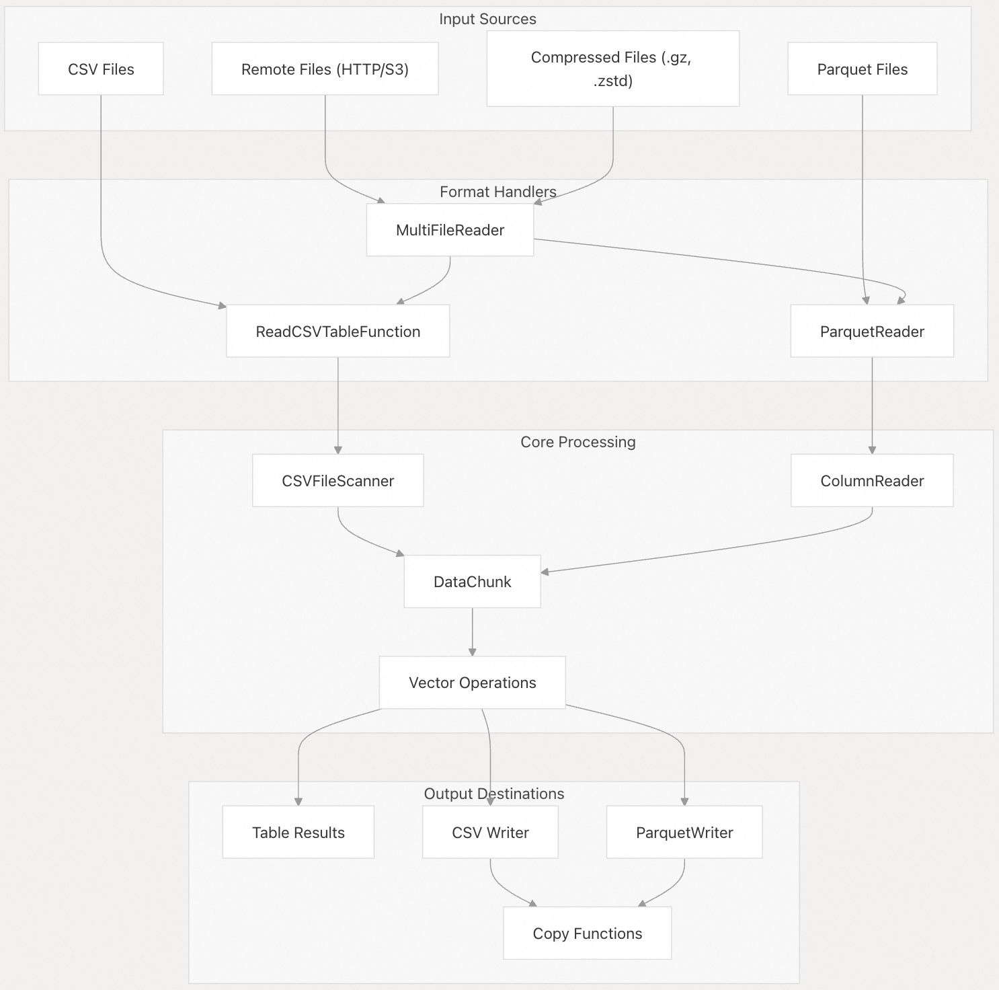
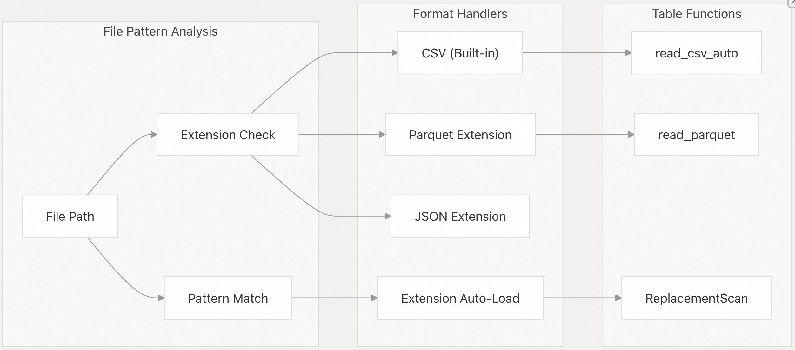
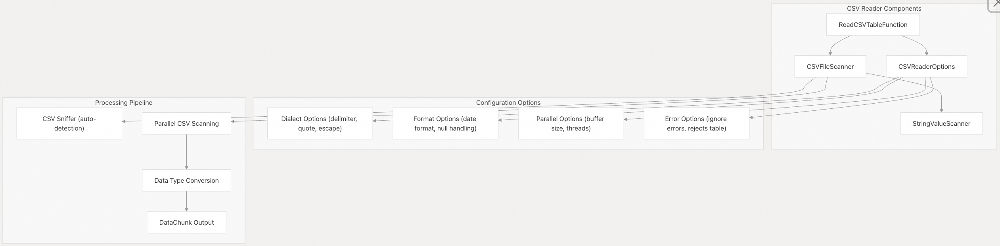
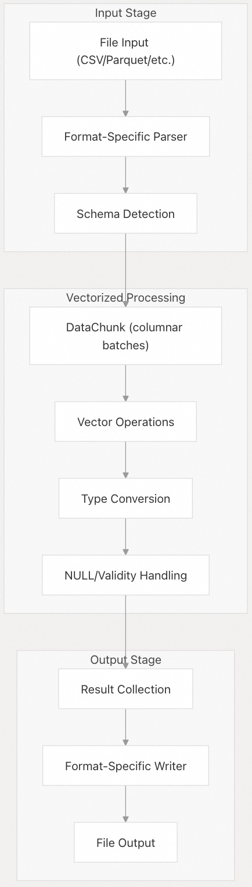
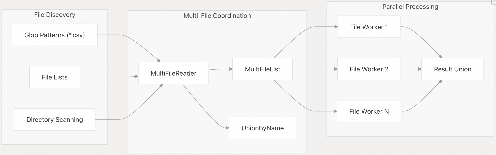
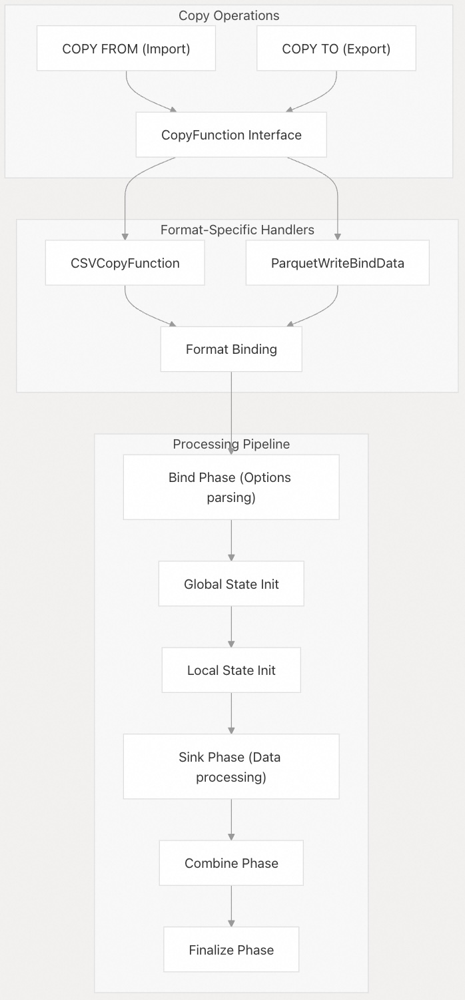
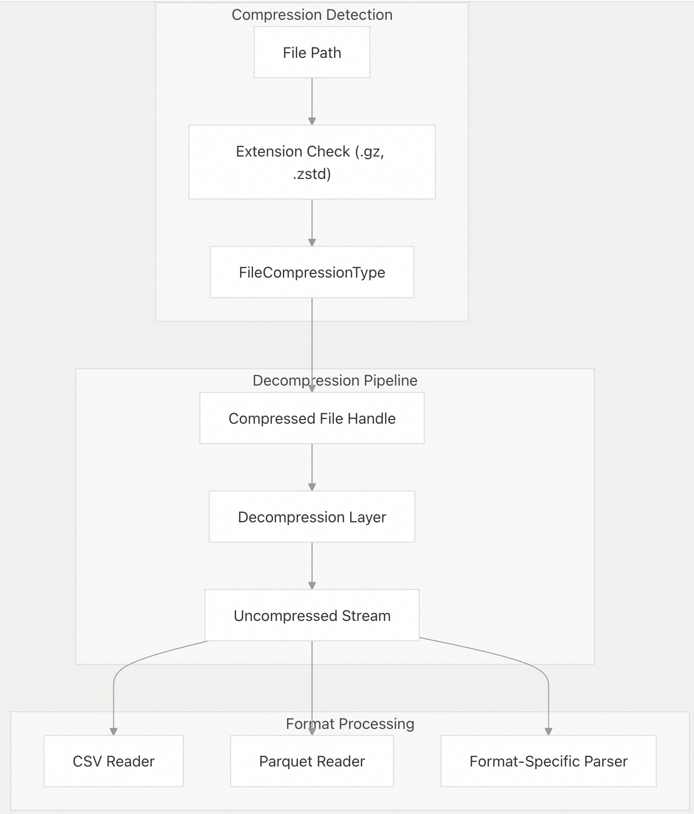
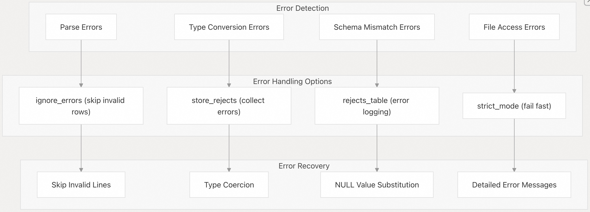
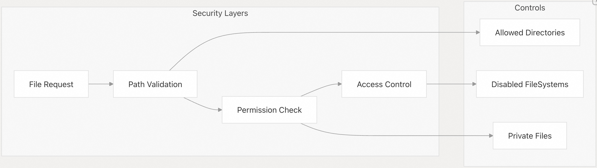

## DuckDB 源码学习: 5 数据导入与导出    
          
### 作者          
digoal          
          
### 日期          
2025-10-22          
          
### 标签          
DuckDB , 源码学习          
          
----          
          
## 背景         
本文介绍 DuckDB 对多种文件格式的全面支持及其强大的数据摄取能力。DuckDB 为多种文件格式提供了高性能的读取器和写入器，内置对 CSV 处理的支持，并通过扩展系统支持 Parquet 等格式。其架构强调向量化处理、并行执行，以及与 DuckDB 查询引擎的无缝集成。  
  
## 架构概览  
  
DuckDB 的数据导入/导出系统通过内置功能与可扩展的格式处理器相结合，提供全面的文件格式支持。该系统专为高性能向量化处理和并行执行而设计。  
  
### 数据导入/导出流水线(Data Import/Export Pipeline)  
  
  
  
相关源文件：  
- [`src/function/table/read_csv.cpp`（第 142–160 行）](https://github.com/duckdb/duckdb/blob/05a2403c/src/function/table/read_csv.cpp#L142-L160)  
- [`extension/parquet/parquet_reader.cpp`（第 836–872 行）](https://github.com/duckdb/duckdb/blob/05a2403c/extension/parquet/parquet_reader.cpp#L836-L872)  
- [`extension/parquet/parquet_extension.cpp`（第 55–103 行）](https://github.com/duckdb/duckdb/blob/05a2403c/extension/parquet/parquet_extension.cpp#L55-L103)  
  
### 核心导入/导出组件  
  
数据导入/导出系统围绕以下几个关键组件构建：  
  
| 组件 | 用途 | 关键类 |  
|------|------|--------|  
| CSV 处理 | 内置 CSV 读写功能 | `ReadCSVTableFunction`, `CSVCopyFunction`, `CSVFileScanner` |  
| Parquet 集成 | 通过扩展支持列式文件格式 | `ParquetReader`, `ParquetWriter`, `ColumnReader` |  
| 多文件支持 | 支持文件模式、通配符及多个文件 | `MultiFileReader`, `MultiFileList` |  
| 格式自动检测 | 自动检测文件格式并加载相应扩展 | `ReplacementScan`, `ExtensionHelper` |  
| 压缩支持 | 透明的压缩/解压缩处理 | `FileCompressionType`、压缩子系统 |  
  
相关源文件：  
- [`src/function/table/read_csv.cpp`（第 35–54 行）](https://github.com/duckdb/duckdb/blob/05a2403c/src/function/table/read_csv.cpp#L35-L54)  
- [`extension/parquet/parquet_reader.cpp`（第 144–175 行）](https://github.com/duckdb/duckdb/blob/05a2403c/extension/parquet/parquet_reader.cpp#L144-L175)  
- [`src/common/multi_file/multi_file_reader.cpp`（第 1–30 行）](https://github.com/duckdb/duckdb/blob/05a2403c/src/common/multi_file/multi_file_reader.cpp#L1-L30)  
  
## 文件格式支持  
  
### 格式检测与扩展加载(Format Detection and Extension Loading)  
  
DuckDB 会根据文件扩展名和模式自动检测文件格式，并加载相应的扩展：  
  
  
  
检测过程包括：  
- **扩展名匹配**：`.csv`、`.tsv` → CSV；`.parquet` → Parquet    
- **压缩格式检测**：`.gz`、`.zstd` 会被自动处理    
- **自动加载**：通过 `Catalog::TryAutoLoad` 按需加载扩展    
- **替换扫描（Replacement Scans）**：针对文件模式自动重写查询  
  
相关源文件：  
- [`src/function/table/read_csv.cpp`（第 162–190 行）](https://github.com/duckdb/duckdb/blob/05a2403c/src/function/table/read_csv.cpp#L162-L190)  
- [`extension/parquet/parquet_extension.cpp`（第 847–865 行）](https://github.com/duckdb/duckdb/blob/05a2403c/extension/parquet/parquet_extension.cpp#L847-L865)  
  
### 内置 CSV 支持  
  
CSV 处理内置于 DuckDB 核心中，提供丰富的配置选项：  
  
  
  
相关源文件：  
- [`src/function/table/read_csv.cpp`（第 56–99 行）](https://github.com/duckdb/duckdb/blob/05a2403c/src/function/table/read_csv.cpp#L56-L99)  
- [`src/execution/operator/csv_scanner/csv_file_scanner.cpp`（第 1–30 行）](https://github.com/duckdb/duckdb/blob/05a2403c/src/execution/operator/csv_scanner/csv_file_scanner.cpp#L1-L30)  
  
## 数据处理流水线(Data Processing Pipeline)  
  
### 向量化数据流(Vectorized Data Flow)  
  
导入/导出系统基于 DuckDB 的向量化执行模型构建：  
  
  
  
流水线中的关键组件包括：  
- **DataChunk**：列式数据批次（通常包含 2048 行）    
- **Vector**：带有有效性掩码（validity masks）的列数据，用于处理 NULL 值    
- **类型系统**：在文件格式与 SQL 类型之间自动进行类型转换    
- **并行处理**：多线程扫描与处理  
  
相关源文件：  
- [`src/common/types/data_chunk.cpp`（第 1–30 行）](https://github.com/duckdb/duckdb/blob/05a2403c/src/common/types/data_chunk.cpp#L1-L30)  
- [`src/common/types/vector.cpp`（第 1–30 行）](https://github.com/duckdb/duckdb/blob/05a2403c/src/common/types/vector.cpp#L1-L30)  
- [`extension/parquet/column_reader.cpp`（第 109–136 行）](https://github.com/duckdb/duckdb/blob/05a2403c/extension/parquet/column_reader.cpp#L109-L136)  
  
### 多文件处理  
  
DuckDB 通过 `MultiFileReader` 系统支持从多个文件及文件模式(patterns)中读取数据：  
  
  
  
相关源文件：  
- [`src/common/multi_file/multi_file_reader.cpp`（第 1–50 行）](https://github.com/duckdb/duckdb/blob/05a2403c/src/common/multi_file/multi_file_reader.cpp#L1-L50)  
- [`src/common/multi_file/union_by_name.cpp`（第 1–30 行）](https://github.com/duckdb/duckdb/blob/05a2403c/src/common/multi_file/union_by_name.cpp#L1-L30)  
  
## COPY 函数与导出  
  
### COPY 函数框架  
  
DuckDB 提供统一的 `COPY` 语句接口用于数据导入和导出：  
  
  
  
COPY 框架支持以下功能：  
- **并行导出**：多线程写入，并具备协调机制    
- **格式选项**：每种格式均提供丰富的配置选项    
- **流式处理**：可处理大型数据集，不受内存限制    
- **错误处理**：支持可配置的错误容忍度与报告机制  
  
相关源文件：  
- [`src/function/table/copy_csv.cpp`（第 173–209 行）](https://github.com/duckdb/duckdb/blob/05a2403c/src/function/table/copy_csv.cpp#L173-L209)  
- [`extension/parquet/parquet_extension.cpp`（第 296–447 行）](https://github.com/duckdb/duckdb/blob/05a2403c/extension/parquet/parquet_extension.cpp#L296-L447)  
  
### 导出配置  
  
每种格式都通过 COPY 接口提供丰富的配置选项：  
  
| 格式 | 关键选项 | 用途 |  
|------|----------|------|  
| CSV | `delimiter`, `quote`, `header`, `compression` | 控制 CSV 语法和输出格式 |  
| Parquet | `codec`, `row_group_size`, `compression_level` | 优化文件大小和性能 |  
| JSON | `format`, `records` | 控制 JSON 结构和格式化方式 |  
  
相关源文件：  
- [`src/function/table/copy_csv.cpp`（第 211–253 行）](https://github.com/duckdb/duckdb/blob/05a2403c/src/function/table/copy_csv.cpp#L211-L253)  
- [`extension/parquet/parquet_extension.cpp`（第 272–294 行）](https://github.com/duckdb/duckdb/blob/05a2403c/extension/parquet/parquet_extension.cpp#L272-L294)  
  
## 压缩与远程访问  
  
### 透明压缩支持  
  
DuckDB 在所有文件格式中提供透明的压缩支持：  
  
  
  
支持的压缩格式：  
- **GZIP（.gz）**：通过 miniz 提供内置支持    
- **ZSTD（.zstd）**：通过扩展提供支持    
- **自动检测**：基于文件扩展名自动识别压缩格式    
- **链式处理**：按“解压缩 → 格式解析 → 数据处理”的顺序进行流水线处理  
  
相关源文件：  
- [`src/common/virtual_file_system.cpp`（第 20–35 行）](https://github.com/duckdb/duckdb/blob/05a2403c/src/common/virtual_file_system.cpp#L20-L35)  
- [`extension/parquet/parquet_extension.cpp`（第 167–174 行）](https://github.com/duckdb/duckdb/blob/05a2403c/extension/parquet/parquet_extension.cpp#L167-L174)  
  
### 远程文件支持  
  
系统支持从远程位置读取文件：  
- **HTTP/HTTPS**：支持直接通过 URL 读取，并支持范围请求（range requests）    
- **S3**：通过 S3 扩展集成 AWS SDK 实现支持    
- **对象存储**：通过专用扩展支持 Azure Blob Storage 和 Google Cloud Storage（GCS）    
- **缓存**：可选对远程文件进行本地缓存  
  
相关源文件：  
- [`test/sql/copy/parquet/test_parquet_remote.test`（第 29–84 行）](https://github.com/duckdb/duckdb/blob/05a2403c/test/sql/copy/parquet/test_parquet_remote.test#L29-L84)  
  
## 错误处理与验证  
  
### 强大的错误处理机制  
  
DuckDB 的导入/导出系统包含全面的错误处理和数据验证功能：  
  
  
  
关键错误处理特性包括：  
- **可配置的容错性**：从严格验证到宽松解析，用户可按需调整    
- **错误收集**：详细记录解析过程中出现的问题    
- **恢复策略**：提供多种处理格式错误数据的方法    
- **性能优化**：支持在处理大文件时提前终止，避免不必要的开销  
  
相关源文件：  
- [`src/execution/operator/persistent/csv_rejects_table.cpp`（第 30–80 行）](https://github.com/duckdb/duckdb/blob/05a2403c/src/execution/operator/persistent/csv_rejects_table.cpp#L30-L80)  
- [`src/function/table/read_csv.cpp`（第 76–81 行）](https://github.com/duckdb/duckdb/blob/05a2403c/src/function/table/read_csv.cpp#L76-L81)  
  
### 性能优化  
  
系统包含多项性能优化策略：  
  
| 优化项 | 描述 | 实现方式 |  
|--------|------|----------|  
| 并行扫描 | 多线程文件处理 | 线程安全的扫描器与任务分发 |  
| 向量化处理 | SIMD 友好的列式操作 | 基于向量(Vector-based)的类型转换与验证 |  
| 内存管理 | 高效的缓冲区分配 | 共享缓冲池与流式处理 |  
| 格式特定调优 | 针对不同格式的优化 | 为 CSV 与 Parquet 特性定制的读取器 |  
  
相关源文件：  
- [`src/execution/operator/csv_scanner/string_value_scanner.cpp`（第 1–30 行）](https://github.com/duckdb/duckdb/blob/05a2403c/src/execution/operator/csv_scanner/string_value_scanner.cpp#L1-L30)  
- [`extension/parquet/column_reader.cpp`（第 187–207 行）](https://github.com/duckdb/duckdb/blob/05a2403c/extension/parquet/column_reader.cpp#L187-L207)  
  
## 配置与设置  
  
### 文件系统设置  
  
系统支持多种配置选项：  
  
| 设置项 | 用途 | 默认值 |  
|--------|------|--------|  
| `home_directory` | 覆盖用户家(home)目录 | 系统默认值 |  
| `enable_external_access` | 允许访问远程文件 | true |  
| `force_download` | 强制重新下载缓存文件 | false |  
| `http_timeout` | HTTP 请求超时时间 | 30000 毫秒 |  
  
相关源文件：  
- [`src/common/file_system.cpp`（第 347–363 行）](https://github.com/duckdb/duckdb/blob/05a2403c/src/common/file_system.cpp#L347-L363)  
- [`src/include/duckdb/common/file_opener.hpp`（第 35–49 行）](https://github.com/duckdb/duckdb/blob/05a2403c/src/include/duckdb/common/file_opener.hpp#L35-L49)  
  
### 安全与访问控制  
  
系统包含以下安全特性：  
- **路径验证**：防止访问允许目录之外的路径    
- **扩展控制**：可禁用特定的文件系统    
- **权限检查**：验证文件的访问权限    
- **私有文件检测**：检查文件是否具有安全的权限设置（如防止敏感文件被意外读取）  
  
  
  
相关源文件：  
- [`src/common/virtual_file_system.cpp`（第 195–217 行）](https://github.com/duckdb/duckdb/blob/05a2403c/src/common/virtual_file_system.cpp#L195-L217)  
- [`src/common/local_file_system.cpp`（第 282–300 行）](https://github.com/duckdb/duckdb/blob/05a2403c/src/common/local_file_system.cpp#L282-L300)  
      
#### [期望 PostgreSQL|开源PolarDB 增加什么功能?](https://github.com/digoal/blog/issues/76 "269ac3d1c492e938c0191101c7238216")
  
  
#### [PolarDB 开源数据库](https://openpolardb.com/home "57258f76c37864c6e6d23383d05714ea")
  
  
#### [PolarDB 学习图谱](https://www.aliyun.com/database/openpolardb/activity "8642f60e04ed0c814bf9cb9677976bd4")
  
  
#### [PostgreSQL 解决方案集合](../201706/20170601_02.md "40cff096e9ed7122c512b35d8561d9c8")
  
  
#### [德哥 / digoal's Github - 公益是一辈子的事.](https://github.com/digoal/blog/blob/master/README.md "22709685feb7cab07d30f30387f0a9ae")
  
  
#### [About 德哥](https://github.com/digoal/blog/blob/master/me/readme.md "a37735981e7704886ffd590565582dd0")
  
  

  
