## DuckDB 源码学习: 6 扩展系统(Extension System)      
            
### 作者            
digoal            
            
### 日期            
2025-10-22            
            
### 标签            
DuckDB , 源码学习            
            
----            
            
## 背景           
DuckDB 的扩展系统提供了一个完整的框架，允许通过可加载的库来扩展 DuckDB 的功能。该系统同时支持静态链接和动态加载的扩展，并具备自动安装、加载和管理的能力。扩展可以在不修改 DuckDB 核心代码的前提下，新增函数、数据类型、文件格式以及其他数据库功能。  
  
本文档涵盖扩展的架构、安装方式、加载机制以及开发模式。  
  
## 扩展架构  
  
### 扩展类型与 ABI（应用程序二进制接口）  
  
DuckDB 通过多种应用程序二进制接口（ABI, Application Binary Interfaces）支持扩展，每种 ABI 提供不同的兼容性保证：  
  
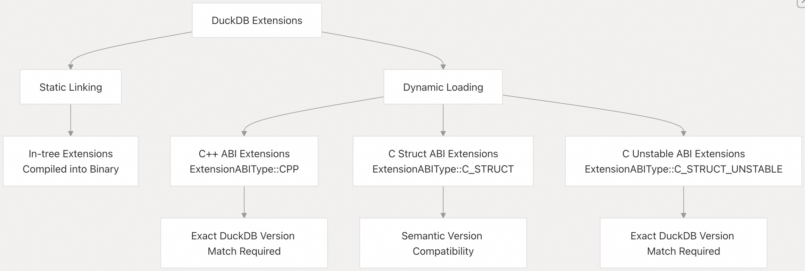  
  
**扩展 ABI 类型**    
  
来源：  
- [`src/include/duckdb/main/extension.hpp` 第 30-38 行](https://github.com/duckdb/duckdb/blob/05a2403c/src/include/duckdb/main/extension.hpp#L30-L38)  
- [`src/main/extension.cpp` 第 48-79 行](https://github.com/duckdb/duckdb/blob/05a2403c/src/main/extension.cpp#L48-L79)  
  
### 仓库(Repository)系统  
  
扩展通过一个分层的仓库系统进行分发：  
  
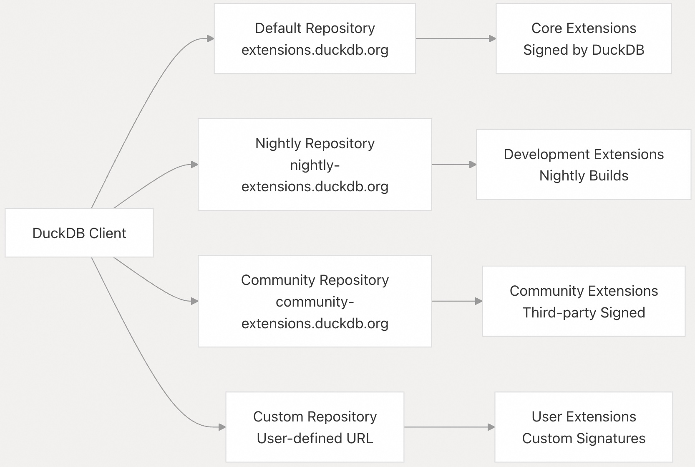  
  
**仓库配置**    
  
来源：  
- [`src/include/duckdb/main/extension_install_info.hpp` 第 56-67 行](https://github.com/duckdb/duckdb/blob/05a2403c/src/include/duckdb/main/extension_install_info.hpp#L56-L67)  
- [`src/main/extension_install_info.cpp` 第 17-45 行](https://github.com/duckdb/duckdb/blob/05a2403c/src/main/extension_install_info.cpp#L17-L45)  
  
## 扩展安装  
  
### 安装流程  
  
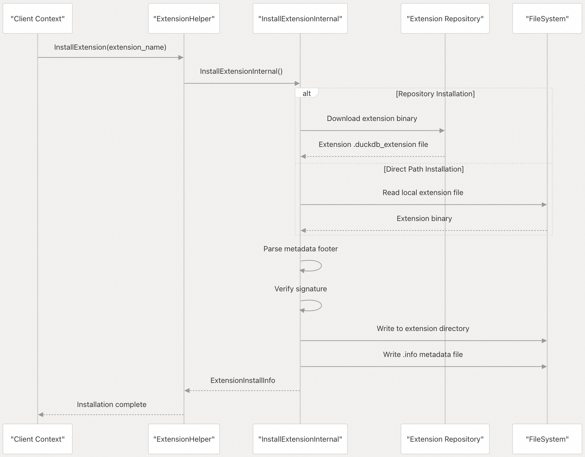  
  
**安装实现**    
  
来源：  
- [`src/main/extension/extension_install.cpp` 第 145-166 行](https://github.com/duckdb/duckdb/blob/05a2403c/src/main/extension/extension_install.cpp#L145-L166)  
- [`src/main/extension/extension_install.cpp` 第 476-547 行](https://github.com/duckdb/duckdb/blob/05a2403c/src/main/extension/extension_install.cpp#L476-L547)  
  
### 扩展元数据与签名验证  
  
每个扩展都包含一个带有签名信息的元数据尾部：  
  
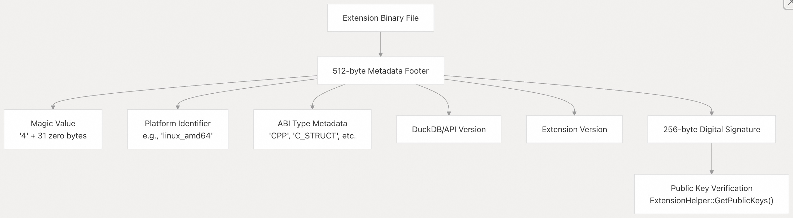  
  
**元数据解析与验证**    
  
来源：  
- [`src/main/extension/extension_load.cpp` 第 199-258 行](https://github.com/duckdb/duckdb/blob/05a2403c/src/main/extension/extension_load.cpp#L199-L258)  
- [`src/main/extension/extension_load.cpp` 第 260-311 行](https://github.com/duckdb/duckdb/blob/05a2403c/src/main/extension/extension_load.cpp#L260-L311)  
  
## 扩展加载(Loading)  
  
### 加载机制  
  
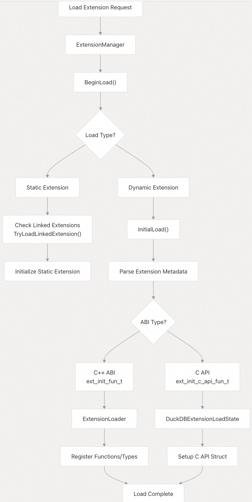  
  
**加载实现**    
  
来源：  
- [`src/main/extension/extension_load.cpp` 第 519-532 行](https://github.com/duckdb/duckdb/blob/05a2403c/src/main/extension/extension_load.cpp#L519-L532)  
- [`src/main/extension/extension_load.cpp` 第 534-590 行](https://github.com/duckdb/duckdb/blob/05a2403c/src/main/extension/extension_load.cpp#L534-L590)  
  
### 自动加载系统  
  
当引用某个函数时，DuckDB 可以自动安装并加载对应的扩展：  
  
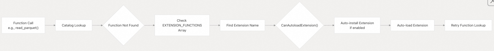  
  
**自动加载逻辑**    
  
来源：  
- [`src/main/extension/extension_helper.cpp` 第 209-227 行](https://github.com/duckdb/duckdb/blob/05a2403c/src/main/extension/extension_helper.cpp#L209-L227)  
- [`src/function/built_in_functions.cpp` 第 99-127 行](https://github.com/duckdb/duckdb/blob/05a2403c/src/function/built_in_functions.cpp#L99-L127)  
  
## 扩展开发  
  
### 树内（In-tree）与树外（Out-of-tree）扩展  
  
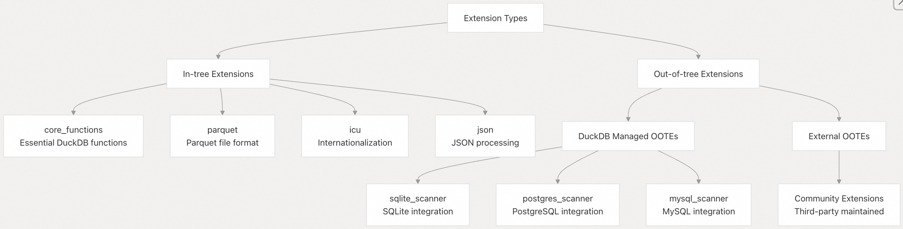  
  
**扩展配置**    
  
来源：  
- [`extension/extension_config.cmake` 第 10-13 行](https://github.com/duckdb/duckdb/blob/05a2403c/extension/extension_config.cmake#L10-L13)  
- [`.github/config/out_of_tree_extensions.cmake` 第 18-33 行](https://github.com/duckdb/duckdb/blob/05a2403c/.github/config/out_of_tree_extensions.cmake#L18-L33)  
  
### C API 扩展示例  
  
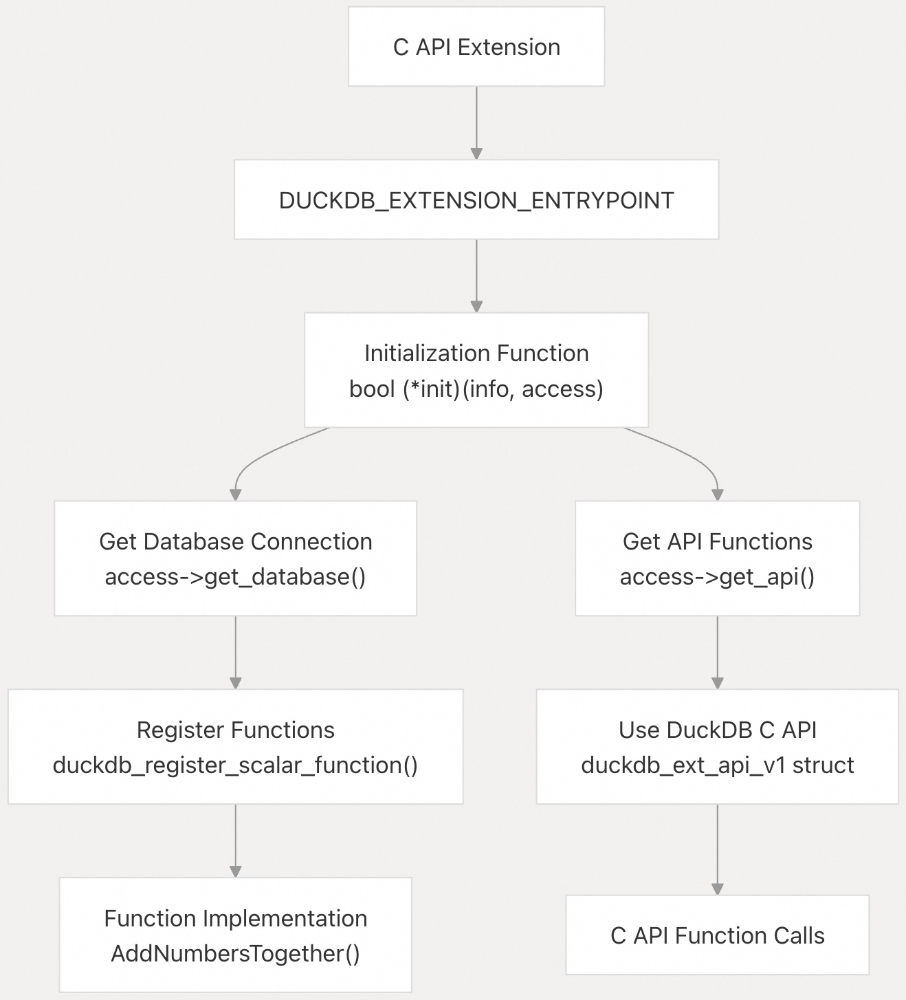  
  
**C API 扩展实现**    
  
来源：  
- [`extension/demo_capi/capi_demo.cpp` 第 4-24 行](https://github.com/duckdb/duckdb/blob/05a2403c/extension/demo_capi/capi_demo.cpp#L4-L24)  
- [`extension/demo_capi/add_numbers.cpp` 第 43-64 行](https://github.com/duckdb/duckdb/blob/05a2403c/extension/demo_capi/add_numbers.cpp#L43-L64)  
  
## 扩展注册表与函数映射  
  
### 扩展函数注册表  
  
DuckDB 维护一个完整的扩展函数注册表，用于自动加载(auto-loading)：  
  
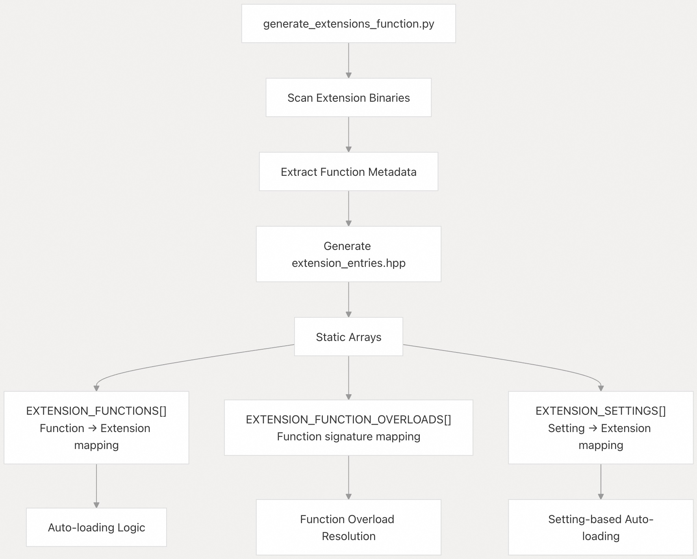  
  
**注册表生成**    
  
来源：  
- [`scripts/generate_extensions_function.py` 第 14-21 行](https://github.com/duckdb/duckdb/blob/05a2403c/scripts/generate_extensions_function.py#L14-L21)  
- [`src/include/duckdb/main/extension_entries.hpp` 第 42-100 行](https://github.com/duckdb/duckdb/blob/05a2403c/src/include/duckdb/main/extension_entries.hpp#L42-L100)  
  
### 扩展管理系统  
  
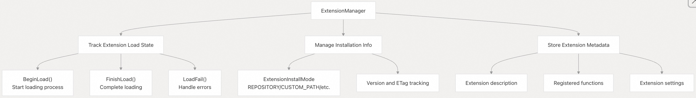  
  
**扩展管理**   
  
来源：  
- [`src/function/table/system/duckdb_extensions.cpp` 第 69-183 行](https://github.com/duckdb/duckdb/blob/05a2403c/src/function/table/system/duckdb_extensions.cpp#L69-L183)  
- [`src/main/extension/extension_helper.cpp` 第 258-331 行](https://github.com/duckdb/duckdb/blob/05a2403c/src/main/extension/extension_helper.cpp#L258-L331)  
  
## 构建(Build)系统集成  
  
### 扩展构建配置(Extension Build Configuration)  
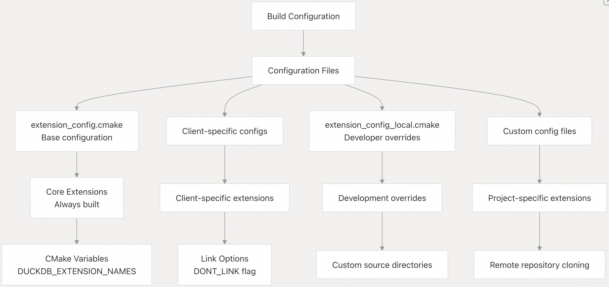  
  
**构建系统配置**    
  
来源：  
- [`extension/README.md` 第 56-84 行](https://github.com/duckdb/duckdb/blob/05a2403c/extension/README.md#L56-L84)  
- [`src/main/extension/CMakeLists.txt` 第 1-28 行](https://github.com/duckdb/duckdb/blob/05a2403c/src/main/extension/CMakeLists.txt#L1-L28)  
  
该扩展系统为 DuckDB 提供了一种灵活且安全的机制，用于扩展功能，同时通过自动安装和加载机制确保兼容性与易用性。  
      
#### [期望 PostgreSQL|开源PolarDB 增加什么功能?](https://github.com/digoal/blog/issues/76 "269ac3d1c492e938c0191101c7238216")
  
  
#### [PolarDB 开源数据库](https://openpolardb.com/home "57258f76c37864c6e6d23383d05714ea")
  
  
#### [PolarDB 学习图谱](https://www.aliyun.com/database/openpolardb/activity "8642f60e04ed0c814bf9cb9677976bd4")
  
  
#### [PostgreSQL 解决方案集合](../201706/20170601_02.md "40cff096e9ed7122c512b35d8561d9c8")
  
  
#### [德哥 / digoal's Github - 公益是一辈子的事.](https://github.com/digoal/blog/blob/master/README.md "22709685feb7cab07d30f30387f0a9ae")
  
  
#### [About 德哥](https://github.com/digoal/blog/blob/master/me/readme.md "a37735981e7704886ffd590565582dd0")
  
  

  
