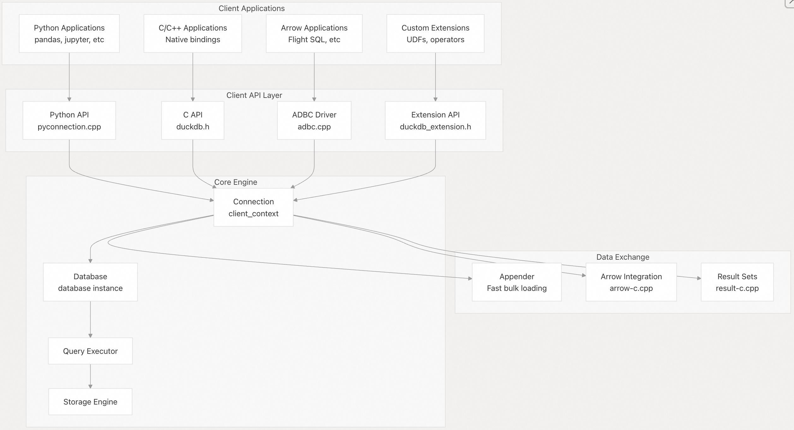
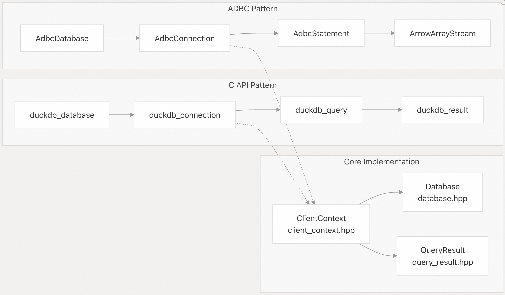
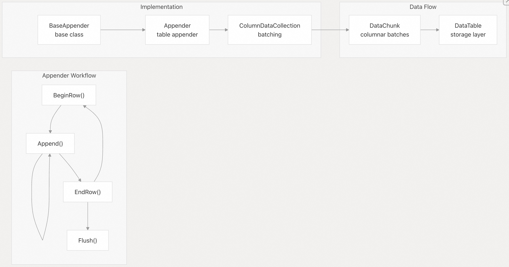

## DuckDB 源码学习: 7 客户端 API       
              
### 作者              
digoal              
              
### 日期              
2025-10-22              
              
### 标签              
DuckDB , 源码学习              
              
----              
              
## 背景             
DuckDB 提供了多种客户端 API 接口，以支持不同的编程语言、使用场景和集成模式。本文概述了可用的客户端接口及其与核心数据库引擎的架构关系。  
  
## 可用的客户端接口  
  
DuckDB 支持多种客户端 API 方法，每种都针对不同的使用场景和集成需求进行了优化：  
  
| API 类型 | 主要使用场景 | 关键特性 |  
|---|---|---|  
| C API | 原生集成、语言绑定 | 直接内存访问、开销极小、功能全面 |  
| Python API | 数据科学、分析工作流 | 与 Pandas 集成、支持 Jupyter、符合 Python 习惯的接口 |  
| ADBC 驱动 | Arrow 生态系统集成 | 标准化数据库连接、原生 Arrow 数据交换 |  
| 扩展 API | 自定义扩展、用户定义函数（UDF） | 插件开发、访问核心引擎 |  
| Appender API | 高性能数据加载 | 批量插入操作、序列化开销极小 |  
  
更多参考  
- [《DuckDB 重构 arrow 扩展插件增强 Arrow IPC 文件读写体验》](../202505/20250525_01.md)    
- [《数据库筑基课 - 列存之 Arrow, 面向内存 & "进程0拷贝/跨机无需序列化"共享数据 设计的列存》](../202501/20250127_01.md)    
- [《DuckDB ADBC - 通过 Arrow 数据库连接进行 零复制|零格式转换 数据传输 VS ODBC/JDBC》](../202308/20230808_03.md)    
  
## 客户端 API 架构  
  
    
  
相关源文件：    
- [`src/include/duckdb.h`（第 1–50 行）](https://github.com/duckdb/duckdb/blob/05a2403c/src/include/duckdb.h#L1-L50)    
- [`src/common/adbc/adbc.cpp`（第 1–100 行）](https://github.com/duckdb/duckdb/blob/05a2403c/src/common/adbc/adbc.cpp#L1-L100)    
- [`src/main/appender.cpp`（第 1–50 行）](https://github.com/duckdb/duckdb/blob/05a2403c/src/main/appender.cpp#L1-L50)  
  
## 连接管理模式(Patterns)  
  
所有 DuckDB 客户端 API 都遵循通用的连接生命周期模式，具体实现细节略有不同：  
  
    
  
相关源文件：    
- [`src/include/duckdb.h`（第 487–495 行）](https://github.com/duckdb/duckdb/blob/05a2403c/src/include/duckdb.h#L487-L495)    
- [`src/common/adbc/adbc.cpp`（第 491–517 行）](https://github.com/duckdb/duckdb/blob/05a2403c/src/common/adbc/adbc.cpp#L491-L517)    
- [`src/main/capi/duckdb-c.cpp`（第 1–50 行）](https://github.com/duckdb/duckdb/blob/05a2403c/src/main/capi/duckdb-c.cpp#L1-L50)  
  
## 数据交换机制  
  
DuckDB 客户端 API 支持多种数据交换格式，针对不同的性能和兼容性需求进行了优化：  
  
### 原生数据类型  
  
C API 通过结构化类型提供对 DuckDB 内部数据表示的直接访问：  
- Scalar Types: `duckdb_date`、`duckdb_time`、`duckdb_timestamp`、`duckdb_interval`  
- Complex Types: `duckdb_hugeint`、`duckdb_decimal`、`duckdb_blob`  
- Container Types: `duckdb_string`、`duckdb_list_entry`  
  
### Arrow 集成  
  
C API 和 ADBC 驱动均提供全面的 Apache Arrow 集成：  
- `duckdb_to_arrow_schema`：将 DuckDB 逻辑类型转换为 Arrow Schema  
- `duckdb_data_chunk_to_arrow`：将查询结果以 Arrow 数组形式流式输出  
- `duckdb_schema_from_arrow` 与 `duckdb_data_chunk_from_arrow`：用于输入数据  
  
### 高性能 Appender  
  
`Appender` 接口提供优化的批量数据加载功能，序列化(serialization)开销极小：  
  
    
  
更多参考  
- [《PostgreSQL 数据传输&存储 数据的序列化和反序列化 (serialization/deserialization)》](../202412/20241211_02.md)    
- [《数据库筑基课 - 列存之 Arrow, 面向内存 & "进程0拷贝/跨机无需序列化"共享数据 设计的列存》](../202501/20250127_01.md)    
  
相关源文件：    
- [`src/main/appender.cpp`（第 425–480 行）](https://github.com/duckdb/duckdb/blob/05a2403c/src/main/appender.cpp#L425-L480)    
- [`src/include/duckdb/main/appender.hpp`（第 23–127 行）](https://github.com/duckdb/duckdb/blob/05a2403c/src/include/duckdb/main/appender.hpp#L23-L127)    
- [`src/main/capi/appender-c.cpp`（第 18–50 行）](https://github.com/duckdb/duckdb/blob/05a2403c/src/main/capi/appender-c.cpp#L18-L50)  
  
## 错误处理与状态管理  
  
DuckDB 客户端 API 实现了统一的错误处理模式，并根据具体 API 进行了适配：  
  
### C API 错误模型    
- **返回码**：使用 `duckdb_state` 枚举，包含 `DuckDBSuccess`（成功）和 `DuckDBError`（错误）    
- **错误信息**：可通过 `duckdb_result_error()` 等类似函数获取    
- **错误类型**：通过 `duckdb_error_type` 枚举提供详细的错误分类    
  
### ADBC 错误模型    
- **状态码**：采用符合 ADBC 标准的 `AdbcStatusCode`    
- **错误详情**：通过 `AdbcError` 结构体提供错误消息和 SQL 状态信息    
- **生命周期管理**：通过释放回调（release callbacks）显式清理错误对象    
  
### 资源管理    
所有客户端 API 均采用 RAII 风格的资源管理，并提供显式的清理函数：    
- **C API**：对所有分配的资源提供对应的 `duckdb_destroy_*` 函数    
- **ADBC**：在 Arrow 对象和 ADBC 结构中使用释放回调（release callbacks）进行资源回收    
- **Appender**：析构函数中自动清理资源，同时也支持显式调用 `Close()` 方法  
  
相关源文件：    
- [`src/include/duckdb.h`（第 143–239 行）](https://github.com/duckdb/duckdb/blob/05a2403c/src/include/duckdb.h#L143-L239)    
- [`src/common/adbc/adbc.cpp`（第 110–137 行）](https://github.com/duckdb/duckdb/blob/05a2403c/src/common/adbc/adbc.cpp#L110-L137)    
- [`src/main/capi/capi_internal.hpp`（第 1–50 行）](https://github.com/duckdb/duckdb/blob/05a2403c/src/main/capi/capi_internal.hpp#L1-L50)  
  
## 扩展与插件架构  
  
DuckDB 的扩展系统为自定义功能开发提供了独立的 API 接口.  
  
### 扩展入口点    
- **初始化**：通过 `duckdb_extension_access` 结构体提供对核心引擎的访问    
- **注册**：提供用于注册自定义操作符、函数和数据类型的函数    
- **API 版本控制**：通过特定版本的函数指针表确保兼容性    
  
### 函数注册模式    
扩展可以注册多种类型的自定义功能：    
- **标量函数**：`duckdb_register_scalar_function`    
- **聚合函数**：`duckdb_register_aggregate_function`    
- **表函数**：`duckdb_register_table_function`    
- **自定义类型**：`duckdb_register_logical_type`  
  
### DuckDB 扩展系统提供的主要 API 接口  
  
DuckDB 的扩展系统通过 `duckdb_ext_api_v1` 结构体提供了一套完整的函数指针 API, 允许扩展开发者访问核心引擎功能。这些 API 接口包括:  
  
#### 1. **数据库连接管理 API**  
- `duckdb_open` / `duckdb_open_ext` - 打开数据库    
- `duckdb_connect` - 创建连接    
- `duckdb_disconnect` - 断开连接    
- `duckdb_close` - 关闭数据库    
  
#### 2. **查询执行 API**  
- `duckdb_query` - 执行 SQL 查询    
- `duckdb_prepare` - 准备预编译语句    
- 参数绑定函数系列 (`duckdb_bind_*`) - 绑定各种类型的参数    
  
#### 3. **数据类型转换 API**  
- 日期时间转换函数 (`duckdb_from_date`, `duckdb_to_date`, `duckdb_from_timestamp` 等)    
- 数值类型转换 (`duckdb_hugeint_to_double`, `duckdb_decimal_to_double` 等)   
  
#### 4. **自定义函数注册 API**  
- `duckdb_create_scalar_function` - 创建标量函数    
- `duckdb_register_scalar_function` - 注册标量函数    
- `duckdb_create_aggregate_function` - 创建聚合函数    
- `duckdb_register_aggregate_function` - 注册聚合函数    
- 表函数绑定相关 API (`duckdb_bind_*`, `duckdb_init_*`, `duckdb_function_*`)    
  
#### 5. **高性能数据加载 API (Appender)**  
- `duckdb_appender_create` - 创建 appender    
- `duckdb_appender_begin_row` / `duckdb_appender_end_row` - 行操作    
- 各种类型的 append 函数 (`duckdb_append_*`)    
  
#### 6. **Arrow 集成 API (不稳定版本)**  
在 `DUCKDB_EXTENSION_API_VERSION_UNSTABLE` 宏下提供:    
- `duckdb_to_arrow_schema` - 转换为 Arrow schema  
- `duckdb_data_chunk_to_arrow` - 数据块转 Arrow  
- `duckdb_schema_from_arrow` - 从 Arrow 导入 schema  
- `duckdb_data_chunk_from_arrow` - 从 Arrow 导入数据  
  
#### 7. **向量和数据块操作 API (不稳定版本)**  
- `duckdb_create_vector` - 创建向量    
- `duckdb_slice_vector` - 向量切片   
- `duckdb_vector_copy_sel` - 向量复制    
  
### API 使用方式  
扩展通过入口点宏 `DUCKDB_EXTENSION_ENTRYPOINT` 初始化, 该宏会自动设置 API 结构体.   `duckdb_extension.h:1179-1195`  
  
实际使用示例可见 `demo_capi` 扩展.  `capi_demo.cpp:4-23`  
  
所有函数指针通过宏定义映射到全局 `duckdb_ext_api` 结构体, 例如: `duckdb_extension.h:658-671`  
  
### Notes  
- API 采用版本化设计,当前稳定版本为 v1.2.0    
- 不稳定 API 功能需要定义 `DUCKDB_EXTENSION_API_VERSION_UNSTABLE` 宏才能使用    
- API 定义通过 JSON 文件自动生成,确保跨版本兼容性    
- 扩展可以通过这些 API 注册自定义函数、类型、表函数等, 无需重新编译 DuckDB 核心   
  
  
相关源文件：    
- [`src/include/duckdb_extension.h`（第 70–100 行）](https://github.com/duckdb/duckdb/blob/05a2403c/src/include/duckdb_extension.h#L70-L100)    
- [`src/include/duckdb/main/capi/extension_api.hpp`（第 8–50 行）](https://github.com/duckdb/duckdb/blob/05a2403c/src/include/duckdb/main/capi/extension_api.hpp#L8-L50)    
- [`src/include/duckdb.h`（第 763–771 行）](https://github.com/duckdb/duckdb/blob/05a2403c/src/include/duckdb.h#L763-L771)  
      
#### [期望 PostgreSQL|开源PolarDB 增加什么功能?](https://github.com/digoal/blog/issues/76 "269ac3d1c492e938c0191101c7238216")
  
  
#### [PolarDB 开源数据库](https://openpolardb.com/home "57258f76c37864c6e6d23383d05714ea")
  
  
#### [PolarDB 学习图谱](https://www.aliyun.com/database/openpolardb/activity "8642f60e04ed0c814bf9cb9677976bd4")
  
  
#### [PostgreSQL 解决方案集合](../201706/20170601_02.md "40cff096e9ed7122c512b35d8561d9c8")
  
  
#### [德哥 / digoal's Github - 公益是一辈子的事.](https://github.com/digoal/blog/blob/master/README.md "22709685feb7cab07d30f30387f0a9ae")
  
  
#### [About 德哥](https://github.com/digoal/blog/blob/master/me/readme.md "a37735981e7704886ffd590565582dd0")
  
  

  
