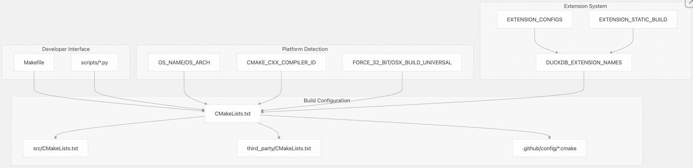
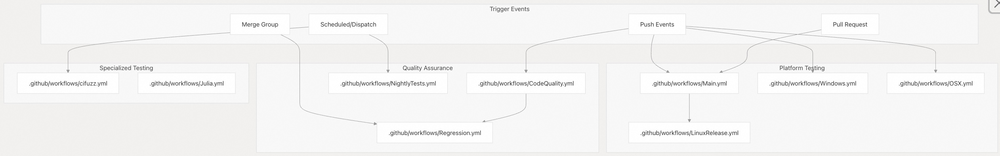

## DuckDB 源码学习: 8 开发与贡献(Development & Contributing)        
                
### 作者                
digoal                
                
### 日期                
2025-10-22                
                
### 标签                
DuckDB , 源码学习                
                
----                
                
## 背景               
本文概述了 DuckDB 的开发基础设施、构建(Build)系统和贡献指南。涵盖了贡献者和维护者用于开发、测试和发布 DuckDB 所使用的工具、流程和工作流。    
  
## 构建(Build)系统架构    
DuckDB 使用双层构建系统：CMake 用于跨平台(cross-platform)配置，Make 用于提升开发者便利性。主构建配置定义在 [`CMakeLists.txt`（第1–1000行）](https://github.com/duckdb/duckdb/blob/05a2403c/CMakeLists.txt#L1-L1000)，包含400多个构建选项以及广泛的平台检测逻辑。  
  
### 构建系统组件    
  
  
构建系统支持大量配置选项，这些选项定义在 [`CMakeLists.txt`（第31–600行）](https://github.com/duckdb/duckdb/blob/05a2403c/CMakeLists.txt#L31-L600)中，包括：  
- Platform targeting: `OS_NAME`, `OS_ARCH`, `FORCE_32_BIT`, `OSX_BUILD_UNIVERSAL`    
- Debug options: `FORCE_ASSERT`, `DISABLE_SANITIZER`, `DEBUG_ALLOCATION`    
- Extension control: `BUILD_EXTENSIONS`, `DISABLE_BUILTIN_EXTENSIONS`, `EXTENSION_STATIC_BUILD`    
- Performance tuning: `STANDARD_VECTOR_SIZE`, `SMALLER_BINARY`, `NATIVE_ARCH`  
  
来源：  
- [`CMakeLists.txt`（1–1000）](https://github.com/duckdb/duckdb/blob/05a2403c/CMakeLists.txt#L1-L1000)  
- [`Makefile`（1–551）](https://github.com/duckdb/duckdb/blob/05a2403c/Makefile#L1-L551)  
- [`src/CMakeLists.txt`（1–175）](https://github.com/duckdb/duckdb/blob/05a2403c/src/CMakeLists.txt#L1-L175)  
  
### 常用构建目标 (Common Build Targets)   
[`Makefile`（第329–551行）](https://github.com/duckdb/duckdb/blob/05a2403c/Makefile#L1-L551) 为开发工作流提供了便捷的目标：  
  
| 目标 | 用途 | 对应的 CMake 命令 |  
|------|------|------------------|  
| `make` / `make release` | 发布构建 | `cmake -DCMAKE_BUILD_TYPE=Release` |  
| `make debug` | 带 sanitizer 的调试构建 | `cmake -DCMAKE_BUILD_TYPE=Debug` |  
| `make unittest` | 构建并运行单元测试 | 调试构建 + 测试执行 (Debug build + test execution) |  
| `make reldebug` | 带调试信息的发布构建 | `cmake -DCMAKE_BUILD_TYPE=RelWithDebInfo` |  
| `make relassert` | 带断言的发布构建 | `cmake -DFORCE_ASSERT=1` |  
  
来源：  
- [`Makefile`（329–551）](https://github.com/duckdb/duckdb/blob/05a2403c/Makefile#L329-L551)  
  
## 开发工作流    
DuckDB 的开发工作流由广泛的自动化和工具基础设施支持，以确保代码质量和跨平台兼容性。  
  
### CI/CD 流水线架构    
  
  
CI 系统会根据事件触发器运行不同的测试套件：  
- **拉取请求（Pull Requests）**：在 Linux 上运行核心功能测试（见 [Main.yml 第 47–489 行](https://github.com/duckdb/duckdb/blob/05a2403c/Main.yml#L47-L489)）    
- **主分支（Main Branch）**：运行完整的平台矩阵测试和发布版本构建    
- **每日夜间构建（Nightly）**：执行扩展的回归测试和内存泄漏检测（见 [NightlyTests.yml 第 40–673 行](https://github.com/duckdb/duckdb/blob/05a2403c/NightlyTests.yml#L40-L673)）  
  
来源：  
- [`.github/workflows/Main.yml`（1–489）](https://github.com/duckdb/duckdb/blob/05a2403c/.github/workflows/Main.yml#L1-L489)  
- [`.github/workflows/LinuxRelease.yml`（1–275）](https://github.com/duckdb/duckdb/blob/05a2403c/.github/workflows/LinuxRelease.yml#L1-L275)  
- [`.github/workflows/CodeQuality.yml`（1–157）](https://github.com/duckdb/duckdb/blob/05a2403c/.github/workflows/CodeQuality.yml#L1-L157)  
  
### 代码质量标准    
DuckDB 通过自动化检查强制执行严格的代码质量标准：  
  
#### 格式与风格(Formatting and Style)  
- **C++ 格式化**：使用 `clang-format-11` 并配合自定义配置    
- **Python 格式化**：使用 `black` 版本 24.x    
- **CMake 格式化**：使用 `cmake-format`    
- **生成代码验证**：见 [`CodeQuality.yml` 第 80–84 行](https://github.com/duckdb/duckdb/blob/05a2403c/CodeQuality.yml#L80-L84)  
  
#### 静态分析(Static Analysis)  
- **Clang-tidy**：启用缓存以提升性能（见 [`CodeQuality.yml` 第 111–156 行](https://github.com/duckdb/duckdb/blob/05a2403c/CodeQuality.yml#L111-L156)）    
- **线程检查**：通过线程 sanitizer 构建进行检测（见 [`Main.yml` 第 280–322 行](https://github.com/duckdb/duckdb/blob/05a2403c/Main.yml#L280-L322)）    
- **内存验证**：使用 `AddressSanitizer` 和 `UndefinedBehaviorSanitizer`（地址与未定义行为检测器）  
  
#### 测试配置(Test Configurations)  
DuckDB 会测试多种构建配置，以确保健壮性：  
- **向量大小变化**：`STANDARD_VECTOR_SIZE=2`    
- **内存安全选项**：`DISABLE_MEMORY_SAFETY`、`DEBUG_ALLOCATION`    
- **存储配置**：`FORCE_STORAGE`、`LATEST_STORAGE`    
- **哈希冲突测试**：`HASH_ZERO=1`  
  
来源：  
- [`.github/workflows/CodeQuality.yml`（50–157）](https://github.com/duckdb/duckdb/blob/05a2403c/.github/workflows/CodeQuality.yml#L50-L157)  
- [`.github/workflows/Main.yml`（354–489）](https://github.com/duckdb/duckdb/blob/05a2403c/.github/workflows/Main.yml#L354-L489)  
  
## 测试基础设施  
  
### 测试执行框架    
  
  
测试框架支持以下功能：  
- **单个测试执行**：通过 `scripts/run_tests_one_by_one.py` 脚本    
- **基于配置的测试**：使用 `test/configs/` 目录中的 JSON 配置文件    
- **并行执行**：采用线程安全的测试运行器    
- **平台特定测试**：支持交叉编译(Cross-compilation)验证  
  
来源：  
- [`.github/workflows/Main.yml`（92–489）](https://github.com/duckdb/duckdb/blob/05a2403c/.github/workflows/Main.yml#L92-L489)  
- [`.github/workflows/NightlyTests.yml`（70–673）](https://github.com/duckdb/duckdb/blob/05a2403c/.github/workflows/NightlyTests.yml#L70-L673)  
  
### 扩展测试 (Extension Testing)   
扩展测试采用两阶段方法：    
- **静态链接测试**：将扩展编译进 DuckDB 内部    
- **动态加载测试**：从扩展仓库中自动加载扩展  
  
在 [`.github/actions/build_extensions/action.yml`（182–227 行）](https://github.com/duckdb/duckdb/blob/05a2403c/.github/actions/build_extensions/action.yml#L182-L227) 中，构建系统会重新构建一个不包含静态扩展的 DuckDB，以测试自动加载机制。  
  
来源：  
- [`.github/actions/build_extensions/action.yml`（100–257）](https://github.com/duckdb/duckdb/blob/05a2403c/.github/actions/build_extensions/action.yml#L100-L257)  
  
## 扩展开发    
DuckDB 的扩展系统支持树内（in-tree）和树外（out-of-tree）扩展，并提供完整的构建自动化支持。  
  
### 扩展构建配置    
  
  
扩展系统通过以下方式配置：  
- **扩展注册表**：`DUCKDB_EXTENSION_NAMES` 列表 ( [参考代码](https://github.com/duckdb/duckdb/blob/05a2403c/CMakeLists.txt#L772-L794) )  
- **构建模式**：静态构建（static）与可加载扩展构建（loadable extension builds）  ( [参考代码](https://github.com/duckdb/duckdb/blob/05a2403c/CMakeLists.txt#L408-L414) )  
- **ABI 兼容性**：基于 C 结构体和 C++ 接口的 ABI 兼容设计  ( [参考代码](https://github.com/duckdb/duckdb/blob/05a2403c/CMakeLists.txt#L893-L946) )  
  
### 扩展仓库管理 (Extension Repository Management)    
扩展会自动部署到本地仓库结构中：  
```  
build/repository/  
└── ${DUCKDB_NORMALIZED_VERSION}/  
    └── ${platform}/  
        └── extension_name.duckdb_extension  
```  
  
该结构由 [`scripts/create_local_extension_repo.py`](https://github.com/duckdb/duckdb/blob/05a2403c/scripts/create_local_extension_repo.py) 脚本管理，该脚本在 [`CMakeLists.txt` 第836–853行](https://github.com/duckdb/duckdb/blob/05a2403c/CMakeLists.txt#L836-L853) 中被调用。  
  
来源：  
- [`CMakeLists.txt`（772–946）](https://github.com/duckdb/duckdb/blob/05a2403c/CMakeLists.txt#L772-L946)  
- [`.github/config/bundled_extensions.cmake`](https://github.com/duckdb/duckdb/blob/05a2403c/.github/config/bundled_extensions.cmake)  
- [`.github/actions/build_extensions/action.yml`（103–109）](https://github.com/duckdb/duckdb/blob/05a2403c/.github/actions/build_extensions/action.yml#L103-L109)  
  
## 代码生成与维护    
DuckDB 包含大量代码生成机制，以确保一致性与可维护性。  
  
### 生成代码系统    
[`Makefile`（第506–519行）](https://github.com/duckdb/duckdb/blob/05a2403c/Makefile#L506-L519) 定义了代码生成目标  
```  
make generate-files  # Generates all code  
```  
  
会运行多个 Python 脚本：  
- `scripts/generate_c_api.py` – 生成 C API 绑定    
- `scripts/generate_functions.py` – 生成函数注册代码    
- `scripts/generate_settings.py` – 生成配置项代码    
- `scripts/generate_serialization.py` – 生成序列化代码    
- `scripts/generate_builtin_types.py` – 生成类型系统代码    
  
CI 系统会在 [`CodeQuality.yml`（第80–84行）](https://github.com/duckdb/duckdb/blob/05a2403c/CodeQuality.yml#L80-L84) 中验证生成的代码是否为最新。  
  
### 开发实用工具    
常见开发任务通过 Make 目标实现自动化：  
- Code formatting: `make format-fix`, `make format-check`    
- Static analysis: `make tidy-check`, `make tidy-fix`    
- Documentation: `make docs`, `make doxygen`    
- Profiling: `make coverage-check`  
  
来源：  
- [`Makefile`（452–519）](https://github.com/duckdb/duckdb/blob/05a2403c/Makefile#L452-L519)  
- [`.github/workflows/CodeQuality.yml`（72–84）](https://github.com/duckdb/duckdb/blob/05a2403c/.github/workflows/CodeQuality.yml#L72-L84)  
  
## 贡献指南  
  
### 构建依赖    
DuckDB 需要以下依赖：  
- **C++11 编译器**：GCC 8 及以上、Clang 9 及以上、MSVC 2019 及以上    
- **CMake**：版本 3.5 或更高（ 见 [`CMakeLists.txt` 第 1 行](https://github.com/duckdb/duckdb/blob/05a2403c/CMakeLists.txt#L1-L1) ）    
- **Python 3**：用于构建脚本和代码生成    
- **可选**：Ninja 构建系统，用于加速构建（使用 `GEN=ninja`）  
  
### 平台支持    
构建系统可自动检测并支持以下平台：  
- **Linux**：AMD64、ARM64，支持 musl libc    
- **macOS**：通用二进制（Universal binaries），同时支持 x64 和 ARM64 架构    
- **Windows**：AMD64、ARM64，支持 MinGW    
- **WebAssembly**：支持 MVP（最小可行产品）、异常处理（EH）和多线程（threading）等多种变体  
  
平台检测逻辑位于 [`CMakeLists.txt`（第137–156行）](https://github.com/duckdb/duckdb/blob/05a2403c/CMakeLists.txt#L137-L156)  
  
### 版本与发布    
版本信息通过 Git 标签提取，相关逻辑位于 [`CMakeLists.txt` 第315–399行](https://github.com/duckdb/duckdb/blob/05a2403c/CMakeLists.txt#L315-L399)）：  
- **版本格式**：`v{MAJOR}.{MINOR}.{PATCH}-{DEV_ITERATION}-g{COMMIT_HASH}`    
- **开发版本规则**：  
  - 在 `main` 分支上，开发版本递增 **次版本号（minor）**  
  - 在发布分支（release branches）上，开发版本递增 **修订号（patch）**  
- **显式版本覆盖**：可通过设置 `OVERRIDE_GIT_DESCRIBE` 变量来手动指定版本字符串  
  
来源：  
- [`CMakeLists.txt`（137–399）](https://github.com/duckdb/duckdb/blob/05a2403c/CMakeLists.txt#L137-L399)  
- [`.github/workflows/LinuxRelease.yml`（87–157）](https://github.com/duckdb/duckdb/blob/05a2403c/.github/workflows/LinuxRelease.yml#L87-L157)  
- [`.github/workflows/Windows.yml`（91–157）](https://github.com/duckdb/duckdb/blob/05a2403c/.github/workflows/Windows.yml#L91-L157)  
      
#### [期望 PostgreSQL|开源PolarDB 增加什么功能?](https://github.com/digoal/blog/issues/76 "269ac3d1c492e938c0191101c7238216")
  
  
#### [PolarDB 开源数据库](https://openpolardb.com/home "57258f76c37864c6e6d23383d05714ea")
  
  
#### [PolarDB 学习图谱](https://www.aliyun.com/database/openpolardb/activity "8642f60e04ed0c814bf9cb9677976bd4")
  
  
#### [PostgreSQL 解决方案集合](../201706/20170601_02.md "40cff096e9ed7122c512b35d8561d9c8")
  
  
#### [德哥 / digoal's Github - 公益是一辈子的事.](https://github.com/digoal/blog/blob/master/README.md "22709685feb7cab07d30f30387f0a9ae")
  
  
#### [About 德哥](https://github.com/digoal/blog/blob/master/me/readme.md "a37735981e7704886ffd590565582dd0")
  
  

  
