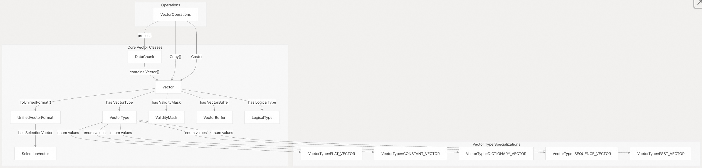
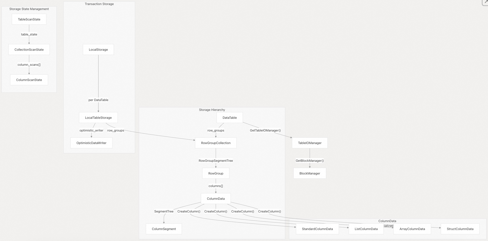
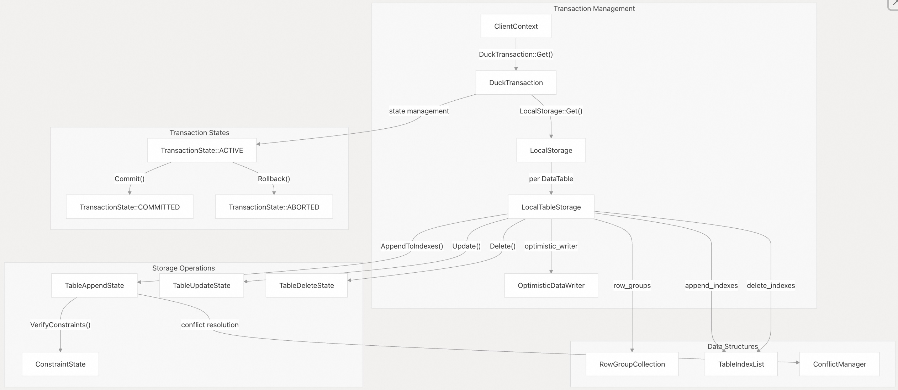
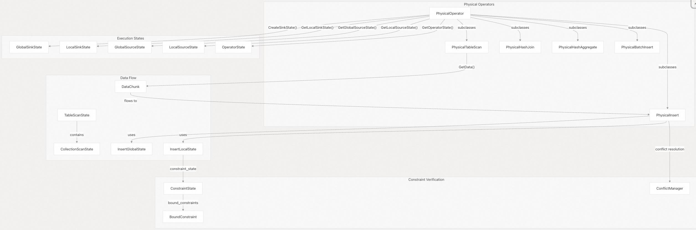
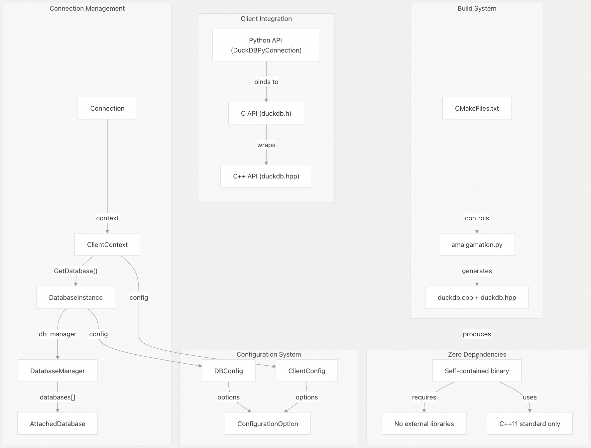
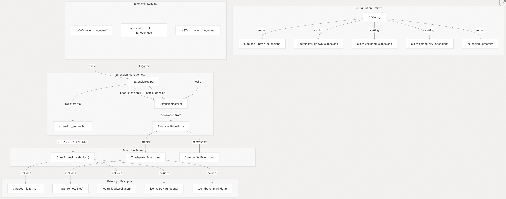

## DuckDB 源码学习: 1.1 设计理念        
                  
### 作者                  
digoal                  
                  
### 日期                  
2025-10-22                  
                  
### 标签                  
DuckDB , 源码学习                  
                  
----                  
                  
## 背景                 
本文介绍 DuckDB 作为一款嵌入式分析型数据库管理系统（DBMS）的核心设计原则。内容涵盖驱动 DuckDB 架构的关键设计决策及其底层数据模型，这些共同塑造了 DuckDB 的实现方式和性能特征。  
  
## 核心原则    
DuckDB 从零开始就被设计为一款专注于**分析型工作负载**的数据库管理系统，其优先考虑以下方面：  
- 高性能分析型查询处理  
- 列式存储与执行  
- 向量化查询执行  
- 简单嵌入，零依赖  
- 支持 ACID 事务  
- 可扩展架构  
- 配置灵活性  
  
大多数数据库系统在设计时需要在事务型（OLTP）和分析型（OLAP）工作负载之间进行权衡，而 DuckDB 专门针对分析型场景进行了优化 —— 即在大规模数据集上执行复杂查询。  
  
源文件：  
- [`src/main/client_context.cpp`（1–65 行）](https://github.com/duckdb/duckdb/blob/05a2403c/src/main/client_context.cpp#L1-L65)  
- [`src/main/config.cpp`（1–100 行）](https://github.com/duckdb/duckdb/blob/05a2403c/src/main/config.cpp#L1-L100)  
- [`src/include/duckdb/main/config.hpp`（1–50 行）](https://github.com/duckdb/duckdb/blob/05a2403c/src/include/duckdb/main/config.hpp#L1-L50)  
  
## 向量化执行模型    
DuckDB 的核心实现了一个**向量化执行引擎**，这与许多传统数据库系统采用的“逐元组（tuple-at-a-time）”处理模型有本质区别。  
  
DuckDB 不是一次处理一行数据，而是以数据块（通常为 `STANDARD_VECTOR_SIZE = 1024` 个值）为单位进行批量处理。这种模式具有多项优势：  
- **降低解释开销**：函数调用的开销被分摊到大量数据值上    
- **提升 CPU 缓存利用率**：对向量数据进行操作可改善数据局部性    
- **利用 SIMD 指令**：可充分发挥现代 CPU 的向量化指令能力    
- **减少分支跳转**：向量化操作中的条件分支更少  
  
### 向量系统    
**DuckDB 向量系统架构**  
  
  
  
关键向量系统组件：  
- **`Vector`**：核心结构，表示一个带有 `LogicalType`（逻辑类型）和内部 `VectorType`（向量类型）的类型化数据列。    
- **`DataChunk`**：包含多个 `Vector` 对象的容器，表示一批具有相同行数（cardinality）的数据行。    
- **`VectorType` 枚举**：不同的内部表示形式，针对特定场景进行优化：  
  - **`FLAT_VECTOR`**：标准向量，值在内存中连续存储    
  - **`CONSTANT_VECTOR`**：整个向量重复同一个值（节省空间）    
  - **`DICTIONARY_VECTOR`**：通过 `SelectionVector`（选择向量）实现间接访问，用于去重    
  - **`SEQUENCE_VECTOR`**：表示数学序列（例如范围操作）    
  - **`FSST_VECTOR`**：使用 Fast Static Symbol Table（FSST）算法对字符串进行压缩    
- **`UnifiedVectorFormat`**：通用接口，通过 `ToUnifiedFormat()` 方法统一访问任意类型的向量    
- **`ValidityMask`**：位向量（bitset），高效记录 NULL 值的存在情况  
  
该向量系统通过专用缓冲区类型（如 `VectorStructBuffer`、`VectorListBuffer` 和 `VectorArrayBuffer`）支持复杂的嵌套数据类型。  
  
源文件：  
- [`src/common/types/vector.cpp`（60–135 行）](https://github.com/duckdb/duckdb/blob/05a2403c/src/common/types/vector.cpp#L60-L135)  
- [`src/common/types/data_chunk.cpp`（22–74 行）](https://github.com/duckdb/duckdb/blob/05a2403c/src/common/types/data_chunk.cpp#L22-L74)  
- [`src/include/duckdb/common/types/vector.hpp`（29–122 行）](https://github.com/duckdb/duckdb/blob/05a2403c/src/include/duckdb/common/types/vector.hpp#L29-L122)  
  
## 列式存储架构    
与为事务处理(OLTP)优化的行式数据库不同，DuckDB 采用**列式存储格式**，将同一列的值在磁盘和内存中连续存放。  
  
**DuckDB 存储系统架构**  
  
  
  
这种存储架构为分析型查询带来了多项优势：  
- **更优的压缩效果**：相似的值被集中存储，便于采用针对列的压缩算法    
- **减少 I/O 开销**：通过 `StorageIndex` 选择机制，仅读取查询所需的列    
- **更高的缓存效率**：借助 `ColumnScanState` 对列进行操作时，内存局部性更好    
- **适合 SIMD 优化**：列式数据天然适合在 `Vector` 操作中进行向量化处理    
  
`RowGroup`（行组）抽象将表划分为多个易于管理的数据块（可通过 `TableIOManager::GetRowGroupSize()` 配置大小），从而支持高效访问和并行处理。每个 `RowGroup` 包含一组 `ColumnData` 对象，其具体实现包括：  
- **`StandardColumnData`**：用于基本数据类型的常规列存储    
- **`ListColumnData`**：支持嵌套列表结构，包含子列数据    
- **`ArrayColumnData`**：用于固定长度的数组结构    
- **`StructColumnData`**：用于结构体类型，包含多个子列  
  
事务本地的修改通过 `LocalStorage` 处理，它为每张表维护独立的 `RowGroupCollection` 实例，从而实现隔离性和高效的批处理操作。  
  
源文件：  
- [`src/storage/data_table.cpp`（49–71 行）](https://github.com/duckdb/duckdb/blob/05a2403c/src/storage/data_table.cpp#L49-L71)  
- [`src/storage/table/row_group.cpp`（28–69 行）](https://github.com/duckdb/duckdb/blob/05a2403c/src/storage/table/row_group.cpp#L28-L69)  
- [`src/storage/table/column_data.cpp`（24–35 行）](https://github.com/duckdb/duckdb/blob/05a2403c/src/storage/table/column_data.cpp#L24-L35)  
- [`src/storage/local_storage.cpp`（18–30 行）](https://github.com/duckdb/duckdb/blob/05a2403c/src/storage/local_storage.cpp#L18-L30)  
  
## 丰富的类型系统    
DuckDB 实现了一个全面的类型系统，明确区分**逻辑类型**（用户可见）和**物理类型**（内部表示）。  
  
**DuckDB 类型系统架构**  

```mermaid  
graph TD  
    subgraph "Core Type Classes"  
        LogicalType["LogicalType"]  
        PhysicalType["PhysicalType"]  
        LogicalTypeId["LogicalTypeId"]  
        ExtraTypeInfo["ExtraTypeInfo"]  
        Value["Value"]  
          
        LogicalType -->|"id_"| LogicalTypeId  
        LogicalType -->|"physical_type_"| PhysicalType  
        LogicalType -->|"type_info_"| ExtraTypeInfo  
        Value -->|"type_"| LogicalType  
    end  
      
    subgraph "LogicalTypeId Enum Values"  
        BOOLEAN["LogicalTypeId::BOOLEAN"]  
        INTEGER["LogicalTypeId::INTEGER"]  
        BIGINT["LogicalTypeId::BIGINT"]  
        HUGEINT["LogicalTypeId::HUGEINT"]  
        UHUGEINT["LogicalTypeId::UHUGEINT"]  
        DECIMAL["LogicalTypeId::DECIMAL"]  
        FLOAT["LogicalTypeId::FLOAT"]  
        DOUBLE["LogicalTypeId::DOUBLE"]  
        VARCHAR["LogicalTypeId::VARCHAR"]  
        DATE["LogicalTypeId::DATE"]  
        TIMESTAMP["LogicalTypeId::TIMESTAMP"]  
        STRUCT["LogicalTypeId::STRUCT"]  
        LIST["LogicalTypeId::LIST"]  
        ARRAY["LogicalTypeId::ARRAY"]  
        MAP["LogicalTypeId::MAP"]  
        UNION["LogicalTypeId::UNION"]  
        UUID["LogicalTypeId::UUID"]  
    end  
      
    subgraph "PhysicalType Enum Values"  
        BOOL["PhysicalType::BOOL"]  
        INT8["PhysicalType::INT8"]  
        INT16["PhysicalType::INT16"]  
        INT32["PhysicalType::INT32"]  
        INT64["PhysicalType::INT64"]  
        INT128["PhysicalType::INT128"]  
        UINT128["PhysicalType::UINT128"]  
        FLOAT_P["PhysicalType::FLOAT"]  
        DOUBLE_P["PhysicalType::DOUBLE"]  
        VARCHAR_P["PhysicalType::VARCHAR"]  
        STRUCT_P["PhysicalType::STRUCT"]  
        LIST_P["PhysicalType::LIST"]  
        ARRAY_P["PhysicalType::ARRAY"]  
    end  
      
    subgraph "Value Operations"  
        TryCast["TryCast::Operation()"]  
        CastFunctionSet["CastFunctionSet"]  
        VectorOperations["VectorOperations::Cast()"]  
          
        TryCast -->|"handles casting"| Value  
        CastFunctionSet -->|"provides cast functions"| TryCast  
        VectorOperations -->|"vector-level casting"| Vector["Vector"]  
    end  
      
    LogicalTypeId --> BOOLEAN  
    LogicalTypeId --> INTEGER  
    LogicalTypeId --> HUGEINT  
    LogicalTypeId --> STRUCT  
    LogicalTypeId --> LIST  
      
    PhysicalType --> BOOL  
    PhysicalType --> INT32  
    PhysicalType --> INT128  
    PhysicalType --> STRUCT_P  
    PhysicalType --> LIST_P  
```  
  

  
这种分离带来了以下优势：  
- **逻辑抽象**：用户通过 `LogicalTypeId` 枚举使用直观的类型    
- **高效存储**：系统在内部采用最优的 `PhysicalType` 表示方式    
- **类型感知的操作**：操作根据 `PhysicalType` 进行分发，以实现最佳性能    
- **嵌套复杂类型支持**：通过专用的 `ExtraTypeInfo` 子类支持嵌套类型    
  
关键类型系统特性包括：  
- **`LogicalType::GetInternalType()`**：将逻辑类型映射到对应的物理存储表示    
- **`GetTypeIdSize(PhysicalType)`**：返回物理类型的存储大小    
- **`Value` 类**：持有带类型的值，并通过 `TryCast` 实现自动类型转换    
- **`ExtraTypeInfo`**：用于复杂类型的可扩展元数据，例如：  
  - **`DecimalTypeInfo`**：为 `DECIMAL` 类型提供精度（width）和小数位数（scale）信息    
  - **`ListTypeInfo`**：为 `LIST` 类型提供子元素类型信息    
  - **`StructTypeInfo`**：为 `STRUCT` 类型提供字段名及其对应类型  
  
该类型系统支持 128 位整数（`hugeint_t` / `uhugeint_t`）以实现高精度运算，并支持任意嵌套的复杂类型（例如：`LIST<STRUCT<name: VARCHAR, scores: LIST<INTEGER>>>>`）。  
  
源文件：  
- [`src/common/types.cpp`（37–165 行）](https://github.com/duckdb/duckdb/blob/05a2403c/src/common/types.cpp#L37-L165)  
- [`src/common/types/value.cpp`（125–172 行）](https://github.com/duckdb/duckdb/blob/05a2403c/src/common/types/value.cpp#L125-L172)  
- [`src/common/operator/cast_operators.cpp`（35–52 行）](https://github.com/duckdb/duckdb/blob/05a2403c/src/common/operator/cast_operators.cpp#L35-L52)  
- [`src/include/duckdb/common/types.hpp`（250–400 行）](https://github.com/duckdb/duckdb/blob/05a2403c/src/include/duckdb/common/types.hpp#L250-L400)  
  
## 支持 ACID 的事务管理    
DuckDB 在保证高性能分析处理的同时，提供完整的 **ACID（原子性、一致性、隔离性、持久性）** 事务保障。  
  
**DuckDB 事务架构**  
  
  
  
DuckDB 在保持分析型工作负载高性能的同时，提供了完整的 **ACID（原子性、一致性、隔离性、持久性）** 事务保证。  
  
**关键事务特性：**  
- **乐观并发控制**：`OptimisticDataWriter` 假设冲突很少发生，仅在提交时进行验证    
- **基于本地存储的 MVCC（多版本并发控制）**：读取操作看到已提交的数据，而写入操作在 `LocalTableStorage` 中进行修改    
- **高效的批量操作**：`LocalTableStorage::AppendToIndexes()` 以最优方式处理批量插入    
- **约束验证**：`ConstraintState` 负责验证外键、唯一性约束和检查约束    
- **跨表事务**：单个 `DuckTransaction` 可管理多个表上的操作    
- **索引维护**：同时维护 `append_indexes` 和 `delete_indexes`，用于约束检查    
  
**事务工作流程：**  
- 1. **开始**：`ClientContext` 创建一个状态为 `TRANSACTION_ACTIVE` 的 `DuckTransaction`    
- 2. **修改**：操作为每个受影响的表创建独立的 `LocalTableStorage`    
- 3. **验证**：调用 `VerifyAppendConstraints()` 和 `VerifyDeleteConstraints()` 检查约束是否满足    
- 4. **提交**：通过 `OptimisticDataWriter::FinalFlush()` 将数据写入持久化存储    
- 5. **清理**：清除本地存储，并将事务状态标记为 `TRANSACTION_COMMITTED`    
  
`LocalTableStorage` 作为**暂存区**，维护独立的 `RowGroupCollection` 实例和索引结构，仅在事务成功提交后，才会将这些变更合并到主 `DataTable` 中。  
  
源文件：  
- [`src/storage/local_storage.cpp`（18–104 行）](https://github.com/duckdb/duckdb/blob/05a2403c/src/storage/local_storage.cpp#L18-L104)  
- [`src/storage/data_table.cpp`（766–896 行）](https://github.com/duckdb/duckdb/blob/05a2403c/src/storage/data_table.cpp#L766-L896)  
- [`src/execution/operator/persistent/physical_insert.cpp`（154–275 行）](https://github.com/duckdb/duckdb/blob/05a2403c/src/execution/operator/persistent/physical_insert.cpp#L154-L275)  
- [`src/include/duckdb/transaction/local_storage.hpp`（18–180 行）](https://github.com/duckdb/duckdb/blob/05a2403c/src/include/duckdb/transaction/local_storage.hpp#L18-L180)  
  
## 向量化查询处理    
DuckDB 的查询执行结合了**向量化处理**与**流水线式执行模型**：每个操作符生成 `DataChunk` 对象（通常包含 `STANDARD_VECTOR_SIZE = 1024` 行），并在执行流水线中传递。  
  
**DuckDB 查询执行流水线**  
  
  
  
**执行引擎特性：**  
- **向量化操作符**：所有 `PhysicalOperator` 子类均处理包含多个 `Vector` 列的 `DataChunk` 对象    
- **状态管理**：独立的全局状态与局部状态支持跨线程并行执行    
- **内存感知处理**：固定大小的 `DataChunk` 对象（上限为 `STANDARD_VECTOR_SIZE`）有效控制内存使用    
- **缓存高效算法**：`Vector` 操作中的列式处理优化了 CPU 缓存利用率    
- **约束感知执行**：`ConstraintState` 与 `ConflictManager` 在数据修改过程中负责约束验证    
  
**关键执行模式：**  
- **源操作符**（如 `PhysicalTableScan`）通过 `TableScanState` 从存储读取数据，并生成 `DataChunk` 对象    
- **转换操作符**接收 `DataChunk` 输入，处理后产生 `DataChunk` 输出    
- **汇聚操作符**（如 `PhysicalInsert`）消费 `DataChunk` 对象，并将其写入存储或内存结构    
  
这种向量化模型通过将函数调用开销分摊到整个数据向量上，并利用 SIMD 指令加速基础操作，使 DuckDB 在分析型查询中实现卓越性能。  
  
源文件：  
- [`src/execution/operator/persistent/physical_insert.cpp`（25–55 行）](https://github.com/duckdb/duckdb/blob/05a2403c/src/execution/operator/persistent/physical_insert.cpp#L25-L55)  
- [`src/execution/operator/persistent/physical_batch_insert.cpp`（17–30 行）](https://github.com/duckdb/duckdb/blob/05a2403c/src/execution/operator/persistent/physical_batch_insert.cpp#L17-L30)  
- [`src/storage/table/row_group.cpp`（252–299 行）](https://github.com/duckdb/duckdb/blob/05a2403c/src/storage/table/row_group.cpp#L252-L299)  
- [`src/storage/data_table.cpp`（303–317 行）](https://github.com/duckdb/duckdb/blob/05a2403c/src/storage/data_table.cpp#L303-L317)  
  
## 可嵌入性与零依赖    
DuckDB 被设计为可轻松嵌入应用程序中，类似于 SQLite，但专门针对分析型工作负载进行了优化。  
  
**DuckDB 可嵌入架构**  
  
  
  
**关键嵌入特性：**  
- **进程内执行**：`DatabaseInstance` 直接在应用程序进程中运行，无需客户端-服务器通信    
- **零依赖**：完全自包含，仅依赖 C++ 标准库    
- **跨平台支持**：通过条件编译，可在 Windows、macOS 和 Linux 上运行    
- **合并构建（Amalgamation）**：通过 `scripts/amalgamation.py` 脚本将所有源代码合并为 `duckdb.cpp` 和 `duckdb.hpp` 两个文件    
- **多语言绑定**：`duckdb.h` 中提供的 C API 支持 Python、R、Java、Node.js 等语言绑定    
- **配置灵活性**：支持数据库级配置（`DBConfig`）和连接级配置（`ClientConfig`）  
  
**连接架构设计：**  
- **`Connection`**：`ClientContext` 的轻量级封装    
- **`ClientContext`**：每个连接的状态，包括事务、预编译语句和配置信息    
- **`DatabaseInstance`**：共享的数据库状态，包含存储、元数据目录（catalog）和全局配置    
- **`DatabaseManager`**：管理多个附加数据库，并在它们之间提供 ACID 事务保证    
  
通过**合并（amalgamation）流程**，DuckDB 可实现单文件部署：只需包含 `duckdb.hpp` 并链接 `duckdb.cpp`，即可嵌入全部功能，使集成变得像向项目中添加两个文件一样简单。  
  
源文件：  
- [`src/include/duckdb/main/database.hpp`（25–100 行）](https://github.com/duckdb/duckdb/blob/05a2403c/src/include/duckdb/main/database.hpp#L25-L100)  
- [`src/main/client_context.cpp`（28–85 行）](https://github.com/duckdb/duckdb/blob/05a2403c/src/main/client_context.cpp#L28-L85)  
- [`src/include/duckdb/main/config.hpp`（45–150 行）](https://github.com/duckdb/duckdb/blob/05a2403c/src/include/duckdb/main/config.hpp#L45-L150)  
  
## 扩展系统    
DuckDB 提供了一个灵活的扩展系统，允许在**不修改核心系统**的前提下添加新功能。  
  
**DuckDB 扩展架构**  
  
  
  
**扩展系统特性：**  
- **模块化架构**：通过 `DUCKDB_EXTENSION()` 宏注册，扩展可在不改动核心代码的情况下添加功能    
- **动态加载**：`ExtensionHelper::LoadExtension()` 在运行时加载共享库    
- **自动安装**：首次使用时可从仓库自动安装扩展（由 `autoinstall_known_extensions` 配置项控制）    
- **安全控制**：通过 `allow_unsigned_extensions` 和 `allow_community_extensions` 等设置，控制允许加载的扩展类型    
- **跨平台支持**：扩展针对各支持的平台和架构分别构建    
- **自定义开发**：扩展可添加标量函数、聚合函数、表函数、自定义数据类型以及存储后端等  
  
**扩展工作流程：**  
- 1. **注册**：扩展在 `extension_entries.hpp` 中通过 `DUCKDB_EXTENSION(name, init_func, version)` 进行声明    
- 2. **发现**：`ExtensionHelper::LoadExtension()` 在 `extension_directory` 目录中搜索对应的共享库文件    
- 3. **加载**：动态库被加载，并调用其初始化函数以注册函数、类型等组件    
- 4. **自动加载**：若启用 `autoload_known_extensions=true`，则在首次调用相关函数时自动加载对应扩展  
  
像 `parquet` 和 `json` 这类**内置扩展**已编译进主二进制文件中，而如 `httpfs` 等**可加载扩展**则作为独立的共享库，支持按需安装和使用。  
  
源文件：  
- [`extensions/parquet/parquet_extension.cpp`（1–50 行）](https://github.com/duckdb/duckdb/blob/05a2403c/extensions/parquet/parquet_extension.cpp#L1-L50)  
- [`src/main/extension/extension_helper.cpp`（1–100 行）](https://github.com/duckdb/duckdb/blob/05a2403c/src/main/extension/extension_helper.cpp#L1-L100)  
- [`src/include/duckdb/main/extension_helper.hpp`（1–50 行）](https://github.com/duckdb/duckdb/blob/05a2403c/src/include/duckdb/main/extension_helper.hpp#L1-L50)  
  
## 总结    
DuckDB 的设计理念围绕**高性能分析处理**、**嵌入式部署**和**开发者友好性**展开。通过结合向量化执行、列式存储和丰富的类型系统，DuckDB 在分析型工作负载上表现出色，同时保持了易用性和易集成性。  
  
系统优先考虑分析查询性能、最小依赖以及清晰、模块化的架构，并通过扩展系统支持功能灵活扩展。这些设计选择使 DuckDB 特别适用于数据分析、商业智能以及其他需要对大规模数据集执行复杂查询的分析型应用场景。  
      
#### [期望 PostgreSQL|开源PolarDB 增加什么功能?](https://github.com/digoal/blog/issues/76 "269ac3d1c492e938c0191101c7238216")
  
  
#### [PolarDB 开源数据库](https://openpolardb.com/home "57258f76c37864c6e6d23383d05714ea")
  
  
#### [PolarDB 学习图谱](https://www.aliyun.com/database/openpolardb/activity "8642f60e04ed0c814bf9cb9677976bd4")
  
  
#### [PostgreSQL 解决方案集合](../201706/20170601_02.md "40cff096e9ed7122c512b35d8561d9c8")
  
  
#### [德哥 / digoal's Github - 公益是一辈子的事.](https://github.com/digoal/blog/blob/master/README.md "22709685feb7cab07d30f30387f0a9ae")
  
  
#### [About 德哥](https://github.com/digoal/blog/blob/master/me/readme.md "a37735981e7704886ffd590565582dd0")
  
  

  
