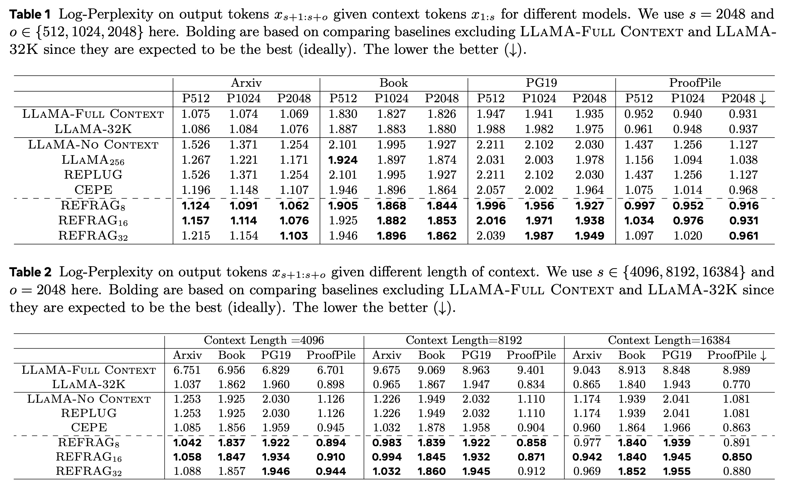

## AI论文解读 | REFRAG: Rethinking RAG based Decoding
        
### 作者        
digoal        
        
### 日期        
2025-10-23        
        
### 标签        
PostgreSQL , PolarDB , DuckDB , AI , 论文解读        
        
----        
        
## 背景  
      
https://arxiv.org/pdf/2509.01092        
  
提示:          
```          
读懂《REFRAG: Rethinking RAG based Decoding》这篇论文需要提前掌握哪些基础知识, 请使用中文通熟易懂的讲解这些基础知识, 可以引用论文中的图、表或使用Markdown支持的图形(text,mermaid等)增加解释性. 
  
使用中文通熟易懂的解读《REFRAG: Rethinking RAG based Decoding》这篇论文, 其中的关键内容请着重讲解, 可以引用论文中的图、表或使用Markdown支持的图形(text,mermaid等)增加解释性. 
  
提取《REFRAG: Rethinking RAG based Decoding》这篇论文中的重要术语, 使用中文对这些术语进行通熟易懂的讲解, 可以引用论文中的图、表或使用Markdown支持的图形(text,mermaid等)增加解释性. 
```     
  
## 1 前置知识 
  
要读懂这篇名为《REFRAG: 重新思考基于 RAG 的解码》的论文 ，你需要先了解几个核心的AI和系统概念。

这篇论文的核心是解决一个非常实际的问题：**当我们给大型语言模型（LLM）喂太多参考资料时，它会变得非常慢** 。

想象一下，你让一个超级聪明的助手写报告（LLM），并且给了他1000页的背景文件（RAG检索到的上下文）。他必须先把这1000页文件全都读一遍（这个过程叫 **Pre-fill** 或 **Prompt Processing**），才能开始写第一个字。这个“读一遍”的过程可能要花很长时间，这就是论文主要想解决的“高延迟”问题 。

以下是你需要掌握的基础知识，我会用通俗的语言和论文中的图表来解释：

### 基础知识一：大语言模型 (LLM) 与 Transformer 架构

这是理解一切的基础。

1.  **什么是大语言模型 (LLM)?**

      * **通俗理解：** 就是像 LLaMA 、GPT-4 这样的“超级大脑”。你给它一段文字（称为提示，Prompt），它能接着往下写（称为生成，Generation）。
      * **论文相关：** 论文使用的是 LLaMA-2-7B 模型作为基础模型（Decoder-only Foundation Model）。

2.  **什么是 Transformer 架构 (和注意力机制)?**

      * **通俗理解：** 这是 LLM 的“思考方式”。当它生成一个新词时，它会回顾（"attend to"）之前读过的所有词，看看哪些词最重要。
      * **论文相关：** 论文观察到，在 RAG 任务中，模型在处理参考资料时，注意力是**稀疏的 (sparse)** 。意思是，模型在生成答案时，可能只关注了1000页资料中的某几句话 ，其他大部分内容都是“噪音”。

3.  **关键瓶颈：KV 缓存 (KV Cache)**

      * **通俗理解：** 这是 LLM 的“短期工作记忆”。模型在处理你的长篇提示（比如1000页资料）时，会把每个词的“关键信息”（Key 和 Value）都算出来并存在一个叫 "KV 缓存" 的地方 。
      * **问题所在：** 你的提示越长，这个“短期记忆”占用的空间（内存）就越大 。而且，在写第一个字之前，它必须把*所有*提示词的 KV 缓存都算一遍（这个过程叫 **Pre-fill**），这个计算量非常大 。

4.  **关键指标：TTFT 和 TTIT (系统延迟)**

      * **TTFT (Time-to-First-Token, 首词时延):** 从你发送请求，到模型吐出*第一个字*所花的时间 。这篇论文**重点优化**的就是这个指标 。对于 RAG，因为提示（检索的文档）很长，TTFT 会非常高 。
      * **TTIT (Time-to-Iterative-Token, 逐词时延):** 模型吐出第一个字之后，生成后续*每一个字*所花的时间 。这个过程通常比较快，因为它只需要利用已经算好的 KV 缓存。

### 基础知识二：RAG (检索增强生成)

这是论文针对的“应用场景”。

1.  **什么是 RAG?**

      * **通俗理解：** LLM 就像一个“开卷考试”的学生。它虽然很聪明（参数里有知识），但没法记住所有最新知识或私有知识。RAG 就是在回答问题前，先去“图书馆”（向量数据库 Vector DB ）检索相关的资料（Context Text ），然后把“问题”和“资料”一起交给 LLM，让它参考着回答 。

2.  **RAG 的工作流程 (Mermaid 图)**

    ```mermaid
    graph TD
        A[用户提问: “美国总统是谁?”] --> B(检索器 Retriever);
        B --> C[向量数据库 Vector DB];
        C --> D[检索到相关文档: “唐纳德·特朗普是美国总统...” 等3篇];
        A & D --> E(拼接成超长提示);
        E --> F[大语言模型 LLM];
        F --> G[生成答案: “根据资料, 唐纳德·特朗普...”];
    ```

3.  **RAG 的问题 (论文的切入点):**

      * RAG 系统为了“宁可错杀，不可放过”，通常会检索回大量文档（比如20篇、50篇）。
      * 如上图 `E` 步所示，`"问题" + "50篇文档"` 会变成一个非常非常长的提示，这导致了 LLM 的“短期记忆” (KV Cache) 爆炸和“读题时间” (TTFT) 超长 。

### 基础知识三：REFRAG 的核心思路 (压缩)

了解了**问题**（LLM 处理长 RAG 上下文很慢）和**场景**（RAG）后，我们来看看 REFRAG 是怎么解决的。

**核心思想：** 与其把 1000 页的*原始文本*喂给 LLM，不如先用另一个“小助手”（Encoder）把这 1000 页资料*压缩*成 50 个“摘要 embedding”（Chunk Embedding），再把这些“摘要”喂给 LLM 。

这就像你不再给助手 1000 页原文件，而是给了他 50 张内容摘要卡片。他读这 50 张卡片（Pre-fill）可比读 1000 页原文快多了 。

**请看论文的图 1，这是理解 REFRAG 的关键：**  

  * **左侧 (传统 RAG 的做法，但被 REFRAG 绕过了):**

      * `Context Text` (检索到的文档)  理论上应该和 `Query` (问题)  一样，被 `Decoder Tokenizer`  切成一个个的词（Token），然后送入 LLM。**但 REFRAG 不这么做。**

  * **右侧 (REFRAG 的新做法):**

    1.  **压缩 (Compress):** `Context Text`  首先被送入一个“轻量级编码器” (Light-weight Encoder) 。
    2.  这个 Encoder 把每“块”（Chunk）文本  压缩成一个单独的“块嵌入” (Chunk Embedding) 。
    3.  **感知 (Sense):** 一个 "RL 训练的策略"  会判断哪些块*特别重要*，需要“展开”(Expand)，即保留原始 token。
    4.  **解码 (Decoding):** 最终，主模型 (Decoder-only Foundation Model)  接收的输入是：
          * `Query` 的原始 Token Embeddings 。
          * 大部分 `Context Text` 的*压缩版* Chunk Embeddings 。
          * 少数重要文本的*原始版* Token Embeddings (图中绿色虚线代表的“展开”)。

**带来的好处 (看论文的图 2 ):**  
由于输入序列变得极短（例如，从 16384 个 token 压缩到 1024 个 "chunk embeddings"），**TTFT (首词时延) 实现了巨大的加速** （图 2 中左图 `TTFT Acceleration` 的 `REFRAG (Cached)` 曲线飙升 ）。

### 基础知识四：模型训练与强化学习 (RL)

这是为了让 REFRAG 的“压缩”能真正起作用。

1.  **Encoder-Decoder 对齐 (Alignment):**

      * **问题：** 主模型 LLaMA (Decoder) 原本只认识“词 token”，它不认识你那个“轻量级 Encoder”  压缩出来的“块 embedding” 。
      * **解决：** 必须训练它们，让 LLaMA 理解这些“摘要卡片”的含义。这个过程叫“持续预训练” (Continual Pre-training, CPT) 。
      * **训练任务：** 比如，让模型看“压缩后的第一段”，然后去预测“原始的第二段” 。

2.  **强化学习 (RL) 与选择性压缩：**

      * **问题：** 如果无脑压缩所有内容，万一“答案”就在某段被“过度压缩”的文字里，导致信息丢失怎么办？
      * **解决：** REFRAG 引入了一个“轻量级 RL 策略” (Light-weight RL-trained chunk expansion policy) 。
      * **通俗理解：** 这个策略网络就像一个“质检员”，它会审查所有的“压缩卡片”（Chunk Embeddings）。它会“感知”哪些卡片信息量太大或太重要，不能压缩，然后下达“展开”(Expand) 指令，让主模型去读这些重要卡片的“原文” 。
      * **训练方式：** 它的目标是最大化“奖励”，这里的“奖励”就是模型预测的准确度（用“困惑度 Perplexity” 来衡量）。

### 总结

要读懂这篇论文，你需要：

1.  **理解 LLM 的瓶颈：** 知道什么是 **KV 缓存** ，以及为什么长上下文会导致 **TTFT**（首词时延） 飙升。
2.  **理解 RAG 的痛点：** 知道 RAG 会检索回大量文档，从而制造出超长的上下文 。
3.  **理解 REFRAG 的方案：** 抓住 **Figure 1** ，明白它用一个**轻量级 Encoder**  把上下文“压缩”成了 **Chunk Embeddings** ，以此缩短输入序列，从而极大降低 TTFT 。  
4.  **理解训练的技巧：** 知道它通过“持续预训练” 来“对齐”压缩器和主模型，并通过 **RL**  来智能地决定哪些内容*不*压缩（选择性展开）。
  
## 2 解读论文 
  
这是一篇来自 Meta 和新加坡国立大学等机构的重磅论文 ，它解决了一个当前大模型应用中**最痛的痛点之一**：

**RAG（检索增强生成）虽然能让模型“开卷考试”，但“读资料”的速度太慢了！**

想象一下，你让AI回答一个问题，AI先去数据库里搜了50篇相关文档（这就是RAG）。现在，AI必须把这50篇文档（可能几万字）和你的问题*一起*读一遍，才能开始生成第一个字 。这个“读题”的过程（专业上叫 **TTFT, Time-to-First-Token**，即“首词时延”）会非常非常慢，严重影响用户体验 。

**REFRAG 的核心贡献一句话总结：**
REFRAG 提出了一套“**压缩-感知-扩展**”  的新框架，它能让 LLM 在处理 RAG 任务时，**TTFT 速度飙升 30.85 倍**，同时**不损失**回答的准确率 。

下面我们来通俗地解读它是如何实现这一惊人效果的。

-----

### 一、 问题的根源：RAG 为什么这么慢？

LLM 在处理输入时，必须为每个词（Token）计算并存储一个“工作记忆”，即 **KV 缓存 (KV Cache)** 。你的输入越长，这个“记忆”就越大，处理它的计算量就越大。

RAG 的问题在于，它把大量检索到的文档（Passages）一股脑儿全塞进了 LLM 的输入中 。


这篇论文敏锐地观察到：

1.  **信息是稀疏的：** 这50篇文档里，可能只有几句话是真正有用的 。
2.  **注意力是稀疏的：** 模型在回答问题时，注意力计算是“分块”的（block-diagonal）。它要么在看“问题”，要么在看“文档A”，要么在看“文档B”，很少会同时看“文档A”和“文档B”的交叉信息（因为它们是独立检索来的，关联性不强）。
3.  **结论：** 让 LLM 对这50篇文档进行完整的、逐词的注意力计算，是**极其浪费**的！

-----

### 二、 REFRAG 的解决方案：“压缩-感知-扩展”

REFRAG 的思路是：别把几万字的“原文”都给 LLM，我们先用一个“小助手”把它们压缩成“摘要卡片”，LLM 只需要读这些卡片就行了。

**这就是论文的 Figure 1  展示的核心架构：**  


**1. 压缩 (Compress)**

  * REFRAG 引入了一个“轻量级编码器” (Light-weight Encoder，比如 RoBERTa) 。
  * 它不把检索到的文档切成一个个的 *Token*，而是切成一个个的 *Chunk*（块，比如 k=16 个 token）。
  * 编码器把**一整个 Chunk** 压缩成**一个单独的“块嵌入” (Chunk Embedding)** 。
  * **效果：** 你的输入长度瞬间被压缩了 k 倍（比如 16 倍）。原本 16384 个 token 的输入，现在变成了 1024 个“块嵌入” + 原始问题。
  * **关键优势：** 这些“块嵌入”是可以**预先计算并缓存 (Precomputable)** 的 。下次再检索到同一篇文档，直接用缓存好的“摘要卡片”，速度飞快。

**2. 感知 (Sense)**

  * 光压缩还不够，万一把关键信息“压坏”了怎么办？
  * REFRAG 训练了一个“**轻量级 RL 策略**”（RL-trained chunk expansion policy）。
  * 这个策略就像一个“质检员”，它会快速“感知”一下所有的“摘要卡片”（块嵌入）。
  * 它会判断：“嗯，第3、第18、第45号卡片信息量很大，可能包含答案，必须看原文！” 。

**3. 扩展 (Expand)**

  * 对于被“质检员”标记的少数重要 Chunk，REFRAG 会“扩展”它们 。
  * “扩展”的意思是：在这些位置上，不使用压缩的“块嵌入”，而是使用**原始的 Token 嵌入**（如图1中绿色虚线所示）。  
  * **最终 LLM 的输入 = 原始问题 + 大部分压缩的“块嵌入” + 少数原始的“Token 块”。**

这个设计太巧妙了：它在不牺牲关键信息的前提下，把输入序列的长度压缩到了极致，从而**从根本上解决了 TTFT 的瓶颈**。

-----

### 三、 REFRAG 是如何“炼成”的？

你不能随便拿个 Encoder 来压缩，然后指望 LLaMA (Decoder) 能看懂 。REFRAG 的成功依赖于一套精心设计的训练方法：

**1. 阶段一：对齐 Encoder 和 Decoder**

  * **任务（Reconstruction Task）：** 先“冻结” LLM (Decoder) 的参数 。然后训练 Encoder，让它压缩一个 Chunk，再让 Decoder 仅凭这个压缩的“块嵌入”就必须能**完美地重建** (Reconstruct) 出原始的 Chunk 。
  * **目的：** 逼迫 Encoder 学会一种 Decoder 能“看懂”的压缩语言。
  * **技巧（Curriculum Learning）：** 这个重建任务很难。REFRAG 使用了“课程学习” ，先从简单的“重建1个块”开始，再到“重建2个块”，最后到“重建 L 个块” 。论文的 Table 11 证明，**没有这个技巧，模型根本学不会** 。  

**2. 阶段二：训练“质检员”（RL 策略）**

  * 对齐之后，开始训练那个“RL 策略” 。
  * **目标：** 策略（质检员）的目标是决定“扩展”哪些块，才能让 LLM 在后续的预测任务中**困惑度 (Perplexity) 最低**（即预测得最准）。
  * **结果：** 如 **Figure 3**  所示，通过 RL 训练的策略（蓝色线）在所有压缩率下，都比“随机选”、“按困惑度升序/降序选”等启发式方法效果更好 。    

-----

### 四、 惊人的实验效果

**1. 速度：TTFT 史诗级加速**

  * 这是最亮眼的结果。请看 **Figure 2**  的左图 (TTFT Acceleration)。    
  * `REFRAG (Cached)` (深蓝色线)  随着输入 Token 数量的增加，加速比（Acceleration） **指数级飙升** 。
  * 在 16384 个 Token 时，`k=16` 的压缩率就实现了 **16.53 倍**的 TTFT 加速 。
  * 当压缩率 `k=32` 时，TTFT 加速达到了 **30.85 倍** ，并且比之前最好的工作 (CEPE) 快了 **3.75 倍** 。

**2. 精度：不降反升！**

  * **基础任务 (Table 1 & 2)** ：    

      * 在衡量模型准确度的“困惑度 (Log-perplexity)”指标上（越低越好），REFRAG (如 `REFRAG_8`, `REFRAG_16`)  全面优于之前的SOTA方法 (CEPE) 。
      * 这证明了 REFRAG 的压缩是**几乎无损**的 。

  * **RAG 应用 (Figure 4 & Table 3)** ：        

      * **同等延迟，性能更优**：在“相同延迟预算”下（比如，LLaMA 只能读 1 篇完整文档，而 REFRAG 可以读 8 篇压缩文档），REFRAG 的性能**反而更高** 。因为它在相同时间内“见多识广”，能从 8 篇文档里提取信息 。
      * **同等文档，延迟更低**：在都读取 10 篇文档时，REFRAG 性能与 LLaMA 持平，但 TTFT 速度快了 **5.26 倍** 。

  * **多轮对话 RAG (Table 4)** ：    

      * 在多轮对话中，上下文会变得越来越长（历史记录 + 新检索的文档）。
      * 普通的 LLaMA 因为上下文窗口（4k）限制，**必须截断 (Truncating) 历史记录**，导致“失忆”，性能严重下降 。
      * REFRAG 可以把长长的历史记录和文档**全部压缩**，保留了完整信息，因此性能远超 LLaMA 。

### 总结

REFRAG 是一项极具工程价值和启发性的工作。它没有去修改 LLM 的核心架构，而是通过“**专业的事让专业的人去做**”的思路：

1.  让“轻量级 Encoder” 专职做**压缩**。
2.  让“RL 策略” 专职做**信息筛选**。
3.  让“LLM (Decoder)” 专职做它最擅长的**文本生成**。

通过这套“压缩-感知-扩展”的流程，REFRAG 解决了 RAG 应用中最大的性能瓶颈（TTFT 延迟），实现了速度和精度的双赢，为在实际生产中部署需要海量知识的 LLM 应用铺平了道路 。
  
## 3 术语 
  
以下是《REFRAG: Rethinking RAG based Decoding》这篇论文中的核心术语及其通俗讲解：

### 1\. RAG (Retrieval-Augmented Generation，检索增强生成)

  * **通俗讲解：** 这是一种让大语言模型（LLM）“开卷考试”的技术 。当模型需要回答问题时，它不再仅仅依赖“背诵”的知识，而是会先去一个外部知识库（比如维基百科或公司的内部文档）检索（Retrieval）相关的资料，然后把这些资料和问题一起作为参考，“增强”（Augmented）它的回答内容（Generation） 。
  * **论文中的问题：** RAG 虽然能提升答案质量，但检索回来的资料（即上下文）通常非常长，导致模型处理速度变得极慢 。

### 2\. KV Cache (键值缓存)

  * **通俗讲解：** 这是大语言模型（LLM）在处理文本时的“短期工作记忆”。当模型逐字生成回答时，它需要不断回顾之前读过的所有内容（包括你的问题和RAG检索的资料）。为了提高效率，它会把每个输入词（Token）的“关键信息”（Key 和 Value）计算出来并存储在一个叫 KV Cache 的地方 。
  * **论文中的问题：** RAG 检索的资料越多，这个“短期记忆”占用的内存（显存）就越大，导致系统吞吐量（Throughput）严重下降 。

### 3\. TTFT (Time-to-First-Token，首词时延)

  * **通俗讲解：** 指的是从你点击“发送”问题，到模型吐出*第一个字*所花费的时间 。
  * **论文中的问题：** 在 RAG 任务中，因为模型在回答前必须先完整读一遍所有检索到的长篇资料（这个过程叫 Pre-fill），导致 TTFT 非常长 。这是 REFRAG 论文**重点优化**的指标 。

### 4\. TTIT (Time-to-Iterative-Token，逐词时延)

  * **通俗讲解：** 指的是模型在吐出第一个字*之后*，生成后续*每一个字*所花费的时间 。这通常比 TTFT 要快。

### 5\. Attention Sparsity (注意力稀疏性)

  * **通俗讲解：** 这是 REFRAG 论文的核心洞察 。在 RAG 任务中，上下文是由一堆**互不相关**的检索文档拼接而成的 。
  * **论文中的观察：** 模型在计算时，一个词（token）只会关注和它*在同一篇文档*里的词，而几乎不会关注*其他文档*里的词 。这种注意力模式是“分块的”（block-diagonal）。
  * **结论：** 这意味着，绝大多数跨文档的注意力计算都是**不必要且浪费的** ，可以被消除 。

### 6\. REFRAG

  * **通俗讲解：** 这是论文提出的新框架名称 。它专门为 RAG 设计，通过**压缩 (Compress)、感知 (Sense) 和 扩展 (Expand)** 的方式来提升解码效率，解决 RAG 的高延迟问题 。

### 7\. Chunk Embedding (块嵌入)

  * **通俗讲解：** 这是 REFRAG 实现“压缩”的核心技术。它不再把原始文档的 *Token* (词) 直接喂给 LLM 。
  * **工作流程：** 如下图所示，它先把文档切成一个个的“块” (Chunk)，然后用一个轻量级编码器 (Light-weight Encoder) 把**一整个块**（比如16个词）压缩成**一个单独的“块嵌入” (Chunk Embedding)** 。
  * **效果：** 这样就把输入序列的长度瞬间压缩了k倍（比如16倍），LLM 需要处理的“短期记忆”（KV Cache）大大减少，TTFT 速度飙升 。


### 8\. Selective Compression (选择性压缩)

  * **通俗讲解：** 这是 REFRAG 实现“感知”和“扩展”的策略。如果一味地压缩所有内容，可能会丢失关键信息。
  * **工作流程：** REFRAG 引入了一个“质检员”——即一个通过 **强化学习（RL）** 训练的轻量级策略 。
  * **功能：** 这个“质检员”会快速判断哪些 Chunk 是“不重要”的，可以安全地用“块嵌入”来**压缩**；哪些 Chunk 是“至关重要”的，必须**扩展** (Expand) 为原始的 Token，让 LLM 仔细阅读 。这在效率和精度之间实现了最佳平衡。

### 9\. CPT (Continual Pre-training, 持续预训练)

  * **通俗讲解：** 这是用来“教会” LLM (Decoder) 如何理解“块嵌入” (Chunk Embedding) 的训练阶段 。
  * **目标：** LLM 原本只认识 Token，不认识这种被压缩过的“块嵌入”。CPT 通过“下一段预测”  等任务，来“对齐” (align) 编码器 (Encoder) 和解码器 (Decoder)，让解码器明白“块嵌入”的含义 。

### 10\. Reconstruction Task (重建任务)

  * **通俗讲解：** 这是 CPT 里的一个关键训练步骤，用来确保“压缩”的质量 。
  * **流程：** 先“冻结” LLM (Decoder) 。然后训练 Encoder，让它压缩一个 Chunk，目标是让 Decoder 仅凭这个压缩的“块嵌入”就必须能**完美地重建** (Reconstruct) 出原始的 Chunk 。
  * **目的：** 确保压缩过程中的信息损失最小 。

### 11\. Curriculum Learning (课程学习)

  * **通俗讲解：** 论文发现，让模型一次性学会重建很长的上下文（比如从几千个词压缩后重建）非常困难 。
  * **流程：** 因此，他们采用了“课程学习” ，即“由易到难”的训练方式。
  * **步骤：** 先从重建 1 个 Chunk 开始，学会了再重建 2 个 Chunk，然后 4 个... 逐渐增加难度 。论文的消融实验证明 (Table 11)，这种方法对于训练成功至关重要 。    
  
## 参考        
         
https://arxiv.org/pdf/2509.01092     
        
<b> 以上内容基于DeepSeek、Qwen、Gemini及诸多AI生成, 轻微人工调整, 感谢杭州深度求索人工智能、阿里云、Google等公司. </b>        
        
<b> AI 生成的内容请自行辨别正确性, 当然也多了些许踩坑的乐趣, 毕竟冒险是每个男人的天性.  </b>        
    
#### [期望 PostgreSQL|开源PolarDB 增加什么功能?](https://github.com/digoal/blog/issues/76 "269ac3d1c492e938c0191101c7238216")
  
  
#### [PolarDB 开源数据库](https://openpolardb.com/home "57258f76c37864c6e6d23383d05714ea")
  
  
#### [PolarDB 学习图谱](https://www.aliyun.com/database/openpolardb/activity "8642f60e04ed0c814bf9cb9677976bd4")
  
  
#### [PostgreSQL 解决方案集合](../201706/20170601_02.md "40cff096e9ed7122c512b35d8561d9c8")
  
  
#### [德哥 / digoal's Github - 公益是一辈子的事.](https://github.com/digoal/blog/blob/master/README.md "22709685feb7cab07d30f30387f0a9ae")
  
  
#### [About 德哥](https://github.com/digoal/blog/blob/master/me/readme.md "a37735981e7704886ffd590565582dd0")
  
  

  
