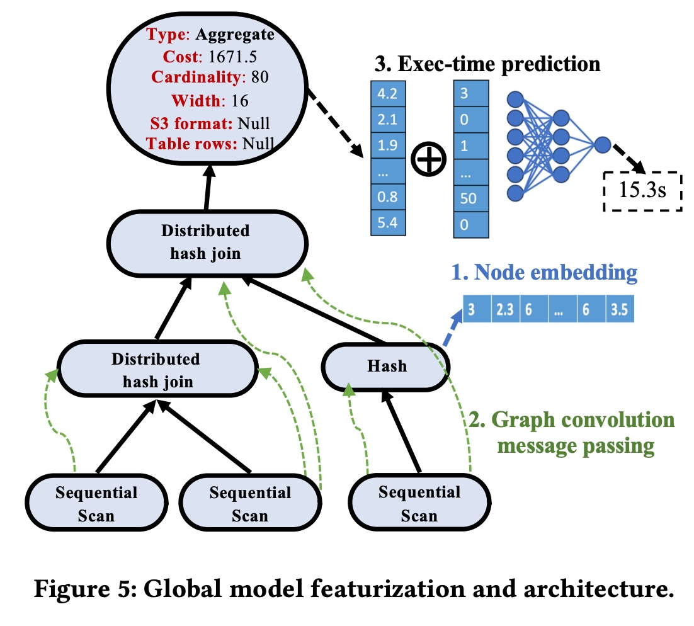
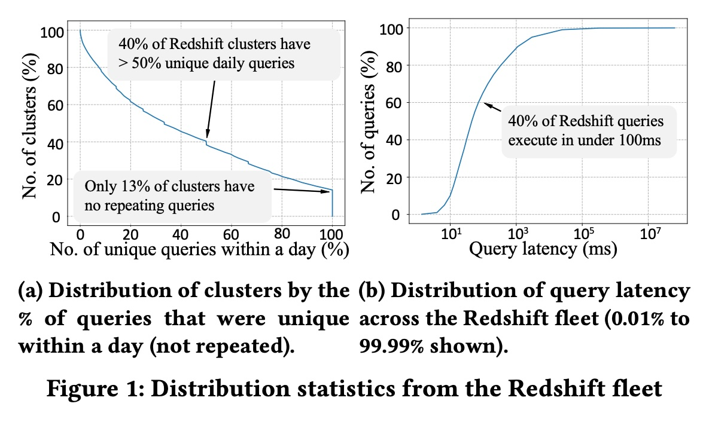
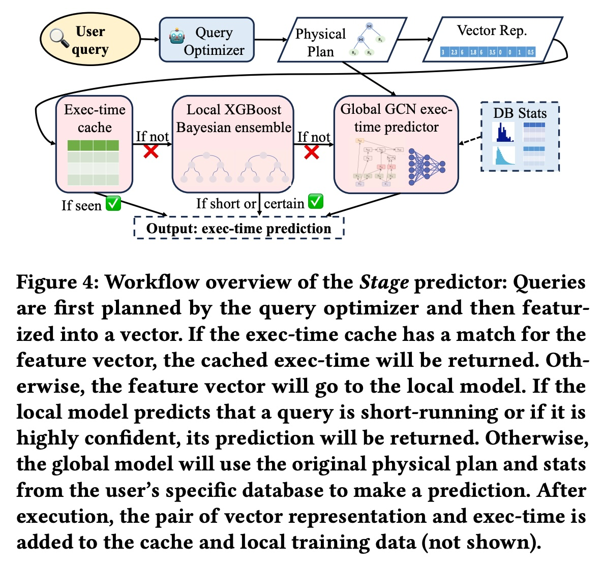
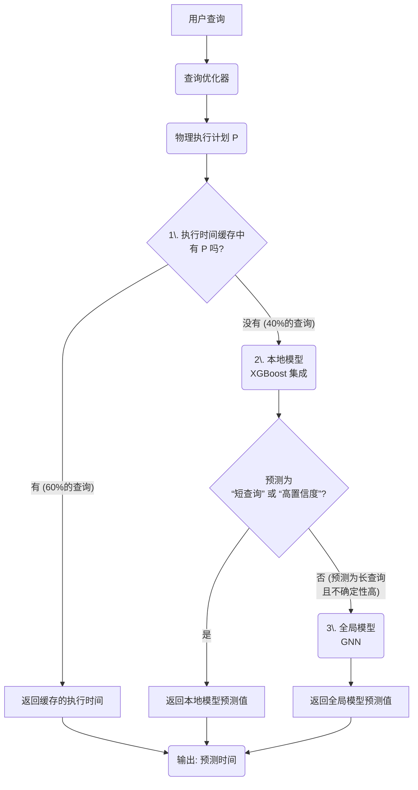
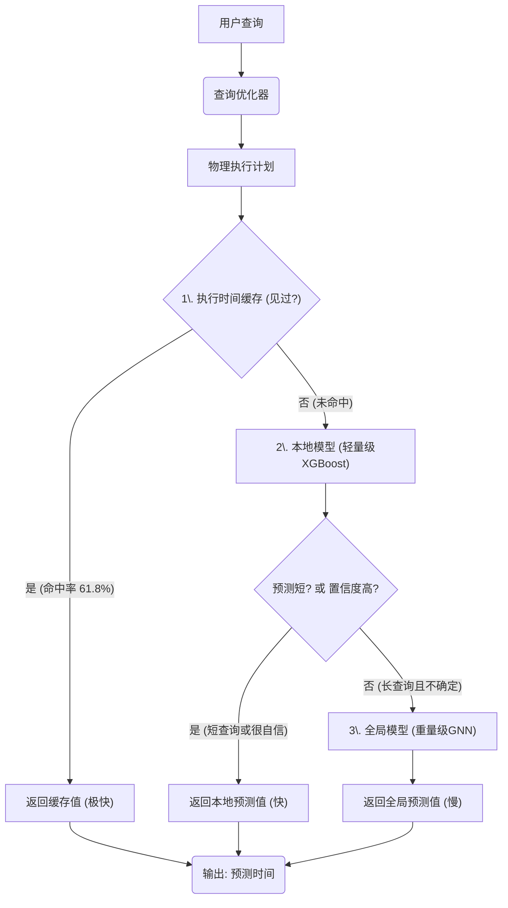
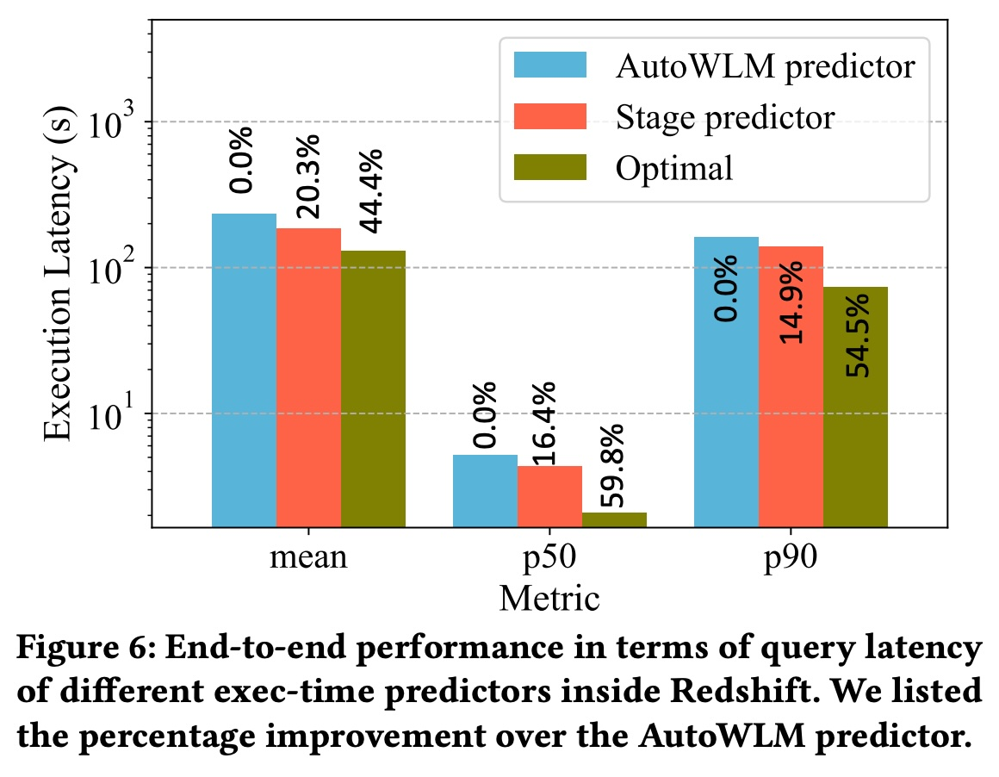
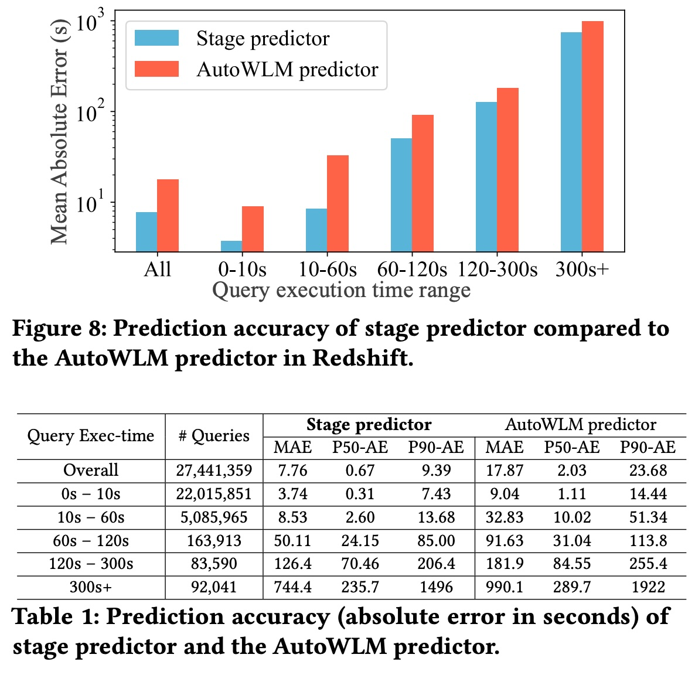
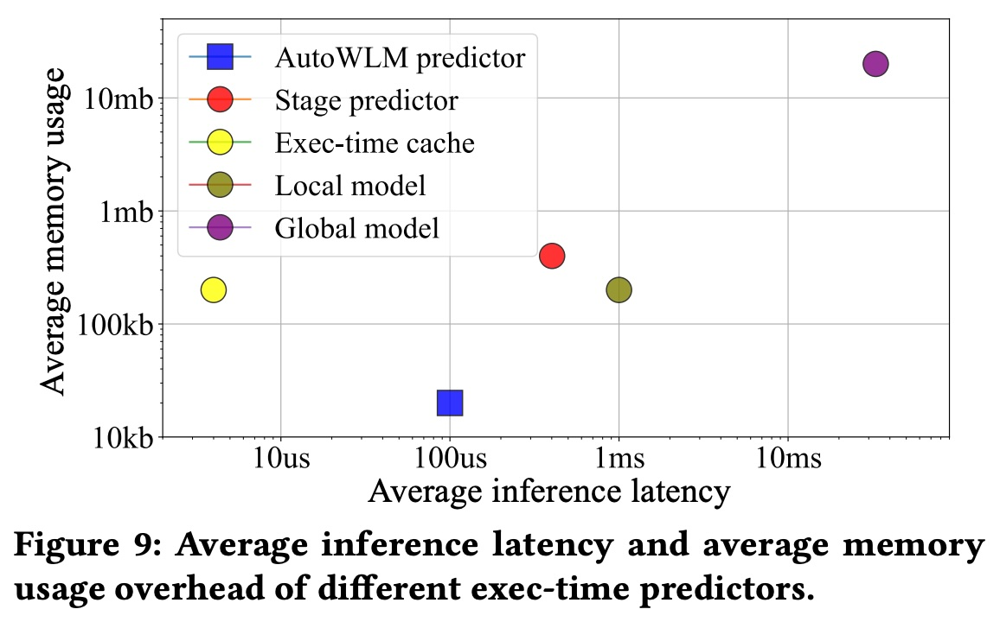
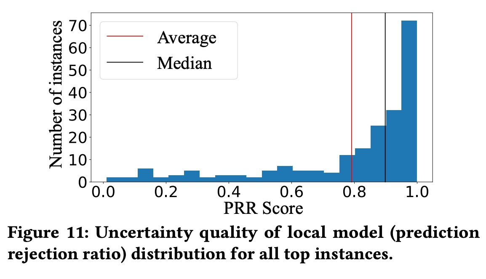

## AI论文解读 | Stage: Query Execution Time Prediction in Amazon Redshift
        
### 作者        
digoal        
        
### 日期        
2025-10-23        
        
### 标签        
PostgreSQL , PolarDB , DuckDB , AI , 论文解读        
        
----        
        
## 背景  
      
https://arxiv.org/pdf/2403.02286        
  
提示:          
```          
读懂《Stage: Query Execution Time Prediction in Amazon Redshift》这篇论文需要提前掌握哪些基础知识, 请使用中文通熟易懂的讲解这些基础知识, 可以引用论文中的图、表或使用Markdown支持的图形(text,mermaid等)增加解释性. 
  
使用中文通熟易懂的解读《Stage: Query Execution Time Prediction in Amazon Redshift》这篇论文, 其中的关键内容请着重讲解, 可以引用论文中的图、表或使用Markdown支持的图形(text,mermaid等)增加解释性. 
  
提取《Stage: Query Execution Time Prediction in Amazon Redshift》这篇论文中的重要术语, 使用中文对这些术语进行通熟易懂的讲解, 可以引用论文中的图、表或使用Markdown支持的图形(text,mermaid等)增加解释性. 
```     
  
## 1 前置知识 
  
要读懂这篇关于亚马逊 Redshift 查询执行时间预测的论文（《Stage: Query Execution Time Prediction in Amazon Redshift》），你需要对数据库系统、机器学习和一些基础的系统设计概念有一定的了解。

这篇论文的核心思想是构建一个 **分层（Stage）** 的预测模型 ，它像一个多级筛网，用不同复杂度和速度的模型来处理不同的查询，从而在保证极快预测速度的同时，提高整体的预测准确性。

以下是你需要提前掌握的基础知识，我会用通俗的语言为你讲解：

### 1\. 数据库基础：一条 SQL 是如何被执行的？

这是理解这篇论文**最重要**的基础。当你在数据库中（如 Amazon Redshift）输入一条 SQL 查询语句时，它并不是马上就被执行的。

  * **查询优化器 (Query Optimizer):** 你可以把它想象成数据库的“大脑”。它会分析你的 SQL，并决定执行这条查询的“最佳路线”。

  * **物理执行计划 (Physical Execution Plan):** 这就是“最佳路线”的蓝图。它是一个树状结构，详细说明了数据库应该按什么顺序、用什么算法（例如，是先扫描 A 表还是先扫描 B 表？两个表连接时是用哈希连接还是嵌套循环连接？）来获取数据。

      * 这篇论文的**所有预测模型**，其核心输入就是这个“物理执行计划” 。
      * 论文中的**图 5**  就展示了一个物理执行计划的例子，它包含了“Sequential Scan”（顺序扫描）、“Hash”（哈希）和“Distributed hash join”（分布式哈希连接）等操作节点。    

  * **工作负载管理器 (Workload Manager, WLM):** 你可以把它看作“交通警察”。Redshift 作为一个大型云数据仓库，会同时收到成千上万的查询。WLM 的职责就是管理这些查询 。

      * **WLM 极度依赖时间预测**：它需要知道一个查询“估计要跑多久”，才能做出关键决策 。例如：
          * 这是个“短查询”（如 1 秒）还是“长查询”（如 10 分钟）？
          * WLM 会把它们分配到不同的队列（“快车道”和“慢车道”）。
          * **如果预测错了**：一个“长查询”被误判为“短查询”，它就会堵塞“快车道”，导致后面所有真正的短查询变慢 。这就是论文要解决的核心痛点。

  * **OLAP (联机分析处理):** Redshift 是一个“云数据仓库” ，属于 OLAP 系统。与你平时可能接触的交易型数据库（OLTP，如银行转账）不同，OLAP 专门处理复杂的分析查询（例如“统计过去一年所有商品的销售额”），查询通常很慢，但对重复查询的优化（如下文的缓存）非常重要。

### 2\. 机器学习基础：预测是怎么“猜”出来的？

论文里的“预测器”就是一个机器学习模型。你需要了解以下几个基本概念：

  * **特征工程 (Featurization):** 机器学习模型不认识“物理执行计划”这种树状图。你需要把它转换成模型能“吃”的数字，这个过程就叫特征工程。
      * 论文中提到，它们会把执行计划“扁平化”(flatten) 成一个 33 维的向量 。这个向量就是模型的“特征”。
  * **推理延迟 (Inference Latency):** 指模型做出一次预测所花费的时间 。
      * **这是本文的关键挑战**：如论文中的**图 1b**  所示，Redshift 中 40% 的查询执行时间**低于 100 毫秒** 。    
      * 如果你的预测模型自己就要跑 50 毫秒，那对于一个总共才 30 毫秒的查询来说，这个预测就毫无意义，反而拖慢了系统 。
  * **冷启动 (Cold Start):** 当一个新数据库实例（或新集群）刚启动时，它没有历史查询数据。没有数据，模型就没法训练，导致预测非常不准 。

### 3\. 核心模型知识：XGBoost 和 GNN

这篇论文用了两种截然不同的机器学习模型，分别用在“本地模型”和“全局模型”中。

  * **XGBoost (极限梯度提升树):**
      * 你可以把它理解为一种“超级增强版”的决策树模型。它非常快，效果好，是业界处理表格数据（就像那个 33 维向量）的利器 。
      * 在论文中，它被用作“轻量级本地模型” (lightweight local model) 。它训练在*单个*数据库实例上，因此是“实例优化”的 。
  * **GNN (图神经网络) / GCN (图卷积网络):**
      * **为什么需要 GNN？** 因为 XGBoost 吃的那个“扁平化向量”  丢失了物理执行计划的*结构信息*。
      * GNN 是一种专门处理“图”结构（或“树”结构）数据的神经网络 。
      * 如**图 5**  所示，GNN 可以通过“消息传递”  来理解节点（如 "Scan"）和它的父节点（如 "Join"）之间的复杂关系。    
      * 在论文中，它被用作“复杂的全局模型” (complex global model) 。它非常重（预测慢），但在所有 Redshift 实例上训练，知识更“通用”，能处理本地模型没见过的查询 。

### 4\. 统计与系统知识：缓存和不确定性

  * **缓存 (Cache):**
      * 这是一个基础的计算机概念：把常用结果存起来，下次再用就快了。
      * **这是论文的第一个“Stage”** ：一个“执行时间缓存” (Exec-time cache) 。
      * **为什么有效？** 如**图 1a**  所示，Redshift 中重复查询非常多（平均 60% 的查询在 24 小时内重复出现）。对于这些查询，直接从缓存里读取上次的执行时间，是最快最准的 。    
  * **不确定性 (Uncertainty):**
      * 只预测一个“点估计”（例如“10 秒”）是不够的。WLM（交通警察）更想知道：“你有多大把握？”
      * 是“10 ± 1 秒”（非常确定），还是“10 ± 30 秒”（非常不确定）？
      * **贝叶斯集成 (Bayesian ensemble):** 这是论文中本地模型（XGBoost）用来提供不确定性的技术 。
      * **通俗理解**：你不是只训练 1 个 XGBoost 模型，而是*独立训练 10 个* 。当一个新查询来了，你问这 10 个模型：
          * 如果它们答案很接近（如 9s, 10s, 9.5s, 10.1s...），说明模型很“自信”，**不确定性低** 。
          * 如果它们答案天差地别（如 5s, 20s, 50s, 8s...），说明模型很“困惑”，**不确定性高** 。
      * 这个“不确定性”是驱动 Stage 预测器从一个阶段跳到下一个阶段的关键。

### 总结：Stage 预测器的工作流程

掌握了以上知识后，你就可以理解论文的**图 4**  所展示的完整流程了：   



简单来说，这篇论文的创新点在于设计了一个三级火箭：

1.  **一级火箭（缓存）：** 用最快的方式（缓存）解决最简单的问题（重复查询）。
2.  **二级火箭（本地 XGBoost）：** 用一个很快的模型（XGBoost）解决大部分常规问题（非重复但相似的查询），并提供“不确定性”。
3.  **三级火箭（全局 GNN）：** 只在二级火箭没把握时，才启动那个最强大但最慢的模型（GNN）来解决疑难杂症 。

通过这种方式，Stage 预测器在整体上（平均）获得了极低的预测延迟 ，同时又比单独使用任何一个模型都要准确 。
  
## 2 解读论文 
  
这是一篇来自亚马逊（Amazon Web Services）和 MIT 的学者共同撰写的工业界论文 ，介绍了一种他们为云数据仓库 Amazon Redshift 设计的新型查询执行时间预测器，名为 **Stage** 。

这篇论文的核心思想是： **“好钢用在刀刃上”** 。

面对海量的查询，我们不需要用一个“重量级”的复杂模型去预测*所有*查询。相反，我们应该构建一个 **分层（Hierarchical）** 的预测系统 ：

1.  用最快、最廉价的方式（缓存）处理掉最简单、最常见的查询。
2.  用一个轻量级、速度快的模型处理掉大部分“正常”的查询。
3.  只在最后，当遇到真正“疑难杂症”的查询时，才调用那个最强大、但也最昂贵的复杂模型。

通过这种“分级诊疗”的方式，Stage 预测器在整体上实现了**高准确率**和**极低的平均预测延迟** ，最终将 Redshift 上用户的平均查询延迟降低了 20% 。

-----

### 1\. 为什么“预测查询时间”如此重要？

在 Redshift 这样的数据仓库中，预测一个查询“将要执行多久”是至关重要的 。这篇论文提到了一个关键应用：**工作负载管理器 (Workload Manager, WLM)** 。

你可以把 WLM 想象成一个 **“超市收银台的调度员”** 。

  * WLM 需要根据“预测时间”，把查询分为“短查询”（比如10秒）和“长查询”（比如10分钟） 。
  * 它会把“短查询”送到“快速通道”（专用资源），把“长查询”送到“普通通道” 。

**如果预测错了，后果会很严重：**

1.  **错把“长查询”当“短查询”：** 你把一个装满购物车的人（长查询）错误地引到了“10件物品以下”的快速通道。他会堵住整个通道，导致后面所有只买一瓶水的人（短查询）长时间排队 。这叫“队头阻塞 (head-of-line blocking)”。
2.  **错把“短查询”当“长查询”：** 你把一个只买一瓶水的人（短查询）错误地引到了全是购物车的普通通道。他本该 10 秒钟就结账走人，结果可能要排队几分钟 。

亚马逊之前在 Redshift 中使用的预测器（AutoWLM 预测器）是一个轻量级的 XGBoost 模型 。但它存在冷启动问题（新集群没数据）、不够准确 、并且在数据或工作负载变化时预测不稳定 。

### 2\. 设计 Stage 预测器的两个关键挑战

论文作者通过分析 Redshift 的真实数据，发现了两个关键的挑战，这也直接催生了 Stage 的设计：

  * **挑战1：大量查询“快得离谱”**
    如 **图 1(b)** 所示，Redshift 中 **40% 的查询执行时间都低于 100 毫秒** ！     
    这意味着，如果你用一个很牛的深度学习模型，但这个模型“思考”（推理）一次就需要 50 毫秒 ，那么对于一个总共才 30 毫秒的查询，你的预测不仅没用，反而成了最大的性能瓶颈 。
    **结论：预测模型的“推理延迟”必须极低。**

  * **挑战2：大量查询是“老面孔”**
    如 **图 1(a)** 所示，Redshift 的客户经常重复提交查询（例如刷新仪表盘） 。平均来看，**超过 60% 的查询**在过去 24 小时内都出现过一模一样的 。
    **结论：必须利用好这种重复性。**

> *图解：左图 (a) 显示大多数集群的“每日唯一查询”比例远低于 100%，意味着大量查询是重复的 。右图 (b) 显示查询延迟（横轴）的累积分布，在 100ms 处有一个陡峭的爬升，说明 40% 的查询都快于 100ms 。*

### 3\. Stage 预测器的三级火箭设计

基于以上挑战，论文设计了 Stage 预测器，它由三个“状态”或“关卡”组成 。

我们可以用下面这张流程图（改编自论文中的图 4 ）来理解它的工作流：     



下面我们来拆解这三个关卡：

#### 关卡 1：执行时间缓存 (Exec-time Cache)

  * **作用：** 专门处理“老面孔”查询（挑战 2） 。
  * **如何工作：** 它是一个哈希表 。当一个查询的执行计划被计算出来后，系统会用它的特征向量作为 Key 。
      * **命中 (Hit)：** 如果在缓存中找到了这个 Key，说明这个查询最近执行过。系统会直接返回一个基于历史执行时间（比如，80% 的历史平均值 + 20% 的最近一次值）的预测 。
      * **未命中 (Miss)：** 如果没找到，则进入下一关卡 。
  * **性能：** 这一关处理了 **61.8%** 的查询 。它的速度是微秒级（μs）的，几乎没有开销 。

#### 关卡 2：本地模型 (Local Model)

  * **作用：** 处理“新面孔”或“有点像的”查询。它被设计为一个“模糊缓存 (fuzzy cache)” 。
  * **如何工作：** 这是一个在**单个客户实例上**训练的轻量级模型 。
      * **模型：** 采用“贝叶斯 XGBoost 集成” 。简单说，它不是训练 1 个 XGBoost，而是独立训练 10 个 。
      * **关键能力：提供“不确定性” (Uncertainty)** 。当一个新查询来了，它让这 10 个模型分别预测：
          * 如果 10 个模型的预测值都差不多（比如 4.5s, 5.1s, 4.9s），说明模型很“自信”，**不确定性低** 。
          * 如果 10 个模型的预测值天差地别（比如 5s, 20s, 90s），说明模型很“懵”，**不确定性高** 。
  * **决策：** 如果本地模型预测查询很“短”，或者虽然“长”但它很“自信”（不确定性低），系统就采纳它的预测 。否则，进入下一关卡 。

#### 关卡 3：全局模型 (Global Model)

  * **作用：** 这是最后的“专家会诊”，专门处理本地模型搞不定的“疑难杂症” 。
  * **如何工作：** 这是一个在**所有 Redshift 实例**的海量数据上训练的超大模型 。
      * **模型：** 采用**图卷积网络 (GCN/GNN)** 。
      * **为什么用 GNN？** 因为 GNN 能真正“读懂”查询执行计划的树状结构（如**图 5** 所示），理解各个操作（如 Join, Scan）之间的复杂依赖关系 ，而不仅仅是看一个扁平化的向量。     
  * **性能：** 这个模型非常准，但也非常慢。它的推理延迟可能高达 100 毫秒 。
  * **关键点：** 这个模型**极少被调用** 。只有当本地模型对一个（它认为的）长查询感到“不确定”时，系统才会启用它 。

### 4\. 实验效果：Stage 真的有用吗？

论文通过在 Redshift 生产环境中的模拟实验证明了 Stage 的巨大成功。

  * **端到端性能提升 (图 6)**     
    这是最重要的结论。通过将原有的 AutoWLM 预测器换成 Stage 预测器，Redshift 集群的**平均查询延迟降低了 20.3%** 。这证明了更准的预测实实在在地转化为了用户体验的提升。

  * **预测准确性 (图 8 & 表 1)**    
    Stage 预测器比原有的 AutoWLM 预测器准确得多。

      * **平均绝对误差 (MAE)：** Stage (7.76秒) 远低于 AutoWLM (17.87秒) 。准确度提升超过 2 倍 。
      * **对 0-10 秒的短查询：** Stage (MAE 3.74秒) 更是远胜 AutoWLM (MAE 9.04秒) 。这对解决“队头阻塞”问题至关重要。

  * **开销的权衡 (图 9)**    
    这张图完美地展示了 Stage 的设计哲学。

      * `AutoWLM predictor` (蓝色)：原模型，非常快 (约 100μs)，非常小 。
      * `Exec-time cache` (黄色)：最快 (约 5μs) 。
      * `Local model` (绿色)：比 AutoWLM 慢 10 倍 (约 1ms)，因为它有 10 个模型 。
      * `Global model` (紫色)：非常慢 (约 30ms)，非常大 。
      * `Stage predictor` (红色)：这是最终的 **“摊销” (Amortized) 开销** 。由于 60% 的查询被缓存（黄色）处理，剩下的绝大多数被本地模型（绿色）处理，昂贵的全局模型（紫色）极少被调用（仅 3% 的情况） 。
      * **最终结果：** Stage 预测器的平均延迟 (约 500μs) 仍然处于亚毫秒级 ，内存开销也很小 ，完全可以在生产环境的“关键路径”上使用。

> *图解：横轴是平均推理延迟（越左越快），纵轴是平均内存使用（越下越小）。Stage 预测器（红点）的综合开销远低于最慢的全局模型（紫点），非常接近轻量级的本地模型（绿点），证明了分层设计的成功 。*

### 总结

《Stage》这篇论文提供了一个在工业界大规模、低延迟系统中落地复杂机器学习模型的绝佳范例。它最大的启示是，**不要试图用一个模型解决所有问题**。通过构建一个分层的系统，将缓存的“确定性”、轻量级模型的“速度”和重量级模型的“智能”相结合，Stage 预测器在不牺牲性能的前提下，显著提升了预测准确性，为数百万的 Redshift 查询带来了 20% 的平均延迟降低 。
  
## 3 术语 
  
以下是论文《Stage: Query Execution Time Prediction in Amazon Redshift》中的重要术语及其通俗讲解：

### 核心问题与系统

1.  **Query Execution Time Prediction (查询执行时间预测)**

      * **讲解:** 这是本文要解决的核心问题。通俗地说，就是在一条数据库查询（Query）真正开始执行之前，提前估算出它大概需要运行多长时间 。
      * **为什么重要:** 这个预测对现代数据库的许多“下游任务” (downstream tasks) 都至关重要 。例如，Amazon Redshift  需要这个预测值来进行查询调度、资源分配  和自动创建物化视图  等。

2.  **Amazon Redshift**

      * **讲解:** 亚马逊（Amazon Web Services）提供的一种云数据仓库服务 。这篇论文提出的 `Stage` 预测器就是专门为 Redshift 的特性和挑战设计的 。

3.  **Workload Manager (WLM) (工作负载管理器)**

      * **讲解:** Redshift 中一个负责管理和调度所有查询的组件 。WLM 会使用“查询执行时间预测”的结果，来决定是立即执行一个查询、让它排队等待，还是把它分配到特定的队列（例如“短查询队列”或“长查询队列”）。一个坏的预测（如把长查询误判为短查询）会导致队列阻塞 (head-of-line blocking)，严重影响系统性能 。

-----

### 论文提出的方案：Stage 预测器

1.  **Stage Predictor (Stage 预测器)**

      * **讲解:** 论文提出的一种新颖的、**分层的 (hierarchical)** 执行时间预测器 。它不是一个单一的模型，而是由三个不同模型（或状态）组成的系统 ，旨在系统性地平衡准确性 (optimality)、实例优化 (instance-optimization) 和知识迁移 (transferable knowledge) 。

2.  **Hierarchical Architecture (分层架构)**

      * **讲解:** Stage 预测器的核心设计。当一个新查询抵达时，它会按顺序经过三个“阶段”，如下面的流程图所示。这种设计旨在用最快的速度处理大多数查询（尤其是重复查询），只在必要时才调用更复杂、更慢的模型 。

    

    ```mermaid
    graph TD
        A(新查询抵达) --> B{查询是否在缓存中?};
        B -- 是 (命中, 占 60% 查询 ) --> C["1\. 执行时间缓存 (Exec-time cache)<br>返回缓存的执行时间"];
        B -- 否 (未命中) --> D["2\. 轻量级本地模型 (Local model)<br>进行预测并估算不确定性"];
        D --> E{预测是否为短查询? <br>或 不确定性是否很低?};
        E -- 是 --> F[返回本地模型预测结果];
        E -- 否 (不确定或预测为长查询) --> G["3\. 复杂全局模型 (Global model)<br>进行高精度但耗时较长的预测"];
        G --> H[返回全局模型预测结果];
        C --> I(输出: 预测时间);
        F --> I;
        H --> I;
    ```

3.  **Exec-time cache (执行时间缓存)**

      * **讲解:** Stage 的第一层 。它非常简单，就是“记住”最近执行过的查询及其真实的执行时间 。
      * **作用:** 论文观察到 Redshift 中约 60% 的查询是 24 小时内重复执行的 。当一个新查询与缓存中的查询完全一致时，直接返回缓存中的时间 。
      * **优点:** 速度极快（推理延迟仅几微秒 ），并且覆盖了大多数查询。

4.  **Local model (本地模型)**

      * **讲解:** Stage 的第二层 。这是一个轻量级的模型，它在**单个**数据库实例上训练，专门针对该实例的工作负载和数据进行了优化 。论文中它被实现为“XGBoost 模型的贝叶斯集成” (Bayesian ensemble of XGBoost models) 。
      * **作用:** 当查询未命中缓存时，由本地模型接管 。它不仅能预测时间，还能提供一个“不确定性度量” (uncertainty measurement) ，即它对自己的预测有多大把握。

5.  **Global model (全局模型)**

      * **讲解:** Stage 的第三层，也是最后一道防线 。这是一个复杂的、可迁移的 (transferable) 模型 ，它在 Redshift **所有**实例的大量多样化数据上统一训练而成 。
      * **作用:** 只有当本地模型表示“没把握”（不确定性高）并且认为查询可能是长查询时，才会调用这个模型 。它以查询的“物理执行计划树” (physical execution plan) 为输入，使用图神经网络 (GNN)  进行预测。
      * **优缺点:** 准确性高，泛化能力强，能解决“冷启动”问题 。但推理延迟也较长（可达 100ms ），因此不能用于所有查询。

-----

### 关键问题与概念

1.  **Cold start (冷启动)**

      * **讲解:** 预测器面临的一个典型问题。指当一个数据库实例是全新的，或者刚开始使用，几乎没有历史查询数据可供训练时，预测器无法做出准确估算 。
      * **解决方案:** Stage 预测器通过“全局模型”来解决这个问题。因为全局模型是跨实例训练的，不依赖当前实例的历史数据，所以即使在新实例上也能做出合理预测 。

2.  **Inference latency (推理延迟)**

      * **讲解:** 指模型进行一次预测所需的时间 。
      * **挑战:** 这是一个关键约束。论文中图 1b 显示，Redshift 中 40% 的查询执行时间都不到 100ms 。如果预测器本身的延迟就有 50-100ms ，那么预测时间比执行时间还长，这是无法接受的 。    
      * **解决方案:** Stage 的分层设计通过缓存和轻量级本地模型处理了绝大多数查询，将昂贵的全局模型调用频率降到最低（约 3% 的时间 ），从而实现了极低的“摊销” (amortized) 推理延迟 。

3.  **Uncertainty measurement (不确定性度量)**

      * **讲解:** 本地模型的一个重要功能，即评估预测的可信度 。本地模型会估算两种不确定性：
      * **Model uncertainty (模型不确定性):** 表示模型对见过的训练数据是否足够。如果新查询与训练数据差异很大，模型不确定性就高 。
      * **Data uncertainty (数据不确定性):** 表示数据本身的“噪声” 。例如，同一个查询在不同系统负载下（如并发状态不同）执行，真实时间也会不同 。

-----

### 评估指标

1.  **End-to-end evaluation (端到端评估)**

      * **讲解:** 论文中用于评估预测器实际效果的方法 。它不是只比较“预测时间”和“真实执行时间”的差距，而是通过模拟器 ，评估换上新预测器后，整个系统（包括 WLM 调度、排队等待时间）的 **总查询延迟** (query latency) 能降低多少 。
      * **结果:** 如图 6 所示，Stage 预测器相比 Redshift 原有的 AutoWLM 预测器，平均端到端延迟降低了 20.3% 。    

2.  **Absolute Error (AE) (绝对误差)**

      * **讲解:** 评估准确性的直接指标，即 `| 真实执行时间 - 预测执行时间 |` 。论文中的图 8 和表 1 展示了 Stage 预测器在不同时间范围内的平均绝对误差 (MAE)、中位数绝对误差 (P50-AE) 和 90百分位绝对误差 (P90-AE) 。    

3.  **Q-Error**

      * **讲解:** 一种常用的**相对**误差指标 。计算公式为 `max(预测值/真实值, 真实值/预测值)` 。这个值永远大于等于 1，越接近 1 代表预测越准 。

4.  **Prediction-Rejection Ratio (PRR) (预测拒绝率)**

      * **讲解:** 一个专门用于评估“不确定性度量”是否可靠的指标 。
      * **逻辑:** 它衡量了“模型预测的不确定性”与“实际发生的预测误差”之间的相关性 。通俗地说，如果模型预测“不确定性高”的查询，实际误差也确实很大，而模型“很自信”的预测，实际误差也很小，那么 PRR 分数就高（接近 1）。
      * **结果:** 图 11 显示，Stage 的本地模型在中位数实例上的 PRR 得分达到了 0.9 ，说明其不确定性度量非常可靠。    
  
## 参考        
         
https://arxiv.org/pdf/2403.02286  
  
https://rmarcus.info/blog/         
        
<b> 以上内容基于DeepSeek、Qwen、Gemini及诸多AI生成, 轻微人工调整, 感谢杭州深度求索人工智能、阿里云、Google等公司. </b>        
        
<b> AI 生成的内容请自行辨别正确性, 当然也多了些许踩坑的乐趣, 毕竟冒险是每个男人的天性.  </b>        
    
#### [期望 PostgreSQL|开源PolarDB 增加什么功能?](https://github.com/digoal/blog/issues/76 "269ac3d1c492e938c0191101c7238216")
  
  
#### [PolarDB 开源数据库](https://openpolardb.com/home "57258f76c37864c6e6d23383d05714ea")
  
  
#### [PolarDB 学习图谱](https://www.aliyun.com/database/openpolardb/activity "8642f60e04ed0c814bf9cb9677976bd4")
  
  
#### [PostgreSQL 解决方案集合](../201706/20170601_02.md "40cff096e9ed7122c512b35d8561d9c8")
  
  
#### [德哥 / digoal's Github - 公益是一辈子的事.](https://github.com/digoal/blog/blob/master/README.md "22709685feb7cab07d30f30387f0a9ae")
  
  
#### [About 德哥](https://github.com/digoal/blog/blob/master/me/readme.md "a37735981e7704886ffd590565582dd0")
  
  

  
