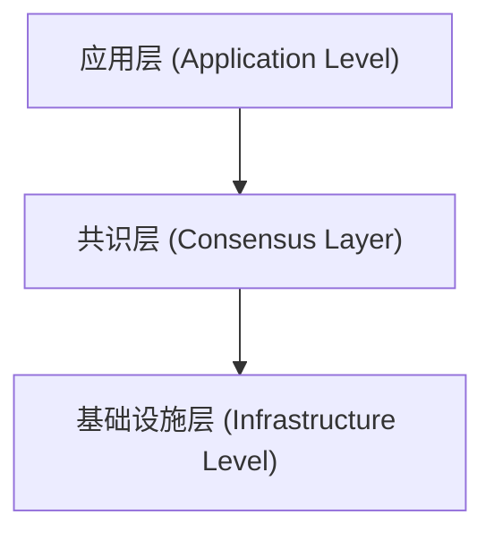
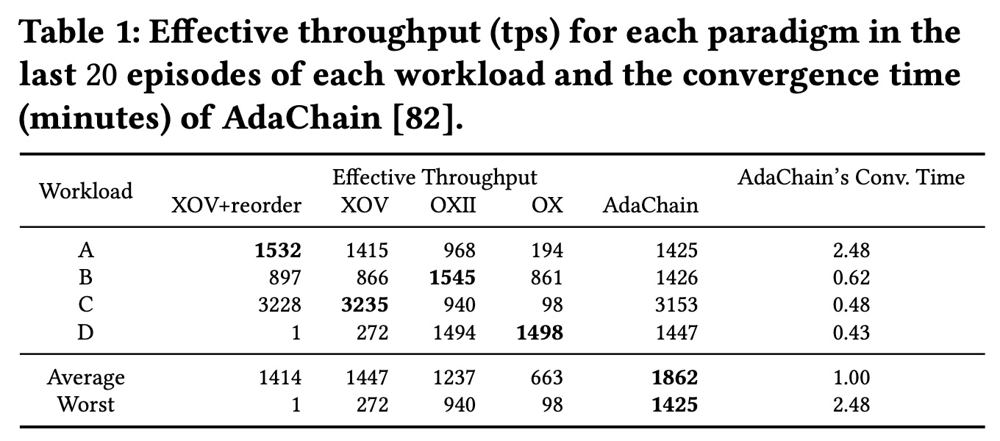
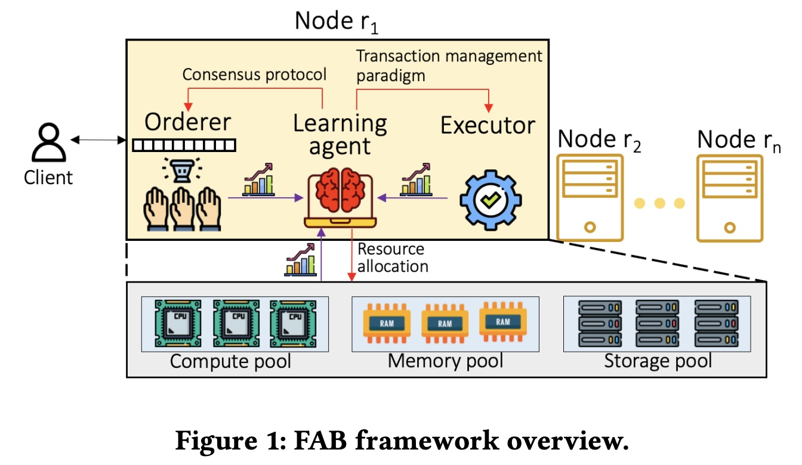
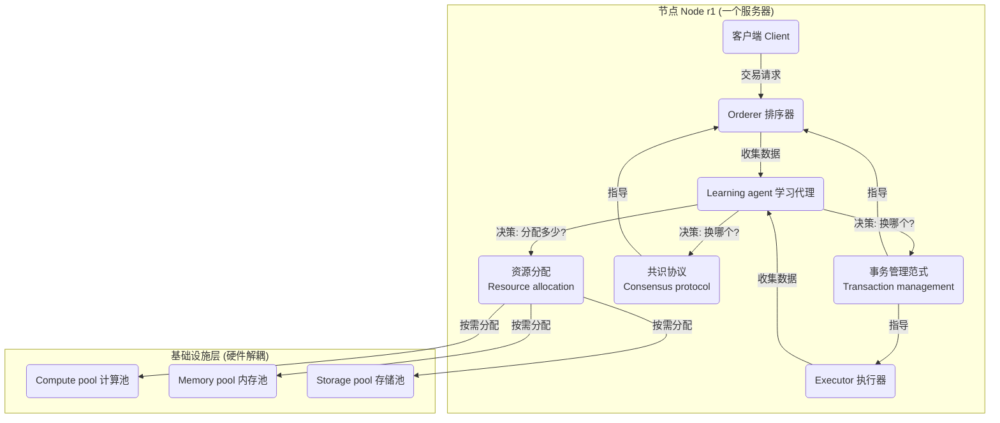
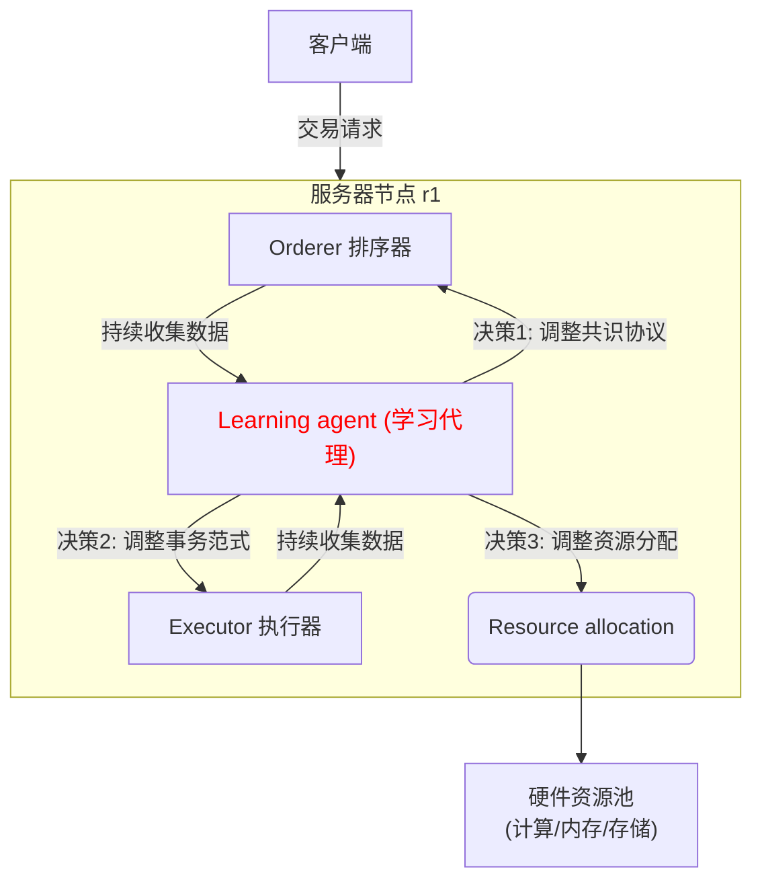

## AI论文解读 | Towards Full Stack Adaptivity in Permissioned Blockchains
        
### 作者        
digoal        
        
### 日期        
2025-10-23        
        
### 标签        
PostgreSQL , PolarDB , DuckDB , AI , 论文解读        
        
----        
        
## 背景  
      
https://www.vldb.org/pvldb/vol17/p1073-wu.pdf        
  
提示:          
```          
读懂《Towards Full Stack Adaptivity in Permissioned Blockchains》这篇论文需要提前掌握哪些基础知识, 请使用中文通熟易懂的讲解这些基础知识, 可以引用论文中的图、表或使用Markdown支持的图形(text,mermaid等)增加解释性. 
  
使用中文通熟易懂的解读《Towards Full Stack Adaptivity in Permissioned Blockchains》这篇论文, 其中的关键内容请着重讲解, 可以引用论文中的图、表或使用Markdown支持的图形(text,mermaid等)增加解释性. 
  
提取《Towards Full Stack Adaptivity in Permissioned Blockchains》这篇论文中的重要术语, 使用中文对这些术语进行通熟易懂的讲解, 可以引用论文中的图、表或使用Markdown支持的图形(text,mermaid等)增加解释性. 
```     
  
## 1 前置知识 
  
读懂这篇《Towards Full Stack Adaptivity in Permissioned Blockchains》（迈向许可链的全栈自适应） 的论文, 你需要对计算机科学中的几个关键领域有基本的了解。这篇论文的核心思想是构建一个“聪明”的、能自我调整的区块链系统 , 它能根据工作负载 、硬件变化 、甚至恶意攻击  来自动优化自己的“全栈”配置。

以下是理解这篇论文所需的基础知识, 我们会用通俗的语言来解释:

### 1\. 基础概念：什么是“许可链” (Permissioned Blockchain)？

  * **区块链 (Blockchain):** 你可以把它想象成一个分布式的、不可篡改的“公共账本” 。一旦信息被写入, 就很难被修改。
  * **许可链 (Permissioned):** 与比特币这样的“公有链”（任何人都可以参与）不同, “许可链”是“有准入许可的” 。只有被授权的参与者（比如一个联盟中的几家公司）才能加入网络 。
  * **论文的视角:** 论文将许可链视为一种特殊的 **“不可信分布式数据库”**  (untrustworthy distributed database) 。"分布式"意味着数据存储在多台机器上；"不可信"意味着你不能假设所有机器都是诚实或正常的 。

### 2\. 核心挑战：什么是“拜占庭容错” (BFT)？

这是理解论文“不可信”环境的关键。

  * **问题背景 (拜占庭将军问题):** 想象一群拜占庭将军带领军队围攻一座城市。他们必须通过信使沟通, 决定是“进攻”还是“撤退”。但问题是, 将军中可能有“叛徒”。
      * 如果忠诚的将军们不能达成一致（比如一半进攻一半撤退）, 他们就会失败。
      * 叛徒会故意发送错误信息（比如对A说“进攻”, 对B说“撤退”）来扰乱大局。
  * **BFT (Byzantine Fault-Tolerant):** 这就是解决上述问题的技术 。在区块链中, 节点（服务器）就像是将军, 它们需要对交易的顺序达成一致。BFT协议确保即使网络中存在少数“叛徒”节点（它们可能崩溃、延迟、或故意作恶）, 整个系统（忠诚的节点）仍然可以达成正确的一致 。
  * **论文的关注点:** 论文提到, 存在许多不同的BFT协议（如 PBFT, HotStuff 等）, 它们在不同情况下的表现各不相同 。比如, 有的在网络良好时很快, 但一旦有节点出问题就变得很慢 。

### 3\. 关键架构：什么是“全栈” (Full Stack)？

“全栈” (Full Stack) 指的是一个系统的所有技术层面 。论文将许可链系统分为三个主要层次, 并希望每一层都能“自适应”：



  * **1. 应用层 (Application Level):** 主要指**事务处理** (Transaction Processing) 。
  * **2. 共识层 (Consensus Layer):** 主要指**BFT共识协议** (BFT Consensus) 。
  * **3. 基础设施层 (Infrastructure Level):** 主要指**硬件资源** (Cloud/Hardware) 。

### 4\. 详解各栈知识点

#### 4.1. 应用层：事务处理范式 (Transaction Management)

  * **事务 (Transaction):** 就像一次银行转账, 它是一个“要么全做完, 要么全不做”的操作单元。
  * **处理范式 (Paradigm):** 这指的是处理事务的“流水线” 。区块链系统对事务的处理顺序不同, 性能也不同。论文提到了几种范式, 比如：
      * **OX (Order-Execute):** 先排序（Order）, 再执行（Execute）。这是最传统的方式。
      * **XOV (Execute-Order-Validate):** 先（推测性地）执行（Execute）, 再排序（Order）, 最后验证（Validate）。
  * **为什么需要自适应？** 论文中的 **Table 1**  清楚地表明, 没有“万金油”范式。    
      * 在工作负载A (Workload A) 下, “XOV+reorder” 范式吞吐量最高 (1532 tps) 。
      * 但在工作负载D (Workload D) 下, 同样是它, 性能却最差 (接近0 tps) 。
      * 因此, 系统必须能感知到工作负载的变化, 自动切换到当前最优的“范式” 。

#### 4.2. 共识层：BFT 协议 (BFT Protocol)

  * 如前所述, 不同的BFT协议有不同的优缺点 。
  * **为什么需要自适应？** 论文举例 , Zyzzyva 协议  在正常情况下很快, 但哪怕只是出现良性的崩溃故障, 性能也会大降 。而 PBFT 协议  虽然慢但更“稳健”。如果系统检测到有节点行为异常（比如被攻击了）, 它就应该自动从一个“乐观”但脆弱的协议切换到一个“悲观”但稳健的协议 。

#### 4.3. 基础设施层：资源分配 (Resource Provisioning)

  * **背景知识 (云计算):** 传统服务器是“一体机” (monolithic servers), CPU、内存、存储是绑定的 。
  * **问题:** 论文指出, 不同的“智能合约”（Smart Contracts, 即区块链上的程序）对资源的需求不同 。有的需要大量计算（CPU密集型）, 有的需要大量内存（内存密集型）。如果用传统服务器, 可能会导致 CPU 用满了但内存大量空闲, 造成浪费 。
  * **论文的方案 (资源解耦):** 论文提倡使用“资源解耦” (Resource Disaggregation) 。正如 **Figure 1**  所示意的那样, 硬件被拆分成独立的“资源池”：    
      * Compute pool (计算资源池) 
      * Memory pool (内存资源池) 
      * Storage pool (存储资源池) 
  * **为什么需要自适应？** 系统应能按需、独立地从这些池中分配资源 。当检测到计算瓶颈时, 就只增加计算资源, 而不是购买一台全新的“一体机” 。

### 5\. 核心手段：如何实现“自适应”？

论文的答案是：**机器学习 (Machine Learning)** , 特别是 **强化学习 (Reinforcement Learning, RL)** 。

  * **什么是强化学习 (RL)？** 这是一种通过“试错”来学习的AI技术 。你可以把它想象成训练宠物：
      * **智能体 (Agent):** 论文中的“Learning agent” (学习代理)  (见 Figure 1)。   
      * **状态 (State):** 智能体观察到的“当前环境”。在论文中, 这就是当前的工作负载（读写比例、数据倾斜度等） 和故障情况 。
      * **动作 (Action):** 智能体做出的“决策”。在论文中, 这就是“选择XOV范式”、“切换到PBFT协议”或“多分配点内存” 。
      * **奖励 (Reward):** 执行动作后获得“回报”（或惩罚）。在论文中, 这就是系统性能指标（如吞吐量、延迟）。
  * **目标:** “学习代理”  的目标是学习一个“策略”（Policy）, 知道在什么“状态”下执行什么“动作”, 才能使长期获得的“总奖励”（即系统总性能）最大化 。

### 总结

要读懂这篇论文, 你需要具备以下知识拼图：

1.  **分布式系统:** 知道多台机器如何协同工作和通信。
2.  **区块链与数据库:** 了解区块链（特别是许可链）的基本原理, 以及事务处理（ACID）的基本概念。
3.  **容错理论:** 必须理解“故障”的类型, 尤其是最坏情况——“拜占庭故障” (Byzantine faults) , 以及BFT协议是用来干什么的 。
4.  **云计算架构:** 了解什么是资源池化和资源解耦 。
5.  **机器学习 (入门):** 至少要明白“强化学习” (RL) 的基本逻辑 ：(状态 -\> 动作 -\> 奖励) 的循环学习过程。
  
## 2 解读论文 
  
这是一篇关于未来许可链（Permissioned Blockchains）系统设计的“愿景型”论文 。

简单来说，作者们认为，**未来的许可链系统需要变得“更聪明”，能够“全自动地自我调整”** 。

这篇论文的核心思想是：目前“一刀切”的区块链设计已经过时了 。面对未来多变的智能合约、新型硬件和复杂的网络攻击，我们需要一个能够从上到下（即“全栈”）都能自动适应的系统 。作者们设想了一个名为 **FAB** 的框架 ，它利用**机器学习**技术 ，让区块链系统像一个会学习的“老司机”，根据实时的“路况”（工作负载、故障、硬件状态）自动调整“驾驶模式”（系统配置），以实现最佳性能 。

-----

### 1\. 为什么需要“全栈自适应”？（核心痛点）

论文指出了当前许可链系统面临的两大挑战：

#### 挑战1：软件层面 - 没有“万金油”的配置 

不同的应用（如供应链、金融）会产生截然不同的工作负载（比如读多写少、数据访问集中或分散等） 。

  * **事务处理范式 (Transaction Paradigm):** 处理交易的“流水线”有很多种，比如先排序再执行 (OX)、或先执行再排序 (XOV) 。
  * **共识协议 (BFT Protocol):** 确保大家账本一致的“投票规则”也有很多种，比如 PBFT, HotStuff 等 。

**关键问题：** 一种配置在一个场景下可能很快，换个场景就可能很慢。

论文中的 **Table 1** 完美地证明了这一点：   

| 工作负载 (Workload) | 范式1: XOV+reorder | 范式2: OX | (单位: tps) |
| :--- | :--- | :--- | :--- |
| **A** (高计算、高倾斜) | **1532 (最快)**  | 194 (很慢)  | |
| **B** | 897  | 861  | |
| **C** | 3228 (最快)  | 98 (很慢)  | |
| **D** (高竞争、高写入) | **1 (几乎瘫痪)**  | **1498 (最快)**  | |

**结论：** 如果你选择“XOV+reorder”范式，在负载A和C下性能很好，但一旦负载切换到D，系统就“死”了 。由于负载会随时间动态变化 ，固定配置的系统必然会导致性能低下 。

#### 挑战2：硬件层面 - “一体机”式的资源浪费 

传统的服务器是“一体机”（Monolithic），CPU、内存、存储都是固定搭配的 。

**关键问题：** 现在的智能合约需求多样化。

  * 有些是内存密集型（比如查客户资料） 。
  * 有些是计算密集型（比如在链上跑机器学习算法） 。

在当前的“区块链即服务”(BaaS) 平台 ，你为了满足高峰期的计算需求，可能需要购买一台CPU很强的服务器，但这台服务器的大部分内存可能都空闲着 ；反之亦然。这种**资源浪费**非常严重，而且**无法独立扩展**（比如不能只加内存不加CPU） 。

-----

### 2\. FAB 框架：如何实现“全栈自适应”？

作者提出的 FAB 框架 ，其核心是引入了一个“**学习代理**”(Learning agent) 。这个代理就像系统的大脑，它会持续监控系统数据 ，并利用机器学习（特别是强化学习 RL ）来自动调整系统的“全栈”配置。

论文中的 **Figure 1** 清晰地展示了这个架构：    



这个“全栈”自适应分为三个层面：

#### 层面1：应用层 - 自适应“事务范式” 

  * **做什么？** “学习代理”会根据当前工作负载（比如读写比例、数据冲突情况） ，自动切换到最优的事务处理“流水线” 。
  * **举例：** 学习代理发现当前是 Table 1 中的负载 D（高竞争），它就会自动将系统从“XOV+reorder”切换到“OX”范式，以避免性能崩溃 。    
  * **挑战：** 这个学习过程必须是可靠的。如果网络中有“叛徒”（恶意节点）故意发送错误的性能数据来“毒害”学习模型怎么办？ 。论文提出需要研究对抗性机器学习技术（Adversarial ML）来防御 。

#### 层面2：共识层 - 自适应“BFT协议” 

  * **做什么？** “学习代理”会根据网络状况和“故障条件”（faulty conditions）动态调整BFT共识协议 。
  * **举例：**
      * 在网络良好、没有攻击时，切换到“乐观”的协议（如 Zyzzyva），性能飞快 。
      * 一旦检测到有节点崩溃或被攻击（比如恶意领袖故意拖慢系统） ，立刻切换到“稳健”的协议（如 PBFT 或 Prime），牺牲一点速度以保证系统的安全和活性 。
  * **挑战：** 在一个“不可信”（Byzantine）的环境中进行学习非常困难 。你（诚实的节点）收集到的性能数据可能是“叛徒”伪造的 。论文提出需要设计一套“鲁棒的在线数据收集”机制（比如用BFT共识来对收集到的数据再做一次共识），确保学习的依据是可靠的 。

#### 层面3：基础设施层 - 自适应“资源分配” 

  * **做什么？** FAB 框架利用“**资源解耦**”(Resource Disaggregation) 。如图 1 所示，硬件不再是“一体机”，而是分为独立的计算池、内存池和存储池 。    
  * **举例：** “学习代理”检测到当前智能合约正在执行一个复杂的机器学习任务（计算密集型） ，它就会自动从“计算池”中调配更多CPU资源给这个节点，而不需要动内存或存储 。
  * **挑战：** 资源解耦并非“免费午餐”。访问远程内存会有延迟开销 。因此，系统需要智能地决定 **“是否要解耦”** 。当负载不高时，用传统“一体机”模式可能更快；当负载需要弹性伸缩时，再切换到“解耦”模式 。

-----

### 3\. 关键中的关键：“跨层协同”自适应

论文最后强调，这三个层面的自适应不是孤立的，必须“**跨层协同**”(Cross-layer adaptation) 。

1.  **识别真正的瓶颈 ：**
      * 系统变慢了，原因是什么？是BFT协议被攻击了 ？还是事务范式不合适？还是CPU不够用了 ？
      * “学习代理”必须能准确定位瓶颈。如果BFT协议是瓶颈（比如被攻击），此时去调整事务范式或增加硬件是毫无用处的 。
2.  **考虑兼容性 ：**
      * 不是所有的“范式”和“协议”都能兼容 。
      * 比如，论文提到 Zyzzyva 协议就和 XOV 范式不兼容 。
      * 因此，“学习代理”在做决策时，必须知道哪些组合是“允许的”，不能“瞎指挥” 。

### 总结

《Towards Full Stack Adaptivity in Permissioned Blockchains》这篇论文描绘了一个“**全自动、会学习、可演进**”的许可链系统蓝图。它不再是一个“僵化”的系统，而是一个能主动适应工作负载、硬件变化和恶意攻击的“智能体”。其核心是通过一个 **基于机器学习的“大脑”** （Learning Agent），来统一协调和优化 **应用（事务）、共识（BFT）和基础设施（硬件）** 这三个层面的配置，从而实现“全栈自适应”。
  
## 3 术语 
  
以下是论文《Towards Full Stack Adaptivity in Permissioned Blockchains》中的一些重要术语及其通俗易懂的中文讲解。

### 1\. 核心概念

#### 许可链 (Permissioned Blockchains)

  * **讲解：** 这是一种“有准入许可”的区块链系统 。与比特币（公有链）不同，它不是任何人都可以随意加入的，而是只有被授权的、受信任的实体（比如一个联盟内的几家公司）才能参与记账和验证 。论文将其视为一种“不可信分布式数据库” ，因为虽然参与者经过许可，但你仍然不能假设所有参与者都是完全诚实或不会出故障的 。

#### 全栈自适应 (Full Stack Adaptivity)

  * **讲解：** 这是论文的核心愿景 。"全栈" (Full Stack) 指的是一个系统的所有层面。论文认为，未来的许可链需要从上到下——从应用层、共识层到底层的基础设施层——都具备自动学习和调整的能力 。

#### 不可信分布式数据库 (Untrustworthy distributed database)

  * **讲解：** 这是论文对许可链系统的一种描述 。
      * **分布式数据库：** 意味着数据存储在网络中的多台计算机上。
      * **不可信：** 意味着你不能假设所有计算机都是诚实的或永远正常的 。它们可能崩溃，也可能（在拜占庭场景下）故意作恶 。

### 2\. FAB 框架与架构

#### FAB 框架 (FAB Framework)

  * **讲解：** FAB 是论文提出的自适应框架的名称 。它的核心是在系统中引入一个“大脑”——**学习代理 (Learning agent)** 。这个“大脑”会持续监控系统状态（如工作负载、网络延迟、故障情况），并利用机器学习技术自动下达指令，调整系统的配置（如该用哪种共识协议、该用哪种事务流程、该分配多少硬件资源）。

以下是论文 **Figure 1**  的简化示意图，展示了 FAB 的关键组件：   



#### 学习代理 (Learning agent)

  * **讲解：** 如图所示，这是 FAB 框架的核心决策者 。它在每个节点上运行，负责收集数据、训练模型，并动态地指示“排序器” (Orderer) 和“执行器” (Executor) 更改它们的工作方式（比如换BFT协议或事务范式），以及如何从硬件池中分配资源 。

#### 资源解耦 (Resource disaggregation)

  * **讲解：** 这是一种硬件架构变革 。传统服务器是“一体机”，CPU、内存、存储是固定绑定的 。资源解耦（如 Figure 1 所示）是把这些硬件资源拆分开，变成独立的“计算池”(Compute pool)、“内存池”(Memory pool) 和“存储池”(Storage pool) 。   
  * **好处：** 系统可以按需、独立地扩展某一种资源 。比如，当智能合约需要大量计算时，系统可以只从“计算池”分配更多CPU，而无需购买一台全新的、内存和存储都过剩的服务器，从而避免了资源浪费 。

### 3\. 关键技术与挑战

#### 拜占庭容错 (BFT) 协议 (Byzantine Fault-Tolerant Protocols)

  * **讲解：** 这是许可链共识层（“投票”层）的核心技术 。它源于“拜占庭将军问题”，目标是确保在一个“不可信”的环境中（即有“叛徒”或故障节点），所有诚实的节点仍然可以对交易顺序达成一致 。论文指出，BFT 协议种类繁多（如 PBFT, HotStuff 等），没有哪一种是普适最优的 ，因此需要自适应选择。

#### 事务处理范式 (Transaction management paradigm)

  * **讲解：** 指的是区块链系统处理交易的“流水线”或“步骤顺序” 。比如：
      * **OX (Order-Execute):** 先排序（Order），再执行（Execute）。
      * **XOV (Execute-Order-Validate):** 先（推测性地）执行（Execute），再排序（Order），最后验证（Validate）。
  * **为什么重要：** 论文使用 **Table 1**  明确指出，没有“万金油”范式。    
      * 在工作负载 A (高计算量)下，`XOV+reorder` 范式性能最好 (1532 tps) 。
      * 但在工作负载 D (高写入竞争)下，`XOV+reorder` 几乎瘫痪 (1 tps)，而 `OX` 范式表现最好 (1498 tps) 。
      * 因此，系统必须能根据负载变化自动切换范式 。

#### 强化学习 (Reinforcement Learning - RL)

  * **讲解：** 这是“学习代理”采用的核心机器学习技术 。它通过“试错” (trials) 来学习 。
      * **智能体 (Agent)：** 学习代理 。
      * **动作 (Action)：** 比如“切换到 PBFT 协议”或“选择 XOV 范式” 。
      * **奖励 (Reward)：** 比如系统吞吐量提高了（正奖励）或延迟变长了（负奖励）。
      * **目标：** 学习一个策略，知道在当前状态下（如高写入负载），做什么动作（如切换到 OX 范式），才能让长期总奖励（即系统总性能）最高 。

#### 跨层适配 (Cross-layer adaptation)

  * **讲解：** 这是一个关键挑战。意思是说，不能只单独优化某一层，而需要“全栈”协同 。
      * **瓶颈识别：** 系统变慢了，必须准确定位“性能瓶颈” 。如果瓶颈在共识层（比如BFT被攻击了），此时去调整应用层（换事务范式）是没用的，只会白费功夫 。
      * **兼容性：** 必须考虑不同层之间的“BFT 兼容性” 。比如论文提到，Zyzzyva 协议就和 XOV 范式不兼容 ，学习代理在决策时必须避开这种无效组合。

#### 对抗性机器学习 (Adversarial machine learning)

  * **讲解：** 这是一个安全风险。当系统依赖机器学习做决策时，“叛徒”（恶意节点）就可能试图“欺骗”这个学习模型 。论文提到了两种攻击方式：
    1.  **投毒攻击 (Poisoning attacks):** 在模型“训练”阶段，恶意节点故意上报假的训练数据，企图“毒害”模型，导致训练出的模型本身就是错的 。
    2.  **决策攻击 (Decision attacks):** 在模型“使用”（推理）阶段，恶意节点上报虚假的实时特征（比如假的负载数据），误导模型在当下做出一个糟糕的决策 。
  
## 参考        
         
https://www.vldb.org/pvldb/vol17/p1073-wu.pdf  
  
https://rmarcus.info/blog/         
        
<b> 以上内容基于DeepSeek、Qwen、Gemini及诸多AI生成, 轻微人工调整, 感谢杭州深度求索人工智能、阿里云、Google等公司. </b>        
        
<b> AI 生成的内容请自行辨别正确性, 当然也多了些许踩坑的乐趣, 毕竟冒险是每个男人的天性.  </b>        
    
#### [期望 PostgreSQL|开源PolarDB 增加什么功能?](https://github.com/digoal/blog/issues/76 "269ac3d1c492e938c0191101c7238216")
  
  
#### [PolarDB 开源数据库](https://openpolardb.com/home "57258f76c37864c6e6d23383d05714ea")
  
  
#### [PolarDB 学习图谱](https://www.aliyun.com/database/openpolardb/activity "8642f60e04ed0c814bf9cb9677976bd4")
  
  
#### [PostgreSQL 解决方案集合](../201706/20170601_02.md "40cff096e9ed7122c512b35d8561d9c8")
  
  
#### [德哥 / digoal's Github - 公益是一辈子的事.](https://github.com/digoal/blog/blob/master/README.md "22709685feb7cab07d30f30387f0a9ae")
  
  
#### [About 德哥](https://github.com/digoal/blog/blob/master/me/readme.md "a37735981e7704886ffd590565582dd0")
  
  

  
