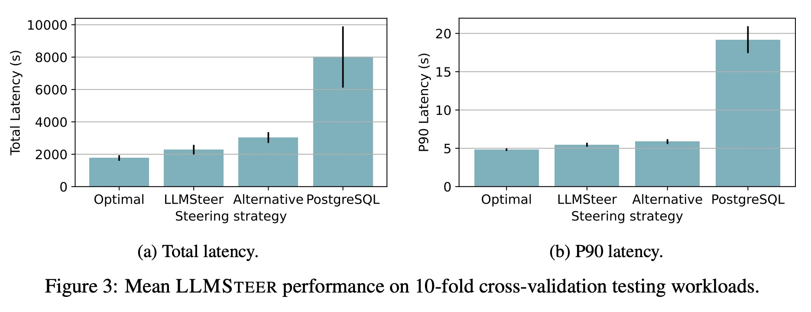
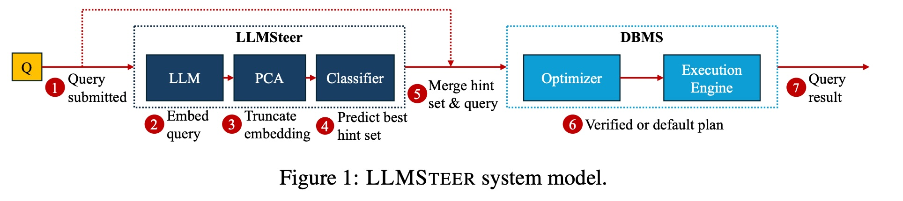
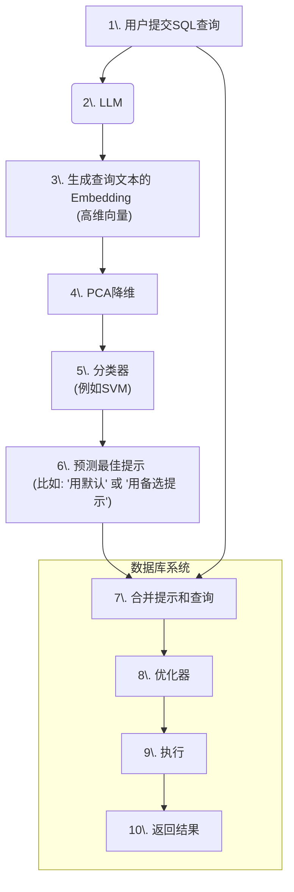
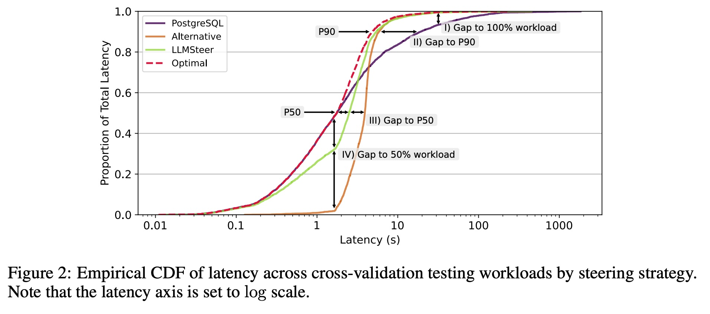
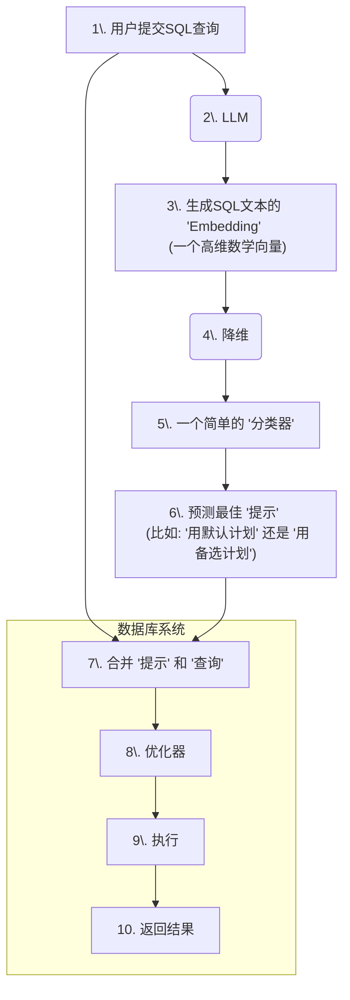
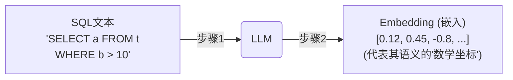

## AI论文解读 | The Unreasonable Effectiveness of LLMs for Query Optimization
        
### 作者        
digoal        
        
### 日期        
2025-10-23        
        
### 标签        
PostgreSQL , PolarDB , DuckDB , AI , 论文解读        
        
----        
        
## 背景  
      
https://arxiv.org/pdf/2411.02862        
  
提示:          
```          
读懂《The Unreasonable Effectiveness of LLMs for Query Optimization》这篇论文需要提前掌握哪些基础知识, 请使用中文通熟易懂的讲解这些基础知识, 可以引用论文中的图、表或使用Markdown支持的图形(text,mermaid等)增加解释性. 
  
使用中文通熟易懂的解读《The Unreasonable Effectiveness of LLMs for Query Optimization》这篇论文, 其中的关键内容请着重讲解, 可以引用论文中的图、表或使用Markdown支持的图形(text,mermaid等)增加解释性. 
  
提取《The Unreasonable Effectiveness of LLMs for Query Optimization》这篇论文中的重要术语, 使用中文对这些术语进行通熟易懂的讲解, 可以引用论文中的图、表或使用Markdown支持的图形(text,mermaid等)增加解释性. 
```     
  
## 1 前置知识 
  
要读懂这篇标题为《LLMs在查询优化中“不合理”的有效性》（The Unreasonable Effectiveness of LLMs for Query Optimization）的论文 ，你需要提前了解以下几个领域的基础知识。

这篇论文的核心思想非常新颖：它尝试使用大语言模型（LLM）来“操纵”或“指导”数据库的查询优化器（Query Optimizer, QO），并且取得了惊人的效果 。这颠覆了数据库领域的一个传统认知，即优化查询必须依赖数据库内部复杂的统计信息 。

以下是你需要掌握的基础知识，我会用通俗的语言为你讲解：

### 1\. 数据库基础：什么是SQL查询优化？

**a. SQL (结构化查询语言)**
你首先要知道SQL是什么。它是一种用来和数据库“对话”的语言。比如，你告诉数据库：“请帮我从‘用户表’里，找出所有‘年龄大于18岁’的‘女性用户’的名字。”

**b. 查询优化器 (Query Optimizer, QO)**
当你把SQL语句（查询）发送给数据库时，数据库内部有一个非常核心的组件叫做“查询优化器” 。

你可以把QO想象成一个智能的“导航系统”。你的SQL语句是你的“目的地”（比如“从A到D”），但QO需要决定“怎么走”才是最快、最省油的 。

**c. 查询计划 (Query Plan)**
“怎么走”的路线图，就是“查询计划” 。

  * **路线A（计划A）：** 先去B，再去C，最后到D。
  * **路线B（计划B）：** 先去C，再去B，最后到D。

在数据库里，这些路线对应着不同的操作，比如“先用索引查找”还是“先把整张表都读一遍”。不同的计划可能导致查询时间相差成百上千倍。QO的工作就是从众多可能的计划中，选出一个它认为最高效的 。

**d. 现状的问题**
目前大多数QO依赖的是复杂的、人工编写的“启发式规则”（heuristics）。但它们并不完美，经常会选错路（做出代价高昂的错误）。

### 2\. 数据库性能：什么是“提示”和“延迟”？

**a. 查询提示 (Query Hints)**
有时候，数据库专家（DBA）比QO更懂数据，他们可以手动给QO一些“提示”（Hints）。

这就像你对导航系统说：“我知道那条路堵车，请你强制走另一条路（比如‘只使用哈希连接’或‘使用某个索引’）” 。

**b. “操纵”优化器 (Optimizer Steering)**
“提示”非常强大，但也非常难用。用错了，性能会急剧下降 。
这篇论文提出的**LLMSTEER** ，就是想让AI自动学会什么时候该用哪个“提示” 。

**c. 性能指标：延迟 (Latency)**
我们怎么评价一个查询计划的好坏？看它跑得多快。

  * **总延迟 (Total Latency):** 跑完一批查询总共花了多少时间 。在论文的 **图3(a)** 中，柱子越低越好 。     
  * **P90 尾部延迟 (P90 Tail Latency):** 这是指“最慢的那10%的查询”所花费的时间 。优化P90对用户体验至关重要，因为它代表了用户可能遇到的“最差情况”。在 **图3(b)** 中，柱子同样是越低越好 。

### 3\. 机器学习基础：特征工程 vs 嵌入

**a. 传统机器学习方法 (旧方法)**
在LLMSTEER之前，也有人尝试用机器学习（ML）来指导QO 。但这些方法通常需要复杂的“特征工程” (feature engineering) 。

你需要从数据库内部提取大量复杂的统计数据（比如表的基数、数据分布直方图等），然后把它们喂给模型。这导致ML模型和数据库系统深度绑定，很难落地 。

**b. 监督学习 (Supervised Learning)**
LLMSTEER使用的是监督学习 。简单说，就是准备很多“考题”和“标准答案”来训练模型。

  * **考题：** 一个SQL查询。
  * **标准答案：** 针对这个查询，用“默认计划”快，还是用“提示A”快？（在这篇论文里，他们简化为二选一）。

**c. 分类器 (Classifier)**
训练好的模型就是一个“分类器” 。当你给它一个新查询时，它会预测一个分类：“用默认的”或“用提示A”。

### 4\. LLM核心知识：什么是“嵌入” (Embeddings)？

这是理解这篇论文**最关键**的知识点。

**a. 大语言模型 (LLM)**
你可能用过ChatGPT或Gemini，它们就是LLM。

**b. 嵌入 (Embeddings)**
LLM不仅能生成文本，它还有一个核心能力： **理解文本并将其“向量化”** ，这个向量就叫“嵌入” (Embedding) 。

你可以把“嵌入”想象成一个“语义坐标系”：

  * “国王”和“王后”的坐标很近。
  * “苹果”和“香蕉”的坐标很近。
  * “国王”和“香蕉”的坐标很远。

LLMSTEER做了一件非常“反直觉”的事：它*不看*数据库内部的任何统计信息（比如表有多大，数据怎么分布），它只看用户输入的**SQL查询语句的文本** 。

**c. LLMSTEER 的工作流程 (参考图1)**  
论文中的图1  清晰地展示了这个流程：     



  * **步骤1-3:** 用户提交SQL查询（纯文本），LLM将其转换为一个“嵌入”向量 。
  * **步骤4-6:** 向量经过处理后 ，被送入一个（在少量数据上）训练好的分类器 。分类器预测用哪个提示（Hint）最好 。
  * **步骤7-10:** 把这个提示和原始SQL语句一起发给数据库去执行 。

**d. “不合理”的有效性**
这篇论文的惊人之处在于 ，按理说，只看SQL文本（比如`SELECT * FROM A JOIN B ON A.id = B.id`）根本无法决定哪个执行计划更好——因为性能取决于A表和B表到底有多大，`id`列上有没有索引等。

但实验结果（如图2和图3所示）表明 ，这个看似简单的方法，其性能（LLMSteer，绿色线/柱）远超数据库默认的优化器（PostgreSQL，深色线/柱），并且非常接近理论上的“最优”选择（Optimal，红色线/柱）。

   

   

作者们自己也感到惊讶，因为这违背了数据库界的“常识” 。

### 总结

要读懂这篇论文，你需要：

1.  **懂数据库：** 知道什么是“查询优化”和“查询计划”。
2.  **懂性能：** 知道什么是“Hints”（提示）和“Latency”（延迟）。
3.  **懂机器学习：** 知道“监督学习”和“分类器”。
4.  **懂LLM（最重要）：** 知道什么是“Embeddings”（嵌入），并理解这篇论文的创新点——**用SQL文本的“嵌入”来代替复杂的数据库内部统计信息**，作为机器学习模型的输入 。
  
## 2 解读论文 
  
这是一篇非常有趣且可能具有颠覆性的论文。它的标题《LLM在查询优化中“不合理”的有效性》 就点明了核心：**大语言模型（LLM）在数据库查询优化这个任务上取得了惊人的好效果，好到“不合常理”。**

为什么说它“不合常理”？因为在传统数据库专家看来，优化SQL查询**必须**依赖数据库内部的复杂统计信息（比如表有多大、数据如何分布、索引情况等）。而这篇论文的方案（LLMSTEER） **完全不看这些内部信息** ，它只看用户提交的**SQL查询语句的文本** ，效果却出奇的好。

下面，我将为你详细解读这篇论文的关键内容。

### 1\. 核心问题：数据库的“导航系统”经常失灵

首先，你需要理解什么是“查询优化”（Query Optimization）。

你可以把数据库的“查询优化器”（Query Optimizer, QO）想象成一个**GPS导航系统** 。当你用SQL语句告诉数据库“我要去A地”（比如查询某些数据）时，QO会计算出很多条“路线”（即“查询计划”，Query Plans）。

  * **计划A：** 先走高速，再走国道（比如：先用索引A，再做哈希连接）。
  * **计划B：** 先走国道，再走小路（比如：先全表扫描，再做嵌套循环连接）。

QO的目标是选出**最快**的那条路线（最高效的计划）。

**问题在于：** 这个“导航系统”并不完美，它经常“估算错误”，做出代价高昂的错误决策 ，导致查询速度慢上成百上千倍。

过去，人们尝试用机器学习（ML）来“指导”这个导航系统，但这些方法非常复杂，需要“复杂的特征工程”和“与数据库的深度集成” ，部署起来非常困难 。

### 2\. LLMSTEER：一个“简单到离谱”的新方案

这篇论文提出了一个名为 **LLMSTEER** 的新方法 。它的思路堪称“清奇”：

**我们不看数据库内部的复杂统计数据，只看用户输入的“SQL查询文本”本身。** 

LLMSTEER的工作流程（见下图，改编自论文图1）非常简洁：     



**关键步骤讲解：**

1.  **获取SQL文本：** LLMSTEER拿到用户写的原始SQL查询语句 。
2.  **LLM嵌入 (Embedding)：** 它使用一个LLM（论文中用的是OpenAI的模型 ）将这段SQL文本转换成一个“嵌入”向量 。
      * **通俗解释“嵌入”：** 这就像把一句SQL（比如 “SELECT \* FROM A JOIN B...”）在“语义空间”中标记为一个坐标。相似的查询会有相近的坐标。
3.  **分类器预测：** 论文将问题极大简化：只做**二选一**的决策 。
      * **选项1：** 使用数据库（PostgreSQL）的“默认计划”。
      * **选项2：** 使用一个预先选定的“备选计划”（通过“提示”Hint来强制执行）。
        这个简单的分类器（论文中使用SVM ）会根据SQL的“坐标”（嵌入向量）来预测哪个选项更快 。
4.  **执行：** LLMSTEER将它选择的“提示”和原始SQL一起交给数据库执行 。

**这个方案的巨大优势在于：** 整个“转向”组件（LLM和分类器）都在数据库*外部*，不需要对数据库内核进行复杂的修改，集成非常简单 。

### 3\. 惊人的实验结果：它真的有效！

作者们（自称是数据库专家）坦言，他们一开始也“没想到这种简单的方法会起作用” 。但结果令人震惊。

#### 关键结果1：延迟大幅降低（图3）  

论文比较了四种策略的性能，我们主要关注 **(a) 总延迟**（运行所有查询的总时间）和 **(b) P90延迟**（最慢的那10%查询的延迟）。

   

图3： (a) Total latency 和 (b) P90 latency 的条形图

  * **PostgreSQL (默认)：** 性能最差，总延迟高达约 8000 秒 。
  * **Alternative (备选)：** 比默认好，但也不理想 。
  * **Optimal (理论最优)：** 如果每次都能完美二选一，总延迟最低（约 1700 秒）。
  * **LLMSteer (新方法)：** **总延迟仅约 2300 秒** 。

**结论：** LLMSTEER 的性能**远远超过**了 PostgreSQL 的默认优化器，平均**减少了 72% 的总延迟和P90延迟** 。并且，它的性能已经非常接近“理论最优”的水平（仅比最优慢30%）。

#### 关键结果2：LLMSTEER“取长补短”（图2）

这张“经验累积分布函数（CDF）”图（图2）更深入地揭示了 LLMSTEER 为什么这么强。

   

图2： Empirical CDF of latency 曲线图

  * **X轴：** 查询延迟（越往右越慢）
  * **Y轴：** 占总延迟的比例（曲线越快到达1.0，说明整体性能越好）


1.  **PostgreSQL (黑线):** 它在处理“简单查询”（图左侧）时表现不错，但一遇到“困难查询”（图右侧），延迟就急剧飙升，导致曲线很晚才爬到 1.0 。
2.  **Alternative (浅绿线):** 它在“简单查询”上表现很差，但在“困难查询”上比 PostgreSQL 好 。
3.  **LLMSteer (紫色虚线):** **它完美地结合了两者的优点！** 
      * 在左侧，它紧跟 PostgreSQL，说明它知道何时使用默认计划 。
      * 在右侧，它紧跟 Optimal（红色）和 Alternative，说明它也知道何时切换到备选计划，成功避开了 PostgreSQL 的“大坑” 。

**一句话总结图2：** LLMSTEER 聪明地**用很小的中位数延迟代价，换来了 P90 尾部延迟和总延迟的巨大降低** 。

### 4\. 其他关键发现与局限性

#### Q: 换个SQL格式（加空格/换行），它还认识吗？

**A: 认识。**
论文测试了将SQL语句从单行（语法A）改成多行、带缩进（语法B和C）。结果发现，LLMSTEER **对这种非语义的语法更改具有鲁棒性** 。即使在语法A上训练，也能在语法B和C上取得良好效果，性能远超PostgreSQL 。

#### Q: 这个方案最大的局限性是什么？

**A: 无法扩展到“多选一”。**
这个实验的成功是建立在一个简化的“二选一”问题上的 。
当作者尝试将其扩展到**48个**不同的“提示”（即“48选一”）时，**方案失效了** 。原因是数据被分得太稀疏，分类器无法学习 。

尽管如此，作者指出，**哪怕只是在两个选项之间进行智能切换，就已经带来了显著的性能提升** 。

### 总结：我们为什么应该关注这篇论文？

这篇论文打开了一个全新的、令人兴奋的方向。它证明了，LLM 似乎能从纯粹的 SQL 文本中“领悟”到某些与查询性能相关的深层“语义” ，而这是传统数据库优化理论所忽视的。

正如作者所说，他们留下的“问题远多于答案” 。例如：

  * LLM 是不是在训练时“见过”这些测试用的SQL（导致“数据泄露”）？
  * 换个更好的 LLM 嵌入模型，效果会更好吗？
  * 我们能否微调（Fine-tune）一个LLM来专门做这个任务？

LLMSTEER 以一种“不合理”的简单方式，取得了惊人的效果 ，挑战了数据库领域的“既定智慧” 。
  
## 3 术语 
  
以下是解读这篇论文《The Unreasonable Effectiveness of LLMs for Query Optimization》时必须掌握的重要术语，我将用通俗易懂的中文为您讲解：

### 1\. SQL (结构化查询语言)

  * **讲解：** 这就是我们平时用来和数据库“对话”的语言 。比如，你用SQL告诉数据库：“请帮我从‘员工表’里找出所有‘工资大于5000’的人”。
  * **在本文中：** LLMSTEER这个新方法，分析的就是你写的“原汁原味”的SQL查询语句（纯文本）。

### 2\. Query Optimization (查询优化)

  * **讲解：** 这是数据库的“大脑” 。当你发送一条SQL命令后，数据库内部的“查询优化器”（Query Optimizer, QO）会思考：“我该用什么方法来执行这条命令才能最快、最省资源？” 。
  * **类比：** 就像GPS导航。你的SQL是“目的地”，查询优化器负责规划出“最快的路线”。

### 3\. Query Plan (查询计划)

  * **讲解：** 这就是“查询优化器”最终规划出的那条“执行路线图” 。
  * **类比：** GPS规划的路线A可能是“先走高速再走国道”，路线B可能是“全程走国道”。不同的“查询计划”对应不同的执行方式（比如是用索引A还是索引B），执行效率可能天差地别 。

### 4\. Heuristics (启发式规则)

  * **讲解：** 这是指传统数据库优化器依赖的“经验法则” 。它们是由数据库工程师预先编写好的一大堆 `If...Then...` 规则，比如“如果这张表小于100行，就优先处理它”。
  * **在本文中：** 论文指出，这些“启发式规则”虽然复杂，但并不完美，经常会选错“路线”（查询计划），导致性能很差 。

### 5\. Latency (延迟)

  * **讲解：** 指的是执行一个查询需要花费的时间，也就是“快不快” 。这是衡量优化器好坏的核心指标。
  * **本文中的两个关键延迟指标（见图3）：**
      * **Total Latency (总延迟):** 跑完一批查询总共花了多少时间 。在 **图3(a)** 中，柱子越低，说明总耗时越短，性能越好 。     
      * **P90 Tail Latency (P90 尾部延迟):** 指的是那10%“最慢”的查询所花费的时间 。这个值越低，说明系统“突然卡顿”的情况越少，用户体验越好。在 **图3(b)** 中，柱子越低越好 。

### 6\. Query Hints (查询提示)

  * **讲解：** 这是一种“作弊”手段。数据库专家（DBA）可以手动在SQL语句里加入一些“提示”关键词 ，强制优化器必须按照某种特定的“路线”（查询计划）去执行 。
  * **问题：** “提示”非常难用，用对了能提速，用错了会导致性能灾难 。

### 7\. Optimizer Steering (优化器操纵/转向)

  * **讲解：** 这正是本文要解决的核心任务。它指的是“自动”为一条SQL查询选择一个“提示”（Hint），来“操纵”或“引导”优化器选用那个更优的查询计划 。
  * **在本文中：** LLMSTEER就是一种新的“操纵”方法 。

### 8\. LLM (Large Language Model, 大语言模型)

  * **讲解：** 比如OpenAI的GPT系列或谷歌的Gemini。它们是受过海量文本数据训练的AI模型。
  * **在本文中：** LLM被用来“阅读”SQL查询语句的文本 。

### 9\. Embeddings (嵌入)

  * **讲解：** 这是理解本文的**最关键术语**。它指的是LLM的一种能力：将一段文本（比如一条SQL语句）转换成一个由数字组成的“数学坐标”（即向量）。
  * **核心思想：** LLMSTEER假设，这个“坐标”包含了SQL查询的“语义信息” ，而这些信息竟然对“查询优化”这个任务非常有用 。




### 10\. LLMSTEER

  * **讲解：** 这就是论文提出的新系统的名字（见 **图1**） 。     
  * **工作流程：** 它把SQL查询文本转换成“Embedding”（嵌入），然后把这个“坐标”喂给一个“分类器”，由分类器来预测应该使用哪个“提示”（Hint）。

### 11\. Classifier (分类器)

  * **讲解：** 一个简单的机器学习模型。
  * **在本文中：** 它是一个“二元分类器” ，专门用来做“二选一”的决策：对于当前这条SQL，是“使用数据库默认计划”快，还是“使用那个备选计划”快？。

### 12\. Syntactic Changes (语法变更)

  * **讲解：** 指的是只改变SQL语句的“长相”（格式），而不改变它的“意思”（语义）。
  * **例子：**
      * `SELECT * FROM t WHERE id = 1` (语法A, 原版单行) 
      * 和
      * `SELECT * FROM t WHERE id = 1` (语法B, 带换行和空格缩进) 
  * **在本文中：** 作者测试这个是为了验证LLMSTEER的“鲁棒性”——它会不会因为用户换了种SQL写法（加了空格、换行）就不认识这条SQL了？。结果是它依然表现很好 。
  
## 参考        
         
https://arxiv.org/pdf/2411.02862  
  
https://rmarcus.info/blog/         
        
<b> 以上内容基于DeepSeek、Qwen、Gemini及诸多AI生成, 轻微人工调整, 感谢杭州深度求索人工智能、阿里云、Google等公司. </b>        
        
<b> AI 生成的内容请自行辨别正确性, 当然也多了些许踩坑的乐趣, 毕竟冒险是每个男人的天性.  </b>        
    
#### [期望 PostgreSQL|开源PolarDB 增加什么功能?](https://github.com/digoal/blog/issues/76 "269ac3d1c492e938c0191101c7238216")
  
  
#### [PolarDB 开源数据库](https://openpolardb.com/home "57258f76c37864c6e6d23383d05714ea")
  
  
#### [PolarDB 学习图谱](https://www.aliyun.com/database/openpolardb/activity "8642f60e04ed0c814bf9cb9677976bd4")
  
  
#### [PostgreSQL 解决方案集合](../201706/20170601_02.md "40cff096e9ed7122c512b35d8561d9c8")
  
  
#### [德哥 / digoal's Github - 公益是一辈子的事.](https://github.com/digoal/blog/blob/master/README.md "22709685feb7cab07d30f30387f0a9ae")
  
  
#### [About 德哥](https://github.com/digoal/blog/blob/master/me/readme.md "a37735981e7704886ffd590565582dd0")
  
  

  
