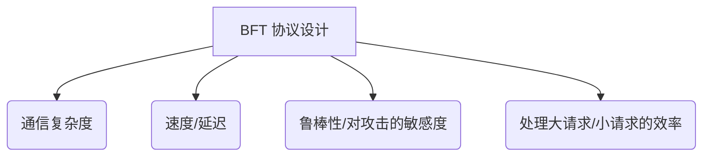
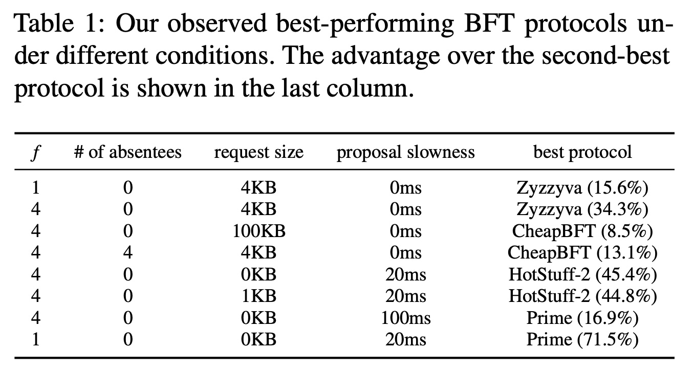
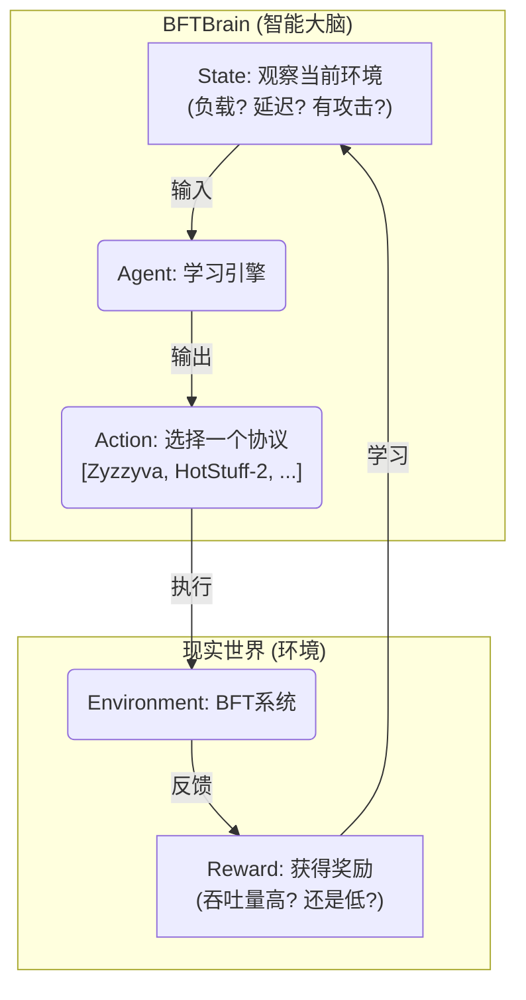
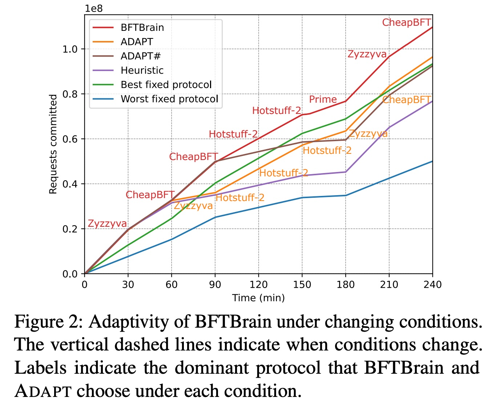
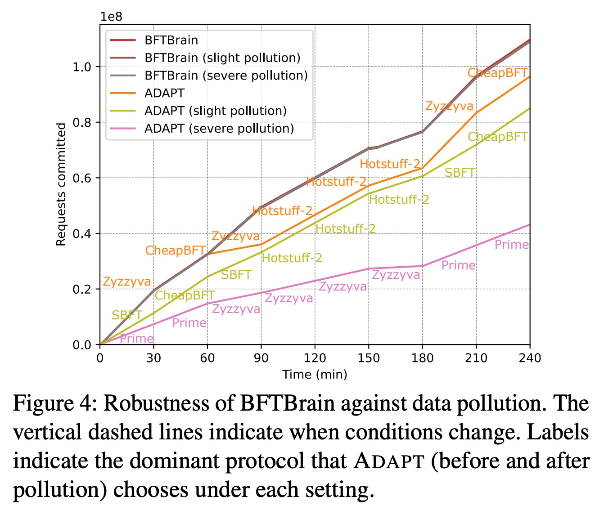
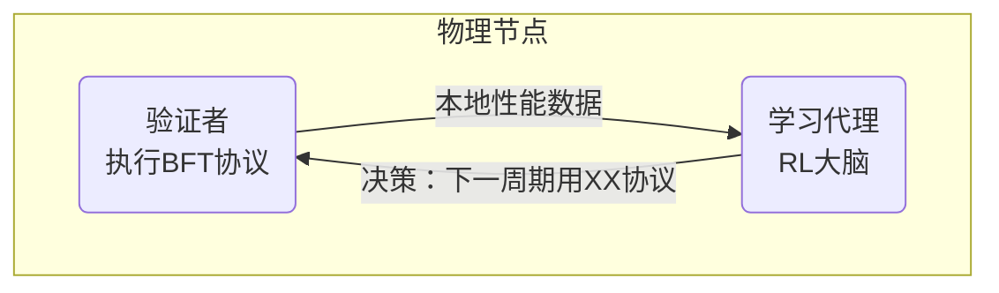

## AI论文解读 | BFTBrain: Adaptive BFT Consensus with Reinforcement Learning
        
### 作者        
digoal        
        
### 日期        
2025-10-23        
        
### 标签        
PostgreSQL , PolarDB , DuckDB , AI , 论文解读        
        
----        
        
## 背景  
      
https://arxiv.org/pdf/2408.06432        
  
提示:          
```          
读懂《BFTBrain: Adaptive BFT Consensus with Reinforcement Learning》这篇论文需要提前掌握哪些基础知识, 请使用中文通熟易懂的讲解这些基础知识, 可以引用论文中的图、表或使用Markdown支持的图形(text,mermaid等)增加解释性. 
  
使用中文通熟易懂的解读《BFTBrain: Adaptive BFT Consensus with Reinforcement Learning》这篇论文, 其中的关键内容请着重讲解, 可以引用论文中的图、表或使用Markdown支持的图形(text,mermaid等)增加解释性. 
  
提取《BFTBrain: Adaptive BFT Consensus with Reinforcement Learning》这篇论文中的重要术语, 使用中文对这些术语进行通熟易懂的讲解, 可以引用论文中的图、表或使用Markdown支持的图形(text,mermaid等)增加解释性. 
```     
  
## 1 前置知识 
  
要透彻理解 BFTBrain 这篇论文，你需要掌握几个关键领域的基础知识。这篇论文的核心思想是：**没有一种“万能”的拜占庭共识协议（BFT）能适应所有情况，所以我们用强化学习（RL）造了一个“大脑”（BFTBrain），让系统能在运行时根据当前的网络、负载和攻击情况，“智能”地切换到当下最优的 BFT 协议** 。

以下是你需要储备的基础知识，我会用通俗的语言和论文中的例子来解释：

### 1\. 什么是分布式共识 (Distributed Consensus)？

想象一下，你和几个朋友（节点）一起点外卖（处理请求）。你们必须在“最终订单”上达成一致，才能发给餐厅。这个“达成一致”的过程就是共识。

在分布式系统中，多台计算机（称为“副本”或“节点”）需要共同维护一个共享的状态（比如一个银行账户的余额）。当一个客户发起一个请求（比如“转账 100 元”）时，所有诚实的计算机都必须同意以**相同的顺序**执行这个请求 。这就是论文中提到的**状态机复制 (State Machine Replication, SMR)** 。

  * **简单情况：** 如果所有电脑都正常工作，达成共识很简单。
  * **挑战：** 如果有的电脑崩溃了，或者（更糟糕地）有的电脑是“坏蛋”怎么办？

### 2\. 什么是“拜占庭容错” (Byzantine Fault Tolerance, BFT)？

这是理解这篇论文**最核心**的概念。

  * **普通故障 (Crash Fault)：** 就像你的一个点餐朋友睡着了（节点崩溃），他不说话了。这很容易发现，你们跳过他就行。
  * **拜占庭故障 (Byzantine Fault)：** 这才是大麻烦。这个朋友是个“内鬼”或“捣蛋鬼”（拜占庭节点）。他可能**故意撒谎**：
      * 他告诉A朋友：“我们点披萨。”
      * 他告诉B朋友：“我们点汉堡。”
      * 他甚至可能伪造别人的话。

这种“节点可以任意作恶、发送冲突信息”的故障模型，就是“拜占庭故障” 。BFT 的目标就是设计一个协议， **即使系统中有少数（比如 $f$ 个）这样的“内鬼”** ，所有诚实的节点（老实人）最终仍然能对请求的顺序达成一致 。

### 3\. BFT 共识协议：为什么有那么多选择？（论文的核心动机）

为了实现 BFT，学术界发明了许多不同的协议，论文中就提到了一堆，比如 PBFT, Zyzzyva, CheapBFT, HotStuff-2 等 。

为什么有这么多？因为**没有“银弹”** 。不同的协议在设计上有不同的取舍 (Trade-off)：



**这正是 BFTBrain 要解决的问题。** 论文通过实验（如 **表1** ）证明了这一点：     

  * **场景1（网络好, 请求小）：** Zyzzyva 协议表现最好 。
  * **场景2（网络好, 请求大）：** CheapBFT 协议反超了 。
  * **场景3（领导者节点故意“摸鱼”变慢）：** HotStuff-2 或 Prime 协议表现最好 。

**结论：** 既然没有一个协议能永远称霸，那么最好的办法就是“动态切换” 。

### 4\. 什么是强化学习 (Reinforcement Learning, RL)？

现在的问题是：系统怎么“知道”何时该切换？切换到哪个？这就是强化学习（RL）登场的地方 。

RL 就像训练一只宠物：

  * **智能体 (Agent)：** BFTBrain 。
  * **状态 (State / Context)：** 宠物观察到的环境（比如你拿着球）。在论文里，这就是系统当前的工况，比如“平均请求大小”、“领导者提案间隔时间”等 。
  * **动作 (Action)：** 宠物做的动作（比如“坐下”）。在论文里，这就是“选择一个BFT协议来运行下一个周期” 。
  * **奖励 (Reward)：** 你给宠物的奖励（比如一块零食）。在论文里，这就是系统的性能指标，主要是“吞吐量”（每秒处理多少请求）。

BFTBrain 的目标就是学习一个策略：**在当前“状态”下，选择哪个“动作”（BFT协议），才能让未来的“奖励”（吞吐量）最大化** 。

**为什么用 RL (在线学习) 而不是监督学习 (离线训练)？**
论文批评了老方法 ADAPT ，ADAPT 像“填鸭式教育”：你必须提前收集好 *所有* 可能情况的数据（比如在实验室里跑一周 ），训练一个模型 。如果遇到新情况（比如换了套硬件，或者一种新的攻击），它就傻眼了 。

BFTBrain 用的 RL 是“试错学习”：它不需要提前训练，直接“边学边用” ，在真实环境中不断尝试和优化，因此能适应未曾预料到的新情况 。

### 5\. 核心 RL 模型：上下文多臂老虎机 (CMAB)

论文将这个问题具体建模为**上下文多臂老虎机 (Contextual Multi-Armed Bandit, CMAB)** 。

  * **老虎机 (Bandit)：** 想象你面前有一排老虎机（“多臂”）。
  * **“臂” (Arms)：** 就是 BFTBrain 的“动作”选项，即 PBFT, Zyzzyva, HotStuff-2 等这 6 个协议 。
  * **问题：** 你不知道哪个老虎机（协议）的奖励最高。
  * **挑战（探索 vs. 利用）：** 你是该一直玩你 *目前认为* 最好的那个（利用, Exploitation），还是该试试别的，万一有更好的呢（探索, Exploration）？
  * **“上下文” (Contextual)：** 这排老虎机旁边有个“天气预报”屏幕（“上下文”）。
      * 如果显示“晴天”（比如系统负载低）：可能 1 号机（Zyzzyva）奖励最高。
      * 如果显示“雨天”（比如领导者很慢）：可能 2 号机（HotStuff-2）奖励最高。

CMAB 的任务就是学习这个关系： **根据“上下文”（系统状态），选择哪个“臂”（BFT 协议），才能获得最高奖励（吞吐量）** 。

### 6\. 核心 RL 算法：汤普森采样 (Thompson Sampling)

BFTBrain 使用“汤普森采样” (Thompson Sampling) 算法来解决这个 CMAB 问题 。

这是一种很聪明的平衡“探索”和“利用”的方法：

1.  BFTBrain 对每个协议（臂）的“好坏”保持一个“概率模型”（信念）。
2.  在做决定时，它不只是选“平均表现”最好的那个。
3.  而是根据当前的“信念”，**从每个协议的概率模型中“采样”一个可能的性能值** 。
4.  然后，它选择这次“采样值”最高的那个协议去执行 。

**效果：**

  * **利用：** 一个协议如果过往表现一直很好，它的“信念”会很强，它被采样到高分的概率就大，于是经常被选中 。
  * **探索：** 一个协议如果很少被尝试，它的“信念”会很“不确定”（方差很大）。虽然平均值不高，但*有可能*会采样到一个非常高的值（“万一它很厉害呢？”），从而获得被尝试的机会 。

### 7\. 最后一个挑战：去中心化学习 (Decentralized Learning)

别忘了，BFTBrain 自己也运行在一个“拜占庭环境”中！

如果 BFTBrain 是一个“中央大脑”，那这个大脑自己也可能是“内鬼” 。

BFTBrain 的做法是：**每个节点上都运行一个学习代理 (learning agent)** 。
它们需要解决 *第二个* 共识问题：

1.  **数据收集：** 每个节点 *自己* 测量本地的“状态”和“奖励” 。
2.  **数据共识：** 它们必须通过一个 BFT 共识（是的，在BFT内部又跑一个BFT）来交换和同意这些测量数据（比如取中位数），以防“内鬼”节点上报虚假的性能数据来“污染”模型 。

### 总结

你需要的基础知识：

1.  **分布式共识 (SMR)：** 多个节点如何对操作顺序达成一致 。
2.  **BFT：** 如何在有“内鬼”（任意作恶节点）的情况下达成共识 。
3.  **BFT 协议的多样性 (核心动机)：** 了解 BFT 协议有多种，且各有优劣，没有万能解（参考 **表1**）。     
4.  **强化学习 (RL)：** 知道 Agent, State, Action, Reward 的基本循环，以及 RL 是如何通过“试错”来学习的 。
5.  **CMAB (具体模型)：** 理解“带上下文的老虎机”问题，即如何根据环境（上下文）选择最佳动作（臂）。
6.  **汤普森采样 (具体算法)：** 了解这是一种通过概率采样来平衡“探索与利用”的算法 。
  
## 2 解读论文 
  
好的，这是一篇非常出色的系统论文。用一句话总结：**这篇论文造了一个“智能大脑”（BFTBrain），它利用强化学习（RL）技术，让一个分布式系统能在运行时“感知”当前的网络、负载和攻击情况，并自动“切换”到当下最高效的BFT共识协议，从而在各种复杂多变的环境下都能保持最佳性能 。**

下面，我为你详细解读这篇论文的关键内容。

### 1\. 核心问题：没有“万能”的BFT协议

首先，你需要了解什么是 BFT (Byzantine Fault Tolerance，拜占庭容错)。

想象一下，你们是一个团队（分布式系统），需要共同决定一件事（达成共识）。但团队里有“内鬼”（拜占庭节点），他们会撒谎、捣乱。BFT 协议就是一套规则，能保证即使有少数“内鬼”，你们这些“老实人”最终也能达成正确的一致 。

市面上有很多 BFT 协议（如 PBFT, Zyzzyva, HotStuff-2 等），但论文指出一个核心痛点：**没有一个协议能在所有情况下都表现最好** 。

  * 有的协议在网络**延迟低**时很快，但延迟高了就不行。
  * 有的协议处理**小请求**很猛，但处理**大请求**（比如100KB）就拉垮了。
  * 有的协议在“天下太平”时很快，但一旦有“内鬼”开始 **故意“摸鱼”** （如领导者变慢），性能就一落千丈 。

论文用 **表1 (Table 1)** 有力地证明了这一点：     

| 场景（f=故障节点数） | 网络/请求情况 | 性能最好的协议 |
| :--- | :--- | :--- |
| **场景 A** (f=4) | 4KB 小请求 | **Zyzzyva** (领先第二名 34.3%)  |
| **场景 B** (f=4) | 100KB 大请求 | **CheapBFT** (领先第二名 8.5%)  |
| **场景 C** (f=4) | 4KB请求, 但有4个节点“掉线” | **CheapBFT** (领先第二名 13.1%)  |
| **场景 D** (f=4) | 领导者故意“摸鱼”（慢20ms） | **HotStuff-2** (领先第二名 45.4%)  |
| **场景 E** (f=1) | 领导者故意“摸鱼”（慢20ms） | **Prime** (领先第二名 71.5%)  |

**结论：** 如果你“写死”用一个协议，那么在大部分时间里，你的系统性能都很差。

### 2\. BFTBrain 的核心思想：用“强化学习”实现“智能自适应”

既然“固定”的协议不行，BFTBrain 的思想就是“**动态切换**”：系统应该像一个会思考的大脑，在运行时不断评估，然后切换到当时场景下的“最优解” 。

它是怎么做到的呢？答案是**强化学习 (Reinforcement Learning, RL)**。

BFTBrain 把“选协议”这个问题，建模成了一个经典的 RL 问题——**上下文多臂老虎机 (Contextual Multi-Armed Bandit, CMAB)** 。

这是一个非常贴切的比喻：



  * **智能体 (Agent)：** BFTBrain 的学习引擎 。
  * **动作 (Actions)：** 它能做的选择，就是论文中研究的 6 个 BFT 协议（PBFT, Zyzzyva, CheapBFT, Prime, SBFT, HotStuff-2）。
  * **状态 (State / Context)：** BFTBrain 用来做决策的“上下文”或“特征”。这是关键，它会监测：
      * **工作负载 (W)：** 平均请求多大？平均响应多大？系统负载有多高？ 
      * **故障情况 (F)：** 有没有节点“掉线”不回消息？领导者“摸鱼”变慢了多少？ 
  * **奖励 (Reward)：** 做出选择后得到的回报。在这篇论文里，回报就是“**吞吐量**”（每秒处理的请求数）。

BFTBrain 的目标很明确：学习一个策略，即在**什么“状态”下，选择哪个“动作”（协议），能让“奖励”（吞吐量）最大化** 。

### 3\. 关键挑战与解决方案

光有思想还不够，在 BFT 这种“黑暗森林”环境里实现 RL，有两个巨大挑战：

#### 挑战 1：学习本身也可能被“内鬼”攻击（数据污染）

如果 BFTBrain 是一个“中央大脑”，那么这个大脑自己也可能是“内鬼” 。

退一步讲，就算大脑是好的，它用来学习的“状态”数据（比如“领导者很慢”）是由各个节点上报的。如果“内鬼”节点**故意上报假数据**（比如“领导者明明很快，我非说他很慢”），岂不是会“污染”学习模型，诱导大脑做出错误决策？

**BFTBrain 的解决方案：去中心化的鲁棒学习 (Decentralized & Robust Learning)**

1.  **人人有脑：** BFTBrain 不是一个中央大脑，而是**在每个节点上都部署了一个学习代理（Learning Agent）** 。
2.  **数据共识：** 为了防止数据污染，所有“老实”的 Agent 们会**再跑一个 BFT 共识**（论文里叫 VBC），专门用来**对它们各自测量的“状态”和“奖励”数据达成一致** 。
3.  **取中位数：** 最简单有效的办法就是，大家把测量值报上来，然后**取中位数 (Median)** 作为“全局状态” 。这样，就算 $f$ 个“内鬼”上报了极端离谱的数据（极大或极小），中位数也依然会落在“老实人”上报的数据范围内，保证了学习数据的鲁棒性 。

#### 挑战 2：为什么不用“监督学习” (Supervised Learning)？

之前的研究（如 ADAPT）尝试过监督学习 。就像“填鸭式教育”，你必须提前在实验室里，把所有可能的硬件、所有可能的负载、所有可能的攻击方式全都跑一遍，收集海量数据，然后训练一个模型 。

这种方式的**缺点是致命的**：

1.  **不实用：** 收集数据的过程极其漫长（论文说他们跑一小部分子集都花了一周多）。
2.  **适应性差：** 一旦你换了套硬件（比如从局域网 LAN 换到广域网 WAN），或者出现了一种新的攻击模式，模型就“傻眼”了，必须重新训练 。

**BFTBrain (RL) 的优势：即插即用 (Plug-and-play)**

BFTBrain 用的是 RL（在线学习），就像“**试错中成长**” 。你不需要提前训练。系统部署上线后，它会自己去“探索”（尝试不同的协议），并根据“奖励”（吞吐量反馈）来“利用”（多用表现好的协议），自动学习适应当前的硬件和负载 。

### 4\. 关键成果：BFTBrain 效果如何？

论文的实验结果非常惊艳，我挑两个最重要的图来解释：

#### 成果一：动态适应性 (Figure 2)

这张图显示了在4小时内，系统条件（负载、攻击）不断变化时，BFTBrain 的累计吞吐量（红线）。

   

*(注：此图是对论文 Figure 2 的模拟，原图在 )*

  * **BFTBrain (红线):** 始终保持最高的增长斜率（即最高的吞吐量）。
  * **Best fixed protocol (绿线):** 这是“事后诸葛亮”——在每种固定场景下表现最好的那个协议。
  * **ADAPT (橙线):** 老的监督学习方法。
  * **Worst fixed protocol (蓝线):** 表现最差的固定协议。

**结论：** BFTBrain (红线) 不仅远超任何“固定”的协议（绿线和蓝线），也显著优于老的学习方法 ADAPT（橙线）。它几乎达到了“理论最优”的性能，因为它总能及时切换到当下最好的协议。

#### 成果二：鲁棒性 (Figure 4)

这张图展示了在“内鬼”节点故意上报**污染数据**（Adversarial data pollution）时，系统的表现。

   

*(注：此图是对论文 Figure 4 的模拟，原图在 )*

  * **BFTBrain (红线 vs. 虚线):** 即使在“严重污染”下（红色虚线），BFTBrain 的性能仅仅下降了 0.5% 。
  * **ADAPT (橙线 vs. 紫线):** ADAPT 的方法没有去中心化的鲁棒性。在“严重污染”下（紫色虚线），它的性能崩溃了 55%，几乎等同于“随机乱选” 。

**结论：** BFTBrain 采用的“去中心化+中位数”共识机制非常有效，使其几乎免疫了来自“内鬼”的数据污染攻击 。

### 总结

BFTBrain 是一项开创性的工作。它解决了一个长期存在的痛点（没有万能的BFT协议），通过巧妙地将强化学习（CMAB）与BFT系统结合，并解决了在“内鬼”环境下进行学习（数据污染）的关键挑战。最终，它提供了一个真正意义上的“即插即用”、高性能、高鲁棒性的自适应共识系统。
  
## 3 术语 
  
以下是《BFTBrain: Adaptive BFT Consensus with Reinforcement Learning》论文中的一些重要术语及其通俗易懂的中文讲解。

### 1\. 核心概念：BFT 与共识

#### 1.1 BFT (Byzantine Fault Tolerance / 拜占庭容错)

  * **通俗讲解：** 这是分布式系统中的最高安全级别。想象一个团队（系统节点）在执行一个重要任务，但团队里混入了一些“内鬼”（拜占庭节点）。这些“内鬼”可以随心所欲地撒谎、捣乱，比如故意发送错误信息或相互矛盾的信息 。BFT 的目标就是设计一套机制，确保即使有少数（例如 $f$ 个）“内鬼”在捣乱，所有“老实人”（诚实节点）最终仍然能对任务结果达成一致 。
  * **论文中的应用：** BFTBrain 本身就是一个 BFT 系统 ，它利用强化学习来选择当下最合适的 BFT 共识协议 。

#### 1.2 SMR (State Machine Replication / 状态机复制)

  * **通俗讲解：** 这是实现容错的一种核心技术 。想象一下，团队里的每个“老实人”都拿着一个一模一样的账本（状态机）。为了保持账本完全一致，他们必须确保以**完全相同的顺序**来记录每一笔交易（请求）。BFT 共识协议就是用来保证这个“相同顺序”的规则。
  * **论文中的应用：** BFT 共识协议是 SMR 的核心引擎 。

#### 1.3 $n=3f+1$ (系统模型)

  * **通俗讲解：** 这是 BFT 系统中一个经典的“配方”。
      * $n$ = 系统中节点的总数 。
      * $f$ = 系统能容忍的“内鬼”节点的最大数量 。
      * 这个公式的意思是：**如果你想容忍 $f$ 个“内鬼”捣乱，你总共至少需要 $3f+1$ 个节点。**
      * *举例：* 想要容忍 1 个“内鬼” ( $f=1$ )，你至少需要 $3(1)+1 = 4$ 个节点。
  * **论文中的应用：** BFTBrain 系统假设 $n=3f+1$ 的节点配置 ，并且论文研究的许多协议（如 PBFT, HotStuff-2）都在这个模型下运行 。

-----

### 2\. 核心问题：BFT 协议的“取舍”

#### 2.1 Dual-path vs. Single-path Protocols (双路径 vs. 单路径协议)

  * **通俗讲解：** 这是 BFT 协议在设计上的一种区别。
      * **双路径协议**（如 Zyzzyva, SBFT）：它们非常乐观，设计了一条“快速通道”（fast path）。它们假设“天下太平”（没有节点掉线或作恶），此时处理速度极快。但一旦假设不成立（比如有节点没响应），它们就必须切换到“慢速通道”（slow path），这个切换过程通常需要等待超时，导致性能急剧下降 。
      * **单路径协议**（如 PBFT, HotStuff-2）：它们比较“实在”，只有一条标准处理路径 。虽然在最理想情况下可能没“快速通道”快，但在有节点掉线时，它们的性能受影响较小 。
  * **论文中的应用：** BFTBrain 的一个关键作用就是，在发现有节点掉线（缺席）时，智能地从“双路径协议”切换到“单路径协议”，以避免性能损失 。

#### 2.2 Slowness Attack (Laggard Attack / “摸鱼”攻击)

  * **通俗讲解：** 这是一种很狡猾的拜占庭攻击 。
      * 在很多 BFT 协议中，有一个“领导者”（Leader）负责发起提案。
      * “摸鱼”攻击就是指这个“领导者”是个“内鬼”，他**故意拖慢提案的速度**，但又卡在刚好不会触发“超时下线”的边缘 。
      * *结果：* 系统没把他换掉，但整体性能（吞吐量和延迟）变得极差 。
  * **论文中的应用：** 论文在 **表1 (Table 1)** 中展示，不同协议对“摸鱼”攻击的抵抗力完全不同 。例如，HotStuff-2 和 Prime 因为有主动更换领导者的机制，在这种攻击下表现更好 。     

#### 2.3 "In-dark" Validators (“被蒙蔽”的验证者)

  * **通俗讲解：** 这是一种更隐蔽的故障场景 。
      * 想象 $f$ 个“内鬼”节点合谋，它们**故意“孤立”另外 $f$ 个“老实人”** 。
      * 它们不给这些“老实人”发消息，导致这些“老实人”完全不知道系统在推进，仿佛“掉线”了 。
      * 与此同时，“内鬼”们 ( $f$ 个 ) 和剩下 $f+1$ 个“老实人” (总共 $2f+1$ 个节点) 却可以继续达成共识并推进系统。
  * **论文中的应用：** 这种情况会导致被“蒙蔽”的 $f$ 个“老实人”无法上报有效的学习数据（因为他们根本没执行），这对 BFTBrain 的学习协调构成了挑战 。

-----

### 3\. 核心方案：强化学习 (RL)

#### 3.1 CMAB (Contextual Multi-Armed Bandit / 上下文多臂老虎机)

  * **通俗讲解：** 这是 BFTBrain 使用的核心 RL 模型 。
      * **多臂老虎机 (Multi-Armed Bandit)：** 想象你面前有一排老虎机（“多臂”），每个老虎机代表一个 BFT 协议（如 Zyzzyva, HotStuff-2 等）。你的目标是快速找出哪台老虎机（协议）的奖励（吞吐量）最高。
      * **上下文 (Contextual)：** BFTBrain 更进一步，它不是“盲选”。它在做选择前，会先观察一下“上下文”（Context），即当前系统的状态，比如“请求大小”、“网络延迟”、“有无摸鱼攻击”等 。
  * **论文中的应用：** BFTBrain 将“选择 BFT 协议”建模为：**根据当前的“上下文”（系统状态），选择一个“臂”（BFT 协议），以最大化“奖励”（吞吐量）** 。

#### 3.2 Exploration vs. Exploitation (探索 vs. 利用)

  * **通俗讲解：** 这是 RL 必须平衡的一个经典难题 。
      * **Exploitation (利用)：** 坚持使用你*目前认为*最好的协议（比如 Zyzzyva）。
      * **Exploration (探索)：** 冒险尝试一下别的协议（比如 HotStuff-2），**万一**它在当前这种新情况下表现更好呢？。
  * **论文中的应用：** BFTBrain 必须小心地平衡这两者 。如果只“利用”，可能会错过真正的最优解；如果只“探索”，则会浪费大量时间在次优协议上，导致性能变差 。

#### 3.3 Thompson Sampling (汤普森采样)

  * **通俗讲解：** 这是 BFTBrain 用来巧妙平衡“探索”与“利用”的具体算法 。
      * 它不是简单地选“平均分”最高的协议。
      * 相反，它为每个协议维护一个“信心模型”（概率分布）。
      * *决策时：* 它从每个协议的“信心模型”中 **随机“采样”** 一个可能的性能值，然后选择这次采样值最高的那个协议去执行 。
      * *效果：* 表现稳定的好协议，采到高分的概率大（被“利用”）；而数据少、不确定的协议，其模型很宽，也有机会采到高分（被“探索”）。

-----

### 4\. 核心挑战：拜占庭环境下的学习

#### 4.1 Learning Agent vs. Validator (学习代理 vs. 验证者)

  * **通俗讲解：** 论文中，每个物理节点都扮演两个角色 ：
      * **Validator (验证者)：** 像“工人”，负责执行 BFT 共识协议，处理客户端请求 。
      * **Learning Agent (学习代理)：** 像“大脑”，负责观察“工人”的表现，收集数据，训练 RL 模型，并告诉“工人”下一个周期该换什么协议 。
  * **论文中的应用：** 这两个角色并行工作 。“工人”在忙着处理交易时，“大脑”也在同步进行学习和决策，互不耽误 。




#### 4.2 Adversarial Data Pollution (对抗性数据污染)

  * **通俗讲解：** 这是 BFTBrain 面临的最大威胁 。
      * 因为 BFTBrain 运行在拜占庭环境中，那些“内鬼”节点的“学习代理”也会撒谎 。
      * 它们会故意上报虚假的性能数据（比如把吞吐量报得极高或极低），企图“污染”RL 模型的训练数据，诱导 BFTBrain 做出错误的决策 。
  * **论文中的应用：** BFTBrain 必须在“数据可能被污染”的前提下进行去中心化学习 。

#### 4.3 Robust Aggregation (Median) (鲁棒聚合 / 中位数)

  * **通俗讲解：** 这是 BFTBrain 对抗“数据污染”的“杀手锏” 。
      * BFTBrain 的“大脑们” (Learning Agents) 不会相信任何一个节点的一面之词。
      * 它们会先通过一次共识，收集至少 $2f+1$ 个节点上报的本地数据（比如本地测量的吞吐量） 。
      * 然后，它们对收集到的所有数据进行排序，取**中位数 (Median)** 作为最终的“全局真实值” 。
  * **为什么有效？** 在 $n=3f+1$ 的系统中，收集 $2f+1$ 份数据，里面最多有 $f$ 份是“内鬼”的假数据，但至少有 $f+1$ 份是“老实人”的真数据。取中位数**必然**会取到“老实人”上报的真实数据之一，从而完美过滤掉了“内鬼”的极端值 。
  
## 参考        
         
https://arxiv.org/pdf/2408.06432  
  
https://rmarcus.info/blog/         
        
<b> 以上内容基于DeepSeek、Qwen、Gemini及诸多AI生成, 轻微人工调整, 感谢杭州深度求索人工智能、阿里云、Google等公司. </b>        
        
<b> AI 生成的内容请自行辨别正确性, 当然也多了些许踩坑的乐趣, 毕竟冒险是每个男人的天性.  </b>        
    
#### [期望 PostgreSQL|开源PolarDB 增加什么功能?](https://github.com/digoal/blog/issues/76 "269ac3d1c492e938c0191101c7238216")
  
  
#### [PolarDB 开源数据库](https://openpolardb.com/home "57258f76c37864c6e6d23383d05714ea")
  
  
#### [PolarDB 学习图谱](https://www.aliyun.com/database/openpolardb/activity "8642f60e04ed0c814bf9cb9677976bd4")
  
  
#### [PostgreSQL 解决方案集合](../201706/20170601_02.md "40cff096e9ed7122c512b35d8561d9c8")
  
  
#### [德哥 / digoal's Github - 公益是一辈子的事.](https://github.com/digoal/blog/blob/master/README.md "22709685feb7cab07d30f30387f0a9ae")
  
  
#### [About 德哥](https://github.com/digoal/blog/blob/master/me/readme.md "a37735981e7704886ffd590565582dd0")
  
  

  
