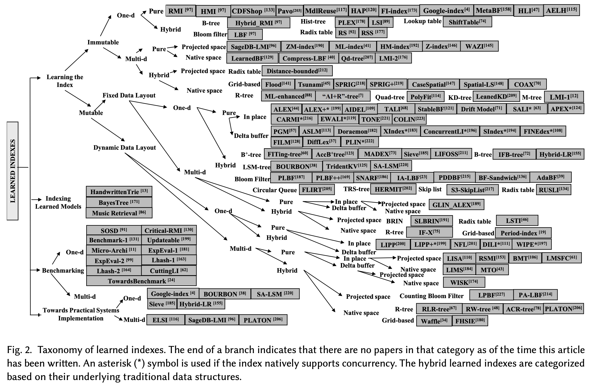

## 作者发布“24年数据库领域最热门 paper”确痛批学术圈早已空心化，论文不过是文字垃圾罢了!   
                          
### 作者                          
digoal                          
                          
### 日期                          
2025-10-23                       
                          
### 标签                          
PostgreSQL , PolarDB , DuckDB , Ryan Marcus , 数据库2024年度最热门paper             
                          
----                          
                          
## 背景    
作者 Ryan Marcus，宾夕法尼亚大学计算机科学系助理教授。作者正在利用机器学习构建下一代数据管理工具，这些工具能够自动适应新硬件和用户工作负载、发明新颖的处理策略，并理解用户意图。  
  
作者的研究兴趣尤其集中在查询优化、索引结构、智能云、编程语言运行时、面向数据处理的程序合成，以及强化学习在系统问题中的应用。  
  
下面是一篇他的文章: https://rmarcus.info/blog/2025/03/28/hottest-db-topics.html  
  
# 2024 年数据库领域最热门的研究话题（基于文献计量学视角）  
  
从[数据库公司](https://www.bytebase.com/blog/database-tool-review-2024/)到著名的“数据库学”教授 [Andy Pavlo](https://www.cs.cmu.edu/~pavlo/blog/2025/01/2024-databases-retrospective.html)，似乎人人都在撰写自己对数据库世界的“年度回顾”。虽然我既无法企及 Andy 的机智，也无法像他那样真诚地崇拜 Larry Ellison，但我认为，或许我可以从[文献计量学](https://en.wikipedia.org/wiki/Bibliometrics)的角度，为数据库研究中最热门的话题提供一些额外的见解。  
  
过去几年，我一直通过引用图谱和 PageRank 算法维护一份[数据库研究者与论文的“排名”](https://rmarcus.info/blog/2023/07/25/papers.html)。我们可以使用相同的数据，找出引用增长最快（且排除自引）的论文——这或许可以合理地作为“热度”的代理指标。    
需要注意的是，这些论文之所以被大量引用，可能是因为它们**代表了某个领域的基准方法，或者是某条研究路线的开山之作**，因此它们本身未必就是当前最“热”的工作。  
  
下面列出了引用增长最快的 20 篇非自引论文。  
  
---  
  
## 学习型索引（Learned Indexes）  
  
| 排名 | 标题 | 年份 | 非自引次数 | 年均引用 |  
|------|------|------|------------|----------|  
| 1 | [《学习型索引结构的案例》（The Case for Learned Index Structures）](https://dl.acm.org/doi/10.1145/3183713.3196909) | 2018 | 142 | 20 |  
| 12 | [《ALEX：一种可更新的自适应学习型索引》（ALEX: An Updatable Adaptive Learned Index）](https://dl.acm.org/doi/10.1145/3318464.3389711) | 2020 | 59 | 11 |  
  
自从 Tim Kraska（在谷歌休假期间完成该工作，随后[从布朗大学转至麻省理工学院](https://engineering.mit.edu/faculty/tim-kraska/)）发表关于学习型索引的论文以来，数据库社区一直在积极开发新的学习型索引、对其进行基准测试，并将其集成到实际系统中。普渡大学最近的一篇[综述论文](https://arxiv.org/abs/2403.06456)清晰地展示了这一领域的爆炸式增长：  
  
  
    
  
  
据我所知，《ALEX》是第一篇实现可更新学习型索引的论文，它利用了一种自适应树结构。第一作者 [Jialin Ding](https://jialinding.github.io/) 当时是 Kraska 实验室的博士生，如今已是[普林斯顿大学的教员](https://research.princeton.edu/news/board-approves-22-new-faculty-appointments)。Jialin 还是另一篇论文的主要作者，该论文描述了[如何将多维学习型索引集成到 AWS Redshift 中](https://www.amazon.science/publications/automated-multidimensional-data-layouts-in-amazon-redshift)。  
  
Kraska 的论文最初引发轰动已有一段时间了，但作为一篇 SIGMOD 论文，它当时颇具争议。网上充斥着各种讨论：[我们是否该扔掉算法教科书？](https://dawnd9.sites.stanford.edu/news/dont-throw-out-your-algorithms-book-just-yet-classical-data-structures-can-outperform-learned) 还是继续用 [B-Tree？](https://databasearchitects.blogspot.com/2017/12/the-case-for-b-tree-index-structures.html) 在我看来，部分混乱源于原始 SIGMOD 论文并未附带代码。如果你不相信某个想法，很容易随手写出一个糟糕的实现。幸运的是，自 2018 年以来，我们对[学习型索引为何有效](https://proceedings.mlr.press/v119/ferragina20a)已经有了更清晰的理解。  
  
---  
  
## （学习型）查询优化（(Learned) Query Optimization）  
  
| 排名 | 标题 | 年份 | 非自引次数 | 年均引用 |  
|------|------|------|------------|----------|  
| 2 | [《学习型基数估计：使用深度学习估计相关联接》（Learned Cardinalities: Estimating Correlated Joins with Deep Learning）](https://arxiv.org/pdf/1809.00677) | 2019 | 124 | 20 |  
| 3 | [（	Neo: A Learned Query Optimizer）](https://dl.acm.org/doi/10.14778/3342263.3342644) | 2019 | 116 | 19 |  
| 4 | [《查询优化器到底有多好？》（How Good Are Query Optimizers, Really?）](https://dl.acm.org/doi/10.14778/2850583.2850594) | 2015 | 188 | 18 |  
| 7 | [（Bao: Making Learned Query Optimization Practical）](https://dl.acm.org/doi/10.1145/3448016.3452838) | 2021 | 57 | 14 |  
| 19 | [《端到端的学习型代价估计器》（An End-to-End Learning-based Cost Estimator）](https://dl.acm.org/doi/10.14778/3368289.3368296) | 2019 | 61 | 10 |  
| 20 | [《我们准备好使用学习型基数估计了吗？》（Are We Ready For Learned Cardinality Estimation?）](https://dl.acm.org/doi/abs/10.14778/3461535.3461552) | 2021 | 42 | 10 |  
  
可以说，自 2001 年 [IBM 的 LEO 论文](http://dl.acm.org/citation.cfm?id=645927.672349)以来，我们一直在尝试构建能从错误中学习的查询优化器。毕竟，如果优化器选了一个糟糕的查询计划，为什么下次不能选个更好的呢？  
  
数据库社区至少从三个方向攻克这个问题，而这些方向在“最热门”论文中均有体现：  
  
- 使用机器学习方法（如深度学习）替代**基数估计**；  
- 使用半监督或引导式学习技术替代**代价模型**；  
- 使用**强化学习**来替代或引导整个查询优化过程。  
  
尽管学术界仍在热情洋溢地争论各种方法的优劣，工业界也在学习型查询优化方面取得了一些进展，包括：  
- [微软](https://dl.acm.org/doi/10.1145/3514221.3526052)和 [Meta](https://dl.acm.org/doi/10.14778/3611540.3611544) 部署了“引导式”优化器；  
- AWS Redshift 的[智能扩缩容](https://www.amazon.science/publications/intelligent-scaling-in-amazon-redshift)和[工作负载管理器](https://arxiv.org/abs/2403.02286)中集成了学习型性能预测器。  
  
经典论文《查询优化器到底有多好？》(How Good Are Query Optimizers, Really?) 也榜上有名，因为“联接顺序基准”（join order benchmark, JOB）如今已成为查询优化研究中的标准测试集。当然，这篇论文本身也是查询优化领域的奠基之作！  
  
---  
  
## 数据库管理系统引擎（DBMS Engines）  
  
| 排名 | 标题 | 年份 | 非自引次数 | 年均引用 |  
|------|------|------|------------|----------|  
| 5 | [《Spark SQL：Spark 中的关系型数据处理》（Spark SQL: Relational Data Processing in Spark）](https://dl.acm.org/doi/10.1145/2723372.2742797) | 2015 | 172 | 17 |  
| 6 | [《Pregel：一个用于大规模图处理的系统》（Pregel: a system for large-scale graph processing）](https://dl.acm.org/doi/10.1145/1807167.1807184) | 2010 | 214 | 14 |  
| 10 | [《Snowflake 弹性数据仓库》（The Snowflake Elastic Data Warehouse）](https://dl.acm.org/doi/10.1145/2882903.2903741) | 2016 | 102 | 11 |  
| 11 | [《Hekaton：SQL Server 的内存优化 OLTP 引擎》（Hekaton: SQL server's memory-optimized OLTP engine）](https://www.microsoft.com/en-us/research/wp-content/uploads/2013/06/Hekaton-Sigmod2013-final.pdf) | 2013 | 138 | 11 |  
| 13 | [《Amazon Aurora：面向高吞吐量云原生关系数据库的设计考量》（Amazon Aurora: Design Considerations for High Throughput Cloud-Native Relational Databases）](https://dl.acm.org/doi/10.1145/3035918.3056101) | 2017 | 94 | 11 |  
| 16 | [《DuckDB：一个可嵌入的分析型数据库》（DuckDB: an Embeddable Analytical Database）](https://dl.acm.org/doi/10.1145/3299869.3320212) | 2019 | 65 | 10 |  
| 18 | [《为现代硬件高效编译高效查询计划》（Efficiently Compiling Efficient Query Plans for Modern Hardware）](https://dl.acm.org/doi/10.14778/2002938.2002940) | 2011 | 151 | 10 |  
  
数据库管理系统的执行模型和引擎始终是数据库社区的核心关注点。近年来，研究者开始在一些“新基础”上构建系统：  
  
- 基于 Spark SQL 的研究继续强调易用性以及与分布式开源（主要是 Apache）运行时的兼容性；  
- 基于 Pregel 的研究持续探索图数据库问题——图数据库仍未被完全解决，因其似乎既需要新的查询语言，也需要新的执行模型；  
- 基于 Hekaton 的工作不断推进内存数据处理的边界，常结合[存内计算（PIM）](https://en.wikipedia.org/wiki/In-memory_processing)或极致性能优化；  
- 社区对云数据库的痴迷也体现在大量基于 Snowflake 和 Aurora 的研究中。  
  
在我看来，最值得注意的近期成果是 **DuckDB**。长期以来，向量化、支持外存（out-of-core）的分析型数据库要么是专有产品（如 Vertica），要么深藏于慕尼黑工业大学的代码仓库中（如 Hyper，后被 Tableau 收购，再转至 Salesforce）。而 DuckDB 不仅提供了最先进的向量化数据库实现，还将其打包为一个易于使用的嵌入式工具。因此，DuckDB 已成为实现新型 OLAP 技术（如[新式连接顺序优化](https://www.vldb.org/pvldb/vol17/p1350-justen.pdf)或[机密计算](https://arxiv.org/abs/2405.11988)）的事实标准试验平台。  
  
---  
  
## 机器学习驱动的系统调优（ML-powered System Tuning）  
  
| 排名 | 标题 | 年份 | 非自引次数 | 年均引用 |  
|------|------|------|------------|----------|  
| 8 | [《通过大规模机器学习实现自动数据库管理系统调优》（Automatic Database Management System Tuning Through Large-scale Machine Learning）](https://dl.acm.org/doi/10.1145/3035918.3064029) | 2017 | 109 | 13 |  
| 17 | [《基于深度强化学习的端到端云数据库自动调优系统》（An End-to-End Automatic Cloud Database Tuning System Using Deep Reinforcement Learning）](https://dl.acm.org/doi/10.1145/3299869.3300085) | 2019 | 60 | 10 |  
  
数据库有无数“旋钮”（knobs）。无论是经典的 PostgreSQL `shared_buffers`，还是更冷门的 Vertica 资源池配置，为你的工作负载设置合适的参数始终是性能调优的关键步骤。  
  
这一类别中最热门的两篇论文都采用了机器学习技术——强化学习或贝叶斯优化。基于这两项工作的后续研究在云环境和本地部署中都取得了显著进展。特别值得一提的是康奈尔大学 [Immanuel Trummer 实验室](https://itrummer.github.io/)的 [**DB-BERT**](https://arxiv.org/abs/2112.10925) 系列工作，它将大语言模型（LLM）引入这一本已高度依赖机器学习的领域，开发出几乎能“读懂手册”的数据库调优器。  
  
---  
  
## 数据清洗与实体匹配（Data Cleaning and Matching）  
  
| 排名 | 标题 | 年份 | 非自引次数 | 年均引用 |  
|------|------|------|------------|----------|  
| 9 | [《使用预训练语言模型进行深度实体匹配》（Deep Entity Matching with Pre-Trained Language Models）](https://dl.acm.org/doi/10.14778/3421424.3421431) | 2020 | 66 | 13 |  
| 14 | [《HoloClean：基于概率推理的整体数据修复》（HoloClean: Holistic Data Repairs with Probabilistic Inference）](https://dl.acm.org/doi/10.14778/3137628.3137631) | 2017 | 90 | 11 |  
| 15 | [《实体匹配的深度学习：设计空间探索》（Deep Learning for Entity Matching: A Design Space Exploration）](https://dl.acm.org/doi/10.1145/3183713.3196926) | 2018 | 71 | 10 |  
  
数据库系统的价值取决于其所含数据的质量！垃圾进，垃圾出(Garbage in, garbage out)。数据清洗和实体匹配工具对于将混乱转化为结构至关重要，它们使分析成为可能，并有望挖掘出我们津津乐道的“可操作的商业洞察”。  
  
正如你所料，当前的主流趋势是将大语言模型（LLM）及其他最新机器学习成果整合进传统的数据清洗与匹配工具中。尽管这些系统的延迟仍有待优化，但其准确性有时比以往方法高出几个数量级。  
  
这一趋势的优秀案例包括 [Chris Re 实验室](https://cs.stanford.edu/~chrismre/) [Avanika Narayan](https://knight-hennessy.stanford.edu/people/avanika-narayan) 的工作，表明 [LLM（“基础模型”）在多种数据整理任务中表现卓越](https://www.vldb.org/pvldb/vol16/p738-narayan.pdf)。更进一步的方法是 [Nan Tang](https://nantang.github.io/publications/) 最近提出的[“关系型预训练 Transformer”（Relational Pre-trained Transformer）](https://arxiv.org/pdf/2012.02469)，该模型专为数据清洗任务训练，甚至能处理复杂的非第一范式（non-1NF）数据类型，比如 JSON（当然，我们的数据库总是严格遵循第三范式，对吧？）。  
  
---  
  
## 未来展望？  
  
又一年过去，数据库变得更快一点、更干净一点、更易用一点，也更智能一点。也许明年，[DataFusion](https://datafusion.apache.org/) 团队或 DuckDB 团队会让它们变得更便宜一点！不过千万别告诉风投。  
  
或许你想听听我这个谦卑作者的“高见”？好吧，我认为更智能、更快、更便宜、更易访问的数据库固然很棒，但为什么没人研究如何让数据库变得更**有礼貌**呢？  
  
看看我拼错 `WHERE` 时会发生什么：  
  
```sql  
imdb=# select count(*) from title were production_year=2022;  
ERROR:  syntax error at or near "production_year"  
LINE 1: select count(*) from title were production_year=2022;  
```  
  
简直**粗鲁至极**——PostgreSQL 对我毫无尊重。我想，如果我是 Mike Stonebraker 在 80 年代伯克利地下室里养大的，可能也会缺少几句“请”和“谢谢”。又或者，[学术圈早已空心化，论文不过是文字垃圾罢了](https://www.jfsowa.com/ikl/Stonebraker.pdf) —— 谁知道呢？  
  
（如果你真想知道我最近在忙什么，欢迎关注我们关于[离线查询优化](https://rm.cab/limeqo)的最新工作 —— SIGMOD 论文即将发布！）  
       
#### [期望 PostgreSQL|开源PolarDB 增加什么功能?](https://github.com/digoal/blog/issues/76 "269ac3d1c492e938c0191101c7238216")
  
  
#### [PolarDB 开源数据库](https://openpolardb.com/home "57258f76c37864c6e6d23383d05714ea")
  
  
#### [PolarDB 学习图谱](https://www.aliyun.com/database/openpolardb/activity "8642f60e04ed0c814bf9cb9677976bd4")
  
  
#### [PostgreSQL 解决方案集合](../201706/20170601_02.md "40cff096e9ed7122c512b35d8561d9c8")
  
  
#### [德哥 / digoal's Github - 公益是一辈子的事.](https://github.com/digoal/blog/blob/master/README.md "22709685feb7cab07d30f30387f0a9ae")
  
  
#### [About 德哥](https://github.com/digoal/blog/blob/master/me/readme.md "a37735981e7704886ffd590565582dd0")
  
  

  
