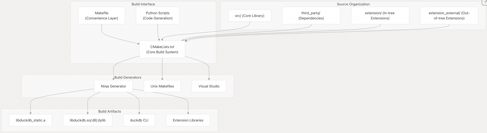
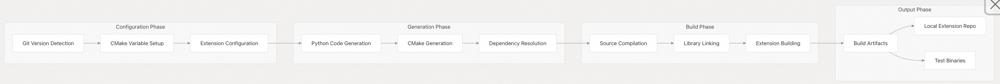
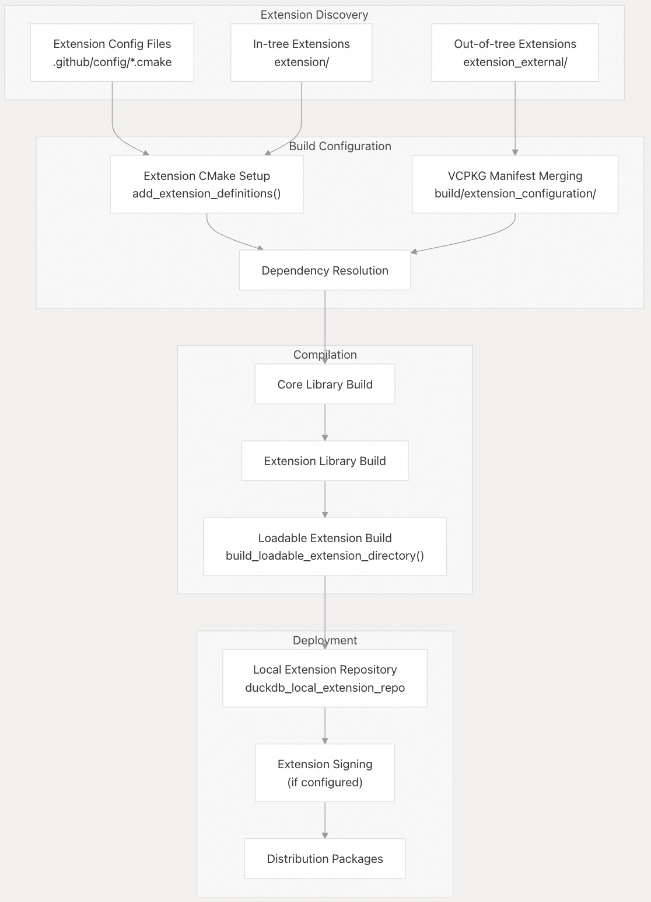
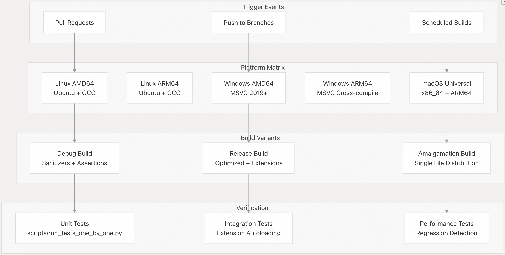

## DuckDB 源码学习: 1.2 构建 DuckDB (Building DuckDB)         
                    
### 作者                    
digoal                    
                    
### 日期                    
2025-10-23                    
                    
### 标签                    
DuckDB , 源码学习                    
                    
----                    
                    
## 背景     
本文介绍如何从源代码构建 DuckDB，包括构建系统架构、配置选项以及平台特定的注意事项。  
  
## 构建系统概述    
DuckDB 使用一个以 CMake 为核心的多层构建系统，并通过 Makefile 提供便捷的封装目标。该系统支持多种构建配置、交叉编译，并可通过构建标志进行广泛自定义。  
  
### 构建系统架构    
  
  
相关源文件：    
- [`CMakeLists.txt`（第1–50行）](https://github.com/duckdb/duckdb/blob/05a2403c/CMakeLists.txt#L1-L50)    
- [`Makefile`（第1–50行）](https://github.com/duckdb/duckdb/blob/05a2403c/Makefile#L1-L50)    
- [`src/CMakeLists.txt`（第1–20行）](https://github.com/duckdb/duckdb/blob/05a2403c/src/CMakeLists.txt#L1-L20)  
  
## 先决条件    
构建 DuckDB 需要以下工具：  
- `CMake` 3.5 or higher for build configuration  
- `C++11 compliant compiler` (GCC, Clang, MSVC)  
- `Python 3` for code generation scripts  
- `Git` for version detection  
  
**可选工具：**    
- `Ninja` build system for faster compilation  
- `ccache/sccache` for build caching  
- `clang-format` and `black` for code formatting  
  
相关源文件：  
- [`CMakeLists.txt` 第1–10行](https://github.com/duckdb/duckdb/blob/05a2403c/CMakeLists.txt#L1-L10)  
- [`README.md` 第44–46行](https://github.com/duckdb/duckdb/blob/05a2403c/README.md#L44-L46)  
  
## 基本构建命令  
  
### 快速开始    
```  
# Clone repository  
git clone https://github.com/duckdb/duckdb.git  
cd duckdb  
  
# Build release version  
make  
  
# Build debug version    
make debug  
  
# Run tests  
make unittest  
```  
  
`make` 命令是对 CMake 的便捷封装，提供常用构建目标。  
  
### 核心构建目标    
  
| 目标 | 说明 | 对应的 CMake 命令 |  
|------|------|------------------|  
| `make` | 发布（Release）构建 | `cmake --build build/release` |  
| `make debug` | 带调试符号的调试构建 | `cmake --build build/debug` |  
| `make release` | 显式执行发布构建 | 与 `make` 相同 |  
| `make unittest` | 构建并运行单元测试 | 构建 + 运行 unittest 二进制文件 |  
| `make benchmark` | 构建包含基准测试的版本 | `cmake -DBUILD_BENCHMARKS=1` |  
  
相关源文件：  
- [`Makefile`](https://github.com/duckdb/duckdb/blob/05a2403c/Makefile)  
  
### 构建配置流程    
  
  
相关源文件：  
- [`CMakeLists.txt` 第290–400行](https://github.com/duckdb/duckdb/blob/05a2403c/CMakeLists.txt#L290-L400)  
- [`Makefile` 第60–80行）](https://github.com/duckdb/duckdb/blob/05a2403c/Makefile#L60-L80)  
  
## 构建配置选项  
  
### 扩展配置    
DuckDB 通过 CMake 变量支持丰富的扩展配置：  
```  
# Build with specific core extensions  
CORE_EXTENSIONS="json;parquet;httpfs" make  
  
# Build all in-tree extensions    
BUILD_ALL_IT_EXT=1 make  
  
# Disable specific extensions  
SKIP_EXTENSIONS="parquet;httpfs" make  
  
# Build extensions statically  
EXTENSION_STATIC_BUILD=1 make  
```  
  
扩展系统支持：    
- `Core extensions`: Built into the main library  
- `Loadable extensions`: Built as separate shared libraries  
- `In-tree extensions`: Located in extension/ directory  
- `Out-of-tree extensions`: External repositories   
  
相关源文件：  
- [`CMakeLists.txt` 第112–120行](https://github.com/duckdb/duckdb/blob/05a2403c/CMakeLists.txt#L112-L120)  
- [`Makefile` 第84–157行](https://github.com/duckdb/duckdb/blob/05a2403c/Makefile#L84-L157)  
  
### 调试与开发选项    
  
| 变量 | 说明 | 默认值 |  
|------|------|--------|  
| `ENABLE_SANITIZER` | 启用地址清理器（AddressSanitizer） | TRUE |  
| `ENABLE_UBSAN` | 启用未定义行为清理器（UndefinedBehaviorSanitizer） | TRUE |  
| `CRASH_ON_ASSERT` | 断言失败时触发 abort | FALSE |  
| `FORCE_ASSERT` | 在发布版本中启用断言 | FALSE |  
| `DEBUG_ALLOCATION` | 跟踪内存分配 | FALSE |  
  
其他调试选项：    
- `DISABLE_UNITY`：禁用 Unity 构建，以获得更好的增量编译体验    
- `TREAT_WARNINGS_AS_ERRORS`：将警告视为错误    
- `FORCE_COLORED_OUTPUT`：始终启用带颜色的编译器输出    
  
相关源文件：  
- [`CMakeLists.txt`](https://github.com/duckdb/duckdb/blob/05a2403c/CMakeLists.txt#L163-L220)  
  
### 性能选项    
```  
# Use Ninja generator for faster builds  
GEN=ninja make  
  
# Enable build caching  
# ccache is auto-detected and used if available  
  
# Use more compilation threads  
CMAKE_BUILD_PARALLEL_LEVEL=8 make  
  
# Build with jemalloc  
BUILD_JEMALLOC=1 make  
  
# Enable native architecture optimizations  
NATIVE_ARCH=1 make  
```  
  
相关源文件：  
- [`CMakeLists.txt` 第40–48行](https://github.com/duckdb/duckdb/blob/05a2403c/CMakeLists.txt#L40-L48)  
- [`Makefile` 第27–30行](https://github.com/duckdb/duckdb/blob/05a2403c/Makefile#L27-L30)  
  
## 平台特定构建说明  
  
### Linux    
Linux 构建使用标准工具链，支持 GCC 和 Clang。  
```  
# Use specific compiler  
CC=clang CXX=clang++ make  
  
# Build with specific GCC version  
CC=gcc-10 CXX=g++-10 make  
  
# Cross-compile for different architectures  
FORCE_32_BIT=1 make  # 32-bit build  
```  
  
### Windows    
Windows 构建同时支持 MSVC 和 MinGW。  
```  
# MSVC build  
cmake -DCMAKE_BUILD_TYPE=Release -DCMAKE_GENERATOR_PLATFORM=x64  
cmake --build . --config Release  
  
# MinGW build    
cmake -G "Ninja" -DCMAKE_BUILD_TYPE=Release  
cmake --build .  
```  
  
### macOS    
macOS 支持通用二进制（Universal Binary）。  
```  
# Universal binary (x86_64 + arm64)  
OSX_BUILD_UNIVERSAL=1 make  
  
# Specific architecture  
OSX_BUILD_ARCH=arm64 make  
```  
  
相关源文件：    
- [`.github/workflows/LinuxRelease.yml` 第87–112行](https://github.com/duckdb/duckdb/blob/05a2403c/.github/workflows/LinuxRelease.yml#L87-L112)   
- [`.github/workflows/Windows.yml` 第91–96行](https://github.com/duckdb/duckdb/blob/05a2403c/.github/workflows/Windows.yml#L91-L96)    
- [`.github/workflows/OSX.yml` 第108–112行](https://github.com/duckdb/duckdb/blob/05a2403c/.github/workflows/OSX.yml#L108-L112)  
  
## 扩展系统集成  
  
### 扩展构建流水线    
  
  
相关源文件：  
- [`CMakeLists.txt`](https://github.com/duckdb/duckdb/blob/05a2403c/CMakeLists.txt#L763-L790)  
  
### 扩展配置文件    
DuckDB 使用配置文件管理扩展构建：  
- `.github/config/bundled_extensions.cmake`：生产环境使用的扩展    
- `.github/config/in_tree_extensions.cmake`：所有内置扩展    
- `.github/config/out_of_tree_extensions.cmake`：外部扩展    
  
`make extension_configuration` 目标会合并多个扩展的 VCPKG 清单文件。  
  
相关源文件：  
- [`Makefile` 第371–381行](https://github.com/duckdb/duckdb/blob/05a2403c/Makefile#L371-L381)  
- [`CMakeLists.txt` 第376–380行](https://github.com/duckdb/duckdb/blob/05a2403c/CMakeLists.txt#L376-L380)  
  
## CI/CD 构建流水线  
  
### 多平台测试矩阵   
  
  
CI 系统在多种配置下构建并测试 DuckDB，以确保兼容性和性能。  
  
相关源文件：    
- [`.github/workflows/Main.yml` 第47–127行](https://github.com/duckdb/duckdb/blob/05a2403c/.github/workflows/Main.yml#L47-L127)    
- [`.github/workflows/LinuxRelease.yml` 第65–148行](https://github.com/duckdb/duckdb/blob/05a2403c/.github/workflows/LinuxRelease.yml#L65-L148)      
- [`.github/workflows/Windows.yml` 第70–111行](https://github.com/duckdb/duckdb/blob/05a2403c/.github/workflows/Windows.yml#L70-L111)    
  
### 构件生成与部署    
各平台生成特定的构建产物：  
- Linux：`libduckdb-linux-{arch}.zip`、`duckdb_cli-linux-{arch}.zip`    
- Windows：`libduckdb-windows-{arch}.zip`、`duckdb_cli-windows-{arch}.zip`    
- macOS：`libduckdb-osx-universal.zip`、`duckdb_cli-osx-universal.zip`    
  
合并脚本（amalgamation script）在 `src/amalgamation/` 目录下生成单文件发行版。  
  
相关源文件：  
- [`scripts/amalgamation.py` 第1–50行](https://github.com/duckdb/duckdb/blob/05a2403c/scripts/amalgamation.py#L1-L50)  
- [`.github/workflows/LinuxRelease.yml` 第117–127行](https://github.com/duckdb/duckdb/blob/05a2403c/.github/workflows/LinuxRelease.yml#L117-L127)  
      
#### [期望 PostgreSQL|开源PolarDB 增加什么功能?](https://github.com/digoal/blog/issues/76 "269ac3d1c492e938c0191101c7238216")
  
  
#### [PolarDB 开源数据库](https://openpolardb.com/home "57258f76c37864c6e6d23383d05714ea")
  
  
#### [PolarDB 学习图谱](https://www.aliyun.com/database/openpolardb/activity "8642f60e04ed0c814bf9cb9677976bd4")
  
  
#### [PostgreSQL 解决方案集合](../201706/20170601_02.md "40cff096e9ed7122c512b35d8561d9c8")
  
  
#### [德哥 / digoal's Github - 公益是一辈子的事.](https://github.com/digoal/blog/blob/master/README.md "22709685feb7cab07d30f30387f0a9ae")
  
  
#### [About 德哥](https://github.com/digoal/blog/blob/master/me/readme.md "a37735981e7704886ffd590565582dd0")
  
  

  
