## DuckDB 源码学习: 2.1 向量系统与数据类型 (Vector System and Data Types)         
                      
### 作者                      
digoal                      
                      
### 日期                      
2025-10-23                      
                      
### 标签                      
DuckDB , 源码学习                      
                      
----                      
                      
## 背景       
本文介绍 DuckDB 的核心向量系统和数据类型基础设施，这是列式数据处理的基础。向量系统负责以列式批处理（columnar batches）的方式存储、表示和操作类型化数据，从而实现高效的向量化查询执行。  
  
## 架构概览  
  
DuckDB 的向量系统围绕多个核心组件构建，这些组件协同工作，以提供高效的列式数据处理：  
  
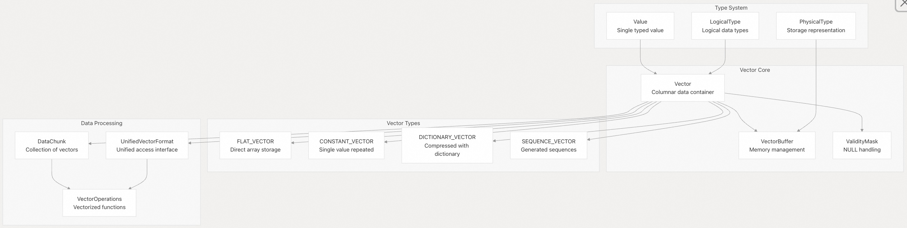   
  
**源文件：**    
- [`src/include/duckdb/common/types/vector.hpp`（第124–312行）](https://github.com/duckdb/duckdb/blob/05a2403c/src/include/duckdb/common/types/vector.hpp#L124-L312)    
- [`src/include/duckdb/common/types.hpp`（第250–458行）](https://github.com/duckdb/duckdb/blob/05a2403c/src/include/duckdb/common/types.hpp#L250-L458)    
- [`src/include/duckdb/common/types/data_chunk.hpp`（第43–127行）](https://github.com/duckdb/duckdb/blob/05a2403c/src/include/duckdb/common/types/data_chunk.hpp#L43-L127)  
  
## 核心组件  
  
### Vector 类  
  
`Vector` 类是列式数据的主要容器，用于存储类型化值的数组以及相关元数据。  
  
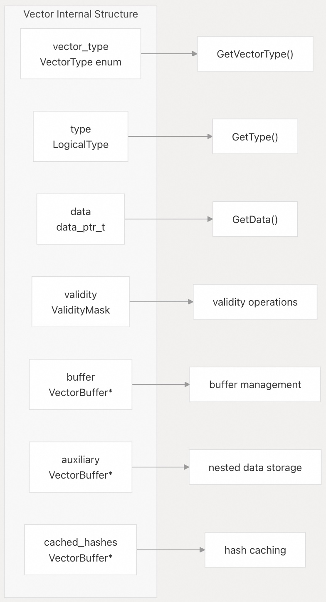   
  
关键的向量操作包括：  
- **Reference**：创建现有数据的视图，无需复制数据    
- **Slice**：使用选择向量提取子集    
- **Flatten**：转换为直接的数组存储形式    
- **ToUnifiedFormat**：转换为标准化的访问格式  
  
**源文件：**    
- [`src/include/duckdb/common/types/vector.hpp`（第295–312行）](https://github.com/duckdb/duckdb/blob/05a2403c/src/include/duckdb/common/types/vector.hpp#L295-L312)    
- [`src/common/types/vector.cpp`（第60–87行）](https://github.com/duckdb/duckdb/blob/05a2403c/src/common/types/vector.cpp#L60-L87)  
  
### 类型系统层级  
  
DuckDB 使用两级类型系统，将逻辑语义与物理存储分离：  
  
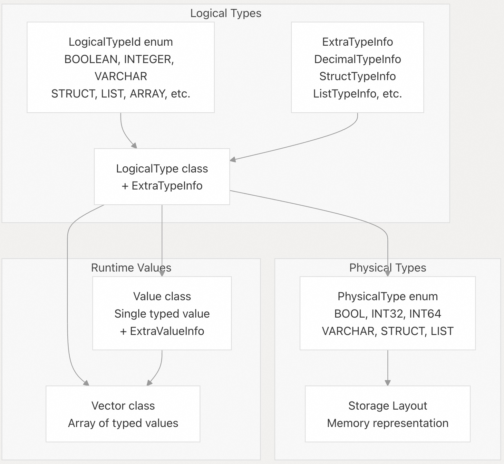   
  
从逻辑类型到物理类型的映射在保留语义信息的同时实现了优化：  
  
| 逻辑类型 | 物理类型 | 存储方式 |  
|----------|----------|----------|  
| `BOOLEAN` | `BOOL` | 每个值1字节 |  
| `INTEGER` | `INT32` | 每个值4字节 |  
| `BIGINT` | `INT64` | 每个值8字节 |  
| `VARCHAR` | `VARCHAR` | `string_t` 结构 |  
| `DECIMAL(p,s)` | `INT16/INT32/INT64/INT128` | 根据精度决定 |  
| `STRUCT` | `STRUCT` | 无直接存储 |  
| `LIST` | `LIST` | 使用 `list_entry_t` 偏移量 |  
  
**源文件：**    
- [`src/include/duckdb/common/types.hpp`（第61–178）](https://github.com/duckdb/duckdb/blob/05a2403c/src/include/duckdb/common/types.hpp#L61-L178)   
- [`src/include/duckdb/common/types.hpp`（第250–458行）](https://github.com/duckdb/duckdb/blob/05a2403c/src/include/duckdb/common/types.hpp#L250-L458)    
- [`src/common/types.cpp`（第57–165行）](https://github.com/duckdb/duckdb/blob/05a2403c/src/common/types.cpp#L57-L165)  
  
## 向量表示方式  
  
DuckDB 通过不同的向量表示方式优化内存使用和性能.  
  
### 向量表示方式概述  
  
DuckDB 使用多种向量类型来优化内存和性能,主要通过 `VectorType` 枚举定义:   
  
#### 1. FLAT_VECTOR (平面向量)  
最基本的向量类型,直接存储数据数组。 这种表示方式为每个值分配独立的存储空间,适合需要直接访问和修改数据的场景。   
  
#### 2. CONSTANT_VECTOR (常量向量)  
当一列中所有值都相同时使用,只存储单个值而不是整个数组。 这大幅减少了内存使用,特别是在处理常量表达式或过滤后的结果时。   
  
#### 3. DICTIONARY_VECTOR (字典向量)  
使用选择向量(selection vector)和子向量的组合来表示数据。 这种方式避免了数据复制,通过索引引用原始数据,在切片和过滤操作中特别高效。   
  
#### 4. SEQUENCE_VECTOR (序列向量)  
用于表示算术序列(如 1, 2, 3, ...),只需存储起始值和增量。 这种压缩表示对于生成连续数字序列非常节省内存。   
  
### 内存管理优化  
  
#### VectorBuffer 系统  
DuckDB 使用专门的缓冲区类型来管理不同数据类型的内存:    
- **STANDARD_BUFFER**: 标准数组存储  
- **STRING_BUFFER**: 字符串堆管理    
- **STRUCT_BUFFER**: 嵌套结构体的子向量   
- **LIST_BUFFER**: 列表类型的子向量    
  
#### VectorCache 重用机制  
`VectorCache` 允许重用相同的内存来处理不同的向量, 避免频繁的内存分配和释放。 通过 `ResetFromCache` 方法,向量可以快速重置为空的 FLAT_VECTOR 而无需重新分配内存。   
  
### 性能优化机制  
  
#### UnifiedVectorFormat  
为了高效处理不同类型的向量,DuckDB 提供了统一格式转换。 `ToUnifiedFormat` 方法将任何向量类型转换为标准化格式, 包含数据指针、有效性掩码和选择向量, 使得算法可以统一处理所有向量类型。   
  
#### 零拷贝操作  
通过 `Slice` 和 `Reference` 操作,向量可以共享底层数据而不需要复制。 这在过滤、投影等操作中显著提升性能。   
  
#### Flatten 操作  
当需要直接访问数据时,`Flatten` 方法将压缩的向量类型转换为 FLAT_VECTOR。 这确保了在需要时可以获得最佳的访问性能。   
  
DuckDB 的向量系统设计体现了经典的时间-空间权衡 : CONSTANT_VECTOR 和 SEQUENCE_VECTOR 牺牲少量计算时间来节省大量内存, 而 DICTIONARY_VECTOR 通过间接访问避免数据复制。VectorCache 机制进一步优化了内存分配开销,这在处理大量小批次数据时特别重要。这种多层次的优化策略使 DuckDB 能够在各种工作负载下保持高效的内存使用和查询性能。   
  
### 向量类型  
  
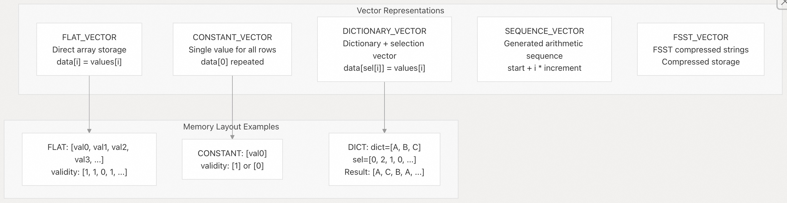   
  
每种表示方式都服务于特定的优化目的：  
- **FLAT_VECTOR**：通用数据的标准数组存储    
- **CONSTANT_VECTOR**：针对重复值的内存高效存储    
- **DICTIONARY_VECTOR**：适用于低基数数据的压缩存储    
- **SEQUENCE_VECTOR**：节省空间的等差数列存储    
- **FSST_VECTOR**：压缩的字符串存储  
  
**源文件：**    
- [`src/include/duckdb/common/enums/vector_type.hpp`](https://github.com/duckdb/duckdb/blob/05a2403c/src/include/duckdb/common/enums/vector_type.hpp)    
- [`src/common/types/vector.cpp`（第949–1017行）](https://github.com/duckdb/duckdb/blob/05a2403c/src/common/types/vector.cpp#L949-L1017)  
  
### UnifiedVectorFormat  
  
`UnifiedVectorFormat` 提供了一个标准化接口，无论底层使用何种表示方式，都能高效访问向量数据：  
  
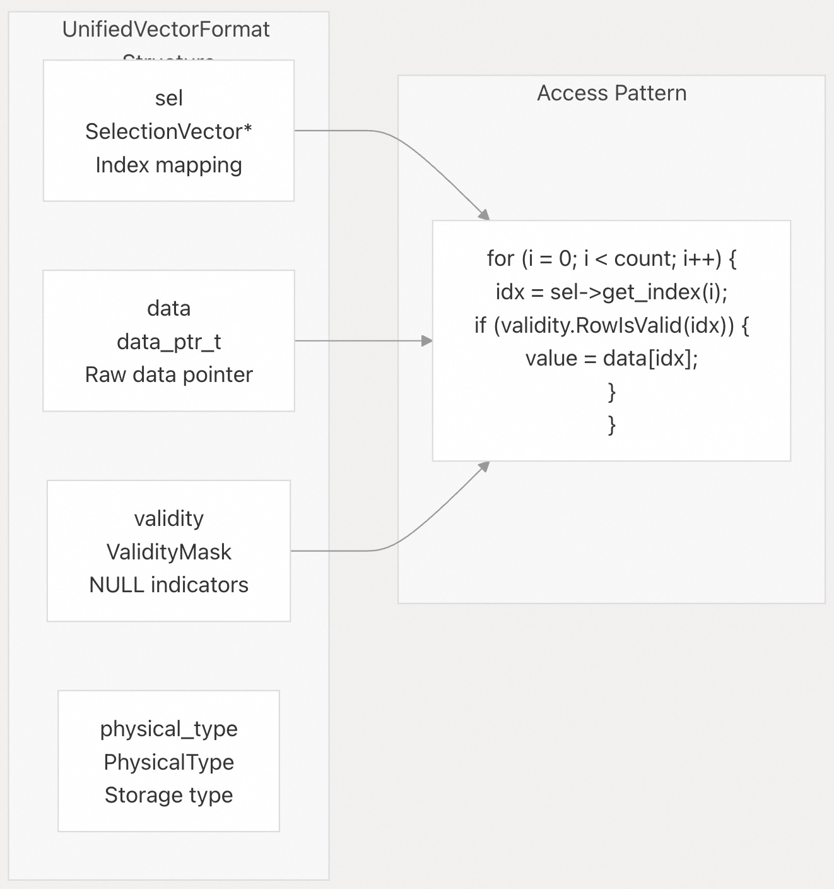   
  
该统一接口使算法能够高效处理任意类型的向量，而无需根据表示方式进行分支判断。  
  
**源文件：**    
- [`src/include/duckdb/common/types/vector.hpp`（第29–74行）](https://github.com/duckdb/duckdb/blob/05a2403c/src/include/duckdb/common/types/vector.hpp#L29-L74)    
- [`src/common/types/vector.cpp`（第180–183行）](https://github.com/duckdb/duckdb/blob/05a2403c/src/common/types/vector.cpp#L180-L183)  
  
## 数据类型分类  
  
### 基本类型  
  
DuckDB 支持全面的基本数据类型，并提供精确的位宽控制：  
  
| 类别 | 逻辑类型 | 物理类型 | 大小 |  
|------|----------|----------|------|  
| 布尔型 | `BOOLEAN` | `BOOL` | 1 字节 |  
| 有符号整数 | `TINYINT`, `SMALLINT`, `INTEGER`, `BIGINT`, `HUGEINT` | `INT8`, `INT16`, `INT32`, `INT64`, `INT128` | 1–16 字节 |  
| 无符号整数 | `UTINYINT`, `USMALLINT`, `UINTEGER`, `UBIGINT`, `UHUGEINT` | `UINT8`, `UINT16`, `UINT32`, `UINT64`, `UINT128` | 1–16 字节 |  
| 浮点数 | `FLOAT`, `DOUBLE` | `FLOAT`, `DOUBLE` | 4、8 字节 |  
| 字符串 | `VARCHAR`, `CHAR` | `VARCHAR` | 可变长度 |  
| 二进制 | `BLOB`, `BIT` | `VARCHAR` | 可变长度 |  
  
**源文件：**    
- [`src/include/duckdb/common/types.hpp`（第183–243行）](https://github.com/duckdb/duckdb/blob/05a2403c/src/include/duckdb/common/types.hpp#L183-L243)    
- [`src/common/types.cpp`（第307–349行）](https://github.com/duckdb/duckdb/blob/05a2403c/src/common/types.cpp#L307-L349)  
  
### 时间类型  
  
DuckDB 提供全面的时间类型支持，精度可达微秒级：  
  
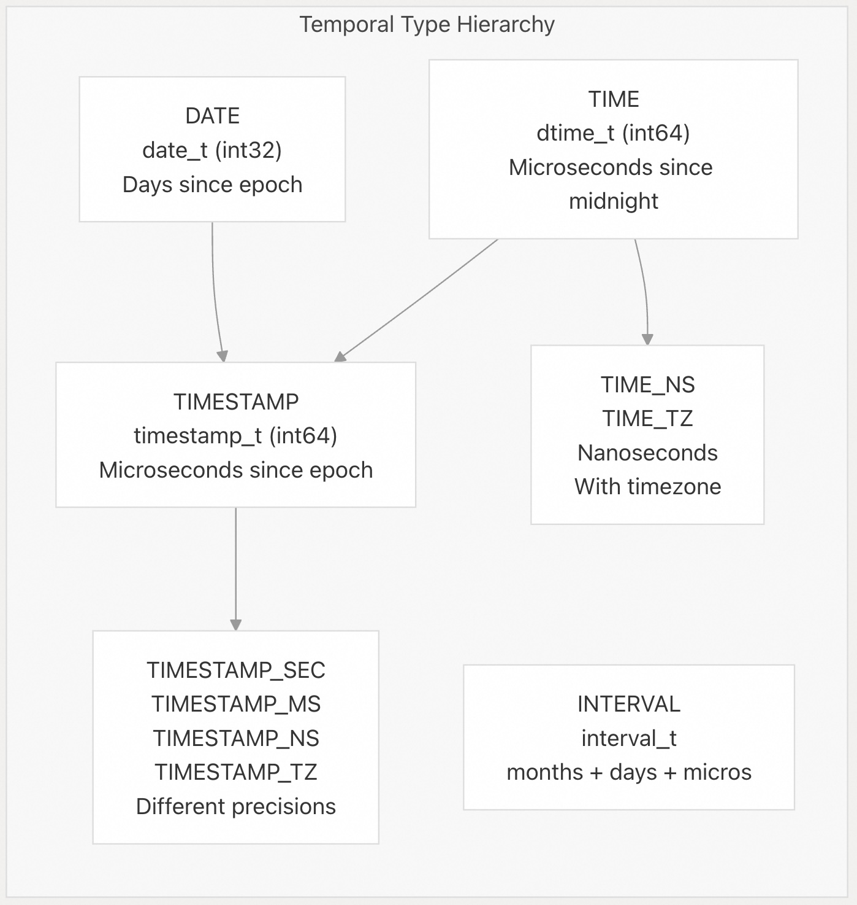   
  
所有时间类型均支持特殊值（如正无穷和负无穷），用于范围操作。  
  
**源文件：**    
- [`src/include/duckdb/common/types/timestamp.hpp`（第25–112行）](https://github.com/duckdb/duckdb/blob/05a2403c/src/include/duckdb/common/types/timestamp.hpp#L25-L112)    
- [`src/include/duckdb/common/types/date.hpp`](https://github.com/duckdb/duckdb/blob/05a2403c/src/include/duckdb/common/types/date.hpp)    
- [`src/common/types/timestamp.cpp`（第67–150行）](https://github.com/duckdb/duckdb/blob/05a2403c/src/common/types/timestamp.cpp#L67-L150)  
  
### 嵌套类型  
  
DuckDB 支持丰富的嵌套数据结构，用于复杂数据建模：  
  
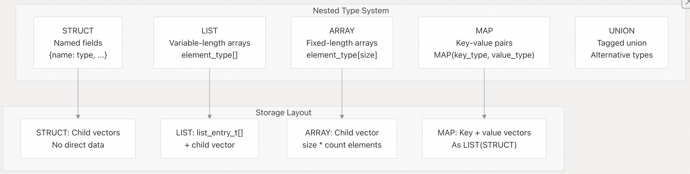   
  
嵌套类型使用辅助缓冲区来存储子向量：  
- **VectorStructBuffer**：为结构体（struct）字段存储子向量    
- **VectorListBuffer**：为列表（list）元素存储子向量    
- **VectorArrayBuffer**：为数组（array）元素存储子向量  
  
**源文件：**    
- [`src/include/duckdb/common/types/vector.hpp`（第315–400行）](https://github.com/duckdb/duckdb/blob/05a2403c/src/include/duckdb/common/types/vector.hpp#L315-L400)    
- [`src/common/types/vector.cpp`（第326–393行）](https://github.com/duckdb/duckdb/blob/05a2403c/src/common/types/vector.cpp#L326-L393)  
  
## 内存管理  
  
### 向量缓冲区  
  
DuckDB 使用复杂的缓冲区系统进行内存管理和优化：  
  
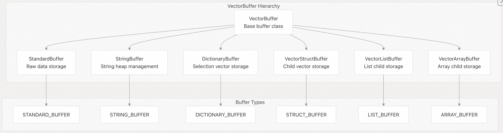   
  
缓冲区管理支持以下功能：  
- **共享所有权**：多个向量可以引用同一个缓冲区    
- **写时复制（Copy-on-write）**：在需要修改时才创建新的缓冲区    
- **内存池化**：高效地分配和复用内存    
- **辅助数据**：为元数据和嵌套结构提供独立的存储空间  
  
**源文件：**    
- [`src/include/duckdb/common/types/vector_buffer.hpp`（第23–120行）](https://github.com/duckdb/duckdb/blob/05a2403c/src/include/duckdb/common/types/vector_buffer.hpp#L23-L120)    
- [`src/common/types/vector_buffer.cpp`（第10–150行）](https://github.com/duckdb/duckdb/blob/05a2403c/src/common/types/vector_buffer.cpp#L10-L150)  
  
### 有效性掩码（Validity Masks）  
  
NULL 值通过高效的位级有效性掩码实现：  
  
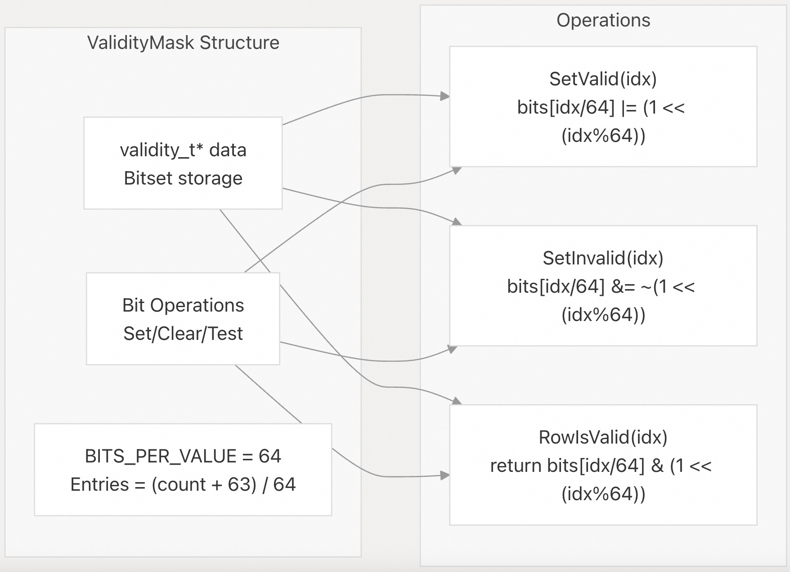   
  
有效性掩码提供以下特性：  
- **紧凑存储**：每个值仅占用 1 位    
- **高效操作**：通过位运算实现批量处理    
- **写时复制**：在修改前共享掩码    
- **向量化操作**：支持对位进行 SIMD 友好的操作  
  
**源文件：**    
- [`src/include/duckdb/common/types/validity_mask.hpp`（第59–200行）](https://github.com/duckdb/duckdb/blob/05a2403c/src/include/duckdb/common/types/validity_mask.hpp#L59-L200)    
- [`src/common/types/validity_mask.cpp`（第10–300行）](https://github.com/duckdb/duckdb/blob/05a2403c/src/common/types/validity_mask.cpp#L10-L300)  
  
## DataChunk 集成  
  
`DataChunk` 类将多个向量组合起来，表示表格数据：  
  
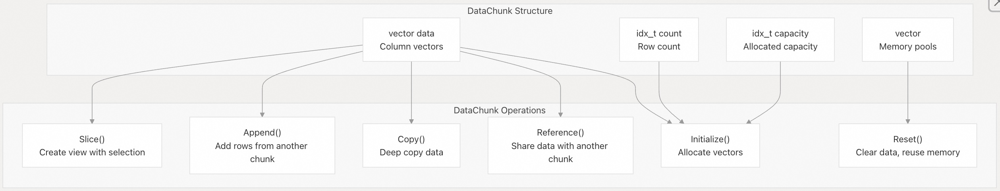   
  
DataChunk 提供以下功能：  
- **列式布局**：支持高效的向量化处理    
- **内存复用**：通过 VectorCache 池避免频繁分配内存    
- **灵活的操作**：支持引用、复制、切片和追加等操作    
- **批处理**：高效处理多行数据  
  
**源文件：**    
- [`src/include/duckdb/common/types/data_chunk.hpp`（第43–127行）](https://github.com/duckdb/duckdb/blob/05a2403c/src/include/duckdb/common/types/data_chunk.hpp#L43-L127)    
- [`src/common/types/data_chunk.cpp`（第22–357行）](https://github.com/duckdb/duckdb/blob/05a2403c/src/common/types/data_chunk.cpp#L22-L357)  
  
## 类型转换与强制转换  
  
DuckDB 通过 `TryCast` 系统提供全面的类型转换支持：  
  
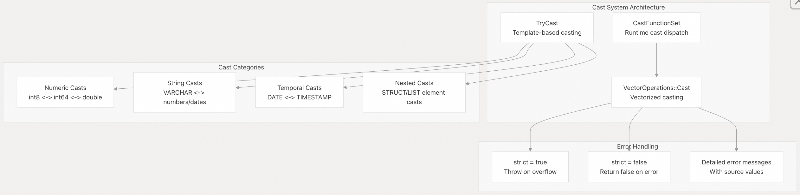   
  
转换系统支持以下功能：  
- **基于模板的转换**：在编译时对已知类型进行优化    
- **运行时分发**：根据 `LogicalType` 动态执行类型转换    
- **向量化操作**：支持批量转换并具备错误处理机制    
- **严格/宽松模式**：可配置的错误处理行为  
  
**源文件：**    
- [`src/include/duckdb/common/operator/cast_operators.hpp`（第31–800行）](https://github.com/duckdb/duckdb/blob/05a2403c/src/include/duckdb/common/operator/cast_operators.hpp#L31-L800)    
- [`src/common/operator/cast_operators.cpp`（第35–2000行）](https://github.com/duckdb/duckdb/blob/05a2403c/src/common/operator/cast_operators.cpp#L35-L2000)    
- [`src/common/vector_operations/vector_cast.cpp`（第9–43行）](https://github.com/duckdb/duckdb/blob/05a2403c/src/common/vector_operations/vector_cast.cpp#L9-L43)  
        
#### [期望 PostgreSQL|开源PolarDB 增加什么功能?](https://github.com/digoal/blog/issues/76 "269ac3d1c492e938c0191101c7238216")
  
  
#### [PolarDB 开源数据库](https://openpolardb.com/home "57258f76c37864c6e6d23383d05714ea")
  
  
#### [PolarDB 学习图谱](https://www.aliyun.com/database/openpolardb/activity "8642f60e04ed0c814bf9cb9677976bd4")
  
  
#### [PostgreSQL 解决方案集合](../201706/20170601_02.md "40cff096e9ed7122c512b35d8561d9c8")
  
  
#### [德哥 / digoal's Github - 公益是一辈子的事.](https://github.com/digoal/blog/blob/master/README.md "22709685feb7cab07d30f30387f0a9ae")
  
  
#### [About 德哥](https://github.com/digoal/blog/blob/master/me/readme.md "a37735981e7704886ffd590565582dd0")
  
  

  
