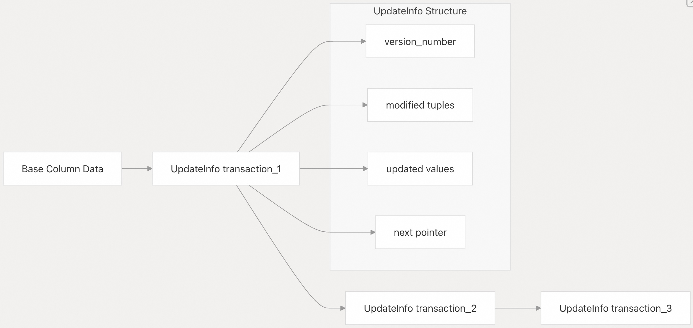

## DuckDB 源码学习: 3.1 表存储与事务 (Table Storage and Transactions)      
                        
### 作者                        
digoal                        
                        
### 日期                        
2025-10-23                        
                        
### 标签                        
DuckDB , 源码学习                        
                        
----                        
                        
## 背景         
本文介绍 DuckDB 的集成表存储与事务系统，重点说明 `DataTable`、`LocalStorage` 和 `RowGroupCollection` 如何协同工作，以提供支持 MVCC（多版本并发控制）事务隔离的持久化列式存储。  
  
该系统采用**双存储架构**：已提交的数据保存在持久化的 `RowGroup` 集合中，而未提交的更改则通过事务本地存储进行管理，从而支持高并发的 OLAP 与 OLTP 工作负载。  
  
## MVCC 存储架构概述  
  
DuckDB 实现了一个 MVCC 存储引擎，将`已提交的持久化数据`与`事务本地的更改`分离。这种双存储方法在保持 ACID 特性的同时，实现了高并发访问。  
  
### MVCC 存储架构  
    
  
### 事务隔离级别  
  
DuckDB 通过基于时间戳的可见性机制提供 MVCC 隔离：  
  
| 组件 | 职责 | 关键方法 |  
|------|------|----------|  
| `DuckTransaction` | 事务上下文与时间管理 | `GetTransactionId()`, `GetStartTime()` |  
| `RowVersionManager` | 行级 MVCC 可见性管理 | `GetSelVector()`, `Fetch()` |  
| `UpdateSegment` | 列级更新管理 | `FetchUpdates()`, `Update()` |  
| `LocalStorage` | 事务隔离 | `Commit()`, `Rollback()` |  
  
**源码位置：**    
- [`src/storage/data_table.cpp` 49–71](https://github.com/duckdb/duckdb/blob/05a2403c/src/storage/data_table.cpp#L49-L71)    
- [`src/storage/local_storage.cpp` 376–378](https://github.com/duckdb/duckdb/blob/05a2403c/src/storage/local_storage.cpp#L376-L378)    
- [`src/storage/table/row_group.cpp` 27–31](https://github.com/duckdb/duckdb/blob/05a2403c/src/storage/table/row_group.cpp#L27-L31)    
- [`src/storage/table/update_segment.cpp` 26–41](https://github.com/duckdb/duckdb/blob/05a2403c/src/storage/table/update_segment.cpp#L26-L41)  
  
## DataTable：主表接口  
  
`DataTable` 类是表操作的主要接口，协调持久化存储与事务本地修改。每个 `DataTable` 代表磁盘上的一个物理表，具有特定的模式（schema），并同时管理已提交数据和未提交的更改。  
  
### 关键组件  
  
| 组件 | 用途 | 源文件引用 |  
|------|------|------------|  
| `row_groups` | 指向包含已提交数据的 `RowGroupCollection` 的共享指针 | [`src/storage/data_table.cpp` 57](https://github.com/duckdb/duckdb/blob/05a2403c/src/storage/data_table.cpp#L57-L57) |  
| `info` | 包含元数据和索引的共享 `DataTableInfo` | [`src/storage/data_table.cpp` 52](https://github.com/duckdb/duckdb/blob/05a2403c/src/storage/data_table.cpp#L52-L52) |  
| `column_definitions` | 定义表结构的列定义向量 | [`src/storage/data_table.cpp` 53](https://github.com/duckdb/duckdb/blob/05a2403c/src/storage/data_table.cpp#L53-L53) |  
| `version` | 原子版本号，用于跟踪表状态（主表 / 已变更 / 已删除） | [`src/storage/data_table.cpp` 836–844](https://github.com/duckdb/duckdb/blob/05a2403c/src/storage/data_table.cpp#L836-L844) |  
  
    
  
### 表版本控制与事务状态  
  
`DataTable` 通过 `DataTableVersion` 枚举实现版本控制，用于模式演进（schema evolution）和事务冲突检测：  
- **MAIN_TABLE**：当前活跃版本，可接受事务操作    
- **ALTERED**：模式变更后的旧版本，阻止新的操作    
- **DROPPED**：已标记为待删除的表  
  
事务冲突在 `InitializeLocalAppend()` 和 `LocalAppend()` 等方法中被检测。  
```  
if (!IsMainTable()) {  
    throw TransactionException("Transaction conflict: attempting to insert into table \"%s\"   
                               but it has been %s by a different transaction",   
                               GetTableName(), TableModification());  
}  
```  
  
**源码位置：**    
- [`src/storage/data_table.cpp` 46–50](https://github.com/duckdb/duckdb/blob/05a2403c/src/storage/data_table.cpp#L46-L50)   
- [`src/storage/data_table.cpp` 850–854](https://github.com/duckdb/duckdb/blob/05a2403c/src/storage/data_table.cpp#L850-L854)   
- [`src/storage/data_table.cpp` 877–881](https://github.com/duckdb/duckdb/blob/05a2403c/src/storage/data_table.cpp#L877-L881)    
- [`src/include/duckdb/storage/data_table.hpp` 46–50](https://github.com/duckdb/duckdb/blob/05a2403c/src/include/duckdb/storage/data_table.hpp#L46-L50)   
  
## RowGroupCollection：行组管理  
  
`RowGroupCollection` 类管理一组 `RowGroup` 对象，为 `DataTable` 与底层列式存储之间提供接口。它负责行组的创建、扫描以及统计信息的聚合。  
  
### 核心功能  
  
    
  
该集合使用 `RowGroupSegmentTree` 高效地按行号定位行组，并通过 `CollectionScanState` 和 `ParallelCollectionScanState` 支持顺序扫描和并行扫描。  
  
**源码位置：**    
- [`src/storage/table/row_group_collection.cpp` 58–70](https://github.com/duckdb/duckdb/blob/05a2403c/src/storage/table/row_group_collection.cpp#L58-L70)  
- [`src/storage/table/row_group_collection.cpp` 152–162](https://github.com/duckdb/duckdb/blob/05a2403c/src/storage/table/row_group_collection.cpp#L152-L162)  
- [`src/storage/table/row_group_collection.cpp` 192–199](https://github.com/duckdb/duckdb/blob/05a2403c/src/storage/table/row_group_collection.cpp#L192-L199)  
  
## RowGroup：水平分区  
  
每个 `RowGroup` 表示表数据的一个水平分区，通常包含最多 `STANDARD_ROW_GROUP_SIZE`（122,880）行。行组以列式格式存储数据，并维护用于 MVCC 支持的版本信息。  
  
### RowGroup 结构  
  
    
  
### MVCC 行组操作  
  
`RowGroup` 与 `RowVersionManager` 集成，以提供行级事务可见性：  
  
#### 事务可见性方法  
  
| 方法 | 用途 | 事务处理方式 |  
|------|------|--------------|  
| `GetSelVector()` | 获取对当前事务可见的行 | 使用 `transaction_id` 和 `start_time` 进行可见性判断 |  
| `GetCommittedSelVector()` | 仅获取已提交的行 | 按提交时间戳过滤 |  
| `Fetch()` | 检查某行对事务是否可见 | 每行执行 MVCC 可见性检查 |  
| `AppendVersionInfo()` | 跟踪新插入的行 | 将行与插入事务关联 |  
  
#### MVCC 扫描模板方法  
  
`RowGroup::TemplatedScan()` 方法为 MVCC 提供了多种扫描模式：  
- **TABLE_SCAN_REGULAR**：完整的 MVCC 支持，包含事务可见性判断    
- **TABLE_SCAN_COMMITTED_ROWS**：仅扫描已提交的数据，允许更新    
- **TABLE_SCAN_COMMITTED_ROWS_DISALLOW_UPDATES**：只读的已提交数据扫描，禁止更新    
- **TABLE_SCAN_COMMITTED_ROWS_OMIT_PERMANENTLY_DELETED**：跳过已被永久删除的行  
  
**源码位置：**    
- [`src/storage/table/row_group.cpp` 755–771](https://github.com/duckdb/duckdb/blob/05a2403c/src/storage/table/row_group.cpp#L755-L771)  
- [`src/storage/table/row_group.cpp` 506–669](https://github.com/duckdb/duckdb/blob/05a2403c/src/storage/table/row_group.cpp#L506-L669)  
- [`src/storage/table/row_group.cpp` 819–822](https://github.com/duckdb/duckdb/blob/05a2403c/src/storage/table/row_group.cpp#L819-L822)  
- [`src/storage/table/row_group.cpp` 824–831](https://github.com/duckdb/duckdb/blob/05a2403c/src/storage/table/row_group.cpp#L824-L831)  
  
## ColumnData：列式存储  
  
`ColumnData` 类层次结构为不同数据类型实现列式存储。基类 `ColumnData` 提供通用接口，而特定子类处理不同类型的需求。  
  
### ColumnData 层次结构  
  
    
  
### MVCC 更新管理  
  
`ColumnData` 与 `UpdateSegment` 集成，以处理事务本地的更新，同时为其他事务保留原始数据(给其他事务读取?)。  
  
#### 更新段 MVCC 操作  
  
| 方法 | 用途 | 事务处理方式 |  
|------|------|--------------|  
| `UpdateInternal()` | 应用事务本地更新 | 创建带有 `transaction_id` 的更新链 |  
| `FetchUpdates()` | 将更新合并到扫描结果中 | 按事务可见性过滤 |  
| `FetchCommitted()` | 仅获取已提交的更新 | 使用提交时间戳 |  
| `FetchUpdateRow()` | 获取单行更新 | 每行执行事务检查 |  
  
#### 更新链结构  
  
更新形成事务感知的链式结构(transaction-aware chains)。    
  
    
  
`UpdateSegment` 通过 `rollback_update_function` 机制维护统计信息并处理回滚。  
  
**源码位置：**    
- [`src/storage/table/column_data.cpp` 296–303](https://github.com/duckdb/duckdb/blob/05a2403c/src/storage/table/column_data.cpp#L296-L303)  
- [`src/storage/table/column_data.cpp` 271–285](https://github.com/duckdb/duckdb/blob/05a2403c/src/storage/table/column_data.cpp#L271-L285)    
- [`src/storage/table/update_segment.cpp` 26–41](https://github.com/duckdb/duckdb/blob/05a2403c/src/storage/table/update_segment.cpp#L26-L41)  
- [`src/storage/table/update_segment.cpp` 82–104](https://github.com/duckdb/duckdb/blob/05a2403c/src/storage/table/update_segment.cpp#L82-L104)  
  
## MVCC 事务管理  
  
DuckDB 的 `LocalStorage` 系统通过将事务本地更改与已提交数据分离来实现 MVCC。每个事务都能看到一致的数据快照，同时允许多个事务并发修改。  
  
### LocalStorage MVCC 架构  
  
    
  
### 事务生命周期  
- **事务开始（Transaction Begin）**：为 `DuckTransaction` 创建 `LocalStorage`    
- **本地修改（Local Modifications）**：操作通过 `GetOrCreateStorage()` 写入 `LocalTableStorage`    
- **约束检查（Constraint Checking）**：`append_indexes` 和 `delete_indexes` 共同维护唯一性约束    
- **乐观写入（Optimistic Writing）**：大数据集通过 `OptimisticDataWriter` 刷写到磁盘    
- **提交（Commit）**：通过 `Flush()` 方法将更改合并到持久化存储中    
- **回滚（Rollback）**：丢弃本地存储，并清理乐观写入的数据  
  
### 关键 MVCC 方法  
  
| 方法 | 用途 | 实现位置 |  
|------|------|----------|  
| `LocalStorage::Get()` | 访问事务的本地存储 | `src/storage/local_storage.cpp` 386–396 |  
| `InitializeLocalAppend()` | 开始追加操作 | `src/storage/data_table.cpp` 848–858 |  
| `LocalAppend()` | 向事务存储中添加行 | `src/storage/data_table.cpp` 873–894 |  
| `Flush()` | 将本地更改合并到主存储 | `src/storage/local_storage.cpp` 569–610 |  
  
**源码位置：**    
- [`src/storage/local_storage.cpp` 18–26](https://github.com/duckdb/duckdb/blob/05a2403c/src/storage/local_storage.cpp#L18-L26)  
- [`src/storage/local_storage.cpp` 376–378](https://github.com/duckdb/duckdb/blob/05a2403c/src/storage/local_storage.cpp#L376-L378)  
- [`src/storage/local_storage.cpp` 569–610](https://github.com/duckdb/duckdb/blob/05a2403c/src/storage/local_storage.cpp#L569-L610)    
- [`src/storage/data_table.cpp` 848–858](https://github.com/duckdb/duckdb/blob/05a2403c/src/storage/data_table.cpp#L848-L858)  
  
## 扫描与数据访问  
  
表扫描过程需要协调持久化存储与事务本地更改，以提供一致的数据视图。  
  
### 扫描状态管理  
  
    
  
扫描过程处理以下内容：  
- **事务可见性（Transaction Visibility）**：仅显示对当前事务可见的行    
- **更新整合（Update Integration）**：将基础数据与事务本地的更新合并    
- **并行处理（Parallel Processing）**：支持跨行组的并行表扫描  
  
**源码位置：**    
- [`src/storage/data_table.cpp` 243–250](https://github.com/duckdb/duckdb/blob/05a2403c/src/storage/data_table.cpp#L243-L250)  
- [`src/storage/data_table.cpp` 303–313](https://github.com/duckdb/duckdb/blob/05a2403c/src/storage/data_table.cpp#L303-L313)    
- [`src/storage/table/row_group.cpp` 504–665](https://github.com/duckdb/duckdb/blob/05a2403c/src/storage/table/row_group.cpp#L504-L665)  
    
#### [期望 PostgreSQL|开源PolarDB 增加什么功能?](https://github.com/digoal/blog/issues/76 "269ac3d1c492e938c0191101c7238216")
  
  
#### [PolarDB 开源数据库](https://openpolardb.com/home "57258f76c37864c6e6d23383d05714ea")
  
  
#### [PolarDB 学习图谱](https://www.aliyun.com/database/openpolardb/activity "8642f60e04ed0c814bf9cb9677976bd4")
  
  
#### [PostgreSQL 解决方案集合](../201706/20170601_02.md "40cff096e9ed7122c512b35d8561d9c8")
  
  
#### [德哥 / digoal's Github - 公益是一辈子的事.](https://github.com/digoal/blog/blob/master/README.md "22709685feb7cab07d30f30387f0a9ae")
  
  
#### [About 德哥](https://github.com/digoal/blog/blob/master/me/readme.md "a37735981e7704886ffd590565582dd0")
  
  

  
