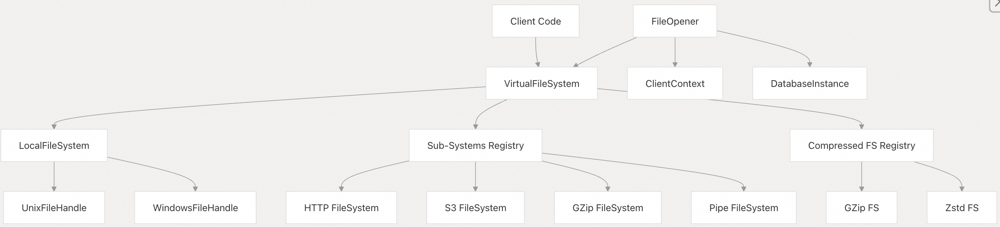
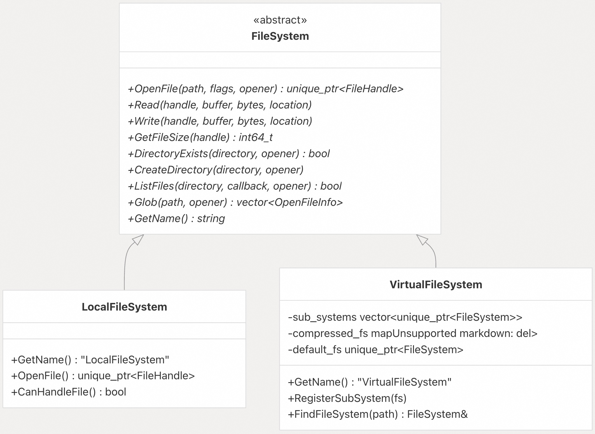
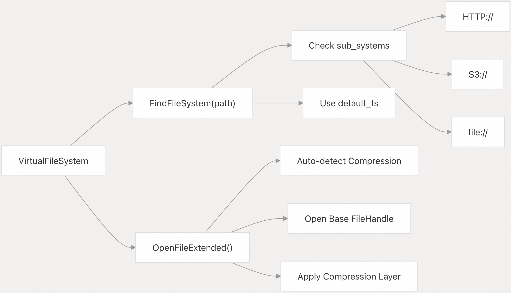
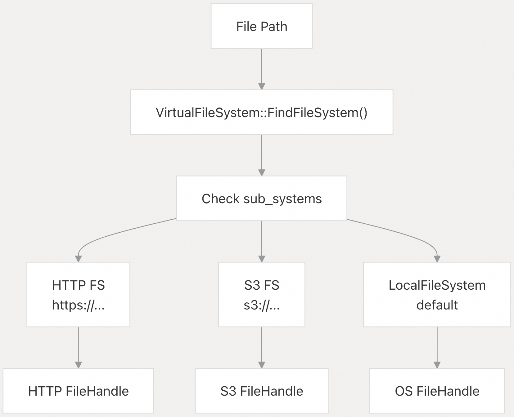
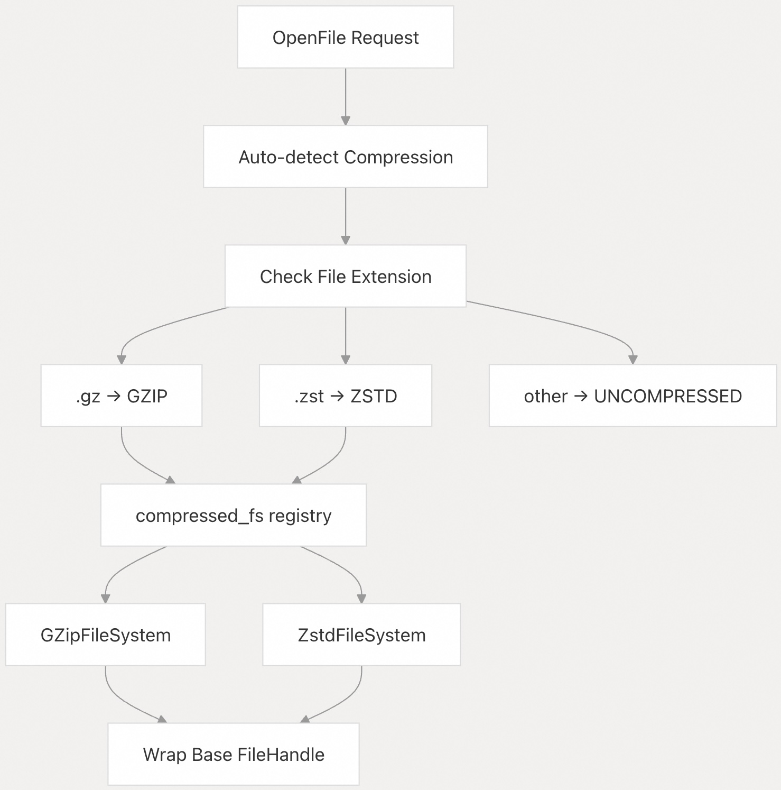
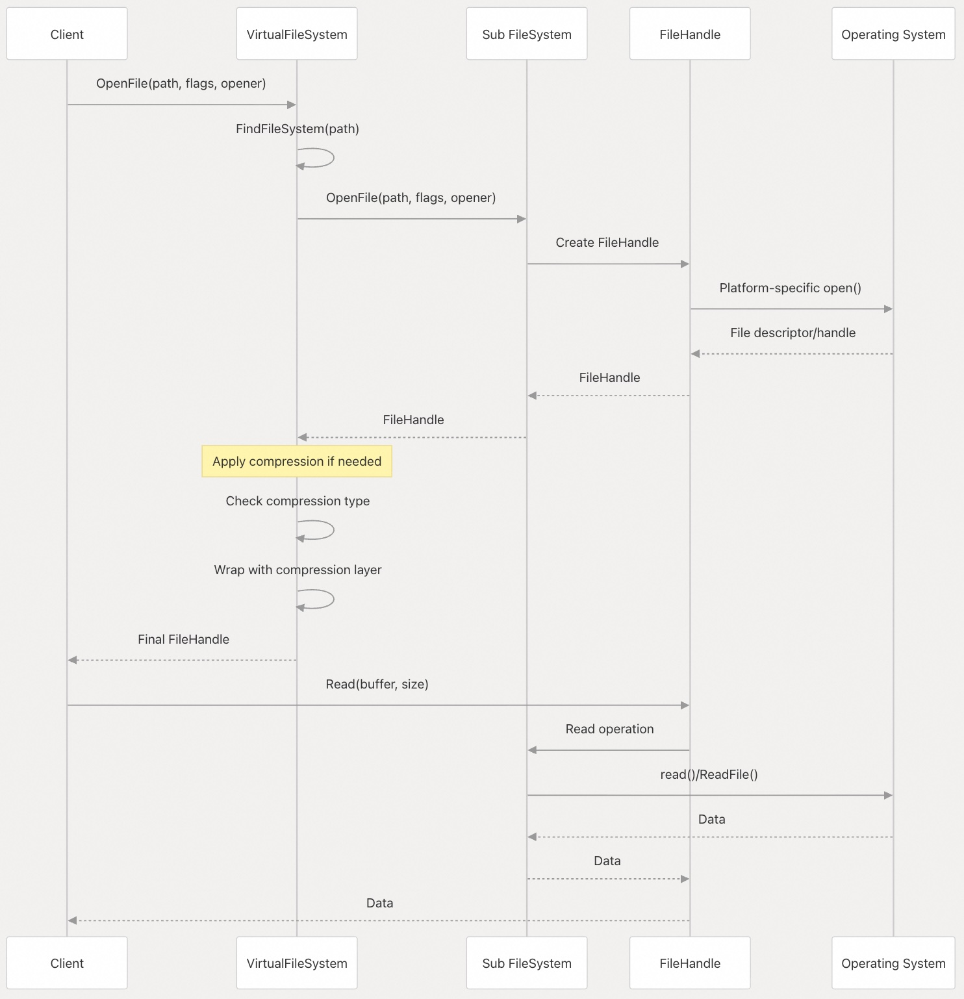
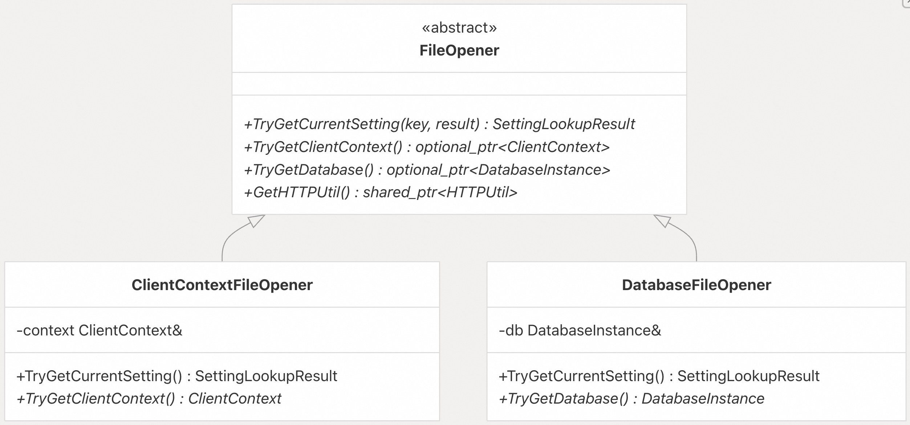

## DuckDB 源码学习: 3.2 文件系统抽象      
                          
### 作者                          
digoal                          
                          
### 日期                          
2025-10-23                          
                          
### 标签                          
DuckDB , 源码学习                          
                          
----                          
                          
## 背景           
DuckDB 的文件系统抽象为访问不同存储后端、协议和压缩格式的文件提供了统一接口。该系统通过可插拔组件的分层架构，实现了与本地文件、远程存储（HTTP/S3）、压缩文件以及自定义文件系统的无缝集成。  
  
## 架构概览  
  
文件系统抽象采用分层设计，以 `VirtualFileSystem` 作为核心协调器，根据文件路径和协议将文件操作路由到相应的子系统。  
  
  
  
**源码位置：**    
- [`src/include/duckdb/common/virtual_file_system.hpp`（第18-93行）](https://github.com/duckdb/duckdb/blob/05a2403c/src/include/duckdb/common/virtual_file_system.hpp#L18-L93)    
- [`src/common/virtual_file_system.cpp`（第10-243行）](https://github.com/duckdb/duckdb/blob/05a2403c/src/common/virtual_file_system.cpp#L10-L243)    
- [`src/include/duckdb/common/file_system.hpp`（第123-310行）](https://github.com/duckdb/duckdb/blob/05a2403c/src/include/duckdb/common/file_system.hpp#L123-L310)  
  
## 核心组件  
  
### FileSystem 基类  
  
`FileSystem` 抽象基类为所有文件系统实现定义了契约，提供了用于文件操作的虚方法：  
  
  
  
**源码位置：**    
- [`src/include/duckdb/common/file_system.hpp`（第123-310行）](https://github.com/duckdb/duckdb/blob/05a2403c/src/include/duckdb/common/file_system.hpp#L123-L310)    
- [`src/include/duckdb/common/local_file_system.hpp`（第16-113行）](https://github.com/duckdb/duckdb/blob/05a2403c/src/include/duckdb/common/local_file_system.hpp#L16-L113)    
- [`src/include/duckdb/common/virtual_file_system.hpp`（第18-93行）](https://github.com/duckdb/duckdb/blob/05a2403c/src/include/duckdb/common/virtual_file_system.hpp#L18-L93)  
  
### FileHandle 接口  
  
`FileHandle` 为已打开的文件提供操作接口，并保留对其所属文件系统的引用：  
  
**关键方法包括：**    
- `Read(buffer, nr_bytes)` —— 顺序读取    
- `Read(buffer, nr_bytes, location)` —— 随机访问读取    
- `Write(buffer, nr_bytes)` —— 顺序写入    
- `Seek(location)` —— 定位文件指针    
- `GetFileSize()` —— 获取文件大小    
  
**源码位置：**    
- [`src/include/duckdb/common/file_system.hpp`（第58-121行）](https://github.com/duckdb/duckdb/blob/05a2403c/src/include/duckdb/common/file_system.hpp#L58-L121)    
- [`src/common/file_system.cpp`（第714-869行）](https://github.com/duckdb/duckdb/blob/05a2403c/src/common/file_system.cpp#L714-L869)  
  
### VirtualFileSystem 实现  
  
`VirtualFileSystem` 作为主要入口点，采用注册表模式管理不同的文件系统后端：  
  
  
  
系统会根据文件扩展名自动检测压缩格式，并应用相应的解压缩层.    
  
**源码位置：**    
- [`src/common/virtual_file_system.cpp`（第18-60行）](https://github.com/duckdb/duckdb/blob/05a2403c/src/common/virtual_file_system.cpp#L18-L60)  
- [`src/common/virtual_file_system.cpp`（第219-241行）](https://github.com/duckdb/duckdb/blob/05a2403c/src/common/virtual_file_system.cpp#L219-L241)  
  
### LocalFileSystem 平台抽象  
  
`LocalFileSystem` 提供平台特定(platform-specific)的实现，使用不同类型的文件句柄：  
  
**Unix 实现：**    
- `UnixFileHandle`，使用文件描述符（`int fd`）    
- POSIX 系统调用：`open()`、`read()`、`write()`、`pread()`、`pwrite()`    
- 使用 `fcntl()` 与 `F_SETLK` 实现文件锁    
  
**Windows 实现：**    
- `WindowsFileHandle`，使用 Windows 句柄（`HANDLE fd`）    
- Win32 API 系统调用：`CreateFileW()`、`ReadFile()`、`WriteFile()`    
- 使用 `CreateFileW()` 中的共享模式实现文件锁    
  
**源码位置：**    
- [`src/common/local_file_system.cpp`（第146-451行）](https://github.com/duckdb/duckdb/blob/05a2403c/src/common/local_file_system.cpp#L146-L451)  
- [`src/common/local_file_system.cpp`（第817-981行）](https://github.com/duckdb/duckdb/blob/05a2403c/src/common/local_file_system.cpp#L817-L981)  
  
## 子系统注册与文件路由  
  
`VirtualFileSystem` 维护两个注册表，用于处理不同类型的文件：  
  
### 基于协议的路由  
  
  
  
### 压缩层管理  
  
系统支持自动检测压缩格式并进行分层解压缩：  
  
  
  
**源码位置：**    
- [`src/common/virtual_file_system.cpp`（第145-161行）](https://github.com/duckdb/duckdb/blob/05a2403c/src/common/virtual_file_system.cpp#L145-L161)  
- [`src/common/virtual_file_system.cpp`（第18-60行）](https://github.com/duckdb/duckdb/blob/05a2403c/src/common/virtual_file_system.cpp#L18-L60)  
  
## 文件操作流水线  
  
完整的文件操作流水线展示了请求如何流经各抽象层：  
  
  
  
**源码位置：**    
- [`src/common/virtual_file_system.cpp`（第18-60行）](https://github.com/duckdb/duckdb/blob/05a2403c/src/common/virtual_file_system.cpp#L18-L60)    
- [`src/common/file_system.cpp`（第384-408行）](https://github.com/duckdb/duckdb/blob/05a2403c/src/common/file_system.cpp#L384-L408)  
  
## FileOpener 上下文管理  
  
`FileOpener` 接口为文件操作提供上下文信息，支持配置查找和安全控制：  
  
  
  
**源码位置：**    
- [`src/include/duckdb/common/file_opener.hpp`（第28-68行）](https://github.com/duckdb/duckdb/blob/05a2403c/src/include/duckdb/common/file_opener.hpp#L28-L68)    
- [`src/include/duckdb/main/client_context_file_opener.hpp`（第19-36行）](https://github.com/duckdb/duckdb/blob/05a2403c/src/include/duckdb/main/client_context_file_opener.hpp#L19-L36)    
- [`src/include/duckdb/main/database_file_opener.hpp`（第20-46行）](https://github.com/duckdb/duckdb/blob/05a2403c/src/include/duckdb/main/database_file_opener.hpp#L20-L46)  
  
## 扩展与自定义点  
  
文件系统抽象提供了多个扩展点，用于实现自定义功能：  
  
### 自定义文件系统  
  
通过实现 `FileSystem` 接口，并调用 `VirtualFileSystem::RegisterSubSystem()` 进行注册：  
```  
// Register protocol-based file system  
vfs.RegisterSubSystem(std::move(custom_fs));  
  
// Register compression-based file system    
vfs.RegisterSubSystem(FileCompressionType::CUSTOM, std::move(custom_fs));  
```  
  
### 压缩支持  
  
通过实现 `OpenCompressedFile()` 方法并向压缩注册表注册，即可添加新的压缩格式支持。  
  
### 安全与访问控制  
  
`OpenerFileSystem` 包装器通过路径验证方法提供钩子，可用于实现安全策略。  
  
**源码位置：**    
- [`src/common/virtual_file_system.cpp`（第145-161行）](https://github.com/duckdb/duckdb/blob/05a2403c/src/common/virtual_file_system.cpp#L145-L161)    
- [`src/include/duckdb/common/opener_file_system.hpp`（第16-179行）](https://github.com/duckdb/duckdb/blob/05a2403c/src/include/duckdb/common/opener_file_system.hpp#L16-L179)  
      
#### [期望 PostgreSQL|开源PolarDB 增加什么功能?](https://github.com/digoal/blog/issues/76 "269ac3d1c492e938c0191101c7238216")
  
  
#### [PolarDB 开源数据库](https://openpolardb.com/home "57258f76c37864c6e6d23383d05714ea")
  
  
#### [PolarDB 学习图谱](https://www.aliyun.com/database/openpolardb/activity "8642f60e04ed0c814bf9cb9677976bd4")
  
  
#### [PostgreSQL 解决方案集合](../201706/20170601_02.md "40cff096e9ed7122c512b35d8561d9c8")
  
  
#### [德哥 / digoal's Github - 公益是一辈子的事.](https://github.com/digoal/blog/blob/master/README.md "22709685feb7cab07d30f30387f0a9ae")
  
  
#### [About 德哥](https://github.com/digoal/blog/blob/master/me/readme.md "a37735981e7704886ffd590565582dd0")
  
  

  
