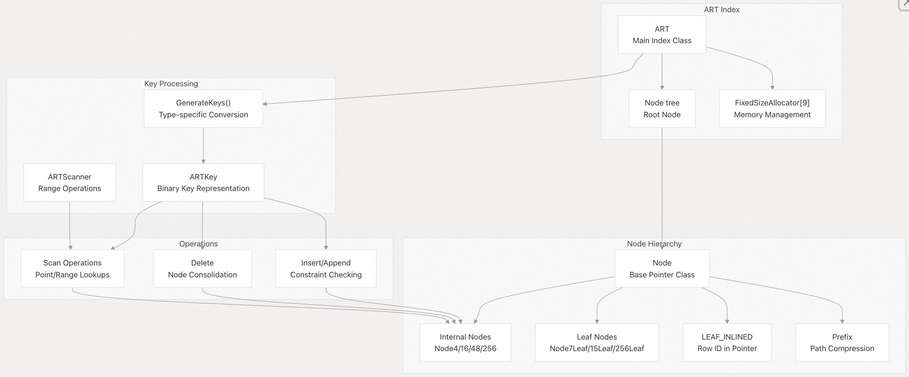
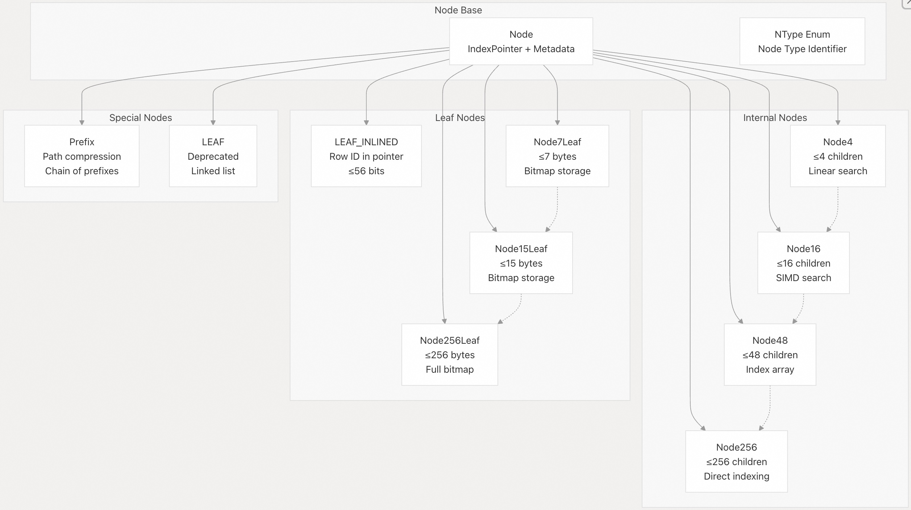
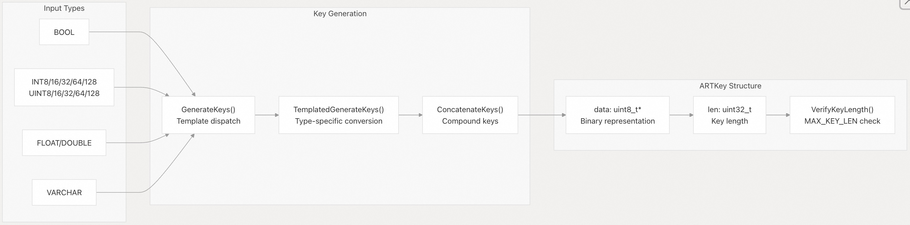
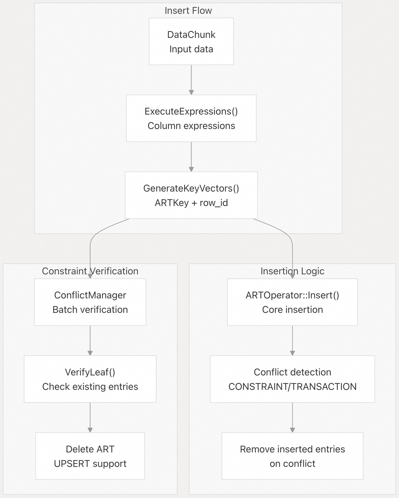
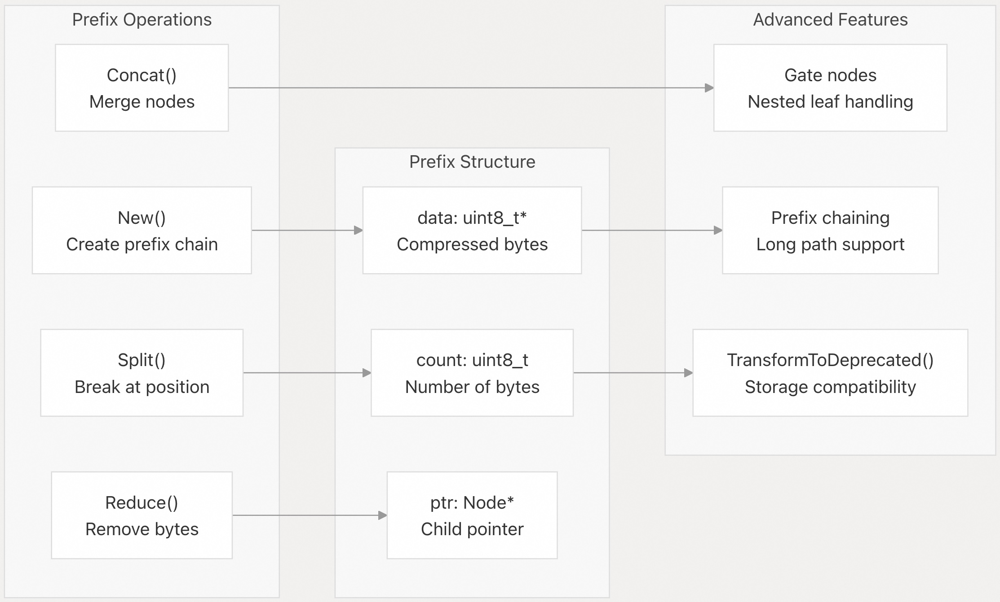

## DuckDB 源码学习: 3.3 ART 索引（Adaptive Radix Tree 索引）     
                            
### 作者                            
digoal                            
                            
### 日期                            
2025-10-23                            
                            
### 标签                            
DuckDB , 源码学习                            
                            
----                            
                            
## 背景             
ART（自适应基数树）是 DuckDB 的主要索引数据结构，用于高效支持点查询、范围扫描和约束检查。本文详细介绍 ART 索引的实现细节，包括其节点层次结构、内存管理以及核心操作。  
  
## 架构概览  
  
ART 的实现由多个关键组件协同工作，以提供高性能的索引功能：  
- ART 使用自适应的节点大小，根据子节点数量动态增长或收缩；  
- 通过 `Prefix`（前缀）节点实现路径压缩；  
- 为每种节点类型配备专用的内存分配器。  
  
  
  
来源：    
- [`src/include/duckdb/execution/index/art/art.hpp` 第 28-69 行](https://github.com/duckdb/duckdb/blob/05a2403c/src/include/duckdb/execution/index/art/art.hpp#L28-L69)    
- [`src/execution/index/art/art.cpp` 第 46-119 行](https://github.com/duckdb/duckdb/blob/05a2403c/src/execution/index/art/art.cpp#L46-L119)  
  
## 节点类型层次结构  
  
ART 使用多种节点类型，针对不同的扇出（fanout）需求进行优化：  
  
  
  
每种节点类型都有特定的容量阈值，当子节点数量变化时会触发节点的升级（growth）或降级（shrinkage），以维持最佳性能。  
  
来源：    
- [`src/include/duckdb/execution/index/art/node.hpp` 第 20-31 行](https://github.com/duckdb/duckdb/blob/05a2403c/src/include/duckdb/execution/index/art/node.hpp#L20-L31)    
- [`src/execution/index/art/node.cpp` 第 287-317 行](https://github.com/duckdb/duckdb/blob/05a2403c/src/execution/index/art/node.cpp#L287-L317)  
  
## 内存管理  
  
ART 采用一套复杂的内存管理系统，为每种节点类型配备专用的分配器：  
  
| 分配器索引 | 节点类型        | 用途                     |  
|------------|-----------------|--------------------------|  
| 0          | `PREFIX`        | 路径压缩节点(compression nodes)             |  
| 1          | `LEAF`          | 已弃用的叶节点(leaf nodes)           |  
| 2          | `NODE_4`        | 小型内部节点(internal nodes)             |  
| 3          | `NODE_16`       | 中型内部节点             |  
| 4          | `NODE_48`       | 大型内部节点             |  
| 5          | `NODE_256`      | 最大内部节点             |  
| 6          | `NODE_7_LEAF`   | 小型叶节点               |  
| 7          | `NODE_15_LEAF`  | 中型叶节点               |  
| 8          | `NODE_256_LEAF` | 大型叶节点               |  
  
每个 `FixedSizeAllocator`（固定大小分配器）为其对应的节点类型管理统一大小的内存块，从而实现高效的分配与释放模式。ART 负责管理这些分配器，并根据存储配置进行初始化。  
  
来源：    
- [`src/execution/index/art/node.cpp` 第 92-119 行](https://github.com/duckdb/duckdb/blob/05a2403c/src/execution/index/art/node.cpp#L92-L119)    
- [`src/execution/index/art/art.cpp` 第 83-103 行](https://github.com/duckdb/duckdb/blob/05a2403c/src/execution/index/art/art.cpp#L83-L103)  
  
## 键的生成与表示  
  
ART 通过 `ARTKey` 类将各种数据类型转换为可进行二进制比较的字节序列：  
  
  
  
键生成过程能正确处理 NULL 值，并通过拼接各列的键来支持复合键。对于 VARCHAR 类型和复合键，系统会验证键长度，确保不超过 `MAX_KEY_LEN * prefix_count` 字节。  
  
来源：    
- [`src/execution/index/art/art.cpp` 第 240-414 行](https://github.com/duckdb/duckdb/blob/05a2403c/src/execution/index/art/art.cpp#L240-L414)    
- [`src/execution/index/art/art.cpp` 第 54-81 行](https://github.com/duckdb/duckdb/blob/05a2403c/src/execution/index/art/art.cpp#L54-L81)  
  
## 核心操作  
  
### 插入与约束检查  
  
ART 同时支持普通插入和带约束检查的操作：  
  
  
  
系统支持 PRIMARY KEY（主键）、UNIQUE（唯一）和 FOREIGN KEY（外键）约束，并提供详细的冲突解析和错误报告机制。  
  
来源：    
- [`src/execution/index/art/art.cpp` 第 457-529 行](https://github.com/duckdb/duckdb/blob/05a2403c/src/execution/index/art/art.cpp#L457-L529)    
- [`src/execution/index/art/art.cpp` 第 840-881 行](https://github.com/duckdb/duckdb/blob/05a2403c/src/execution/index/art/art.cpp#L840-L881)  
  
### 扫描操作  
  
ART 提供高效的点查询和范围扫描功能：  
  
| 扫描类型     | 表达式                     | 方法                  |  
|--------------|----------------------------|-----------------------|  
| 相等查询     | `column = value`           | `SearchEqual()`       |  
| 大于         | `column > value`           | `SearchGreater()`     |  
| 小于         | `column < value`           | `SearchLess()`        |  
| 范围查询     | `column BETWEEN a AND b`   | `SearchCloseRange()`  |  
  
扫描过程使用 `Iterator` 类遍历树结构，并收集匹配的行 ID，最多返回指定数量(specified limit)的结果。  
  
来源：    
- [`src/execution/index/art/art.cpp` 第 616-714 行](https://github.com/duckdb/duckdb/blob/05a2403c/src/execution/index/art/art.cpp#L616-L714)    
- [`src/execution/index/art/art.cpp` 第 145-234 行](https://github.com/duckdb/duckdb/blob/05a2403c/src/execution/index/art/art.cpp#L145-L234)  
  
## 前缀压缩  
  
`Prefix` 类实现了路径压缩，以减少内存占用并提升缓存性能：  
  
  
  
当路径长度超过配置的 `prefix_count` 时，前缀节点可以链式连接；同时，它们通过“门控机制”（gate mechanism）处理重复键，支持嵌套结构。  
  
来源：    
- [`src/include/duckdb/execution/index/art/prefix.hpp` 第 18-42 行](https://github.com/duckdb/duckdb/blob/05a2403c/src/include/duckdb/execution/index/art/prefix.hpp#L18-L42)    
- [`src/execution/index/art/prefix.cpp` 第 54-97 行](https://github.com/duckdb/duckdb/blob/05a2403c/src/execution/index/art/prefix.cpp#L54-L97)  
  
## 序列化与存储  
  
ART 支持磁盘和 WAL（预写日志）两种序列化方式，并保持向后兼容性：  
  
| 存储模式 | 方法                | 特性                             |  
|----------|---------------------|----------------------------------|  
| 磁盘     | `SerializeToDisk()` | 支持部分块、集成块管理器         |  
| WAL      | `SerializeToWAL()`  | 使用内存缓冲区，快速恢复         |  
| 旧版     | `v1_0_0_storage`    | 兼容已弃用的叶节点格式           |  
  
序列化过程在需要时会将嵌套的叶节点结构转换为旧版格式，并在存储边界之间管理分配器状态。  
  
来源：    
- [`src/execution/index/art/art.cpp` 第 944-991 行](https://github.com/duckdb/duckdb/blob/05a2403c/src/execution/index/art/art.cpp#L944-L991)    
- [`src/execution/index/art/art.cpp` 第 918-942 行](https://github.com/duckdb/duckdb/blob/05a2403c/src/execution/index/art/art.cpp#L918-L942)  
      
#### [期望 PostgreSQL|开源PolarDB 增加什么功能?](https://github.com/digoal/blog/issues/76 "269ac3d1c492e938c0191101c7238216")
  
  
#### [PolarDB 开源数据库](https://openpolardb.com/home "57258f76c37864c6e6d23383d05714ea")
  
  
#### [PolarDB 学习图谱](https://www.aliyun.com/database/openpolardb/activity "8642f60e04ed0c814bf9cb9677976bd4")
  
  
#### [PostgreSQL 解决方案集合](../201706/20170601_02.md "40cff096e9ed7122c512b35d8561d9c8")
  
  
#### [德哥 / digoal's Github - 公益是一辈子的事.](https://github.com/digoal/blog/blob/master/README.md "22709685feb7cab07d30f30387f0a9ae")
  
  
#### [About 德哥](https://github.com/digoal/blog/blob/master/me/readme.md "a37735981e7704886ffd590565582dd0")
  
  

  
