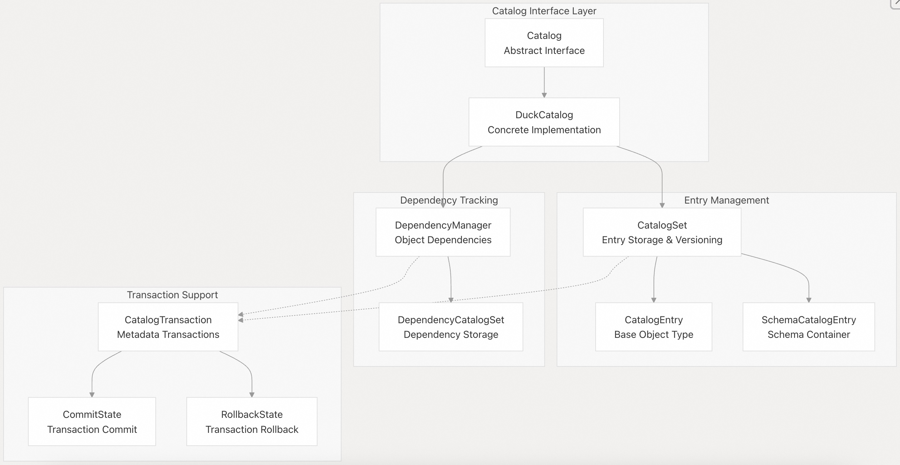
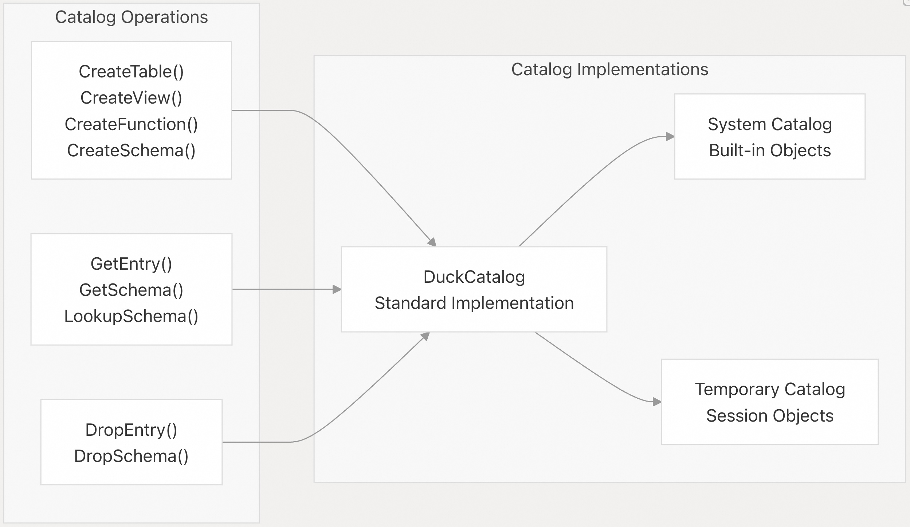
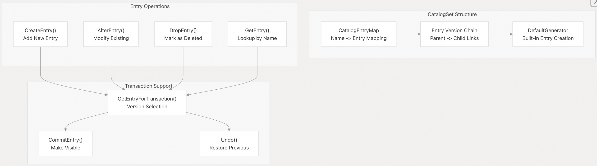
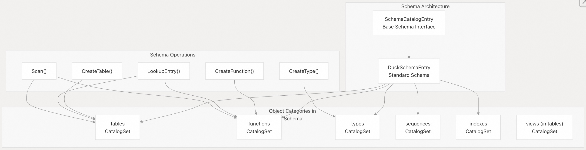
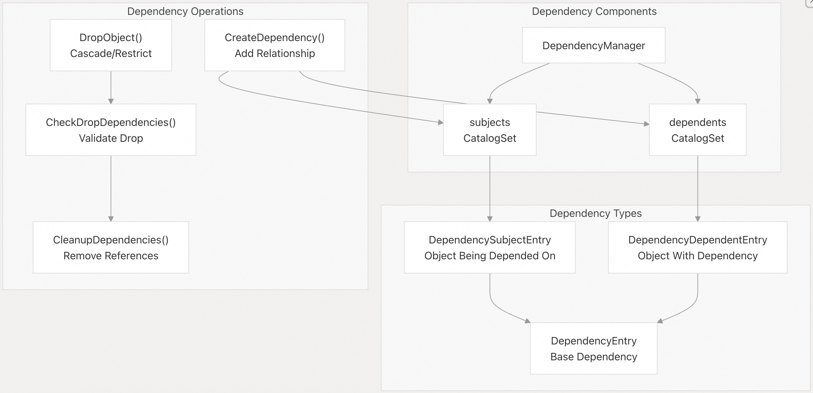
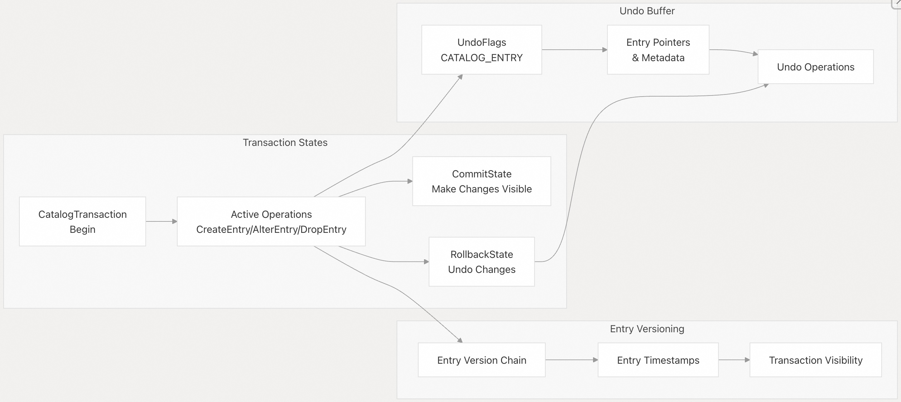
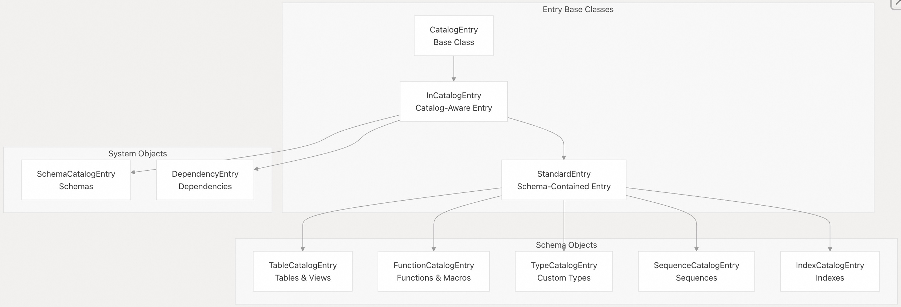
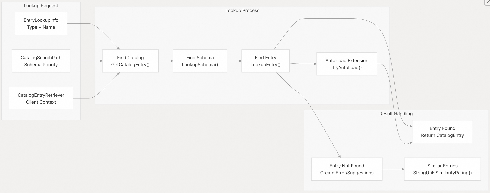

## DuckDB 源码学习: 3.4 目录系统（Catalog System）       
                              
### 作者                              
digoal                              
                              
### 日期                              
2025-10-23                              
                              
### 标签                              
DuckDB , 源码学习                              
                              
----                              
                              
## 背景               
目录系统是 DuckDB 的元数据管理基础设施，用于跟踪和组织数据库对象，例如模式（schemas）、表（tables）、视图（views）、函数（functions）、类型（types）和索引（indexes）。它提供事务性的元数据操作、对象间的依赖关系追踪，以及对数据库对象的高效查找机制。  
  
## 架构概览  
  
目录系统围绕若干核心组件构建，这些组件协同工作以实现元数据管理：  
  
  
  
**源文件：**    
- [`src/catalog/catalog.cpp`（第 47–51 行）](https://github.com/duckdb/duckdb/blob/05a2403c/src/catalog/catalog.cpp#L47-L51)    
- [`src/catalog/duck_catalog.cpp`（第 16–22 行）](https://github.com/duckdb/duckdb/blob/05a2403c/src/catalog/duck_catalog.cpp#L16-L22)    
- [`src/catalog/catalog_set.cpp`（第 85–90 行）](https://github.com/duckdb/duckdb/blob/05a2403c/src/catalog/catalog_set.cpp#L85-L90)    
- [`src/catalog/dependency_manager.cpp`（第 45–46 行）](https://github.com/duckdb/duckdb/blob/05a2403c/src/catalog/dependency_manager.cpp#L45-L46)  
  
## 核心组件  
  
### 目录接口（Catalog Interface）  
  
`Catalog` 类是所有元数据操作的主要接口。它提供了用于创建、删除和查找数据库对象的方法：  
  
  
  
**源文件：**    
- [`src/include/duckdb/catalog/catalog.hpp`（第 82–133 行）](https://github.com/duckdb/duckdb/blob/05a2403c/src/include/duckdb/catalog/catalog.hpp#L82-L133)    
- [`src/catalog/catalog.cpp`（第 119–308 行）](https://github.com/duckdb/duckdb/blob/05a2403c/src/catalog/catalog.cpp#L119-L308)      
- [`src/catalog/duck_catalog.cpp`（第 48–51 行）](https://github.com/duckdb/duckdb/blob/05a2403c/src/catalog/duck_catalog.cpp#L48-L51)    
  
### CatalogSet：条目存储与版本控制  
  
`CatalogSet` 管理目录条目的集合，并支持 MVCC（多版本并发控制）：  
  
  
  
**源文件：**    
- [`src/catalog/catalog_set.cpp`（第 85–90 行）](https://github.com/duckdb/duckdb/blob/05a2403c/src/catalog/catalog_set.cpp#L85-L90)  
- [`src/catalog/catalog_set.cpp`（第 169–210 行）](https://github.com/duckdb/duckdb/blob/05a2403c/src/catalog/catalog_set.cpp#L169-L210)  
- [`src/catalog/catalog_set.cpp`（第 516–532 行）](https://github.com/duckdb/duckdb/blob/05a2403c/src/catalog/catalog_set.cpp#L516-L532)    
- [`src/include/duckdb/catalog/catalog_set.hpp`（第 53–173 行）](https://github.com/duckdb/duckdb/blob/05a2403c/src/include/duckdb/catalog/catalog_set.hpp#L53-L173)  
  
## 模式管理（Schema Management）  
  
模式作为数据库对象的容器，通过模式目录条目（schema catalog entry）的层级结构实现：  
  
  
  
**源文件：**    
- [`src/catalog/catalog_entry/duck_schema_entry.cpp`（第 70–79 行）](https://github.com/duckdb/duckdb/blob/05a2403c/src/catalog/catalog_entry/duck_schema_entry.cpp#L70-L79)    
- [`src/catalog/catalog_entry/schema_catalog_entry.cpp`（第 13–18 行）](https://github.com/duckdb/duckdb/blob/05a2403c/src/catalog/catalog_entry/schema_catalog_entry.cpp#L13-L18)    
- [`src/include/duckdb/catalog/catalog_entry/duck_schema_entry.hpp`（第 21–38 行）](https://github.com/duckdb/duckdb/blob/05a2403c/src/include/duckdb/catalog/catalog_entry/duck_schema_entry.hpp#L21-L38)  
  
## 依赖管理（Dependency Management）  
  
`DependencyManager` 负责追踪目录对象之间的关系，以确保引用(关联关系)完整性。  
  
### 依赖架构  
  
  
  
**源文件：**    
- [`src/catalog/dependency_manager.cpp`（第 45–46 行）](https://github.com/duckdb/duckdb/blob/05a2403c/src/catalog/dependency_manager.cpp#L45-L46)   
- [`src/catalog/dependency_manager.cpp`（第 220–255 行）](https://github.com/duckdb/duckdb/blob/05a2403c/src/catalog/dependency_manager.cpp#L220-L255)   
- [`src/catalog/dependency_manager.cpp`（第 505–550 行）](https://github.com/duckdb/duckdb/blob/05a2403c/src/catalog/dependency_manager.cpp#L505-L550)    
- [`src/include/duckdb/catalog/dependency_manager.hpp`（第 82–148 行）](https://github.com/duckdb/duckdb/blob/05a2403c/src/include/duckdb/catalog/dependency_manager.hpp#L82-L148)  
  
### 依赖标志与类型  
  
系统支持多种依赖类型，每种类型具有特定的行为：  
  
| 标志类型（Flag Type） | 描述（Description）               | 删除行为（Drop Behavior）     |  
|----------------------|----------------------------------|------------------------------|  
| `BLOCKING`           | 无 CASCADE 时禁止删除             | 必须使用 CASCADE             |  
| `OWNED_BY`           | 对象由依赖项所拥有                | 自动删除                     |  
| `OWNERSHIP`          | 主体拥有依赖项                    | 删除主体时一并删除依赖项     |  
  
**源文件：**    
- [`src/include/duckdb/catalog/dependency.hpp`（第 92–155 行）](https://github.com/duckdb/duckdb/blob/05a2403c/src/include/duckdb/catalog/dependency.hpp#L92-L155)    
- [`src/catalog/dependency_manager.cpp`（第 293–302 行）](https://github.com/duckdb/duckdb/blob/05a2403c/src/catalog/dependency_manager.cpp#L293-L302)  
  
## 事务支持（Transaction Support）  
  
目录操作完全支持事务，并具备 MVCC 支持。  
  
### 事务流程  
  
  
  
**源文件：**    
- [`src/transaction/commit_state.cpp`（第 24–26 行）](https://github.com/duckdb/duckdb/blob/05a2403c/src/transaction/commit_state.cpp#L24-L26)    
- [`src/transaction/commit_state.cpp`（第 136–163 行）](https://github.com/duckdb/duckdb/blob/05a2403c/src/transaction/rollback_state.cpp#L17-L18)    
- [`src/transaction/rollback_state.cpp`（第 17–18 行）](https://github.com/duckdb/duckdb/blob/05a2403c/src/catalog/catalog_set.cpp#L184-L193)    
- [`src/catalog/catalog_set.cpp`（第 184–193 行）](https://github.com/duckdb/duckdb/blob/05a2403c/src/transaction/commit_state.cpp#L136-L163)  
  
## 条目类型与查找（Entry Types and Lookup）  
  
目录系统管理多种类型的数据库对象。  
  
### 目录条目层级结构（Catalog Entry Hierarchy）  
  
  
  
**源文件：**    
- [`src/include/duckdb/catalog/catalog_entry.hpp`（第 35–130 行）](https://github.com/duckdb/duckdb/blob/05a2403c/src/include/duckdb/catalog/catalog_entry.hpp#L35-L130)    
- [`src/catalog/catalog_entry.cpp`（第 118–123 行）](https://github.com/duckdb/duckdb/blob/05a2403c/src/catalog/catalog_entry.cpp#L118-L123)    
- [`src/catalog/catalog_entry/duck_schema_entry.cpp`（第 186–212 行）](https://github.com/duckdb/duckdb/blob/05a2403c/src/catalog/catalog_entry/duck_schema_entry.cpp#L186-L212)  
  
### 条目查找过程（Entry Lookup Process）  
  
目录系统提供复杂的查找机制，并支持搜索路径（search path）：  
  
  
  
**源文件：**    
- [`src/catalog/catalog.cpp`（第 441–480 行）](https://github.com/duckdb/duckdb/blob/05a2403c/src/catalog/catalog.cpp#L441-L480)  
- [`src/catalog/catalog.cpp`（第 517–536 行）](https://github.com/duckdb/duckdb/blob/05a2403c/src/catalog/catalog.cpp#L769-L828)  
- [`src/catalog/catalog.cpp`（第 649–767 行）](https://github.com/duckdb/duckdb/blob/05a2403c/src/catalog/catalog.cpp#L517-L536)  
- [`src/catalog/catalog.cpp`（第 769–828 行）](https://github.com/duckdb/duckdb/blob/05a2403c/src/catalog/catalog.cpp#L649-L767)  
  
目录系统构成了 DuckDB 元数据管理的基础，提供了可靠、事务性的数据库对象操作，具备复杂的依赖追踪机制和高效的查找能力。  
      
#### [期望 PostgreSQL|开源PolarDB 增加什么功能?](https://github.com/digoal/blog/issues/76 "269ac3d1c492e938c0191101c7238216")
  
  
#### [PolarDB 开源数据库](https://openpolardb.com/home "57258f76c37864c6e6d23383d05714ea")
  
  
#### [PolarDB 学习图谱](https://www.aliyun.com/database/openpolardb/activity "8642f60e04ed0c814bf9cb9677976bd4")
  
  
#### [PostgreSQL 解决方案集合](../201706/20170601_02.md "40cff096e9ed7122c512b35d8561d9c8")
  
  
#### [德哥 / digoal's Github - 公益是一辈子的事.](https://github.com/digoal/blog/blob/master/README.md "22709685feb7cab07d30f30387f0a9ae")
  
  
#### [About 德哥](https://github.com/digoal/blog/blob/master/me/readme.md "a37735981e7704886ffd590565582dd0")
  
  

  
