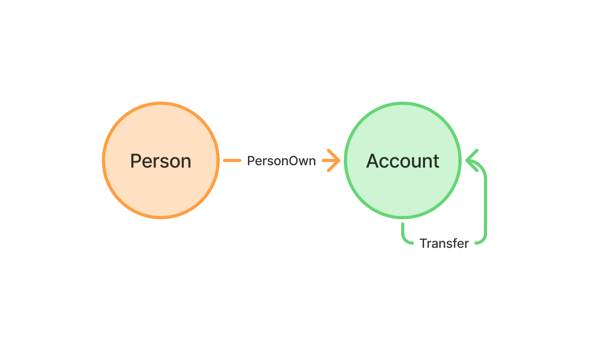

## 使用 DuckDB 图查询(PGQ)揭示金融犯罪   
                          
### 作者                          
digoal                          
                          
### 日期                          
2025-10-23                       
                          
### 标签                          
PostgreSQL , PolarDB , DuckDB , duckpgq , 图 , 交易链条 , 图式关系 , 金融犯罪 , 顶点 , vertex , 边 , edge , (拆分交易)多路径/边查询           
                          
----                          
                          
## 背景      
**TL;DR（简而言之）**：你可以在 DuckDB 中处理图数据！本文将展示如何使用 DuckDB 及其社区扩展 DuckPGQ，利用 SQL/PGQ（SQL:2023 标准的一部分）图查询语法，分析金融数据以识别欺诈模式。  
  
关于PGQ的语法和示例, 可参考我之前写的这篇文章：  
- [《图数据库赛道没了 | SQL:PGQ标准出炉, 还不懂PGQ图式查询用法? 用DuckDB将PGQ一次整明白》](../202507/20250727_01.md)    
  
追踪资金流向比看起来要困难得多。老练的罪犯会通过 *冗长而复杂的交易链条隐藏踪迹* ，试图掩盖非法资金的来源。解开这些网络是一个经典的图问题：你需要在一个庞大的账户与交易网络中，寻找可疑模式和隐藏路径。  
  
多年来，这类分析通常意味着将数据导出到专用的图数据库中，增加了复杂性和开销。但如果可以直接在你日常使用的数据库中执行这种强大的图分析呢？  
  
这正是 DuckDB 可扩展性的闪光点。在本文中，我们将深入一个金融数据集(LDBC)，使用 DuckDB 和图查询扩展(`duckpgq`)来识别可能暗示洗钱计划或其他高风险账户的模式。  
  
除了金融犯罪, 还有什么场景能用到图查询呢? 网络攻击溯源? 社交推荐系统? 电商推荐系统?   
  
下面来看一下DuckDB 这篇 blog 给出的案例: https://duckdb.org/2025/10/22/duckdb-graph-queries-duckpgq    
  
## 从关系表到属性图  
  
在开始寻找可疑活动之前，我们需要先理解我们的数据。我们使用的是 **LDBC 金融基准数据集**（LDBC Financial Benchmark dataset），它模拟了一个金融网络。要连接该数据集，请运行：  
  
```sql  
ATTACH 'https://blobs.duckdb.org/data/finbench.duckdb' AS finbench;  
USE finbench;  
```  
  
> 建议使用 DuckDB v1.4.1 版本来复现本文中的示例。  
  
本文将使用该数据集的一个子集，包含 `Person`（人员）、`Account`（账户）以及连接它们的 `AccountTransferAccount`（账户间转账）表。  
  
    
  
首先，让我们快速了解这个网络的规模：  
  
```sql  
SELECT  
    (SELECT count(*) FROM Person) AS num_persons,  
    (SELECT count(*) FROM Account) AS num_accounts,  
    (SELECT count(*) FROM AccountTransferAccount) AS num_transfers;  
```  
  
结果如下：  
  
```  
┌─────────────┬──────────────┬───────────────┐  
│ num_persons │ num_accounts │ num_transfers │  
│    int64    │    int64     │     int64     │  
├─────────────┼──────────────┼───────────────┤  
│     785     │     2055     │     8132      │  
└─────────────┴──────────────┴───────────────┘  
```  
  
这个查询让我们快速了解了所处理的实体数量和连接关系。正如上面的模式图所示，这些账户和转账表已经构成了一个图结构 —— 由**节点**（或称**顶点**，即实体）和**边**（表示实体之间的关系）组成。  
  
为了使查询更强大，我们将使用[**属性图**（Property Graph）模型](https://en.wikipedia.org/wiki/Property_graph)。这其实就是一种正式的说法：我们可以为节点和边添加描述性标签（如 `Account` 和 `Person`）以及具体属性（如 `accountId` 和 `nickname`）。  
  
如果你觉得这听起来很像关系模型，那你就完全正确了。一张 `Person` 表其实就是一组带有 `Person` 标签的节点，其列就是属性。这种自然的映射关系，使得像 DuckDB 这样的高性能关系型数据库成为图分析的理想基础。  
  
### DuckDB 中的属性图  
  
要编写图查询，我们当然可以只用熟悉的 SQL。但为了简化操作，我们可以利用 DuckDB 丰富的扩展生态。我们将使用 [**DuckPGQ**](https://duckdb.org/community_extensions/extensions/duckpgq) —— 一个社区开发的扩展，它为 DuckDB 的解析器增加了对新式可视化图语法的支持。  
  
这种新语法称为 **SQL/PGQ**（SQL/Property Graph Queries），是 **SQL:2023 标准**的一部分，部分灵感来自流行的图查询语言 [Cypher](https://en.wikipedia.org/wiki/Cypher_(query_language))。  
  
> DuckPGQ 扩展最初是一个[研究](https://duckdb.org/science/duckpgq/) [原型](https://duckdb.org/science/duckpgq-demo/) ，如今已成为社区扩展。  
  
安装并加载该扩展非常简单：  
  
```sql  
INSTALL duckpgq FROM community;  
LOAD duckpgq;  
```  
  
在 DuckPGQ 中，第一步是创建属性图，它将作为我们已有表之上的一个抽象层：  
  
```sql  
CREATE PROPERTY GRAPH finbench  
VERTEX TABLES (  
    Person,  
    Account  
)  
EDGE TABLES (  
    AccountTransferAccount  
        SOURCE KEY (fromId) REFERENCES Account (accountId)  
        DESTINATION KEY (toId) REFERENCES Account (accountId)  
        LABEL Transfer,  
    PersonOwnAccount  
        SOURCE KEY (personId) REFERENCES Person (personId)  
        DESTINATION KEY (accountId) REFERENCES Account (accountId)  
        LABEL PersonOwn  
);  
```  
  
在创建属性图时，我们明确区分了**顶点表**（VERTEX TABLES）和**边表**（EDGE TABLES）。对于顶点表，只需指定表名即可；而对于边表，则需要额外指定边表中用于连接源节点和目标节点的列（类似于[定义外键约束](https://duckdb.org/docs/stable/sql/constraints.html#foreign-keys)），并为关系类型指定一个清晰的标签（LABEL）。  
  
例如，虽然我们的表名为 `AccountTransferAccount`，但其中的边表示的是 `Transfer`（转账）关系。这就是我们在图查询中将使用的名称。  
  
现在，属性图已创建完毕，我们可以开始调查金融数据、揭开其隐藏的秘密了！  
  
## 图处理  
  
在数据库中讨论图处理时，通常指以下两类操作：  
  
- **模式匹配**（Pattern matching）：在数据中查找特定模式。  
- **路径查找**（Path-finding）：在数据中查找路径，可能是可变长度的路径。  
  
接下来，我们将看看如何利用 DuckDB 和 DuckPGQ 实现这两类任务。  
  
### 追踪可疑活动  
  
如前所述，SQL/PGQ 引入了一种可视化图语法，使图模式的表达更加自然。现在，我们就用它来寻找可能暗示洗钱行为的模式。  
  
一种常见的隐藏非法资金的技术叫做 [**“拆分交易”**（smurfing）](https://www.investopedia.com/terms/s/smurf.asp) 。其目的是将一笔可能触发报告要求的大额转账，拆分成多笔小额交易，分散在不同时间进行。  
  
我们可以通过查找**交易次数多但平均金额较低**的账户对来识别这种行为。假设我们将平均金额阈值设为 50,000 美元，看看能否找到高频交易关系：  
  
```sql  
SELECT  
    fromName,  
    count(amount) AS number_of_transactions,  
    round(avg(amount), 2) AS avg_amount,  
    toName  
FROM GRAPH_TABLE (finbench  
    MATCH (a:Account)-[t:Transfer]->(a2:Account)  
    COLUMNS (a.nickname AS fromName,  
             t.amount,  
             a2.nickname AS toName  
            )  
)  
GROUP BY ALL  
HAVING avg_amount < 50_000  
ORDER BY number_of_transactions DESC, avg_amount ASC  
LIMIT 5;  
```  
  
运行该查询后得到如下结果：  
  
```  
┌───────────────────┬────────────────────────┬────────────┬───────────────────┐  
│     fromName      │ number_of_transactions │ avg_amount │      toName       │  
│      varchar      │         int64          │   double   │      varchar      │  
├───────────────────┼────────────────────────┼────────────┼───────────────────┤  
│ Noe Trites        │                      1 │   49365.04 │ Dale Croucher     │  
│ Madeleine Bussing │                      1 │   46663.56 │ Delphine Primiano │  
│ Bonnie Centeno    │                      1 │   46663.56 │ Maile Boon        │  
│ Darci Sheedy      │                      1 │   44856.02 │ Carmella Estelle  │  
│ Marguerita Gurne  │                      1 │   44393.68 │ Delphine Primiano │  
└───────────────────┴────────────────────────┴────────────┴───────────────────┘  
```  
  
查询成功执行了，但结果并未显示任何可疑活动 —— 每对账户之间都只有 1 笔交易。这是为什么呢？让我们回顾一下查询的构造方式。  
  
关键在于 `FROM` 子句中的 `GRAPH_TABLE(finbench ...)` 函数。它允许我们在刚创建的属性图上运行图查询，并将结果当作普通表返回。  
  
`MATCH (a:Account)-[t:Transfer]->(a2:Account)` 子句是模式的核心。它以可视化方式描述了我们要查找的内容：一个从账户 `(a:Account)` 到另一个账户 `(a2:Account)` 的简单转账。其中 `()` 表示节点，`[]` 表示边，ASCII 风格的箭头 `->` 表示边的方向。`COLUMNS(...)` 子句则像 `SELECT` 一样，从匹配的模式中提取出账户昵称和转账金额。  
  
SQL/PGQ 的优势在于，图模式匹配的结果可以无缝融入我们熟悉的 SQL 语法中。我们使用 `GROUP BY ALL` 对相同账户对之间的所有转账进行聚合，并通过 `HAVING avg_amount < 50_000` 筛选出我们定义的“拆分交易”模式。  
  
我们知道查询逻辑是正确的，但该数据集中并不存在这种简单的拆分交易模式。这意味着我们必须进一步调查，使用更复杂的模式。这就引出了图查询的一个更强大功能：**查找用传统 SQL JOIN 难以表达的结构化模式**，例如交易路径。  
  
### 在交易中查找路径  
  
另一种典型的可疑行为是**交易循环**：资金在一系列转账后最终回到最初发起交易的人手中。用传统 SQL 编写这样的查询极其困难（不妨先自己试试！我们将在下一部分给出答案）。  
  
  
  
借助 SQL/PGQ，涉及路径查找的查询变得简单得多。上图展示了我们要使用的查询模式：目标是找到**同一人**（P）拥有的两个不同账户（A1 和 A2）之间存在一条或多条转账路径。  
  
注意：一个人可以拥有多个账户。下面的查询将尝试找出 ID 为 `125` 的人所拥有的账户之间的循环路径：  
  
```sql  
FROM GRAPH_TABLE(finbench  
    MATCH p = ANY SHORTEST  
                  (p:Person)-[o1:PersonOwn]->(a1:Account)  
                  -[t:Transfer]->+  
                  (a2:Account)<-[o2:PersonOwn]-(p:Person)  
WHERE  
    p.personId = 125 AND a1.accountId <> a2.accountId  
    COLUMNS (  
        path_length(p) AS path_length,  
        a1.accountId AS start_account,  
        a2.accountId AS end_account  
    )  
)  
ORDER BY path_length;  
```  
  
结果显示出该人拥有的多个账户之间存在不同长度的循环路径：  
  
```  
┌─────────────┬─────────────────────┬─────────────────────┐  
│ path_length │    start_account    │     end_account     │  
│    int64    │        int64        │        int64        │  
├─────────────┼─────────────────────┼─────────────────────┤  
│           8 │ 4753267931712848113 │ 4794926228266025204 │  
│           8 │ 4769874955338776819 │ 4794926228266025204 │  
│           8 │ 4796615078126289138 │ 4769874955338776819 │  
│           9 │ 4753267931712848113 │ 4769874955338776819 │  
│           9 │ 4769874955338776819 │ 4753267931712848113 │  
│           9 │ 4794926228266025204 │ 4753267931712848113 │  
│           9 │ 4796615078126289138 │ 4753267931712848113 │  
│           9 │ 4796615078126289138 │ 4794926228266025204 │  
│          12 │ 4794926228266025204 │ 4769874955338776819 │  
└─────────────┴─────────────────────┴─────────────────────┘  
```  
  
再次强调，关键在于 `FROM` 子句中的 `MATCH` 表达式。我们使用 `ANY SHORTEST` 来查找符合模式的最短路径。  
  
模式的第一部分找出 ID 为 125 的人所拥有的所有账户：`(p:Person)-[o1:PersonOwn]->(a1:Account)`。  
  
第二部分执行路径查找。特别注意 `+` 符号：在 `(a1:Account)-[t:Transfer]->+(a2:Account)` 中，`+` 表示两个账户之间必须存在**一条或多条**转账边（无上限）。  
  
最后，我们检查目标账户是否也由同一个人 `p` 拥有。  
  
结果证实了我们的怀疑：查询发现了多条连接该人不同账户的隐秘交易链，路径长度从 8 到 12 不等。  
  
每一行都代表一条隐藏的交易链。更有趣的是，我们可以看到明显的循环模式。例如，查询发现了一条从账户 `4753267931712848113` 到 `4769874955338776819` 的 9 步路径，以及一条反向的 9 步路径。这表明存在一种复杂且有意的资金在账户间转移行为，是值得深入调查的强烈信号。  
  
## 用传统方式实现 (递归 CTE)  
  
早前我们曾挑战你思考：如何用传统 SQL 查找这些所有权循环？现在，我们兑现承诺，给出答案。  
  
在展示查询之前，请注意两点，以便与 SQL/PGQ 版本对比：  
  
- **性能保护**：该查询需要手动设置路径长度上限（`ps.depth < 11`），以防止无限递归和在稠密图上可能出现的二次方级运行时间。而 SQL/PGQ 的 `->+` 语法无需此限制。  
- **路径长度差异**：你会注意到此查询结果中的 `path_length` 比 DuckPGQ 的结果少 2 跳。这是因为该查询只计算了 `Transfer` 边，而 DuckPGQ 查询还包含了两条 `PersonOwn` 边。  
  
考虑到这些，以下是使用传统递归 CTE 查找同一人名下任意两个账户之间最短路径的 SQL：  
  
```sql  
WITH RECURSIVE  
    owned_accounts AS (  
        SELECT accountId  
        FROM PersonOwnAccount  
        WHERE personId = 125  
    ),  
    path_search(start_node, end_node, path, depth) AS (  
        -- 基础情况：从该人某个账户发起的直接转账  
        SELECT  
            fromId,  
            toId,  
            [fromId, toId],  
            1  
        FROM  
            accounttransferaccount  
        WHERE  
            fromId IN (SELECT accountId FROM owned_accounts)  
        UNION ALL  
        -- 递归步骤：查找路径中的下一笔转账  
        SELECT  
            ps.start_node,  
            t.toId,  
            list_append(ps.path, t.toId),  
            ps.depth + 1  
        FROM path_search ps  
        JOIN accounttransferaccount t ON ps.end_node = t.fromId  
        WHERE  
            t.toId NOT IN (SELECT unnest(ps.path)) AND ps.depth < 11  
    )  
SELECT distinct start_node, end_node, min(depth) AS path_length  
FROM path_search  
WHERE end_node IN (SELECT accountId FROM owned_accounts)  
  AND start_node <> end_node  
GROUP BY ALL  
ORDER BY path_length;  
```  
  
如你所见，该逻辑需要使用 `WITH RECURSIVE` 子句、手动在列表中跟踪路径、显式检测循环。这正是 SQL/PGQ 的可视化语法旨在消除的那种冗长而复杂的查询。  
  
之前写过一篇用PG递归语句实现图搜的文章, 可参考阅读:   
- [《PostgreSQL 图式搜索(graph search)实践 - 百亿级图谱，毫秒响应》](../201801/20180102_04.md)    
  
## 总结  
  
本文最初的目标很简单：看看是否能用 DuckDB 来挖掘图分析中常见的复杂模式和隐藏路径。在深入分析金融基准数据集后，结论显而易见：**完全可以**。  
  
关键收获在于**可用性的巨大提升**。我们看到，借助 DuckPGQ 扩展提供的 SQL/PGQ 可视化语法，一个复杂的“所有权循环”查询从一个庞大的递归 CTE 变成了几行可读性极强的代码。这正是现实世界分析任务所需要的表达能力。  
  
如需了解更多关于 DuckPGQ 的信息和完整文档，请访问其官方网站：[duckpgq.org](https://duckpgq.org)。  
  
同样重要的是，整个调查都是在 DuckDB 内部完成的。通过利用扩展生态，我们在不导出数据、不管理额外专用系统的情况下，就获得了图查询的强大能力。所有计算都直接运行在 DuckDB 高性能的向量化引擎之上，数据在哪里，分析就在哪里。  
  
对于强大的分析型图查询，DuckDB 不仅是一个可行的替代方案，更是一个强大而自然的选择。下次当你需要分析数据中的连接关系时，请记住：你所需的工具，只需一条 `INSTALL` 命令即可获得 `duckpgq`。  
      
#### [期望 PostgreSQL|开源PolarDB 增加什么功能?](https://github.com/digoal/blog/issues/76 "269ac3d1c492e938c0191101c7238216")
  
  
#### [PolarDB 开源数据库](https://openpolardb.com/home "57258f76c37864c6e6d23383d05714ea")
  
  
#### [PolarDB 学习图谱](https://www.aliyun.com/database/openpolardb/activity "8642f60e04ed0c814bf9cb9677976bd4")
  
  
#### [PostgreSQL 解决方案集合](../201706/20170601_02.md "40cff096e9ed7122c512b35d8561d9c8")
  
  
#### [德哥 / digoal's Github - 公益是一辈子的事.](https://github.com/digoal/blog/blob/master/README.md "22709685feb7cab07d30f30387f0a9ae")
  
  
#### [About 德哥](https://github.com/digoal/blog/blob/master/me/readme.md "a37735981e7704886ffd590565582dd0")
  
  

  
