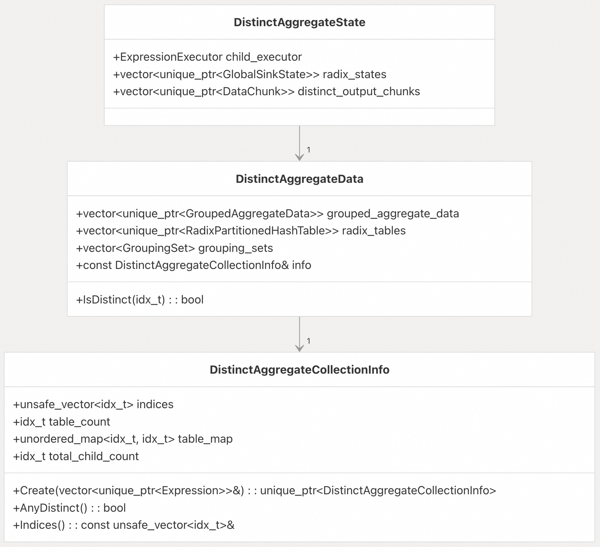

## DuckDB 源码学习: 4.2 聚合（Aggregation）     
                                  
### 作者                                  
digoal                                  
                                  
### 日期                                  
2025-10-23                                  
                                  
### 标签                                  
DuckDB , 源码学习                                  
                                  
----                                  
                                  
## 背景                   
本文介绍 DuckDB 中聚合操作的实现。聚合是分析型查询处理中的一项基础操作，用于对数据分组后计算汇总统计信息。本文涵盖了用于高效处理聚合查询的哈希表结构、物理算子和执行流水线。  
  
## DuckDB 中聚合操作概述  
  
DuckDB 实现了多种专用的聚合算子，以高效处理不同类型的聚合查询。系统会根据查询的特征（例如是否存在 `GROUP BY` 子句、分组列的数量和类型，以及可用的统计信息）自动选择最合适的算子。  
  
  
  
**相关源码位置**：    
- [`src/execution/physical_plan/plan_aggregate.cpp`（第 236-292 行）](https://github.com/duckdb/duckdb/blob/05a2403c/src/execution/physical_plan/plan_aggregate.cpp#L236-L292)    
- [`src/include/duckdb/execution/operator/aggregate/physical_hash_aggregate.hpp`（第 58-138 行）](https://github.com/duckdb/duckdb/blob/05a2403c/src/include/duckdb/execution/operator/aggregate/physical_hash_aggregate.hpp#L58-L138)    
- [`src/include/duckdb/execution/operator/aggregate/physical_ungrouped_aggregate.hpp`（第 21-76 行）](https://github.com/duckdb/duckdb/blob/05a2403c/src/include/duckdb/execution/operator/aggregate/physical_ungrouped_aggregate.hpp#L21-L76)    
- [`src/include/duckdb/execution/operator/aggregate/physical_perfecthash_aggregate.hpp`（第 18-87 行）](https://github.com/duckdb/duckdb/blob/05a2403c/src/include/duckdb/execution/operator/aggregate/physical_perfecthash_aggregate.hpp#L18-L87)    
- [`src/include/duckdb/execution/operator/aggregate/physical_partitioned_aggregate.hpp`（第 20-70 行）](https://github.com/duckdb/duckdb/blob/05a2403c/src/include/duckdb/execution/operator/aggregate/physical_partitioned_aggregate.hpp#L20-L70)  
  
## 聚合算子  
  
DuckDB 实现了四种主要的聚合算子，每种都针对特定场景进行了优化：  
  
### PhysicalUngroupedAggregate（无分组聚合）  
  
用于没有 `GROUP BY` 子句的查询，对整个输入数据计算聚合值。这是最简单的聚合形式，不需要分组或哈希表。  
```  
-- Example query using PhysicalUngroupedAggregate  
SELECT SUM(col1), AVG(col2) FROM table;  
```  
  
**相关源码位置**：    
- [`src/execution/operator/aggregate/physical_ungrouped_aggregate.cpp`（第 24-36 行）](https://github.com/duckdb/duckdb/blob/05a2403c/src/execution/operator/aggregate/physical_ungrouped_aggregate.cpp#L24-L36)      
- [`src/include/duckdb/execution/operator/aggregate/physical_ungrouped_aggregate.hpp`（第 21-76 行）](https://github.com/duckdb/duckdb/blob/05a2403c/src/include/duckdb/execution/operator/aggregate/physical_ungrouped_aggregate.hpp#L21-L76)    
  
### PhysicalHashAggregate（哈希聚合）  
  
这是通用的聚合算子，使用哈希表进行分组，适用于大多数带有 `GROUP BY` 子句的聚合查询。  
```  
-- Example query using PhysicalHashAggregate  
SELECT group_col, SUM(col1) FROM table GROUP BY group_col;  
```  
  
**相关源码位置**：    
- [`src/execution/operator/aggregate/physical_hash_aggregate.cpp`（第 106-116 行）](https://github.com/duckdb/duckdb/blob/05a2403c/src/execution/operator/aggregate/physical_hash_aggregate.cpp#L106-L116)      
- [`src/include/duckdb/execution/operator/aggregate/physical_hash_aggregate.hpp`（第 58-138 行）](https://github.com/duckdb/duckdb/blob/05a2403c/src/include/duckdb/execution/operator/aggregate/physical_hash_aggregate.hpp#L58-L138)    
  
### PhysicalPerfectHashAggregate（完美哈希聚合）  
  
当分组列具有较小且已知的值域（通过统计信息确定, 分组键的唯一值较少）时，使用此专用算子。它通过将分组值直接映射到哈希桶，从而避免哈希冲突。  
```  
-- Example query that might use PhysicalPerfectHashAggregate (if statistics support it)  
SELECT small_domain_col, COUNT(*) FROM table GROUP BY small_domain_col;  
```  
  
**相关源码位置**：    
- [`src/execution/operator/aggregate/physical_perfecthash_aggregate.cpp`（第 10-27 行）](https://github.com/duckdb/duckdb/blob/05a2403c/src/execution/operator/aggregate/physical_perfecthash_aggregate.cpp#L10-L27)      
- [`src/include/duckdb/execution/operator/aggregate/physical_perfecthash_aggregate.hpp`（第 18-87 行）](https://github.com/duckdb/duckdb/blob/05a2403c/src/include/duckdb/execution/operator/aggregate/physical_perfecthash_aggregate.hpp#L18-L87)    
  
### PhysicalPartitionedAggregate（分区聚合）  
  
当输入数据已经按分组列进行了分区时（例如从使用 Hive 分区的 Parquet 文件中读取数据），使用此算子。  
```  
-- Example query that might use PhysicalPartitionedAggregate (if data is partitioned)  
SELECT partition_col, SUM(value) FROM partitioned_table GROUP BY partition_col;  
```  
  
**相关源码位置**：    
- [`src/execution/operator/aggregate/physical_partitioned_aggregate.cpp`（第 7-13 行）](https://github.com/duckdb/duckdb/blob/05a2403c/src/execution/operator/aggregate/physical_partitioned_aggregate.cpp#L7-L13)      
- [`src/include/duckdb/execution/operator/aggregate/physical_partitioned_aggregate.hpp`（第 20-70 行）](https://github.com/duckdb/duckdb/blob/05a2403c/src/include/duckdb/execution/operator/aggregate/physical_partitioned_aggregate.hpp#L20-L70)    
  
## 聚合执行流水线  
  
聚合过程遵循一个包含多个阶段的流水线：  
  
  
  
**相关源码位置**：    
- [`src/execution/physical_plan/plan_aggregate.cpp`（第 236-336 行）](https://github.com/duckdb/duckdb/blob/05a2403c/src/execution/physical_plan/plan_aggregate.cpp#L236-L336)      
- [`src/execution/operator/aggregate/physical_hash_aggregate.cpp`（第 347-403 行）](https://github.com/duckdb/duckdb/blob/05a2403c/src/execution/operator/aggregate/physical_hash_aggregate.cpp#L347-L403)    
- [`src/execution/operator/aggregate/physical_hash_aggregate.cpp`（第 437-457 行）](https://github.com/duckdb/duckdb/blob/05a2403c/src/execution/operator/aggregate/physical_hash_aggregate.cpp#L437-L457)    
- [`src/execution/operator/aggregate/physical_hash_aggregate.cpp`（第 462-546 行）](https://github.com/duckdb/duckdb/blob/05a2403c/src/execution/operator/aggregate/physical_hash_aggregate.cpp#L462-L546)    
  
### 1. Sink 阶段（写入阶段）  
  
在 Sink 阶段，输入数据被处理并添加到哈希表中：  
- 对于分组聚合（grouped aggregation），输入行会根据分组列进行哈希；  
- 对于每个分组，聚合状态会被初始化或更新；  
- 对于 DISTINCT 聚合，不同的值会被添加到独立的哈希表中；  
- 使用线程本地（thread-local）哈希表以支持并行处理。  
  
**相关源码位置**：    
- [`src/execution/operator/aggregate/physical_hash_aggregate.cpp`（第 347-403 行）](https://github.com/duckdb/duckdb/blob/05a2403c/src/execution/operator/aggregate/physical_hash_aggregate.cpp#L347-L403)     
- [`src/execution/operator/aggregate/physical_ungrouped_aggregate.cpp`（第 331-344 行）](https://github.com/duckdb/duckdb/blob/05a2403c/src/execution/operator/aggregate/physical_ungrouped_aggregate.cpp#L331-L344)   
  
### 2. Combine 阶段（合并阶段）  
  
在 Combine 阶段，各线程本地的哈希表被合并。  
- 每个本地哈希表中的数据会被合并到全局哈希表中；  
- 聚合状态通过聚合函数的 combine 方法进行合并；  
- 对于 DISTINCT 聚合，其对应的去重哈希表会单独进行合并。  
  
**相关源码位置**：    
- [`src/execution/operator/aggregate/physical_hash_aggregate.cpp`（第 437-457 行）](https://github.com/duckdb/duckdb/blob/05a2403c/src/execution/operator/aggregate/physical_hash_aggregate.cpp#L437-L457)     
- [`src/execution/operator/aggregate/physical_ungrouped_aggregate.cpp`（第 381-399 行）](https://github.com/duckdb/duckdb/blob/05a2403c/src/execution/operator/aggregate/physical_ungrouped_aggregate.cpp#L381-L399)   
  
### 3. Finalize 阶段（收尾阶段）  
   
收尾阶段负责处理 DISTINCT 聚合，并为生成最终结果做准备：  
- 对每个 DISTINCT 聚合，从对应的去重哈希表中扫描出唯一值；  
- 这些唯一值被用于更新主哈希表；  
- 如果使用了外部聚合（external aggregation），则在此阶段合并外部哈希表。  
  
**相关源码位置**：    
- [`src/execution/operator/aggregate/physical_hash_aggregate.cpp`（第 462-546 行）](https://github.com/duckdb/duckdb/blob/05a2403c/src/execution/operator/aggregate/physical_hash_aggregate.cpp#L462-L546)     
- [`src/execution/radix_partitioned_hashtable.cpp`（第 412-442 行）](https://github.com/duckdb/duckdb/blob/05a2403c/src/execution/radix_partitioned_hashtable.cpp#L412-L442)   
  
### 4. Source 阶段（输出阶段）  
  
在输出阶段，从哈希表中生成最终结果：  
- 扫描哈希表以生成输出行；  
- 对聚合状态进行最终化（finalize），以产生最终的聚合结果；  
- 结果按照哈希表的内部布局顺序输出。  
  
**相关源码位置**：    
- [`src/execution/operator/aggregate/physical_hash_aggregate.cpp`（第 1121-1148 行）](https://github.com/duckdb/duckdb/blob/05a2403c/src/execution/operator/aggregate/physical_hash_aggregate.cpp#L1121-L1148)     
- [`src/execution/radix_partitioned_hashtable.cpp`（第 873-1010 行）](https://github.com/duckdb/duckdb/blob/05a2403c/src/execution/radix_partitioned_hashtable.cpp#L873-L1010)   
  
## 聚合用哈希表  
  
聚合操作的核心数据结构是专门设计的哈希表，用于高效地将分组映射到聚合状态。  
  
### GroupedAggregateHashTable（分组聚合哈希表）  
  
`GroupedAggregateHashTable` 是大多数聚合算子所使用的核心哈希表实现，其特点包括：  
- 使用线性探测（linear probing）解决哈希冲突；    
- 支持向量化操作以提升性能；    
- 支持并行聚合；    
- 针对不同类型的输入（如常量、字典编码数据）提供专门的处理方法。  
  
  
  
**相关源码位置**：    
- [`src/include/duckdb/execution/aggregate_hashtable.hpp`（第 40-216 行）](https://github.com/duckdb/duckdb/blob/05a2403c/src/include/duckdb/execution/aggregate_hashtable.hpp#L40-L216)     
- [`src/execution/aggregate_hashtable.cpp`（第 16-98 行）](https://github.com/duckdb/duckdb/blob/05a2403c/src/execution/aggregate_hashtable.cpp#L16-L98)   
  
### RadixPartitionedHashTable（基数分区哈希表）  
  
`RadixPartitionedHashTable` 用于并行聚合和外部聚合（external aggregation），其特点包括：  
- 根据哈希值的基数（radix）对数据进行分区；    
- 减少并行执行时的资源竞争（contention）；    
- 当数据无法完全放入内存时，支持外部聚合；    
- 负责创建和管理底层的 `GroupedAggregateHashTable` 实例。  
  
  
  
**相关源码位置**：    
- [`src/include/duckdb/execution/radix_partitioned_hashtable.hpp`（第 21-66 行）](https://github.com/duckdb/duckdb/blob/05a2403c/src/include/duckdb/execution/radix_partitioned_hashtable.hpp#L21-L66)     
- [`src/execution/radix_partitioned_hashtable.cpp`（第 16-107 行）](https://github.com/duckdb/duckdb/blob/05a2403c/src/execution/radix_partitioned_hashtable.cpp#L16-L107)   
- [`src/execution/radix_partitioned_hashtable.cpp`（第 343-366 行）](https://github.com/duckdb/duckdb/blob/05a2403c/src/execution/radix_partitioned_hashtable.cpp#L343-L366)   
  
### 哈希表的选择  
  
选择哪种哈希表取决于查询特征：  
- `PhysicalUngroupedAggregate`：主聚合不使用哈希表    
- `PhysicalHashAggregate`：使用 `RadixPartitionedHashTable`，其内部管理多个 `GroupedAggregateHashTable`    
- `PhysicalPerfectHashAggregate`：使用 `PerfectAggregateHashTable`    
- `PhysicalPartitionedAggregate`：对预分区数据使用值映射（value map）  
  
**相关源码位置**：    
- [`src/execution/physical_plan/plan_aggregate.cpp`（第 115-234 行）](https://github.com/duckdb/duckdb/blob/05a2403c/src/execution/physical_plan/plan_aggregate.cpp#L115-L234)   
  
## DISTINCT 聚合  
  
DuckDB 对 DISTINCT 聚合（如 `COUNT(DISTINCT col)`）提供了特殊处理：  
  
  
  
DISTINCT 聚合的处理流程如下：  
- 1. 为每个 DISTINCT 聚合创建独立的哈希表；    
- 2. 将输入值添加到这些哈希表中（自动去重）；    
- 3. 在 Sink 阶段结束后，从 DISTINCT 哈希表中扫描出唯一值；    
- 4. 将这些唯一值添加到主聚合哈希表中；    
- 5. 对主哈希表中的聚合状态进行最终化，并生成结果。  
  
**优化**：当多个 DISTINCT 聚合具有相同的输入列时，它们会共享同一个哈希表。  
  
  
  
**相关源码位置**：    
- [`src/execution/operator/aggregate/distinct_aggregate_data.cpp`（第 29-214 行）](https://github.com/duckdb/duckdb/blob/05a2403c/src/execution/operator/aggregate/distinct_aggregate_data.cpp#L29-L214)     
- [`src/include/duckdb/execution/operator/aggregate/distinct_aggregate_data.hpp`（第 18-75 行）](https://github.com/duckdb/duckdb/blob/05a2403c/src/include/duckdb/execution/operator/aggregate/distinct_aggregate_data.hpp#L18-L75)     
- [`src/execution/operator/aggregate/physical_hash_aggregate.cpp`（第 259-340 行）](https://github.com/duckdb/duckdb/blob/05a2403c/src/execution/operator/aggregate/physical_hash_aggregate.cpp#L259-L340)   
  
## 并行聚合  
  
DuckDB 的聚合系统专为高效并行执行而设计：  
- **线程本地哈希表**：每个线程构建自己的哈希表；    
- **基数分区（Radix Partitioning）**：根据哈希值对数据进行分区，以减少线程间的竞争；    
- **合并阶段（Combine Phase）**：将各线程的本地哈希表合并到全局哈希表中；    
- **外部聚合（External Aggregation）**：当内存不足时，将数据溢出（spill）到磁盘。  
  
  
  
并行聚合过程涉及以下几个关键组件：  
  
**RadixHTConfig**：管理基数分区（radix partitioning）的配置，包括：    
- 基数位数（即分区数量） (可理解为分区键的hashvalue的prefix位数, 类比: 用手机尾号做分区, 得到10个分区.)   
- 基于数据特征的自适应策略    
- 内存管理策略    
  
**自适应策略**：    
- **高基数分组**：跳过查找操作，将去重推迟到后续阶段    
- **低线程场景**：采用“增长策略”（grow strategy），初始容量设得更大    
- **高线程场景**：使用较小的初始容量，并结合动态调整机制    
  
**内存管理**：    
- 监控内存使用情况，并在必要时触发外部聚合（external aggregation）    
- 当某个分区变得过大时，使用更多基数位对数据重新分区(相当于多级分区, 可以有效处理数据倾斜的情况)    
- 管理聚合状态所需内存的预留（reservation）  
  
**相关源码位置**：    
- [`src/execution/radix_partitioned_hashtable.cpp`（第 209-351 行）](https://github.com/duckdb/duckdb/blob/05a2403c/src/execution/radix_partitioned_hashtable.cpp#L209-L351)     
- [`src/execution/radix_partitioned_hashtable.cpp`（第 268-332 行）](https://github.com/duckdb/duckdb/blob/05a2403c/src/execution/operator/aggregate/physical_hash_aggregate.cpp#L437-L457)     
- [`src/execution/radix_partitioned_hashtable.cpp`（第 396-503 行）](https://github.com/duckdb/duckdb/blob/05a2403c/src/execution/radix_partitioned_hashtable.cpp#L268-L332)     
- [`src/execution/operator/aggregate/physical_hash_aggregate.cpp`（第 437-457 行）](https://github.com/duckdb/duckdb/blob/05a2403c/src/execution/radix_partitioned_hashtable.cpp#L396-L503)   
  
## 优化措施  
  
DuckDB 实现了多项优化，以提升聚合性能：  
  
### 压缩输入处理  
  
哈希表实现了专门的方法来处理不同类型的压缩输入：  
- **字典编码数据（Dictionary-encoded data）**：针对字典向量提供专用处理路径，避免重复计算；    
- **常量数据（Constant data）**：针对常量向量提供优化路径，避免重复的哈希计算和查找操作。  
  
  
  
**相关源码位置**：    
- [`src/execution/aggregate_hashtable.cpp`（第 323-480 行）](https://github.com/duckdb/duckdb/blob/05a2403c/src/execution/aggregate_hashtable.cpp#L323-L480)  
- [`src/execution/aggregate_hashtable.cpp`（第 353-399 行）](https://github.com/duckdb/duckdb/blob/05a2403c/src/execution/aggregate_hashtable.cpp#L353-L399)  
- [`src/execution/aggregate_hashtable.cpp`（第 456-499 行）](https://github.com/duckdb/duckdb/blob/05a2403c/src/execution/aggregate_hashtable.cpp#L456-L499)  
  
### 完美哈希聚合  
  
当统计信息表明分组列的值域(唯一值个数)较小时，系统会使用完美哈希（perfect hash）：  
- 根据统计信息为每个分组列计算所需的位数；    
- 构建一个完美哈希函数，将分组值直接映射到哈希桶；    
- 消除哈希冲突，从而实现更高效的处理。  
  
  
  
**相关源码位置**：    
- [`src/execution/physical_plan/plan_aggregate.cpp`（第 115-234 行）](https://github.com/duckdb/duckdb/blob/05a2403c/src/execution/physical_plan/plan_aggregate.cpp#L115-L234)    
- [`src/execution/operator/aggregate/physical_perfecthash_aggregate.cpp`（第 10-27 行）](https://github.com/duckdb/duckdb/blob/05a2403c/src/execution/operator/aggregate/physical_perfecthash_aggregate.cpp#L10-L27)  
  
### 分区聚合  
  
当输入数据已按分组列分区时，使用分区聚合。  
- 检测源算子是否已按分组列分区；    
- 采用更简单的聚合流程，无需使用哈希表进行分组；    
- 显著降低内存占用和处理时间。  
  
  
  
**相关源码位置**：    
- [`src/execution/physical_plan/plan_aggregate.cpp`（第 33-114 行）](https://github.com/duckdb/duckdb/blob/05a2403c/src/execution/physical_plan/plan_aggregate.cpp#L33-L114)    
- [`src/execution/operator/aggregate/physical_partitioned_aggregate.cpp`（第 7-13 行）](https://github.com/duckdb/duckdb/blob/05a2403c/src/execution/operator/aggregate/physical_partitioned_aggregate.cpp#L7-L13)  
  
### 自适应哈希表策略  
  
DuckDB 采用自适应策略来优化哈希表性能：  
- **HyperLogLog（HLL）估算**：使用 HLL 算法估算分组的基数（cardinality）；    
- **跳过查找**：对于高基数数据，跳过哈希查找操作，将去重推迟到后续阶段；    
- **动态容量调整**：根据观测到的数据模式动态调整哈希表的容量；    
- **基数位数自适应**：根据线程数量和数据特征动态调整分区所用的基数位数。  
  
**相关源码位置**：    
- [`src/execution/radix_partitioned_hashtable.cpp`（第 396-434 行）](https://github.com/duckdb/duckdb/blob/05a2403c/src/execution/radix_partitioned_hashtable.cpp#L396-L434)    
- [`src/execution/aggregate_hashtable.cpp`（第 259-265 行）](https://github.com/duckdb/duckdb/blob/05a2403c/src/execution/aggregate_hashtable.cpp#L259-L265)  
- [`src/execution/aggregate_hashtable.cpp`（第 419-434 行）](https://github.com/duckdb/duckdb/blob/05a2403c/src/execution/aggregate_hashtable.cpp#L419-L434)  
  
## 聚合函数集成  
  
聚合系统通过定义良好(well-defined)的接口与 DuckDB 的聚合函数协同工作：  
  
  
  
**关键集成点**：  
- **Initialize（初始化）**：为新分组创建聚合状态；    
- **Update（更新）**：使用新的输入值更新聚合状态；    
- **Combine（合并）**：合并两个聚合状态（用于并行执行）；    
- **Finalize（最终化）**：将内部状态转换为最终结果。  
  
**相关源码位置**：    
- [`src/execution/operator/aggregate/physical_hash_aggregate.cpp`（第 262-266 行）](https://github.com/duckdb/duckdb/blob/05a2403c/src/execution/operator/aggregate/physical_hash_aggregate.cpp#L262-L266)      
- [`src/execution/radix_partitioned_hashtable.cpp`（第 785-852 行）](https://github.com/duckdb/duckdb/blob/05a2403c/src/execution/radix_partitioned_hashtable.cpp#L785-L852)    
  
## 结论  
  
DuckDB 的聚合系统通过专用算子和数据结构，能够高效处理各种聚合查询。系统会根据查询特征自动选择最合适的实现方式，并在可能的情况下自动并行执行。诸如完美哈希、分区聚合和压缩输入处理等关键优化进一步提升了常见查询模式的性能。  
            
#### [期望 PostgreSQL|开源PolarDB 增加什么功能?](https://github.com/digoal/blog/issues/76 "269ac3d1c492e938c0191101c7238216")
  
  
#### [PolarDB 开源数据库](https://openpolardb.com/home "57258f76c37864c6e6d23383d05714ea")
  
  
#### [PolarDB 学习图谱](https://www.aliyun.com/database/openpolardb/activity "8642f60e04ed0c814bf9cb9677976bd4")
  
  
#### [PostgreSQL 解决方案集合](../201706/20170601_02.md "40cff096e9ed7122c512b35d8561d9c8")
  
  
#### [德哥 / digoal's Github - 公益是一辈子的事.](https://github.com/digoal/blog/blob/master/README.md "22709685feb7cab07d30f30387f0a9ae")
  
  
#### [About 德哥](https://github.com/digoal/blog/blob/master/me/readme.md "a37735981e7704886ffd590565582dd0")
  
  

  
