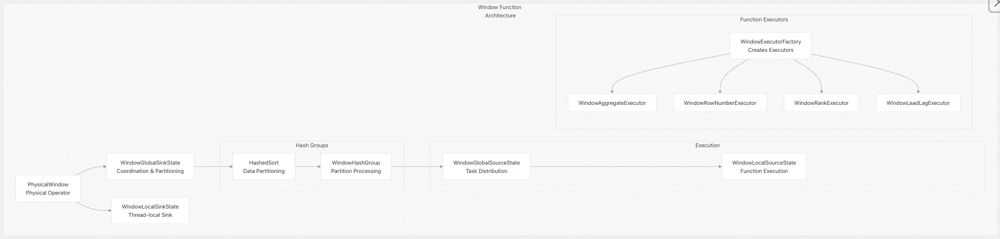
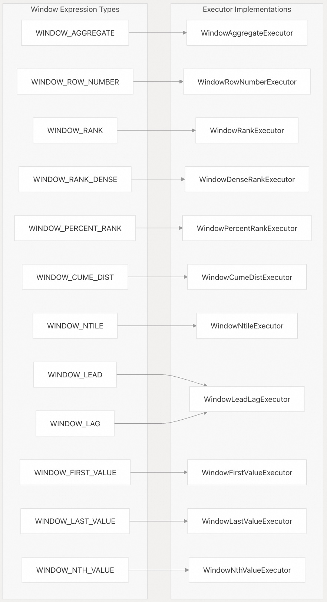
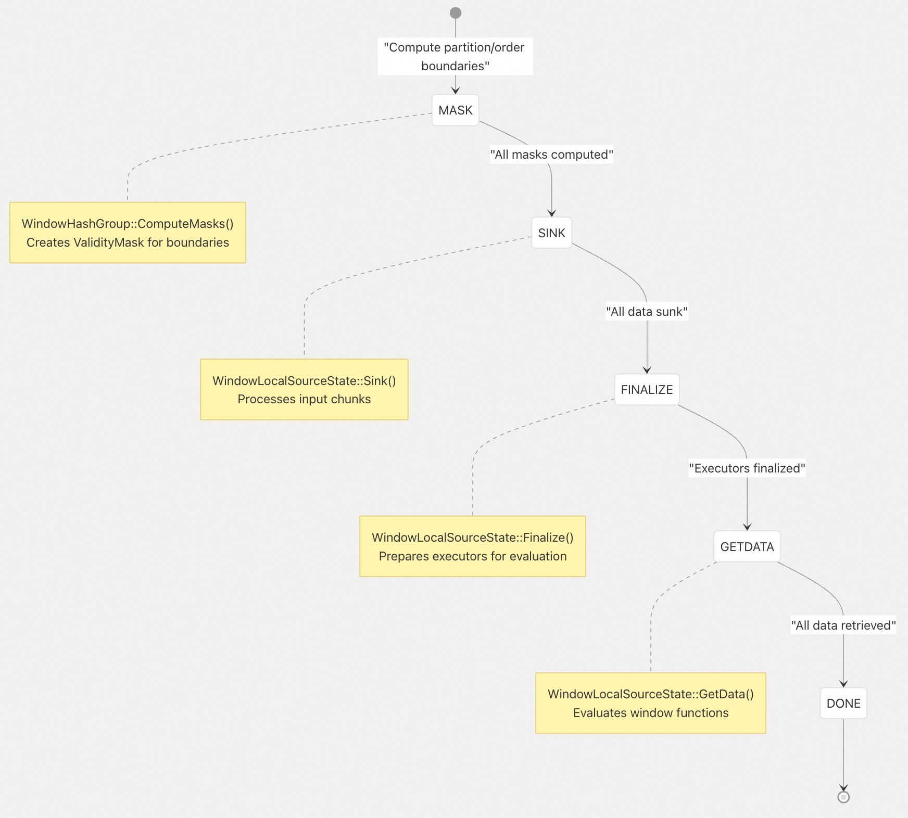
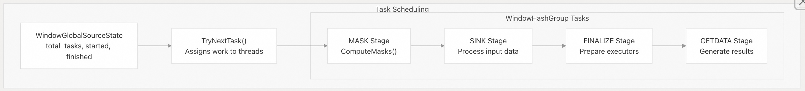
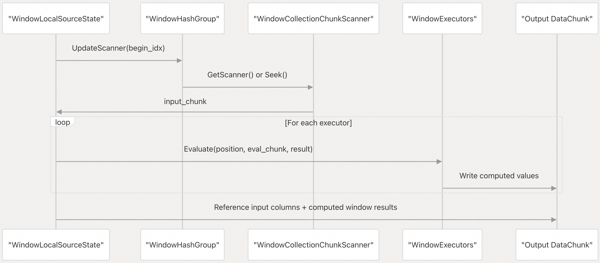

## DuckDB 源码学习: 4.3 窗口函数（Window Functions）       
                                    
### 作者                                    
digoal                                    
                                    
### 日期                                    
2025-10-23                                    
                                    
### 标签                                    
DuckDB , 源码学习                                    
                                    
----                                    
                                    
## 背景                     
本文介绍 DuckDB 的窗口函数执行系统，包括物理算子的实现、执行器层级结构以及状态管理。DuckDB 中的窗口函数支持 SQL 的 `OVER` 子句，包括分区（PARTITION BY）、排序（ORDER BY）和帧（frame）规范。  
  
## 架构概览    
DuckDB 通过 `PhysicalWindow` 算子实现窗口函数，该算子采用复杂的“Sink-Source”执行模型，支持基于哈希的分区和并行处理。  
  
    
  
**源文件：**    
- [`src/execution/operator/aggregate/physical_window.cpp`（第15–335行）](https://github.com/duckdb/duckdb/blob/05a2403c/src/execution/operator/aggregate/physical_window.cpp#L15-L335)    
- [`src/execution/operator/aggregate/physical_window.hpp`（第16–86行）](https://github.com/duckdb/duckdb/blob/05a2403c/src/execution/operator/aggregate/physical_window.hpp#L16-L86)    
  
## 窗口函数类型与执行器工厂(Window Function Types and Executor Factory)    
DuckDB 将窗口函数划分为不同类型，每种类型由专门的执行器处理，这些执行器通过 `WindowExecutorFactory` 创建。  
  
    
  
**源文件：**    
- [`src/execution/operator/aggregate/physical_window.cpp`（第238–270行）](https://github.com/duckdb/duckdb/blob/05a2403c/src/execution/operator/aggregate/physical_window.cpp#L238-L270)    
  
## 执行流水线：Sink-Source 模式    
`PhysicalWindow` 算子同时实现 Sink 和 Source 接口，分多个阶段处理数据.   
  
### Sink 阶段  
  
| 组件 | 作用 | 关键方法 |  
|------|------|----------|  
| `WindowGlobalSinkState` | 协调分区并维护执行器 | `Finalize()`，存储 `HashedSort` 和 `WindowExecutor` 实例 |  
| `WindowLocalSinkState` | 线程本地数据摄入 | 包装 `HashedSort::GetLocalSinkState()` |  
| `HashedSort` | 根据 `PARTITION BY` 子句对数据进行分区 | 处理排序和基于哈希的分区 |  
  
### Source 阶段的任务管理    
    
  
**源文件：**    
- [`src/execution/operator/aggregate/physical_window.cpp`（第20–21行）](https://github.com/duckdb/duckdb/blob/05a2403c/src/execution/operator/aggregate/physical_window.cpp#L20-L21)    
- [`src/execution/operator/aggregate/physical_window.cpp`（第698–992行）](https://github.com/duckdb/duckdb/blob/05a2403c/src/execution/operator/aggregate/physical_window.cpp#L698-L992)    
  
## 哈希分组处理与分区    
`WindowHashGroup` 类负责管理单个分区，并协调并行执行.    
  
### WindowHashGroup 的状态管理  
  
| 字段 | 用途 | 类型 |  
|------|------|------|  
| `partition_mask` | 标记分区边界 | `ValidityMask` |  
| `order_masks` | 将排序列数量映射到边界掩码 | `unordered_map<idx_t, ValidityMask>` |  
| `collection` | 为复杂表达式完全物化数据 | `unique_ptr<WindowCollection>` |  
| `gestates` | 窗口执行器的全局状态 | `ExecutorGlobalStates` |  
| `thread_states` | 线程本地执行器状态 | `ThreadLocalStates` |  
  
### 并行任务分发    
    
  
**源文件：**    
- [`src/execution/operator/aggregate/physical_window.cpp`（第39–173行）](https://github.com/duckdb/duckdb/blob/05a2403c/src/execution/operator/aggregate/physical_window.cpp#L39-L173)    
- [`src/execution/operator/aggregate/physical_window.cpp`（第690–696行）](https://github.com/duckdb/duckdb/blob/05a2403c/src/execution/operator/aggregate/physical_window.cpp#L690-L696)   
  
## 窗口函数执行上下文    
系统提供了一个共享表达式框架（`WindowSharedExpressions`）和执行上下文，用于优化多个窗口函数之间的公共计算.   
  
### 表达式共享与状态管理  
  
| 组件 | 用途 |  
|------|------|  
| `WindowSharedExpressions` | 在多个窗口函数之间去重公共表达式 |  
| `WindowBuilder` | 构建物化的数据集合 |  
| `WindowCollection` | 存储复杂窗口函数所需的已完全求值的表达式 |  
| `ExpressionExecutor` | 执行表达式（如 `coll_exec`、`sink_exec`、`eval_exec`） |  
  
### GetData 阶段的执行流程   
    
  
**源文件：**    
- [`src/execution/operator/aggregate/physical_window.cpp`（第950–992行）](https://github.com/duckdb/duckdb/blob/05a2403c/src/execution/operator/aggregate/physical_window.cpp#L950-L992）  
- [`src/execution/operator/aggregate/physical_window.cpp`（第816–834行）](https://github.com/duckdb/duckdb/blob/05a2403c/src/execution/operator/aggregate/physical_window.cpp#L816-L834）  
  
## 聚合窗口函数的集成    
窗口聚合函数通过 `sorted_aggregate_function.cpp` 系统与 DuckDB 的标准聚合框架集成.   
  
### SortedAggregateBindData 结构  
  
| 字段 | 用途 |  
|------|------|  
| `function` | 底层的 `AggregateFunction` |  
| `orders` | 聚合函数的排序表达式 |  
| `sort` | 共享的 `Sort` 实例，用于对数据排序 |  
| `buffered_types` | 缓冲数据列的结构（schema） |  
| `sorted_on_args` | 排序是否仅使用函数参数 |  
  
系统会自动将带有 `ORDER BY` 子句的聚合函数包装为 `SortedAggregateFunction` 模板，该模板负责缓冲、排序，并在有序数据(ordered data)上应用聚合函数。  
  
**源文件：**    
- [`src/function/aggregate/sorted_aggregate_function.cpp`（第18–156行）](https://github.com/duckdb/duckdb/blob/05a2403c/src/function/aggregate/sorted_aggregate_function.cpp#L18-L156)  
- [`src/function/aggregate/sorted_aggregate_function.cpp`（第726–780行）](https://github.com/duckdb/duckdb/blob/05a2403c/src/function/aggregate/sorted_aggregate_function.cpp#L726-L780)  
  
## 性能优化  
  
### 并行处理特性    
不同分区的 `WindowHashGroup` 实例可并行处理，通过 `TaskScheduler` 实现最优线程利用率。  
  
- **哈希分组并行处理**：多个 `WindowHashGroup` 实例可同时处理不同的分区。    
- **基于任务的执行**：每个处理阶段（MASK、SINK、FINALIZE、GETDATA）均作为独立任务运行。    
- **线程池集成**：通过 `TaskScheduler` 实现最优的线程利用率。    
- **内存管理**：对掩码（masks）和状态（states）采用惰性分配策略，以最小化内存占用。  
  
### 优化策略  
  
| 优化项 | 实现方式 | 位置 |  
|--------|----------|------|  
| 顺序依赖检测 | `is_order_dependent` 标志控制是否并行执行 | `src/execution/operator/aggregate/physical_window.cpp`（第227–229行） |  
| 表达式共享 | `WindowSharedExpressions` 去重公共表达式 | `src/execution/operator/aggregate/physical_window.cpp`（第201–202行） |  
| 级联迭代 | 对大数据集进行高效的帧处理 | 参见归并排序树（merge sort tree）实现 |  
| 分区边界缓存 | 使用 `ValidityMask` 结构缓存边界计算结果 | `src/execution/operator/aggregate/physical_window.cpp`（第521–531行） |  
  
**源文件：**    
- [`src/execution/operator/aggregate/physical_window.cpp`（第394–428行）](https://github.com/duckdb/duckdb/blob/05a2403c/src/execution/operator/aggregate/physical_window.cpp#L394-L428)  
- [`src/execution/operator/aggregate/physical_window.cpp`（第1005–1047行）](https://github.com/duckdb/duckdb/blob/05a2403c/src/execution/operator/aggregate/physical_window.cpp#L1005-L1047)  
        
#### [期望 PostgreSQL|开源PolarDB 增加什么功能?](https://github.com/digoal/blog/issues/76 "269ac3d1c492e938c0191101c7238216")
  
  
#### [PolarDB 开源数据库](https://openpolardb.com/home "57258f76c37864c6e6d23383d05714ea")
  
  
#### [PolarDB 学习图谱](https://www.aliyun.com/database/openpolardb/activity "8642f60e04ed0c814bf9cb9677976bd4")
  
  
#### [PostgreSQL 解决方案集合](../201706/20170601_02.md "40cff096e9ed7122c512b35d8561d9c8")
  
  
#### [德哥 / digoal's Github - 公益是一辈子的事.](https://github.com/digoal/blog/blob/master/README.md "22709685feb7cab07d30f30387f0a9ae")
  
  
#### [About 德哥](https://github.com/digoal/blog/blob/master/me/readme.md "a37735981e7704886ffd590565582dd0")
  
  

  
