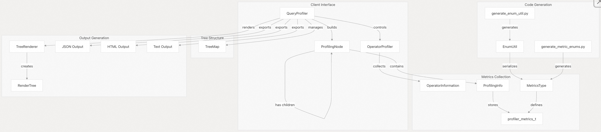
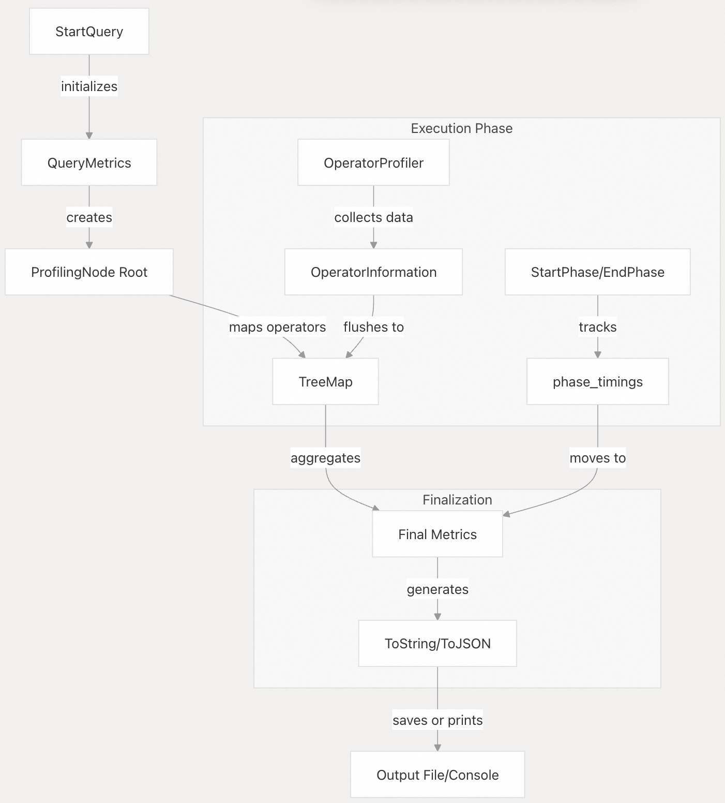
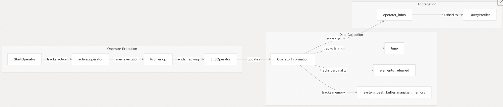
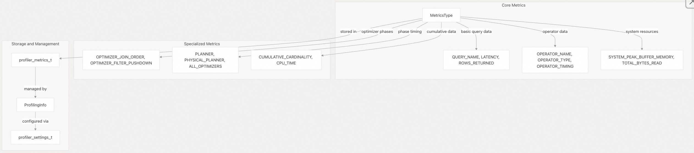
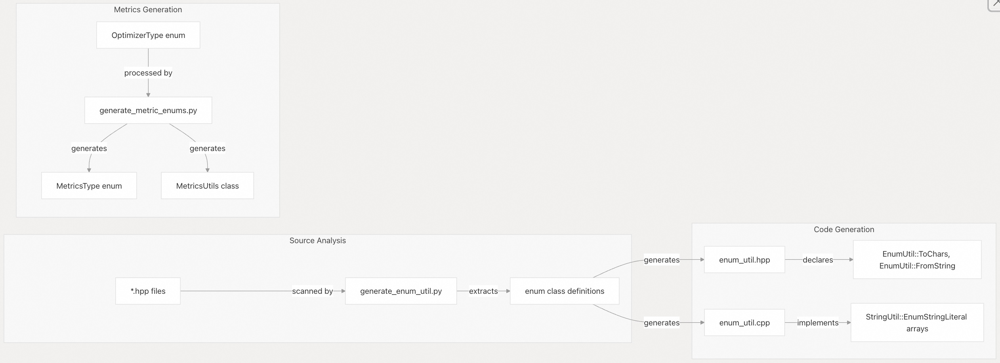
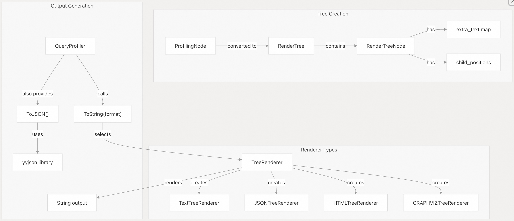
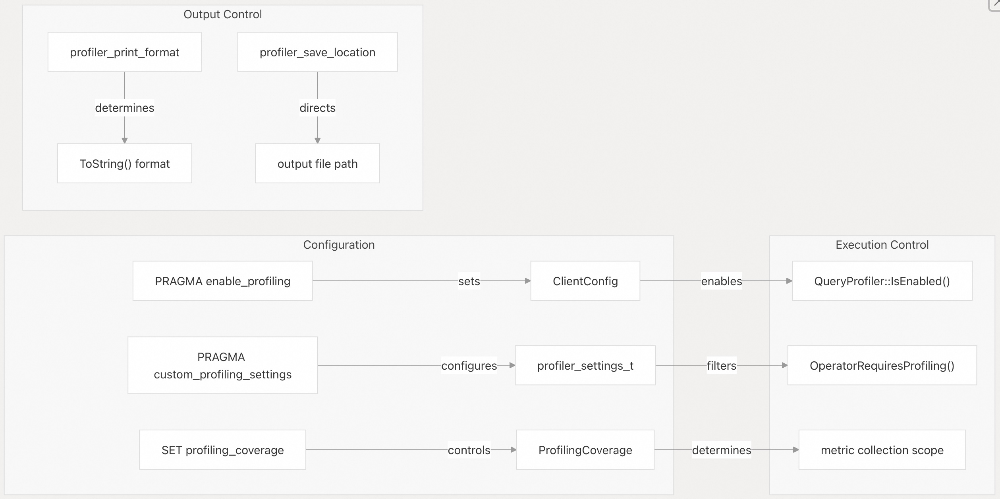

## DuckDB 源码学习: 4.4 查询性能分析（Query Profiling）     
                                      
### 作者                                      
digoal                                      
                                      
### 日期                                      
2025-10-23                                      
                                      
### 标签                                      
DuckDB , 源码学习                                      
                                      
----                                      
                                      
## 背景                       
DuckDB 的查询性能分析系统为查询执行提供了全面的性能分析和调试能力。该系统在查询执行期间捕获详细的性能指标，构建分层的性能树，并以多种输出格式（包括 JSON、HTML 和纯文本）呈现结果。  
  
## 架构概览  
  
查询性能分析系统由多个相互关联的组件组成，这些组件协同工作，以在查询执行过程中捕获、处理和展示性能数据。  
  
**查询性能分析系统架构**    
  
  
  
来源文件：    
- [`src/include/duckdb/main/query_profiler.hpp`（第133–258行）](https://github.com/duckdb/duckdb/blob/05a2403c/src/include/duckdb/main/query_profiler.hpp#L133-L258)    
- [`src/include/duckdb/main/profiling_node.hpp`（第28–58行）](https://github.com/duckdb/duckdb/blob/05a2403c/src/include/duckdb/main/profiling_node.hpp#L28-L58)     
- [`src/include/duckdb/main/profiling_info.hpp`（第27–110行）](https://github.com/duckdb/duckdb/blob/05a2403c/src/include/duckdb/main/profiling_info.hpp#L27-L110)   
  
## 核心组件  
  
### QueryProfiler 类  
  
`QueryProfiler` 类是性能数据收集的中央协调器，负责管理整个性能分析的生命周期。  
  
**QueryProfiler 数据流**  
  
  
  
`QueryProfiler` 维护了若干关键数据结构：  
- `TreeMap tree_map`：将物理算子映射到性能分析节点    
- `QueryMetrics query_metrics`：存储顶层查询性能数据    
- `PhaseTimingStorage phase_timings`：跟踪不同查询阶段的耗时    
- `unique_ptr<ProfilingNode> root`：性能分析树的根节点    
  
来源文件：    
- [`src/main/query_profiler.cpp`（第132–258行）](https://github.com/duckdb/duckdb/blob/05a2403c/src/main/query_profiler.cpp#L132-L258)     
- [`src/include/duckdb/main/query_profiler.hpp`（第213–257行）](https://github.com/duckdb/duckdb/blob/05a2403c/src/include/duckdb/main/query_profiler.hpp#L213-L257)   
  
### OperatorProfiler 类  
  
`OperatorProfiler` 类负责在查询执行期间对单个算子进行细粒度的性能测量。  
  
  
  
`OperatorProfiler` 的关键方法包括：  
  
- `StartOperator()`：开始对某个算子进行计时和跟踪    
- `EndOperator()`：记录该算子的执行时间和结果指标    
- `Flush()`：将收集到的数据传输给 `QueryProfiler`    
- `GetOperatorInfo()`：获取或创建该算子的 `OperatorInformation`    
  
来源文件：    
- [`src/include/duckdb/main/query_profiler.hpp`（第78–114行）](https://github.com/duckdb/duckdb/blob/05a2403c/src/include/duckdb/main/query_profiler.hpp#L78-L114)     
- [`src/main/query_profiler.cpp`（第396–523行）](https://github.com/duckdb/duckdb/blob/05a2403c/src/main/query_profiler.cpp#L396-L523)   
  
### ProfilingInfo 与指标系统  
  
指标系统采用基于枚举（enum）的综合方法来定义和管理性能数据的收集。  
  
**指标类型层级结构**  
  
  
  
`MetricsType` 枚举定义了所有可用的性能指标，由脚本 `scripts/generate_metric_enums.py` 自动生成。主要的指标类别包括：  
- **查询级别（Query-level）**：`QUERY_NAME`（查询名称）、`LATENCY`（延迟）、`BLOCKED_THREAD_TIME`（线程阻塞时间）    
- **算子级别（Operator-level）**：`OPERATOR_TIMING`（算子执行时间）、`OPERATOR_CARDINALITY`（算子输出行数）、`OPERATOR_NAME`（算子名称）    
- **系统级别（System-level）**：`SYSTEM_PEAK_BUFFER_MEMORY`（系统峰值缓冲区内存）、`TOTAL_BYTES_READ`（读取总字节数）    
- **优化器级别（Optimizer-level）**：`OPTIMIZER_JOIN_ORDER`（优化器连接顺序）、`OPTIMIZER_FILTER_PUSHDOWN`（优化器谓词下推）  
  
来源文件：    
- [`src/include/duckdb/common/enums/metric_type.hpp`（第22–77行）](https://github.com/duckdb/duckdb/blob/05a2403c/src/include/duckdb/common/enums/metric_type.hpp#L22-L77)     
- [`src/common/enums/metric_type.cpp`（第14–232行）](https://github.com/duckdb/duckdb/blob/05a2403c/src/common/enums/metric_type.cpp#L14-L232)     
- [`scripts/generate_metric_enums.py`（第16–35行）](https://github.com/duckdb/duckdb/blob/05a2403c/scripts/generate_metric_enums.py#L16-L35)   
  
## 代码生成框架  
  
DuckDB 使用自动化代码生成机制，以确保枚举定义的一致性，并提供序列化(serialization)能力。  
  
**EnumUtil 代码生成流水线**  
  
  
  
代码生成系统提供了若干关键能力：  
- **自动序列化（Automatic Serialization）**：无需手动维护，即可在枚举与字符串之间相互转换    
- **覆盖支持（Override Support）**：通过 `overrides` 字典允许为枚举指定自定义的字符串表示    
- **黑名单支持（Blacklist Support）**：可将某些枚举排除在生成过程之外    
- **指标集成（Metrics Integration）**：能根据 `OptimizerType` 自动生成优化器相关的指标    
  
关键生成的类包括：  
- **`EnumUtil`**：基于模板的枚举序列化框架    
- **`MetricsUtils`**：用于指标分类与转换的工具函数  
  
来源文件：    
- [`scripts/generate_enum_util.py`（第88–146行）](https://github.com/duckdb/duckdb/blob/05a2403c/scripts/generate_enum_util.py#L88-L146)     
- [`scripts/generate_metric_enums.py`（第54–153行）](https://github.com/duckdb/duckdb/blob/05a2403c/scripts/generate_metric_enums.py#L54-L153)     
- [`src/common/enum_util.cpp`（第1–12行）](https://github.com/duckdb/duckdb/blob/05a2403c/src/common/enum_util.cpp#L1-L12)   
  
## 树形渲染与输出格式  
  
性能分析系统通过灵活的渲染架构支持多种输出格式。  
  
**渲染架构**  
  
  
  
渲染系统提供多种输出格式：  
- **文本（Text）**：包含执行时间和基数（cardinality）信息的层次化树形结构    
- **JSON**：适合程序化分析的结构化数据    
- **HTML**：带有样式和交互功能的网页就绪格式    
- **GraphViz**：用于可视化工具的图表生成格式    
  
每种格式均由一个特定的 `TreeRenderer` 子类处理，将内部的树形结构转换为对应的输出表示形式。  
  
来源文件：    
- [`src/common/tree_renderer.cpp`（第12–28行）](https://github.com/duckdb/duckdb/blob/05a2403c/src/common/tree_renderer.cpp#L12-L28)     
- [`src/common/render_tree.cpp`（第127–157行）](https://github.com/duckdb/duckdb/blob/05a2403c/src/common/render_tree.cpp#L127-L157)     
- [`src/main/query_profiler.cpp`（第800–825行）](https://github.com/duckdb/duckdb/blob/05a2403c/src/main/query_profiler.cpp#L800-L825)   
  
## 使用与配置  
  
性能分析系统可通过 `PRAGMA` 语句和配置项进行设置。  
  
**性能分析配置流程**  
  
  
  
关键配置选项包括：  
  
| 配置项 | 用途 | 可选值 |  
|--------|------|--------|  
| `enable_profiling` | 控制性能分析器是否启用 | `true`, `false`, `json`, `query_tree` |  
| `custom_profiling_settings` | 选择特定指标 | 包含指标名称的 JSON 对象 |  
| `profiling_coverage` | 确定算子分析范围 | `SELECT`, `ALL` |  
| `profiler_print_format` | 输出格式选择 | `QUERY_TREE`, `JSON`, `HTML` |  
  
来源文件：    
- [`src/main/query_profiler.cpp`（第31–37行）](https://github.com/duckdb/duckdb/blob/05a2403c/src/main/query_profiler.cpp#L31-L37)     
- [`src/main/query_profiler.cpp`（第130–172行）](https://github.com/duckdb/duckdb/blob/05a2403c/src/main/query_profiler.cpp#L130-L172)     
- [`test/api/capi/test_capi_profiling.cpp`（第108–130行）](https://github.com/duckdb/duckdb/blob/05a2403c/test/api/capi/test_capi_profiling.cpp#L108-L130)   
      
#### [期望 PostgreSQL|开源PolarDB 增加什么功能?](https://github.com/digoal/blog/issues/76 "269ac3d1c492e938c0191101c7238216")
  
  
#### [PolarDB 开源数据库](https://openpolardb.com/home "57258f76c37864c6e6d23383d05714ea")
  
  
#### [PolarDB 学习图谱](https://www.aliyun.com/database/openpolardb/activity "8642f60e04ed0c814bf9cb9677976bd4")
  
  
#### [PostgreSQL 解决方案集合](../201706/20170601_02.md "40cff096e9ed7122c512b35d8561d9c8")
  
  
#### [德哥 / digoal's Github - 公益是一辈子的事.](https://github.com/digoal/blog/blob/master/README.md "22709685feb7cab07d30f30387f0a9ae")
  
  
#### [About 德哥](https://github.com/digoal/blog/blob/master/me/readme.md "a37735981e7704886ffd590565582dd0")
  
  

  
