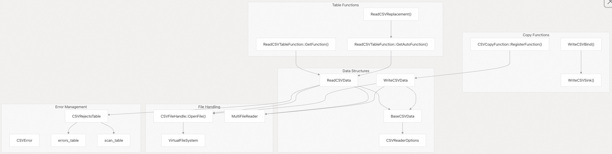
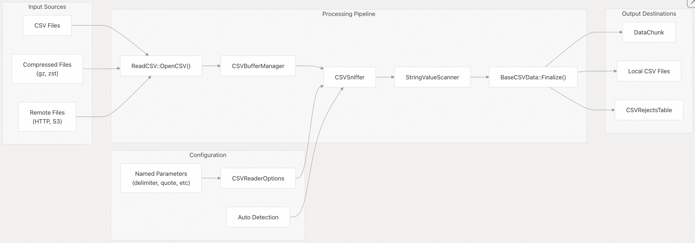
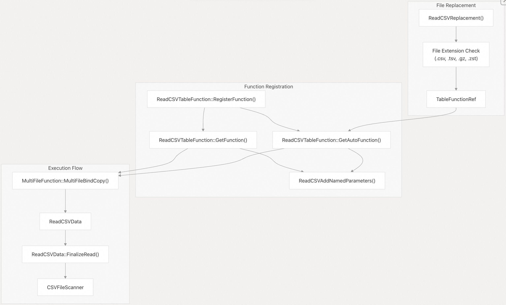
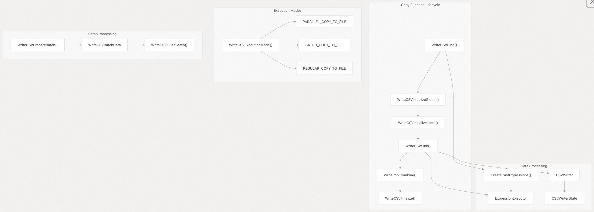
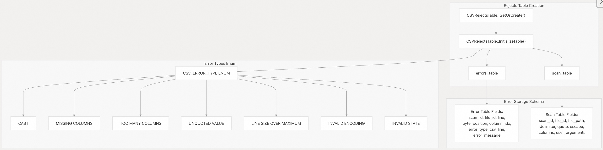

## DuckDB 源码学习: 5.1 CSV 处理      
                                        
### 作者                                        
digoal                                        
                                        
### 日期                                        
2025-10-23                                        
                                        
### 标签                                        
DuckDB , 源码学习                                        
                                        
----                                        
                                        
## 背景                         
本文介绍 DuckDB 全面的 CSV 处理系统，该系统支持从 CSV 文件读取数据以及将数据写入 CSV 文件。系统提供了用于数据导入的表函数（`read_csv`、`read_csv_auto`）、用于数据导出的复制函数（`COPY TO`），以及丰富的配置选项，以应对各种 CSV 格式和边界情况。  
  
## 系统架构  
  
CSV 处理系统由多个相互关联的组件构成，负责文件 I/O、解析、验证和并行执行。  
  
### 核心组件概览  
  
  
  
源文件：    
- [`src/function/table/read_csv.cpp`（第 142–149 行）](https://github.com/duckdb/duckdb/blob/05a2403c/src/function/table/read_csv.cpp#L142-L149)    
- [`src/function/table/copy_csv.cpp`（第 429–450 行）](https://github.com/duckdb/duckdb/blob/05a2403c/src/function/table/copy_csv.cpp#L429-L450)     
- [`src/include/duckdb/function/table/read_csv.hpp`（第 33–122 行）](https://github.com/duckdb/duckdb/blob/05a2403c/src/include/duckdb/function/table/read_csv.hpp#L33-L122)   
  
### 数据流架构  
  
  
  
源文件：    
- [`src/function/table/read_csv.cpp`（第 44–47 行）](https://github.com/duckdb/duckdb/blob/05a2403c/src/function/table/read_csv.cpp#L44-L47)    
- [`src/function/table/read_csv.cpp`（第 56–99 行）](https://github.com/duckdb/duckdb/blob/05a2403c/src/function/table/read_csv.cpp#L56-L99)     
- [`src/function/table/copy_csv.cpp`（第 57–115 行）](https://github.com/duckdb/duckdb/blob/05a2403c/src/function/table/copy_csv.cpp#L57-L115)   
  
## 读取 CSV 文件  
  
### 表函数  
  
DuckDB 提供了两个主要的表函数用于读取 CSV 文件：  
- **read_csv**：需要显式指定表结构（schema）或列定义。    
- **read_csv_auto**：自动检测表结构、分隔符和数据类型。  
  
`ReadCSVTableFunction` 类通过 `GetFunction()` 和 `GetAutoFunction()` 方法实现了这两个函数，其中自动（auto）变体具备智能格式检测能力。  
  
  
  
源文件：    
- [`src/function/table/read_csv.cpp`（第 157–160 行）](https://github.com/duckdb/duckdb/blob/05a2403c/src/function/table/read_csv.cpp#L157-L160)  
- [`src/function/table/read_csv.cpp`（第 162–190 行）](https://github.com/duckdb/duckdb/blob/05a2403c/src/function/table/read_csv.cpp#L162-L190)  
- [`src/function/table/read_csv.cpp`（第 192–197 行）](https://github.com/duckdb/duckdb/blob/05a2403c/src/function/table/read_csv.cpp#L192-L197)  
  
### 配置参数  
  
CSV 读取器通过 `ReadCSVAddNamedParameters()` 定义的命名参数支持广泛的配置：  
  
| 参数 | 类型 | 用途 |  
|------|------|------|  
| `sep`, `delim` | VARCHAR | 字段分隔符 |  
| `quote` | VARCHAR | 用于转义的引号字符 |  
| `escape` | VARCHAR | 转义字符 |  
| `nullstr` | ANY | 表示 NULL 值的字符串 |  
| `header` | BOOLEAN | 是否包含表头行 |  
| `auto_detect` | BOOLEAN | 启用自动格式检测 |  
| `sample_size` | BIGINT | 用于自动检测的采样行数 |  
| `buffer_size` | UBIGINT | 读取缓冲区大小（字节） |  
| `parallel` | BOOLEAN | 启用并行处理 |  
| `max_line_size` | VARCHAR | 单行最大长度限制 |  
| `compression` | VARCHAR | 文件压缩格式 |  
  
源文件：  
- [`src/function/table/read_csv.cpp`（第 56–99 行）](https://github.com/duckdb/duckdb/blob/05a2403c/src/function/table/read_csv.cpp#L56-L99)  
  
## 写入 CSV 文件  
  
### 复制函数实现 (Copy Function Implementation)  
  
CSV 写入由 `CSVCopyFunction` 类处理，该类实现了 DuckDB 标准的复制接口，用于将数据导出为 CSV 格式。  
  
  
  
源文件：    
- [`src/function/table/copy_csv.cpp`（第 173–209 行）](https://github.com/duckdb/duckdb/blob/05a2403c/src/function/table/copy_csv.cpp#L173-L209)  
- [`src/function/table/copy_csv.cpp`（第 286–308 行）](https://github.com/duckdb/duckdb/blob/05a2403c/src/function/table/copy_csv.cpp#L286-L308)  
- [`src/function/table/copy_csv.cpp`（第 361–369 行）](https://github.com/duckdb/duckdb/blob/05a2403c/src/function/table/copy_csv.cpp#L361-L369)  
  
### 输出格式控制  
  
写入系统提供多个选项用于控制输出格式：  
  
- `force_quote`：强制引号包围字段    
- `prefix` / `suffix`：为输出添加自定义文本前缀/后缀    
- `dateformat` / `timestampformat`：指定日期和时间戳格式    
- **压缩支持**：支持 GZIP 和 ZSTD 压缩  
  
源文件：    
- [`src/function/table/copy_csv.cpp`（第 117–171 行）](https://github.com/duckdb/duckdb/blob/05a2403c/src/function/table/copy_csv.cpp#L117-L171)  
- [`src/function/table/copy_csv.cpp`（第 190–203 行）](https://github.com/duckdb/duckdb/blob/05a2403c/src/function/table/copy_csv.cpp#L190-L203)  
  
## 错误处理与验证  
  
### 拒绝记录表系统（Rejects Table）  
  
DuckDB 的 CSV 处理包含一个复杂的错误跟踪系统，通过 `CSVRejectsTable` 类创建临时表，用于存储解析错误和扫描元数据。  
  
  
  
源文件：    
- [`src/execution/operator/persistent/csv_rejects_table.cpp`（第 30–58 行）](https://github.com/duckdb/duckdb/blob/05a2403c/src/execution/operator/persistent/csv_rejects_table.cpp#L30-L58)  
- [`src/execution/operator/persistent/csv_rejects_table.cpp`（第 64–144 行）](https://github.com/duckdb/duckdb/blob/05a2403c/src/execution/operator/persistent/csv_rejects_table.cpp#L64-L144)  
  
### 参数验证   
`BaseCSVData::Finalize()` 方法对 CSV 选项进行综合验证，以防止配置冲突，包括：  
- 分隔符与引号字符(Delimiter/quote)冲突    
- 分隔符与转义字符(Delimiter/escape)冲突    
- NULL 字符串与特殊字符的冲突验证    
- 前缀/后缀(Prefix/suffix)的一致性检查  
  
源文件：  
- [`src/function/table/copy_csv.cpp`（第 57–115 行）](https://github.com/duckdb/duckdb/blob/05a2403c/src/function/table/copy_csv.cpp#L57-L115	)  
  
## 并行处理  
  
### 缓冲区大小管理  
  
并行 CSV 处理需要谨慎管理缓冲区大小，以确保每个线程都能处理完整的行。系统强制要求缓冲区大小必须大于文件中的最大行长度。  
  
关键考虑因素：  
- 最小缓冲区大小必须超过最长行的长度    
- 缓冲区边界必须尊重换行符（即不能在行中间截断）    
- 并行线程需协同工作，避免将单条记录拆分到多个缓冲区中  
   
源文件：    
- [`test/parallel_csv/test_parallel_csv.cpp`（第 28–73 行）](https://github.com/duckdb/duckdb/blob/05a2403c/test/parallel_csv/test_parallel_csv.cpp#L28-L73)    
- [`test/sql/copy/csv/parallel/csv_parallel_buffer_size.test`（第 5–81 行）](https://github.com/duckdb/duckdb/blob/05a2403c/test/sql/copy/csv/parallel/csv_parallel_buffer_size.test#L5-L81)  
  
### 执行模式选择  
  
`WriteCSVExecutionMode()` 函数根据需求确定合适的并行执行策略：  
- **PARALLEL_COPY_TO_FILE**：在无需保证顺序时启用完全并行处理    
- **BATCH_COPY_TO_FILE**：以批处理方式执行，同时保留数据顺序    
- **REGULAR_COPY_TO_FILE**：单线程处理  
  
源文件：  
- [`src/function/table/copy_csv.cpp`（第 361–369 行）](https://github.com/duckdb/duckdb/blob/05a2403c/src/function/table/copy_csv.cpp#L361-L369)  
  
## 文件格式支持  
  
### 压缩与编码  
  
CSV 系统支持多种压缩格式，并通过文件扩展名进行类型自动检测：  
- **GZIP**：支持 `.gz` 扩展名    
- **ZSTD**：支持 `.zst` 扩展名，并可自动加载 Parquet 扩展    
- **编码**：支持字符编码的自动检测与转换    
- **远程文件**：通过虚拟文件系统集成 HTTP 和 S3 协议  
  
### 分隔符与特殊字符处理  
  
高级解析功能包括：  
- 支持多字节分隔符(Multi-byte delimiter)    
- 可配置的引号（quote）和转义（escape）字符    
- 自定义 NULL 值字符串表示    
- 小数点分隔符配置（使用 `,` 或 `.`）    
- 千位分隔符处理    
- 支持注释行（comment lines）  
  
源文件：    
- [`src/function/table/read_csv.cpp`（第 166–178 行）](https://github.com/duckdb/duckdb/blob/05a2403c/src/function/table/read_csv.cpp#L166-L178)    
- [`test/sql/copy/csv/csv_decimal_separator.test`（第 5–101 行）](https://github.com/duckdb/duckdb/blob/05a2403c/test/sql/copy/csv/csv_decimal_separator.test#L5-L101)  
  
CSV 处理系统深度集成到 DuckDB 的文件系统抽象和多文件读取能力中，为处理各种 CSV 格式以及在单线程和并行执行环境下的多样化处理需求提供了坚实基础。  
       
#### [期望 PostgreSQL|开源PolarDB 增加什么功能?](https://github.com/digoal/blog/issues/76 "269ac3d1c492e938c0191101c7238216")
  
  
#### [PolarDB 开源数据库](https://openpolardb.com/home "57258f76c37864c6e6d23383d05714ea")
  
  
#### [PolarDB 学习图谱](https://www.aliyun.com/database/openpolardb/activity "8642f60e04ed0c814bf9cb9677976bd4")
  
  
#### [PostgreSQL 解决方案集合](../201706/20170601_02.md "40cff096e9ed7122c512b35d8561d9c8")
  
  
#### [德哥 / digoal's Github - 公益是一辈子的事.](https://github.com/digoal/blog/blob/master/README.md "22709685feb7cab07d30f30387f0a9ae")
  
  
#### [About 德哥](https://github.com/digoal/blog/blob/master/me/readme.md "a37735981e7704886ffd590565582dd0")
  
  

  
