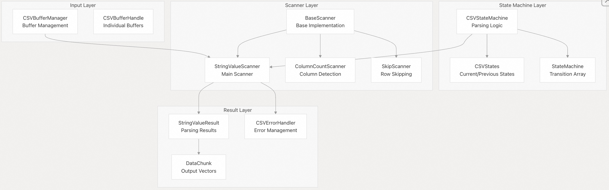
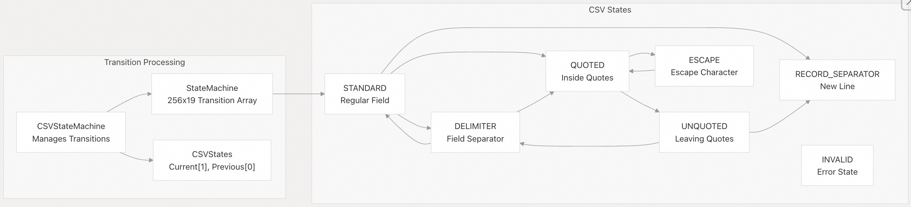
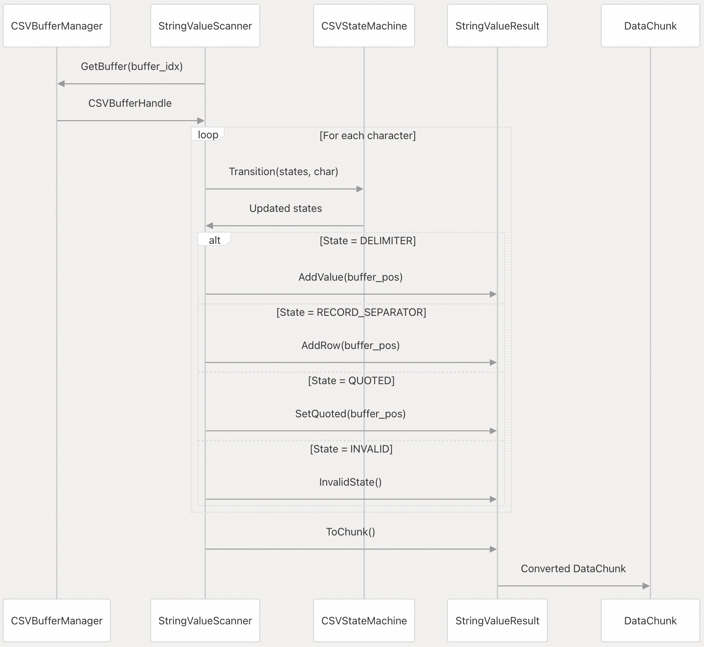
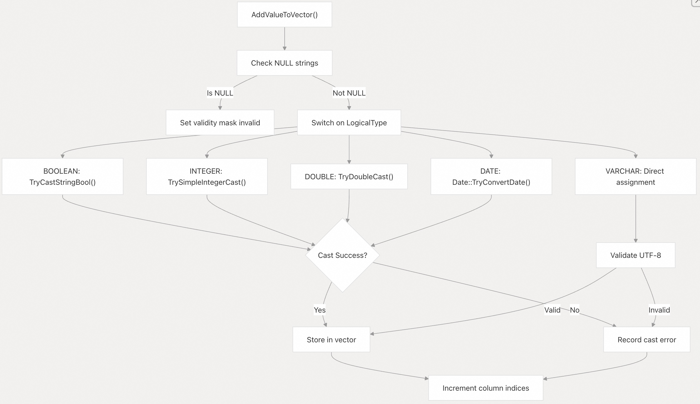
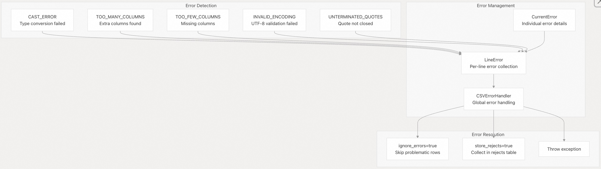
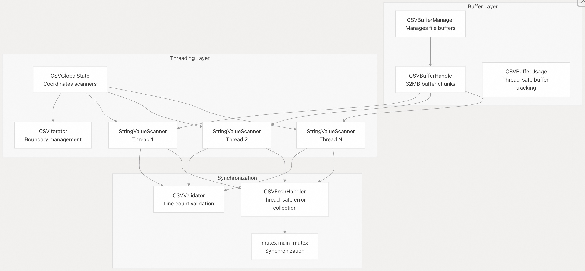

## DuckDB 源码学习: 5.2 CSV 扫描器实现 (CSV Scanner Implementation)  
  
### 作者  
digoal  
  
### 日期  
2025-10-23  
  
### 标签  
DuckDB , 源码学习  
  
----  
  
## 背景  
本文介绍 DuckDB 的底层 CSV 扫描引擎，特别是 `StringValueScanner` 及其配套基础设施，用于将 CSV 数据解析为向量化（vectorized）的 DataChunk。这是核心解析引擎，负责处理原始 CSV 字节并将其转换为类型化的列式数据。  
  
## 概述  
  
CSV 扫描器实现提供了一个高性能、支持并行处理的引擎，用于解析 CSV 数据，并具备全面的错误处理和类型转换能力。系统采用有限状态机（finite state machine）方法进行解析，支持多种 CSV 方言、编码验证和列投影（column projection）。  
  
## 核心架构  
  
  
  
**CSV 扫描器核心架构**  
  
源文件：  
- [`src/execution/operator/csv_scanner/scanner/string_value_scanner.cpp`（第 1–50 行）](https://github.com/duckdb/duckdb/blob/05a2403c/src/execution/operator/csv_scanner/scanner/string_value_scanner.cpp#L1-L50)  
- [`src/include/duckdb/execution/operator/csv_scanner/string_value_scanner.hpp`（第 312–385 行）](https://github.com/duckdb/duckdb/blob/05a2403c/src/include/duckdb/execution/operator/csv_scanner/string_value_scanner.hpp#L312-L385)  
- [`src/include/duckdb/execution/operator/csv_scanner/base_scanner.hpp`（第 114–150 行）](https://github.com/duckdb/duckdb/blob/05a2403c/src/include/duckdb/execution/operator/csv_scanner/base_scanner.hpp#L114-L150)  
  
## StringValueScanner 核心组件  
  
### 扫描器类  
  
| 类名 | 用途 | 主要职责 |  
|------|------|----------|  
| `StringValueScanner` | 主 CSV 解析器 | 将 CSV 字节转换为类型化的 DataChunk |  
| `StringValueResult` | 解析结果容器(holder) | 管理向量、错误、行位置信息 |  
| `BaseScanner` | 扫描器基类 | 提供通用扫描功能 |  
| `ColumnCountScanner` | 列数检测 | 在“嗅探”（sniffing）阶段统计列数 |  
| `SkipScanner` | 行跳过 | 跳过表头或注释行 |  
  
### 数据结构  
  
| 结构体 | 用途 | 关键字段 |  
|--------|------|----------|  
| `ParseTypeInfo` | 类型元数据 | `type_id`、`internal_type`、`validate_utf8` |  
| `LineError` | 错误追踪 | `current_errors`、`is_error_in_line` |  
| `FullLinePosition` | 位置追踪 | 行的 `begin` 和 `end` 位置 |  
| `CurrentError` | 单个错误 | `type`、`col_idx`、`error_position` |  
  
源文件：  
- [`src/include/duckdb/execution/operator/csv_scanner/string_value_scanner.hpp`（第 155–171 行）](https://github.com/duckdb/duckdb/blob/05a2403c/src/include/duckdb/execution/operator/csv_scanner/string_value_scanner.hpp#L155-L171)  
- [`src/include/duckdb/execution/operator/csv_scanner/string_value_scanner.hpp`（第 77–99 行）](https://github.com/duckdb/duckdb/blob/05a2403c/src/include/duckdb/execution/operator/csv_scanner/string_value_scanner.hpp#L77-L99)  
- [`src/include/duckdb/execution/operator/csv_scanner/string_value_scanner.hpp`（第 31–73 行）](https://github.com/duckdb/duckdb/blob/05a2403c/src/include/duckdb/execution/operator/csv_scanner/string_value_scanner.hpp#L31-L73)  
  
## 状态机处理  
  
  
**CSV 状态机转换**  
  
状态机使用一个 256×19 的转换数组，其中每个字节值映射到对应的状态转换。`CSVStateMachine::Transition()` 方法根据当前字符更新状态。  
```  
// Core transition logic  
states.states[0] = states.states[1];  // Previous = Current  
states.states[1] = transition_array[char][current_state];  // New current  
```  
  
源文件：  
- [`src/include/duckdb/execution/operator/csv_scanner/csv_state_machine.hpp`（第 126–129 行）](https://github.com/duckdb/duckdb/blob/05a2403c/src/include/duckdb/execution/operator/csv_scanner/csv_state_machine.hpp#L126-L129)  
- [`src/include/duckdb/execution/operator/csv_scanner/csv_state.hpp`（第 15–38 行）](https://github.com/duckdb/duckdb/blob/05a2403c/src/include/duckdb/execution/operator/csv_scanner/csv_state.hpp#L15-L38)  
- [`src/execution/operator/csv_scanner/state_machine/csv_state_machine_cache.cpp`（第 19–464 行）](https://github.com/duckdb/duckdb/blob/05a2403c/src/execution/operator/csv_scanner/state_machine/csv_state_machine_cache.cpp#L19-L464)  
  
## 扫描流程  
  
  
**CSV 扫描顺序**  
  
源文件：  
- [`src/include/duckdb/execution/operator/csv_scanner/base_scanner.hpp`（第 204–390 行）](https://github.com/duckdb/duckdb/blob/05a2403c/src/include/duckdb/execution/operator/csv_scanner/base_scanner.hpp#L204-L390)  
- [`src/execution/operator/csv_scanner/scanner/string_value_scanner.cpp`（第 325–495 行）](https://github.com/duckdb/duckdb/blob/05a2403c/src/execution/operator/csv_scanner/scanner/string_value_scanner.cpp#L325-L495)  
  
## 值处理与类型转换  
  
### 类型处理矩阵  
  
| 逻辑类型（LogicalType） | 转换函数 | 验证方式 |  
|------------------------|----------|----------|  
| `BOOLEAN` | `TryCastStringBool()` | 布尔字符串解析 |  
| `INTEGER` | `TrySimpleIntegerCast()` | 数值验证 |  
| `DOUBLE` | `TryDoubleCast()` | 支持小数点的浮点数解析 |  
| `DATE` | `Date::TryConvertDate()` | 日期格式验证 |  
| `TIMESTAMP` | `Timestamp::TryConvertTimestamp()` | 时间戳解析 |  
| `DECIMAL` | `TryDecimalStringCast()` | 小数精度/小数位数检查 |  
| `VARCHAR` | 直接赋值 | 若启用，则验证 UTF-8 编码 |  
  
### 值添加流程  
  
`AddValueToVector()` 方法负责类型特定(type-specific)的转换和错误管理：  
  
  
  
**值处理流程**  
  
源文件：  
- [`src/execution/operator/csv_scanner/scanner/string_value_scanner.cpp`（第 228–485 行）](https://github.com/duckdb/duckdb/blob/05a2403c/src/execution/operator/csv_scanner/scanner/string_value_scanner.cpp#L228-L485)  
- [`src/execution/operator/csv_scanner/scanner/string_value_scanner.cpp`（第 305–468 行）](https://github.com/duckdb/duckdb/blob/05a2403c/src/execution/operator/csv_scanner/scanner/string_value_scanner.cpp#L305-L468)  
  
## 错误处理系统  
  
### 错误类型与处理  
  
  
  
**CSV 错误处理架构**  
  
错误系统采用两级机制：  
- `LineError`：收集单行 CSV 中的错误  
- `CSVErrorHandler`：管理所有扫描线程中的错误  
  
源文件：  
- [`src/include/duckdb/execution/operator/csv_scanner/string_value_scanner.hpp`（第 101–153 行）](https://github.com/duckdb/duckdb/blob/05a2403c/src/include/duckdb/execution/operator/csv_scanner/string_value_scanner.hpp#L101-L153)  
- [`src/execution/operator/csv_scanner/util/csv_error.cpp`（第 19–270 行）](https://github.com/duckdb/duckdb/blob/05a2403c/src/execution/operator/csv_scanner/util/csv_error.cpp#L19-L270)  
- [`src/include/duckdb/execution/operator/csv_scanner/csv_error.hpp`（第 37–48 行）](https://github.com/duckdb/duckdb/blob/05a2403c/src/include/duckdb/execution/operator/csv_scanner/csv_error.hpp#L37-L48)  
  
## 并行处理支持  
  
### 缓冲区管理与多线程  
  
  
  
**并行 CSV 扫描器架构**  
  
每个扫描器处理 CSV 文件中由边界定义的一部分(boundary-defined portion)。`CSVGlobalState::Next()` 方法协调扫描器分配，确保正确的处理顺序。  
  
源文件：  
- [`src/execution/operator/csv_scanner/table_function/global_csv_state.cpp`（第 45–79 行）](https://github.com/duckdb/duckdb/blob/05a2403c/src/execution/operator/csv_scanner/table_function/global_csv_state.cpp#L45-L79)  
- [`src/include/duckdb/execution/operator/csv_scanner/global_csv_state.hpp`（第 23–66 行）](https://github.com/duckdb/duckdb/blob/05a2403c/src/include/duckdb/execution/operator/csv_scanner/global_csv_state.hpp#L23-L66)  
- [`src/execution/operator/csv_scanner/scanner/scanner_boundary.cpp`（第 52–84 行）](https://github.com/duckdb/duckdb/blob/05a2403c/src/execution/operator/csv_scanner/scanner/scanner_boundary.cpp#L52-L84)  
  
## 性能优化  
  
### SIMD 风格处理  
  
扫描器使用 64 位字操作实现优化的字符处理。  
```  
// Fast-path for standard characters (no special CSV characters)  
while (iterator.pos.buffer_pos + 8 < to_pos) {  
    uint64_t value = Load<uint64_t>(&buffer_handle_ptr[iterator.pos.buffer_pos]);  
    if (ContainsZeroByte((value ^ delimiter) & (value ^ newline) &   
                        (value ^ carriage_return) & (value ^ escape))) {  
        break;  // Special character found  
    }  
    iterator.pos.buffer_pos += 8;  // Skip 8 characters at once  
}  
```  
  
### 状态处理跳过数组  
  
状态机使用跳过数组（skip arrays）在常见状态下跳过逐字符(bypass character-by-character)处理：  
- `skip_standard[]`：STANDARD 状态下可跳过的字符  
- `skip_quoted[]`：QUOTED 状态下可跳过的字符  
- `skip_comment[]`：COMMENT 状态下可跳过的字符  
  
源文件：  
- [`src/include/duckdb/execution/operator/csv_scanner/base_scanner.hpp`（第 309–390 行）](https://github.com/duckdb/duckdb/blob/05a2403c/src/include/duckdb/execution/operator/csv_scanner/base_scanner.hpp#L309-L390)  
- [`src/execution/operator/csv_scanner/state_machine/csv_state_machine_cache.cpp`（第 427–450 行）](https://github.com/duckdb/duckdb/blob/05a2403c/src/execution/operator/csv_scanner/state_machine/csv_state_machine_cache.cpp#L427-L450)  
  
## 与表函数的集成  
  
`StringValueScanner` 通过 `CSVGlobalState` 和 `CSVFileScan` 类与 DuckDB 的表函数系统集成：  
- **初始化(Initialization)** ：`CSVFileScan` 通过 `CSVGlobalState::Next()` 创建扫描器实例    
- **扫描(Scanning)** ：每个扫描器处理其分配的文件边界，并生成 DataChunk    
- **协调(Coordination)** ：`CSVGlobalState` 管理扫描器的生命周期和错误聚合    
- **验证(Validation)** ：`CSVValidator` 确保在并行扫描器之间保持一致的行计数  
  
源文件：  
- [`src/execution/operator/csv_scanner/table_function/csv_file_scanner.cpp`（第 9–163 行）](https://github.com/duckdb/duckdb/blob/05a2403c/src/execution/operator/csv_scanner/table_function/csv_file_scanner.cpp#L9-L163)  
- [`src/execution/operator/csv_scanner/table_function/global_csv_state.cpp`（第 12–205 行）](https://github.com/duckdb/duckdb/blob/05a2403c/src/execution/operator/csv_scanner/table_function/global_csv_state.cpp#L12-L205)  
  
    
#### [期望 PostgreSQL|开源PolarDB 增加什么功能?](https://github.com/digoal/blog/issues/76 "269ac3d1c492e938c0191101c7238216")
  
  
#### [PolarDB 开源数据库](https://openpolardb.com/home "57258f76c37864c6e6d23383d05714ea")
  
  
#### [PolarDB 学习图谱](https://www.aliyun.com/database/openpolardb/activity "8642f60e04ed0c814bf9cb9677976bd4")
  
  
#### [PostgreSQL 解决方案集合](../201706/20170601_02.md "40cff096e9ed7122c512b35d8561d9c8")
  
  
#### [德哥 / digoal's Github - 公益是一辈子的事.](https://github.com/digoal/blog/blob/master/README.md "22709685feb7cab07d30f30387f0a9ae")
  
  
#### [About 德哥](https://github.com/digoal/blog/blob/master/me/readme.md "a37735981e7704886ffd590565582dd0")
  
  

  
