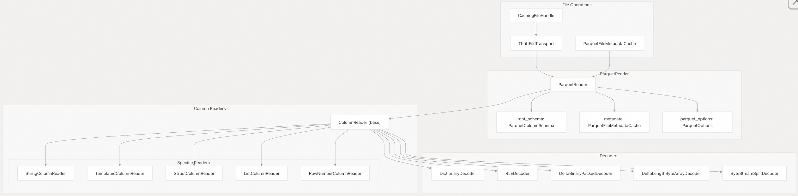
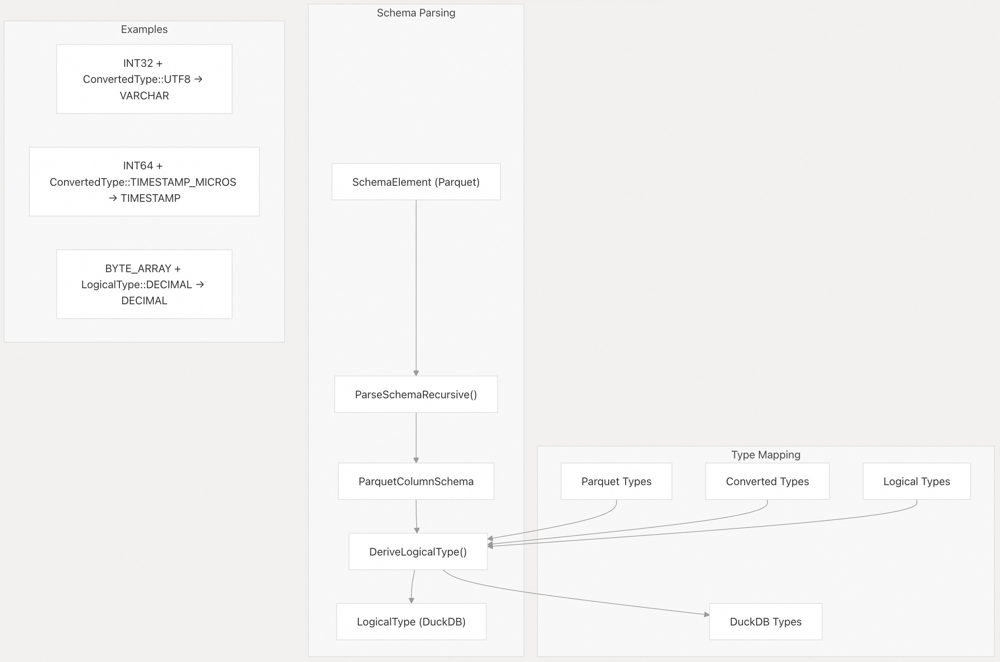
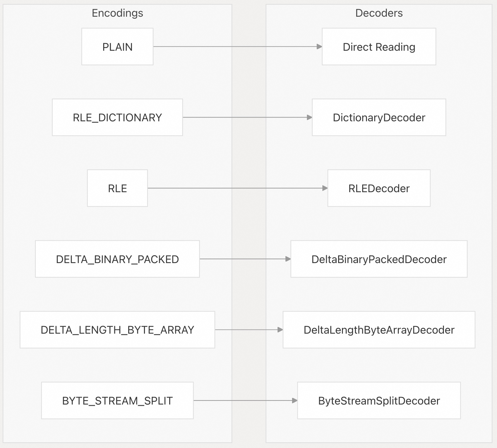
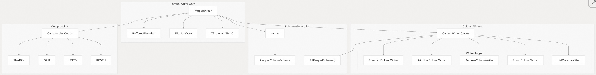
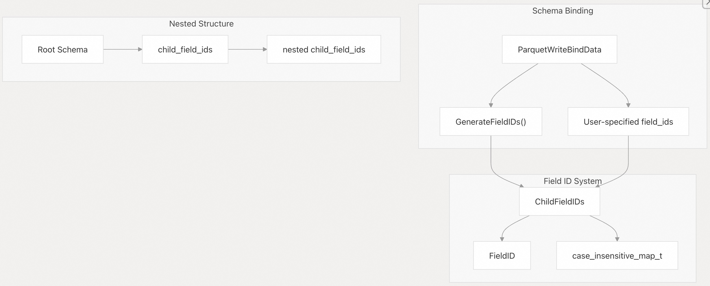
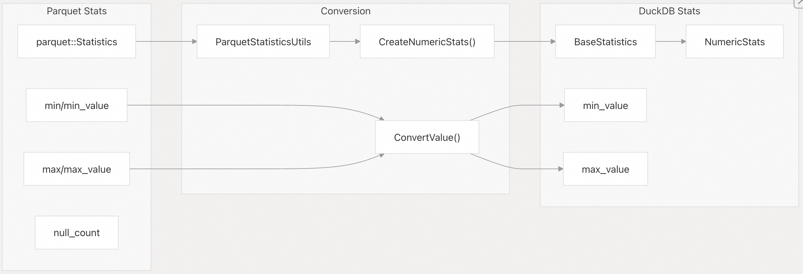
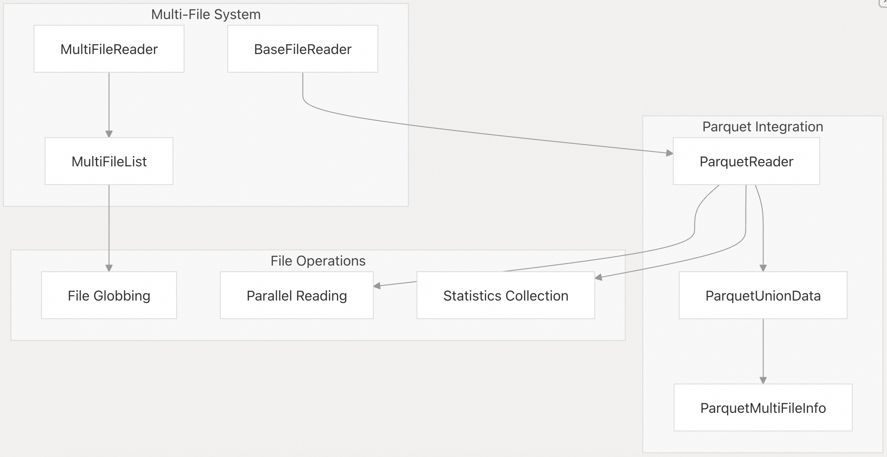
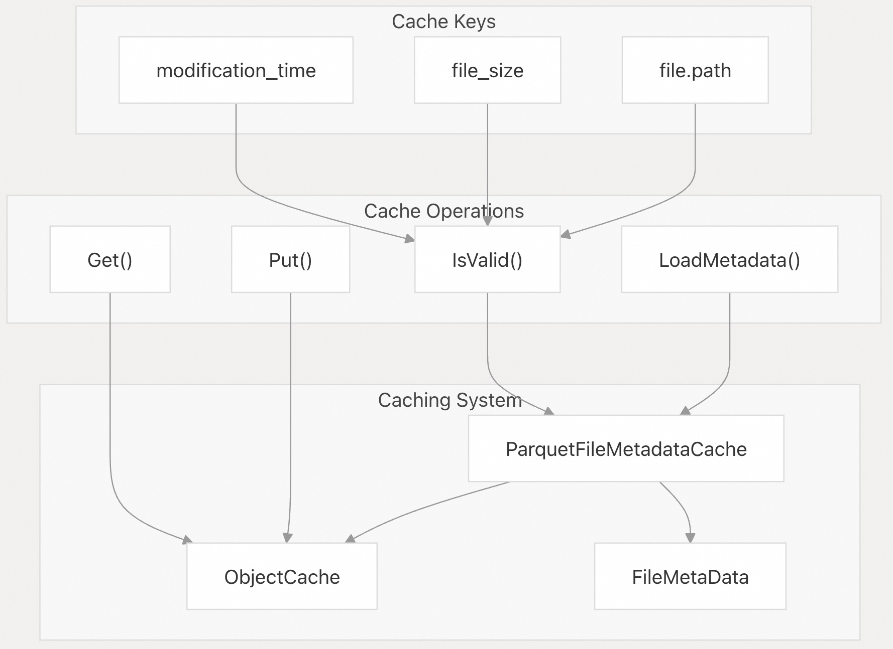
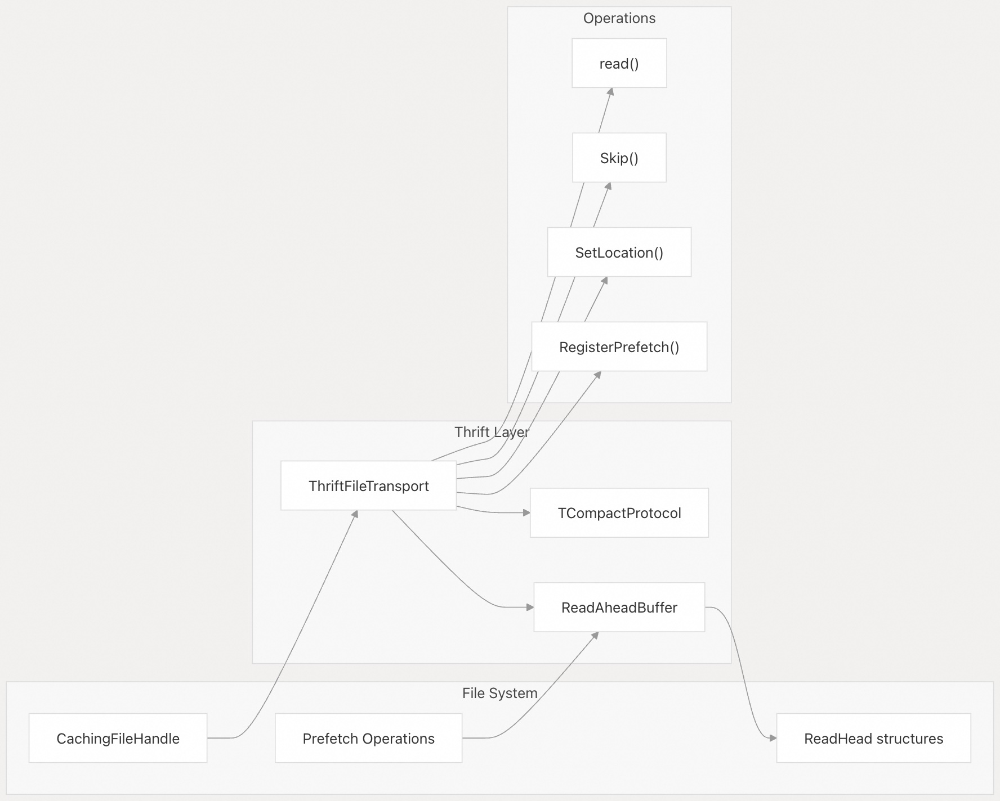

## DuckDB 源码学习: 5.3 Parquet 集成   
    
### 作者    
digoal    
    
### 日期    
2025-10-23    
    
### 标签    
DuckDB , 源码学习    
    
----    
    
## 背景    
DuckDB 的 Parquet 集成提供了对 Apache Parquet 列式文件格式的全面读写支持。该系统通过一个专用扩展处理模式(schema mapping)映射、类型转换、压缩、统计信息提取以及高效的 I/O 操作。  
  
关于parquet存储格式的信息可阅读：  
- [《数据库筑基课 - 列存之 Parquet》](../202410/20241015_01.md)    
  
## 架构概览  
  
Parquet 集成包含两个主要子系统：读取和写入。每个子系统都拥有自己的分层组件，用于处理不同的数据类型和编码方式。  
  
### 核心组件图  

```mermaid  
graph TB  
    subgraph "Parquet Extension"  
        PE["ParquetExtension"]  
        PEF["parquet_extension.cpp"]  
    end  
      
    subgraph "Reading Pipeline"  
        PR["ParquetReader"]  
        CR["ColumnReader"]  
        subgraph "Decoders"  
            DD["DictionaryDecoder"]  
            RLE["RLEDecoder"]   
            DBP["DeltaBinaryPackedDecoder"]  
            BSS["ByteStreamSplitDecoder"]  
        end  
        subgraph "Column Types"  
            SCR["StringColumnReader"]  
            TCR["TemplatedColumnReader"]  
            BCR["BooleanColumnReader"]  
            STRCR["StructColumnReader"]  
        end  
    end  
      
    subgraph "Writing Pipeline"  
        PW["ParquetWriter"]  
        CW["ColumnWriter"]  
        subgraph "Writer Types"  
            PCW["PrimitiveColumnWriter"]  
            SCW["StructColumnWriter"]  
            LCW["ListColumnWriter"]  
            BCW["BooleanColumnWriter"]  
        end  
    end  
      
    subgraph "Infrastructure"  
        TFT["ThriftFileTransport"]  
        PMC["ParquetFileMetadataCache"]  
        PSU["ParquetStatisticsUtils"]  
        RB["ResizeableBuffer"]  
    end  
      
    PE --> PR  
    PE --> PW  
    PR --> CR  
    CR --> DD  
    CR --> RLE  
    CR --> DBP  
    CR --> BSS  
    CR --> SCR  
    CR --> TCR  
    CR --> BCR  
    CR --> STRCR  
      
    PW --> CW  
    CW --> PCW  
    CW --> SCW  
    CW --> LCW  
    CW --> BCW  
      
    PR --> TFT  
    PW --> TFT  
    PR --> PMC  
    PR --> PSU  
    PW --> PSU  
    CR --> RB  
    CW --> RB  
```  

  
来源文件：    
- [`extension/parquet/parquet_extension.cpp`（第1–54行）](https://github.com/duckdb/duckdb/blob/05a2403c/extension/parquet/parquet_extension.cpp#L1-L54)    
- [`extension/parquet/parquet_reader.cpp`（第1–50行）](https://github.com/duckdb/duckdb/blob/05a2403c/extension/parquet/parquet_reader.cpp#L1-L50)     
- [`extension/parquet/parquet_writer.cpp`（第1–50行）](https://github.com/duckdb/duckdb/blob/05a2403c/extension/parquet/parquet_writer.cpp#L1-L50)     
- [`extension/parquet/column_reader.cpp`（第1–50行）](https://github.com/duckdb/duckdb/blob/05a2403c/extension/parquet/column_reader.cpp#L1-L50)     
- [`extension/parquet/column_writer.cpp`（第1–50行）](https://github.com/duckdb/duckdb/blob/05a2403c/extension/parquet/column_writer.cpp#L1-L50)   
  
## Parquet 读取系统  
  
读取系统以 `ParquetReader` 类为核心，负责协调文件元数据加载、模式解析以及通过专用列读取器进行数据提取。  
  
### 读取器架构  
  
  
来源文件：    
- [`extension/parquet/include/parquet_reader.hpp`（第144–238行）](https://github.com/duckdb/duckdb/blob/05a2403c/extension/parquet/include/parquet_reader.hpp#L144-L238)     
- [`extension/parquet/parquet_reader.cpp`（第836–887行）](https://github.com/duckdb/duckdb/blob/05a2403c/extension/parquet/parquet_reader.cpp#L836-L887)     
- [`extension/parquet/include/column_reader.hpp`（第54–90行）](https://github.com/duckdb/duckdb/blob/05a2403c/extension/parquet/include/column_reader.hpp#L54-L90)   
  
### 模式解析与类型映射  
`ParquetReader` 通过递归解析，将 Parquet 模式元素转换为 DuckDB 的 `LogicalType` 类型系统：  
  
  
  
来源文件：    
- [`extension/parquet/parquet_reader.cpp`（第177–394行）](https://github.com/duckdb/duckdb/blob/05a2403c/extension/parquet/parquet_reader.cpp#L177-L394)     
- [`extension/parquet/parquet_reader.cpp`（第567–717行）](https://github.com/duckdb/duckdb/blob/05a2403c/extension/parquet/parquet_reader.cpp#L567-L717)     
- [`extension/parquet/parquet_reader.cpp`（第724–751行）](https://github.com/duckdb/duckdb/blob/05a2403c/extension/parquet/parquet_reader.cpp#L724-L751)   
  
## 列读取器层级结构  
  
列读取器负责解码特定的 Parquet 列类型和编码方式。系统采用分层方法，专用读取器从基类 `ColumnReader` 继承而来。  
  
### 列读取器类型 (Column Reader Types)  
  
| 读取器类 | 用途 | 支持的 Parquet 类型 |  
|----------|------|---------------------|  
| `TemplatedColumnReader<T>` | 基本类型的模板特化处理 | INT32, INT64, FLOAT, DOUBLE |  
| `StringColumnReader` | 字符串和二进制数据 | BYTE_ARRAY, FIXED_LEN_BYTE_ARRAY |  
| `BooleanColumnReader` | 位打包的布尔值 | BOOLEAN |  
| `StructColumnReader` | 嵌套结构 | 复杂嵌套类型 |  
| `ListColumnReader` | 数组和列表 | LIST, ARRAY |  
| `DecimalColumnReader` | 高精度十进制数 | DECIMAL 编码 |  
  
来源文件：    
- [`extension/parquet/column_reader.cpp`（第405–456行）](https://github.com/duckdb/duckdb/blob/05a2403c/extension/parquet/column_reader.cpp#L405-L456)     
- [`extension/parquet/reader/templated_column_reader.hpp`](https://github.com/duckdb/duckdb/blob/05a2403c/extension/parquet/reader/templated_column_reader.hpp)     
- [`extension/parquet/reader/string_column_reader.hpp`](https://github.com/duckdb/duckdb/blob/05a2403c/extension/parquet/reader/string_column_reader.hpp)     
- [`extension/parquet/reader/struct_column_reader.hpp`](https://github.com/duckdb/duckdb/blob/05a2403c/extension/parquet/reader/struct_column_reader.hpp)   
  
### 编码支持  
  
列读取器通过专用解码器类支持多种 Parquet 编码方式：  
  
  
  
来源文件：    
- [`extension/parquet/column_reader.cpp`（第471–511行）](https://github.com/duckdb/duckdb/blob/05a2403c/extension/parquet/column_reader.cpp#L471-L511)     
- [`extension/parquet/include/column_reader.hpp`（第43–52行）](https://github.com/duckdb/duckdb/blob/05a2403c/extension/parquet/include/column_reader.hpp#L43-L52)     
- [`extension/parquet/decoder/`](https://github.com/duckdb/duckdb/blob/05a2403c/extension/parquet/decoder/)   
  
## Parquet 写入系统  
  
写入系统围绕 `ParquetWriter` 类构建，并通过一系列 `ColumnWriter` 实现将 DuckDB 数据序列化为 Parquet 格式。  
  
### 写入器架构  
  
  
  
来源文件：    
- [`extension/parquet/parquet_writer.cpp`（第353–431行）](https://github.com/duckdb/duckdb/blob/05a2403c/extension/parquet/parquet_writer.cpp#L353-L431)     
- [`extension/parquet/include/parquet_writer.hpp`（第80–148行）](https://github.com/duckdb/duckdb/blob/05a2403c/extension/parquet/include/parquet_writer.hpp#L80-L148)     
- [`extension/parquet/column_writer.cpp`（第387–431行）](https://github.com/duckdb/duckdb/blob/05a2403c/extension/parquet/column_writer.cpp#L387-L431)   
  
### 字段 ID 管理 (Field ID Management)  
  
写入器通过分层结构支持 Parquet 字段 ID，以实现与模式演进(schema evolution)的兼容性：  
  
  
  
来源文件：    
- [`extension/parquet/parquet_writer.cpp`（第38–67行）](https://github.com/duckdb/duckdb/blob/05a2403c/extension/parquet/parquet_writer.cpp#L38-L67)     
- [`extension/parquet/parquet_extension.cpp`（第105–126行）](https://github.com/duckdb/duckdb/blob/05a2403c/extension/parquet/parquet_extension.cpp#L105-L126)     
- [`extension/parquet/parquet_extension.cpp`（第341–357行）](https://github.com/duckdb/duckdb/blob/05a2403c/extension/parquet/parquet_extension.cpp#L341-L357)   
  
## 统计信息集成  
  
DuckDB 的 Parquet 集成包含全面的统计信息(row_group的min_max等统计, 可过滤不需要的row_group的扫描)支持，用于查询优化和元数据提取。  
  
### 统计信息转换  
  
  
  
来源文件：    
- [`extension/parquet/parquet_statistics.cpp`（第23–49行）](https://github.com/duckdb/duckdb/blob/05a2403c/extension/parquet/parquet_statistics.cpp#L23-L49)     
- [`extension/parquet/parquet_statistics.cpp`（第72–81行）](https://github.com/duckdb/duckdb/blob/05a2403c/extension/parquet/parquet_statistics.cpp#L72-L81)     
- [`extension/parquet/include/parquet_statistics.hpp`（第25–43行）](https://github.com/duckdb/duckdb/blob/05a2403c/extension/parquet/include/parquet_statistics.hpp#L25-L43)   
  
## 扩展集成  
  
Parquet 功能通过 DuckDB 的扩展系统进行集成，注册了表函数和复制函数。  
  
### 函数注册  
  
| 函数类型 | 函数名称 | 用途 |  
|----------|----------|------|  
| 表函数 | `read_parquet` | 将 Parquet 文件作为表读取 |  
| 表函数 | `parquet_scan` | 优化的 Parquet 扫描 |  
| 复制函数 | Parquet 格式 | 将表写入 Parquet 文件 |  
| Pragma 函数 | `parquet_metadata` | 提取 Parquet 文件元数据 |  
| Pragma 函数 | `parquet_schema` | 提取 Parquet 文件模式(schema)信息 |  
  
来源文件：    
- [`extension/parquet/parquet_extension.cpp`（第1055–1158行）](https://github.com/duckdb/duckdb/blob/05a2403c/extension/parquet/parquet_extension.cpp#L1055-L1158)     
- [`extension/parquet/parquet_extension.cpp`（第272–294行）](https://github.com/duckdb/duckdb/blob/05a2403c/extension/parquet/parquet_extension.cpp#L272-L294)     
- [`extension/parquet/parquet_extension.cpp`（第296–447行）](https://github.com/duckdb/duckdb/blob/05a2403c/extension/parquet/parquet_extension.cpp#L296-L447)   
  
### 多文件集成  
  
Parquet 扩展与 DuckDB 的多文件读取系统集成，支持文件通配（globbing）和并行读取：  
  
  
  
来源文件：    
- [`extension/parquet/include/parquet_reader.hpp`（第132–143行）](https://github.com/duckdb/duckdb/blob/05a2403c/extension/parquet/include/parquet_reader.hpp#L132-L143)     
- [`extension/parquet/parquet_multi_file_info.hpp`](https://github.com/duckdb/duckdb/blob/05a2403c/extension/parquet/parquet_multi_file_info.hpp)     
- [`extension/parquet/parquet_reader.cpp`（第900–908行）](https://github.com/duckdb/duckdb/blob/05a2403c/extension/parquet/parquet_reader.cpp#L900-L908)   
  
## 元数据缓存  
  
系统实现了智能的元数据缓存机制，以避免重复解析 Parquet 文件头：  
  
  
  
来源文件：    
- [`extension/parquet/parquet_file_metadata_cache.hpp`](https://github.com/duckdb/duckdb/blob/05a2403c/extension/parquet/parquet_file_metadata_cache.hpp)     
- [`extension/parquet/parquet_reader.cpp`（第889–898行）](https://github.com/duckdb/duckdb/blob/05a2403c/extension/parquet/parquet_reader.cpp#L889-L898)     
- [`extension/parquet/parquet_reader.cpp`（第91–175行）](https://github.com/duckdb/duckdb/blob/05a2403c/extension/parquet/parquet_reader.cpp#L91-L175)   
  
## Thrift 协议处理  
  
Parquet 文件使用 Apache Thrift 进行元数据序列化。该集成提供了自定义传输实现以实现高效 I/O：  
  
  
  
来源文件：    
- [`extension/parquet/include/thrift_tools.hpp`（第126–204行）](https://github.com/duckdb/duckdb/blob/05a2403c/extension/parquet/include/thrift_tools.hpp#L126-L204)     
- [`extension/parquet/include/thrift_tools.hpp`（第58–124行）](https://github.com/duckdb/duckdb/blob/05a2403c/extension/parquet/include/thrift_tools.hpp#L58-L124)     
- [`extension/parquet/parquet_reader.cpp`（第51–55行）](https://github.com/duckdb/duckdb/blob/05a2403c/extension/parquet/parquet_reader.cpp#L51-L55)   
      
#### [期望 PostgreSQL|开源PolarDB 增加什么功能?](https://github.com/digoal/blog/issues/76 "269ac3d1c492e938c0191101c7238216")
  
  
#### [PolarDB 开源数据库](https://openpolardb.com/home "57258f76c37864c6e6d23383d05714ea")
  
  
#### [PolarDB 学习图谱](https://www.aliyun.com/database/openpolardb/activity "8642f60e04ed0c814bf9cb9677976bd4")
  
  
#### [PostgreSQL 解决方案集合](../201706/20170601_02.md "40cff096e9ed7122c512b35d8561d9c8")
  
  
#### [德哥 / digoal's Github - 公益是一辈子的事.](https://github.com/digoal/blog/blob/master/README.md "22709685feb7cab07d30f30387f0a9ae")
  
  
#### [About 德哥](https://github.com/digoal/blog/blob/master/me/readme.md "a37735981e7704886ffd590565582dd0")
  
  

  
