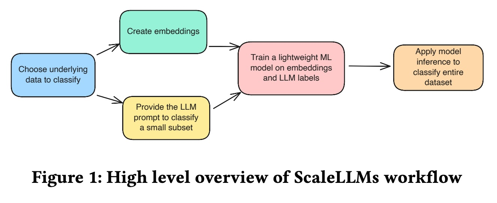
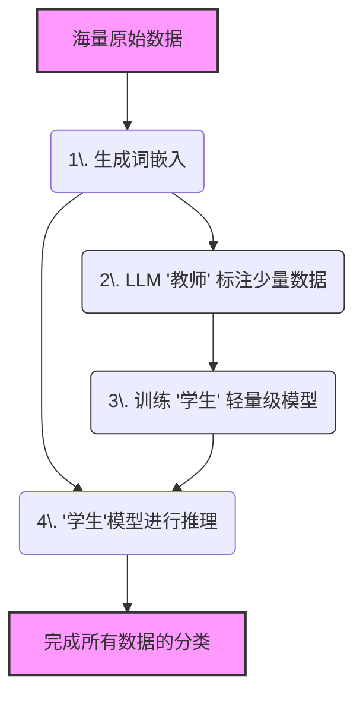
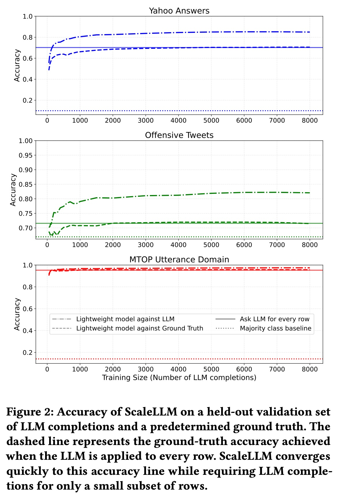
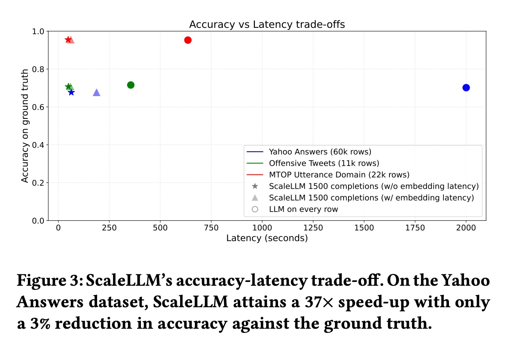
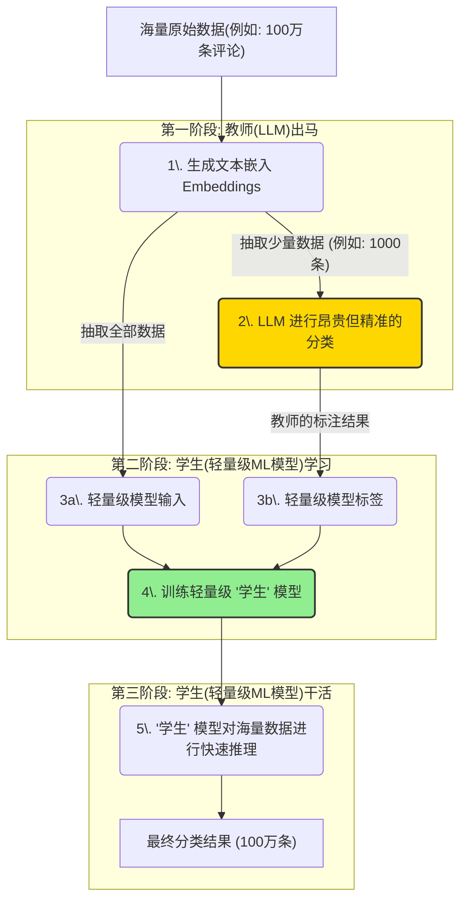
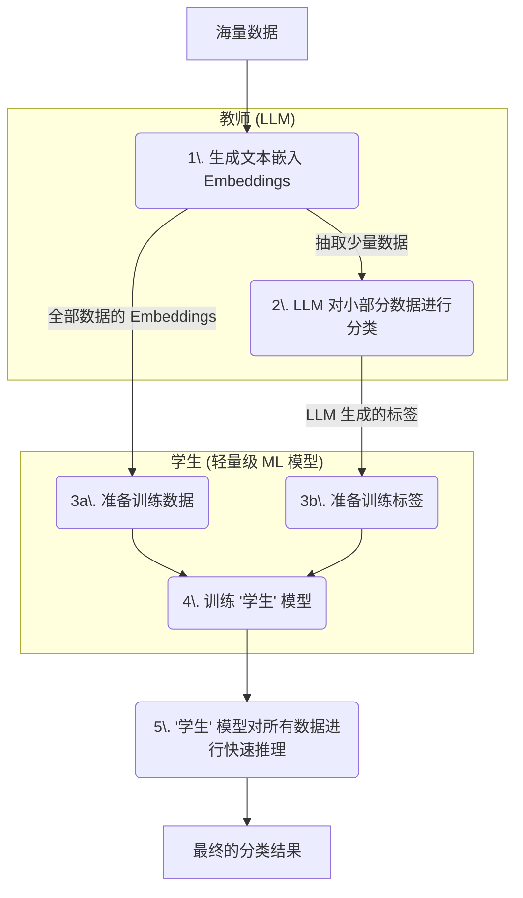

## AI论文解读 | ScaleLLM: A Technique for Scalable LLM-augmented Data
        
### 作者        
digoal        
        
### 日期        
2025-10-24        
        
### 标签        
PostgreSQL , PolarDB , DuckDB , AI , 论文解读        
        
----        
        
## 背景  
      
https://dl.acm.org/doi/pdf/10.1145/3722212.3725130        
  
提示:          
```          
读懂《ScaleLLM: A Technique for Scalable LLM-augmented Data》这篇论文需要提前掌握哪些基础知识, 请使用中文通熟易懂的讲解这些基础知识, 可以引用论文中的图、表或使用Markdown支持的图形(text,mermaid等)增加解释性. 
  
使用中文通熟易懂的解读《ScaleLLM: A Technique for Scalable LLM-augmented Data》这篇论文, 其中的关键内容请着重讲解, 可以引用论文中的图、表或使用Markdown支持的图形(text,mermaid等)增加解释性. 
  
提取《ScaleLLM: A Technique for Scalable LLM-augmented Data》这篇论文中的重要术语, 使用中文对这些术语进行通熟易懂的讲解, 可以引用论文中的图、表或使用Markdown支持的图形(text,mermaid等)增加解释性. 
```     
  
## 1 前置知识 
  
要读懂《ScaleLLM》这篇论文 ，你需要提前掌握以下几个领域的基础知识。这篇论文的核心思想是解决一个非常实际的问题：**直接用大型语言模型（LLM）处理海量数据既昂贵又缓慢** 。ScaleLLM 提出了一种巧妙的“偷懒”办法：**先用昂贵的 LLM 处理一小部分数据，然后用这些结果来“教会”一个更轻便、更快速的机器学习模型，让这个小模型去处理剩下所有的数据** 。

以下是你需要了解的基础知识点，我会用通俗的语言来解释：

### 1\. 什么是大语言模型 (LLM)？

  * **它是什么？** 你可以把 LLM（Large Language Model）想象成一个“超级大脑”，比如 OpenAI 的 GPT-4o-mini  或其他类似的模型。它们通过阅读海量的互联网文本进行训练，从而对语言有了深刻的理解（论文中称为“语义洞察”，semantic insights） 。
  * **它能做什么？** 它们可以执行各种文本任务，如回答问题、总结、翻译，以及本论文中提到的**文本分类** (text classification) 。
  * **有什么问题？** 论文指出，如果你想让 LLM 给数据库里的每一行数据都打个标签（比如判断每条用户评论是好评还是差评），这种“逐行调用” (row-by-row calls) 的方式会变得“极其昂贵且耗时” 。论文举例说，处理 6 万行数据就花了 30 分钟 。

### 2\. 什么是“词嵌入” (Embeddings)？

  * **它是什么？** 计算机无法直接理解“你好”或“苹果”这样的词汇。词嵌入技术（Embeddings）是一种将文本（单词、句子）转换成一长串数字（即“向量”）的方法 。
  * **有什么用？** 这些数字能捕捉文本的“语义”。在数学空间中，意思相近的词（比如“国王”和“王后”）它们的数字向量也更接近；反之（比如“国王”和“香蕉”）则相距很远。
  * **ScaleLLM 为什么用它？** 论文中提到，后续的“轻量级模型”不认识文字，只认识数字 。词嵌入就是把所有文本数据转换成它们能看懂的数字格式。
  * **关键特性：可重用性 (Reusability)。** 论文强调，词嵌入只需要生成一次，就可以被反复使用 。无论你之后想做“好评/差评”分类，还是“垃圾邮件/非垃圾邮件”分类，底层的数字（词嵌入）是不用变的，这极大地节省了成本和时间 。

### 3\. 机器学习 (ML) 基础：“训练”与“推理”

你需要了解机器学习的两个基本阶段：

1.  **训练 (Training):**
      * **概念：** 就像学生上课学习。你需要给模型提供“教材”（即*训练数据*）。
      * **在 ScaleLLM 中：** “教材”就是那一小部分由昂贵的 LLM 标注好的数据 。ScaleLLM 用这些数据来“训练”一个轻量级模型（比如论文中提到的随机森林、SVM 等） 。
2.  **推理 (Inference):**
      * **概念：** 就像学生上考场考试。你给训练好的模型新的、它没见过的数据，让它做出预测。
      * **在 ScaleLLM 中：** 指的就是用那个训练好的“轻量级模型”，去快速地给数据库里剩下所有的数据打上标签 。这个过程非常快，论文提到处理数万行数据“仅需几秒钟” 。

### 4\. 核心工作流：“教师-学生”模式

ScaleLLM 的整个流程（见论文图 1 ）就像一个“教师-学生”系统。    

  * **昂贵的“教师” (LLM):** 知识渊博，但出场费高。
  * **轻巧的“学生” (Lightweight ML model):** 学习快，干活麻利 。

工作流程如下：



这个流程解释了 ScaleLLM 如何只用少量 LLM 标注（第 2 步） 和词嵌入（第 1 步），就能训练出一个小模型（第 3 步），并最终高效完成大规模推理（第 4 步）。

### 5\. 性能评估指标

要看懂论文的“战绩”（结果部分），你需要了解这几个词：

  * **基线 (Baseline):** 你拿来作对比的“参照物”。在这篇论文里，“基线”就是指“每一行数据都用昂贵的 LLM 去处理”的那个最笨、最贵、最慢的方法 。
  * **准确率 (Accuracy):** 你的模型（ScaleLLM）预测对的百分比 。论文在图 2  中展示了 ScaleLLM 的准确率（实线/虚线）非常接近基线（点划线）。    
  * **延迟 (Latency):** 完成任务所花的时间 。论文在图 3  中展示了 ScaleLLM 的延迟（左侧的点）远远低于基线（右侧的点）。   
  * **权衡 (Trade-off):** 论文的核心贡献之一是提供了“成本-准确率-延迟”的权衡 。比如图 3  显示，ScaleLLM 实现了 **37 倍的加速**（延迟大幅降低），而准确率仅仅下降了 3% 。这笔交易非常划算。

### 总结

一言以蔽之，要读懂 ScaleLLM，你主要需要理解：

1.  **LLM 很强，但又贵又慢** 。
2.  **Embeddings（词嵌入）是让机器理解文本的“数字翻译”** ，且可重用 。
3.  **“教师-学生”模式**：用昂贵的 LLM（教师） 教会一个轻量级 ML 模型（学生），让学生去干体力活（推理）。

具备了这些知识，你就能轻松理解 ScaleLLM 是如何实现“花小钱、办大事”，在保持高准确率的同时，极大提升 LLM 在大规模数据系统上处理效率的 。
  
## 2 解读论文 
  
好的，这是一篇非常有价值且实用的论文。我来为您通俗易懂地解读一下《ScaleLLM》这篇论文的核心内容。

### 一句话总结：ScaleLLM 是什么？

想象一下，你有一个包含 100 万条用户评论的数据库，你想用像 GPT-4 这样的大语言模型（LLM）来判断每条评论是“好评”还是“差评”。

  * **传统做法：** 把 100 万条评论一条一条地发给 LLM，让它逐一判断 。
  * **存在的问题：** 这种“逐行调用”的方式极其昂贵且缓慢 。论文中提到，仅仅处理 6 万行数据就花了 30 分钟 。
  * **ScaleLLM 的妙招：** 咱们不让昂贵的 LLM 干所有体力活。我们只从 100 万条数据里**随机挑一小部分**（比如 1000 条），让 LLM 来给它们打上标签（“好评”/“差评”） 。然后，我们用这 1000 条“标准答案”去**训练一个轻量级的、跑得飞快的“学生”机器学习模型** 。最后，让这个“学生”模型去处理剩下的 99.9 万条数据 。

这个方法，就是 ScaleLLM。它本质上是一种“**LLM 当老师，小模型当学生**”的策略，用来给大规模数据做分类 。

### ScaleLLM 的核心工作流程

论文中的图 1（Figure 1）很清晰地展示了这个流程 。我们可以用一个更简单的 Mermaid 图来表示这个“师徒”模式：    



**关键点解读：**

1.  **文本嵌入 (Embeddings) ：** 这是关键的第一步。计算机不认识文字，只认识数字。Embeddings 技术（比如 OpenAI 的 Ada-2 模型）能把每一条评论都转换成一串数字（向量），这些数字代表了评论的“语义” 。这一步是**一次性投入**，生成后可以反复使用，非常划算 。
2.  **模型分析 (Model Analysis) ：** 这是 ScaleLLM 最智能的部分。它不仅是简单地训练一个模型，它还会告诉用户一个**成本-准确率的权衡曲线** 。比如它会告诉你：
      * 用 500 条数据训练，准确率 90%，耗时 1 分钟。
      * 用 1000 条数据训练，准确率 93%，耗时 2 分钟。
      * 用 2000 条数据训练，准确率 93.5%，耗时 4 分钟。
        这样用户就可以根据自己的需求（是追求极致准确率还是追求速度）来决定到底要让 LLM 标注多少数据 。
3.  **轻量级模型 ：** 论文中提到了几种“学生”模型，如随机森林（Random Forest）、支持向量机（SVM）和岭分类器（Ridge Classifier） 。这些都是非常成熟、计算速度极快的经典机器学习模型。

### 关键结果：效果到底怎么样？

论文通过实验回答了两个核心问题 ：

1.  **ScaleLLM 真的快吗？**
2.  **ScaleLLM 准吗（会不会因为“偷懒”导致准确率大幅下降）？**

答案是：**真的很快，而且依然很准。**

#### 1\. 关键结果之：准确率（参考图 2）

  

*(图源：论文 Figure 2 )*  

  * **图表解读：**
      * **X 轴 (Training Size)：** 你用了多少条数据来“请教”昂贵的 LLM（即“教师”的数据量） 。
      * **Y 轴 (Accuracy)：** “学生”模型的准确率 。
      * **虚线 (Ask LLM for every row)：** 这是“基线”，代表如果每一条数据都用 LLM 来处理，能达到的最高准确率 。
  * **核心结论：**
    在所有三个数据集（Yahoo, Offensive Tweets, MTOP）上，实线（“学生”模型）都**非常快地逼近了**那条虚线（“教师”的水平） 。
    比如在 MTOP 数据集上（红色曲线），只用了不到 1000 条 LLM 标注数据，学生模型的准确率就已经和 LLM 基线几乎持平了 。
    这证明 ScaleLLM **仅用非常小比例的 LLM 标注数据，就能达到几乎与完全使用 LLM 相当的准确率** 。

#### 2\. 关键结果之：速度 vs 准确率（参考图 3）

  

*(图源：论文 Figure 3 )*

  * **图表解读：**
      * **X 轴 (Latency)：** 处理完所有数据所需的总时间（秒），越往左越快 。
      * **Y 轴 (Accuracy)：** 最终的准确率，越高越好 。
  * **核心结论：**
      * **LLM 基线 (圆圈 O)：** 看到右下角那个蓝色的点了吗？那是 Yahoo Answers 数据集（6万行）的 LLM 基线 。它准确率很高（约 0.72），但**耗时极长**（约 2000 秒） 。
      * **ScaleLLM (星形/三角形)：** 再看最左侧的点 。ScaleLLM 的耗时极短（例如，在 Yahoo 数据集上不到 250 秒） 。
      * **性能对比：** 在 Yahoo Answers 数据集上，ScaleLLM 实现了 **37 倍的速度提升**（如果不算一次性的 Embedding 时间），而准确率仅下降了 3% 。

### 总结

《ScaleLLM》这篇论文提供了一个非常实用且高效的工程方案。它完美地解决了 LLM 在大规模数据分析中“又贵又慢”的痛点。

其核心思想就是**用昂贵的 LLM 作为“教师”来带路（标注少量数据），然后训练一个轻量级的“学生”ML 模型来完成大规模的体力活（推理全部数据）** 。实验证明，这种方法可以在准确率几乎不损失的情况下（比如只损失 1%-3%），带来几十倍（如 37 倍）的性能提升 ，极大地节约了成本和时间。
  
## 3 术语 
  
以下是《ScaleLLM》这篇论文中几个关键术语的通俗易懂的中文讲解：

### 1\. LLM 增强的数据系统 (LLM-augmented Data Systems)

  * **通俗讲解：**
    想象一下你的数据库（比如存满了用户评论、商品描述等）变得“聪明”了，它不再只能做简单的增删改查，还能“理解”文本的含义。这就是 LLM 增强的数据系统，它把大语言模型（LLM）的能力（如语义理解、分类、总结）集成到了传统的数据系统中 。
  * **在论文中的含义：**
    论文指出，虽然这些系统很强大 ，但它们存在一个严重问题：如果数据量很大（比如几万行），你需要让 LLM 去逐行处理这些数据 。

### 2\. 逐行 LLM 调用 (Row-by-row LLM calls)

  * **通俗讲解：**
    这是最直接但也最“笨”的方法。比如要给 10 万条用户评论分类，你就真的去请求 LLM API 10 万次，一次处理一条。
  * **在论文中的含义：**
    这是 ScaleLLM 要解决的核心痛点。论文明确指出，这种方法“极其昂贵且耗时” 。论文举例说，用 GPT-4o-mini 处理 6 万行数据就花了 30 分钟，成本和延迟都非常高 。

### 3\. ScaleLLM (本文提出的系统)

  * **通俗讲解：**
    ScaleLLM 是论文提出的一个“省钱又省时”的智能解决方案。它的核心思想是 **用“老师”带“学生”** 。
  * **在论文中的含义：**
    它不再让 LLM（昂贵的“老师”）处理所有数据，而是只让 LLM 处理一小部分数据（比如 1000 条）并给出“标准答案”（即 LLM 生成的标签） 。然后，它用这些“标准答案”去训练一个轻量级、跑得飞快的“学生”模型（Lightweight ML model） 。最后，让这个“学生”模型去一口气处理剩下所有的数据 。

你可以通过论文中的图 1（Figure 1）来理解这个流程 ：

  



### 4\. 文本嵌入 (Embeddings)

  * **通俗讲解：**
    Embeddings 就像是文本的“数字指纹”或“语义坐标”。计算机不认识中文或英文，只认识数字。Embeddings 技术（比如 OpenAI 的 Ada-2 模型 ）能把一段话（比如“这家餐厅味道不错”）转换成一串数字（例如 `[0.1, -0.5, 0.8, ...]`）。意思相近的话，它们的“数字指纹”也越接近。
  * **在论文中的含义：**
    这是“学生”模型能够学习的基础 。ScaleLLM 首先会把所有文本数据都转换成 Embeddings 。那个轻量级的“学生”模型，看的就是这些“数字指纹”（Embeddings）和“老师”给的标签（LLM Labels）之间的关系 。

### 5\. 嵌入的可重用性 (Embedding Reusability)

  * **通俗讲解：**
    这是 Embeddings 的一个巨大优势。一旦你为所有数据生成了“数字指纹”，这个指纹就可以反复使用。
  * **在论文中的含义：**
    论文强调这是一个“一次性投资” 。比如，你今天用这批 Embeddings 训练了一个“好评/差评”模型；明天，你可以**重用（Reuse）同一批 Embeddings**，去训练一个“是否提及价格”的新模型，而不需要重新花钱花时间去生成新的 Embeddings 。这与 LLM 每次提问都要重新处理原始文本不同 。

### 6\. 轻量级机器学习模型 (Lightweight ML model)

  * **通俗讲解：**
    这就是我们前面提到的“学生”模型 。它指的是那些计算量小、速度快、对资源要求不高的经典机器学习模型。
  * **在论文中的含义：**
    ScaleLLM 会同时训练好几个这样的模型，比如：随机森林 (Random Forest)、线性 SVM (Linear SVM)、RBF SVM 和岭分类器 (Ridge Classifier) 。然后，它会从中挑选表现最好的那个“学生”去完成最终的大规模推理任务 。

### 7\. 成本-准确率权衡 (Cost-accuracy trade-off)

  * **通俗讲解：**
    这是一个在“花多少钱”和“效果有多好”之间做选择的问题。
      * **高成本：** 每行都用 LLM（基线），准确率最高，但成本和时间也最高。
      * **低成本：** 用 ScaleLLM，只让 LLM 标注 500 行数据，准确率可能下降 3%，但速度快 30 倍。
  * **在论文中的含义：**
    ScaleLLM 不仅提供了低成本方案，它还能**预测**这种权衡 。它会分析数据并给用户画一条“准确率曲线”（如图 2），告诉用户：“你请 LLM 标注 500 行数据，准确率大概能到 90%；如果增加到 1000 行，准确率能到 92%...” 。这让用户可以根据自己的预算和需求做出明智的选择 。    

### 8\. 基线 (Baseline)

  * **通俗讲解：**
    “基线”就是用来作对比的“参照物”。在这里，它指的是那个最贵、最慢的传统方法。
  * **在论文中的含义：**
    论文中的基线就是“让大语言模型（LLM）处理每一行数据”的方法 。ScaleLLM 的所有实验结果（如图 2 和图 3）都是和这个基线进行对比，以证明自己在速度和成本上的巨大优势 。    

### 9\. 加速比 (Speedup)

  * **通俗讲解：**
    就是“快了多少倍”。
  * **在论文中的含义：**
    这是衡量 ScaleLLM 性能的核心指标。论文在摘要和正文中都提到，ScaleLLM 实现了显著的加速——高达 37 倍 。在图 3 中可以清晰地看到，ScaleLLM（图左侧的点）的延迟（Latency）远远低于基线（图右侧的点）。
  
## 参考        
         
https://dl.acm.org/doi/pdf/10.1145/3722212.3725130    
  
https://rmarcus.info/blog/    
        
<b> 以上内容基于DeepSeek、Qwen、Gemini及诸多AI生成, 轻微人工调整, 感谢杭州深度求索人工智能、阿里云、Google等公司. </b>        
        
<b> AI 生成的内容请自行辨别正确性, 当然也多了些许踩坑的乐趣, 毕竟冒险是每个男人的天性.  </b>        
    
#### [期望 PostgreSQL|开源PolarDB 增加什么功能?](https://github.com/digoal/blog/issues/76 "269ac3d1c492e938c0191101c7238216")
  
  
#### [PolarDB 开源数据库](https://openpolardb.com/home "57258f76c37864c6e6d23383d05714ea")
  
  
#### [PolarDB 学习图谱](https://www.aliyun.com/database/openpolardb/activity "8642f60e04ed0c814bf9cb9677976bd4")
  
  
#### [PostgreSQL 解决方案集合](../201706/20170601_02.md "40cff096e9ed7122c512b35d8561d9c8")
  
  
#### [德哥 / digoal's Github - 公益是一辈子的事.](https://github.com/digoal/blog/blob/master/README.md "22709685feb7cab07d30f30387f0a9ae")
  
  
#### [About 德哥](https://github.com/digoal/blog/blob/master/me/readme.md "a37735981e7704886ffd590565582dd0")
  
  

  
