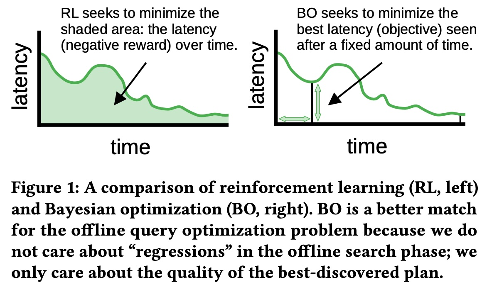
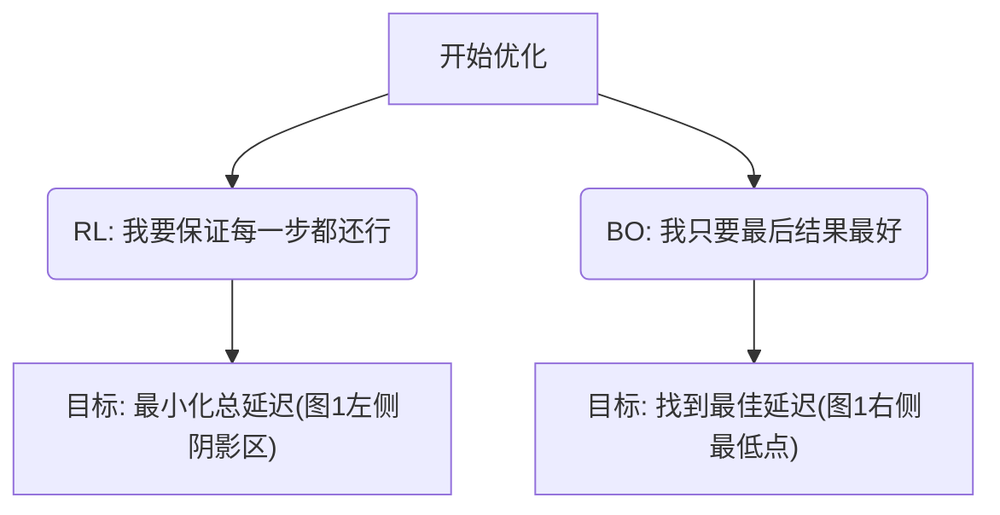
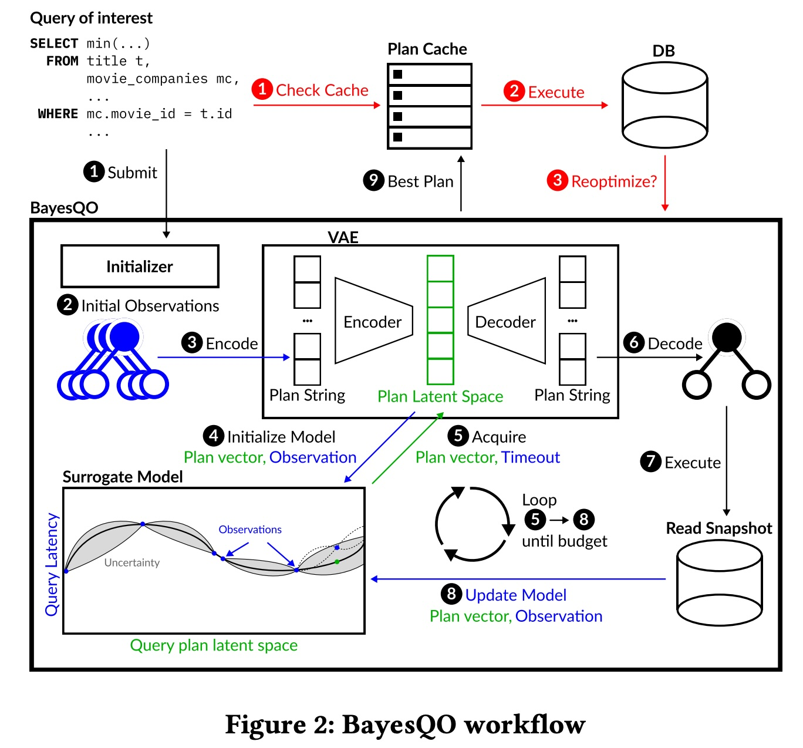
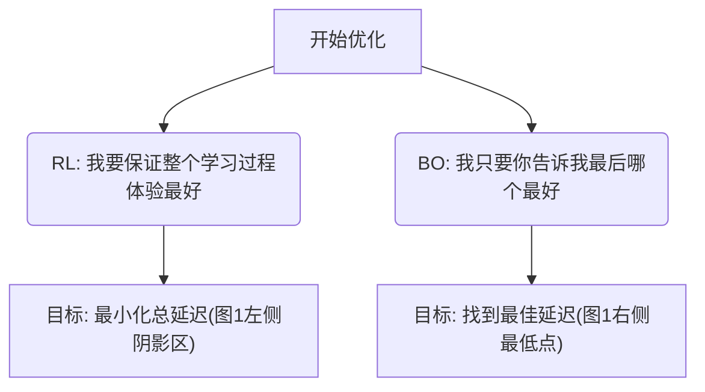
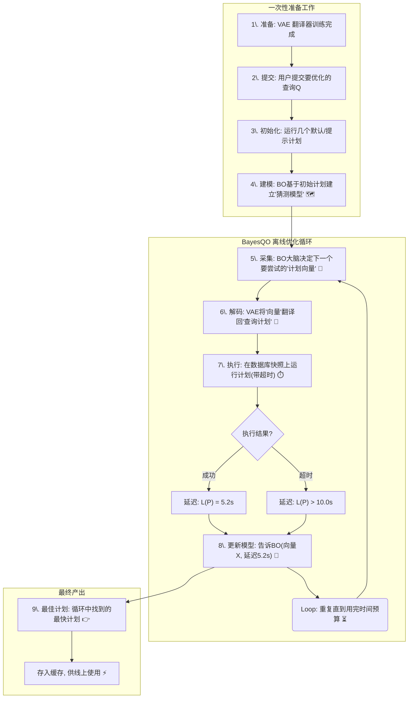
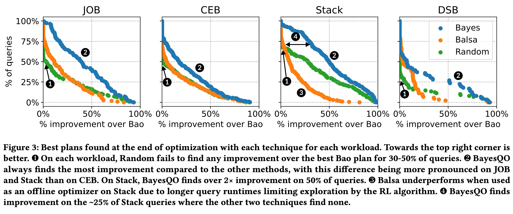
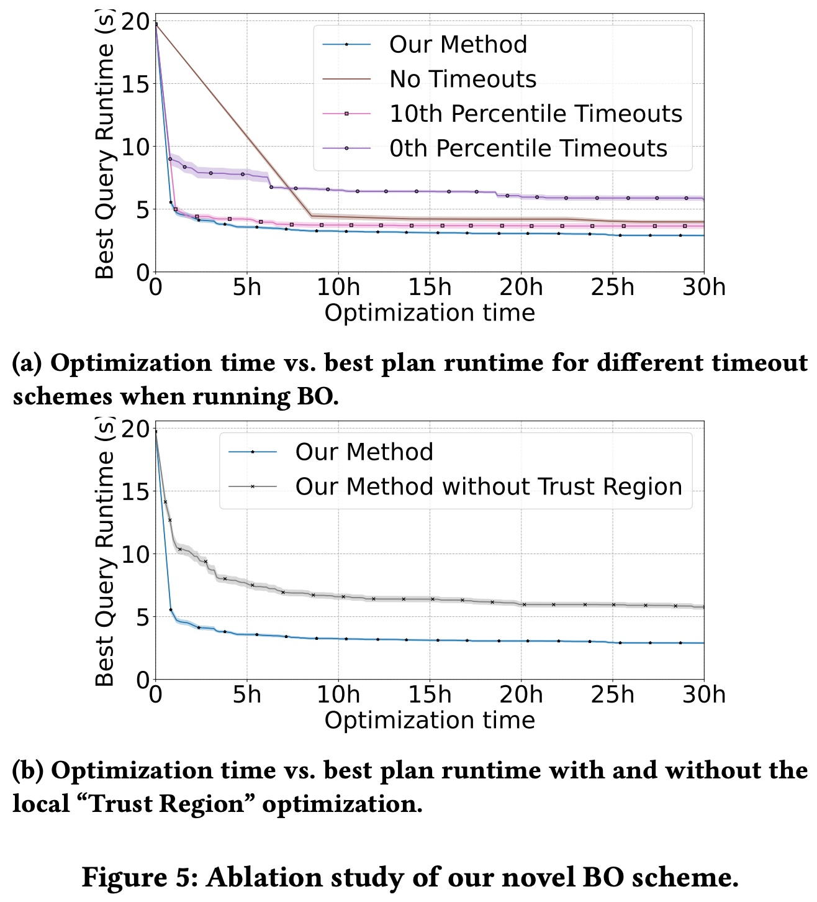
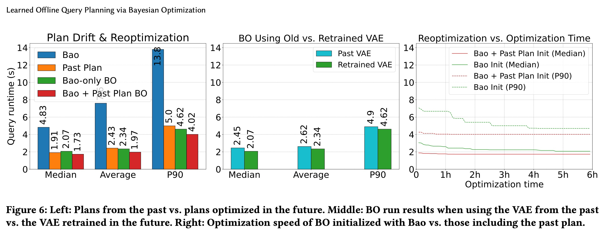

## AI论文解读 | Learned Offline Query Planning via Bayesian Optimization
        
### 作者        
digoal        
        
### 日期        
2025-10-24        
        
### 标签        
PostgreSQL , PolarDB , DuckDB , AI , 论文解读        
        
----        
        
## 背景  
      
https://arxiv.org/pdf/2502.05256        
  
提示:          
```          
读懂《Learned Offline Query Planning via Bayesian Optimization》这篇论文需要提前掌握哪些基础知识, 请使用中文通熟易懂的讲解这些基础知识, 可以引用论文中的图、表或使用Markdown支持的图形(text,mermaid等)增加解释性. 
  
使用中文通熟易懂的解读《Learned Offline Query Planning via Bayesian Optimization》这篇论文, 其中的关键内容请着重讲解, 可以引用论文中的图、表或使用Markdown支持的图形(text,mermaid等)增加解释性. 
  
提取《Learned Offline Query Planning via Bayesian Optimization》这篇论文中的重要术语, 使用中文对这些术语进行通熟易懂的讲解, 可以引用论文中的图、表或使用Markdown支持的图形(text,mermaid等)增加解释性. 
```     
  
## 1 前置知识 
  
要读懂这篇论文《通过贝叶斯优化的离线查询规划学习》(Learned Offline Query Planning via Bayesian Optimization) ，你需要提前掌握以下几个领域的基础知识。

这篇论文的核心思想是：对于那些经常被重复执行的数据库查询（比如生成每日报表），我们不应该满足于数据库“在线”给出的那个“还行”的执行方案，而是应该“离线”多花点时间，用一种更智能的搜索方法（贝叶斯优化），去“学习”并找到一个*真正*高效的执行方案 。

以下是你需要的基础知识，我会用通俗的类比来解释：

### 1\. 数据库基础：什么是“查询优化”？

想象一下，你用导航软件（比如谷歌地图）规划一个从A点到B点的路线。

  * **SQL查询 (SQL Query):** 这就是你的需求——“我要从A点到B点”。
  * **查询计划 (Query Plan):** 导航软件给出的*具体路线方案*。比如：“先上高速G1，在第3个出口下，然后走XX路...”。在数据库里，这就对应着“先扫描A表，再和B表进行哈希连接，最后过滤结果...”
  * **查询优化器 (Query Optimizer):** 这就是导航软件的“大脑” 。它的工作是从成千上万条可能的“路线”（查询计划）中，估算并挑选出一条它认为*最快*（成本最低）的路线。
  * **在线 (Online) vs 离线 (Offline) 优化:**
      * **在线优化 (Online):** 你在车上，马上就要出发了，你点击“导航”。导航软件必须在*一秒钟内*给你一条路 。这条路通常不错，但可能不是全城最好的。这是传统数据库的工作方式。
      * **离线优化 (Offline):** 你在为明天的重要长途旅行做规划。你愿意花*半个小时*甚至更久，让导航软件慢慢计算，尝试各种路线组合，以找到那条*绝对最快*的路线 。这篇论文研究的就是这个“离线”场景，因为对于每天都要跑1000次的查询，省下的时间是巨大的 。

### 2\. 核心方法：什么是“贝叶斯优化”(BO)？

这是论文最核心的技术。BO是一种“昂贵测试”下的智能搜索算法 。

  * **类比：** 假设你是一个烘焙师，想烤出世界上最好吃的蛋糕。蛋糕的口感取决于两个因素：**温度**和**烘烤时间**。你不知道最佳组合是什么，而且每烤一次蛋糕都要花3个小时（测试成本很高）。你该怎么办？

  * **BO的策略：**

    1.  **试烤几次：** 你先随便试2-3组（比如“180度, 30分钟”和“200度, 25分钟”）。
    2.  **建立“猜测模型” (Surrogate Model):** 你根据这几次的结果，在脑子里建立一个*概率模型*（“猜测”）。这个模型会预测：“嗯... 190度, 28分钟”*可能*会很好，而且我对这个组合的“不确定性”也很高（没试过附近）。
    3.  **智能选择下一次 (Acquisition Function):** 你根据这个“猜测模型”，决定*下一次*到底该试哪一组参数 。你可能会选模型预测*最好*的（利用, Exploitation），也可能会选模型*最没把握*的（探索, Exploration）。
    4.  **更新模型并重复：** 你烤了下一次，得到新结果，然后更新你的“猜测模型” 。

  * **在论文中：**

      * **“烤蛋糕”** = 执行一个“查询计划” 。
      * **“口感”** = 查询的“延迟”(Latency)，越低越好 。
      * **“温度/时间”** = 一个“查询计划”（的表示）。
      * **BO的目标** = 用*最少的执行次数*，找到那个延迟*最低*的查询计划 。

### 3\. 对比方法：什么是“强化学习”(RL)？

论文花了很多篇幅（特别是图1）来对比BO和RL，说明为什么RL不适合这个“离线”问题 。    

  * **类比：** 强化学习(RL) 就像训练一只小狗。你希望它在*整个训练过程*中获得*最多的零食*（总奖励最大化）。
  * **RL的问题：** 如果小狗尝试一个新动作（探索），但失败了（没拿到零食），它会觉得“很亏”。为了保证总有零食吃，它可能会倾向于一直做它已经学会的“旧动作”（利用）。
  * **BO vs RL (关键区别见 图1):**
      * **RL (图1左):** 目标是让“总的阴影面积”最小（即在整个*学习过程中*，平均延迟最低）。它害怕尝试“坏计划”，因为那会增加总面积 。
      * **BO (图1右):** 目标是找到那个“最低点”（最好的计划）。它*不关心*在搜索过程中是否尝试了几个很慢的计划（阴影面积），它只关心*最终找到的那个最好的*有多好 。

论文认为，在“离线”场景，我们只关心最后的结果（最低点），不在乎过程（总面积），所以BO是更合适的工具 。



### 4\. 辅助技术：什么是“变分自编码器”(VAE)？

你可能还会问：BO擅长处理“温度/时间”这种*数字*，但“查询计划”是一个复杂的*树结构*，BO怎么处理它？

答案就是VAE (Variational Auto-encoder) 。

  * **类比：** 想象一个“翻译压缩器”。

    1.  **编码器 (Encoder):** 你给它一篇中文文章（查询计划的字符串形式）。它会阅读、理解，并把它“压缩”成一个简短的*数字列表*（比如 `[0.2, 0.8, -0.5, ...]`）。这个数字列表所在的抽象空间就是“潜在空间”(Latent Space) 。
    2.  **解码器 (Decoder):** 你给它那个数字列表 `[0.2, 0.8, -0.5, ...]`，它能把它“解压缩”并翻译回原来的中文文章（查询计划）。

  * **为什么这么做？**

      * BO可以在这个“潜在空间”（全是数字）里高效工作 。
      * VAE能学会把*相似*的查询计划（比如只是交换了两个小表的连接顺序）映射到潜在空间中*相近*的点上 。
      * **整个流程 (见 图2):**    
        1.  把一批“查询计划” 编码成“数字向量”(Plan vector) 。
        2.  BO的“猜测模型”(Surrogate Model) 在这个数字空间里学习 。
        3.  BO的“采集函数” 挑选一个*新的*“数字向量”，它认为这个向量对应的计划可能很好。
        4.  用 VAE“解码器” 把这个新向量“翻译”回一个新的“查询计划”。
        5.  执行这个新计划，得到延迟，喂回给BO模型。
        6.  循环这个过程，直到找到最好的计划 。

### 总结

你需要的基础知识是：

1.  **数据库 (Database):** 懂“查询计划”和“查询优化”的在线/离线区别。
2.  **贝叶斯优化 (BO):** 懂它如何通过“代理模型”和“采集函数”来智能搜索昂贵的黑盒问题。
3.  **强化学习 (RL):** 懂它的目标是“最大化累积奖励”，并理解这与BO“找到最优值”目标的区别 (如图1所示) 。    
4.  **深度学习 (DL):** 懂“自编码器”(AE/VAE) 的作用，即如何将复杂结构（如查询计划）“压缩”成连续的数字向量（潜在空间），以便于BO处理 。
  
## 2 解读论文 
  
这是一篇关于数据库查询优化的重要论文。简单来说，它的核心思想是：**对于那些需要被反复执行的重要查询（比如生成报表的查询），我们不应该只满足于数据库“快速”给出的“还行”的执行计划，而应该愿意“离线”多花一些时间，使用一种更智能的搜索技术（贝叶斯优化），来“学习”并找到一个真正高效的、近乎完美的执行计划。**

这套系统被称为 **BayesQO** 。

-----

### 1\. 核心问题：为什么要“离线”优化？

在数据库中，你每输入一条SQL查询，数据库的“查询优化器”都需要在极短的时间内（比如几百毫秒）给出一个“查询计划”（Query Plan），也就是执行这条查询的具体步骤 。

  * **在线优化 (Online):** 这是传统方式。它追求的是“快”。优化时间必须远低于执行时间 。这导致它找到的计划通常是“还不错”，但*不一定*是“最好”的。
  * **离线优化 (Offline):** 这篇论文关注的场景。在很多分析型数据库中，有大量的查询是*重复执行*的 。比如，一个仪表盘每天要刷新100次，或者一个报表查询每年要跑几十万次 。
      * **思考：** 如果一个查询要跑1000次，那么花10分钟的“离线”时间，找到一个能让每次执行都快2秒的计划，是不是非常划算？
      * 这就是本文定义的 **“离线查询优化问题” (offline query optimization problem)** 。

### 2\. 关键洞察：为什么用贝叶斯(BO)，而不用强化学习(RL)？

近年的研究（LQO）尝试使用机器学习（特别是强化学习RL）来做查询优化 。但本文作者敏锐地指出：**RL（强化学习）根本就是“用错了工具”** 。

**关键区别请看论文中的 图1 ：**     

  * **RL (图1左):** 强化学习的目标是 **最小化“总后悔值”** （即最小化图中的阴影面积）。它在“探索”时，每尝试一个很糟糕的计划（延迟很高），都会受到“惩罚” 。因此，它会倾向于保守，不敢大胆尝试可能很差但也可能很好的未知领域。
  * **BO (图1右):** 贝叶斯优化的目标是 **“找到那个最低点”** （即在固定时间内，找到延迟最低的那个计划）。在“离线”优化的场景下，我们*根本不关心*搜索过程中尝试了多少个坏计划（阴影面积有多大），我们*只关心*最后找到的那个“最佳计划”有多好 。

用一个流程图来对比它们的目标：



因此，对于“离线优化”这个目标，BO是比RL更匹配的工具 。

-----

### 3\. 核心方案：BayesQO 是如何工作的？

BayesQO 系统巧妙地解决了几个核心挑战，其工作流程见 **图 2** 。    

#### 挑战1：BO 只懂数字，不懂“查询计划”

“查询计划”是一种复杂的树状结构 ，而贝叶斯优化（BO）擅长在连续的数字空间（比如 `[0.1, -0.5, 0.8]`）中搜索。

**解决方案：使用 VAE (变分自编码器)** 。
VAE 就像一个“翻译器”和“压缩器”：

1.  **编码 (Encode):** 首先，他们设计了一种方法，将任何一个“查询计划”转换成一个*字符串* 。
2.  **压缩:** VAE 的编码器 (Encoder) 将这个字符串“压缩”成一个低维度的*数字向量*（比如一个64维的向量）。这个全是数字的抽象空间就叫“潜在空间”(Plan Latent Space) 。
3.  **解码 (Decode):** VAE 的解码器 (Decoder) 能把这个*数字向量*再“翻译”回原来的“查询计划”字符串 。

通过这种方式，BO 就可以在它擅长的“数字空间”里搜索，而 VAE 负责在“数字”和“查询计划”之间来回翻译。

#### 挑战2：如何智能地搜索？

BO 的核心是 **“猜测模型” (Surrogate Model)** 。

1.  **初始化 (Initialize):** 我们先运行几个已知的计划（比如数据库默认的计划，或者Bao等工具给出的一些“提示”计划），得到它们的（向量, 真实延迟）数据点。
2.  **建模:** Surrogate Model（本文使用高斯过程GP）根据这些数据点，学习一个*概率模型*，来“猜测”整个潜在空间（所有可能的计划）的延迟大概是什么样的 。它不仅猜测一个值，还会给出一个“置信区间”（即它对这个猜测有多大把握）。
3.  **采集 (Acquire):** “采集函数” (Acquisition Function) 是 BO 的“大脑” 。它会平衡“利用”和“探索”：
      * **利用 (Exploitation):** 在模型“猜测”延迟很低的区域（已知的好计划附近）进行搜索。
      * **探索 (Exploration):** 在模型“猜测”很不确定的区域（完全未知的计划）进行搜索，万一那里藏着一个绝世好计划呢？
4.  **循环:** BO 通过采集函数选一个新的点（向量），解码成计划，执行，得到新延迟，然后更新（Update）模型 。

#### 挑战3：如何处理“天长地久”的坏计划？

搜索时，BO 难免会生成一个*极其糟糕*的查询计划，可能要跑几天几夜 。我们不能真的等它跑完。

**解决方案：使用“右删失观测” (Right-Censored Observations)** 。
这是 BO 的一个巨大优势。

  * **设置超时 (Timeout):** 我们在执行计划时，会设置一个“超时时间” 。
  * **学习“\>”信息:** 如果一个计划执行了10秒还没跑完，我们就*终止*它 。然后我们告诉 BO 的模型：“这个计划的真实延迟*大于*10秒” ( $Latency > 10s$ ) 。
  * **模型更新:** BO 模型非常擅长利用这种不精确的“大于号”信息 。它照样可以更新自己的“猜测”，知道这片区域“很差”，以后要少来。这就避免了在坏计划上浪费海量的优化时间 。

更妙的是，本文还提出了一种新颖的、基于模型*不确定性*的策略来*动态选择*这个超时阈值，而不是使用一个固定值 。

#### BayesQO 完整工作流程 (图2简化版)  

下面是 BayesQO 的完整优化循环 ：

  



-----

### 4\. 实验结果：真的有效吗？

是的，效果显著。

1.  **BayesQO 效果最好 (图 3)**    

      * 论文在 JOB、Stack、CEB、DSB 四个标准数据集上进行了测试 。
      * **图 3**  是一个累积分布图 (CDF)。**越靠右上角越好**。
      * **结果：** 蓝色的线 (BayesQO) 始终在最右上角 。这意味着 BayesQO 能为*更多*的查询找到*更大*的性能提升 。例如，在 Stack 数据集上，BayesQO 为 50% 的查询找到了超过 2 倍（100%）的改进 。

2.  **关键设计都很有用 (图 5)**    

      * **超时策略很重要 :** 图 5a  显示，本文提出的“基于不确定性的超时”策略（蓝线）比其他固定策略（如“用当前最好成绩当超时”）能更快地找到更好的计划 。
      * **局部BO很关键 :** 图 5b  显示，使用“局部BO”（Trust Region，红线）比“全局BO”（灰线）在这个高维空间中效率高得多 。

3.  **对数据变化不敏感 (图 6)**    

      * 一个常见的担心是：我“离线”优化好的计划，在数据更新（数据漂移）后会不会就变差了？
      * **结果 (图 6 左) :** 用“过去”数据优化出的计划（Past Plan，绿色），在“未来”数据上跑，性能依然和“未来”数据重新优化的计划（Future BO，蓝色）差不多，并且远好于 Bao（红色）。
      * **结论：** BayesQO 找到的计划具有很好的鲁棒性 。而且，如果需要重新优化，把“过去的最佳计划”作为初始点，可以极大加快优化的速度（从 8.2 小时缩短到 1.5 小时）。

### 总结

《Learned Offline Query Planning via Bayesian Optimization》这篇论文：

1.  **明确了问题：** 针对重复性分析查询，应采用“离线优化” 。
2.  **指明了方向：** BO（贝叶斯优化）是比 RL（强化学习）更适合此问题的工具，因为它只关心“找到最优”，不关心“过程成本” 。
3.  **提供了方案 (BayesQO)：**
      * 使用 VAE 将离散的查询计划映射到连续的“潜在空间” 。
      * 使用 BO 在该空间进行智能搜索 。
      * 使用“右删失观测”来高效处理和学习“超时”的坏计划 。
4.  **证明了效果：** 在多个基准上，BayesQO 显著优于现有的 RL 方法和基于提示的优化器 。
  
## 3 术语 
  
根据您提供的论文《Learned Offline Query Planning via Bayesian Optimization》（通过贝叶斯优化学习离线查询规划），以下是其中一些重要术语的中文讲解：

### 1\. 离线查询优化 (Offline Query Optimization)

"离线查询优化"是这篇论文的核心问题 。

  * **传统方式 (在线优化):** 大多数数据库在您按下"执行"按钮时才开始优化查询 。这个过程必须非常快 (例如, 几百毫秒内)，因为它计入总的查询时间 。
  * **离线方式:** 许多分析型数据库（如用于生成报表或仪表盘的数据库）会一遍又一遍地执行完全相同的查询 。例如, 一个查询可能每年执行数十万次 。对于这种重复性查询, 我们宁愿在"离线"时花费更长的时间 (比如几分钟甚至几小时) 来进行优化, 目标是找到一个*近乎完美*的查询计划。
  * **目标:** 离线查询优化的目标是: 在给定的离线资源预算 (例如, 总优化时间) 内, 找到能让查询延迟最低的最佳查询计划 。

### 2\. 贝叶斯优化 (BO) vs. 强化学习 (RL)

这篇论文的核心论点是, 对于"离线查询优化"问题, 贝叶斯优化 (BO) 是比强化学习 (RL) "更合适的工具" 。

您可以通过论文中的 **图 1**  来直观地理解它们的区别：    

  * **强化学习 (RL - 左图):**
      * **目标:** RL 试图最小化"总的后悔值"或"总延迟", 也就是图中的**阴影区域面积** 。
      * **通俗解释:** RL 每一次尝试 (Exploration) 选到了一个糟糕的计划, 它都会受到"惩罚" (即高延迟) 。因此, RL 必须小心翼翼地平衡"探索"(尝试新计划)和"利用"(使用已知的最好计划) 。这非常适合"在线"优化, 因为在线系统不希望用户突然体验到一次极慢的查询 。
  * **贝叶斯优化 (BO - 右图):**
      * **目标:** BO 试图最小化在固定时间内所能观察到的**最佳(最低)延迟** 。
      * **通俗解释:** 在*离线*搜索阶段, BO **不在乎**中间尝试了多少个坏计划 。它的唯一目标是在优化时间结束时, 找到那个"历史最低点"。论文认为, 这才完全符合离线优化的目标——我们只关心最终找到的那个最佳计划的质量 。

### 3\. BayesQO (论文提出的系统)

BayesQO 是这篇论文提出的新型"离线查询优化器"的名称 。

它是一个结合了多种机器学习技术的系统, 其工作流程如 **图 2** 所示 。    

  * **核心组件:** BayesQO 主要结合了**变分自编码器 (VAE)** 和**贝叶斯优化 (BO)** 。

  * **工作流程:** 系统的离线优化过程是一个循环 ：

    1.  **编码 (Encode):** 将一个离散的查询计划 (Query Plan) 通过 VAE 编码成一个连续空间中的向量 (Vector) 。
    2.  **建模 (Surrogate Model):** 贝叶斯优化维护一个"代理模型", 该模型学习"向量"与"实际查询延迟"之间的关系 。
    3.  **采集 (Acquire):** "采集函数"根据代理模型, 决定下一个最值得尝试的"向量"是什么 。
    4.  **解码 (Decode):** 将这个新向量通过 VAE 解码, 还原成一个具体的查询计划 。
    5.  **执行 (Execute):** 在数据库上实际执行这个计划, 测量其延迟 。
    6.  **更新 (Update):** 将 (向量, 延迟) 这个新数据点喂给代理模型, 更新其对查询空间的理解 。
    7.  **重复:** 不断重复这个循环, 直到用完时间预算 。
    8.  **缓存:** 最终, 将整个过程中发现的"最佳计划"存入缓存 。

  * **使用流程 (Mermaid 图示):**

    ```mermaid
    graph TD
        subgraph "离线优化阶段 (Offline)"
            A[1. 提交要优化的查询] --> B(BayesQO 开始循环);
            B --> C[VAE 编码器];
            C --> D[代理模型];
            D --> E[采集函数 E决定下一个点];
            E --> F[VAE 解码器 F生成新计划];
            F --> G(DB G执行新计划);
            G --> H{H\. 获得延迟或超时};
            H --> I[I\. 更新代理模型];
            I --> E;
            I -- 预算用尽 --> J[J\. 找到的最佳计划];
            J --> K([Plan Cache K计划缓存]);
        end

        subgraph "在线运行阶段 (Online)"
            L[用户再次运行查询] --> M{M\. 检查缓存?};
            M -- 找到 --> N[N\. 执行已优化的最佳计划];
            M -- 未找到 --> O[O\. 使用数据库默认优化器];
        end
    ```

### 4\. 变分自编码器 (VAE) 和 潜在空间 (Latent Space)

  * **问题:** 贝叶斯优化 (BO) 擅长在连续的、实数值的向量空间 (例如, `[0.5, -1.2, 0.8]`) 中搜索 。但查询计划是高度结构化的、离散的树形结构 。
  * **解决方案:** BayesQO 使用 **VAE (Variational Autoencoder)** 来充当"翻译官" 。
    1.  首先, 论文设计了一种方法, 将任何查询计划表示为一串 **字符串 (String)** 。
    2.  然后, VAE 模型被训练来压缩这些字符串 。VAE 包含两部分：
          * **编码器 (Encoder):** 读取查询计划字符串, 将其压缩成一个低维度的、连续的向量 。
          * **解码器 (Decoder):** 接收这个向量, 并尝试将其还原回原始的查询计划字符串 。
  * **潜在空间 (Latent Space):** VAE 压缩后生成的那个连续向量空间, 就被称为"潜在空间" 。VAE 的一个重要特性是它能学习到一个"平滑"的潜在空间, 使得相似的查询计划会被映射到潜在空间中彼此靠近的向量上 。
  * **作用:** 有了 VAE, BayesQO 就可以在平滑的"潜在空间"中执行贝叶斯优化, 而不是在困难的、离散的"查询计划空间"中进行搜索 。

### 5\. 代理模型 (Surrogate Model)

  * **问题:** 评估一个查询计划的"真实"延迟非常昂贵——你必须实际运行它 。BO 的目标就是用尽可能少的"昂贵评估"来找到最佳点 。
  * **作用:** "代理模型" (或称"替代模型") 是一个计算上很便宜的概率模型 (例如, 高斯过程) 。
  * **通俗解释:** 代理模型就像一个"有自知之明"的猜测器。它根据已经执行过的点 (例如, 计划A耗时5秒, 计划B耗时50秒), 来预测潜在空间中*所有*其他未测试点的*可能*延迟 。它的预测不仅是一个值 (如"我猜3秒"), 而是一个带"不确定性"的概率分布 (如"我猜是3秒, 但有95%的概率在1秒到10秒之间") 。
  * **图示:** 在论文的 **图 2** 中, "Surrogate Model" 框内的图像就展示了这一点: 曲线是模型对延迟的预测, 灰色区域是模型的不确定性 。采集函数 (Acquisition Function) 会利用这些信息, 专门挑选那些"预测延迟低"或"不确定性高"的点进行下一次昂贵的真实评估。   

### 6\. 右删失观测 (Right-Censored Observations)

  * **问题 (超时):** 在优化过程中, 不可避免地会生成一些*极其糟糕*的查询计划, 它们可能要运行几天甚至几周 。我们显然不能等它们运行结束。
  * **常规做法 (超时):** 我们会设置一个"超时阈值" (Timeout), 比如 10 分钟 。如果一个计划运行超过 10 分钟, 就强行终止它。
  * **数据的挑战:** 这时我们获得了一个"超时"数据点。我们该如何利用这个信息?
      * *错误的做法:* 告诉模型这个计划的延迟是 10 分钟。这是在撒谎, 因为它的真实延迟可能是 10 小时 。
      * *BayesQO 的做法:* BayesQO 使用了"右删失观测" (Right-Censored Observations) 的概念 。
  * **通俗解释:** 当一个查询在 10 分钟时超时, 我们告诉代理模型的信息是: "我不知道这个计划的真实延迟, 但我100%确定它的真实延迟**大于或等于** 10 分钟" ( $f(x) \ge 10 \text{ mins}$ ) 。
  * **好处:** 这是一种诚实且鲁棒的处理超时的方法 。它使得模型能够正确地学习到"这片潜在空间区域的计划都非常糟糕, 应该避免", 而不会因为错误的超时数据而低估它们的真实成本 。
  
## 参考        
         
https://arxiv.org/pdf/2502.05256  
  
https://rmarcus.info/blog/      
        
<b> 以上内容基于DeepSeek、Qwen、Gemini及诸多AI生成, 轻微人工调整, 感谢杭州深度求索人工智能、阿里云、Google等公司. </b>        
        
<b> AI 生成的内容请自行辨别正确性, 当然也多了些许踩坑的乐趣, 毕竟冒险是每个男人的天性.  </b>        
    
#### [期望 PostgreSQL|开源PolarDB 增加什么功能?](https://github.com/digoal/blog/issues/76 "269ac3d1c492e938c0191101c7238216")
  
  
#### [PolarDB 开源数据库](https://openpolardb.com/home "57258f76c37864c6e6d23383d05714ea")
  
  
#### [PolarDB 学习图谱](https://www.aliyun.com/database/openpolardb/activity "8642f60e04ed0c814bf9cb9677976bd4")
  
  
#### [PostgreSQL 解决方案集合](../201706/20170601_02.md "40cff096e9ed7122c512b35d8561d9c8")
  
  
#### [德哥 / digoal's Github - 公益是一辈子的事.](https://github.com/digoal/blog/blob/master/README.md "22709685feb7cab07d30f30387f0a9ae")
  
  
#### [About 德哥](https://github.com/digoal/blog/blob/master/me/readme.md "a37735981e7704886ffd590565582dd0")
  
  

  
