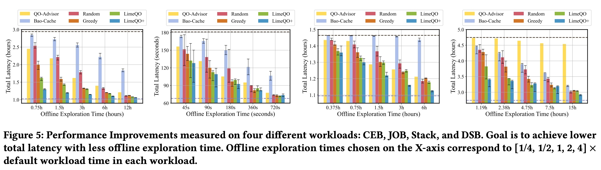

## AI论文解读 | Low Rank Learning for Offline Query Optimization
        
### 作者        
digoal        
        
### 日期        
2025-10-24        
        
### 标签        
PostgreSQL , PolarDB , DuckDB , AI , 论文解读        
        
----        
        
## 背景  
      
https://arxiv.org/pdf/2504.06399        
  
提示:          
```          
读懂《Low Rank Learning for Offline Query Optimization》这篇论文需要提前掌握哪些基础知识, 请使用中文通熟易懂的讲解这些基础知识, 可以引用论文中的图、表或使用Markdown支持的图形(text,mermaid等)增加解释性. 
  
使用中文通熟易懂的解读《Low Rank Learning for Offline Query Optimization》这篇论文, 其中的关键内容请着重讲解, 可以引用论文中的图、表或使用Markdown支持的图形(text,mermaid等)增加解释性. 
  
提取《Low Rank Learning for Offline Query Optimization》这篇论文中的重要术语, 使用中文对这些术语进行通熟易懂的讲解, 可以引用论文中的图、表或使用Markdown支持的图形(text,mermaid等)增加解释性. 
```     
  
## 1 前置知识 
  
理解这篇论文《Low Rank Learning for Offline Query Optimization》（低秩学习用于离线查询优化），你需要掌握以下几个领域的基础知识。

这篇论文的核心目标是**解决数据库查询优化的一个痛点**：传统的查询优化器（数据库的“大脑”）有时会选出很慢的执行方案（“性能回归”），而新的机器学习优化器又太复杂、训练和推理成本高 。

作者提出的LIMEQO框架 ，试图在“离线”时（比如数据库空闲时），通过“低秩学习”这种更轻量级的方法，“偷偷”地测试各种查询方案，然后把最好的方案缓存起来，供“在线”时（用户真正提交查询时）使用 。

要读懂这篇论文，你需要以下“知识拼图”：

-----

### 1\. 数据库基础：什么是查询优化 (Query Optimization)？

这是理解“问题域”的基础。

  * **什么是查询 (Query)？**
      * 你向数据库提问（例如，`SELECT * FROM users WHERE age > 20;`），这就是一个查询。
  * **什么是查询计划 (Query Plan)？**
      * 数据库执行这个查询可以有很多种“路线”。
      * *比喻：* 就像你用地图导航从A点到B点，可以走高速（快，但可能绕远），也可以穿过市区（近，但可能堵车）。
      * 数据库的“路线”就是查询计划，比如：是先过滤(filter)再连接(join)，还是先连接再过滤？是用“哈希连接(Hash Join)”还是“嵌套循环连接(Nested Loop Join)”？。
  * **什么是查询优化器 (Query Optimizer)？**
      * 优化器就是数据库内置的“导航引擎” 。它的工作是在海量的查询计划中，*估计*并*选择*一个它认为最快（成本最低）的计划去执行 。
  * **什么是“提示” (Hints)？**
      * 有时优化器“很固执”，选的路线很差。我们可以给它“提示” ，强制它“必须走高速”或“禁止走市区”。
      * 这篇论文就是利用“提示”来生成大量*不同*的查询计划（路线），然后找出最好的那个 。

你可以用这个流程图来理解（论文中 **Figure 2**  是一个更复杂的版本）：   


-----

### 2\. 核心数学概念：什么是“低秩”(Low Rank)？

这是理解“为什么该方法可行”的关键。

  * **什么是矩阵 (Matrix)？**

      * 一个二维表格。论文的 **Figure 1**  就是一个完美的例子。    
      * 这个表格的**行 (row)** 代表一个查询 (q1, q2, ...) 。
      * **列 (column)** 代表一种“提示” (h1, h2, ...)，也就是一种查询方案 。
      * 表格里的**值** 就是这个查询 (row) 用这个方案 (column) 执行的**延迟 (latency)**（花了多少时间）。

  * **什么是“秩” (Rank)？**

      * 你可以直观地理解为这个矩阵的“复杂度”或“信息量”。
      * 如果一个矩阵的*所有行*都可以通过其他几行（比如2行）的线性组合（加加减减、乘个系数）表示出来，那么这个矩阵的秩就是2。

  * **什么是“低秩” (Low Rank)？**

      * 低秩意味着这个矩阵**不复杂，有很强的内部关联性** 。
      * *比喻：* 想象一个“用户-电影评分”矩阵。用户A喜欢《战狼》、《流浪地球》、《红海行动》；用户B也喜欢这三部。我们不需要分别存储A和B的喜好，我们只需要知道：
        1.  存在一个隐藏因子，叫做“喜欢国产硬核科幻/动作片”。
        2.  A和B都具有这个“因子”。
        3.  这三部电影也都具有这个“因子”。
      * 论文的核心假设是：查询(Query)和提示(Hint)之间也存在类似的隐藏因子 。比如，某些查询都是“IO密集型”，而某些提示都是“有利于IO密集型”的。因此，这个巨大的“查询-提示-延迟”矩阵（**Figure 1**）是低秩的 。    

-----

### 3\. 核心机器学习技术 (1): 矩阵补全 (Matrix Completion)

这是理解“核心方法LIMEQO”的基础。

  * **什么是矩阵补全？**
      * **Figure 1**  中有很多“?”，代表我们*不知道*延迟（因为我们没运行过）。    
      * “矩阵补全” (Matrix Completion, MC) 就是基于“低秩”假设，利用已知的几个值（比如 `q1-h1=3ms`, `q2-h4=6ms`），来**预测所有“?”的值** 。
      * *经典例子：* Netflix推荐系统。你知道少量用户对少量电影的评分，系统就能预测出你对*所有*电影的评分。
  * **论文如何使用？**
      * LIMEQO框架把这个问题建模为一个矩阵补全问题 。
      * 它使用一种叫**ALS (Alternating Least Squares，交替最小二乘法)**  的经典算法来“补全”这个矩阵。
      * 补全后，我们就有了一个“估算的完整矩阵”（**Figure 2** 中的 "Estimated Matrix" ）。    

-----

### 4\. 核心机器学习技术 (2): 主动学习 (Active Learning)

这是理解“如何高效探索”的关键。

  * **什么是主动学习？**
      * 我们没时间去运行所有的“?”组合，那太费时了（论文说可能要10天）。
      * 我们必须*选择*最有价值的“?”去实际运行一下（获取真实延迟）。
      * 主动学习 (Active Learning) 就是一种“**如何聪明地提问**”的策略 。
  * **论文如何使用？**
      * 论文把“离线探索”建模为一个主动学习问题 。
      * 它要决定：下一个应该实际运行哪个 (查询, 提示) 组合？
      * 它提出了几种策略，比如 `GREEDY`（贪心策略：挑现在最慢的查询去优化），以及 `LIMEQO`（利用矩阵补全的*预测值*，找出“期望收益”最大的那个组合去运行）。

-----

### 5\. 核心机器学习技术 (3): 树卷积神经网络 (TCNN)

这是理解“高级版方法LIMEQO+”的基础。

  * **什么是神经网络 (NN)？**
      * 一种强大的机器学习模型，擅长学习复杂的非线性关系。
  * **什么是卷积神经网络 (CNN)？**
      * 通常用于处理图像。它通过“卷积核”（像一个小滤镜）在图像上滑动，来提取局部特征（比如边缘、角落）。
  * **什么是*树*卷积神经网络 (TCNN)？**
      * 查询计划（Query Plan）不是一个扁平的网格（像图片），它是一个**树状结构**（见 **Figure 4** 左下角 ）。    
      * TCNN是一种特殊的CNN，它的“滤镜”不是在网格上滑动，而是**在树状结构上滑动** 。
      * 这使得模型能学习到查询计划的*结构化*信息，比如“一个Hash Join下面跟着一个Scan”这种模式 。
  * **论文如何使用 (LIMEQO+)？**
      * LIMEQO+  是一个更重型、但可能更准的模型。
      * 它把TCNN提取的“计划树特征”和前面提到的“低秩因子”（Query和Hint的向量） **拼接** 在一起 ，然后丢给神经网络去预测延迟（**Figure 4** ）。

-----

### 6\. 一个统计学概念：删失观测 (Censored Observations)

这是理解“如何处理超时”的关键。

  * **问题是什么？**
      * 当“主动学习”挑了一个 (查询, 提示) 组合去运行时，如果这个组合非常非常慢（比如要跑10小时），我们不能真的等10小时 。
      * 我们会设置一个“超时时间” (Timeout)，比如，“如果1分钟内没跑完，就算了” 。
  * **数据如何记录？**
      * 如果它1分钟超时了，我们该在矩阵里填什么？填“1分钟”吗？
      * 论文说：**不能！** 如果填“1分钟”，模型会以为这是个很快的计划。但事实是，它的真实时间可能是1分钟、10分钟或10小时。
  * **什么是“删失观测”？**
      * 这是一种统计学技术，专门用来处理这种“我知道它没跑完，但我不知道它到底要跑多久”的数据 。
      * 我们记录的不是 `t = 1`，而是 `t > 1`（真实时间大于1分钟）。
      * 论文的贡献之一，就是把这种“删失”技术应用到了ALS算法  和 TCNN的损失函数  中，让模型能正确处理这种“大于1分钟”的信息。

### 总结

要读懂这篇论文，你需要：

1.  **数据库知识（目标）：** 知道什么是查询计划、优化器和Hints。
2.  **线性代数（核心假设）：** 理解什么是矩阵，以及“低秩”代表的“数据有内在结构”。
3.  **机器学习（核心方法）：**
      * **矩阵补全 (MC)：** 知道如何“猜”出矩阵里的“?”。
      * **主动学习 (AL)：** 知道如何“聪明地”选择下一个要观测的“?”。
      * **神经网络 (TCNN)：** 知道如何从“树结构”数据中提取特征。
      * **删失观测（细节）：** 知道如何处理“超时”这种不完整的数据。
  
## 2 解读论文 
  
这是一篇关于数据库查询优化的重要论文。简单来说，它提出了一种名为 **LIMEQO**  的新框架，旨在解决一个经典难题：如何在不让数据库查询性能“开倒车”（即性能回归）的前提下，智能地、低成本地找到更优的查询执行方案。

以下是对这篇论文的通俗易懂的解读，重点讲解其关键内容。

### 1\. 论文想解决什么问题？（背景）

想象一下你每天都在使用一个大型数据库，比如电商后台、数据看板等。

1.  **查询优化器 (Optimizer) 很重要**：数据库的“大脑”（查询优化器）负责决定如何执行你提交的SQL查询。就像地图导航，它会估算一条最快的“路线”（查询计划）。
2.  **“大脑”会犯错**：有时，这个“大脑”会选错路，导致一个查询突然变得巨慢。这被称为“性能回归” (performance regressions) 。
3.  **机器学习 (ML) 方案的困境**：近年的研究尝试用深度学习等昂贵的神经网络  来*替换*或*辅助*这个“大脑”。但这些方法训练和推理成本极高 ，而且还是可能犯错。
4.  **“离线验证”方案的局限**：为了保证“绝不犯错”（no-regressions guarantee），一些系统（如 AutoSteer, QO-Advisor ）采用了“离线执行”的策略：即在数据库空闲时，偷偷地去跑各种可能的查询方案，如果发现一个新方案确实比默认的快，就把它存起来备用 。
5.  **本文的切入点**：上面第4种方法虽然稳妥，但**效率低下**。它们“探索”新方案的方式很盲目，比如随机尝试，或者干脆把所有可能的方案都试一遍 。

**LIMEQO 的目标**：在“离线验证”这个稳妥的框架下，引入一种**智能的、低成本的探索策略**，从而能“又快又好”地找到最优的查询方案 。

-----

### 2\. 核心思想：工作负载矩阵（Workload Matrix）

这是论文最核心的建模思想。作者巧妙地把“找最优方案”这个问题，转化成了一个“**填表格**”的问题。

  * **建模**：LIMEQO 把整个工作负载（即你数据库里所有重复执行的查询）建成一个大矩阵（一个二维表格） 。
  * **行 (Row)**：代表一个查询（Query），比如 $q_1, q_2, \ldots$ 。
  * **列 (Column)**：代表一种优化器“提示”（Hint），比如 $h_1, h_2, \ldots$ 。 (你可以把“提示”理解为一种强制优化器使用或禁用某个策略，如“禁用哈希连接”)。
  * **值 (Value)**：代表 $q_i$ 查询使用 $h_j$ 提示（方案）时的**执行延迟（时间）** 。

这个矩阵就像论文中的 **Figure 1** 所示 ：    


**关键假设：这个矩阵是“低秩” (Low-Rank) 的 。**

  * **什么是低秩？** 通俗地说，就是这个表格里有大量“冗余”信息。
  * **类比**：这和“推荐系统”（比如猜你喜欢）非常相似。
      * 在推荐系统中，“用户-电影”矩阵是低秩的，因为用户的喜好（比如“喜欢科幻片”）和电影的类型（比如“属于科幻片”）是潜在的关联因素。
      * 在这篇论文里，查询的特性（比如“IO密集型”）和提示的效果（比如“对IO密集型友好”）也是潜在的关联因素 。
  * **好处**：既然矩阵是低秩的，我们**不需要**知道所有格子的真实值。我们只需要观测一小部分值（比如上图中的已知延迟），就可以**预测**出所有“?”格子的值 。

-----

### 3\. 关键方法 1：LIMEQO (轻量级线性方法)

LIMEQO 使用“矩阵补全” (Matrix Completion)  技术来预测那些“?”的值。

  * **方法**：论文使用了一种经典的线性代数方法，称为**交替最小二乘法 (ALS)** 。
  * **过程 (见 Figure 3)**：它把这个 $n \times k$ 的大矩阵 $W$ ，分解（近似）为两个更小的“因子”矩阵 $Q$ ( $n \times r$ ) 和 $H$ ( $k \times r$ ) 。     
      * $Q$ 的每一行可以被看作一个“查询向量”（Query Vector），代表了该查询的隐藏特性 。
      * $H$ 的每一行（在论文中是 $H^T$ 的列）被看作一个“提示向量”（Hint Vector），代表了该提示的隐藏特性 。
      * 预测 $W_{ij}$ (查询 $i$ 用提示 $j$ 的延迟)，只需要计算 $Q_i$ 和 $H_j$ 的点积 。
  * **最大优势**：这种方法是**纯线性**的 ，计算开销极低。实验表明，LIMEQO 的计算开销（Overhead）比神经网络方法低 **360 倍**  (见 **Figure 7** )。    

-----

### 4\. 关键方法 2：智能探索 (Active Learning)

现在我们能“预测”所有“?”的值了，但这些预测不一定准。我们还是需要去“离线执行”一些查询来获取真实数据，以便让我们的预测模型越来越准。

**问题**：我们应该优先执行哪一个“?”（即哪个 Query-Hint 组合）呢？

  * **盲目策略 (Baseline)**：
      * `RANDOM`：随机选 。
      * `GREEDY`：选择当前运行最慢的查询 ，认为它优化的潜力最大 。
  * **LIMEQO 的策略 (Algorithm 1)**：    
    1.  使用矩阵补全（ALS）估算出一个“完整”的预测矩阵 $\hat{W}$ 。
    2.  对每一行（ 每个查询 $q_i$ ），计算一个“**预期收益率**” (Expected Improvement Ratio) 。
    3.  这个收益率的公式 (Equation 6) 大致是：    
        $r_i = (当前已知的最好延迟 - 模型预测的最好延迟) / (模型预测的最好延迟)$ 。
    4.  $r_i$ 越大，说明模型认为这个查询 $q_i$ 隐藏着一个“超级好”的方案，值得我们马上去“离线执行”一下来验证 。
    5.  LIMEQO 把这个过程建模为一个“**主动学习**” (Active Learning) 问题 ，即模型主动选择它最需要的数据点（最有价值的“?”）去观测。

-----

### 5\. 关键方法 3：LIMEQO+ (重量级神经网络)

论文还提供了一个“豪华版”方案，叫 LIMEQO+ 。

  * **动机**：线性方法（LIMEQO）虽然快，但可能不够准。神经网络（NN）更强大，但开销大 。
  * **方法 (Transductive TCNN)**：LIMEQO+ 把“低秩学习”和“神经网络”结合了起来 。
  * **见 Figure 4**：LIMEQO+ 的模型输入**不仅**包括低秩的 $Q$ 和 $H$ 向量（和 LIMEQO 一样），**还包括**查询计划（Query Plan）本身的**树状结构**特征 。    
  * **TCNN (树卷积神经网络)**：它使用 TCNN  来从查询计划的“树”结构中提取特征 ，这是线性方法无法做到的。
  * **效果**：LIMEQO+ 通常能更快地收敛到最优解（即用更少的探索时间达到同样的效果）。例如，在 CEB 基准测试中，LIMEQO+ 只用 0.5 小时探索就达到了 50% 的性能提升，而 LIMEQO 需要 1.5 小时  (见 **Figure 5** )。     

-----

### 6\. 关键挑战：如何处理“超时” (Timeouts)

这是论文中一个非常重要且实用的技术点。

  * **问题**：当“主动学习”策略让我们去测试一个“?”时，万一这个方案巨慢（比如要跑 10 小时），我们不能真的等 10 小时 。我们会设置一个“超时” ，比如：如果这个方案比*当前已知*的最优方案 $x$ 还要慢，我们就直接掐掉 (Timeout) 它 。
  * **传统做法的错误**：如果一个方案在 $x=5$ 秒时超时了，就在矩阵里记录 5 秒。这是**错误**的 ，因为它会“误导”模型，让模型以为这个方案的延迟 *就是* 5 秒（也许它真实延迟是 500 秒）。
  * **论文的解决方案：“删失观测” (Censored Observations)** 。
      * 这是一种统计学技巧 。
      * 当一个方案在 5 秒超时时，我们不告诉模型“延迟 = 5”，而是告诉模型“**延迟 \> 5**” 。
      * 模型（无论是 ALS 还是 TCNN）在训练时，会特殊处理这个信息：
          * 如果模型预测它是 3 秒（ 即 $<5$ ），模型会受到“惩罚” 。
          * 如果模型预测它是 6 秒（ 即 $>5$ ），模型不会受到惩罚，因为这个预测是合理的 。
  * **效果**：这个“删失”技术非常有效，它帮助模型更快地收敛（见 Figure 16），避免了被“超时”数据误导 。    

-----

### 7\. 实验结果与结论

论文通过大量实验证明了其有效性：

1.  **性能 (Figure 5, 6)**：LIMEQO 和 LIMEQO+ 在所有四个工作负载（JOB, CEB, Stack, DSB）上 ，都比 `RANDOM`（随机）、`GREEDY`（贪心）和 `QO-ADVISOR`（先前技术）收敛得更快，能在更短的离线探索时间内，显著降低总的工作负载延迟 。      
2.  **开销 (Figure 7)**：LIMEQO（线性方法）的计算开销极低，比 LIMEQO+（神经网络）低 360 倍 ，使其非常实用。   
3.  **鲁棒性 (Figure 9, 11)**：  
      * **工作负载迁移 (Workload Shift)**：当有新查询加入时（见 Figure 9），LIMEQO 能很快适应，并帮助新查询找到最优方案，比 `GREEDY` 策略快得多 。     
      * **数据迁移 (Data Shift)**：当底层数据发生变化时（见 Figure 11），LIMEQO 也能迅速“恢复”，重新找到在新数据下的最优方案 。    
4.  **低秩假设成立 (Figure 14)**：通过“奇异值分解”(SVD) 分析，论文证实了真实世界的“工作负载矩阵”确实具有“低秩”结构（奇异值下降很快），而随机矩阵则没有 。这为整个方法提供了理论依据。   

### 总结

LIMEQO 框架是一个巧妙、实用且低开销的数据库优化方案。它抓住“工作负载矩阵低秩”这一核心特性，**将昂贵的查询优化问题，转化为一个廉价的、类似推荐系统的“矩阵补全”问题**，并通过“主动学习”和“删失观测”等技术，实现了在保证“无回归”的前提下，高效地自动探索和应用更优的查询计划。
  
## 3 术语 
  
以下是对《Low Rank Learning for Offline Query Optimization》这篇论文中关键术语的提取和通俗讲解。

-----

### 1\. 核心问题与框架

#### Offline Query Optimization (离线查询优化) 

  * **通俗讲解**：这是一种“错峰”优化数据库查询的方法。它不是在用户提交查询时（“在线”）才匆忙决定怎么跑，而是在数据库比较空闲的时候（“离线”） ，提前去测试各种可能的执行方案（Query Plan）。LIMEQO 就是一个离线查询优化的框架 。
  * **系统流程 (见 Figure 2 )**：    
      * **在线路径 (Online path)**：用户提交查询，系统从“工作负载矩阵”（见下文）中查找已验证的“最佳方案”并执行，保证速度快 。
      * **离线路径 (Offline path)**：系统空闲时，LIMEQO 会“智能地”挑选它认为有潜力的“未知方案”去执行和测量 ，并把新发现的最优结果更新回去 。

#### No-regressions guarantee (无回归保证)

  * **通俗讲解**：这是一个非常重要的承诺，意思是“保证性能绝不会变得更糟” 。传统查询优化器有时会“犯傻”，导致“昨天还很快的查询，今天突然变得巨慢” 。LIMEQO 通过离线验证，确保只采用那些*实测*比默认方案更快的计划，从而杜绝了这种性能“开倒车”的情况 。

#### Hints (提示)

  * **通俗讲解**：这是一种用来“指导”或“驾驶”(steering) 传统查询优化器的接口 。你可以把它想象成给导航地图APP的“强制指令”，比如“必须走高速”或“禁止走某条路”。通过给优化器不同的提示（例如，启用或禁用某种连接算法 ），就可以迫使它生成不同的查询执行计划 。

#### Workload (工作负载)

  * **通俗讲解**：指数据库需要**重复**执行的一组查询 。这篇论文主要针对的就是这种重复性任务，例如用于更新实时仪表盘或生成报告的查询 。

-----

### 2\. 核心建模：LIMEQO

#### Workload Matrix (工作负载矩阵)

  * **通俗讲解**：这是论文最核心的建模工具 。它是一个二维表格（矩阵），其中：

      * **行 (Row)**：代表一个查询 (Query) 。
      * **列 (Column)**：代表一种提示 (Hint) 。
      * **表格中的值**：代表使用“列”对应的提示来执行“行”对应的查询所花费的**延迟 (Latency)**（即时间） 。

  * **示意图 (基于 Figure 1 )**：    

    ```mermaid
    graph TD
        subgraph "工作负载矩阵 (W)"
            direction TB
            q1["查询 q1"] -- "h1: 3ms " --> h1["提示 h1"]
            q1 -- "h2: 4ms " --> h2["提示 h2"]
            q1 -- "hk: ? (未知) " --> hk["提示 hk"]
            
            q2["查询 q2"] -- "h1: 9ms " --> h1
            q2 -- "h2: ? (未知) " --> h2
            q2 -- "hk: 6ms " --> hk
            
            q3["查询 q3"] -- "h1: ? (未知) " --> h1
            q3 -- "h2: 15ms " --> h2
            q3 -- "hk: 3ms " --> hk
        end
    ```

    我们的目标就是以最小的代价，找到每一行（每个查询）的最小值（最快的提示）。

#### Low-Rank (低秩)

  * **通俗讲解**：这是对“工作负载矩阵”的一个关键假设。它意味着这个矩阵虽然看起来很大，但内部结构简单，信息是“冗余”的 。
  * **类比**：这就像一个“用户-电影评分”矩阵。某些用户（比如“科幻迷”）的评分倾向是相似的；某些电影（比如“科幻片”）被评分的模式也是相似的。在这篇论文里，某些查询（比如“IO密集型查询”）对某些提示（比如“启用索引扫描”）的“反应”也是相似的 。
  * **意义**：因为矩阵是低秩的，我们不需要知道表格里所有“?”的值。

#### Matrix Completion (MC) (矩阵补全)

  * **通俗讲解**：由于执行所有的（查询, 提示）组合代价太高（可能要花10天以上），工作负载矩阵大部分是未知的（即充满了“?”）。矩阵补全 (MC) 是一种技术，它利用矩阵的“低秩”特性 ，根据已知的少量延迟值，来*预测*所有未知条目的值 。
  * **算法**：论文中主要使用了 **Alternating Least Squares (ALS) (交替最小二乘法)**  这种纯线性方法来实现矩阵补全 。

-----

### 3\. 核心策略与技术

#### Active Learning (主动学习)

  * **通俗讲解**：有了矩阵补全的“预测”，我们还是需要去离线执行一些查询来获取“真实数据”。但是我们不能盲目地选，那样效率太低 。主动学习是一种策略，它能“智能地”选择下一步该观测哪个（查询, 提示）组合 。
  * **目标**：花最小的探索成本（即离线执行时间），获得最大的性能提升（即找到更优的方案）。LIMEQO 框架会优先选择那些“预期收益”最大的（查询, 提示）组合去执行 。

#### Censored Observations (删失观测) / Timeouts (超时)

  * **通俗讲解**：这是一个处理“慢查询”的巧妙技术。当离线探索一个新方案时，如果它的执行时间超过了*当前已知*的最优时间 $x$ （比如 $x=2$ 分钟），我们就没必要等它跑完（它可能要跑10小时），直接“掐掉”(Timeout) 它 。
  * **关键点**：这时，我们不能在矩阵里记录 $x=2$ 分钟，因为这会“误导”模型，让模型以为这个方案很快 。我们记录的是一个“删失观测”值，即我们只知道真实延迟 $T > 2$ 分钟，但不知道 $T$ 到底是多少 。论文将这种技术应用到了其机器学习模型中（包括 ALS 和 TCNN），让模型能正确处理这种“ 大于 $x$ ”的信息 。

#### Transductive TCNN (传导式树卷积神经网络)

  * **通俗讲解**：这是论文提出的更强大、更昂贵的模型 (LIMEQO+) 。
  * **TCNN (树卷积神经网络)**：是一种专门处理“树状结构”数据的神经网络 。查询计划（Query Plan）本身就是一棵树（见 Figure 4 左下角）。TCNN 能从这棵树的结构中学习特征 。    
  * **Transductive (传导式)**：这个词的意思是，模型在学习时利用了工作负载矩阵的*整体结构*（即低秩特性）。它不仅仅是看单个查询计划（像传统 TCNN 那样），而是将计划的树特征与代表“查询”和“提示”的低秩向量 (Q 和 H) 结合起来 。简单说，它既学习了计划的“微观”结构，也学习了工作负载的“宏观”模式。
  
## 参考        
         
https://arxiv.org/pdf/2504.06399  
  
https://rmarcus.info/blog/      
        
<b> 以上内容基于DeepSeek、Qwen、Gemini及诸多AI生成, 轻微人工调整, 感谢杭州深度求索人工智能、阿里云、Google等公司. </b>        
        
<b> AI 生成的内容请自行辨别正确性, 当然也多了些许踩坑的乐趣, 毕竟冒险是每个男人的天性.  </b>        
    
#### [期望 PostgreSQL|开源PolarDB 增加什么功能?](https://github.com/digoal/blog/issues/76 "269ac3d1c492e938c0191101c7238216")
  
  
#### [PolarDB 开源数据库](https://openpolardb.com/home "57258f76c37864c6e6d23383d05714ea")
  
  
#### [PolarDB 学习图谱](https://www.aliyun.com/database/openpolardb/activity "8642f60e04ed0c814bf9cb9677976bd4")
  
  
#### [PostgreSQL 解决方案集合](../201706/20170601_02.md "40cff096e9ed7122c512b35d8561d9c8")
  
  
#### [德哥 / digoal's Github - 公益是一辈子的事.](https://github.com/digoal/blog/blob/master/README.md "22709685feb7cab07d30f30387f0a9ae")
  
  
#### [About 德哥](https://github.com/digoal/blog/blob/master/me/readme.md "a37735981e7704886ffd590565582dd0")
  
  

  
