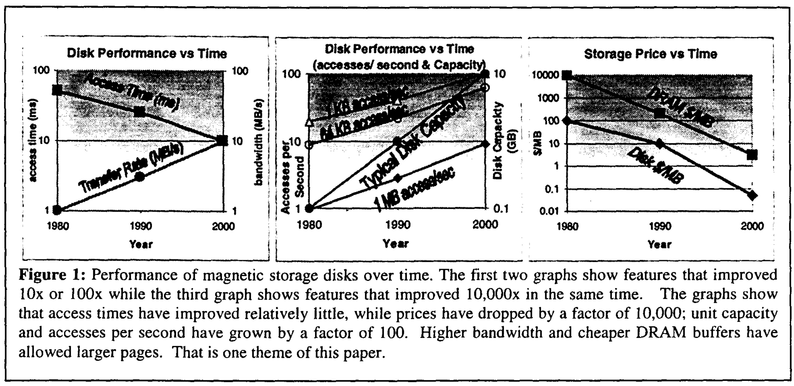
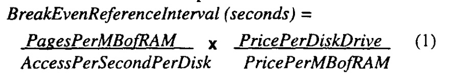
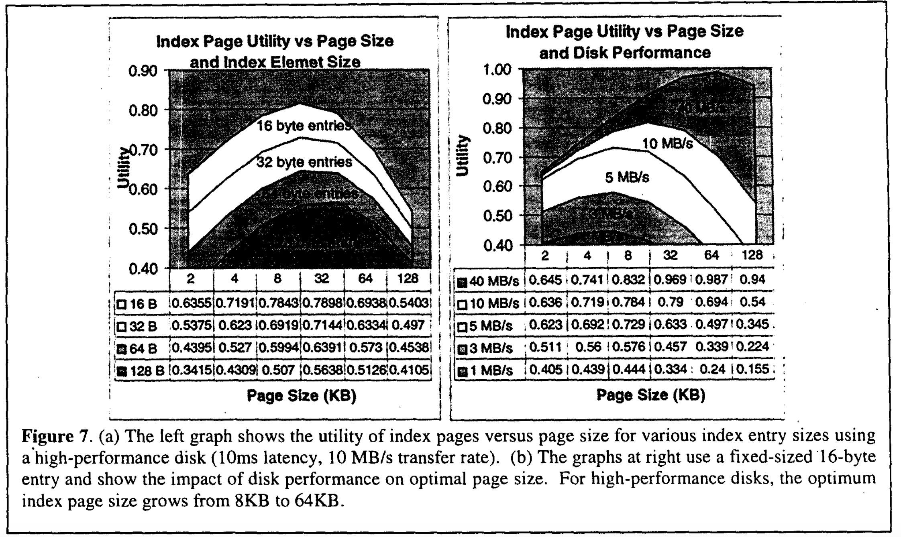
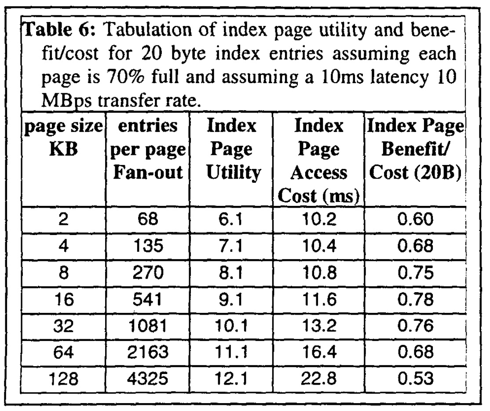
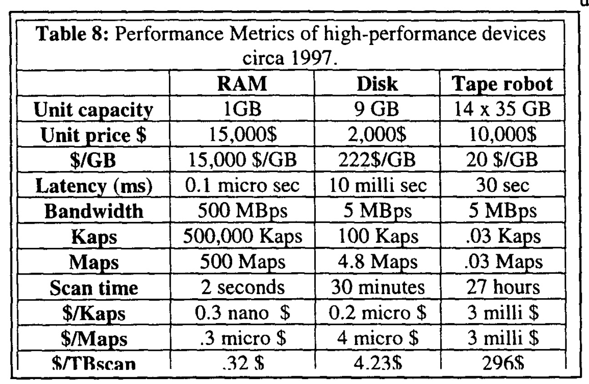
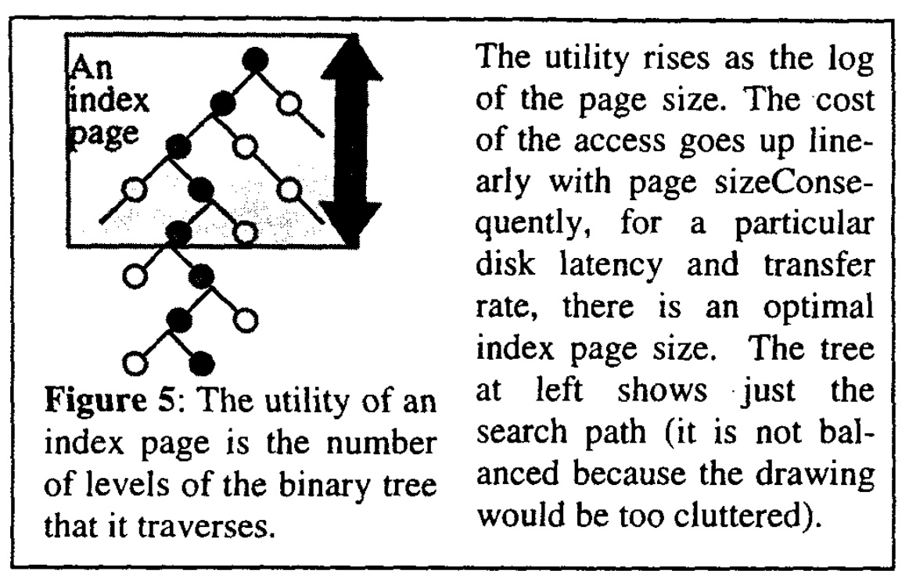

## AI论文解读 | The Five-Minute Rule Ten Years Later, and Other Computer Storage Rules of Thumb 
        
### 作者        
digoal        
        
### 日期        
2025-10-24        
        
### 标签        
PostgreSQL , PolarDB , DuckDB , AI , 论文解读        
        
----        
        
## 背景  
      
https://dl.acm.org/doi/pdf/10.1145/271074.271094        
  
提示:          
```          
读懂《The Five-Minute Rule Ten Years Later, and Other Computer Storage Rules of Thumb 》这篇论文需要提前掌握哪些基础知识, 请使用中文通熟易懂的讲解这些基础知识, 可以引用论文中的图、表或使用Markdown支持的图形(text,mermaid等)增加解释性. 
  
使用中文通熟易懂的解读《The Five-Minute Rule Ten Years Later, and Other Computer Storage Rules of Thumb 》这篇论文, 其中的关键内容请着重讲解, 可以引用论文中的图、表或使用Markdown支持的图形(text,mermaid等)增加解释性. 
  
提取《The Five-Minute Rule Ten Years Later, and Other Computer Storage Rules of Thumb 》这篇论文中的重要术语, 使用中文对这些术语进行通熟易懂的讲解, 可以引用论文中的图、表或使用Markdown支持的图形(text,mermaid等)增加解释性. 
```     
  
## 1 前置知识 
  
要读懂这篇经典的论文《The Five-Minute Rule Ten Years Later...》，你需要对计算机系统，特别是存储和数据库有一些基础的了解。这篇论文本质上是在**算一笔经济账**：在计算机系统中，我们应该花多少钱（成本）来换取多快的速度（性能）。

以下是理解这篇论文所需的核心基础知识，我会用通俗的语言来解释：

### 1\. 基础知识一：计算机的“存储金字塔”

想象一下你的办公桌：

  * **大脑/手边（CPU缓存）** ：反应最快，但你记不住太多东西。
  * **桌面（RAM/内存）** ：伸手就能拿到，速度很快，但桌面空间有限且昂贵。
  * **抽屉（Disk/磁盘）** ：容量大得多，也便宜，但每次拿东西都得“拉开抽屉”，比在桌面上拿要慢得多。
  * **档案室（Tape/磁带）** ：容量巨大且极便宜，但找一份文件可能要花几十分钟甚至更久。

计算机的存储结构就是这样一个金字塔：

```text
      / \
     /CPU\  <-- 最快, 最贵, 容量最小
    /_____\
   / RAM \  <-- 很快, 较贵, 容量中等 (论文中常说的内存 )
  /_______\
 /  Disk \  <-- 慢, 便宜, 容量大 (论文中常说的磁盘 )
/_________\
/   Tape  \ <-- 最慢, 最便宜, 容量巨大 (论文中提到的磁带 )
\_________/
```

这篇论文的核心，就是在**权衡“桌面 (RAM)”和“抽屉 (Disk)”** 。

### 2\. 基础知识二：磁盘 (Disk) 的关键性能指标

论文中的第一组图 (Figure 1)  展示的就是磁盘性能的变化。你需要理解两个关键指标：    

  * **访问时间 (Access Time / Latency)**： 这就像你“拉开抽屉并找到文件”所花的时间。无论文件多大，这个“启动时间”省不了。从1980年到2000年，这个时间**改善得不多**（从几十毫秒降到10毫秒左右）。
  * **传输速率 (Transfer Rate / Bandwidth)**： 这就像你“复印文件”的速度。一旦找到了文件，你复印得越快，这个速率就越高。这个速率**提升得非常快** 。

### 3\. 基础知识三：什么是“缓存” (Cache) 和“页” (Page)？

  * **页 (Page)**：操作系统和数据库不一个字节一个字节地从磁盘读数据，太慢了。它们通常一次性读取一个“数据块”，这个“块”就叫“页” (Page) 。
  * **缓存 (Caching)**： 这就是论文的核心行为了。当你从磁盘（抽屉）里读出一个数据页时，你可以顺手把它**放在内存（桌面）上** 。
      * **好处**：下次再用它时，直接从内存拿，速度极快。
      * **坏处**：占用了宝贵的内存空间（桌面空间）。

### 4\. 核心权衡：“五分钟法则”的由来

这篇论文就是在回答一个问题：**把一个数据页放在内存（桌面）上多久才算“划算”？** 

它的计算逻辑是这样的 ：

  * **成本 (Cost)**：让这个数据页“租用”内存空间的成本（ 即内存的价格 $\$/MB$ ）。
  * **收益 (Benefit)**：因为数据在内存里，我们省下了“去磁盘取”的成本（ 即磁盘访问的成本 $\$/access$ ）。

**“五分钟法则”**  就是这个成本和收益的“盈亏平衡点” 。论文通过计算（公式1）得出：    

> **如果一个数据页平均每五分钟会被访问一次，那么把它“钉”在内存里（缓存它）就是划算的 。如果它好几个小时才被访问一次，那用完就丢掉，下次再从磁盘读更省钱。**

### 5\. 基础知识四：两种数据访问模式

为什么论文后来又提了个“一分钟法则” ？因为访问数据的方式不同，成本也不同。

  * **随机访问 (Random Access)**： 想象一下，你要在1000个不同抽屉里各取一份A4纸。你主要的时都花在“开/关抽屉”（即磁盘的“访问时间”）上了。这是数据库查找索引时的典型模式。“五分钟法则”主要针对这种场景 。
  * **顺序访问 (Sequential Access)**： 想象一下，你要从1个抽屉里拿出全部1000份文件。你只“打开”了一次抽屉，接下来就是疯狂“复印”（即磁盘的“传输速率”）。这种模式下，磁盘访问的效率**高得多** 。

对于“顺序访问”（比如排序、数据分析等），因为磁盘效率很高（成本更低），所以我们对内存的“租金”就更敏感。论文因此提出了 **“一分钟顺序法则” (One-Minute Sequential Rule)** ：对于顺序访问的数据，如果一分钟内会再次用到它，才值得缓存 。

### 6\. (可选) 基础知识五：数据库索引 (Index)

论文的后半部分讨论了索引页应该多大 。

  * **什么是索引 (Index)**：就像书的目录，它能帮你快速定位数据，而不用翻遍整本书（全表扫描）。
  * **索引页 (Index Page)**：索引本身也很大，也存在磁盘上，也是按“页”来组织的 。
  * **权衡**：
      * 如果索引页很**小**（比如 2KB）：你一次读一页很快，但一个目录（页）上记的条目（“fan-out”，扇出）很少 。你可能要读好几次目录（好几层）才能找到数据。
      * 如果索引页很**大**（比如 128KB）：你一次读一页很慢（因为要传输的数据多），但一个目录上记的条目非常多 。你可能读一次目录就找到数据了。

论文通过计算（见 Figure 7  和 Table 6 ），试图找到一个“性价比”最高的页大小，结论是 8KB 到 32KB 在当时是比较理想的 。      

-----

### 总结

要读懂这篇论文，你不需要是是硬件专家或数学家，但你需要具备**系统和经济学的思维**。

你需要掌握的基础知识是：

1.  **存储金字塔**：知道 RAM（内存）快而贵，Disk（磁盘）慢而便宜 。
2.  **性能指标**：理解“访问时间”（启动成本）和“传输速率”（复印成本）的区别 。
3.  **缓存**：明白“把数据放在内存”是一种用昂贵的“空间”换取“时间”的手段 。
4.  **访问模式**：知道“随机访问”和“顺序访问”对磁盘的压力完全不同 。

有了这些知识，你就能明白这篇论文是如何通过计算价格和性能的比例，来推导出系统设计中的“经验法则” (Rules of Thumb)  的。
  
## 2 解读论文 
  
这是一篇在计算机系统和数据库领域非常经典的论文。它的核心思想是：**我们应该用多少“昂贵但快”的资源（比如内存/RAM），来换取“便宜但慢”的资源（比如磁盘/Disk）的性能提升**。

这篇论文本质上是在**算一笔经济账** 。它通过计算成本和收益的平衡点，为系统设计者提供了一些简单易行的“经验法则” (Rules of Thumb)。

以下是对这篇论文关键内容的通俗解读：

### 核心一：“五分钟法则”十年后依然有效

这是论文最重要的结论。

  * **什么是“五分钟法则”？**

      * 它最早在1986年被提出 。
      * **法则内容：** 如果数据库中的一个数据页（Page，可以理解为一小块数据），平均每隔“五分钟”就会被再次访问，那么就应该让它常驻在内存 (RAM) 中，而不是每次都从磁盘 (Disk) 去读取 。
      * **背后的经济账：**
        1.  **成本：** 把数据页放在内存里，需要支付昂贵的“内存租金” ( $\$/\text{MB}$ ) 。
        2.  **收益：** 避免了一次昂贵的磁盘访问 ( $\$/\text{access}$ ) 。
      * 当“节省的磁盘访问成本”等于“支付的内存租金”时，我们就找到了盈亏平衡点 。在1986年，这个平衡点大约是100秒，作者们预计它会增长到五分钟 。

  * **为什么十年后 (1997年) 还要讨论？**

      * 因为技术发生了巨大变化！论文中的 **Figure 1**（见下图）展示了这种惊人的变化：    

      * **解读 Figure 1：**
          * **左图 (Disk Performance vs Time)：** 磁盘“传输速率” (Transfer Rate) 提升了100倍，但“访问时间” (Access Time) 改善很少，只快了几倍 。
          * **中图 (Disk Performance vs Time)：** 磁盘容量 (Capacity) 和每秒访问次数 (Accesses per Second) 提升了100倍 。
          * **右图 (Storage Price vs Time)：** 价格下降最疯狂。磁盘价格 ( $\$/MB$ ) 下降了**10,000倍**！。

  * **为什么法则依然有效？**

      * 你可能会想，既然内存和磁盘都便宜了这么多，这个法则肯定过时了。
      * **关键在于“比率”！** 论文的公式 (1) 告诉我们，这个平衡点取决于两个关键比率 ：    
        1.  **技术比率 (Technology Ratio):** $\frac{\text{每MB内存的页数}}{\text{每秒磁盘访问次数}}$
        2.  **经济比率 (Economic Ratio):** $\frac{\text{每块磁盘的价格}}{\text{每MB内存的价格}}$
      * 作者发现，在这十年间：
          * 内存价格下降的速度 (200x) 远快于磁盘价格 (10x)，导致“经济比率”增大了10倍 。
          * 同时，由于数据库的页变大了 (从512字节到8KB)，而磁盘访问速度提升，导致“技术比率”减小了10倍 。
      * **一个增大了10倍，一个减小了10倍，两者相乘，结果（盈亏平衡点）几乎没变！** 。
      * 1997年的计算结果是 266 秒，这仍然是“大约五分钟” 。因此，**五分钟法则在十年后依然适用于随机访问的页面** 。

-----

### 核心二：针对顺序访问的“一分钟法则”

  * **场景不同：** “五分钟法则”针对的是**随机访问**（比如查索引，在磁盘上东跳一下、西跳一下）。但很多操作（如排序、数据分析）是**顺序访问**（像磁带一样从头读到尾） 。
  * **性能不同：** 顺序访问能充分利用磁盘的“高传输速率”，效率远高于随机访问 。
  * **法则不同：** 因为顺序访问的磁盘效率更高（即“收益”更低），所以我们“租用”内存的意愿就更低。
  * **新法则：** 论文计算得出，对于顺序访问，盈亏平衡点大约是 52 秒 。
  * **结论：** 由此得出 **“一分钟顺序法则” (One-Minute Sequential Rule)** ：对于顺序操作（如排序、哈希连接），如果数据在一分钟内会被重新访问，才应该缓存它 。

-----

### 核心三：索引页应该多大？

  * **背景：** 数据库索引（就像书的目录）也是按“页”存储的。页越大，一次I/O读的数据越多，但读的时间也越长。页太小，则可能要读很多次才能找到数据。

  * **核心权衡：** 这是一个“成本 vs 收益”的权衡。

      * **收益 (Utility):** 这一页能帮你“跳”过多少层搜索。它与“页上能放多少条目”的对数 (log) 成正比 。收益增长是**缓慢的**。
      * **成本 (Cost):** 读这一页的时间 = 磁盘延迟 (固定) + $\frac{\text{页面大小}}{\text{传输速率}}$ 。成本随页面大小**线性增长** 。

  * **图解权衡 (基于 Table 6 和 Figure 7)：**       

    ```text
    页面大小  |  收益 (Utility)   |  成本 (Access Cost)  |  性价比 (Benefit/Cost)
    ---------------------------------------------------------------------------------
    2 KB      |  6.1 (低)         |  10.2 ms (低)       |  0.60 (一般)
    4 KB      |  7.1 (稍高)       |  10.4 ms (低)       |  0.68 (提高)
    8 KB      |  8.1 (中)         |  10.8 ms (中)       |  0.75 (高)
    16 KB     |  9.1 (高)         |  11.6 ms (中)       |  0.78 (最高) 
    32 KB     |  10.1 (高)        |  13.2 ms (稍高)     |  0.76 (开始下降)
    64 KB     |  11.1 (很高)      |  16.4 ms (高)       |  0.68 (下降)
    128 KB    |  12.1 (最高)      |  22.8 ms (非常高)   |  0.53 (很低)
    ```

  * **结论：**

      * 页太小（2KB），“收益”太低，不划算 。
      * 页太大（128KB），“收益”增长缓慢，但“成本”（传输时间）增长太快，也不划算 。
      * 在1997年的技术下，**8KB 到 32KB 是索引页的最佳大小**，性价比最高 。

-----

### 核心四：我们需要新的存储性能指标

  * **旧指标的问题：** 传统上，我们用“容量 (GB)”和“价格 ( $\$/GB$ )”来衡量存储 。

  * **新趋势：** 论文指出，磁盘和磁带的容量正趋近于“无限”，而 $\$/GB$ 正趋近于 0 。

  * **新瓶颈：** 当容量和价格不再是问题时， **“访问成本” ( $\$/\text{access}$ )** 成为了新的瓶颈和衡量标准 。

  * **新指标：** 论文提出了几个新的性能指标 ：

      * **Kaps (Kilo-accesses per second):** 每秒千字节的访问次数 。
      * **Maps (Mega-accesses per second):** 每秒兆字节的访问次数 。
      * **Scan:** 扫描（读取）整个设备需要多长时间 。
      * 以及它们对应的成本：**$\$/Kaps$ , $\$/Maps$ , $\$/TBscan$** 。

  * **Table 8 (见下表)** 直观地展示了 RAM、Disk 和磁带 (Tape) 在这些新指标下的巨大差异：    

| 指标 | RAM (内存) | Disk (磁盘) | Tape robot (磁带库) |
| :--- | :--- | :--- | :--- |
| **Kaps** (每秒千字节访问) | 500,000 | 100 | 0.03 (极低) |
| **Maps** (每秒兆字节访问) | 500 | 4.8 | 0.03 (极低) |
| **Scan time** (扫描全盘) | 2 秒 | 30 分钟 | 27 小时 |
| **$\$/Kaps** (每次访问成本) | 0.3 纳秒\$ | 0.2 微秒\$ | 3 毫秒\$ (极贵) |
| **$$/TBscan** (扫描1TB成本) | 32 $ | 4.23 $ (最便宜) | 296 $ |

  * **解读 Table 8 ：**
      * **RAM：** 访问性能极高 (Kaps/Maps)，但扫描成本 ( $\$/TBscan$ ) 最贵。
      * **Disk：** 随机访问性能尚可 (Kaps)，扫描成本最低。
      * **Tape：** 容量巨大，但访问成本 ( $\$/Kaps$ ) 极其昂贵，扫描时间极长 (27小时)。

### 总结

这篇论文的伟大之处在于，它没有纠结于具体的技术参数，而是抓住了一切系统设计背后的**经济学本质**。它教会我们，技术虽然在飞速变化，但只要抓住关键的 **“成本/收益比率”** ，就能推导出指导系统设计的、相对稳定的“经验法则”。
  
## 3 术语 
  
根据这篇论文，以下是理解其核心思想所必须掌握的重要术语及其通俗讲解：

### 1\. 五分钟法则 (The Five-Minute Rule)

  * **通俗讲解：**
    这是一个“经验法则”，用来帮你决定：**一个数据块（页）是应该留在昂贵的内存 (RAM) 里，还是用完就扔掉，下次再从便宜的磁盘 (Disk) 去读？** 

    法则的结论是（在1997年）：如果一个数据页平均**每五分钟**就会被（随机）访问一次，那么把它一直“钉”在内存里就是划算的 。如果它好几个小时才被访问一次，那每次都从磁盘读反而更省钱。

  * **为什么是“五分钟”？**

      * 这背后是一笔经济账 。它计算的是一个“盈亏平衡点” 。
      * 在这个点上， **“为这个数据页支付的内存租金（成本）”** 正好等于 **“因数据在内存而节省的磁盘访问开销（收益）”** 。
      * 在1997年，作者们使用当时的内存价格和磁盘性能参数，计算出这个平衡点大约是 266 秒，接近五分钟 。

### 2\. 盈亏平衡引用间隔 (Break-Even Reference Interval)

  * **通俗讲解：**
    这就是“五分钟法则”里那个“五分钟”的学名 。它指的是一个时间阈值。

      * 如果数据被访问的间隔**短于**这个时间，就应该缓存它（放内存）。
      * 如果数据被访问的间隔**长于**这个时间，就不该缓存它（用完就丢）。

  * **计算公式 (Equation 1)：**
    论文给出了计算这个间隔的著名公式 ：    

    $\text{间隔 (秒)} = \left( \frac{\text{每MB内存的页数}}{\text{每秒磁盘访问次数}} \right) \times \left( \frac{\text{每块磁盘的价格}}{\text{每MB内存的价格}} \right)$ 

### 3\. 技术比率 (Technology Ratio) & 经济比率 (Economic Ratio)

  * **通俗讲解：**
    这两个术语是把上面那个公式拆成了两半，用来分析为什么“五分钟法则”能保持十年不变 。

    ````
    ```mermaid
    graph TD
        A[盈亏平衡间隔] = B(技术比率) * C(经济比率);
        
        subgraph "技术比率 "
            B1(每MB内存的页数)
            B2(每秒磁盘访问次数)
        end
        
        subgraph "经济比率 "
            C1(每块磁盘的价格)
            C2(每MB内存的价格)
        end
    ```
    ````

  * **论文的洞察：**

      * **经济比率**：内存 (RAM) 价格下降的速度比磁盘快得多 。导致这个比率**增大**了约10倍 。
      * **技术比率**：数据库的“页”变大了（比如从 512B 到 8KB），同时磁盘每秒访问次数也提升了 。导致这个比率**减小**了约10倍 。
      * **结论：** 一个增大了10倍，一个减小了10倍，两者相乘，最终的“盈亏平衡间隔”几乎没变，仍然在五分钟左右 。

### 4\. 随机访问 (Random Access) vs. 顺序访问 (Sequential Access)

  * **通俗讲解：**
    这是两种完全不同的磁盘读取方式，它们的成本天差地别。
  * **随机访问 (Random Access)：**
      * 指访问磁盘上零散、不连续的数据 。
      * **比喻：** 像是在一本字典里查 100 个不同的单词，你每次都得重新翻页、定位，主要时间花在了“查找”上。
      * **特点：** 效率低，成本高。五分钟法则主要针对这种场景 。
  * **顺序访问 (Sequential Access)：**
      * 指从头到尾连续读取大块数据 。
      * **比喻：** 像是从头到尾读一本小说，磁头基本不用动，主要时间花在“读取”上。
      * **特点：** 效率极高，成本低 。磁盘的顺序传输带宽远高于随机访问 。

### 5\. 一分钟顺序法则 (One-Minute Sequential Rule)

  * **通俗讲解：**
    这是论文针对“顺序访问”场景（如排序、数据分析）提出的新法则 。
  * **法则内容：**
    由于顺序访问磁盘的效率很高（即“收益”更低），我们“租用”内存的意愿也随之降低。论文计算出这种场景的盈亏平衡点大约是 52 秒 。
    因此，法则建议：对于顺序操作，如果数据在**一分钟内**会被重新访问，才值得缓存它 。

### 6\. 索引页效用 (Index Page Utility)

  * **通俗讲解：**
    这是用来衡量数据库“索引页”（可以理解为书的目录页）价值的指标 。
  * **核心思想：**
      * 索引页的作用是帮你缩小搜索范围 。
      * **效用 (Utility)：** 衡量“读取这一页索引，能帮你省掉多少事？” 。具体来说，就是它能帮你“跳过”多少层搜索树（见论文 Figure 5） 。    
      * **效用计算：** $\text{效用} = \log_2(\text{每页的条目数})$ 。
  * **权衡 (见论文 Table 6)：**     
    论文用这个指标来寻找“最佳”的索引页大小。
      * **页太小 (如 2KB)：** 访问成本低，但“效用”也低（性价比一般） 。
      * **页太大 (如 128KB)：** “效用”增长缓慢（因为是log增长），但“访问成本”却线性飙升（因为传输时间长），导致性价比很低 。
      * **结论：** 论文指出，在1997年的技术下，8KB 到 32KB 的索引页是“性价比”最高的 。

### 7\. Kaps, Maps, Scans (新存储度量)

  * **通俗讲解：**
    论文指出，传统的存储指标——容量 (GB) 和价格 ( $\$/GB$ )——正在失效 。因为容量正变得“无限大”，而价格正变得“无限低” 。

    未来，我们应该更关心“访问性能”和“访问成本”。为此，论文提出了三个新指标：

  * **Kaps (Kilo-accesses per second):**
    每秒千字节访问次数 。它衡量的是设备处理**大量、小块、随机** I/O 的能力。

  * **Maps (Mega-accesses per second):**
    每秒兆字节访问次数 。它衡量的是设备处理**大块** I/O 的能力。

  * **Scan (扫描时间):**
    完整读取或写入设备全部数据所需的时间 。

  * **对应的成本指标：**
    $\$/Kaps$ (每次Kaps访问的成本), $\$/Maps$ (每次Maps访问的成本), $\$/TBscan$ (扫描1TB数据的成本) 。

  * **指标的意义 (见论文 Table 8)：**    
    这张表  清晰地展示了不同存储介质的特性：

      * **RAM (内存)：** 访问成本 ( $\$/Kaps$ ) 极低，但扫描成本 ( $\$/TBscan$ ) 最贵。
      * **Disk (磁盘)：** 随机访问成本 ( $\$/Kaps$ ) 昂贵，但扫描成本 ( $\$/TBscan$ ) 是三者中最便宜的。
      * **Tape (磁带库)：** 容量成本 ( $\$/GB$ ) 最低，但随机访问成本 ( $\$/Kaps$ ) 极其昂贵，扫描时间极长（27小时） 。
  
## 参考        
         
https://dl.acm.org/doi/pdf/10.1145/271074.271094    
        
<b> 以上内容基于DeepSeek、Qwen、Gemini及诸多AI生成, 轻微人工调整, 感谢杭州深度求索人工智能、阿里云、Google等公司. </b>        
        
<b> AI 生成的内容请自行辨别正确性, 当然也多了些许踩坑的乐趣, 毕竟冒险是每个男人的天性.  </b>        
    
#### [期望 PostgreSQL|开源PolarDB 增加什么功能?](https://github.com/digoal/blog/issues/76 "269ac3d1c492e938c0191101c7238216")
  
  
#### [PolarDB 开源数据库](https://openpolardb.com/home "57258f76c37864c6e6d23383d05714ea")
  
  
#### [PolarDB 学习图谱](https://www.aliyun.com/database/openpolardb/activity "8642f60e04ed0c814bf9cb9677976bd4")
  
  
#### [PostgreSQL 解决方案集合](../201706/20170601_02.md "40cff096e9ed7122c512b35d8561d9c8")
  
  
#### [德哥 / digoal's Github - 公益是一辈子的事.](https://github.com/digoal/blog/blob/master/README.md "22709685feb7cab07d30f30387f0a9ae")
  
  
#### [About 德哥](https://github.com/digoal/blog/blob/master/me/readme.md "a37735981e7704886ffd590565582dd0")
  
  

  
