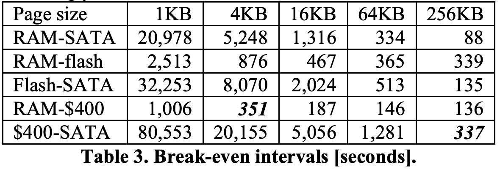

## AI论文解读 | The five-minute rule twenty years later, and how flash memory changes the rules
        
### 作者        
digoal        
        
### 日期        
2025-10-24        
        
### 标签        
PostgreSQL , PolarDB , DuckDB , AI , 论文解读        
        
----        
        
## 背景  
      
https://dl.acm.org/doi/pdf/10.1145/1363189.1363198        
  
提示:          
```          
读懂《The five-minute rule twenty years later, and how flash memory changes the rules》这篇论文需要提前掌握哪些基础知识, 请使用中文通熟易懂的讲解这些基础知识, 可以引用论文中的图、表或使用Markdown支持的图形(text,mermaid等)增加解释性. 
  
使用中文通熟易懂的解读《The five-minute rule twenty years later, and how flash memory changes the rules》这篇论文, 其中的关键内容请着重讲解, 可以引用论文中的图、表或使用Markdown支持的图形(text,mermaid等)增加解释性. 
  
提取《The five-minute rule twenty years later, and how flash memory changes the rules》这篇论文中的重要术语, 使用中文对这些术语进行通熟易懂的讲解, 可以引用论文中的图、表或使用Markdown支持的图形(text,mermaid等)增加解释性. 
```     
  
## 1 前置知识 
  
理解这篇论文《The five-minute rule twenty years later, and how flash memory changes the rules》，需要你对计算机系统，特别是存储和数据库有一些基础认识。这篇论文探讨的是一种新的存储技术（闪存）如何改变了系统设计的经典法则。

以下是你需要掌握的核心基础知识，我会用通俗的语言来解释：

### 1\. 存储分层结构 (Storage Hierarchy)

在计算机中，存储设备（用来存数据的地方）不是单一的。我们有一个“分层结构”，它基于一个简单的权衡：

  * **越快**的存储，**越贵**（每 GB 的价格），容量也**越小**。
  * **越慢**的存储，**越便宜**，容量也**越大**。

一个经典的分层结构（从快到慢）是：

1.  **CPU 缓存 (Cache)**：极快，极贵，极小。（集成在 CPU 里）
2.  **内存 (RAM)**：很快，很贵，中等容量。（你电脑的 8GB/16GB 内存条）
3.  **磁盘 (Disk)**：很慢，很便宜，容量巨大。（你电脑的 1TB 硬盘）

这篇论文的核心是，**闪存 (Flash Memory)**（比如你的 SSD 固态硬盘） 恰好插入到了内存和磁盘之间，它比内存慢但比磁盘快得多 。

你可以用一个金字塔来理解这个结构：

```text
      / \
     /CPU \  <-- 最快, 最贵, 最小
    /-----\
   /  RAM  \
  /---------\
 /  Flash  \  <-- 论文讨论的新层级 
/-----------\
/   Disk    \
/-------------\ <-- 最慢, 最便宜, 最大
```

### 2\. “五分钟法则” (The Five-Minute Rule)

这是论文标题的来源 ，也是一个经典的成本效益分析法则 。

  * **问题是**：对于一个数据页（Page，数据在磁盘和内存间移动的基本单位），我应该把它保存在昂贵的**内存 (RAM)** 中，还是让它留在便宜的**磁盘 (Disk)** 上，每次用的时候再去读取？
  * **法则的核心**：计算一个“收支平衡”的时间间隔 。如果一个数据页的**访问频率高于这个间隔**（比如，每 3 分钟就访问一次），那么把它一直放在内存里更划算 。如果访问频率低于这个间隔（比如，每 10 分钟才访问一次），那么就让它待在磁盘上，用的时候再读更划算 。
  * **为什么叫“五分钟”** ：在 1987 年，这个算出来的平衡点大约是 5 分钟 。

这篇论文重新计算了这个法则，发现随着技术变化，这个时间间隔已经变了（比如变成了 90 分钟），并且当引入闪存后，我们还需要计算 RAM-Flash 和 Flash-Disk 之间的新法则 。

### 3\. 缓冲区 (Buffer Pool / Cache)

这是理解“五分钟法则”和论文中“扩展缓冲区” 的关键。

  * **是什么**：缓冲区就是一块划出来的**内存 (RAM)**，用来**临时存放**从**磁盘 (Disk)** 上读出来的、最近可能要用的数据页。
  * **类比**：你的**办公桌**就是**缓冲区 (RAM)**，**地下室的仓库**就是**磁盘 (Disk)**。你不会每次要个文件都跑去地下室，你会把最近在用的文件都拿到桌上。
  * **LRU (Least Recently Used)**：当你的办公桌（缓冲区）满了，你需要腾个位置放新文件，你通常会把**最久没用过的**那个文件（LRU）放回地下室 。
  * **论文的“扩展缓冲区”(Extended Buffer Pool)**：这指的是把闪存  当作一个“二级办公桌”。桌上 (RAM) 放不下的，但又比地下室 (Disk) 里的文件常用，就放到这个“二级桌子” (Flash) 上 。

### 4\. 数据库 (DBMS) vs. 文件系统 (File System)

这篇论文的核心论点是：数据库和文件系统会（也应该）用不同的方式来使用闪存 。

  * **文件系统 (File System)**：
      * **作用**：管理你电脑上的文件和文件夹（比如 `C:\Windows` 或 `/home/user`）。
      * **特点**：它主要负责管理“字节流” (byte stream) 。
      * **崩溃恢复**：传统文件系统对文件*内容*的保护较弱 。如果系统崩溃，它主要依赖于小心的数据写入顺序  和重启后昂贵的“文件系统检查”  来保证*元数据*（比如文件名、目录结构）的一致性。
  * **数据库管理系统 (DBMS)**：
      * **作用**：管理*结构化*数据（比如银行账户、订单信息），并提供强大的保证。
      * **特点**：它不只是存数据，它还保证 **ACID**（原子性、一致性、隔离性、持久性）。
      * **崩溃恢复**：这是与文件系统的关键区别。数据库有两大法宝：**日志 (Log)** 和 **检查点 (Checkpoint)**。

### 5\. 数据库的持久性：日志与检查点

要理解为什么数据库适合把闪存当作“扩展磁盘”，你必须懂这两个概念：

1.  **预写日志 (Write-Ahead Logging, WAL)**

      * **类比**：想象你在修改一个重要的会计账本（数据库）。
      * **规则**：在你*真正*往账本上写数据（修改数据页）之前，你必须**先**在一个单独的“操作笔记”(Log) 上写下：“我准备把 A 账户减 100 元，B 账户加 100 元”。
      * **好处**：如果写到一半断电了（系统崩溃），你重启后，账本可能只改了一半（A 减了 100，B 没加）。这时，你只要翻看“操作笔记”(Log)，就能知道该如何撤销（Rollback）或重做（Redo），把账本恢复到一致的状态。

2.  **检查点 (Checkpoint)**

      * **背景**：数据修改通常先在**缓冲区 (RAM)** 中进行（因为快）。这些被修改过、但还没写回**磁盘 (Disk)** 的数据页被称为“脏页”(Dirty Page) 。
      * **作用**：如果从不把脏页写回磁盘，那重启后需要重放的“操作笔记”(Log) 就会越来越长，恢复时间会久到无法接受。
      * **过程**：“检查点”就是一个系统活动，它会周期性地（比如每隔几分钟） **强制** 把缓冲区中所有的“脏页”都写回到 **永久存储（磁盘）** 上 。
      * **论文的论点**：
          * 如果闪存是“扩展缓冲区”：那么脏页在闪存里，Checkpoint 启动时，必须把它从闪存读到 RAM，再写入到磁盘 。这非常低效。
          * 如果闪存是“扩展磁盘”（即永久存储）：那么 Checkpoint 启动时，只需要把 RAM 里的脏页写入到**闪存** 。这就完成了“持久化”，因为闪存也是永久存储 。这快得多 。

### 6\. B 树 (B-Tree)

这是数据库中最核心、最常用的索引结构 。

  * **是什么**：你可以把它想象成一本书（比如字典）的“目录”。它是一种树状结构，能让你极快地（通过几次查询）从几十亿条数据中找到你想要的那一条。
  * **页 (Page) / 节点 (Node)**：B 树是按“页”来存储的 。一个“页”就是 B 树的一个“节点”，它里面包含了很多个“键”(Key)。
  * **论文的论点 (页大小优化)**：
      * B 树的“页”应该多大？这取决于存储设备。
      * **传统磁盘 (Disk)**：磁盘最慢的是“寻道时间”（即移动磁头到正确位置），一旦磁头到位，多读一点数据的“传输时间”占比很小 。因此，磁盘喜欢**大页**（比如论文中算的 256KB），一次多读点数据更划算（见论文表 4 ）。    
      * **闪存 (Flash)**：闪存没有机械寻道，访问延迟很低 。它的“传输时间”占主要成本 。因此，闪存喜欢**小页**（比如论文中算的 2KB），每次只读需要的部分更划算（见论文表 5 ）。    

-----

### 总结

要读懂这篇论文，你需要带着以下问题：

1.  计算机存储系统是如何分层的？（金字塔结构）
2.  我们如何决定数据该放在哪一层？（五分钟法则的成本权衡）
3.  什么是缓冲区？（RAM 里的临时区域）
4.  数据库和文件系统在“崩溃了怎么办”这个问题上，有什么根本不同？（数据库有日志和检查点）
5.  数据库是如何快速查找数据的？（B 树）

理解了这些，你就能明白为什么论文作者会得出结论：闪存的出现，使得文件系统最好将其用作“扩展缓冲区”（一个大缓存），而数据库则最好将其用作“扩展磁盘”（一种快速的永久存储）。
  
## 2 解读论文 
  
这是一篇在数据库和系统领域非常经典的论文。它探讨了当一种新的存储技术——**闪存 (Flash Memory)**——出现时，我们应该如何重新思考计算机系统的设计，特别是经典的“五分钟法则”。

我将为你通俗地解读这篇论文的核心内容。

### 核心一：什么是“五分钟法则”？ (The Five-Minute Rule)

“五分钟法则”是 1987 年由吉姆·格雷 (Jim Gray) 和 Franco Putzolo 提出的一个经典理论 。

  * **核心问题：** 数据应该放在昂贵的**内存 (RAM)** 中，还是应该放在便宜但缓慢的**磁盘 (Disk)** 上，等需要时再读取？
  * **法则内容：** 这是一个成本权衡。他们计算了一个“盈亏平衡点”时间 。
      * 如果一个数据页（Page）的**访问频率高于这个时间**（比如每 3 分钟访问一次），那么把它一直保存在内存里更划算 。
      * 如果访问频率**低于这个时间**（比如每 10 分钟访问一次），那么就让它待在磁盘上，用的时候再读进来更划算 。
  * **为什么叫“五分钟”：** 在 1987 年，对于 1KB 大小的数据，这个算出来的平衡点大约是 400 秒，他们取整为 5 分钟 。

在 1997 年，作者们重算了这个法则，发现虽然硬件价格（如 RAM）暴跌 ，但对于 4KB 的页面，这个平衡点惊人地**仍然在 5 分钟左右** 。

这篇 2007 年的论文（也就是“二十年后”）的目的，就是再次审视这个法则，但这次有了一个新的“搅局者”：**闪存 (Flash)** 。

### 核心二：闪存 (Flash) 登场，改变了游戏规则

闪存在 2007 年是一种新技术（现在我们熟知的 SSD 固态硬盘就是基于它）。它的特性恰好填补了 RAM 和 Disk 之间的巨大鸿沟 。

我们可以用一个存储金字塔来看它的位置：

```text
      / \
     /CPU \  <-- 最快, 最贵
    /-----\
   /  RAM  \  <-- 很快, 较贵 (内存)
  /---------\
 /  Flash  \  <-- [新层级] 速度/价格居中 (闪存) 
/-----------\
/   Disk    \  <-- 最慢, 最便宜 (传统磁盘)
/-------------\
```

论文中的**表 2 (Table 2)**  非常清晰地对比了闪存和传统 SATA 磁盘：    

| 特性 (4KB 页面) | NAND 闪存 (Flash) | SATA 磁盘 (Disk) | 结论 |
| :--- | :--- | :--- | :--- |
| **每 GB 价格** | $31.20 | $0.32 | 闪存昂贵得多 |
| **读取时间** | 0.16 毫秒 | 12.01 毫秒 | 闪存快得多 (约 75 倍) |
| **每秒读取次数** | 6,200 次 | 83 次 | 闪存 IOPS 极高 |

闪存的出现，让系统设计者面临一个关键问题：我们到底该怎么用这个新东西？

### 核心三：如何使用闪存？（本文的核心论点）

作者提出了两种使用闪存的架构模型 ：

1.  **“扩展缓冲区” (Extended Buffer Pool)** 
      * **含义：** 把闪存当作 RAM 的一个“慢速扩展区” 。
      * **比喻：** 你的**办公桌**是 RAM（1GB），你又加了个**小推车**当闪存（8GB）。你的**文件仓库**是磁盘（250GB）。系统认为你有 1+8=9GB 的“桌面空间”（缓冲区），而仓库还是 250GB 。
2.  **“扩展磁盘” (Extended Disk)** 
      * **含义：** 把闪存当作磁盘的一个“快速缓存区”或“高速部分” 。
      * **比喻：** 你的**办公桌**还是 RAM（1GB）。但你的“文件仓库”升级了：仓库里加了一个**快速取件区**（闪存 8GB）和**普通存储区**（磁盘 250GB）。系统认为你的办公桌只有 1GB，但你的永久仓库变成了 8+250=258GB 。


**论文的核心论断是：** 操作系统和文件系统 (OS/File System) 会选择**模型一（扩展缓冲区）** ；而数据库系统 (Database) 则会选择**模型二（扩展磁盘）** 。

### 核心四：为什么数据库和文件系统的选择不同？

这是论文最精彩的论证。作者指出了两个根本原因：

#### 1\. Checkpoint (检查点) 的代价

  * **背景：** 数据库为了保证数据不丢失（持久性）和快速恢复，会定期执行 **Checkpoint** 。这个操作会强制把内存中被修改过的数据（称为“脏页”）写回到**永久存储**上 。
  * **对数据库的影响：**
      * **如果用模型一（扩展缓冲区）：** 闪存被视为“缓冲区”的一部分，不是永久存储 。如果一个“脏页”在闪存里，Checkpoint 时必须把它写到磁盘才算完。这个路径是：**闪存 $\rightarrow$ (读回) $\rightarrow$ 内存 $\rightarrow$ (写入) $\rightarrow$ 磁盘** 。这个过程增加了大量开销，非常低效 。
      * **如果用模型二（扩展磁盘）：** 闪存被视为“永久存储” 。当 Checkpoint 发生时，内存中的“脏页” **只需要写入到闪存** 就可以了 。这个路径是：**内存 $\rightarrow$ (写入) $\rightarrow$ 闪存**。这比写磁盘快得多 。
  * **结论：** 出于 Checkpoint 效率的考虑，数据库系统*必须*选择“扩展磁盘”模型 。而传统文件系统没有这种严格的 Checkpoint 机制，所以它们无所谓，可以选择“扩展缓冲区”模型 。

#### 2\. 页位置跟踪 (Page Location Tracking) 的效率

  * **背景：** 在一个分层存储中，数据页会在不同层级间移动（比如从闪存移动到磁盘）。系统必须能高效地跟踪每个页的“住址”。
  * **文件系统的方式：** 文件系统通常使用“指针页”来跟踪数据块。移动一个数据页，就意味着要更新这个指针页，这通常涉及一次昂贵的“随机写入”操作 。成本很高 。
  * **数据库的方式：** 数据库的核心结构是 **B-Tree (B 树)** 。在 B 树中，父节点天然就存储了子节点的“地址” 。当一个数据页（子节点）从闪存移动到磁盘，数据库**只需要更新其父节点中的一个指针** ，并将这个“修改”记录到日志 (Log) 中 。
  * **结论：** 数据库的 B 树结构使其“天生”就拥有了高效跟踪页面位置的能力，移动页面的成本极低（只是一次小的日志写入）。因此，数据库非常适合在“扩展磁盘”（闪存和磁盘）之间灵活地移动数据。

### 核心五：新的“五分钟法则”和最佳页大小

#### 1\. 最佳页大小 (Optimal Page Size)

论文指出，不同的设备，最佳的数据读写单位（页大小）是不同的：

  * **传统磁盘 (Disk)：** 磁盘最慢的是“寻道时间”（即移动磁头）。所以一旦磁头到位，一次性多读点数据才划算。因此，磁盘适合**非常大的页**（如 256KB 或 512KB）。 (见论文 **表 4** )    
  * **闪存 (Flash)：** 闪存没有机械寻道，访问延迟极低 。它的成本主要在数据传输上。因此，闪存适合**非常小的页**（如 2KB 或 4KB）。 (见论文 **表 5** )    

**结论：** 这意味着在一个同时拥有闪存和磁盘的数据库中，最好使用**两种不同的页大小** ，例如在 RAM 和闪存间用 4KB 小页，在闪存和磁盘间用 256KB 大页 。

#### 2\. “新”的五分钟法则

基于 2007 年的数据和新的存储层级，作者重新计算了“五分钟法则”（见论文 **表 3** ）：    

  * **RAM vs. 传统磁盘：** 对于 4KB 页面，平衡点已经变成了 **90 分钟** (5248 秒) ，不再是 5 分钟了。
  * **RAM vs. 闪存 (4KB 页)：** 平衡点大约是 **15 分钟** (876 秒) 。如果闪存未来降价（如论文中假设的 $400），这个值会降到 **6 分钟** (351 秒) 。
  * **闪存 vs. 磁盘 (256KB 页)：** 如果我们使用磁盘的最佳页大小 (256KB)，那么在闪存和磁盘之间的平衡点是 **337 秒** (约 5.6 分钟) 。

论文在摘要中承诺的**两个“新”五分钟法则**  指的就是最后这两个：

1.  **RAM $\leftrightarrow$ Flash：** 使用小页面（如 4KB），平衡点约为 6 分钟 。
2.  **Flash $\leftrightarrow$ Disk：** 使用大页面（如 256KB），平衡点约为 5.6 分钟 。

### 总结

这篇论文的核心贡献是：

1.  **引入闪存层：** 指出闪存 (Flash) 是介于 RAM 和 Disk 之间的一个关键新存储层级 。
2.  **划分架构：** 论证了文件系统应将闪存用作“扩展缓冲区”（临时缓存） ，而数据库应将其用作“扩展磁盘”（快速永久存储） 。
3.  **关键原因：** 这种划分是由数据库独特的**Checkpoint 机制**  和高效的 **B 树页跟踪**能力  决定的。
4.  **更新法则：** “五分钟法则”并没有过时，而是演变成了多个新法则，适用于存储体系中的不同层级和不同的页面大小 。
  
## 3 术语 
  
以下是《The five-minute rule twenty years later, and how flash memory changes the rules》这篇论文中的重要术语及其通俗易懂的中文讲解：

### 1\. 五分钟法则 (The Five-Minute Rule)

  * **出处：** 由 Jim Gray 和 Gianfranco Putzolo 在 1987 年提出 。
  * **通俗讲解：**
    这是一个经典的成本权衡法则，用来决定一个数据页（Page）是应该常驻在昂贵的**内存 (RAM)** 里，还是应该留在便宜的**磁盘 (Disk)** 上，等需要时再读取 。
    法S则的核心是计算一个“时间平衡点”（Break-even interval） 。如果一个数据页的访问频率**高于**这个时间（1987 年时大约是 5 分钟），那么把它一直放在内存里更划算 。如果访问频率**低于**这个时间，那么就让它待在磁盘上，用的时候再读更划算 。

### 2\. 闪存 (Flash Memory)

  * **通俗讲解：**
    一种新型存储技术（在 2007 年被认为是新事物） 。它的特性，如成本、访问延迟、传输速度、功耗等，恰好介于传统的 RAM（内存）和 Disk（磁盘）之间，填补了两者间的巨大空白 。我们现在熟知的 SSD（固态硬盘）就是基于闪存的。

  * **在存储层次中的位置：**
    闪存的出现，在经典的“内存-磁盘”两层结构之间增加了一个新的中间层 。

    ```mermaid
    graph TD
        A(RAM / 内存) --- B(Flash / 闪存);
        B --- C(Disk / 磁盘);
        subgraph "存储层次结构 "
            A["RAM (内存)<br/>最快, 最贵, 延迟最低 "]
            B["Flash (闪存)<br/>速度/价格/延迟 居中 "]
            C["Disk (磁盘)<br/>最慢, 最便宜, 延迟最高 "]
        end
    ```

### 3\. 扩展缓冲区 (Extended Buffer Pool)

  * **通俗讲解：**
    这是使用闪存的一种架构模型 。在这种模型下，系统把闪存看作是 **RAM（内存）的“扩展”** 。
  * **比喻 ：**
      * 你原来的系统有：1GB 内存 (RAM) 和 250GB 磁盘 (Disk)。
      * 你增加了一个 8GB 的闪存。
      * 在“扩展缓冲区”模型下，系统认为它拥有了一个 **9GB 的超大缓冲区**（1GB RAM + 8GB Flash），以及一个 250GB 的磁盘 。
  * **论文观点：** 作者认为，操作系统和文件系统会倾向于采用这种模型 。

### 4\. 扩展磁盘 (Extended Disk)

  * **通俗讲解：**
    这是使用闪存的另一种架构模型 。在这种模型下，系统把闪存看作是 **Disk（磁盘）的“扩展”** ，即永久存储的一部分 。
  * **比喻 ：**
      * 你原来的系统有：1GB 内存 (RAM) 和 250GB 磁盘 (Disk)。
      * 你增加了一个 8GB 的闪存。
      * 在“扩展磁盘”模型下，系统认为它的缓冲区**仍然只有 1GB**，但它拥有了一个 **258GB 的永久存储**（8GB Flash + 250GB Disk） 。
  * **论文观点：** 作者认为，数据库系统 (Database systems) 将从这种模型中获益最多 。

### 5\. 盈亏平衡间隔 (Break-even Interval)

  * **通俗讲解：**
    这就是“五分钟法则”里计算出来的那个“时间平衡点” 。它代表了两种成本的平衡：
    1.  **内存成本：** 把一个数据页永久保留在 RAM 里的成本 。
    2.  **I/O 成本：** 每次访问数据时，都从磁盘（或闪存）执行一次 I/O（读取）的成本 。
  * **论文中的新计算 (见表 3) ：**    
      * **RAM vs. 磁盘 (4KB 页)：** 平衡间隔在 2007 年已经变成了 5,248 秒（约 90 分钟），远超 5 分钟 。
      * **RAM vs. 闪存 (4KB 页)：** 平衡间隔约为 876 秒（约 15 分钟） 。
      * **闪存 vs. 磁盘 (256KB 页)：** 平衡间隔约为 337 秒（约 5.6 分钟） 。

### 6\. 访问延迟 (Access Latency) vs. 传输带宽 (Transfer Bandwidth)

  * **通俗讲解：**
    这是衡量存储设备性能的两个关键指标 。
      * **访问延迟 (Access Latency)：** 指从你“发出请求”到数据“开始响应”的等待时间。传统磁盘因为有机械臂寻道和盘片旋转，延迟很高（如 12 毫秒） 。闪存没有机械部件，延迟极低（如 0.1 毫秒） 。
      * **传输带宽 (Transfer Bandwidth)：** 指数据“开始响应”后，每秒能传输多少数据量 。

### 7\. 检查点 (Checkpoint)

  * **通俗讲解：**
    这是数据库系统为保证数据持久化和实现快速故障恢复的一种核心机制 。数据库会定期（比如每隔几分钟）执行一次 Checkpoint ，强制把内存缓冲区中所有被修改过（称为“脏页”）的数据**写回到永久存储**上 。
  * **与闪存的关系：**
    这是论文论证数据库应使用“扩展磁盘”模型的关键。
      * 如果闪存是“扩展缓冲区”，Checkpoint 时就必须把闪存中的“脏页”也写入磁盘，这需要先把数据从闪存读回内存，再写入磁盘 ，非常低效。
      * 如果闪存是“扩展磁盘”（永久存储），Checkpoint 时只需要把内存中的“脏页”写入闪存即可 ，速度极快。

### 8\. B-Tree (B树)

  * **通俗讲解：**
    数据库中用于索引和存储数据的最核心、最常用的“主力”数据结构 。你可以把它想象成一个层层嵌套的、非常高效的“目录系统”，能让你在海量数据中快速找到目标 。
  * **与闪存的关系：**
    论文指出，B 树的“页大小”（Node size）应该根据存储介质的特性来优化 。
      * **磁盘 (见表 4)：** 访问延迟高，适合**大页**（如 256KB），一次多读点划算 。   
      * **闪存 (见表 5)：** 访问延迟低，适合**小页**（如 2KB），按需读取更高效 。    

### 9\. 页面效用 (Page Utility)

  * **通俗讲解：**
    这是论文中用来衡量 B 树页面大小是否优化的一个指标 。它衡量的是“收益/成本”比：
      * **收益 (Utility)：** 一个 B 树页面（节点）越大，包含的“目录项”就越多，查询时缩小搜索范围的效果就越好（用 $log(记录数)$ 来衡量） 。
      * **成本 (Time)：** 访问这个页面所需的时间（访问延迟 + 传输时间） 。
  * **结论：** 优化的页面大小，应该是在磁盘（表 4）或闪存（表 5）上能获得最高“效用/时间”比的那个 。
  
## 参考        
         
https://dl.acm.org/doi/pdf/10.1145/1363189.1363198    
        
<b> 以上内容基于DeepSeek、Qwen、Gemini及诸多AI生成, 轻微人工调整, 感谢杭州深度求索人工智能、阿里云、Google等公司. </b>        
        
<b> AI 生成的内容请自行辨别正确性, 当然也多了些许踩坑的乐趣, 毕竟冒险是每个男人的天性.  </b>        
    
#### [期望 PostgreSQL|开源PolarDB 增加什么功能?](https://github.com/digoal/blog/issues/76 "269ac3d1c492e938c0191101c7238216")
  
  
#### [PolarDB 开源数据库](https://openpolardb.com/home "57258f76c37864c6e6d23383d05714ea")
  
  
#### [PolarDB 学习图谱](https://www.aliyun.com/database/openpolardb/activity "8642f60e04ed0c814bf9cb9677976bd4")
  
  
#### [PostgreSQL 解决方案集合](../201706/20170601_02.md "40cff096e9ed7122c512b35d8561d9c8")
  
  
#### [德哥 / digoal's Github - 公益是一辈子的事.](https://github.com/digoal/blog/blob/master/README.md "22709685feb7cab07d30f30387f0a9ae")
  
  
#### [About 德哥](https://github.com/digoal/blog/blob/master/me/readme.md "a37735981e7704886ffd590565582dd0")
  
  

  
