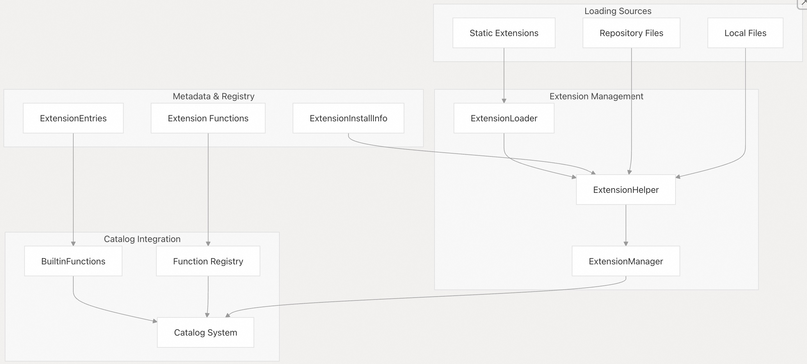
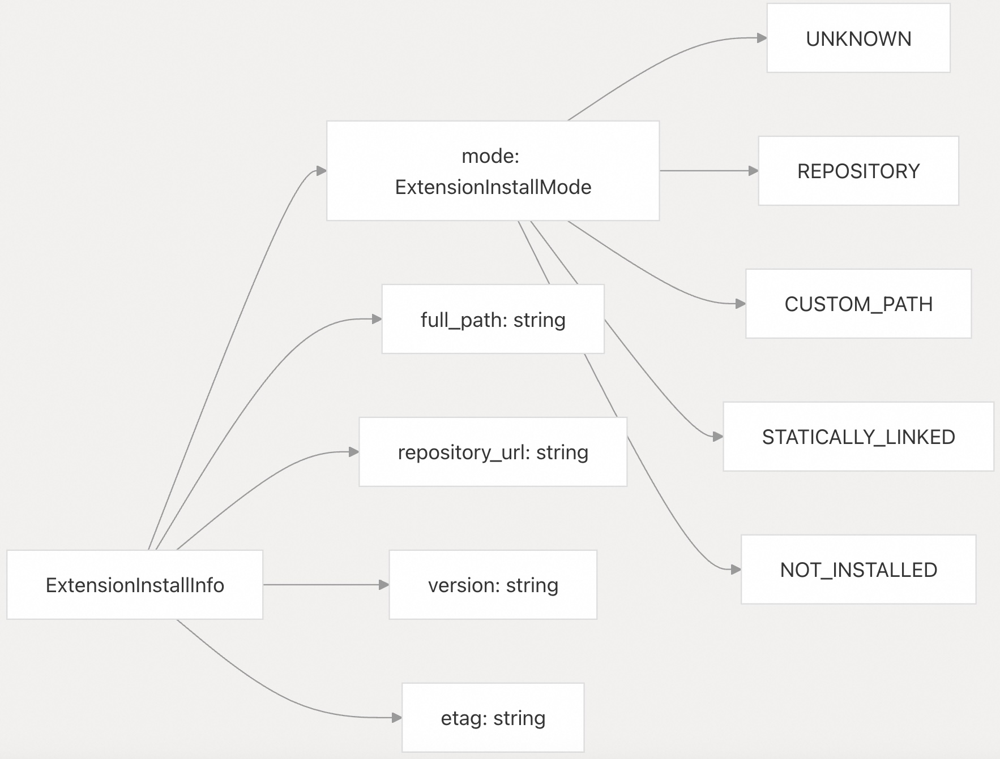
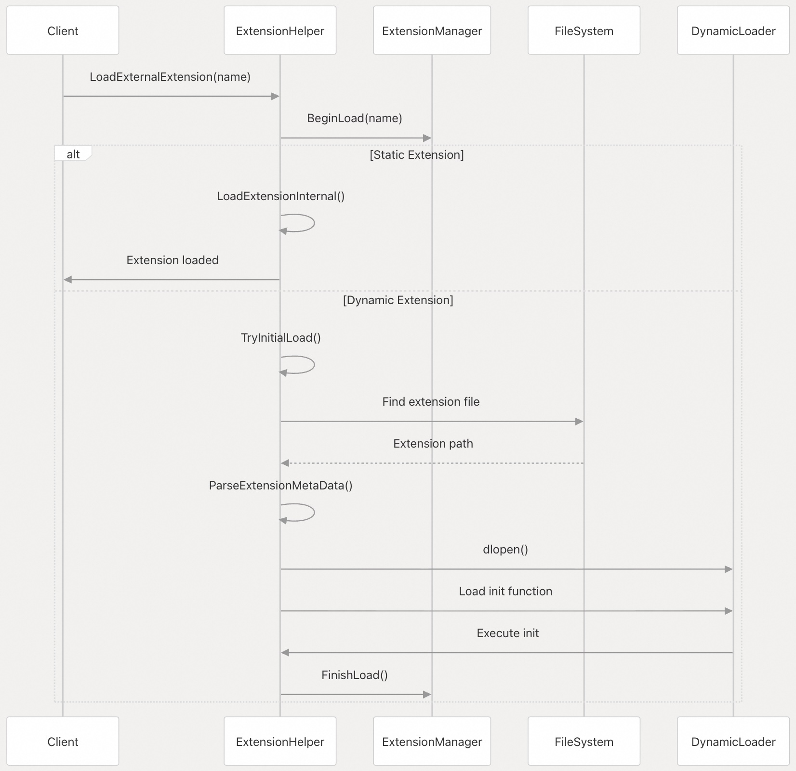
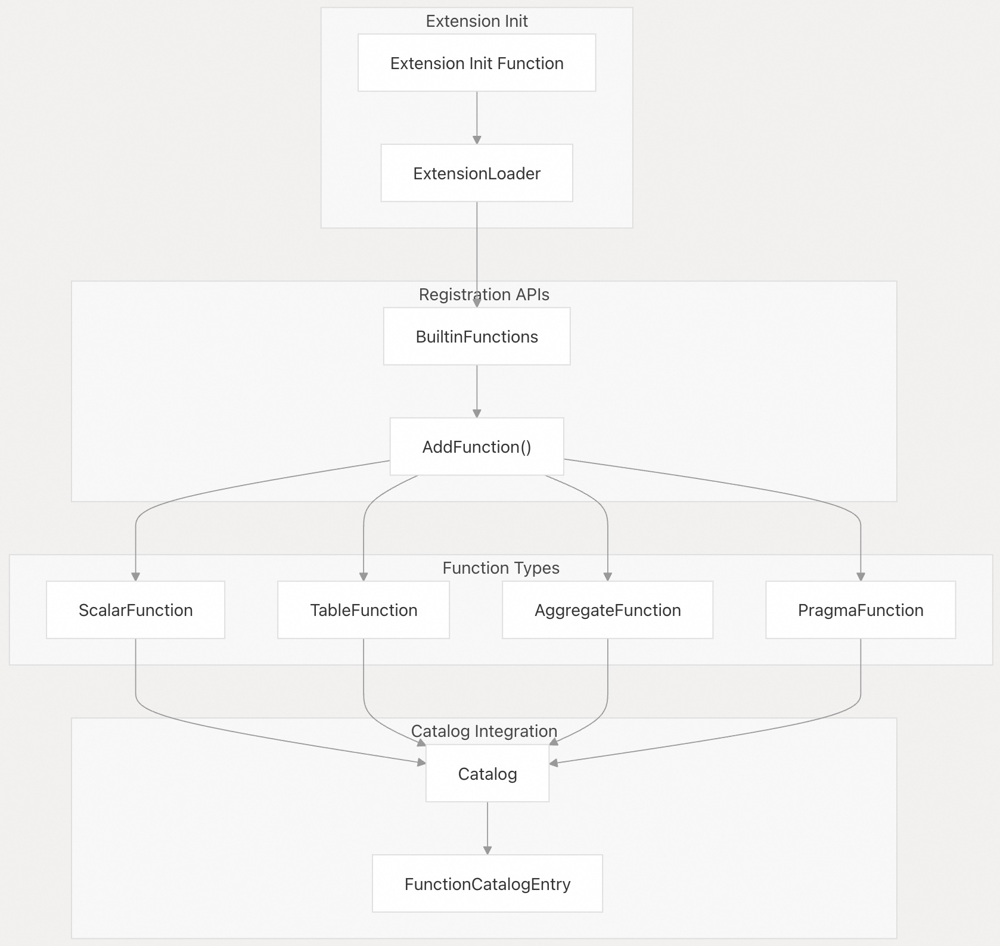

## DuckDB 源码学习: 6.1 扩展架构与开发 (Extension Architecture and Development)   
      
### 作者      
digoal      
      
### 日期      
2025-10-24      
      
### 标签      
DuckDB , 源码学习      
      
----      
      
## 背景      
本文详细介绍 DuckDB 的扩展系统，重点介绍 `ExtensionHelper` 类、扩展注册机制，以及创建自定义扩展的实用指南。扩展允许 DuckDB 提供额外功能，这些功能可以在构建时静态集成，也可以在运行时动态加载。  
  
来自官方和社区的扩展可参考:   
- https://duckdb.org/docs/stable/core_extensions/overview  
- https://duckdb.org/community_extensions/  
  
## 扩展分类    
DuckDB 根据扩展的分发和维护模式支持多种扩展类别：  
  
### 树内（In-Tree）与树外（Out-of-Tree）扩展    
**树内扩展** 位于 DuckDB 主仓库的 `extension/` 目录下。这些扩展被视为 DuckDB 的核心组成部分，与主代码库紧密耦合。    
**树外扩展** 存在于独立的代码仓库中，可分为以下几类：  
- **DuckDB 管理的树外扩展（DuckDB Managed OOTEs）**：由 DuckDB 团队维护，通过 DuckDB 的持续集成（CI）系统分发，并使用 DuckDB 的密钥进行签名。  
- **外部树外扩展（External OOTEs）**：由第三方独立维护，拥有自己的 CI/CD 流水线。  
  
### 加载方式    
扩展可通过两种主要方式集成：  
  
**静态链接（Static Linking）**：扩展直接编译进 DuckDB 二进制文件中，在启动时自动可用。`DefaultExtension` 结构体用于追踪这些扩展：  
  
| 字段 | 说明 |  
|------|------|  
| `name` | 扩展标识符 |  
| `description` | 人类可读的描述 |  
| `statically_loaded` | 是否已构建进二进制文件中 |  
  
**动态加载（Dynamic Loading）**：扩展在运行时从 `.duckdb_extension` 文件中加载，为可选功能提供灵活性。  
  
来源：  
- [`src/include/duckdb/main/extension_helper.hpp` 第23-28行](https://github.com/duckdb/duckdb/blob/05a2403c/src/include/duckdb/main/extension_helper.hpp#L23-L28)  
- [`extension/README.md` 第14-32行](https://github.com/duckdb/duckdb/blob/05a2403c/extension/README.md#L14-L32)  
  
## 核心架构组件    
扩展系统由多个关键组件协同工作，以管理扩展的生命周期和功能：  
  
  
  
### ExtensionHelper 类    
`ExtensionHelper` 类是扩展操作的主要接口，提供以下静态方法：   
- 加载和安装扩展    
- 管理扩展目录和仓库    
- 解析扩展的元数据和签名    
- 根据函数使用情况自动加载扩展  
  
关键方法包括 `LoadExternalExtension()`、`InstallExtension()` 和 `AutoLoadExtension()`。  
  
### ExtensionManager    
`ExtensionManager` 负责在一个数据库实例中追踪已加载的扩展，维护扩展状态，并与目录系统协调进行函数注册。  
  
### 扩展元数据    
`ExtensionInstallInfo` 类用于记录安装详情。  
  
  
  
来源：  
- [`src/main/extension/extension_helper.cpp` 第1-10行](https://github.com/duckdb/duckdb/blob/05a2403c/src/main/extension/extension_helper.cpp#L1-L10)    
- [`src/include/duckdb/main/extension_install_info.hpp` 第34-54行](https://github.com/duckdb/duckdb/blob/05a2403c/src/include/duckdb/main/extension_install_info.hpp#L34-L54)  
- [`src/include/duckdb/main/extension_helper.hpp` 第93-256行](https://github.com/duckdb/duckdb/blob/05a2403c/src/include/duckdb/main/extension_helper.hpp#L93-L256)  
  
## 扩展加载流程    
扩展加载过程根据扩展来源和类型有所不同：  
  
  
  
### 加载阶段    
  
**发现阶段（Discovery Phase）**：系统通过多种策略搜索扩展：  
- **扩展目录**：默认位置为 `~/.duckdb/extensions/{version}/{platform}/`    
- **本地路径**：绝对路径或相对文件路径    
- **仓库 URL**：远程扩展仓库地址    
- **静态注册表**：编译进二进制文件的扩展列表    
  
**验证阶段（Validation Phase）**：扩展会经过安全性和兼容性检查：  
- 使用 `ExtensionHelper` 中存储的公钥进行签名验证    
- 验证平台和版本的兼容性    
- 从扩展文件的尾部（footer）解析元数据    
  
**初始化阶段（Initialization Phase）**：扩展通过以下任一方式注册其功能：  
- **C++ ABI**：扩展需实现 `{extension}_duckdb_cpp_init()` 函数    
- **C ABI**：扩展需实现 `{extension}_init_c_api()` 函数  
  
来源：  
- [`src/main/extension/extension_load.cpp` 第313-477行](https://github.com/duckdb/duckdb/blob/05a2403c/src/main/extension/extension_load.cpp#L313-L477)  
- [`src/main/extension/extension_load.cpp` 第519-554行](https://github.com/duckdb/duckdb/blob/05a2403c/src/main/extension/extension_load.cpp#L519-L554)    
- [`src/main/extension/extension_helper.cpp` 第428-538行](https://github.com/duckdb/duckdb/blob/05a2403c/src/main/extension/extension_helper.cpp#L428-L538)  
  
## 函数注册系统    
扩展通过 `BuiltinFunctions` 接口向 DuckDB 的目录系统注册其功能：  
  
  
  
### 自动加载机制    
当访问某些函数时，DuckDB 可以自动加载对应的扩展。系统通过 `EXTENSION_FUNCTIONS` 条目将函数名映射到提供该函数的扩展：  
- 函数调用会触发 `BindExtensionFunction()`    
- 系统从 `ExtensionFunctionEntry` 中识别出所需的扩展    
- 如果启用了自动加载，则调用 `ExtensionHelper::AutoLoadExtension()`    
- 在成功加载扩展后，系统会重新尝试绑定该函数    
  
自动加载行为由以下配置项控制：  
- `autoload_known_extensions`：启用已知扩展的自动加载    
- `autoinstall_known_extensions`：启用已知扩展的自动安装  
  
来源：  
- [`src/function/built_in_functions.cpp` 第99-127行](https://github.com/duckdb/duckdb/blob/05a2403c/src/function/built_in_functions.cpp#L99-L127)  
- [`src/function/built_in_functions.cpp` 第135-162行](https://github.com/duckdb/duckdb/blob/05a2403c/src/function/built_in_functions.cpp#L135-L162)   
- [`src/include/duckdb/main/extension_entries.hpp` 第42-1028行](https://github.com/duckdb/duckdb/blob/05a2403c/src/include/duckdb/main/extension_entries.hpp#L42-L1028)  
  
## 构建系统集成    
构建系统在编译时通过 CMake 模板生成扩展集成代码.   
  
### 生成的文件    
CMake 构建过程会创建多个文件以集成扩展：  
**扩展头文件**：[`src/main/extension/generated_extension_headers.hpp.in` 第1-3行](https://github.com/duckdb/duckdb/blob/05a2403c/src/main/extension/generated_extension_headers.hpp.in#L1-L3)，包含静态链接扩展所需的头文件。    
**扩展加载器**：[`src/main/extension/generated_extension_loader.cpp.in` 第1-25行](https://github.com/duckdb/duckdb/blob/05a2403c/src/main/extension/generated_extension_loader.cpp.in#L1-L25)，提供 `TryLoadLinkedExtension()` 函数，其中包含针对每个链接扩展的 switch 语句。  
  
### 配置文件    
扩展加载通过 CMake 配置文件控制：  
  
| 文件 | 用途 |  
|------|------|  
| `extension/extension_config.cmake` | 所有构建通用的基础配置 |  
| `extension/extension_config_local.cmake` | 本地开发者覆盖配置（被 Git 忽略） |  
| `.github/config/*.cmake` | CI 环境专用配置 |  
  
`duckdb_extension_load()` CMake 函数支持多种参数：    
- `DONT_LINK`：构建扩展但不静态链接    
- `SOURCE_DIR`：自定义扩展源码路径    
- `GIT_URL` / `GIT_TAG`：从远程 Git 仓库加载扩展  
  
### 扩展条目生成    
脚本 `scripts/generate_extensions_function.py` 分析已加载的扩展，生成 `extension_entries.hpp` 文件，将函数名映射到其所属扩展，以支持自动加载。  
  
来源：  
- [`src/main/extension/CMakeLists.txt` 第1-108行](https://github.com/duckdb/duckdb/blob/05a2403c/src/main/extension/CMakeLists.txt#L1-L108)   
- [`extension/extension_config.cmake` 第1-20行](https://github.com/duckdb/duckdb/blob/05a2403c/extension/extension_config.cmake#L1-L20)    
- [`scripts/generate_extensions_function.py` 第1-800行](https://github.com/duckdb/duckdb/blob/05a2403c/scripts/generate_extensions_function.py#L1-L800)  
      
#### [期望 PostgreSQL|开源PolarDB 增加什么功能?](https://github.com/digoal/blog/issues/76 "269ac3d1c492e938c0191101c7238216")
  
  
#### [PolarDB 开源数据库](https://openpolardb.com/home "57258f76c37864c6e6d23383d05714ea")
  
  
#### [PolarDB 学习图谱](https://www.aliyun.com/database/openpolardb/activity "8642f60e04ed0c814bf9cb9677976bd4")
  
  
#### [PostgreSQL 解决方案集合](../201706/20170601_02.md "40cff096e9ed7122c512b35d8561d9c8")
  
  
#### [德哥 / digoal's Github - 公益是一辈子的事.](https://github.com/digoal/blog/blob/master/README.md "22709685feb7cab07d30f30387f0a9ae")
  
  
#### [About 德哥](https://github.com/digoal/blog/blob/master/me/readme.md "a37735981e7704886ffd590565582dd0")
  
  

  
