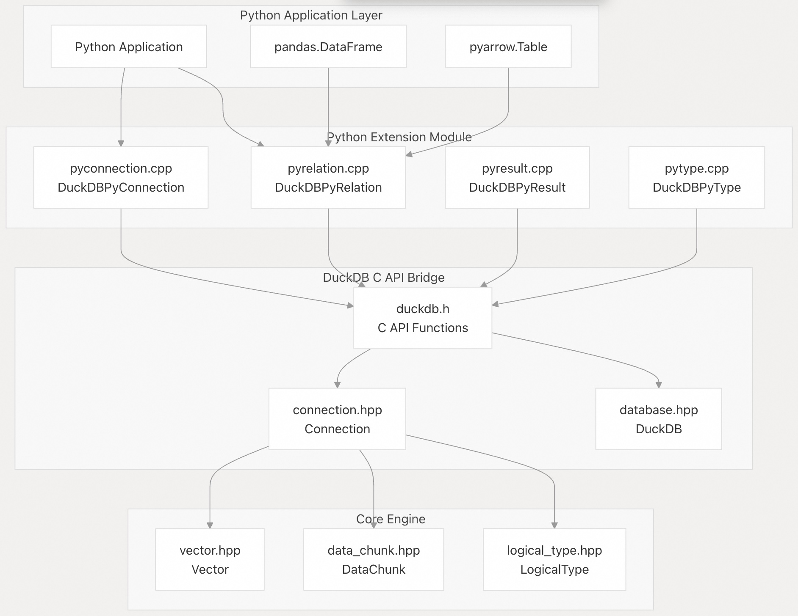
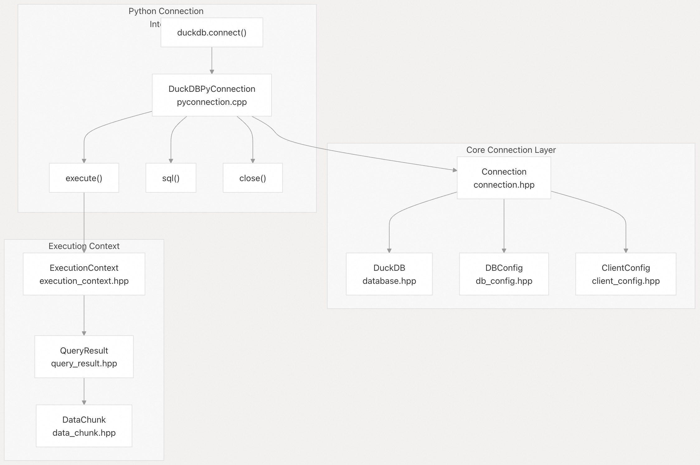
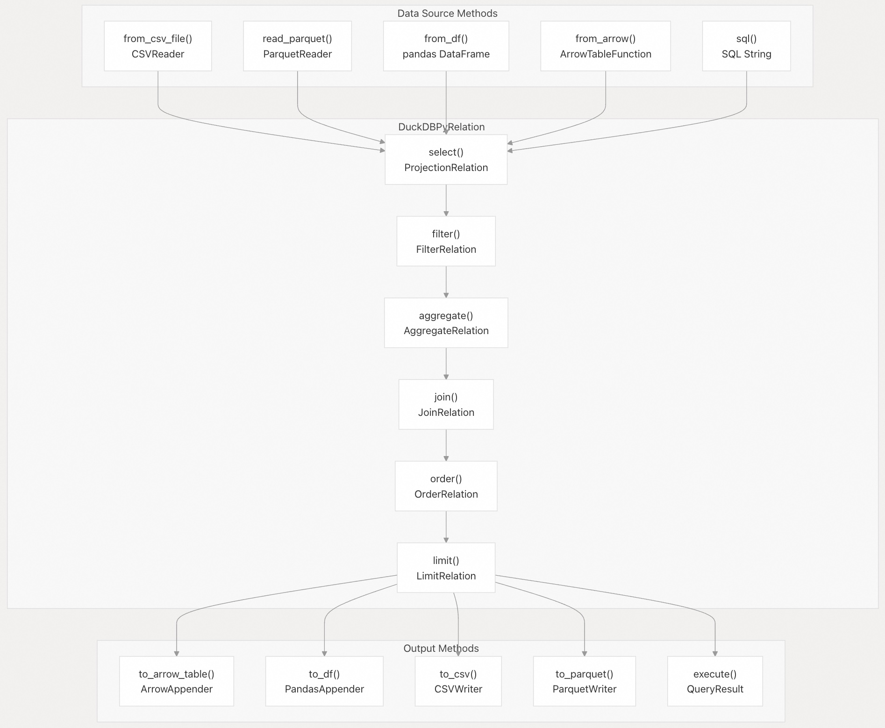
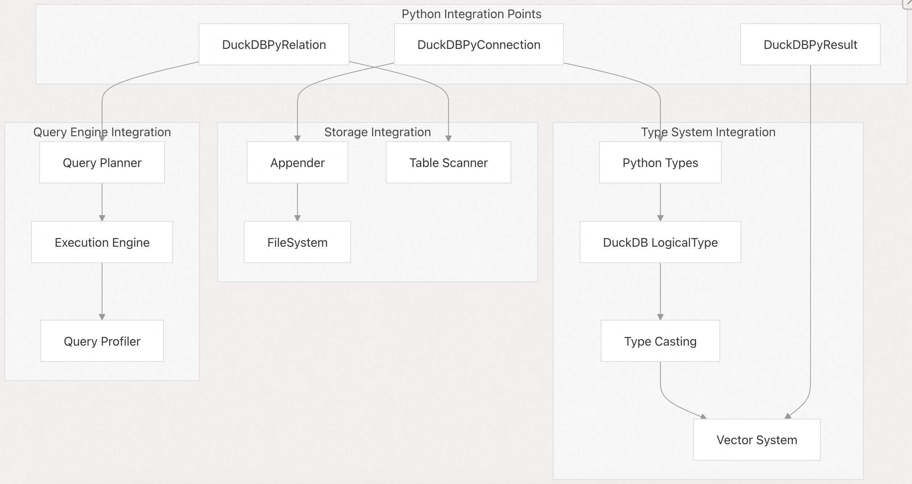

## DuckDB 源码学习: 7.1 Python API    
        
### 作者        
digoal        
        
### 日期        
2025-10-24        
        
### 标签        
DuckDB , 源码学习        
        
----        
        
## 背景        
Python API 为 Python 应用程序与 DuckDB 交互提供了主要接口。它实现了一个全面的绑定层，通过符合 Python 习惯的接口暴露 DuckDB 的分析能力，包括连接管理、SQL 执行，以及用于类 DataFrame 操作的关系型 API。  
  
## 架构概览  
  
Python API 以 C 扩展模块的形式实现，将 Python 的对象模型与 DuckDB 的核心执行引擎桥接起来。主要实现在 [`tools/pythonpkg/src/pyconnection.cpp`](https://github.com/duckdb/duckdb/blob/05a2403c/tools/pythonpkg/src/pyconnection.cpp) 及相关文件中，既提供底层数据库操作，也提供高层的关系型抽象。  
  
### Python API 实现架构  
  
    
  
Python API 由多个关键的 C++ 类组成，这些类被暴露为 Python 对象：  
- **DuckDBPyConnection**：主要的连接接口，位于 `tools/pythonpkg/src/pyconnection.cpp`  
- **DuckDBPyRelation**：提供类 DataFrame 的操作，位于 `tools/pythonpkg/src/pyrelation.cpp`  
- **DuckDBPyResult**：用于处理查询结果，位于 `tools/pythonpkg/src/pyresult.cpp`  
- **DuckDBPyType**：作为类型系统的桥梁，位于 `tools/pythonpkg/src/pytype.cpp`  
  
**源文件：**    
- [`tools/pythonpkg/src/pyconnection.cpp`](https://github.com/duckdb/duckdb/blob/05a2403c/tools/pythonpkg/src/pyconnection.cpp)    
- [`tools/pythonpkg/src/pyrelation.cpp`](https://github.com/duckdb/duckdb/blob/05a2403c/tools/pythonpkg/src/pyrelation.cpp)      
- [`tools/pythonpkg/src/pyresult.cpp`](https://github.com/duckdb/duckdb/blob/05a2403c/tools/pythonpkg/src/pyresult.cpp)      
- [`tools/pythonpkg/src/pytype.cpp`](https://github.com/duckdb/duckdb/blob/05a2403c/tools/pythonpkg/src/pytype.cpp)    
  
## 连接管理  
  
`DuckDBPyConnection` 类（位于 [`tools/pythonpkg/src/pyconnection.cpp`](https://github.com/duckdb/duckdb/blob/05a2403c/tools/pythonpkg/src/pyconnection.cpp)）是 Python 应用程序与 DuckDB 数据库交互的主要入口点。该类封装了核心引擎中的底层 `Connection` 和 `DuckDB` 对象。  
  
### 连接实现架构  
  
    
  
连接系统支持多种数据库配置：  
  
| 连接模式 | 实现方式 | 主要使用场景 |  
|----------|----------|--------------|  
| 内存模式 | `DuckDB()`（不传路径） | 分析与测试 |  
| 持久化模式 | `DuckDB(database_path)` | 生产应用 |  
| 只读模式 | `DBConfig.access_mode = READ_ONLY` | 共享数据分析 |  
  
`DuckDBPyConnection` 的关键方法包括：  
- **`execute(query)`**：直接执行 SQL 查询，返回 `DuckDBPyResult`    
- **`sql(query)`**：返回 `DuckDBPyRelation`，支持方法链式调用    
- **`from_df(df)`**：从 pandas DataFrame 创建关系/表（relation）    
- **`from_arrow(table)`**：从 PyArrow 表创建关系/表（relation）    
- **`install_extension(name)`**：动态加载 DuckDB 扩展  
  
**源文件：**    
- [`tools/pythonpkg/src/pyconnection.cpp`](https://github.com/duckdb/duckdb/blob/05a2403c/tools/pythonpkg/src/pyconnection.cpp)      
- [`src/include/duckdb/main/connection.hpp`](https://github.com/duckdb/duckdb/blob/05a2403c/src/include/duckdb/main/connection.hpp)      
- [`src/include/duckdb/main/database.hpp`](https://github.com/duckdb/duckdb/blob/05a2403c/src/include/duckdb/main/database.hpp)    
  
## 关系型 API  
  
`DuckDBPyRelation` 类（位于 [`tools/pythonpkg/src/pyrelation.cpp`](https://github.com/duckdb/duckdb/blob/05a2403c/tools/pythonpkg/src/pyrelation.cpp)）提供了一个类似 DataFrame 的接口，封装了核心的 `Relation` 类。该实现支持惰性求值和方法链式调用，同时与 Python 数据科学生态系统无缝集成。  
  
### 关系型操作流水线  
  
    
  
`DuckDBPyRelation` 类通过创建和链接 `Relation` 对象来实现以下核心操作：  
  
| 方法 | 对应的核心 Relation 类 | 描述 |  
|------|------------------------|------|  
| `select()` | `ProjectionRelation` | 列选择和表达式计算 |  
| `filter()` | `FilterRelation` | 使用 SQL 谓词进行行过滤 |  
| `aggregate()` | `AggregateRelation` | GROUP BY 与聚合函数 |  
| `join()` | `JoinRelation` | 多种策略的表连接 |  
| `order()` | `OrderRelation` | 多列排序 |  
| `limit()` | `LimitRelation` | 限制结果集大小 |  
  
每个操作都会返回一个新的 `DuckDBPyRelation` 实例，该实例封装了对应的核心 `Relation`，从而支持惰性求值，直到通过 `to_df()` 或 `execute()` 等输出方法进行物化。  
  
**源文件：**    
- [`tools/pythonpkg/src/pyrelation.cpp`](https://github.com/duckdb/duckdb/blob/05a2403c/tools/pythonpkg/src/pyrelation.cpp)      
- [`src/include/duckdb/main/relation.hpp`](https://github.com/duckdb/duckdb/blob/05a2403c/src/include/duckdb/main/relation.hpp)    
- [`src/main/relation/`](https://github.com/duckdb/duckdb/blob/05a2403c/src/main/relation/)  
  
## 与核心系统的集成  
  
Python API 通过 C API 桥接，与 DuckDB 的核心系统深度集成，在保持 Python 易用性的同时，提供对 DuckDB 全部功能的访问。  
  
    
  
关键集成功能包括：  
  
**类型系统集成（Type System Integration）：**  
- Python 类型与 DuckDB 类型之间的自动转换    
- 支持复杂类型（如列表、结构体、映射）    
- 空值（NULL）处理与类型强制转换    
- 与 NumPy 和 Arrow 类型系统的集成    
  
**数据传输优化（Data Transfer Optimization）：**  
- 尽可能实现零拷贝（zero-copy）数据传输    
- 对大数据集进行高效的批处理    
- 支持通过内存映射（memory-mapped）方式访问外部数据    
- 在列式数据上执行向量化操作    
  
**扩展系统访问（Extension System Access）：**  
- 动态加载 DuckDB 扩展    
- 调用扩展提供的函数    
- 支持从 Python 定义用户自定义函数（UDF）    
- 集成专用文件格式（如 Parquet、JSON、CSV 等）    
  
**查询优化（Query Optimization）：**  
- 下推（Pushdown）过滤条件和投影操作    
- 惰性求值与查询融合（query fusion）    
- 基于统计信息的查询优化    
- 并行执行的协调与调度  
  
**源文件：**    
- [`tools/pythonpkg/src/`](https://github.com/duckdb/duckdb/blob/05a2403c/tools/pythonpkg/src/)    
- [`src/include/duckdb/main/`](https://github.com/duckdb/duckdb/blob/05a2403c/src/include/duckdb/main/)    
- [`src/execution/`](https://github.com/duckdb/duckdb/blob/05a2403c/src/execution/)  
  
## 附: Lazy Evaluation(惰性求值) 在 DuckDB 中的应用  
  
### 1. Parquet 文件读取中的 Lazy Fetching  
  
在 Parquet 读取器中,DuckDB 实现了 lazy fetching 机制,只在真正需要时才读取数据:    
  
这种机制的工作原理是:当存在过滤器时,如果某列的所有元组都可以被跳过,则该列的缓冲区只在第一次实际读取时才会被获取。    
  
### 2. 多文件列表的 Lazy Expansion  
  
在处理文件 glob 模式时,DuckDB 使用 lazy expansion 来延迟文件列表的展开:    
  
注释中明确标注了 `FIXME: lazy expansion`, 表明这是一个待优化的 lazy evaluation 场景。   
  
### 3. 表达式的 Lazy Folding  
  
C API 提供了表达式折叠功能,可以检查表达式是否可折叠,并在需要时才进行折叠:   
  
`duckdb_expression_is_foldable` 函数允许在实际折叠之前检查表达式是否可折叠,这是一种 lazy evaluation 的模式。   
  
### 4. 深度优先求值策略  
  
DuckDB 采用深度优先(depth-first)的查询计划求值策略,这本质上是一种 lazy evaluation 的形式。    
  
这种策略确保在开始下一个操作的 Sink 阶段之前,先完成当前操作的 Finalize 阶段,避免同时创建大量中间结果。   
  
### 注意  
  
虽然代码库中出现了一些与 "lazy" 相关的其他概念(如 `LazyRE2` 正则表达式类和 jemalloc 的 `pages_purge_lazy`), 但这些与查询优化和数据处理中的 lazy evaluation 概念不同。   
  
DuckDB 的 lazy evaluation 主要体现在:  
- **按需数据加载**: 只在需要时读取数据块  
- **延迟计算**: 推迟不必要的计算直到结果真正被需要  
- **优化内存使用**: 通过深度优先求值减少内存压力  
  
这些机制共同提高了查询性能并降低了内存消耗。   
      
#### [期望 PostgreSQL|开源PolarDB 增加什么功能?](https://github.com/digoal/blog/issues/76 "269ac3d1c492e938c0191101c7238216")
  
  
#### [PolarDB 开源数据库](https://openpolardb.com/home "57258f76c37864c6e6d23383d05714ea")
  
  
#### [PolarDB 学习图谱](https://www.aliyun.com/database/openpolardb/activity "8642f60e04ed0c814bf9cb9677976bd4")
  
  
#### [PostgreSQL 解决方案集合](../201706/20170601_02.md "40cff096e9ed7122c512b35d8561d9c8")
  
  
#### [德哥 / digoal's Github - 公益是一辈子的事.](https://github.com/digoal/blog/blob/master/README.md "22709685feb7cab07d30f30387f0a9ae")
  
  
#### [About 德哥](https://github.com/digoal/blog/blob/master/me/readme.md "a37735981e7704886ffd590565582dd0")
  
  

  
