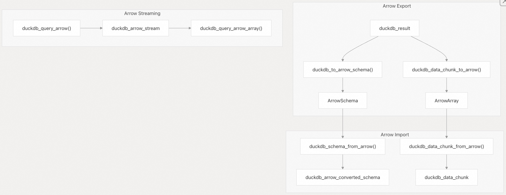

## DuckDB 源码学习: 7.2 C/C++ API     
          
### 作者          
digoal          
          
### 日期          
2025-10-24          
          
### 标签          
DuckDB , 源码学习          
          
----          
          
## 背景          
本文介绍 DuckDB 的 C/C++ API，这是将 DuckDB 嵌入 C 和 C++ 应用程序的主要编程接口。C API 是许多语言绑定的基础，并提供对 DuckDB 核心功能的直接访问，包括数据库管理、查询执行、数据导入/导出以及 Arrow 集成。  
  
## API 架构概览  
  
DuckDB 的 C API 被设计为围绕核心 C++ 引擎的一层轻量封装，在提供稳定 ABI 兼容性的同时，完整暴露数据库系统的全部功能。该 API 遵循 RAII（资源获取即初始化）原则，并支持同步和异步两种查询执行模式。  
  
### 核心 API 结构    
  
  
来源文件：    
- [`src/include/duckdb.h`（第 1–50 行）](https://github.com/duckdb/duckdb/blob/05a2403c/src/include/duckdb.h#L1-L50)    
- [`src/main/capi/duckdb-c.cpp`（第 1–30 行）](https://github.com/duckdb/duckdb/blob/05a2403c/src/main/capi/duckdb-c.cpp#L1-L30)    
- [`src/main/capi/capi_internal.hpp`（第 1–50 行）](https://github.com/duckdb/duckdb/blob/05a2403c/src/main/capi/capi_internal.hpp#L1-L50)  
  
### 主要 API 组件  
  
C API 围绕若干核心句柄类型组织，这些句柄直接映射到内部 C++ 类：  
  
| C API 句柄 | C++ 类 | 用途 |  
|------------|--------|------|  
| `duckdb_database` | `DatabaseInstance` | 数据库实例管理 |  
| `duckdb_connection` | `Connection` | 客户端连接与上下文 |  
| `duckdb_result` | `QueryResult` | 查询执行结果 |  
| `duckdb_prepared_statement` | `PreparedStatement` | 预编译查询语句 |  
| `duckdb_appender` | `Appender` | 高性能数据插入 |  
| `duckdb_config` | `DBConfig` | 数据库配置 |  
  
来源文件：    
- [`src/include/duckdb.h`（第 487–535 行）](https://github.com/duckdb/duckdb/blob/05a2403c/src/include/duckdb.h#L487-L535)    
- [`src/main/capi/capi_internal.hpp`（第 15–50 行）](https://github.com/duckdb/duckdb/blob/05a2403c/src/main/capi/capi_internal.hpp#L15-L50)  
  
## 数据库生命周期管理  
  
### 数据库创建与连接  
  
C API 遵循清晰的数据库操作生命周期模式，从数据库创建和连接建立开始。  
  
  
  
来源文件：    
- [`src/include/duckdb.h`（第 815–881 行）](https://github.com/duckdb/duckdb/blob/05a2403c/src/include/duckdb.h#L815-L881)    
- [`src/main/capi/duckdb-c.cpp`（第 15–80 行）](https://github.com/duckdb/duckdb/blob/05a2403c/src/main/capi/duckdb-c.cpp#L15-L80)  
  
### 配置系统  
  
数据库配置通过 `duckdb_config` 句柄进行，允许在初始化之前设置各种数据库参数，包括：  
- **内存设置**：缓冲池大小、临时目录    
- **线程设置**：工作线程数量    
- **扩展设置**：扩展加载路径    
- **访问模式**：只读模式、文件锁定行为  
  
来源文件：    
- [`src/include/duckdb.h`（第 945–1002 行）](https://github.com/duckdb/duckdb/blob/05a2403c/src/include/duckdb.h#L945-L1002)    
- [`src/main/capi/duckdb-c.cpp`（第 120–180 行）](https://github.com/duckdb/duckdb/blob/05a2403c/src/main/capi/duckdb-c.cpp#L120-L180)  
  
## 查询执行模式  
  
### 同步查询执行  
  
C API 通过 `duckdb_query()` 支持直接查询执行，该函数处理完整的查询生命周期并同步返回结果。  
  
  
  
来源文件：    
- [`src/main/capi/result-c.cpp`（第 200–300 行）](https://github.com/duckdb/duckdb/blob/05a2403c/src/main/capi/result-c.cpp#L200-L300)    
- [`src/include/duckdb.h`（第 1230–1350 行）](https://github.com/duckdb/duckdb/blob/05a2403c/src/include/duckdb.h#L1230-L1350)  
  
### 预编译语句（Prepared Statements）  
  
预编译语句提供带参数的查询执行方式，具备类型安全性和性能优势：  
  
  
  
来源文件：    
- [`src/main/capi/prepared-c.cpp`（第 72–200 行）](https://github.com/duckdb/duckdb/blob/05a2403c/src/main/capi/prepared-c.cpp#L72-L200)    
- [`src/include/duckdb.h`（第 1350–1550 行）](https://github.com/duckdb/duckdb/blob/05a2403c/src/include/duckdb.h#L1350-L1550)  
  
### 异步执行  
  
C API 通过“待处理结果”（pending results）支持异步查询执行，实现非阻塞的查询处理：  
  
  
  
来源文件：    
- [`src/main/capi/pending-c.cpp`（第 15–120 行）](https://github.com/duckdb/duckdb/blob/05a2403c/src/main/capi/pending-c.cpp#L15-L120)    
- [`src/include/duckdb.h`（第 146–152 行）](https://github.com/duckdb/duckdb/blob/05a2403c/src/include/duckdb.h#L146-L152)  
  
## 数据导入与导出  
  
### Appender 接口  
  
`duckdb_appender` 提供高性能的批量数据插入功能，绕过查询解析和优化开销：  
  
  
  
来源文件：    
- [`src/main/capi/appender-c.cpp`（第 18–200 行）](https://github.com/duckdb/duckdb/blob/05a2403c/src/main/capi/appender-c.cpp#L18-L200)    
- [`src/main/appender.cpp`（第 425–480 行）](https://github.com/duckdb/duckdb/blob/05a2403c/src/main/appender.cpp#L425-L480)  
  
Appender 是 C++ `BaseAppender` 类的封装，支持自动类型转换和批处理，以实现最佳性能。  
  
## Arrow 集成  
  
### Arrow C 数据接口  
  
DuckDB 的 C API 通过 Arrow C 数据接口与 Apache Arrow 无缝集成，实现零拷贝数据交换：  
  
  
  
关于Arrow的更多信息, 可参考:  
- [《数据库筑基课 - 列存之 Arrow, 面向内存 & "进程0拷贝/跨机无需序列化"共享数据 设计的列存》](../202501/20250127_01.md)    
  
来源文件：    
- [`src/main/capi/arrow-c.cpp`（第 19–150 行）](https://github.com/duckdb/duckdb/blob/05a2403c/src/main/capi/arrow-c.cpp#L19-L150)    
- [`src/include/duckdb.h`（第 715–760 行）](https://github.com/duckdb/duckdb/blob/05a2403c/src/include/duckdb.h#L715-L760)  
  
Arrow 集成支持以下功能：  
- **模式转换（Schema Conversion）**：DuckDB 与 Arrow 模式之间的双向转换    
- **数据传输（Data Transfer）**：通过 Arrow 数组实现零拷贝数据交换    
- **流式传输（Streaming）**：通过 Arrow 数组流进行分块数据流式传输    
- **类型映射（Type Mapping）**：在 DuckDB 与 Arrow 类型系统之间自动转换  
  
## ADBC 接口  
  
### Arrow 数据库连接（ADBC）  
  
DuckDB 实现了 Arrow 数据库连接（ADBC）标准，为 Arrow 原生数据库访问提供标准化接口：  
  
  
  
来源文件：    
- [`src/common/adbc/adbc.cpp`（第 22–100 行）](https://github.com/duckdb/duckdb/blob/05a2403c/src/common/adbc/adbc.cpp#L22-L100)    
- [`src/common/adbc/adbc.hpp`（第 1–50 行）](https://github.com/duckdb/duckdb/blob/05a2403c/src/common/adbc/adbc.hpp#L1-L50)  
  
ADBC 接口提供以下功能：  
- **标准化 API**：通过 ADBC 标准实现跨数据库兼容性    
- **原生 Arrow 支持**：直接进行 Arrow 数据交换，无需转换开销    
- **流式处理**：通过流式传输支持大型结果集    
- **连接池**：高效的连接管理  
  
## 扩展 API  
  
### C 扩展开发  
  
DuckDB 提供专用的 C API 用于扩展开发，使第三方开发者能够创建可加载的扩展：  
  
  
  
来源文件：    
- [`src/include/duckdb_extension.h`（第 70–400 行）](https://github.com/duckdb/duckdb/blob/05a2403c/src/include/duckdb_extension.h#L70-L400)    
- [`src/include/duckdb/main/capi/extension_api.hpp`（第 8–50 行）](https://github.com/duckdb/duckdb/blob/05a2403c/src/include/duckdb/main/capi/extension_api.hpp#L8-L50)  
  
扩展 API 支持以下功能：  
- **函数注册**：标量函数、聚合函数、表函数和类型转换（cast）函数    
- **类型系统**：自定义逻辑类型及操作符    
- **内存管理**：内存分配器集成与清理回调函数(cleanup handlers)    
- **错误处理**：结构化的错误报告与传播机制  
  
## 错误处理与内存管理  
  
### 错误处理  
  
C API 通过返回码和错误数据对象实现结构化的错误处理：  
  
  
  
来源文件：    
- [`src/include/duckdb.h`（第 1011–1045 行）](https://github.com/duckdb/duckdb/blob/05a2403c/src/include/duckdb.h#L1011-L1045)    
- [`src/include/duckdb.h`（第 194–239 行）](https://github.com/duckdb/duckdb/blob/05a2403c/src/include/duckdb.h#L194-L239)  
  
### 内存管理  
  
C API 中所有堆分配的对象都必须使用对应的 `duckdb_destroy_*()` 函数显式销毁，以防止内存泄漏。API 还提供了内存分配函数 `duckdb_malloc()` 和 `duckdb_free()`，用于统一的内存管理。  
  
来源文件：    
- [`src/include/duckdb.h`（第 1587–1593 行）](https://github.com/duckdb/duckdb/blob/05a2403c/src/include/duckdb.h#L1587-L1593)    
- [`src/main/capi/duckdb-c.cpp`（第 200–250 行）](https://github.com/duckdb/duckdb/blob/05a2403c/src/main/capi/duckdb-c.cpp#L200-L250)  
      
#### [期望 PostgreSQL|开源PolarDB 增加什么功能?](https://github.com/digoal/blog/issues/76 "269ac3d1c492e938c0191101c7238216")
  
  
#### [PolarDB 开源数据库](https://openpolardb.com/home "57258f76c37864c6e6d23383d05714ea")
  
  
#### [PolarDB 学习图谱](https://www.aliyun.com/database/openpolardb/activity "8642f60e04ed0c814bf9cb9677976bd4")
  
  
#### [PostgreSQL 解决方案集合](../201706/20170601_02.md "40cff096e9ed7122c512b35d8561d9c8")
  
  
#### [德哥 / digoal's Github - 公益是一辈子的事.](https://github.com/digoal/blog/blob/master/README.md "22709685feb7cab07d30f30387f0a9ae")
  
  
#### [About 德哥](https://github.com/digoal/blog/blob/master/me/readme.md "a37735981e7704886ffd590565582dd0")
  
  

  
