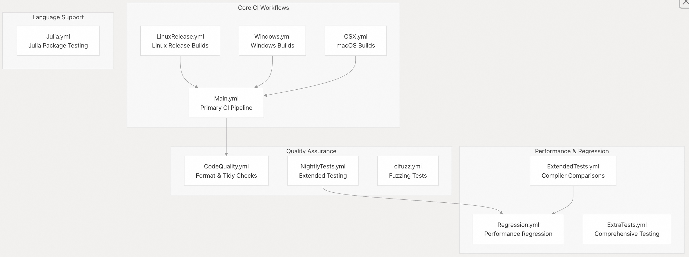
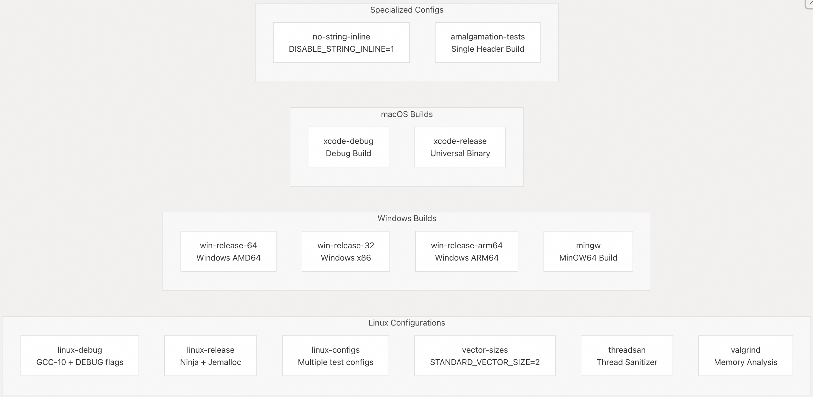
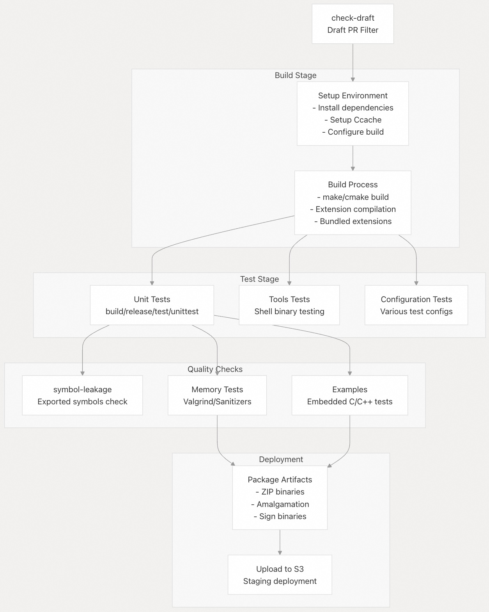
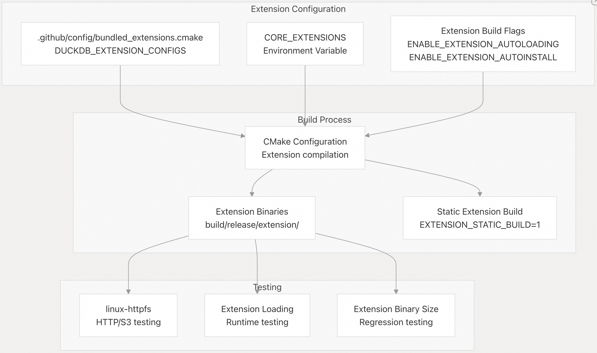
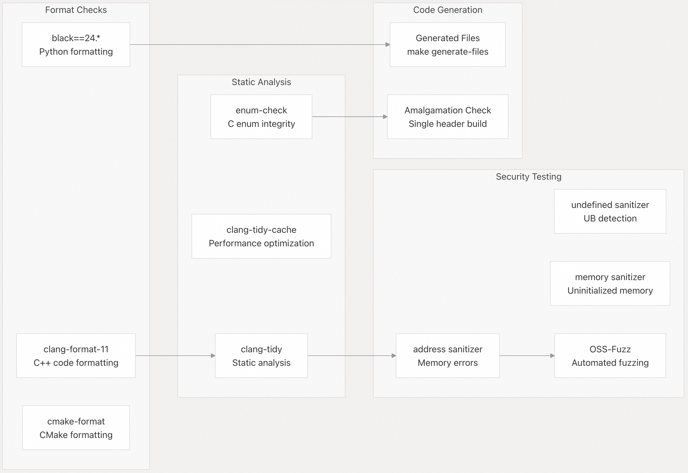
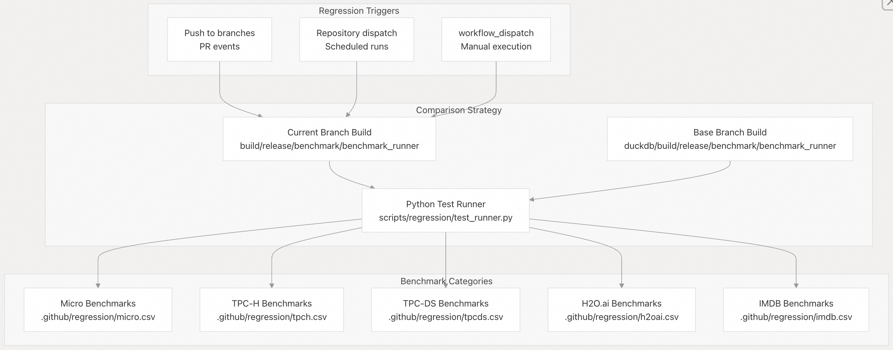
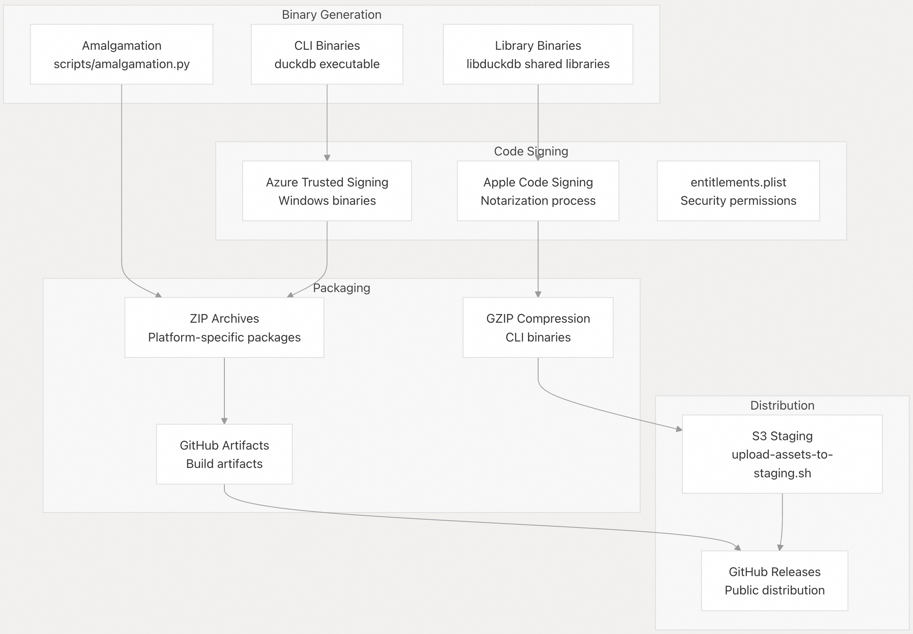

## DuckDB 源码学习: 8.1 CI/CD 流水线  
        
### 作者       
digoal      
     
### 日期    
2025-10-24    
      
### 标签      
DuckDB , 源码学习       
      
----      
      
## 背景     
本文介绍 DuckDB 通过 GitHub Actions 实现的全面 CI/CD（持续集成/持续交付）流水线。该流水线负责在多个平台和配置下构建、测试和发布 DuckDB，以确保代码质量、性能和安全性。    
  
## 概述    
DuckDB 的 CI/CD 流水线由多个 GitHub Actions 工作流组成，共同提供持续集成、测试和部署能力。该系统支持多种平台（Linux、Windows、macOS）、各种构建配置、全面的测试策略以及自动化的发布流程。  
  
## 工作流架构    
CI/CD 系统被组织为多个专用工作流，每个工作流服务于特定目的：    
  
  
  
来源文件：    
- [`.github/workflows/Main.yml`](https://github.com/duckdb/duckdb/blob/05a2403c/.github/workflows/Main.yml)    
- [`.github/workflows/LinuxRelease.yml`](https://github.com/duckdb/duckdb/blob/05a2403c/.github/workflows/LinuxRelease.yml)    
- [`.github/workflows/Windows.yml`](https://github.com/duckdb/duckdb/blob/05a2403c/.github/workflows/Windows.yml)    
- [`.github/workflows/OSX.yml`](https://github.com/duckdb/duckdb/blob/05a2403c/.github/workflows/OSX.yml)    
- [`.github/workflows/CodeQuality.yml`](https://github.com/duckdb/duckdb/blob/05a2403c/.github/workflows/CodeQuality.yml)    
- [`.github/workflows/NightlyTests.yml`](https://github.com/duckdb/duckdb/blob/05a2403c/.github/workflows/NightlyTests.yml)    
- [`.github/workflows/Regression.yml`](https://github.com/duckdb/duckdb/blob/05a2403c/.github/workflows/Regression.yml)  
  
## 平台与配置矩阵    
CI/CD 流水线通过矩阵策略支持多个平台和构建配置：    
  
  
  
来源文件：    
- [`.github/workflows/Main.yml`（第 47–285 行）](https://github.com/duckdb/duckdb/blob/05a2403c/.github/workflows/Main.yml#L47-L285)    
- [`.github/workflows/Windows.yml`（第 70–324 行）](https://github.com/duckdb/duckdb/blob/05a2403c/.github/workflows/Windows.yml#L70-L324)    
- [`.github/workflows/OSX.yml`（第 47–208 行）](https://github.com/duckdb/duckdb/blob/05a2403c/.github/workflows/OSX.yml#L47-L208)    
- [`.github/workflows/LinuxRelease.yml`（第 65–274 行）](https://github.com/duckdb/duckdb/blob/05a2403c/.github/workflows/LinuxRelease.yml#L65-L274)  
  
## 构建与测试流水线阶段    
每个工作流都遵循一个结构化的流水线，包含特定的阶段和依赖关系：    
  
  
  
来源文件：    
- [`.github/workflows/LinuxRelease.yml`（第 77–154 行）](https://github.com/duckdb/duckdb/blob/05a2403c/.github/workflows/LinuxRelease.yml#L77-L154)    
- [`.github/workflows/Main.yml`（第 77–95 行）](https://github.com/duckdb/duckdb/blob/05a2403c/.github/workflows/Main.yml#L77-L95)    
- [`.github/workflows/Windows.yml`（第 106–128 行）](https://github.com/duckdb/duckdb/blob/05a2403c/.github/workflows/Windows.yml#L106-L128)  
  
## 扩展与依赖管理    
CI 系统处理复杂的扩展构建和捆绑依赖项：   
  
  
  
来源文件：    
- [`.github/workflows/LinuxRelease.yml`（第 95–96 行）](https://github.com/duckdb/duckdb/blob/05a2403c/.github/workflows/LinuxRelease.yml#L95-L96)    
- [`.github/workflows/Main.yml`（第 104 行）](https://github.com/duckdb/duckdb/blob/05a2403c/.github/workflows/Main.yml#L104-L104)    
- [`.github/workflows/Regression.yml`（第 313–316 行）](https://github.com/duckdb/duckdb/blob/05a2403c/.github/workflows/Regression.yml#L313-L316)  
  
## 代码质量与安全流水线    
代码质量通过多项自动化检查来保障：    
  
  
  
来源文件：    
- [`.github/workflows/CodeQuality.yml`（第 50–156 行）](https://github.com/duckdb/duckdb/blob/05a2403c/.github/workflows/CodeQuality.yml#L50-L156)    
- [`.github/workflows/cifuzz.yml`（第 23–51 行）](https://github.com/duckdb/duckdb/blob/05a2403c/.github/workflows/cifuzz.yml#L23-L51)    
- [`.github/workflows/Main.yml`（第 289–316 行）](https://github.com/duckdb/duckdb/blob/05a2403c/.github/workflows/Main.yml#L289-L316)  
  
## 性能回归测试    
系统包含全面的性能回归检测机制：    
  
  
  
来源文件：    
- [`.github/workflows/Regression.yml`（第 56–176 行）](https://github.com/duckdb/duckdb/blob/05a2403c/.github/workflows/Regression.yml#L56-L176)    
- [`.github/workflows/NightlyTests.yml`（第 398–478 行）](https://github.com/duckdb/duckdb/blob/05a2403c/.github/workflows/NightlyTests.yml#L398-L478)    
- [`scripts/regression/test_runner.py`](https://github.com/duckdb/duckdb/blob/05a2403c/scripts/regression/test_runner.py)  
  
## 发布与部署流程    
部署流水线负责二进制分发和代码签名：    
  
  
  
来源文件：    
- [`.github/workflows/Windows.yml`（第 130–157 行）](https://github.com/duckdb/duckdb/blob/05a2403c/.github/workflows/Windows.yml#L130-L157)    
- [`.github/workflows/OSX.yml`（第 146–183 行）](https://github.com/duckdb/duckdb/blob/05a2403c/.github/workflows/OSX.yml#L146-L183)    
- [`.github/workflows/LinuxRelease.yml`（第 117–135 行）](https://github.com/duckdb/duckdb/blob/05a2403c/.github/workflows/LinuxRelease.yml#L117-L135)  
  
## 专用测试工作流    
多个工作流提供专门的测试能力：  
  
### 内存与存储测试   
  
流水线包含全面的内存安全性和存储验证：  
  
- **内存泄漏检测**：    
  通过名为 [`linux-memory-leaks`](https://github.com/duckdb/duckdb/blob/05a2403c/%60linux-memory-leaks%60) 的任务，使用 Python 测试脚本进行检测。  
  
- **存储初始化验证**：    
  通过 [`storage-initialization`](https://github.com/duckdb/duckdb/blob/05a2403c/%60storage-initialization%60) 任务，验证存储是否正确进行零初始化。  
  
- **块与向量大小测试**：    
  通过 [`vector-and-block-sizes`](https://github.com/duckdb/duckdb/blob/05a2403c/%60vector-and-block-sizes%60) 任务，使用不同的 `STANDARD_VECTOR_SIZE` 配置进行测试。  
  
### HTTP 与扩展测试    
  
远程文件访问和扩展功能通过以下方式验证：  
  
- **HTTPFS 测试**：    
  在 [`linux-httpfs`](https://github.com/duckdb/duckdb/blob/05a2403c/%60linux-httpfs%60) 任务中，使用 MinIO S3 服务器及代理进行测试。  
  
- **扩展更新验证**：    
  通过 [`extension-updating`](https://github.com/duckdb/duckdb/blob/05a2403c/%60extension-updating%60) 任务，验证扩展的元数据和分发机制。  
  
### 语言集成测试    
  
特定语言的工作流确保 API 兼容性：  
  
- **Julia 包测试**：    
  通过 [`Julia.yml`](https://github.com/duckdb/duckdb/blob/05a2403c/%60Julia.yml%60) 工作流，使用多个 Julia 版本构建并测试 Julia 版 DuckDB 包。  
  
- **Julia 集成**：    
  在主工作流中通过 `JULIA_DUCKDB_LIBRARY` 环境变量配置进行集成测试。    
  
在 Julia 工作流中,这个环境变量被设置为指向编译好的 DuckDB 共享库:   
  
```bash  
export JULIA_DUCKDB_LIBRARY="`pwd`/build/release/src/libduckdb.so"  
```  
  
这个变量的作用是让 Julia 包在测试时使用本地编译的 DuckDB 库,而不是预安装的版本。   
  
在 Julia 包的 API 代码中,可以看到它会检查这个环境变量:    
  
```julia  
if "JULIA_DUCKDB_LIBRARY" in keys(ENV)  
    libduckdb = ENV["JULIA_DUCKDB_LIBRARY"]  
else  
    using DuckDB_jll  
end  
```  
  
这是 Julia 开发和测试的标准做法, 文档中也有说明.    
  
来源文件：    
- [`.github/workflows/NightlyTests.yml`（第 40–364 行）](https://github.com/duckdb/duckdb/blob/05a2403c/.github/workflows/NightlyTests.yml#L40-L364)    
- [`.github/workflows/Julia.yml`（第 68–113 行）](https://github.com/duckdb/duckdb/blob/05a2403c/.github/workflows/Julia.yml#L68-L113)    
- [`.github/workflows/LinuxRelease.yml`（第 213–274 行）](https://github.com/duckdb/duckdb/blob/05a2403c/.github/workflows/LinuxRelease.yml#L213-L274)  
  
## 配置管理    
CI/CD 系统使用多种配置机制：  
  
| 配置类型 | 位置 | 用途 |  
|----------|------|------|  
| 扩展捆绑包 | `.github/config/bundled_extensions.cmake` | 定义发布版本中包含的扩展 |  
| 测试配置 | `test/configs/*.json` | 各类测试场景和设置 |  
| 回归基准 | `.github/regression/*.csv` | 性能回归测试套件 |  
| 构建环境 | 工作流 YAML 文件中的 `env` 节 | 编译器标志、构建选项、扩展等 |  
  
该系统通过以下方式支持条件执行：  
  
- **草稿 PR 检测(Draft PR Detection)** ：    
  `check-draft` 任务会过滤掉草稿状态的拉取请求（Pull Requests）。  
  
- **仓库检查(Repository Checks)** ：    
  基于 `github.repository == 'duckdb/duckdb'` 的条件逻辑，仅在主仓库中运行特定任务。  
  
- **分支过滤(Branch Filtering)** ：    
  对 `main` 分支、功能（`feature`）分支和发布（`release`）分支采用不同的执行行为。  
  
- **路径排除(Path Exclusions)** ：    
  当变更仅涉及文档或其他非代码文件时，跳过相关工作流。  
  
来源文件：    
- [`.github/workflows/Main.yml`（第 39–45 行）](https://github.com/duckdb/duckdb/blob/05a2403c/.github/workflows/Main.yml#L39-L45)    
- [`.github/config/bundled_extensions.cmake`](https://github.com/duckdb/duckdb/blob/05a2403c/.github/config/bundled_extensions.cmake)    
- [`test/configs/`](https://github.com/duckdb/duckdb/blob/05a2403c/test/configs/)    
- [`.github/regression/`](https://github.com/duckdb/duckdb/blob/05a2403c/.github/regression/)  
  
       
#### [期望 PostgreSQL|开源PolarDB 增加什么功能?](https://github.com/digoal/blog/issues/76 "269ac3d1c492e938c0191101c7238216")
  
  
#### [PolarDB 开源数据库](https://openpolardb.com/home "57258f76c37864c6e6d23383d05714ea")
  
  
#### [PolarDB 学习图谱](https://www.aliyun.com/database/openpolardb/activity "8642f60e04ed0c814bf9cb9677976bd4")
  
  
#### [PostgreSQL 解决方案集合](../201706/20170601_02.md "40cff096e9ed7122c512b35d8561d9c8")
  
  
#### [德哥 / digoal's Github - 公益是一辈子的事.](https://github.com/digoal/blog/blob/master/README.md "22709685feb7cab07d30f30387f0a9ae")
  
  
#### [About 德哥](https://github.com/digoal/blog/blob/master/me/readme.md "a37735981e7704886ffd590565582dd0")
  
  

  
