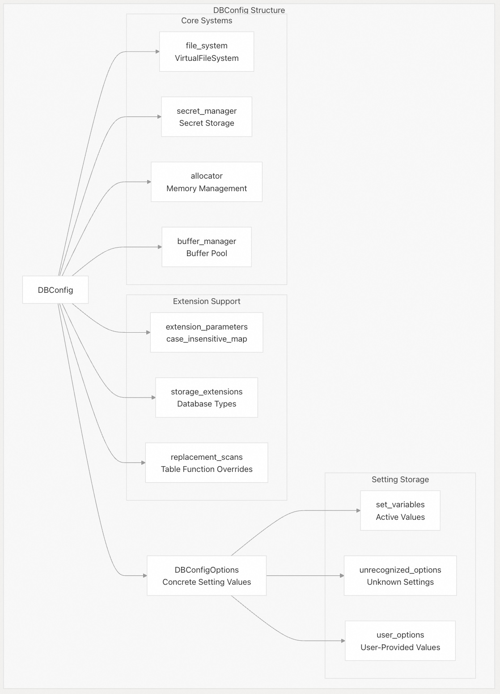
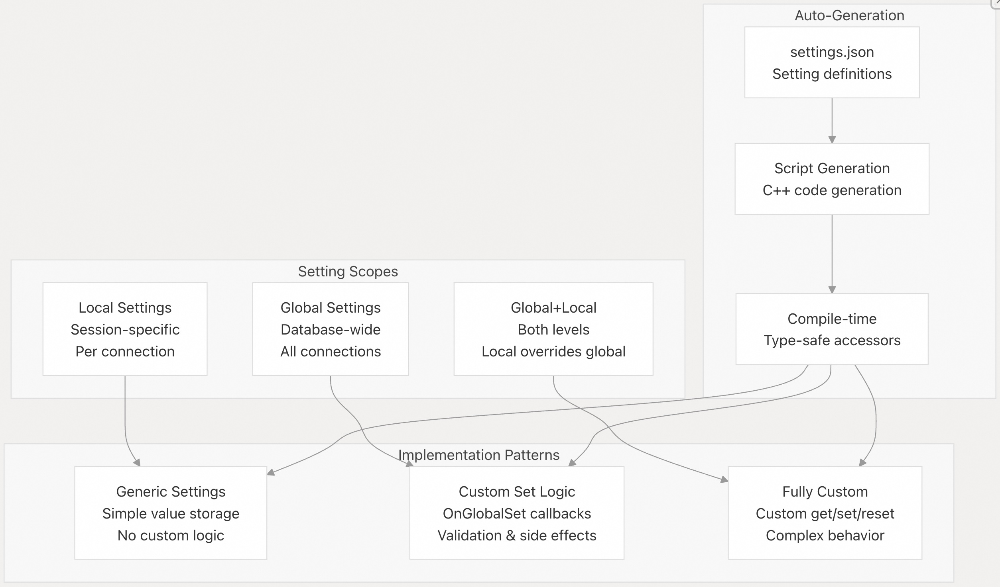
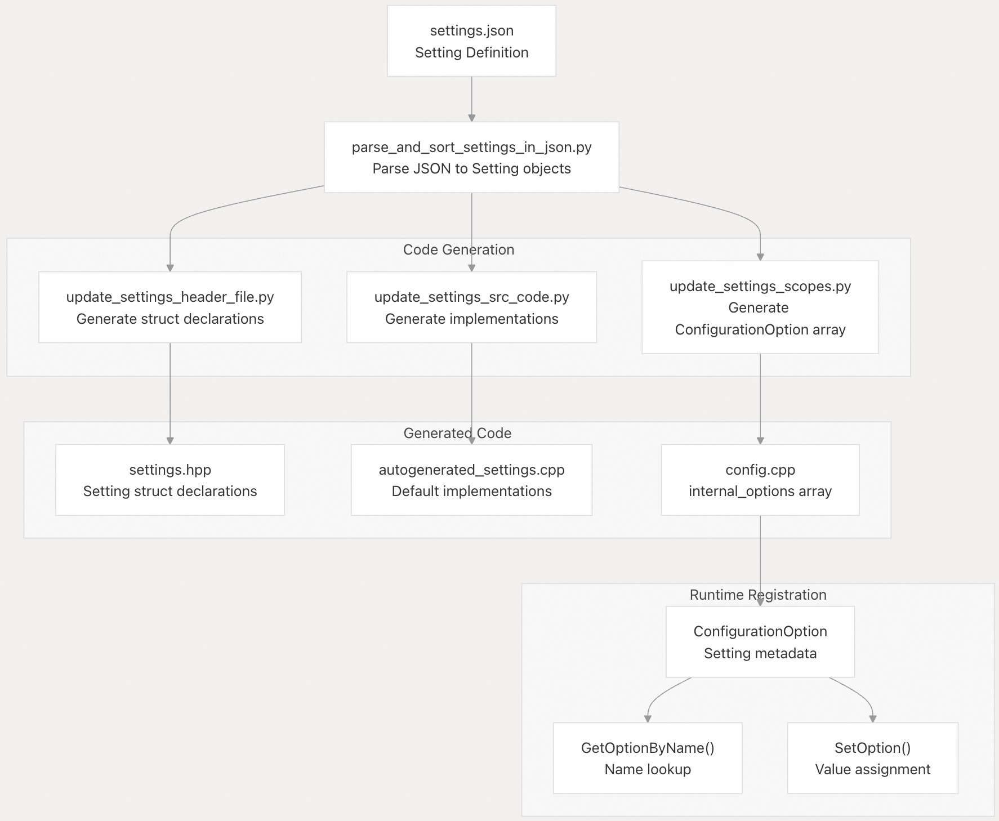
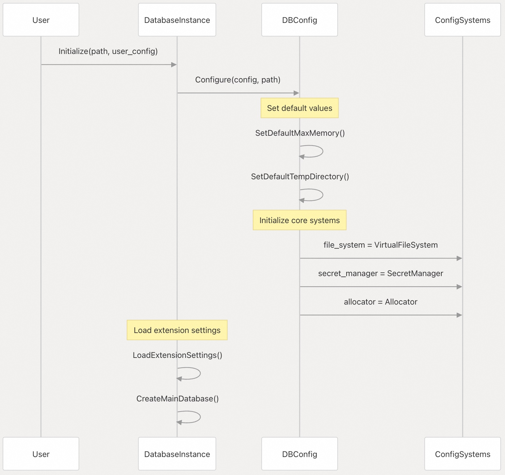
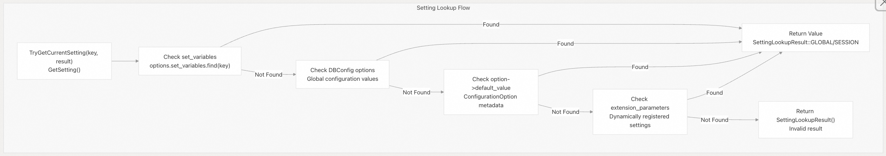
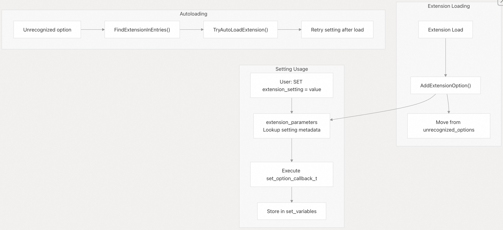

## DuckDB 源码学习: 8.2 配置系统(Configuration System)    
          
### 作者         
digoal        
       
### 日期      
2025-10-24      
        
### 标签        
DuckDB , 源码学习         
        
----        
        
## 背景    
DuckDB 中的配置系统用于管理数据库全局和客户端特定的设置，这些设置控制着系统行为、性能调优和功能启用。该系统提供了一个统一的接口，用于设置诸如内存限制、线程数量、访问模式和扩展参数等值。  
  
## 架构概览  
  
配置系统由两个主要组件构成：  
  
- **`DBConfig`**：用于数据库全局设置；  
- **`ClientConfig`**：用于会话级别的设置。  
  
这些设置以 JSON 格式定义，并自动生成类型安全的 C++ 代码。  
  
  
  
**源码位置：**    
- [`src/include/duckdb/main/config.hpp`（第 225–384 行）](https://github.com/duckdb/duckdb/blob/05a2403c/src/include/duckdb/main/config.hpp#L225-L384)    
- [`src/main/config.cpp`（第 58–177 行）](https://github.com/duckdb/duckdb/blob/05a2403c/src/main/config.cpp#L58-L177)    
- [`src/include/duckdb/main/client_config.hpp`（第 29–141 行）](https://github.com/duckdb/duckdb/blob/05a2403c/src/include/duckdb/main/client_config.hpp#L29-L141)  
  
## 配置类型  
  
### DBConfig —— 数据库全局设置  
  
`DBConfig` 管理影响所有连接的全局数据库设置，包括内存限制、线程数量、文件系统配置和扩展设置。  
  
  
  
**源码位置：**    
- [`src/include/duckdb/main/config.hpp`（第 87–223 行）](https://github.com/duckdb/duckdb/blob/05a2403c/src/include/duckdb/main/config.hpp#L87-L223)    
- [`src/main/config.cpp`（第 41–67 行）](https://github.com/duckdb/duckdb/blob/05a2403c/src/main/config.cpp#L41-L67)  
  
### ClientConfig —— 会话级设置  
  
`ClientConfig` 管理每个连接的设置，例如性能分析选项、进度条和查询特定行为，这些设置可在不同客户端之间变化。  
  
| 设置类别 | 示例 | 作用范围 |  
|----------|------|----------|  
| 查询执行 | `enable_optimizer`, `force_external` | 会话 |  
| 性能分析 | `enable_profiler`, `profiler_print_format` | 会话 |  
| 进度显示 | `enable_progress_bar`, `wait_time` | 会话 |  
| 验证 | `query_verification_enabled`, `verify_serializer` | 会话 |  
  
**源码位置：**    
- [`src/include/duckdb/main/client_config.hpp`（第 29–141 行）](https://github.com/duckdb/duckdb/blob/05a2403c/src/include/duckdb/main/client_config.hpp#L29-L141)  
  
## 设置的作用域与类型  
  
DuckDB 中的设置在不同作用域下运行，并具有多种实现模式：  
  
### 作用域类型  
  
  
  
**源码位置：**    
- [`src/common/settings.json`（第 1–50 行）](https://github.com/duckdb/duckdb/blob/05a2403c/src/common/settings.json#L1-L50)    
- [`src/main/settings/autogenerated_settings.cpp`（第 15–200 行）](https://github.com/duckdb/duckdb/blob/05a2403c/src/main/settings/autogenerated_settings.cpp#L15-L200)    
- [`scripts/settings_scripts/config.py`（第 16–30 行）](https://github.com/duckdb/duckdb/blob/05a2403c/scripts/settings_scripts/config.py#L16-L30)  
  
### 设置注册流程  
  
配置系统使用一种复杂的注册流程，将 JSON 定义与自动生成的 C++ 代码相结合：  
  
  
  
#### ConfigurationOption 结构  
  
`ConfigurationOption` 结构体作为每个设置的运行时元数据：  
  
| 字段 | 用途 | 示例 |  
|------|------|------|  
| `name` | 设置标识符 | `"access_mode"` |  
| `description` | 可读性描述 | `"数据库的访问模式"` |  
| `parameter_type` | SQL 类型字符串 | `"VARCHAR"` |  
| `set_global` | 全局设置函数指针 | `AccessModeSetting::SetGlobal` |  
| `set_local` | 本地设置函数指针 | `nullptr` |  
| `reset_global` | 全局重置函数指针 | `AccessModeSetting::ResetGlobal` |  
| `get_setting` | 获取值函数指针 | `AccessModeSetting::GetSetting` |  
  
#### 注册宏  
  
设置通过类型特定的宏在 `internal_options` 数组中注册：  
```  
// Generic setting with default value only  
DUCKDB_SETTING(SettingStruct)  
  
// Setting with callback validation    
DUCKDB_SETTING_CALLBACK(SettingStruct)  
  
// Global-only setting  
DUCKDB_GLOBAL(SettingStruct)  
  
// Local-only setting    
DUCKDB_LOCAL(SettingStruct)  
  
// Both global and local setting  
DUCKDB_GLOBAL_LOCAL(SettingStruct)  
```  
  
**源码位置：**    
- [`scripts/settings_scripts/parse_and_sort_settings_in_json.py`（第 15–55 行）](https://github.com/duckdb/duckdb/blob/05a2403c/scripts/settings_scripts/parse_and_sort_settings_in_json.py#L15-L55)    
- [`src/main/config.cpp`（第 25–51 行）](https://github.com/duckdb/duckdb/blob/05a2403c/src/main/config.cpp#L25-L51)   
- [`src/main/config.cpp`（第 187–259 行）](https://github.com/duckdb/duckdb/blob/05a2403c/src/main/config.cpp#L187-L259)    
- [`src/main/settings/autogenerated_settings.cpp`（第 1–50 行）](https://github.com/duckdb/duckdb/blob/05a2403c/src/main/settings/autogenerated_settings.cpp#L1-L50)  
  
## 配置生命周期  
  
### 数据库初始化  
  
在数据库启动期间，配置遵循特定的初始化顺序：  
  
  
  
**源码位置：**    
- [`src/main/database.cpp`（第 268–330 行）](https://github.com/duckdb/duckdb/blob/05a2403c/src/main/database.cpp#L268-L330)  
- [`src/main/database.cpp`（第 413–479 行）](https://github.com/duckdb/duckdb/blob/05a2403c/src/main/database.cpp#L413-L479)  
  
### 设置值解析  
  
当请求某个设置的值时，DuckDB 会通过关键函数按照特定的查找层级进行解析：  
  
#### 查找函数(Lookup Functions)  
  
| 函数 | 用途 | 上下文 |  
|------|------|--------|  
| `TryGetCurrentSetting()` | 检查设置是否存在并返回值 | 数据库/客户端 |  
| `GetOptionByName()` | 按名称查找 `ConfigurationOption` | 静态查找 |  
| `SetOption()` | 设置带验证的设置值 | 运行时 |  
| `GetSetting<T>()` | 类型安全的设置访问器 | 基于模板 |  
  
#### 解析层级(Resolution Hierarchy)  
  
  
  
#### 设置访问器模式(Setting Accessor Pattern)  
```  
// Type-safe template accessor  
template <class OP>  
static typename OP::RETURN_TYPE GetSetting(const SOURCE &source) {  
    return GetSettingInternal(source, OP::Name, OP::DefaultValue)  
           .template GetValue<typename OP::RETURN_TYPE>();  
}  
  
// Example usage  
auto access_mode = DBConfig::GetSetting<AccessModeSetting>(context);  
```  
  
**源码位置：**    
- [`src/main/config.cpp`（第 714–732 行）](https://github.com/duckdb/duckdb/blob/05a2403c/src/main/config.cpp#L714-L732)   
- [`src/main/config.cpp`（第 245–259 行）](https://github.com/duckdb/duckdb/blob/05a2403c/src/main/config.cpp#L245-L259)   
- [`src/main/config.cpp`（第 350–361 行）](https://github.com/duckdb/duckdb/blob/05a2403c/src/main/config.cpp#L350-L361)    
- [`src/include/duckdb/main/config.hpp`（第 350–361 行）](https://github.com/duckdb/duckdb/blob/05a2403c/src/include/duckdb/main/config.hpp#L350-L361)   
  
## 扩展配置  
  
扩展可以在运行时动态注册自己的配置参数：  
  
### 扩展参数注册  
  
扩展使用 `AddExtensionOption()` 来注册新的设置：  
```  
// Extension registers a custom parameter  
void AddExtensionOption(const string &name,   
                       string description,   
                       LogicalType parameter,  
                       const Value &default_value,  
                       set_option_callback_t function,  
                       SetScope default_scope);  
```  
  
### 扩展设置生命周期(Extension Setting Lifecycle)  
  
  
  
**源码位置：**    
- [`src/main/config.cpp`（第 440–454 行）](https://github.com/duckdb/duckdb/blob/05a2403c/src/main/config.cpp#L440-L454)     
- [`src/main/database.cpp`（第 219–262 行）](https://github.com/duckdb/duckdb/blob/05a2403c/src/main/database.cpp#L219-L262)     
- [`src/main/settings/custom_settings.cpp`（第 232–280 行）](https://github.com/duckdb/duckdb/blob/05a2403c/src/main/settings/custom_settings.cpp#L232-L280)   
  
## 内存与资源配置  
  
配置系统管理关键的资源限制：  
  
### 内存配置  
  
| 设置 | 用途 | 默认值计算方式 |  
|------|------|----------------|  
| `maximum_memory` | 总内存限制 | 系统内存的 80% |  
| `allocator_flush_threshold` | 峰值分配阈值 | 128 MB |  
| `allocator_bulk_deallocation_flush_threshold` | 批量释放限制 | 1 GB |  
| `buffer_manager_track_eviction_timestamps` | 驱逐时间戳追踪 | false |  
  
### 线程配置  
  
| 设置 | 用途 | 默认值计算方式 |  
|------|------|----------------|  
| `maximum_threads` | 总线程数 | 硬件并发数 |  
| `external_threads` | 外部任务线程数 | 1 |  
| `allocator_background_threads` | 后台分配器清理线程 | false |  
  
**源码位置：**    
- [`src/main/config.cpp`（第 483–536 行）](https://github.com/duckdb/duckdb/blob/05a2403c/src/main/config.cpp#L483-L536)    
- [`src/main/config.cpp`（第 538–571 行）](https://github.com/duckdb/duckdb/blob/05a2403c/src/main/config.cpp#L538-L571)    
- [`src/include/duckdb/main/config.hpp`（第 87–223 行）](https://github.com/duckdb/duckdb/blob/05a2403c/src/include/duckdb/main/config.hpp#L87-L223)   
  
#### allocator_flush_threshold  
  
**默认值**：134217728 字节（约 128MB）    
  
这个参数控制任务完成后刷新分配器的峰值分配阈值。当任务执行期间的内存分配达到此阈值时，任务完成后会触发分配器刷新操作。   
  
**工作原理**：  
- 在 `TaskScheduler` 中，后台线程在空闲 0.5 秒后会调用 `Allocator::ThreadFlush()` 来刷新该线程的未完成分配    
- 设置此参数会更新 `TaskScheduler` 的 `allocator_flush_threshold` 成员    
- 该阈值在 `TaskScheduler` 构造时从配置中初始化    
  
#### allocator_bulk_deallocation_flush_threshold  
  
**默认值**：536870912 字节（约 512MB，注释中说是 1GB 但实际代码是 512MB）    
  
此参数控制当发生大于此阈值的批量释放时，触发刷新未完成分配的操作。    
  
**工作原理**：  
- 在 `BufferPool` 中，当驱逐块时，如果额外内存请求超过此阈值，会调用 `Allocator::FlushAll()` 刷新所有线程的分配   
- `BufferPool` 在构造时接收此参数    
- 数据库初始化时将此配置传递给 `BufferPool`    
- 可以通过 `SetAllocatorBulkDeallocationFlushThreshold()` 动态更新    
  
#### external_threads  
  
**默认值**：1    
  
此参数指定在 DuckDB 任务上工作的外部线程数量，必须小于或等于 `maximum_threads`。    
  
**工作原理**：  
- 外部线程是指不由 DuckDB 内部创建的线程（如主线程），但会参与执行 DuckDB 任务    
- `TaskScheduler` 会启动 `total_threads - external_threads` 个后台工作线程    
- 当前线程总数计算为：`threads.size() + config.options.external_threads`    
- 设置此参数时会验证值必须非负，并调用 `TaskScheduler::SetThreads()` 重新配置线程    
  
这三个参数都是全局配置选项，在 `DBConfigOptions` 结构中定义。它们主要用于优化内存管理和线程调度性能。`allocator_flush_threshold` 和 `allocator_bulk_deallocation_flush_threshold` 都与内存分配器的刷新机制相关，但触发条件不同：前者基于任务执行期间的峰值分配，后者基于批量释放的大小。`external_threads` 则影响 DuckDB 内部创建的后台线程数量。  
       
#### [期望 PostgreSQL|开源PolarDB 增加什么功能?](https://github.com/digoal/blog/issues/76 "269ac3d1c492e938c0191101c7238216")
  
  
#### [PolarDB 开源数据库](https://openpolardb.com/home "57258f76c37864c6e6d23383d05714ea")
  
  
#### [PolarDB 学习图谱](https://www.aliyun.com/database/openpolardb/activity "8642f60e04ed0c814bf9cb9677976bd4")
  
  
#### [PostgreSQL 解决方案集合](../201706/20170601_02.md "40cff096e9ed7122c512b35d8561d9c8")
  
  
#### [德哥 / digoal's Github - 公益是一辈子的事.](https://github.com/digoal/blog/blob/master/README.md "22709685feb7cab07d30f30387f0a9ae")
  
  
#### [About 德哥](https://github.com/digoal/blog/blob/master/me/readme.md "a37735981e7704886ffd590565582dd0")
  
  

  
